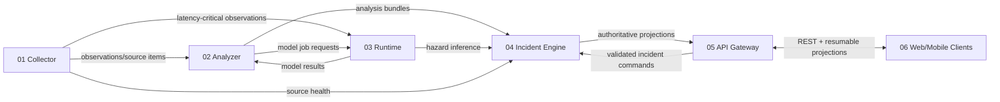

# Sentinel Edge — High-Level Functional Architecture

**Document ID:** SE-SYS-FPD-013  
**Version:** 0.13.0  
**Date:** 2026-07-26  
**Status:** Six-module product architecture and acceptance model  
**Supersedes:** monolithic SE-FPD-012 as the primary navigation document

> **Research MVP — not an official emergency-warning system. AI observations and forecasts may be wrong. Verify with authorized sources and contact emergency services when appropriate.**

## 1. Executive decision

Sentinel Edge remains a six-part product, but v0.13 converts each part into an independently packageable and testable module. The system uses a **modular-monolith-first, distributed-capable** strategy: the hackathon can compose all modules in one node/process set, while module contracts, state ownership and tests prevent hidden coupling.

The deliverable document set is:

1. one functional and one technical document for each of the six modules;
2. this high-level functional architecture;
3. the paired high-level technical architecture and integration specification.

## 2. The six product modules

| # | Module | Functional authority | Primary output |
|---|---|---|---|
| 01 | Streaming Source Collector | Acquire, validate, normalize and safely stage heterogeneous physical, official, scientific, publisher, authorized-platform, opt-in community and fixture inputs without deciding incident truth. | `ObservationEnvelope`, `ExternalSourceItem`, `SourceHealthEvent`, `AcquisitionAuditEvent` |
| 02 | Analysis & Enrichment Engine | Transform normalized source material into structured, traceable, uncertainty-bearing derived artifacts, claims, lineage and trust factors without deciding incident truth. | `AnalysisBundle`, `EvidenceClaim`, `MediaAnalysisRecord`, `EvidenceDerivationLink`, `EvidenceTrustAssessment` |
| 03 | Model & Workload Runtime | Execute validated deterministic and learned workloads under explicit Arm resource, latency, quality, provenance and safety envelopes. | `ModelResult`, `HazardInference`, `JobLifecycleEvent`, `RuntimeHealthEvent`, `BenchmarkSample` |
| 04 | Incident & Event Engine | Serve as the sole authority for hazard assessments, incident lifecycle, evidence/claim relationships, review decisions, alert budgets and durable side-effect intents. | `IncidentProjection`, `IncidentTransitionEvent`, `ReviewEvent`, `NotificationIntent`, `AfterEventReview` |
| 05 | REST API & Integration Gateway | Expose the sole supported client and third-party boundary through versioned resources, validated commands, authorization, privacy filtering and resumable projections. | `HTTP resources/responses`, `SSE/WebSocket projection events`, `OpenAPI document`, `audit context`, `accepted/rejected IncidentCommand` |
| 06 | Client Applications — Web + Mobile | Deliver one coherent, accessible and offline-aware operator experience through independently buildable web and mobile shells using the same generated contracts and domain semantics. | `API commands`, `upload/capture requests`, `local notification actions`, `client telemetry and accessibility evidence` |

## 3. Product interactions

### Product invariants

1. Module 01 is the only source connector/acquisition boundary.
2. Module 03 is the only release model-execution boundary.
3. Module 04 is the only incident lifecycle authority and writer.
4. Module 05 is the only supported client/third-party boundary.
5. Module 06 never reimplements server-side incident or trust logic.
6. Shared infrastructure cannot become a seventh domain authority.
7. Every interaction is versioned, traceable, idempotent where needed and testable without the whole system.

## 4. Independence requirements

Every module must:

- have its own package, build metadata, composition root, configuration schema and owned state;
- start with fake implementations of every external port;
- publish schemas/examples and provider/consumer test kits;
- include deterministic fixtures and a one-command component test;
- expose health/readiness/degradation and diagnostic snapshots;
- avoid imports from another module's internal package;
- avoid direct access to another module's database, filesystem namespace or secrets;
- support the compact in-process and isolated-process deployment profiles through the same ports.

## 5. Extensibility policy

Sentinel is pluggable **inside** each module rather than through one unbounded global plugin API. A plugin has one owner module, one capability type, a manifest, explicit permissions/resource budgets, conformance fixtures and a compatibility range. Plugins cannot add incident-write authority, bypass acquisition rights, load arbitrary models or expose alternate client mutation APIs.

Primary extension families:

| Module | Extension families |
|---|---|
| Streaming Source Collector | SourceConnectorPlugin; StreamDecoderPlugin; NormalizerPlugin; AcquisitionPolicyPlugin; SensorProtocolPlugin; QuarantineBackendPlugin |
| Analysis & Enrichment Engine | ExtractorPlugin; EnricherPlugin; ClaimExtractorPlugin; LineageResolverPlugin; TrustFactorPlugin; PrivacyTransformPlugin |
| Model & Workload Runtime | WorkloadPlugin; InferenceBackendPlugin; SchedulerPolicyPlugin; ResourceProbePlugin; PreprocessorPlugin; PostprocessorPlugin |
| Incident & Event Engine | HazardPolicyPack; IncidentMatcherPlugin; CorroborationPolicyPlugin; ReviewPolicyPlugin; ProjectionBuilderPlugin; EffectAdapterPlugin |
| REST API & Integration Gateway | AuthProviderPlugin; AuthorizationPolicyPlugin; ProjectionTransportPlugin; ExportFormatPlugin; ReadResourcePlugin; RateLimitPolicyPlugin |
| Client Applications — Web + Mobile | EvidenceRendererPlugin; CaptureProviderPlugin; NotificationAdapterPlugin; LocalizationPackPlugin; ReadOnlyPanelPlugin; OfflineStorePlugin |

New hazards are delivered as a coordinated **hazard extension pack** containing collector mappings, analysis recipes, runtime workloads, an Incident Engine hazard policy pack, API schemas/projections and client vocabulary/renderers. The pack is a release bundle of six module-scoped plugins/contracts—not a seventh module and not one omnipotent plugin.

## 6. End-to-end user journeys

### Physical hazard hot path

Physical capture enters the Collector, becomes a validated observation, runs a bounded Runtime workload, reaches the Incident Engine's hazard policy and appears through the API to clients. The Analyzer is optional on this path when semantic enrichment is unnecessary.

### External multimodal intelligence path

A rights-gated source item enters quarantine, is interpreted by the Analyzer using bounded Runtime jobs, becomes a traceable AnalysisBundle, and may create a lead or corroborate/contradict an incident under Incident Engine rules. It cannot independently create official/verified/safe state.

### Operator review

The client reads an authoritative projection, submits an idempotent command to the API, the Incident Engine validates expected version and policy, appends a review/transition, and publishes a new projection. The same correlation ID reconstructs the workflow.

### Offline and recovery

Local sensing, inference, incident state and client dashboard continue without remote sources. After restart, modules reconcile owned inbox/outbox/cursors and declare readiness before fresh escalation. Replayed data remains labeled.

## 7. Product test strategy

### Required test layers

| Layer | Runs without other modules? | Purpose |
|---|---:|---|
| Unit | Yes | Pure rules, transformations, state and edge cases. |
| Property/stateful | Yes | Generated values and operation sequences; invariants and shrinking. |
| Plugin conformance | Yes | Every extension implementation passes the owning module SDK contract. |
| Component black-box | Yes | Start the packaged module with fake ports and verify public behavior. |
| Schema/contract | Yes | JSON Schema, examples, compatibility and generated code. |
| Consumer/provider | Pairwise | Consumer expectations are verified by the real provider. |
| Pairwise integration | Two modules | Real adapters across one boundary, including retries and incompatible versions. |
| Vertical slice | Several modules | One meaningful workflow through its required modules. |
| Whole solution | All modules | Signed simultaneous scenario, failures, recovery and client-visible outcome. |
| Non-functional | Varies | Performance, interference, security, privacy, accessibility and hardware evidence. |

### Required integration suites

| Suite | Modules | Core proof |
|---|---|---|
| Collector→Runtime hot path | 01,03 | Capture age, job admission, inference result and fault isolation. |
| Collector→Analyzer | 01,02 | Rights/provenance, hostile input and structured analysis. |
| Analyzer↔Runtime | 02,03 | Model request/result, cancellation, partial analysis and traceability. |
| Analyzer/Runtime→Incident | 02,03,04 | No direct truth bypass; policy/state/coverage invariants. |
| Incident↔API | 04,05 | Idempotent commands, optimistic concurrency and projections. |
| API↔Clients | 05,06 | Generated contract, authorization, offline queue and resume. |
| Physical vertical slice | 01,03,04,05,06 | Sensor/fixture to operator-visible incident. |
| External evidence slice | 01,02,03,04,05,06 | Rights-gated media to review lead with trust dimensions. |
| Whole solution | all | Simultaneous hazards, remote outage, sensor fault, overload, restart and review. |

## 8. Functional acceptance gates

- **M1 Module independence:** every module passes standalone black-box tests.
- **M2 Contract integrity:** all schemas/examples/current/N-1 compatibility and generated clients pass.
- **M3 Plugin safety:** each selected plugin passes conformance, permission and resource-budget tests.
- **M4 Pairwise integration:** every declared boundary has one real producer/consumer verification.
- **M5 Vertical slices:** physical hot path and external evidence path pass.
- **M6 Whole solution:** signed simultaneous scenario passes with no Tier A regression or false state authority.
- **M7 Recovery:** worker/module restart, inbox/outbox replay and projection resume pass.
- **M8 Non-functional:** benchmark fairness, security, privacy, accessibility, provenance and rights gates pass.

## 9. Issue corrections introduced in v0.13

1. Replaced one oversized pair of documents with navigable module-owned specifications.
2. Replaced implicit shared-database coupling with owned module stores and published projections.
3. Added a unified but module-scoped plugin lifecycle, manifest, permissions and conformance model.
4. Added architecture tests that enforce import, persistence and authority boundaries.
5. Added explicit compact and isolated deployment profiles without changing semantics.
6. Added contract compatibility policy, consumer/provider verification and negative incompatible-version tests.
7. Added per-module inbox/outbox/idempotency responsibilities where delivery requires them.
8. Added a complete test ladder from unit through whole-solution and target-hardware evidence.
9. Clarified that a hazard extension pack coordinates six module plugins rather than bypassing boundaries.
10. Prevented shared infrastructure, supervisor or plugin manager from becoming hidden domain components.

## 10. Document index

| Module | Functional document | Technical document |
|---|---|---|
| Streaming Source Collector | `sentinel-edge-module-01-streaming-source-collector-functional-v0.13.0.md` | `sentinel-edge-module-01-streaming-source-collector-technical-v0.13.0.md` |
| Analysis & Enrichment Engine | `sentinel-edge-module-02-analysis-enrichment-engine-functional-v0.13.0.md` | `sentinel-edge-module-02-analysis-enrichment-engine-technical-v0.13.0.md` |
| Model & Workload Runtime | `sentinel-edge-module-03-model-workload-runtime-functional-v0.13.0.md` | `sentinel-edge-module-03-model-workload-runtime-technical-v0.13.0.md` |
| Incident & Event Engine | `sentinel-edge-module-04-incident-event-engine-functional-v0.13.0.md` | `sentinel-edge-module-04-incident-event-engine-technical-v0.13.0.md` |
| REST API & Integration Gateway | `sentinel-edge-module-05-rest-api-integration-gateway-functional-v0.13.0.md` | `sentinel-edge-module-05-rest-api-integration-gateway-technical-v0.13.0.md` |
| Client Applications — Web + Mobile | `sentinel-edge-module-06-client-applications-functional-v0.13.0.md` | `sentinel-edge-module-06-client-applications-technical-v0.13.0.md` |

## Current standards and reference baseline

The release architecture uses standards conservatively: the newest published specification is recorded, while the implementation profile may remain on the newest version supported reliably by the selected tooling.

- OpenAPI Specification 3.2.0 is the latest published OAS (19 September 2025). The Sentinel release profile is OpenAPI 3.1.2 until FastAPI/client-generation/tooling qualification passes for 3.2.0: https://spec.openapis.org/oas/v3.2.0.html
- AsyncAPI Specification 3.1.0 is the event-contract documentation baseline: https://www.asyncapi.com/docs/reference/specification/v3.1.0
- CloudEvents 1.0.2 is the stable event-envelope baseline: https://github.com/cloudevents/spec
- JSON Schema Draft 2020-12 is the payload-schema baseline: https://json-schema.org/draft/2020-12
- OpenTelemetry Specification 1.59.0 and OTLP provide the observability contract baseline: https://opentelemetry.io/docs/specs/otel/
- OGC SensorThings API 1.1 is the stable interoperability mapping target. SensorThings 2.0 remains a candidate/transition topic until formally adopted and tool-qualified: https://www.ogc.org/standards/sensorthings/
- Python plugin discovery uses PyPA entry points, but release modes load only manifest-approved allowlisted plugins: https://packaging.python.org/en/latest/guides/creating-and-discovering-plugins/
- Consumer/provider contract testing follows the Pact model where useful, with generated OpenAPI/AsyncAPI/schema verification remaining authoritative: https://docs.pact.io/
- Property and state-machine testing uses Hypothesis for boundary values, sequences and lifecycle invariants: https://hypothesis.readthedocs.io/en/latest/stateful.html
- CycloneDX 1.7 is the SBOM/ML-BOM baseline: https://cyclonedx.org/specification/overview/
- SLSA 1.2 is the supply-chain provenance target, without claiming a level that has not been evidenced: https://slsa.dev/

## 11. Changelog

### 0.13.0 — 2026-07-26

- Split product requirements into six independently owned module pairs.
- Added high-level module interaction, extension-pack and test-suite model.
- Made standalone, pairwise, vertical-slice and whole-solution evidence mandatory.
