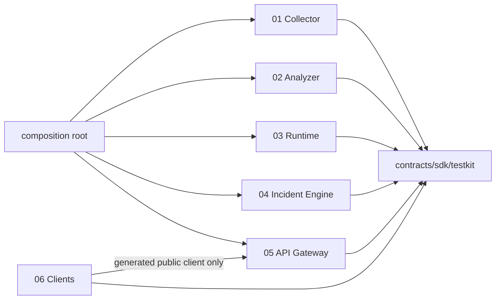

# Sentinel Edge — High-Level Technical Architecture & Integration Specifications

**Document ID:** SE-SYS-TAS-013  
**Version:** 0.13.0  
**Date:** 2026-07-26  
**Status:** Multi-module reference architecture, contracts and verification plan  
**Supersedes:** monolithic SE-TAS-012 as the primary architecture navigation document

## 1. Architecture style

Sentinel Edge is a **module-oriented system with hexagonal internals**. The default release is a modular composition on one Arm64 edge node. A module can later move to its own process or node because its public ports, contracts, state and tests are already independent.

This is not a microservices mandate. Network distribution is an adapter choice, not a domain design requirement. The hackathon favors the compact profile for reliability and the isolated-process profile for crash/resource testing.

## 2. Repository/workspace structure

```text
sentinel-edge/
├── pyproject.toml                 # workspace only; no domain implementation
├── uv.lock
├── contracts/
│   ├── sentinel-contracts/       # immutable DTOs, schemas and generated bindings
│   └── compatibility-matrix/
├── sdk/
│   ├── sentinel-plugin-sdk/      # manifests, lifecycle, permission and conformance helpers
│   └── sentinel-testkit/         # virtual clock, fake ports, fixtures, probes
├── modules/
│   ├── streaming-source-collector/
│   ├── analysis-enrichment-engine/
│   ├── model-workload-runtime/
│   ├── incident-event-engine/
│   ├── rest-api-integration-gateway/
│   └── client-applications/
├── apps/
│   ├── sentinel-node/            # composition root; no domain rules
│   ├── sentinel-module-runner/   # start one module for black-box tests
│   └── sentinel-scenario-runner/
├── integration-tests/
│   ├── contracts/
│   ├── pairwise/
│   ├── vertical-slices/
│   ├── whole-solution/
│   ├── chaos-recovery/
│   └── hardware/
├── plugins/                      # first-party reference plugins, each separately packaged
├── fixtures/
├── provenance/
└── docs/
```

Workspace rules:

- `modules/*` may depend on `sentinel-contracts`, `sentinel-plugin-sdk` and selected generic libraries; they cannot depend on another module implementation.
- `apps/sentinel-node` may depend on module public bootstrap packages to compose them; it contains no business logic.
- `integration-tests` may depend on multiple modules; module test directories may not.
- Architecture tests scan imports, dependency metadata, SQL paths and artifact namespaces.

## 3. Module dependency graph



No business module imports another business module. Runtime interaction occurs through ports implemented at the composition root or through transport adapters.

## 4. Deployment profiles

| Profile | Process topology | Transport | Persistence | Purpose |
|---|---|---|---|---|
| `test-standalone` | one module | in-memory/fake ports | temporary owned store | fast component/conformance tests |
| `compact` | modules co-located in one/few processes | in-memory bounded channels | separate owned SQLite DBs/artifact namespaces | default hackathon/demo |
| `isolated` | one process per module | Unix-domain sockets, framed JSON/MessagePack, shared-memory artifact refs where qualified | separate owned stores | crash/resource/fault isolation |
| `field-lab` | selected modules may be remote | authenticated HTTP/stream or qualified edge transport | owned stores with backup/update policy | later controlled deployment |

The same contract tests run against all enabled transports. Transport-specific metadata cannot change domain semantics.

## 5. Integration fabric

### 5.1 Message classes

- **Command:** one intended authority, accepted/rejected, idempotency key, optional expected version.
- **Event:** immutable fact that occurred, at-least-once delivery, producer-owned identity.
- **Projection:** replaceable read model with monotonic version/cursor; REST resync is authoritative.
- **Job request/result:** bounded request/response correlated across Analyzer/Collector and Runtime.
- **Artifact reference:** immutable owner namespace, content hash, media type, privacy class and access capability.

### 5.2 Envelope

```yaml
specversion: "1.0"              # CloudEvents stable envelope semantics
id: "uuid"
source: "urn:sentinel:module:instance"
type: "sentinel.<domain>.<event>.v1"
time: "2026-07-26T00:00:00Z"
datacontenttype: "application/json"
dataschema: "urn:sentinel:schema:incident-transition:1"
subject: "resource-id"
correlationid: "uuid"
causationid: "uuid-or-null"
traceparent: "..."
idempotencykey: "...-when-required"
dataref: "artifact-or-inline-small-payload"
```

Binary media never enters the control envelope. Inline payloads have strict size limits. Delivery semantics are declared per channel in AsyncAPI.

### 5.3 Contract baselines

- JSON Schema Draft 2020-12 for data.
- AsyncAPI 3.1.0 for internal asynchronous channels.
- CloudEvents 1.0.2 stable envelope semantics.
- OpenAPI 3.1.2 implementation profile; track 3.2.0 and promote only after tool qualification.
- Problem Details compatible errors with Sentinel reason-code extensions.
- OGC SensorThings 1.1 mapping for observation exchange; 2.0 remains an evaluated candidate.

## 6. Data ownership

| Module | Owned store/namespace | Forbidden coupling |
|---|---|---|
| 01 Collector | collector.db, ingress ledger, cursors, collector/quarantine artifacts | No incident/model/analyzer DB writes |
| 02 Analyzer | analyzer.db, derived artifacts, analysis DAG/lineage indexes | No direct model loading or incident writes |
| 03 Runtime | runtime.db, model registry/qualification/job telemetry, read-only models | No source acquisition or incident writes |
| 04 Incident Engine | incident.db, authoritative journal/projections/reviews/outbox | Exclusive incident lifecycle write authority |
| 05 API Gateway | api.db, sessions/rate limits/cursors/audit context | No direct incident-table writes or raw-table projection synthesis |
| 06 Clients | local cache/offline command queue/preferences | No server DB/filesystem access |

A shared content-addressed artifact service is an interface/library with owner namespaces, not a domain authority. Each write is attributed to the owning module and policy. The composition root cannot query private module tables.

## 7. Plugin system

### 7.1 Scope

Plugins are loaded by the owning module's `PluginManager`. There is no global service locator. Discovery uses PyPA entry points only as a catalog; activation uses a signed/hashed allowlist.

### 7.2 Lifecycle and states

```text
DISCOVERED → VERIFIED → COMPATIBLE → SELF_TESTED → ACTIVE
                    ↘ REJECTED
ACTIVE → DEGRADED → DISABLED → ROLLED_BACK/REMOVED
```

### 7.3 Permission model

Permissions include network host/method, filesystem namespace, artifact classes, secret names, model-execution ability, CPU/RSS/wall-time/input limits and supported modes. `incident_write` is never grantable outside Module 04. Release configuration fails if a plugin requests impossible authority.

### 7.4 Hazard extension pack

```text
hazard-pack-<hazard>/
├── collector-plugin
├── analyzer-plugin-or-recipes
├── runtime-workload-plugin
├── incident-hazard-policy-pack
├── api-schema/projection fragment
├── client vocabulary/renderers
├── cross-module contract fixtures
└── vertical-slice scenario + quality/latency gates
```

Each artifact is independently versioned and tested. The pack manifest pins a compatible set; partial activation is rejected unless the pack declares a safe reduced mode.

## 8. Reliability and consistency

- Each at-least-once consumer maintains an owned inbox/idempotency record.
- Each module requiring durable side effects uses a transactional outbox in its owned database.
- Replace-latest streams declare coalescing and cannot carry irreplaceable incident transitions.
- Retries are bounded, jittered and classified; poison messages dead-letter with an operator-visible consequence.
- Per-source/per-channel event-time watermarks and bounded lateness prevent replay-as-live behavior.
- Graceful shutdown drains within deadlines; crash recovery reconciles inbox/outbox/cursors before READY.
- No globally exactly-once claim is made.

## 9. Security architecture

1. Manifest-approved models, plugins, configs and fixtures are digest verified; release-grade bundles carry a declared signature policy.
2. Local administrator bootstrap is physical/local and unique; no default shared password.
3. Remote peers and integrations use authenticated identities, anti-replay and revocation.
4. External media and complex parsers run with explicit byte/time/RSS/disk/network limits.
5. Privacy transformation occurs before ordinary persistence; derived exports preserve parent hashes.
6. Each module receives least-privilege credentials and owned paths.
7. Judge/benchmark modes deny network below the application layer and forbid runtime mutation.
8. SBOM/ML-BOM uses CycloneDX 1.7; provenance targets SLSA 1.2 without unsupported level claims.

## 10. Observability

OpenTelemetry-compatible trace context crosses every module boundary. The system reconstructs:

```text
capture/acquire → normalize → analyze/job release → queue/admission → execute
→ incident policy/transition → projection → API delivery → client render/acknowledgement
```

Module metrics retain local ownership, while the composition root exposes a read-only aggregate health view. Telemetry schema/version is a contract and is included in benchmark host/instrumentation hashes.

## 11. Test architecture

### Required test layers

| Layer | Runs without other modules? | Purpose |
|---|---:|---|
| Unit | Yes | Pure rules, transformations, state and edge cases. |
| Property/stateful | Yes | Generated values and operation sequences; invariants and shrinking. |
| Plugin conformance | Yes | Every extension implementation passes the owning module SDK contract. |
| Component black-box | Yes | Start the packaged module with fake ports and verify public behavior. |
| Schema/contract | Yes | JSON Schema, examples, compatibility and generated code. |
| Consumer/provider | Pairwise | Consumer expectations are verified by the real provider. |
| Pairwise integration | Two modules | Real adapters across one boundary, including retries and incompatible versions. |
| Vertical slice | Several modules | One meaningful workflow through its required modules. |
| Whole solution | All modules | Signed simultaneous scenario, failures, recovery and client-visible outcome. |
| Non-functional | Varies | Performance, interference, security, privacy, accessibility and hardware evidence. |

### 11.1 CI stages

```text
format/lint/type
→ architecture-boundary tests
→ module unit/property tests (parallel)
→ plugin conformance (parallel)
→ schema/examples/generated code
→ component black-box tests (parallel)
→ consumer/provider verification
→ pairwise integrations
→ vertical slices
→ whole-solution deterministic scenario
→ security/privacy/accessibility
→ target Arm benchmark/hardware lanes
→ claims/provenance/document verification
```

### 11.2 Architecture boundary tests

They fail on:

- import from `sentinel_<other_module>.*`;
- SQL/path reference to another module-owned store;
- direct incident repository use outside Module 04;
- model runtime import outside Module 03;
- connector implementation outside Module 01;
- client filesystem/DB/internal transport access;
- undeclared network/secret/plugin permission;
- circular package dependency.

### 11.3 Pairwise matrix

| Producer | Consumer | Contract/proof |
|---|---|---|
| 01 Collector | 02 Analyzer | SourceEnvelope/ExternalSourceItem; hostile and partial inputs |
| 01 Collector | 03 Runtime | Observation→ModelJob hot path and capture age |
| 01 Collector | 04 Incident | SourceHealth/Coverage consequences |
| 02 Analyzer | 03 Runtime | ModelJobRequest/ModelResult, cancellation and partial DAG |
| 02 Analyzer | 04 Incident | AnalysisBundle, trust/lineage and no truth bypass |
| 03 Runtime | 04 Incident | HazardInference and model provenance/abstention |
| 04 Incident | 05 API | commands, optimistic concurrency and projections |
| 05 API | 06 Clients | OpenAPI/generated clients, SSE resume, offline idempotency |

### 11.4 Vertical and whole-solution scenarios

**Physical slice:** camera/IMU fixture → Collector → Runtime → Incident → API → client review.  
**External slice:** rights-gated media fixture → Collector → Analyzer↔Runtime → Incident lead → API → trust UI.  
**Whole solution:** normal monitoring, intense rain, smoke trigger, seismic trigger while lower work is queued, remote outage, sensor fault, external-media backlog, worker restart, recovery and After-Event Review.

Every scenario has a signed manifest, virtual/event-time map, expected invariants, optional outcomes, transcript and reset command.

## 12. Commands and developer workflow

```bash
make setup
make architecture
make test-module MODULE=streaming-source-collector
make test-all-modules
make contracts
make pairwise
make slices
make scenario
make chaos
make test-arm
make benchmark
make gates
```

A developer can work on one module using only contract packages and testkit. The full solution is needed only for integration/slice/system lanes.

## 13. Compatibility and release management

- Module implementation versions and contract versions are separate.
- Current/N-1 compatibility is declared per contract, not assumed globally.
- Breaking contract change requires a new major contract, migration/adapter plan and dual-run test when practical.
- A release bill pins module, plugin, model, config, schema and fixture hashes.
- Post-freeze changes generate an affected-test matrix automatically.
- A module may release independently only if provider/consumer verification proves it is compatible with the target system bill.

## 14. Key architectural risks and mitigations

| Risk | Mitigation |
|---|---|
| Modular monolith degrades into shared-code monolith | tiny shared kernel, import-linter rules, separate stores and black-box tests |
| Plugins become arbitrary code execution | allowlist, digest/signature, permissions, isolation, conformance and no hot install in release modes |
| Contract sprawl | central schema catalog, owner/consumer metadata, compatibility CI and generated bindings |
| Eventual consistency confuses clients | authoritative versions/cursors, pending states, REST resync and explicit projection age |
| IPC overhead harms hot path | compact in-memory profile, bounded UDS/shared-memory adapters and measured transport budget |
| Test matrix becomes too expensive | parallel module lanes, generated contract cases, two mandatory vertical slices and one signed whole scenario |
| Shared infrastructure becomes seventh authority | composition root and services contain no domain rules; ownership tests and ADR review |
| Hazard pack partially installed | pack compatibility manifest, atomic activation and safe reduced-mode declaration |

## Research and open-data consequences carried into the modular design

The v0.13 split preserves the substantive v0.12 research decisions rather than reducing the system to generic module plumbing:

- Wildfire pipelines retain cascaded low-cost screening, stronger bounded confirmation, temporal persistence, camera-health checks and cross-camera/domain-shift evaluation. PyroNear and edge-wildfire work support the need for hard negatives and temporal evidence: https://arxiv.org/abs/2402.05349
- Flood learned profiles remain optional behind deterministic level/rate rules. Topology- and sequence-aware research such as WARP and RiverMamba informs offline experiments, not a universal site-independent forecast claim: https://arxiv.org/abs/2412.20006 and https://arxiv.org/abs/2505.22535
- Earthquake remains post-onset detection: a deterministic trigger plus compact classifier and reserved workload path. TinyML research informs model shape and energy/latency tests without implying prediction: https://pubs.usgs.gov/publication/70263407
- Landslide architecture continues to separate susceptibility, saturation and observed movement; 2026 rainfall-induced EWS review findings reinforce site calibration, threshold uncertainty and human governance: https://egusphere.copernicus.org/preprints/2026/egusphere-2026-2156/egusphere-2026-2156.pdf
- Concept/domain drift is a module-wide lifecycle concern. Models and thresholds are monitored by condition/site/sensor subgroup, but adaptation cannot silently rewrite validated profiles during a run: https://arxiv.org/abs/2606.30843
- UGLC and the Tenerife multi-hazard dataset are valuable offline scenario/evaluation assets, not live truth: https://essd.copernicus.org/articles/18/4697/2026/ and https://essd.copernicus.org/articles/18/2979/2026/
- Experimental Raspberry Pi VideoCore QPU inference remains a separate roadmap track; the submission proof stays centered on qualified Arm CPU execution and measured full-pipeline optimization.

## Current standards and reference baseline

The release architecture uses standards conservatively: the newest published specification is recorded, while the implementation profile may remain on the newest version supported reliably by the selected tooling.

- OpenAPI Specification 3.2.0 is the latest published OAS (19 September 2025). The Sentinel release profile is OpenAPI 3.1.2 until FastAPI/client-generation/tooling qualification passes for 3.2.0: https://spec.openapis.org/oas/v3.2.0.html
- AsyncAPI Specification 3.1.0 is the event-contract documentation baseline: https://www.asyncapi.com/docs/reference/specification/v3.1.0
- CloudEvents 1.0.2 is the stable event-envelope baseline: https://github.com/cloudevents/spec
- JSON Schema Draft 2020-12 is the payload-schema baseline: https://json-schema.org/draft/2020-12
- OpenTelemetry Specification 1.59.0 and OTLP provide the observability contract baseline: https://opentelemetry.io/docs/specs/otel/
- OGC SensorThings API 1.1 is the stable interoperability mapping target. SensorThings 2.0 remains a candidate/transition topic until formally adopted and tool-qualified: https://www.ogc.org/standards/sensorthings/
- Python plugin discovery uses PyPA entry points, but release modes load only manifest-approved allowlisted plugins: https://packaging.python.org/en/latest/guides/creating-and-discovering-plugins/
- Consumer/provider contract testing follows the Pact model where useful, with generated OpenAPI/AsyncAPI/schema verification remaining authoritative: https://docs.pact.io/
- Property and state-machine testing uses Hypothesis for boundary values, sequences and lifecycle invariants: https://hypothesis.readthedocs.io/en/latest/stateful.html
- CycloneDX 1.7 is the SBOM/ML-BOM baseline: https://cyclonedx.org/specification/overview/
- SLSA 1.2 is the supply-chain provenance target, without claiming a level that has not been evidenced: https://slsa.dev/

## 15. Changelog

### 0.13.0 — 2026-07-26

- Replaced implicit component boundaries with separately packaged modules and owned stores.
- Added transport-neutral ports, compact/isolated deployment profiles and integration envelope.
- Added module-scoped plugin system and coordinated hazard extension packs.
- Added architecture enforcement, contract testing, pairwise matrix, vertical slices and whole-solution verification.
