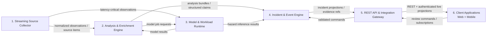

# Sentinel Edge — Full-Scope Product Contract

**Document ID:** SE-FPC-022  
**Version:** 0.22.0  
**Date:** 2026-08-02  
**Status:** Active-current, full-scope product contract with profile-scoped obligations, consolidated requirement truth, release-evidence closure and full lifecycle governance  
**Previous working name:** Sentinel Cascade  
**Target:** Arm Create: AI Optimization Challenge and controlled post-submission evolution  
**Track:** Physical AI  
**Submission deadline:** 2026-08-14 16:00 PDT / 2026-08-15 01:00 CEST  
**Reference device:** Raspberry Pi 5 or compatible 64-bit Arm Linux node  
**Repository license target:** Apache-2.0 or MIT  
**Delivery model:** One developer using AI-assisted development  
**Source and external-verification cut-off:** 2026-08-01; v0.22 is a contract-structure consolidation and does not claim a later external revalidation  
**Supersedes:** SE-FPD-021 / v0.21.0  
**Companion contract:** `Sentinel Edge — Full-Scope Technical Contract v0.22.0`  
**Contract type:** Full product-lifecycle contract covering product behavior, conformance profiles, stakeholders, data and evidence duties, safety boundaries, operation, acceptance, change and retirement  
**Normative language:** MUST, SHOULD and COULD apply within the requirement’s declared conformance profile. A requirement is release-binding only when its profile is selected and its capability is enabled; safety and truthfulness constraints always apply to any behavior that is shown.

## 0. Version 0.22 full-scope contract conversion

### 0.1 Contract conversion

Version 0.22 converts the cumulative functional specification into one **active-current full-scope product contract**. It does not add another historical delta section. Earlier version labels remain provenance only; the binding product truth is the current contract body, the consolidated requirement registry, the generated active-contract snapshot, the selected release profile and the exact release-candidate evidence.

The conversion preserves:

- exactly six top-level components;
- the four hazard adapters: wildfire, flood, earthquake and landslide;
- B0/B1/O1 benchmark attribution;
- the twelve `G0` submission gate packs;
- the zero-live-source H0 minimum;
- the frozen **240-requirement H0 cutline**;
- Component 4 as the sole incident-lifecycle authority;
- the v0.21 release-candidate, qualification, authority-journal, digest, artifact-budget, source-lifecycle, advisory and platform-envelope controls.

The consolidated registry contains **743 unique requirements: 240 H0, 463 H1, 32 F1 and 8 R**. No requirement is promoted, demoted or silently reworded by this structural conversion.

### 0.2 What “full-scope” means

“Full-scope” means that this contract covers the complete intended product lifecycle and all declared conformance profiles, not that every profile is implemented in the hackathon candidate. The contract therefore includes:

1. product purpose, users, claims and exclusions;
2. all six component capabilities and their authority boundaries;
3. all four hazard paths and cross-hazard behavior;
4. local, fixture, benchmark, judge and controlled field-lab operation;
5. data, source, model, configuration, evidence and artifact lifecycles;
6. safety, security, privacy, accessibility and human-review obligations;
7. reliability, degradation, recovery and operator-attention constraints;
8. release, benchmark, claim and submission evidence;
9. compatibility, migration, deprecation, suspension and retirement;
10. research-only capabilities that must remain visibly non-productized until promoted by tested change control.

### 0.3 No new external claims

The current source and research statements are inherited from the v0.21 pair and retain the **1 August 2026** verification cut-off. v0.22 adds contract structure, responsibility and lifecycle closure only. Any later runtime, source, rules, security, platform or legal change reopens qualification under the existing source/advisory/platform controls.

### 0.4 Scope remains fixed

Sentinel Edge remains an offline-first Arm research monitoring and decision-support product. It is not an official warning authority, safety-certified instrument, emergency-service replacement, casualty estimator, person-tracking system, unrestricted media-ingestion service or general-purpose generative-AI product.

### 0.5 Active-current reading rule

The current contract is not append-only history. Previous documents remain useful design provenance, but they cannot be used to override this version. Historical wording that conflicts with the current registry, selected profile, generated contract snapshot or exact candidate evidence is non-authoritative.


## A. Contract control, precedence and truth model

### A.1 Binding hierarchy

The following order determines product truth:

1. **Exact release-candidate identity and generated active-contract snapshot** for what a specific build actually supports.
2. **Consolidated functional requirement registry** in Section 10 for product obligations and acceptance criteria.
3. **This full-scope product contract** for behavior, scope, users, lifecycle and claim boundaries.
4. **The full-scope technical contract** for architecture, algorithms, schemas, policies, tests and implementation constraints.
5. **Machine-readable policies, schemas, source/capability records, model/configuration manifests and ADRs** referenced by the technical contract.
6. **Research notes and external sources** as context, not automatic product authority.

A lower item cannot broaden authority granted by a higher item. When two binding artifacts disagree, the stronger safety and truthfulness boundary applies temporarily, the capability enters `contract_mismatch`, and the release is not admitted until the conflict is resolved and regenerated.

### A.2 Requirement interpretation

- `MUST` is mandatory when the requirement’s profile is selected or the associated capability is enabled.
- `SHOULD` requires either implementation or a recorded, reviewed exception that does not undermine a stronger requirement.
- `COULD` is optional and may not be represented as supported without implementation and evidence.
- `H0` is the minimum credible hackathon release.
- `H1` is release hardening or optional capability depth.
- `F1` is controlled field-lab hardening.
- `R` is research/roadmap and is non-normative for current release admission.

A requirement’s text, profile and acceptance criterion form one indivisible contract row. Prose summaries cannot weaken the row.

### A.3 Capability and implementation truth

Each capability has one generated state:

- `specified`
- `implemented`
- `verified`
- `target_qualified`
- `release_admitted`
- `degraded`
- `suspended`
- `retired`

The UI, API, documentation, Judge Proof and submission materials MUST NOT present a capability at a stronger state than the generated record supports. A field-lab design requirement may be fully specified without being part of the H0 candidate.

### A.4 Claim truth

Every product claim is classified as one of:

- `measured`
- `replayed`
- `simulated`
- `target`
- `research`

Measured and replayed claims require exact evidence bindings. Targets and research findings may guide development but cannot be presented as achieved product behavior.

### A.5 Conflict and uncertainty handling

Unknown, stale, partial, disputed, reconstructed, revoked, erased, unbound and out-of-domain states remain explicit. The product never converts missing evidence into a positive fact, protocol completion into semantic completeness, source reachability into entitlement, or model confidence into authorization.

## B. Full-scope conformance model

### B.1 Profile selection

A release declares exactly which profiles and optional capabilities it claims. The profile declaration is immutable within a benchmark, Judge Proof run or signed candidate. Unselected profiles remain contractually designed but are not claimed as delivered.

| Profile | Product purpose | Required evidence | Typical deployment |
|---|---|---|---|
| `H0` | Minimum credible hackathon product | All applicable H0 rows, twelve G0 packs, exact candidate identity and no-network Judge Proof | Judge/demo and reproducible local node |
| `H1` | Hardened release and optional capability depth | H0 plus each enabled H1 capability’s tests, policies, source/runtime qualification and evidence | Extended local deployment and submission hardening |
| `F1` | Controlled field-lab operation | H0/H1 prerequisites plus commissioning, secure update, field networking, retention, recovery and operator governance | Authorized, supervised field experiment |
| `R` | Research only | Reproducible research artifact and explicit non-product status | Offline evaluation or roadmap |

### B.2 Full-scope conformance

A product version is **full-scope contract-conformant** when:

1. every requirement has one unique ID, profile, owner, status and acceptance path;
2. every enabled capability satisfies all applicable stronger-profile requirements;
3. unsupported capabilities are absent or visibly unavailable rather than partially implied;
4. the product and technical registries contain the same requirement IDs and profiles;
5. every measured claim resolves to exact release-candidate evidence;
6. every known exception has an owner, reason, expiry and no conflict with a mandatory safety boundary;
7. change, migration and retirement obligations are satisfied.

Full-scope conformance does **not** mean every H1, F1 or R capability ships in one build.

### B.3 Operating modes

The contract recognizes these modes:

- `judge`: deterministic, no-network-capable, read-only proof surface and frozen candidate.
- `benchmark`: frozen inputs, opportunity accounting, protected claim set and host/runtime qualification.
- `field_lab`: supervised operation with commissioned devices, approved sources and field controls.
- `development`: explicit non-release mode with debug capabilities and no production claim authority.
- `recovery`: bounded reconciliation after process, storage, clock, source or node interruption.

Mode is part of the configuration and evidence identity. Development behavior cannot silently appear in judge, benchmark or field-lab mode.

### B.4 Authority invariants

- Component 1 owns acquisition, quarantine and normalized observations.
- Component 2 owns analysis and enrichment outputs, not incident state.
- Component 3 owns validated model/workload execution and orchestration, not incident state.
- Component 4 alone owns incident lifecycle, authoritative accepted mutations and the accepted-authority journal.
- Component 5 is the supported command, query and integration boundary.
- Component 6 presents projections and submits commands but is not authoritative storage.

No plugin, source adapter, model, client or background worker may create a seventh top-level authority.

## C. Stakeholder, operator and integrator obligations

### C.1 Product maintainer and release owner

The maintainer owns requirement/ADR synchronization, candidate identity, dependency and advisory triage, source review, model/configuration qualification, release evidence, migration policy and truthful public claims. The maintainer must suspend a capability when evidence expires or a materially relevant platform/source/security change invalidates qualification.

### C.2 Deployer and node operator

The deployer owns physical installation, sensor placement, power and cooling suitability, network exposure, local access control, commissioning records, jurisdiction-specific deployment review, retention settings, time-source configuration and recovery media. The operator must not treat a laboratory profile as an official warning system.

### C.3 Incident reviewer

The reviewer owns human disposition of uncertain evidence, contradiction review, restricted-evidence access, manual resolution under blind coverage, correction/retraction decisions and After-Event Review actions. Human approval cannot manufacture missing evidence or override explicit unsupported-state boundaries.

### C.4 Source and data steward

The steward owns entitlement, terms/licence review, purpose limitation, freshness/coverage expectations, retention/redistribution permissions, canonical source identity and withdrawal/correction handling for each enabled external source.

### C.5 Integrator and plugin author

The integrator must use declared component-scoped ports, schemas, envelopes, authority rules, resource budgets and compatibility tests. A plugin cannot bypass Component 4, write another module’s store, load unapproved models, expand network authority or claim a stronger profile than its manifest proves.

### C.6 End user

The end user receives decision-support information, not an official warning. The user must see source mode, freshness, uncertainty, degraded coverage, review state and authoritative-source links. The product must not require the user to infer these distinctions from technical logs.

### C.7 Security, privacy and safety owners

Where one person fills several roles, the decisions remain separately recorded. Security exceptions, privacy/rights decisions and safety/claim decisions require explicit evidence and expiry; they cannot be hidden inside a generic release approval.

## D. Product lifecycle contract

### D.1 Lifecycle stages

The product lifecycle is:

1. **Specify** — define requirement, owner, profile, threat/rights context and acceptance evidence.
2. **Implement** — build only behind declared component boundaries.
3. **Verify** — run unit, contract, integration, scenario, adversarial and target tests as applicable.
4. **Qualify** — bind device, platform, source, model, configuration and operational envelope.
5. **Admit** — include the capability in one exact release candidate and profile.
6. **Operate** — monitor health, coverage, budgets, drift, source/advisory changes and human review.
7. **Correct** — preserve bitemporal history, reevaluate derived state and communicate visible corrections.
8. **Suspend or degrade** — weaken trust or availability when prerequisites fail.
9. **Migrate or update** — validate compatibility, state transformation and rollback.
10. **Retire** — stop new use, preserve required records, dispose of restricted data and revoke authority.

### D.2 Capability activation

A capability is activated only through validate → stage → self-test → qualify → activate → monitor. Failure at any stage leaves the prior known-good capability active where safe, otherwise the capability is unavailable or degraded. No source, model, profile, update or plugin self-promotes.

### D.3 Incident and evidence lifecycle

Incident state, evidence state, review state, notification state and monitoring coverage are separate but linked. Correction, restriction, erasure and source withdrawal propagate through the derivation graph without rewriting historical truth.

### D.4 Operational continuity

Network loss, source loss, storage pressure, sensor faults, clock uncertainty, thermal/power pressure, process restart and Component-4 unavailability have declared degraded behavior. The product remains inspectable and does not invent freshness, coverage or incident transitions during recovery.

## 1. Executive summary

**Sentinel Edge** is an offline-first, Arm-optimized, multi-hazard observation and decision-support platform. A single low-cost edge node monitors heterogeneous physical signals and dynamically allocates limited compute, memory, energy and thermal headroom across four functional hazard adapters:

1. **Wildfire:** camera-based smoke and flame observation.
2. **Flood:** rainfall and water-level anomaly detection with short-horizon forecasting.
3. **Earthquake:** streaming accelerometer-based shaking detection and simulated multi-node confirmation.
4. **Landslide:** rainfall, soil-moisture, tilt and vibration-based instability monitoring.

The hackathon contribution is not simply “four models on a Raspberry Pi.” It is a reusable **Arm AI workload orchestrator** that determines:

- Which workload must run now.
- Which validated model profile should run.
- Which lower-priority work may be delayed.
- How to preserve minimum monitoring guarantees.
- How to react to overload, thermal pressure, missing sensors and lost connectivity.
- How to measure efficiency without hiding accuracy or latency regressions.


The product is organized into six major components:

1. **Streaming Source Collector** — continuously acquires local sensors, official public feeds, news, authorized platform data, community reports and fixtures; applies rights, freshness, identity and normalization controls.
2. **Analysis & Enrichment Engine** — parses text and metadata, samples media, runs OCR/ASR and deterministic feature extraction, derives claims and geotemporal clues, and records quality/OOD limitations.
3. **Model & Workload Runtime** — hosts validated Arm model profiles, the criticality/deadline orchestrator, inference workers and resource/thermal admission controls.
4. **Incident & Event Engine** — owns hazard state machines, incident lifecycle, evidence/claim graphs, trust-aware corroboration, deduplication, cross-hazard links, reviews and notifications.
5. **REST API & Integration Gateway** — exposes versioned resources, commands, search, evidence access, authentication, audit-safe mutations and real-time projections.
6. **Client Applications** — one product surface delivered as a responsive web/PWA client and mobile client, with consistent incident, trust, provenance, review and degraded-mode behavior.

The principal technical claim is:

> A criticality-aware, deadline-aware and risk-adaptive orchestrator can operate heterogeneous hazard workloads on one constrained Arm edge node with lower heavy-inference duty cycle and resource consumption than a naive fixed-rate baseline, while satisfying declared per-hazard quality and latency guardrails.

Sentinel Edge is a **research MVP**, not an official emergency-warning authority, safety-certified instrument or substitute for emergency services. It supports local observation, forecasting experiments, evidence collection, source corroboration, multimodal incident leads and human review. External media never replaces the local sensor and official-source boundaries.

---

## 2. Product thesis

### 2.1 Why a multi-hazard platform

Communities rarely experience hazards in isolation. Intense rainfall can cause flooding and landslides. An earthquake can trigger slope movement. A wildfire can increase later runoff and debris-flow susceptibility. A single power or communications outage can disable several monitoring systems at once.

Independent single-hazard products repeatedly implement the same infrastructure:

- Sensor ingestion.
- Device health.
- Offline persistence.
- Source freshness.
- Human verification.
- Heterogeneous source trust and provenance.
- Multimodal media analysis and claim extraction.
- Notifications and deduplication.
- Security and privacy.
- Model provenance.
- Benchmarking and deployment.

Sentinel Edge shares that infrastructure while keeping each hazard’s science, state model, uncertainty and terminology separate.

### 2.2 Why this fits the Arm challenge

The project belongs in **Physical AI** because it consumes real or simulated camera, IMU and environmental-sensor data, performs local inference on Arm and produces operational decisions such as anomaly detection, escalation and evidence retention.

The submission will make Arm optimization explicit through:

- Static INT8 model profiles where quality permits.
- ONNX Runtime Arm64 execution.
- Adaptive sampling and model wake/sleep control.
- Criticality- and deadline-aware job scheduling.
- Bounded queues and backpressure.
- Thermal-aware degradation.
- Reproducible baseline-versus-optimized benchmarks.
- Reusable hazard-adapter and workload interfaces.

Official references:

- [Challenge overview](https://arm-ai-optimization-challenge.devpost.com/)
- [Official rules](https://arm-ai-optimization-challenge.devpost.com/rules)
- [Track details](https://arm-ai-optimization-challenge.devpost.com/details/trackdetails)
- [Challenge updates](https://arm-ai-optimization-challenge.devpost.com/updates)

### 2.3 Responsible multi-hazard positioning

The July 2026 UNDRR/WMO/ITU/IFRC report on AI-enhanced multi-hazard early warning emphasizes robust observations, governance, human oversight, multilingual and low-connectivity design, interoperability and institutional responsibility.

Sentinel Edge addresses primarily the **monitoring and forecasting** portion of an early-warning chain. It provides limited support for evidence exchange and operator notification, but it does not claim to provide a complete institutional multi-hazard early-warning system.

Reference: [Leveraging AI to Enhance Multi-Hazard Early Warning Systems](https://www.undrr.org/publication/documents-and-publications/leveraging-ai-enhance-multi-hazard-early-warning-systems)

---

### 2.4 Hackathon judging and eligibility alignment

The implementation plan is explicitly aligned to the official scorecard:

| Criterion | Weight | Sentinel Edge proof |
|---|---:|---|
| Technological implementation | 40% | Working Arm64 node, four adapters, scheduler, tests, profiling and reproducible B0/B1/O1 results |
| User/developer experience | 15% | One-command fixture demo, diagnostics, inspectable decisions, stable adapter SDK and bilingual core UI |
| Potential impact | 20% | Low-connectivity, privacy-preserving and extensible monitoring for resource-constrained deployments |
| “WOW” factor | 25% | Visible real-time arbitration of four physical-AI workloads, seismic reservation, wake/sleep vision and simultaneous-event replay |

Eligibility and proof requirements:

- Keep the public repository and required access available throughout judging.
- Use an MIT or Apache-2.0 project license and separately document third-party licenses.
- Preserve a dated `HACKATHON_WORKLOG.md`, release tags and benchmark manifests showing significant work completed on/after **2026-06-10**, the submission-period start stated by the official rules. The Devpost schedule page currently displays June 4; where those pages disagree, Sentinel uses the official rules for eligibility/provenance claims and records the discrepancy.
- Provide an English judge guide and submission materials.
- Assume judges may not install or test the hardware; the video, screenshots, signed raw results and deterministic replay must be sufficient to evaluate the project.
- Obtain authorization for any third-party integration that requires it; otherwise use documented public interfaces or redistribution-safe fixtures.

### 2.5 Product claim hierarchy

Claims are accepted in the following order of strength:

1. **Measured on the declared Raspberry Pi 5 release image.**
2. **Replayed from a signed fixture and benchmark manifest.**
3. **Demonstrated in a controlled simulation.**
4. **Planned or inferred from external research.**

The UI and documentation must label which level supports each result. Targets, estimates and research findings are never presented as achieved device measurements.

## 3. Product vision

### 3.1 Vision statement

Enable communities, field operators, researchers and public-sector technologists to deploy a low-cost Arm edge node that monitors multiple hazards locally, remains useful during network outages and clearly explains what it observed, how uncertain it is, which inputs are missing and what an authorized person should verify next.

### 3.2 Value proposition

Sentinel Edge provides:

- One platform instead of four disconnected applications.
- Local inference without continuous raw-stream upload.
- Fast response to physical signals.
- Evidence and source lineage.
- Optional, clearly dated potential-exposure context that remains separate from hazard verification.
- Visible source, content, extraction and claim confidence.
- Text, image, audio and video evidence under one review workflow.
- Multi-hazard compute orchestration.
- Explicit degraded modes.
- Human verification and audit history.
- Official-source links and later corroboration.
- A judge-friendly fixture mode requiring no special hardware or API keys.
- A benchmark report proving what improved on Arm.
- A stable developer contract for adding hazards.
- Replay-safe delivery, identity, update and schema-evolution contracts suitable for a long-running edge node.

### 3.3 Differentiation

The product treats the following as first-class requirements rather than afterthoughts:

- Simultaneous hazards and workload contention.
- Priority inversion and starvation prevention.
- Cross-hazard cascades without double-counting evidence.
- Sensor faults, drift and implausible values.
- Stale external sources.
- Forecast uncertainty and model abstention.
- Domain shift and concept drift.
- Alert fatigue.
- Exact model and configuration lineage.
- Power, storage and thermal pressure.
- Safe language and authoritative-source boundaries.
- Reproducibility on a clean Arm64 installation.
- Repost/duplicate lineage and contradiction handling.
- Rights-aware media acquisition, retention and redaction.

---

## 4. Scope and delivery strategy

### 4.1 Shared platform scope

Every hazard adapter must use the same functional core:

- Input normalization.
- Sensor and source health.
- Job registration and scheduling.
- Event state management.
- Evidence storage.
- Human review.
- Offline operation.
- Local dashboard and API.
- Benchmarking.

### 4.2 Hazard depth

| Hazard | MVP depth | Primary demonstration |
|---|---|---|
| Wildfire | Hero | Camera smoke cascade, temporal persistence, latest-frame control and evidence clip |
| Earthquake | Hero | Continuous IMU path, deterministic trigger, reserved dispatch, waveform evidence and simulated peer correlation |
| Flood | Bounded functional | Rain/water-level validation, rate-of-rise/threshold rules and optional compact forecast |
| Landslide | Bounded functional | Rain/soil/tilt/vibration validation, movement rules and optional compact model |
| Post-fire debris flow | Cross-hazard rule | Recent verified fire increases later rainfall/slope monitoring context |
| Tsunami | Official-source link only | No independent model |
| Heatwave, drought, volcano | Roadmap | Not an acceptance requirement |

### 4.3 Minimum viable victory

The hackathon submission is complete when:

1. Four adapters run end to end with bundled fixtures.
2. On the physical-target profile, at least one locally captured physical camera or IMU signal path is demonstrated. The hackathon emulated Arm64 profile uses the deterministic simulated camera/IMU signal contract and records that physical capture is unavailable.
3. All adapters operate simultaneously on one Arm node.
4. The earthquake workload has a reserved high-priority path.
5. Wildfire heavy inference visibly wakes and sleeps.
6. Flood and landslide cadence reacts to rainfall context.
7. A simultaneous-event scenario demonstrates resource arbitration.
8. Local operation survives network loss.
9. Baseline and optimized runs use the same signed manifest.
10. Results show system-wide and hazard-specific trade-offs.
11. The public repository installs cleanly.
12. The recorded demo remains under three minutes.

### 4.3.1 Scope lock: hero and bounded adapters

To prevent a four-hazard concept from becoming four shallow prototypes, the active scope lock uses three implementation depths:

| Depth | Components | Required proof |
|---|---|---|
| Hero | Wildfire, earthquake, orchestrator | Live or high-fidelity fixture path, model optimization, robustness tests, end-to-end latency and visible scheduling behavior |
| Bounded functional | Flood, landslide | Complete ingestion-to-event-to-evidence path, deterministic fallback, uncertainty/missingness, one compact validated profile or transparent rule model |
| Context-only | Satellite, regional forecasts, official catalogues | Freshness, provenance and source-role handling; never required for local event detection |

No new hazard is added before the four current adapters, benchmark lab, evidence path and judge package pass acceptance.

### 4.3.2 Conformance profiles and evidence states

Every requirement and product claim belongs to one profile:

| Profile | Meaning | Release treatment |
|---|---|---|
| `H0` | Hackathon minimum credible release | Required before submission; failure blocks the core claim |
| `H1` | Hackathon stretch/hardening | Included only when it cannot endanger `H0`; otherwise visibly deferred |
| `F1` | Field-lab operational hardening | Architecture requirement for a later controlled deployment, not a Devpost completion claim |
| `R` | Research/roadmap | Non-normative for the current release |

Implementation evidence uses four states:

- `implemented`: code exists and unit/contract tests pass.
- `demonstrated`: implemented and exercised in the signed acceptance scenario or target benchmark.
- `specified`: design exists but release evidence is incomplete.
- `deferred`: deliberately excluded with a reason and no hidden dependency.

A `MUST` is mandatory only for its profile. Judge Proof must show profile and evidence state. A feature cannot be shown as complete merely because it appears in this document.

### 4.3.3 H0 minimum credible release envelope

`H0` is intentionally smaller than the complete field architecture. It consists of:

1. Clean Arm64 setup/doctor, deterministic fixture mode and either one local physical camera/IMU path or the declared hackathon emulated Arm64 signal profile.
2. Four end-to-end adapters, with wildfire and earthquake as hero paths and deterministic flood/landslide paths.
3. Bounded queues, visible criticality/deadline orchestration, seismic reservation, forced wildfire scans and static fallback.
4. Signed simultaneous-event scenario through normal observation contracts, including network and sensor faults.
5. Local event/evidence store, monitoring coverage, review action, immutable provenance and no-network Judge Proof.
6. B0/B1/O1 paired benchmark with opportunity accounting, quality guardrails, host qualification and exact raw artifacts.
7. Persistent safety wording, source-mode labels and no official-warning impersonation.
8. Runtime/model/config/fixture identity verification and a read-only release model boundary.

Outbox delivery, remote peer trust, offline update verification, full schema migration, storage endurance, commissioning and complete accessibility evidence remain valuable but are `H1` or `F1` unless promoted by explicit, tested change control.

### 4.3.4 `G0` submission gate packs

The release is managed through twelve pass/fail proof packs. Detailed `H0` requirements map into these packs, but planning, dashboards and go/no-go decisions use the pack status rather than a 100-row checklist.

| Gate | Required proof | Automatic cut when endangered |
|---|---|---|
| `G0-01` Reproducible Arm node | Clean Arm64 setup/doctor, pinned artifacts, no-network fixture mode and either one physical camera/IMU path or the declared emulated Arm64 profile | Undeclared emulation, second board, cloud dependency |
| `G0-02` Deterministic scenario | Signed simultaneous-event manifest, normal contracts, transcript, reset and invariant report | Live-source polish, extra scenario branches |
| `G0-03` Orchestrator | Bounded queues, Tier A reservation, forced wildfire scan, max deferral, overload and fallback | New scheduler algorithm, general optimizer |
| `G0-04` Wildfire hero | Capture-age control, Stage 1/2 or validated compact equivalent, persistence, abstention and clip | Extra detector families, geolocation |
| `G0-05` Earthquake hero | Fixed-rate input, deterministic trigger, compact classifier/rule profile, waveform and reserved dispatch | Magnitude/location estimation, physical peer network |
| `G0-06` Flood/landslide bounded paths | Deterministic threshold/movement paths, missingness, separate semantics and evidence | Learned model if not already passing |
| `G0-07` Evidence, UI and safety | Four cards, independent coverage/health, decision reasons, immutable local evidence, visible source/claim trust, review and persistent disclaimer | Map polish, live social connectors, CAP export, advanced notifications |
| `G0-08` Benchmark fairness | B0/B1/O1, same manifest/opportunities/instrumentation, fixed quality guards, paired blocks and raw artifacts | Extra providers, unpaired headline numbers |
| `G0-09` Runtime and attack surface | Pinned ORT artifact, manifest-only models, sandboxed untrusted-media parsing, parser budgets, no ArmNN/SME claims and offline identity verification | Arbitrary model loading, unrestricted media ingest, runtime conversion, experimental QPU |
| `G0-10` Recovery and node health | Startup barrier, power/thermal/storage visibility, one worker-crash recovery and no replay-as-live behavior | Full OTA, fleet identity, long endurance campaign |
| `G0-11` Provenance, rights and claims | License, fixture/model/data rights, work log, conformance ledger and generated claim table | Unverified dataset/model/source |
| `G0-12` Judge package | Public repository, five-minute guide, sub-three-minute video, screenshots and replayable results | Feature work after evidence freeze |

A gate may be marked `pass`, `pass_with_declared_limitation`, `fail` or `not_applicable`. Only the first two permit submission. A limitation cannot contradict the central optimization, four-adapter or safety claims.

### 4.4 Non-goals

- Safety-certified operation.
- Autonomous evacuation instructions.
- Public cell broadcast or ES-Alert transmission.
- Earthquake prediction before rupture begins.
- Universal flood forecasting across uncalibrated catchments.
- Exact wildfire ignition coordinates from one camera.
- Exact landslide timing from coarse satellite products.
- Emergency dispatch or actuator control.
- A general-purpose LLM in the critical detection path.
- Live scraping of unstable emergency websites.
- Scraping or downloading platform-hosted media against platform rules or rights-holder restrictions.
- Monitoring private chats, groups or accounts without explicit participation and authorization.
- Face recognition, speaker identification or identity inference from incident media.
- Treating a popularity metric, verification badge or source reputation as proof that one claim is true.
- Production fleet management.
- Full hydraulic or geotechnical simulation.
- A generic combined “disaster probability.”
- A remotely managed production OTA fleet in the hackathon release.
- A claim of globally exactly-once distributed processing.
- Regulatory certification or a completed conformity assessment.

---

### 4.5 Judge-zero-friction proof package

The submission MUST include:

- `docs/judge-guide.md` with a five-minute repository tour and a no-hardware path.
- `python scripts/dev.py demo` for deterministic all-hazard replay.
- `python scripts/dev.py scenario` for the deterministic simultaneous-event run.
- `python scripts/dev.py benchmark-replay` for viewing signed reference results without rerunning long experiments.
- `python scripts/dev.py claims` to verify/generate headline tables and `python scripts/dev.py aer` to build the After-Event Review.
- `python scripts/dev.py benchmark` for native execution on a supported Arm64 node.
- A release manifest containing repository commit, OS image, runtime build, model/config/fixture hashes and benchmark hashes.
- A sub-three-minute video whose overlays identify live, fixture and simulated inputs.
- Precomputed screenshots and raw JSON/CSV for every headline chart.
- `HACKATHON_WORKLOG.md` and a changelog linking significant post-2026-06-10 work to commits or releases.

The proof package is a product requirement, not documentation polish deferred to the final day.


### 4.6 Normative release slices

The release is built and accepted in vertical slices. A later slice cannot be used to excuse failure of an earlier slice.

| Slice | Required output | Failure consequence |
|---|---|---|
| S0 — Reproducible spine | Clean setup, signed artifacts, fixture loader, health/API shell | Submission is not judgeable |
| S1 — Deterministic scenario | Simultaneous-event replay through normal contracts, reset and transcript | Scheduler proof is invalid |
| S2 — Orchestrator | Bounded queues, priorities/deadlines, admission, fallback and visible decisions | Central technical claim is absent |
| S3 — Wildfire hero | Stage 0/1/2 or validated compact equivalent, persistence and evidence clip | Hero quality/optimization proof incomplete |
| S4 — Earthquake hero | Fixed-rate ingest, deterministic trigger, classifier/rule profile, waveform and reserved path | Tier A proof incomplete |
| S5 — Bounded flood/landslide | Complete rule-assisted adapter paths with missingness and evidence | Multi-hazard platform claim incomplete |
| S6 — Benchmark/claims | B0/B1/O1 paired runs, quality guardrails and Claim Registry | Optimization claim cannot be published |
| S7 — Judge package | Judge Proof, video, screenshots, work log, licenses and security checks | Eligible project may be unevaluable |
| S8 — Optional extensions | Live sources, Pico 2, maps, CAP preview, extra providers | Cut with no effect on core acceptance |

### 4.7 Feature-admission rule

A new feature may enter the release branch only when:

1. Its acceptance test and rollback path are written.
2. It does not add a new mandatory credential, account, device or network dependency.
3. It does not weaken a hero-hazard or benchmark gate.
4. It fits the remaining time box.
5. Its source, model, data and licence rights are documented.
6. It is visibly labelled when simulated, replayed or context-only.

The default answer for a fifth hazard, cloud service, live satellite pipeline, general LLM feature or second physical node is **post-submission**.

## 5. Safety, ethics and claim boundaries

### 5.1 Persistent warning

Every live screen and exported report shall show:

> **Research MVP — not an official emergency-warning system. AI observations and forecasts may be wrong. Verify with authorized sources and contact emergency services when appropriate.**

### 5.2 Approved terminology

- Observation.
- Possible smoke.
- Water-level anomaly.
- Threshold exceedance.
- Experimental short-horizon forecast.
- Earthquake-like shaking.
- Local seismic trigger.
- Slope-instability indicator.
- Human verified.
- Externally corroborated.
- Official source reports.

### 5.3 Prohibited terminology

The product shall not claim:

- “Earthquake predicted.”
- “Fire confirmed” without human or official confirmation.
- “Flood will occur” based on one uncertain forecast.
- “Landslide imminent” from an unvalidated model.
- “Safe” because no model fired.
- “Official alert” for a Sentinel-generated message.
- An exact event probability derived from a raw model score.
- Exact location where the sensing geometry does not support it.

### 5.4 Hazard-specific boundaries

#### Earthquake

The adapter detects motion **after shaking begins**. It may classify an input as earthquake-like and correlate triggers from several nodes. It does not predict earthquakes and does not estimate a reliable epicentre or magnitude from one consumer sensor.

#### Flood

The interface distinguishes observed water level, rate of rise, threshold state, model forecast, mapped susceptibility and official warning. These are never collapsed into one certainty label.

#### Landslide

Static susceptibility, regional soil moisture, satellite ground motion and local movement are distinct. A susceptible slope is not necessarily moving, and a 1 km soil-moisture product does not represent one exact slope sensor.

#### Wildfire

A camera box represents a visible smoke-like region, not an exact ignition coordinate. Satellite hotspots may be delayed, coarse or non-fire heat sources.

### 5.5 Official warning interoperability

Sentinel may:

- Consume official CAP, GeoJSON or Atom warnings.
- Link to official sources.
- Generate a local CAP 1.2 **Test** draft.

Sentinel may not:

- Submit to MeteoAlarm Hub.
- Transmit to ES-Alert.
- Impersonate an authority.
- Alter an official instruction through unconstrained AI paraphrasing.

---


### 5.6 External evidence and trust boundaries

The interface and exports distinguish four independent questions:

1. **Who or what supplied the item?** Source identity, authority class, account/organization standing and access path.
2. **Is the item itself intact and relevant?** Original/derivative status, hashes, metadata, edit or synthetic-media indicators, time/location fit and media quality.
3. **How reliable was the machine extraction?** OCR, speech, translation, object/event and geolocation confidence, including abstention.
4. **How well is the claim supported?** Independence, corroboration, contradiction, local-sensor agreement, official-source agreement and unresolved uncertainty.

Rules:

- These dimensions are always visible on an external evidence item and on any incident state influenced by it.
- A compact trust band may summarize the dimensions only when the formula and missing inputs are inspectable; the dimensions remain primary.
- A source’s historical standing does not transfer automatically to every post, image, recording or quoted claim.
- A low-standing or anonymous source may still provide an urgent lead, but it cannot independently create `VERIFIED_*`, `OFFICIAL_*` or “safe” status.
- The absence of a manipulation signal is not proof of authenticity; the absence of C2PA/EXIF is not evidence of deception.
- Contradictions are retained and shown. The system never deletes inconvenient evidence to make a confidence label cleaner.
- Public availability does not remove copyright, platform, privacy, dignity, data-protection or retention obligations.

## 6. Users and personas

### 6.1 Local monitoring operator

Examples include rural land managers, municipal technicians, volunteer emergency groups and research field stations.

Needs:

- One clear multi-hazard overview.
- Fast evidence review.
- No silent failure.
- Low-connectivity operation.
- Controlled notification volume.
- Simple sensor diagnostics.

### 6.2 Deployment technician

Needs:

- Camera and sensor setup.
- Calibration status.
- Device diagnostics.
- Model checksums.
- Storage and thermal warnings.
- Safe update and rollback.
- Fixture mode.

### 6.3 Hackathon evaluator or researcher

Needs:

- A clear baseline and optimization story.
- Identical input across comparisons.
- Per-hazard quality metrics.
- System deadline and energy metrics.
- Public source and reproducible installation.
- Honest limitations.

### 6.4 Data steward

Needs:

- Source and asset provenance.
- Leakage-resistant dataset splits.
- Uncertainty and missingness.
- Exportable event records.
- No automatic retraining from unreviewed labels.

### 6.5 Excluded primary user

The MVP is not intended as an unsupervised direct-to-public warning application. Life-safety decisions remain with authorized institutions and emergency services.

---

## 7. Six-component product model

The following six components are normative. Internal workers, databases, schedulers and adapters are implementation details assigned to one of these six boundaries or to the shared platform-services layer.



### 7.1 Component 1 — Streaming Source Collector

Purpose: continuously acquire heterogeneous source data without making hazard-truth decisions.

Responsibilities:

- Local camera, IMU, rainfall, water-level, soil, tilt and vibration streams.
- Official public sources, scientific products, publisher feeds and open-data APIs.
- Authorized news/social/platform metadata and media routes.
- Opt-in WhatsApp/community reports and authenticated direct uploads.
- Fixture/scenario streams for deterministic testing.
- Rights/entitlement, source identity, timestamp, sequence, unit and freshness capture.
- Backpressure, retry, circuit breaker, source-level deduplication and quarantine routing.
- Emission of versioned normalized observations and external-source envelopes.

It MUST NOT create, update, verify or resolve an incident. A connector failure MUST NOT block local sensing.

### 7.2 Component 2 — Analysis & Enrichment Engine

Purpose: transform normalized source material into inspectable, structured, uncertainty-bearing analysis.

Responsibilities:

- Text parsing, language detection, translation lineage and named-entity extraction.
- Image quality, OCR, keyframe selection and visual-region extraction.
- Audio segmentation, ASR and bounded sound-event extraction.
- Video sampling coverage, frame/audio alignment and skipped-interval disclosure.
- Metadata, timestamp, location and provenance extraction.
- Claim extraction and subject–predicate–object/value representation.
- Duplicate, repost, quotation and derivation-lineage analysis.
- Quality, out-of-distribution, manipulation-suspect and contradiction indicators.
- Construction of an `AnalysisBundle` for the Incident & Event Engine.

The analyzer may request model execution from Component 3, but MUST NOT call a claim “true,” verify a hazard or mutate incident state.

### 7.3 Component 3 — Model & Workload Runtime

Purpose: execute validated deterministic and learned workloads within Arm resource, latency, quality and safety envelopes.

Responsibilities:

- Model registry, hashes, profiles, calibration and release status.
- ONNX Runtime/native deterministic execution workers.
- Arm AI criticality/deadline orchestrator and interference-aware admission.
- CPU/thread/memory/thermal/power budgets and fallback profiles.
- Wildfire, flood, earthquake and landslide inference workloads.
- OCR, ASR, visual/audio and trust-support models requested by the analyzer.
- Job telemetry, model result provenance, abstention and OOD outputs.

This component returns `ModelResult`/`HazardInference`; it does not own incident lifecycle state. Tier A physical workloads always outrank external-media analysis.

### 7.4 Component 4 — Incident & Event Engine

Purpose: be the sole authority for incident truth, lifecycle and operational state.

Responsibilities:

- Hazard-specific event state machines.
- Creation of a new incident and updates to an existing incident.
- Incident deduplication, merge/split, linking, reopening and resolution.
- Claim/evidence graph, source independence and contradiction preservation.
- Separation of source standing, media integrity, model/extraction confidence and incident confidence.
- Cross-hazard incident relationships without combining hazards into one probability.
- Monitoring-coverage gates and prevention of false “all clear” conclusions.
- Evidence finalization, review decisions, acknowledgement, alert budget and After-Event Review.
- Transactional outbox for notifications and external effects.

Only this component may perform an incident transition. Every transition requires a decision trace and immutable supporting references.

### 7.5 Component 5 — REST API & Integration Gateway

Purpose: provide the only supported boundary for clients and external integrations.

Responsibilities:

- Versioned REST resources for incidents, events, evidence, sources, trust dimensions, health, jobs, benchmarks and reviews.
- Validated command endpoints for confirm, reject, mark uncertain, link, merge, snooze, resolve and export.
- Authentication, authorization, privacy filtering, rate limits and audit context.
- Pagination, filtering, geospatial/time search and stable error semantics.
- Authenticated SSE/WebSocket incident projections for timely client refresh; REST remains authoritative.
- Idempotency keys and optimistic concurrency for write commands.
- OpenAPI specification and generated/tested client contracts.

The API MUST NOT bypass Component 4 by writing event tables directly. Clients MUST NOT receive filesystem paths or database credentials.

### 7.6 Component 6 — Client Applications: web and mobile

Purpose: deliver one coherent operator product through web and mobile surfaces.

Web delivery:

- Responsive local web application/PWA optimized for the edge-node dashboard and judge demonstration.
- Mission Control, source health, workload activity, incident timeline, evidence review and benchmark views.

Mobile delivery:

- Responsive PWA and/or cross-platform native shell using the same API contract.
- Field review, capture/upload, acknowledgement, notifications and offline read cache.

Shared requirements:

- Identical hazard vocabulary, trust dimensions, safety warning and permissions.
- No color-only severity; keyboard/screen-reader/reduced-motion support where applicable.
- Clear live/cached/fixture/simulated and online/offline status.
- No direct database/evidence-file access.
- Offline actions use idempotent queued commands and visibly show pending/conflict/failed state.

### 7.7 Shared platform services—not additional major components

The following capabilities span the six components but do not create extra top-level components:

- A shared storage substrate hosting **module-owned** SQLite/WAL stores and immutable/atomic artifact namespaces; it is not a shared business database.
- Identity, secrets, authorization and privacy policy.
- Configuration, feature flags and release manifests.
- Audit, metrics, logs, traces, health and watchdogs.
- Artifact signatures, SBOM, provenance and conformance ledger.
- Backup/restore, retention, storage quotas and update verification.

Each shared infrastructure capability has an owning write path. Modules never open another module's database/artifact/secret namespace directly. Most importantly, incident/event lifecycle truth is writable only through Component 4.

### 7.8 Processing lanes

#### Physical-AI hot path

```text
Streaming Source Collector
→ Model & Workload Runtime
→ Incident & Event Engine
→ REST API
→ Web/Mobile Client
```

This lane minimizes delay for camera, IMU and local environmental observations.

#### External incident-intelligence path

```text
Streaming Source Collector
→ Analysis & Enrichment Engine
↔ Model & Workload Runtime
→ Incident & Event Engine
→ REST API
→ Web/Mobile Client
```

This lane handles news, posts, comments, images, audio and video. It is lower priority and cannot interfere with Tier A/B local monitoring.

### 7.9 Hazard adapters inside the six-component model

Hazard adapters are not separate major components. Their functions are divided by authority:

| Adapter responsibility | Owning component |
|---|---|
| Sensor/source connector and normalization | Streaming Source Collector |
| Deterministic feature extraction and media/claim enrichment | Analysis & Enrichment Engine |
| Learned/rule workload execution | Model & Workload Runtime |
| Hazard state machine and incident lifecycle | Incident & Event Engine |
| Resource representation and commands | REST API & Integration Gateway |
| Operator presentation and review | Client Applications |

### 7.10 Optional dual-tier Arm node

```text
Optional sensor plane: Raspberry Pi Pico 2 / Cortex-M33
├── deterministic IMU and low-rate sensor sampling
├── monotonic sequence and timestamp capture
├── CRC-framed buffering and reconnect replay
├── inexpensive threshold/STA-LTA trigger
└── hardware watchdog and sensor-health flags

Inference/control plane: Raspberry Pi 5 / Cortex-A76
├── six-component deployment
├── model inference and workload orchestration
├── incident state and evidence
├── REST API and local clients
└── source adapters and benchmark lab
```

The sensor plane is part of Component 1’s acquisition boundary. It is optional because no judge should need extra hardware; the same framed protocol is exercised by a fixture emulator.

### 7.11 Cross-hazard context

Allowed relationships include:

- Intense rainfall increases flood and landslide cadence.
- Earthquake-like shaking temporarily increases slope-movement monitoring.
- A recently verified wildfire creates a post-fire runoff/debris-flow context flag.
- Simultaneous sensor failures may indicate shared infrastructure failure.

The Incident & Event Engine records these relationships but never adds hazard scores into a universal percentage.

---

## 8. State models

### 8.1 Wildfire

```text
NORMAL
→ WATCH_SMOKE
→ SUSPECTED_SMOKE
→ REVIEW_REQUIRED
→ VERIFIED_VISIBLE_SMOKE
→ CORROBORATED_EXTERNAL
→ CONTROLLED_ACTIVITY or RESOLVED
```

### 8.2 Flood

```text
NORMAL
→ RAINFALL_ELEVATED
→ WATER_RISING
→ THRESHOLD_APPROACHING
→ THRESHOLD_EXCEEDED
→ FLOODING_OBSERVED
→ CORROBORATED_OFFICIAL
→ FALLING or RESOLVED
```

### 8.3 Earthquake

```text
NORMAL
→ LOCAL_TRIGGER
→ EARTHQUAKE_LIKE_SIGNAL
→ MULTI_NODE_TRIGGER
→ OFFICIAL_EVENT_MATCH
→ SHAKING_ENDED
→ RESOLVED
```

`OFFICIAL_EVENT_MATCH` is a post-onset match to an authoritative catalog. It is not a Sentinel prediction.

### 8.4 Landslide

```text
NORMAL
→ SUSCEPTIBILITY_ELEVATED
→ SATURATION_RISING
→ MOVEMENT_ANOMALY
→ REVIEW_REQUIRED
→ VERIFIED_LOCAL_MOVEMENT
→ CORROBORATED_OFFICIAL
→ STABILIZING or RESOLVED
```

### 8.5 Shared health states

- `HEALTHY`
- `DEGRADED_SENSOR`
- `DEGRADED_MODEL`
- `DEGRADED_SOURCE`
- `DEGRADED_CLOCK`
- `DEGRADED_STORAGE`
- `DEGRADED_ORCHESTRATOR`
- `THERMAL_PRESSURE`
- `DEGRADED_POWER`
- `OVERLOADED`
- `OFFLINE`
- `MAINTENANCE`

Hazard state and system health are shown independently. “No current event” must never hide a degraded monitoring system.

---

## 9. Core user journeys

### 9.1 Normal monitoring

1. The operator opens Mission Control.
2. Four hazard cards show state, uncertainty, next service deadline and last valid input.
3. The tiny earthquake path runs continuously.
4. Wildfire Stage 1 samples at low cadence while Stage 2 sleeps.
5. Flood and landslide jobs run periodically.
6. The scheduler panel shows CPU budget, thermal headroom and job decisions.
7. No continuous raw stream leaves the node.

### 9.2 Intense rain

1. A local rain sensor or fresh AEMET/MeteoAlarm context indicates intense rainfall.
2. Flood and landslide cadence increases for a bounded period.
3. Flood rate of rise updates; a learned forecast updates only when a validated profile is enabled.
4. Landslide saturation history updates.
5. Wildfire and earthquake minimum guarantees remain active.
6. The UI explains the resource reallocation.

### 9.3 Possible smoke

1. Stage 1 detects a smoke-like cue or scene change.
2. The adapter requests higher priority.
3. The scheduler wakes Stage 2 unless a tighter critical job is active.
4. Temporal fusion checks persistence and quality.
5. A pre/post-trigger evidence clip is stored.
6. The operator confirms, rejects or marks uncertainty/controlled activity.
7. FIRMS/EFFIS may later provide independent context.

### 9.4 Earthquake reservation and priority dispatch

1. An IMU window crosses a deterministic trigger.
2. The seismic classifier runs through its reserved path.
3. Lower-priority work is not admitted, or is cooperatively cancelled at a declared cancellation point; a running native kernel is not described as hard-preempted.
4. The waveform and clock status are retained.
5. Simulated peer nodes confirm or reject the local trigger.
6. IGN/USGS/FUNVISIS information may later corroborate it.
7. Deadline, dispatch-delay and cooperative-cancellation metrics are recorded.

### 9.5 Earthquake–landslide cascade

1. Earthquake-like shaking is detected.
2. Landslide cadence increases for a bounded observation window.
3. No landslide claim is created from the seismic event alone.
4. Tilt, vibration and soil state determine whether a separate movement anomaly exists.
5. The incident graph links observations while preserving separate states.

### 9.6 Network outage

1. Remote sources fail.
2. All local inference continues.
3. Source cards display age and stale/unavailable state.
4. Expired sources stop influencing new escalation.
5. Evidence remains local.
6. Backoff prevents retry storms.

### 9.7 Sensor failure

1. A sensor becomes frozen, implausible or silent.
2. The affected adapter enters degraded mode.
3. Other adapters continue.
4. Missing input is not treated as a normal value.
5. A maintenance notification is created.

### 9.8 Simultaneous-event overload

1. Smoke, heavy rain and a seismic trigger arrive close together.
2. Earthquake processing receives its reserved path.
3. Wildfire trigger frames remain protected in the ring buffer.
4. Flood and landslide work is delayed only within declared bounds.
5. Map refresh, report generation and optional sync pause first.
6. If guarantees cannot be met, the platform declares `OVERLOADED` and records every missed deadline.

### 9.9 Judge reproduction

1. Clone the repository.
2. Run `python scripts/dev.py setup`, `python scripts/dev.py doctor`, `python scripts/dev.py demo`.
3. A deterministic fixture scenario exercises all four adapters.
4. B0, B1 and O1 use one manifest hash.
5. Benchmark Lab displays system and hazard results.
6. JSON and Markdown reports can be downloaded.

---

### 9.10 Sensor-plane interruption

1. The optional sensor microcontroller loses USB/serial connectivity.
2. The Pi detects a sequence gap or heartbeat expiry.
3. The sensor plane buffers a bounded number of records and marks replayed data.
4. The affected adapter enters `DEGRADED_SENSOR`; stale samples cannot create a fresh event.
5. Reconnection performs a protocol/version handshake and clock-offset estimate.
6. Duplicate frames are discarded by source ID and sequence number.
7. The outage, gap and recovery become auditable evidence.


### 9.11 After-event review

1. A scenario or incident group is closed.
2. Sentinel reconstructs observation, coverage, processing, decision, operator and external-source timelines from immutable evidence.
3. Service-objective misses, source gaps, alert volume and unresolved review items are listed.
4. The operator adds factual comments and corrective actions.
5. The review is exported with artifact hashes.
6. No generative model invents causes, lessons or actions.

### 9.12 Configuration activation and rollback

1. A technician stages a signed configuration bundle.
2. Sentinel validates schemas, capability constraints, model/source hashes and thresholds.
3. Known-answer tests and resource checks run before activation.
4. The new bundle enters a bounded canary period.
5. A crash, queue explosion, model error or Tier A regression triggers automatic rollback.
6. The active and last-known-good bundles remain visible and auditable.

### 9.13 Restart during an active event

1. The node or worker restarts while evidence is being collected.
2. Sentinel verifies artifacts and recovers WAL/files.
3. Active incidents, sensor boot IDs, sequence positions and event-time watermarks are reconciled.
4. Buffered data remains labelled `replayed`.
5. No replayed record creates a duplicate fresh notification.
6. Monitoring resumes in `SAFE_DEGRADED` until coverage is re-established.


### 9.14 Public multimedia incident lead

1. A supported news feed, public API, operator-submitted URL or fixture discovers an image, recording or video that may relate to an incident.
2. The entitlement gate records the platform, acquisition method, licence/terms state and whether media bytes may be retained or only referenced/embedded.
3. The item enters an untrusted quarantine with size, duration, codec, archive and decoder limits.
4. Sentinel extracts permitted metadata, OCR text, speech, sound-event tags, sampled keyframes and bounded visual observations.
5. Structured claims are generated with explicit time, place, subject and uncertainty; model output is never stored as the author’s original words.
6. Duplicate/repost matching links the item to earlier media and likely origin.
7. The trust panel shows source standing, media integrity, extraction confidence, freshness, independence, corroboration and contradictions.
8. The item may open or reprioritize a review lead, but it cannot independently verify a hazard.

### 9.15 Opt-in WhatsApp community report

1. A person intentionally sends text, location, image, voice note or video to an enrolled WhatsApp Business reporting number.
2. The webhook records sender consent/notice version, message ID, delivery time and media ID without exposing the access token.
3. The Media API retrieves the submitted asset for a bounded analysis/retention window.
4. Sentinel pseudonymizes the sender, strips unnecessary contact metadata, applies privacy transforms and analyses the media.
5. The report is labelled `private_opt_in`, `community_report` and `not_independently_verified` until corroborated.
6. The operator can request clarification through an approved workflow, reject the report, link it to an incident or delete it under the retention/data-rights process.
7. Sentinel never enumerates unrelated WhatsApp users, chats, groups or historical messages.

## 10. Consolidated full-scope functional requirement registry

This section is the binding product-requirement registry. It contains the exact 743 requirement rows from v0.21, consolidated into one active-current location. IDs, priority, profile, requirement wording and acceptance criteria are unchanged.

- Total: **743**
- Priorities: **664 MUST**, **74 SHOULD**, **5 COULD**
- Profiles: **240 H0**, **463 H1**, **32 F1**, **8 R**

### 10.1 Platform and deployment

| ID | Priority | Profile | Requirement | Acceptance criterion |
|---|---|---|---|---|
| FR-PLT-001 | MUST | `H0` | Run natively on 64-bit Arm Linux | Architecture and CPU visible in diagnostics |
| FR-PLT-002 | MUST | `H0` | Provide no-hardware fixture mode | All four adapters complete a scenario |
| FR-PLT-003 | MUST | `H0` | Provide at least one locally captured physical signal path (camera or IMU preferred) | Demonstrated without code changes; a remote API alone does not satisfy this requirement |
| FR-PLT-004 | MUST | `H0` | Operate locally without internet | Inference, dashboard, review and evidence continue |
| FR-PLT-005 | MUST | `H0` | Use a public MIT or Apache-2.0 repository | License at repository root |
| FR-PLT-006 | MUST | `H0` | Include deterministic setup and doctor commands | Clean Arm install succeeds |
| FR-PLT-007 | MUST | `H0` | Document significant hackathon-period work | Changelog and submission explain it |
| FR-PLT-008 | MUST | `H0` | Label live, cached, simulated and fixture data | Badge on every source/input |

### 10.2 Input gateway

| ID | Priority | Profile | Requirement | Acceptance criterion |
|---|---|---|---|---|
| FR-IN-001 | MUST | `H0` | Ingest camera, video fixture or RTSP source | Source is configurable |
| FR-IN-002 | MUST | `H0` | Ingest IMU stream or waveform fixture | Timestamped 3-axis samples normalized |
| FR-IN-003 | MUST | `H0` | Ingest rainfall and water-level stream/fixture | Units and timestamps validated |
| FR-IN-004 | MUST | `H0` | Ingest soil moisture, tilt and vibration | Missing optional channels explicit |
| FR-IN-005 | MUST | `H0` | Validate sequence and timestamp order | Invalid records rejected or flagged |
| FR-IN-006 | MUST | `H0` | Detect frozen, missing and implausible values | Adapter health changes visibly |
| FR-IN-007 | MUST | `H0` | Preserve units and conversion provenance | No unitless hydrology values |
| FR-IN-008 | SHOULD | `H1` | Support MQTT and local HTTP/WebSocket | Same normalized contract |
| FR-IN-009 | SHOULD | `H1` | Support Android sensor bridge | Phone streams IMU locally |
| FR-IN-010 | MUST | `H0` | Use bounded ring buffers | Overload cannot exhaust memory |

### 10.3 Workload orchestration

| ID | Priority | Profile | Requirement | Acceptance criterion |
|---|---|---|---|---|
| FR-ORC-001 | MUST | `H0` | Register criticality, period, deadline and maximum deferral | Registry is inspectable |
| FR-ORC-002 | MUST | `H0` | Reserve capacity for seismic processing | Stress test meets Tier A guardrail |
| FR-ORC-003 | MUST | `H0` | Prevent indefinite wildfire gating | Forced Stage-2 deadline enforced |
| FR-ORC-004 | MUST | `H0` | Prevent flood/landslide starvation | Maximum deferral tested |
| FR-ORC-005 | MUST | `H0` | Reallocate cadence from fresh evidence/context | Logged reason codes |
| FR-ORC-006 | MUST | `H0` | Run only prevalidated model profiles | Profile manifest checked |
| FR-ORC-007 | MUST | `H0` | React to thermal pressure | Safe degradation order observed |
| FR-ORC-008 | MUST | `H0` | Declare overload when guarantees fail | No silent deadline loss |
| FR-ORC-009 | MUST | `H0` | Show active, queued, sleeping and deferred jobs | Scheduler UI is live |
| FR-ORC-010 | MUST | `H0` | Support deterministic benchmark mode | Random/live context frozen |

### 10.4 Wildfire adapter

| ID | Priority | Profile | Requirement | Acceptance criterion |
|---|---|---|---|---|
| FR-WF-001 | MUST | `H0` | Measure camera health | Blur, darkness, freeze and occlusion visible |
| FR-WF-002 | MUST | `H0` | Run tiny Stage-1 classifier | Score, uncertainty and latency logged |
| FR-WF-003 | MUST | `H0` | Run stronger Stage-2 detector | Region and latency stored |
| FR-WF-004 | MUST | `H0` | Require temporal persistence | One positive frame cannot verify smoke |
| FR-WF-005 | MUST | `H0` | Retain pre/post-trigger clip | Complete evidence bundle |
| FR-WF-006 | MUST | `H0` | Support abstention | Ambiguous cloud/dust/steam goes to review |
| FR-WF-007 | MUST | `H1` | Support controlled activity | Duplicate suppression works |
| FR-WF-008 | MUST | `H0` | Avoid exact monocular geolocation | Camera sector only |
| FR-WF-009 | SHOULD | `H1` | Use AEMET weather/fire-danger context | Freshness shown |
| FR-WF-010 | SHOULD | `H1` | Use FIRMS/EFFIS corroboration | Delay/resolution caveat shown |

### 10.5 Flood adapter

| ID | Priority | Profile | Requirement | Acceptance criterion |
|---|---|---|---|---|
| FR-FL-001 | MUST | `H0` | Show observed level and rate of rise | Correct unit/window |
| FR-FL-002 | MUST | `H0` | Apply configurable sensor thresholds | Source/version stored |
| FR-FL-003 | SHOULD | `H1` | Run a small short-horizon model when a validated site profile is available | Forecast, horizon and uncertainty generated; otherwise the deterministic path remains complete |
| FR-FL-004 | MUST | `H1` | Show horizon and uncertainty for every learned forecast | No unqualified point forecast; marked not-applicable when no learned profile is released |
| FR-FL-005 | MUST | `H0` | Fall back to deterministic rules | Monitoring survives model failure |
| FR-FL-006 | MUST | `H0` | Use missing-data masks | Missing not zero-filled |
| FR-FL-007 | MUST | `H0` | Separate susceptibility from observation | Distinct fields/states |
| FR-FL-008 | SHOULD | `H1` | Ingest stable SAIH/CHJ context | Provisional status displayed |
| FR-FL-009 | SHOULD | `H1` | Ingest MeteoAlarm/AEMET warnings | Original authority preserved |
| FR-FL-010 | COULD | `R` | Add flooded-road camera classifier | Not critical path |

### 10.6 Earthquake adapter

| ID | Priority | Profile | Requirement | Acceptance criterion |
|---|---|---|---|---|
| FR-EQ-001 | MUST | `H0` | Process continuous fixed-rate IMU windows | No silent gaps in fixture test |
| FR-EQ-002 | MUST | `H0` | Apply low-cost deterministic trigger | Trigger latency measured |
| FR-EQ-003 | MUST | `H0` | Run tiny INT8 1D classifier | Earthquake-like/nonseismic/uncertain |
| FR-EQ-004 | MUST | `H1` | Test handling, footsteps and traffic negatives | Hard-negative report |
| FR-EQ-005 | MUST | `H0` | Store raw event waveform | Pre/post-trigger window retained |
| FR-EQ-006 | MUST | `H1` | Simulate multi-node correlation | Clock offsets shown |
| FR-EQ-007 | MUST | `H1` | Match later to IGN/USGS event | Labelled post-event corroboration |
| FR-EQ-008 | MUST | `H0` | Never claim prediction | Automated wording test passes |
| FR-EQ-009 | MUST | `H0` | Show clock health | Unsafe auto-confirmation blocked |
| FR-EQ-010 | SHOULD | `H1` | Link FUNVISIS for Venezuela | No undocumented API dependency |

### 10.7 Landslide adapter

| ID | Priority | Profile | Requirement | Acceptance criterion |
|---|---|---|---|---|
| FR-LS-001 | MUST | `H0` | Calculate rainfall accumulation windows | Configured 1 h/6 h/24 h values |
| FR-LS-002 | MUST | `H1` | Track soil-moisture trend | Freshness/resolution shown |
| FR-LS-003 | MUST | `H0` | Detect tilt or vibration anomaly | Local evidence stored |
| FR-LS-004 | SHOULD | `H1` | Run a compact instability model when a validated site profile is available | Uncertainty/features shown; deterministic movement rules remain the release path otherwise |
| FR-LS-005 | MUST | `H0` | Separate susceptibility from movement | Distinct state transitions |
| FR-LS-006 | MUST | `H0` | Increase cadence after rain/seismic context | Bounded rule logged |
| FR-LS-007 | SHOULD | `H1` | Use BD-MOVES/terrain context | Static provenance shown |
| FR-LS-008 | SHOULD | `H1` | Use Copernicus Soil Water Index | Timeliness/resolution visible |
| FR-LS-009 | SHOULD | `H1` | Use EGMS deformation history | Historical only |
| FR-LS-010 | MUST | `H0` | Avoid imminent-landslide language | Content tests pass |

### 10.8 Events and evidence

| ID | Priority | Profile | Requirement | Acceptance criterion |
|---|---|---|---|---|
| FR-EVT-001 | MUST | `H0` | Use hazard-specific event IDs/states | No state collision |
| FR-EVT-002 | MUST | `H1` | Deduplicate temporal-spatial repeats | Event storm yields bounded notifications |
| FR-EVT-003 | MUST | `H0` | Preserve model/config/source lineage | Exact versions in bundle |
| FR-EVT-004 | MUST | `H0` | Allow confirm/reject/uncertain/control labels | Append-only audit |
| FR-EVT-005 | MUST | `H1` | Build cross-hazard incident graph | Events linked, not merged |
| FR-EVT-006 | MUST | `H1` | Preserve reviewable raw values | Within privacy/retention limits |
| FR-EVT-007 | MUST | `H1` | Hash finalized evidence | Manifest verifies |
| FR-EVT-008 | MUST | `H1` | Enforce retention and quotas | Low storage produces degradation |
| FR-EVT-009 | SHOULD | `H1` | Export portable ZIP bundle | JSON plus media/data |
| FR-EVT-010 | SHOULD | `H1` | Export CAP 1.2 Test draft | Cannot auto-send |

### 10.9 Sources

| ID | Priority | Profile | Requirement | Acceptance criterion |
|---|---|---|---|---|
| FR-DAT-001 | MUST | `H1` | Store observed, published, fetched and expiry time | Snapshot schema complete |
| FR-DAT-002 | MUST | `H0` | Enforce TTL in decision logic | Stale source contributes zero to new escalation |
| FR-DAT-003 | MUST | `H1` | Preserve official wording/severity | No critical paraphrase |
| FR-DAT-004 | MUST | `H1` | Use timeout, cache, backoff and circuit breaker | Outage test passes |
| FR-DAT-005 | MUST | `H1` | Show attribution and license | Source Health complete |
| FR-DAT-006 | MUST | `H0` | Bundle legal fixtures | Judge demo has no network dependency |
| FR-DAT-007 | MUST | `H1` | Use supported Copernicus STAC/OData | No deprecated endpoint |
| FR-DAT-008 | MUST | `H0` | Distinguish authority and source role | Source type visible |
| FR-DAT-009 | MUST | `H1` | Avoid unstable page scraping | Core adapters use documented interfaces |
| FR-DAT-010 | SHOULD | `H1` | Validate CAP/GeoJSON/XML | Invalid payload rejected |

### 10.10 User experience

| ID | Priority | Profile | Requirement | Acceptance criterion |
|---|---|---|---|---|
| FR-UX-001 | MUST | `H0` | Show four hazard cards together | Desktop overview without scrolling |
| FR-UX-002 | MUST | `H0` | Show system health separately | Degradation not confused with normal |
| FR-UX-003 | MUST | `H0` | Visualize scheduler activity | Sleep/wake/admission/priority dispatch/cancellation visible |
| FR-UX-004 | MUST | `H0` | Explain every state change | Reasons and evidence listed |
| FR-UX-005 | MUST | `H0` | Show missing/stale signals | Absent evidence visible |
| FR-UX-006 | MUST | `H1` | Support keyboard operation | Core review flow complete |
| FR-UX-007 | MUST | `H1` | Avoid color-only severity | Text/icon/label present |
| FR-UX-008 | SHOULD | `H1` | Support English and Spanish | Core UI/templates translated |
| FR-UX-009 | SHOULD | `H1` | Work at phone width | Review usable at 360 px |
| FR-UX-010 | MUST | `H0` | Show persistent research warning | Included in exports |

### 10.11 Benchmark proof

| ID | Priority | Profile | Requirement | Acceptance criterion |
|---|---|---|---|---|
| FR-BEN-001 | MUST | `H0` | Compare the naive fixed-rate B0 reference; FP32 applies to learned workloads only | Same scenario and opportunity manifests; deterministic logic unchanged |
| FR-BEN-002 | MUST | `H0` | Compare optimized-model fixed-rate B1 | Scheduler gain isolated |
| FR-BEN-003 | MUST | `H0` | Compare orchestrated O1 | Same optimized profiles as B1 |
| FR-BEN-004 | MUST | `H0` | Measure stage and end-to-end latency | Decode/preprocess/infer/postprocess/store separated |
| FR-BEN-005 | MUST | `H0` | Measure deadlines and misses | Per tier/workload report |
| FR-BEN-006 | MUST | `H0` | Measure model size, RSS, CPU and temperature | Raw samples exported |
| FR-BEN-007 | MUST | `H0` | Report hazard-specific quality | No efficiency-only claim |
| FR-BEN-008 | SHOULD | `H0` | Measure energy externally | Method/uncertainty disclosed |
| FR-BEN-009 | MUST | `H0` | Use warm-up, repeats and steady state | p50/p95 and invalid runs |
| FR-BEN-010 | MUST | `H0` | Separate targets from results | No preclaimed values |

### 10.12 Provenance, reproducibility and judging

| ID | Priority | Profile | Requirement | Acceptance criterion |
|---|---|---|---|---|
| FR-PRV-001 | MUST | `H1` | Record repository commit, build and manifest hashes | Every benchmark/evidence export resolves to exact artifacts |
| FR-PRV-002 | MUST | `H1` | Maintain a hackathon-period work log | Significant post-2026-06-10 work maps to commits/releases |
| FR-PRV-003 | MUST | `H1` | Generate an SBOM and third-party inventory | Release contains CycloneDX/SPDX or equivalent plus notices |
| FR-PRV-004 | MUST | `H1` | Hash every artifact and sign release-grade manifests under a declared verification policy | Verification detects modification and rejects an untrusted signer |
| FR-PRV-005 | MUST | `H1` | Provide deterministic benchmark replay | Judge can inspect headline results without hardware |
| FR-PRV-006 | MUST | `H1` | Separate achieved, simulated, target and research values | Automated report labels each value |
| FR-PRV-007 | MUST | `H1` | Preserve benchmark invalidation reasons | Excluded runs remain visible |
| FR-PRV-008 | SHOULD | `H1` | Publish a machine-readable model/data/source card index | Cards resolve from profile and source IDs |

### 10.13 Human factors, review and alert fatigue

| ID | Priority | Profile | Requirement | Acceptance criterion |
|---|---|---|---|---|
| FR-HUM-001 | MUST | `H1` | Require acknowledgement for review-level events | Timeline records actor and time |
| FR-HUM-002 | MUST | `H1` | Deduplicate repeated notifications without hiding new evidence | One incident groups updates and shows count |
| FR-HUM-003 | MUST | `H1` | Expose “why escalated” and “why not escalated” | Decision trace includes positive and blocking reasons |
| FR-HUM-004 | MUST | `H1` | Show monitoring coverage separately from event state | A normal card can still show blind/degraded inputs |
| FR-HUM-005 | MUST | `H1` | Support snooze only with expiry and audit | Monitoring continues while notifications are suppressed |
| FR-HUM-006 | MUST | `H1` | Never auto-close an unreviewed high-severity local event | Explicit rule test passes |
| FR-HUM-007 | SHOULD | `H1` | Measure acknowledgement and review time | Benchmark/demo report includes operator workflow metrics |
| FR-HUM-008 | SHOULD | `H1` | Provide a low-distraction kiosk/PWA mode | Works offline after initial local load |

### 10.14 Sensor timing and optional Cortex-M33 plane

| ID | Priority | Profile | Requirement | Acceptance criterion |
|---|---|---|---|---|
| FR-SEN-001 | MUST | `H1` | Distinguish event time, ingest time and decision time | Latency report decomposes all three |
| FR-SEN-002 | MUST | `H1` | Carry source sequence and clock-uncertainty metadata | Duplicate/gap tests pass |
| FR-SEN-003 | MUST | `H1` | Reject stale replay as a fresh trigger | Reconnect test cannot create a false live event |
| FR-SEN-004 | MUST | `H1` | Use versioned, length-bounded and CRC-protected frames | Corrupt/oversized frames are rejected |
| FR-SEN-005 | SHOULD | `H1` | Support a Pico 2/Cortex-M33 sensor plane | Same protocol works with hardware and emulator |
| FR-SEN-006 | SHOULD | `H1` | Keep a low-cost deterministic trigger outside Linux | Measured trigger path survives Pi load stress |
| FR-SEN-007 | MUST | `H1` | Continue in Pi-only or fixture mode | Optional sensor plane is not a release dependency |

### 10.15 Interoperability

| ID | Priority | Profile | Requirement | Acceptance criterion |
|---|---|---|---|---|
| FR-INT-001 | MUST | `H1` | Use a stable internal observation/event schema | All adapters pass contract tests |
| FR-INT-002 | SHOULD | `H1` | Map observations to OGC SensorThings concepts | Export preserves Thing/Sensor/ObservedProperty/Datastream linkage |
| FR-INT-003 | MUST | `H1` | Use GeoJSON for bounded geospatial exchange | Schema and coordinate reference are explicit |
| FR-INT-004 | MUST | `H1` | Preserve CAP documents and generate only CAP Test output | Schema/status tests pass |
| FR-INT-005 | SHOULD | `H1` | Use STAC metadata for satellite/context assets | Asset provenance and license remain attached |

### 10.16 Deterministic scenarios and claim integrity

| ID | Priority | Profile | Requirement | Acceptance criterion |
|---|---|---|---|---|
| FR-SCN-001 | MUST | `H0` | Run all acceptance scenarios from signed manifests | Manifest hash appears in transcript, evidence and report |
| FR-SCN-002 | MUST | `H0` | Emit normal observation/source contracts | No scenario-only shortcut to hazard state |
| FR-SCN-003 | MUST | `H1` | Support reset, accelerated and step-through replay | Repeated run produces identical emissions and release order |
| FR-SCN-004 | MUST | `H1` | Inject declared sensor, clock, worker, source and storage faults | Each fault produces expected health/recovery behavior |
| FR-SCN-005 | MUST | `H0` | Prevent live network access in benchmark mode | Network attempt fails and invalidates the run |
| FR-CLM-001 | MUST | `H0` | Classify every headline value as measured, replayed, simulated, target or research | Judge Proof displays the class |
| FR-CLM-002 | MUST | `H0` | Resolve measured claims to raw artifacts and exact capability/config/model hashes | Verification command succeeds |
| FR-CLM-003 | MUST | `H0` | Generate release charts/tables from the Claim Registry | Hand-entered performance value test fails |
| FR-CLM-004 | MUST | `H0` | Show absolute values with percentage deltas | No percentage-only optimization claim |

### 10.17 Configuration, restart and temporal consistency

| ID | Priority | Profile | Requirement | Acceptance criterion |
|---|---|---|---|---|
| FR-CFG-001 | MUST | `H1` | Validate, stage, self-test and transactionally activate configuration bundles | Invalid bundle never becomes active |
| FR-CFG-002 | MUST | `H1` | Retain and automatically restore a last-known-good bundle | Failure-in-canary test rolls back |
| FR-CFG-003 | MUST | `H1` | Record actor, diff, hashes and activation result | Audit entry is complete |
| FR-REC-001 | MUST | `H1` | Reconcile active events and evidence after restart | No duplicate event or orphan finalized file |
| FR-REC-002 | MUST | `H0` | Establish boot IDs, sequences and event-time watermarks before fresh escalation | Buffered replay cannot notify as live |
| FR-REC-003 | MUST | `H1` | Quarantine incomplete evidence | No temporary file appears finalized |
| FR-TIM-001 | MUST | `H1` | Apply adapter-specific bounded-lateness policy | Late record behavior is deterministic and audited |
| FR-TIM-002 | MUST | `H1` | Prevent late context from retroactively issuing a fresh alert | Correction updates evidence/state history only |

### 10.18 Alert budget and After-Event Review

| ID | Priority | Profile | Requirement | Acceptance criterion |
|---|---|---|---|---|
| FR-ALT-001 | MUST | `H1` | Group repeated evidence into one incident-level notification stream | Duplicate scenario has bounded notifications |
| FR-ALT-002 | MUST | `H1` | Never suppress higher-severity or new-modality evidence | Escalation test updates the incident immediately |
| FR-ALT-003 | MUST | `H1` | Track acknowledgement, snooze expiry, backlog age and notification count | Metrics and timeline are visible |
| FR-ALT-004 | MUST | `H1` | Continue evidence collection while notifications are snoozed | Snooze test retains all event updates |
| FR-AER-001 | MUST | `H1` | Generate an evidence-derived After-Event Review for the simultaneous scenario | Timeline and metrics match the transcript |
| FR-AER-002 | MUST | `H1` | Include coverage gaps, delays, false alarms, misses and unresolved actions | Required sections are present |
| FR-AER-003 | MUST | `H1` | Hash the review and every referenced artifact | Verification detects modification |
| FR-AER-004 | MUST | `H1` | Avoid generative invention of causes or corrective actions | Review is reproducible from structured records |

### 10.19 Runtime proof and provider scope

| ID | Priority | Profile | Requirement | Acceptance criterion |
|---|---|---|---|---|
| FR-RUN-001 | MUST | `H0` | Exclude the removed ArmNN EP | Build/config scan contains no ArmNN path |
| FR-RUN-002 | MUST | `H0` | Benchmark a pinned released CPU EP/MLAS path | Exact ORT artifact and hash recorded |
| FR-RUN-003 | SHOULD | `H1` | Build and compare a reproducible KleidiAI-enabled CPU EP path | Build command/log and disable-control ablation retained |
| FR-RUN-004 | COULD | `R` | Compare XNNPACK for compatible floating-point graphs | Provider fallback and quality are disclosed |
| FR-RUN-005 | COULD | `R` | Run a time-boxed ACL diagnostic | It cannot delay core release gates |
| FR-RUN-006 | MUST | `H0` | Make no SVE/SME/SME2 claim on Raspberry Pi 5 | Automated wording and capability checks pass |

### 10.20 Adaptive opportunity, determinism and interference

| ID | Priority | Profile | Requirement | Acceptance criterion |
|---|---|---|---|---|
| FR-OPP-001 | MUST | `H0` | Record every eligible observation opportunity before the scheduler acts | Processed, skipped, replaced and invalid counts reconcile to the signed manifest |
| FR-OPP-002 | MUST | `H0` | Report O1 online quality using only work performed during the timed run | No shadow result is merged into live quality/latency/energy |
| FR-OPP-003 | MUST | `H1` | Provide an offline counterfactual audit for retained skipped hero inputs | Clearly labelled diagnostic with frozen model/config |
| FR-DET-001 | MUST | `H1` | Classify replay checks as byte-exact, numeric-tolerance or semantic | Verification report states class and tolerance |
| FR-DET-002 | MUST | `H1` | Abstain near unstable decision thresholds | Repeated runs cannot flip high-impact states inside an undeclared margin |
| FR-INTF-001 | MUST | `H0` | Measure hero workloads alone and with declared co-runners | Pairwise p99 inflation and memory impact stored |
| FR-INTF-002 | MUST | `H0` | Treat unknown Tier A interference conservatively | Unsafe pair is serialized or fallback used |
| FR-OBS-001 | MUST | `H0` | Use identical release instrumentation in B0/B1/O1 | Config hashes and telemetry policy match |
| FR-OBS-002 | SHOULD | `H1` | Quantify observability overhead | Diagnostic ablation reports CPU/IO/latency perturbation |

### 10.21 Artifact, model and export trust

| ID | Priority | Profile | Requirement | Acceptance criterion |
|---|---|---|---|---|
| FR-TRU-001 | MUST | `H1` | Distinguish hash-only integrity from signed authenticity | Judge Proof shows trust level and signer policy |
| FR-TRU-002 | MUST | `H0` | Load only manifest-approved models from a read-only release location | Arbitrary upload, URL and external path tests fail safely |
| FR-TRU-003 | MUST | `H0` | Verify runtime/model/config/fixture identities before Judge/benchmark mode | Mismatch blocks measured mode |
| FR-TRU-004 | SHOULD | `H1` | Publish a signature bundle and build provenance for public release artifacts | Offline verification command succeeds |
| FR-EXP-001 | MUST | `H1` | Keep canonical evidence immutable | Redaction never changes canonical hashes |
| FR-EXP-002 | MUST | `H1` | Create derived exports with parent hash and transformation list | Public/judge export verifies independently |
| FR-EXP-003 | MUST | `H1` | Enforce role-based access to exact coordinates and raw media | Unauthorized export test is denied/audited |
| FR-EXP-004 | COULD | `R` | Add C2PA credentials to exported media | Credential states transformations and does not imply sensor truth |

### 10.22 Power, watchdog and crash containment

| ID | Priority | Profile | Requirement | Acceptance criterion |
|---|---|---|---|---|
| FR-PWR-001 | MUST | `H0` | Show under-voltage, frequency-cap and throttling health separately from temperature | Mission Control and raw benchmark samples expose current/history state |
| FR-PWR-002 | MUST | `H0` | Invalidate measured runs under current under-voltage/frequency capping | Invalid reason retained in Claim Registry |
| FR-PWR-003 | MUST | `H1` | Enter `DEGRADED_POWER` when power quality threatens service | State clears only after recovery policy passes |
| FR-WDG-001 | MUST | `H1` | Test process restart and hardware-watchdog recovery as different mechanisms | Two separate controlled transcripts |
| FR-WDG-002 | MUST | `H1` | Bound repeated worker restarts and quarantine crash-looping profiles | Fallback remains active and one maintenance incident is created |
| FR-RES-001 | MUST | `H1` | Gate negative evidence and auto-resolution on monitoring coverage | Blind required sensor cannot resolve an event |

### 10.23 Source-policy maintenance

| ID | Priority | Profile | Requirement | Acceptance criterion |
|---|---|---|---|---|
| FR-SPM-001 | MUST | `H1` | Record source interface/licence/terms review date and fingerprint | Source card exposes review status |
| FR-SPM-002 | MUST | `H1` | Disable decision influence when source policy review expires or terms materially change | Source becomes `review_required` and local operation continues |
| FR-SPM-003 | MUST | `H1` | Keep static raster resolution/uncertainty visible | Soil/terrain/catchment context is never displayed as exact local measurement |

### 10.24 Delivery semantics and idempotent side effects

| ID | Priority | Profile | Requirement | Acceptance criterion |
|---|---|---|---|---|
| FR-MSG-001 | MUST | `H1` | Persist notification/export/action intents in the same durable transaction as the event transition or review action | Crash after commit and before dispatch produces one eventual effect, not zero or two |
| FR-MSG-002 | MUST | `H1` | Assign stable idempotency keys to every externally visible side effect | Replayed dispatch is recognized by the consumer and audit trail |
| FR-MSG-003 | MUST | `H1` | Declare queue delivery semantics | Internal messages are documented as at-least-once, best-effort or replace-latest; no hidden exactly-once claim |
| FR-MSG-004 | MUST | `H1` | Preserve side-effect delivery status and retry history | Pending, delivered, failed, expired and dead-letter states are inspectable |
| FR-MSG-005 | MUST | `H1` | Bound retries and dead-letter permanent failures | A broken target cannot create an infinite CPU/disk/network loop |
| FR-MSG-006 | MUST | `H1` | Keep safety/event truth independent of optional notification delivery | Notification failure never rolls back a valid local event |

### 10.25 Device identity, enrollment and transport trust

| ID | Priority | Profile | Requirement | Acceptance criterion |
|---|---|---|---|---|
| FR-ID-001 | MUST | `H1` | Give every node and network peer a stable identity and trust state | Identity, issuer/enrollment method and revocation state are visible |
| FR-ID-002 | MUST | `H1` | Authenticate remote peer traffic and protect it from replay | Duplicate/replayed/unknown-peer tests are rejected and audited |
| FR-ID-003 | MUST | `H1` | Distinguish corruption detection from authentication | CRC-only transport is labelled unauthenticated; documentation never calls CRC a security signature |
| FR-ID-004 | MUST | `H1` | Prevent an unauthenticated peer from creating `MULTI_NODE_TRIGGER` | Correlation test with spoofed node fails safely |
| FR-ID-005 | SHOULD | `H1` | Authenticate the optional sensor-plane frame stream with a per-device MAC or secure channel | Hardware/emulator vectors pass; key absence creates `transport_untrusted` |
| FR-ID-006 | MUST | `H1` | Support key/certificate revocation and replacement without deleting historical identity | Revoked source cannot contribute new trusted evidence |
| FR-ID-007 | MUST | `H1` | Keep signing private keys off judge/public images | Release contains verification material only |

### 10.26 Secure update and lifecycle

| ID | Priority | Profile | Requirement | Acceptance criterion |
|---|---|---|---|---|
| FR-UPD-001 | MUST | `F1` | Keep judge and benchmark modes immutable during a run | Update/config mutation endpoints are unavailable and file identities remain fixed |
| FR-UPD-002 | SHOULD | `F1` | Verify signed, versioned offline update bundles before staging | Modified, expired, wrong-device and untrusted-signer bundles are rejected |
| FR-UPD-003 | SHOULD | `F1` | Detect rollback and freeze/stale-metadata attempts | Older-than-trusted versions and expired metadata fail closed |
| FR-UPD-004 | SHOULD | `F1` | Check power, storage and compatibility before activation | Unsafe precondition leaves the current release active |
| FR-UPD-005 | MUST | `F1` | Preserve last-known-good rollback for application/model/config updates | Failed canary restores the prior release without duplicating events |
| FR-UPD-006 | MUST | `F1` | Record update actor, target version, artifact trust and result | Lifecycle audit is complete even after failure |
| FR-UPD-007 | COULD | `R` | Add automatic OTA retrieval after submission | Not a hackathon acceptance dependency |

### 10.27 Schema evolution and artifact compatibility

| ID | Priority | Profile | Requirement | Acceptance criterion |
|---|---|---|---|---|
| FR-EVO-001 | MUST | `F1` | Version observation, event, evidence, source, API and database schemas | Every persisted/exported object declares a schema version |
| FR-EVO-002 | MUST | `F1` | Define supported backward/forward compatibility and unknown-field behavior | N-1 golden artifacts load or fail with a precise incompatibility reason |
| FR-EVO-003 | MUST | `F1` | Rehearse database migration and rollback/restore on a copy | Interrupted migration does not corrupt the active store |
| FR-EVO-004 | MUST | `F1` | Prevent mixed incompatible worker contracts | Startup handshake blocks incompatible process versions |
| FR-EVO-005 | MUST | `F1` | Preserve raw original payloads when normalization changes | Reprocessing can distinguish original bytes from normalized interpretation |

### 10.28 Storage endurance, backup and restore

| ID | Priority | Profile | Requirement | Acceptance criterion |
|---|---|---|---|---|
| FR-STO-001 | MUST | `H1` | Declare write-rate and retention budgets for SD/SSD deployment | Sustained fixture run reports bytes/day, write amplification proxy and reserve |
| FR-STO-002 | MUST | `H1` | Batch/sample noncritical telemetry and avoid per-sample database writes | High-rate IMU/camera run remains inside the write budget |
| FR-STO-003 | MUST | `H1` | Configure and observe WAL checkpoint behavior | WAL growth is bounded and checkpoint stalls are measured |
| FR-STO-004 | MUST | `H1` | Preserve critical event truth under `synchronous=FULL` or equivalent durability policy | Controlled power-loss test meets documented recovery semantics |
| FR-STO-005 | MUST | `H1` | Provide backup, integrity-check and restore commands | Restored copy passes schema, manifest and event-count checks |
| FR-STO-006 | SHOULD | `H1` | Expose media health/endurance indicators where available | SSD SMART/eMMC/SD capability limitations are visible |
| FR-STO-007 | MUST | `H1` | Quarantine a failing/read-only medium and continue safest possible monitoring | Node enters `DEGRADED_STORAGE` without write storm |

### 10.29 Commissioning, accessibility and deployment governance

| ID | Priority | Profile | Requirement | Acceptance criterion |
|---|---|---|---|---|
| FR-COM-001 | SHOULD | `F1` | Provide a commissioning workflow for sensor identity, orientation, datum, camera sector, privacy mask and baseline noise | Signed commissioning record links site, sensor and configuration |
| FR-COM-002 | MUST | `F1` | Refuse site-specific verified claims when mandatory commissioning is incomplete | Adapter remains in review/degraded mode |
| FR-ACC-001 | SHOULD | `H1` | Target WCAG 2.2 AA for core local UI | Keyboard, focus, contrast, text alternative, zoom/reflow and reduced-motion checks pass |
| FR-ACC-002 | MUST | `H1` | Make charts and scheduler animations understandable without motion or color | Tabular/text equivalent and pause/reduced-motion behavior exist |
| FR-GOV-001 | MUST | `F1` | Document intended purpose, operator authority and prohibited deployment uses | Release includes a governance/deployment-readiness card |
| FR-GOV-002 | MUST | `F1` | Require a jurisdiction/deployment classification review before operational use | No research artifact is labelled AI Act/CRA/GDPR compliant by default |
| FR-GOV-003 | MUST | `F1` | Keep optional generative summarization disabled from critical and judge paths | State/official wording never depends on generated prose |

### 10.30 Benchmark host isolation and noise envelope

| ID | Priority | Profile | Requirement | Acceptance criterion |
|---|---|---|---|---|
| FR-HOST-001 | MUST | `H0` | Record CPU governor/frequency, kernel, IRQ/cpuset placement, provider threads, background services and page-cache condition | Host snapshot hashes with every measured run |
| FR-HOST-002 | MUST | `H0` | Enforce benchmark network denial below the application layer | Network namespace/firewall test blocks egress even if a source adapter misbehaves |
| FR-HOST-003 | MUST | `H0` | Define an idle/noise envelope and pre-run qualification | Out-of-envelope run is invalid or separately labelled |
| FR-HOST-004 | MUST | `H1` | Measure boot-to-boot and block-to-block variability | Headline report includes paired blocks and host-noise findings |
| FR-HOST-005 | SHOULD | `H1` | Pin relevant IRQs/processes only after measuring side effects | Isolation profile and control ablation are retained |

### 10.31 Conformance and implementation-status integrity

| ID | Priority | Profile | Requirement | Acceptance criterion |
|---|---|---|---|---|
| FR-CNF-001 | MUST | `H0` | Publish a machine-readable conformance ledger | Every requirement has profile, evidence state, owner, artifact refs and deferral reason where applicable |
| FR-CNF-002 | MUST | `H0` | Prevent specified-only features from appearing as completed | Judge Proof and generated README badges fail on status/evidence mismatch |
| FR-CNF-003 | MUST | `H0` | Freeze `H0` scope and runtime/model/source candidates on declared dates | Post-freeze change requires recorded exception, impact analysis and rerun list |
| FR-CNF-004 | MUST | `H0` | Generate the release acceptance checklist from the ledger | Hand-edited completion status is rejected |
| FR-CNF-005 | SHOULD | `H1` | Publish deferred-debt and residual-risk registers | Each deferred control has rationale, dependency and safe limitation |

### 10.32 Assurance, adversarial ML and out-of-distribution behavior

| ID | Priority | Profile | Requirement | Acceptance criterion |
|---|---|---|---|---|
| FR-ASR-001 | MUST | `H1` | Maintain a lightweight claim–hazard–control–evidence assurance case | Every safety/optimization claim links to tests and residual limitations |
| FR-ASR-002 | MUST | `H1` | Maintain an append-only hazard/assumption log | Unresolved assumptions and control owners are visible in Judge Proof |
| FR-AML-001 | MUST | `H1` | Test representative evasion, spoofing, poisoning and resource-exhaustion cases | Expected abstain/degrade/reject behavior is recorded per adapter |
| FR-AML-002 | MUST | `H1` | Detect or conservatively handle out-of-distribution inputs | OOD/quality flags cannot strengthen an event and can force review/degraded coverage |
| FR-AML-003 | MUST | `H1` | Keep training/calibration assets immutable and provenance-checked | Hash/license/split mismatch blocks model promotion |
| FR-AML-004 | SHOULD | `H1` | Report robustness by condition/site/sensor subgroup | Aggregate quality cannot hide a failed critical subgroup |

### 10.33 Startup, local authorization and energy evidence

| ID | Priority | Profile | Requirement | Acceptance criterion |
|---|---|---|---|---|
| FR-BOOT-001 | MUST | `H0` | Use an explicit startup/readiness barrier | No fresh alert or `NORMAL` claim before artifacts, schemas, storage, clock and minimum coverage are checked |
| FR-BOOT-002 | MUST | `H1` | Expose boot-to-ready and recovery-to-ready time | Scenario and hardware transcripts show each readiness gate |
| FR-AUT-001 | MUST | `H1` | Provide secure local administrator bootstrap and recovery | No default shared password; recovery is physical/local and audited |
| FR-AUT-002 | MUST | `H1` | Expire sessions and protect write actions after network-mode changes | Localhost-to-LAN transition requires explicit authentication revalidation |
| FR-ENG-001 | MUST | `H0` | Report physical energy when measured, otherwise label a non-energy proxy | Method, sampling, idle subtraction and uncertainty are disclosed |
| FR-ENG-002 | MUST | `H0` | Keep quality targets fixed across performance/energy comparisons | A lower-quality result cannot be presented as an optimization win |
| FR-ENG-003 | SHOULD | `H1` | Measure complete-node energy over a defined scenario window | Camera, storage, cooling and idle components are included when instrumentation permits |

### 10.34 Execution cutline and pipeline-integrity requirements

| ID | Priority | Profile | Requirement | Acceptance criterion |
|---|---|---|---|---|
| FR-GAT-001 | MUST | `H0` | Use the twelve `G0` gate packs as release status | `python scripts/dev.py gates` resolves each pack to requirements, tests and artifacts |
| FR-GAT-002 | MUST | `H0` | Apply an automatic feature cutline | Any optional item blocking a red gate is deferred without further approval |
| FR-GAT-003 | MUST | `H0` | Freeze runtime, model, fixture and source identities before headline benchmarking | Post-freeze change invalidates affected runs and lists mandatory reruns |
| FR-TSP-001 | MUST | `H0` | Record capture/sample, ingest, release and decision times separately | Camera/IMU evidence exposes queue age and acquisition delay |
| FR-TSP-002 | MUST | `H1` | Reject or relabel stale decoded frames and delayed sensor FIFO data | A fast inference on an old observation cannot create a fresh event |
| FR-QUA-001 | MUST | `H0` | Recalibrate scores and thresholds after quantization | INT8 event-level quality and abstention pass the frozen guardrail |
| FR-MEM-001 | MUST | `H0` | Record swap/zram, major faults and memory-pressure state | Uncontrolled swapping invalidates latency and interference claims |
| FR-MEM-002 | MUST | `H1` | Define a validated memory-pressure degradation order | Optional work stops before hero buffers or Tier A service are lost |
| FR-PRS-001 | MUST | `H0` | Enforce parser/media/archive resource budgets | Oversize, deep nesting, decompression bomb, path traversal and XXE tests fail safely |
| FR-PRI-001 | MUST | `H0` | Apply privacy masks and coordinate minimization before ordinary persistence | Stored judge/public evidence contains no unapproved raw privacy region or precision |
| FR-STA-001 | MUST | `H0` | Use paired alternating benchmark blocks and uncertainty intervals | Headline delta includes absolute values, paired sample count and interval/effect size |
| FR-OSS-001 | MUST | `H0` | Use normal Linux scheduling by default | Scheduler policy is recorded; no hidden `SCHED_FIFO`/`SCHED_RR` dependency |
| FR-OSS-002 | SHOULD | `H1` | Time-box any privileged real-time scheduling experiment | Separate watchdog-protected result cannot replace default proof without full reruns |
| FR-SRC-001 | MUST | `H1` | Keep new research/open datasets outside local event truth | UGLC/Tenerife records are offline context/evaluation only and retain original provenance |

### 10.35 Multimodal incident intelligence and heterogeneous source trust

| ID | Priority | Profile | Requirement | Acceptance criterion |
|---|---|---|---|---|
| FR-MMI-001 | MUST | `H1` | Accept text, image, audio and video evidence through one versioned envelope | Fixture contract preserves modality, origin, timestamps, rights and hashes |
| FR-MMI-002 | MUST | `H1` | Use only documented, entitled acquisition routes | Unsupported scraping/downloading is blocked and recorded as `acquisition_not_permitted` |
| FR-MMI-003 | MUST | `H1` | Quarantine all externally supplied media before parsing | Decoder/parser/resource-budget campaign cannot affect the critical local loop |
| FR-MMI-004 | MUST | `H1` | Analyse images with bounded visual and OCR profiles | Outputs include regions/text, confidence, quality flags and abstention |
| FR-MMI-005 | SHOULD | `H1` | Analyse audio with bounded speech and sound-event profiles | Transcript/language/sound tags carry segment timestamps and confidence |
| FR-MMI-006 | SHOULD | `H1` | Analyse video through keyframes, short clips and audio segments | Sampling policy, skipped intervals and temporal coverage are visible |
| FR-MMI-007 | MUST | `H1` | Convert machine findings into structured claims | Subject, predicate, object/value, event time, location and uncertainty are explicit |
| FR-MMI-008 | MUST | `H0` | Show source standing, media integrity, extraction confidence and claim corroboration separately | Judge fixture displays every dimension and unknown/missing values |
| FR-MMI-009 | MUST | `H0` | Never hide trust dimensions behind one opaque score | Any summary band links to factors, formula/version and unresolved contradictions |
| FR-MMI-010 | MUST | `H1` | Detect duplicate, near-duplicate and repost lineage | Ten reposts of one item count as one evidence family unless independence is proven |
| FR-MMI-011 | MUST | `H1` | Preserve contradictory claims and evidence | Incident view shows support, contradiction and unresolved branches |
| FR-MMI-012 | MUST | `H0` | Prevent low-trust external evidence from independently verifying or resolving a hazard | Anonymous/social fixture can create a lead/review only |
| FR-MMI-013 | MUST | `H1` | Treat authenticity/deepfake signals as fallible evidence | No detector alone labels media genuine or fake; uncertainty remains visible |
| FR-MMI-014 | MUST | `H1` | Minimize personal data before persistence | Faces/plates/exact coordinates/private sender identity follow configured pre-persistence transforms |
| FR-MMI-015 | MUST | `H1` | Disable biometric identity inference | Face recognition, speaker identification and person re-identification tests are absent/blocked |
| FR-MMI-016 | MUST | `H1` | Store rights and retention policy per media artifact | `retain_bytes`, `derived_only`, `reference_only` and deletion deadline are enforced |
| FR-MMI-017 | SHOULD | `H1` | Support publisher RSS/Atom/API news ingestion | Article, author/publisher, quoted source, update/correction and canonical URL are preserved |
| FR-MMI-018 | SHOULD | `H1` | Support YouTube metadata/embed leads through official interfaces | Arbitrary audiovisual download/cache is unavailable; lawful supplied media uses a separate upload path |
| FR-MMI-019 | SHOULD | `H1` | Support TikTok authorized creator metadata/embed or approved research access | Eligibility, API lag and media-byte availability are shown; no real-time assumption |
| FR-MMI-020 | SHOULD | `H1` | Support opt-in WhatsApp Business inbound reports | Webhook/media flow processes only messages intentionally sent to the enrolled number |
| FR-MMI-021 | MUST | `H1` | Make translation a derived artifact | Original text/audio and language remain available; translated confidence and model version are shown |
| FR-MMI-022 | MUST | `H1` | Record geotemporal grounding as evidence, not fact | Claimed, metadata-derived, visually inferred and operator-confirmed time/location are distinct |
| FR-MMI-023 | SHOULD | `H1` | Let external leads raise bounded review or sensing priority | Reason, duration and affected workload are logged; minimum local cadence cannot be suppressed |
| FR-MMI-024 | MUST | `H1` | Apply deletion, objection and legal-hold workflow where applicable | Derived claims and retained bytes are traceable to the governed source item |
| FR-MMI-025 | MUST | `H0` | Keep all live social/news/platform connectors optional | Signed multimodal fixtures exercise the same contracts with no account or internet |

### 10.36 Six-component architecture and client boundary

| ID | Priority | Profile | Requirement | Acceptance criterion |
|---|---|---|---|---|
| FR-CMP-001 | MUST | `H0` | Define exactly six major product components | Architecture, repository map, runtime diagnostics and Judge Proof use the same six names and boundaries |
| FR-CMP-002 | MUST | `H0` | Make the Streaming Source Collector the sole connector/acquisition boundary | Every live/fixture input enters through a versioned collector contract; no analyzer/client owns a hidden connector |
| FR-CMP-003 | MUST | `H0` | Keep acquisition separate from interpretation | Collector output contains source/provenance/quality data but no incident transition |
| FR-CMP-004 | MUST | `H0` | Make the Analysis & Enrichment Engine produce structured, uncertainty-bearing analysis | Analyzer fixture emits inspectable text/media/claim features without setting incident truth |
| FR-CMP-005 | MUST | `H0` | Make the Model & Workload Runtime the sole validated model-execution boundary | Model invocation outside the runtime fails tests or is explicitly non-release tooling |
| FR-CMP-006 | MUST | `H0` | Make the Incident & Event Engine the sole incident-state writer | Direct API, collector, analyzer, model-worker and client writes to incident state are denied |
| FR-CMP-007 | MUST | `H0` | Support `new_incident` and status-update decisions as versioned event-engine commands | Scenario proves create, update, corroborate, contradiction, merge/link and resolve/reopen behavior |
| FR-CMP-008 | MUST | `H0` | Expose all supported client operations through a versioned REST API | OpenAPI contract and integration tests cover read and write workflows |
| FR-CMP-009 | MUST | `H0` | Keep web/mobile clients behind the REST/integration boundary | Static scan and runtime policy show no database/file-store credentials or direct access |
| FR-CMP-010 | MUST | `H0` | Deliver web and mobile as one semantic client component | Hazard states, trust dimensions, permissions, safety wording and command behavior are contract-tested across both surfaces |
| FR-CMP-011 | MUST | `H1` | Support authenticated real-time incident projections subordinate to REST | Reconnect/resume test recovers missed updates without inventing state or bypassing authorization |
| FR-CMP-012 | MUST | `H1` | Support offline mobile command queuing with idempotency and conflict visibility | Duplicate/replayed action produces one effect and unresolved conflicts remain visible |
| FR-CMP-013 | MUST | `H0` | Preserve the physical hot path independently of multimodal enrichment | External-media backlog cannot violate Tier A/B service objectives |
| FR-CMP-014 | MUST | `H0` | Publish component ownership and shared-service write authority | Data-ownership matrix identifies the only writer for every critical entity |
| FR-CMP-015 | MUST | `H0` | Correlate requests/jobs/analysis/events across component boundaries | One trace/correlation ID reconstructs an accepted scenario from ingestion to client projection |

### 10.37 Modular independence and executable architecture

| ID | Priority | Profile | Requirement | Acceptance criterion |
|---|---|---|---|---|
| FR-MOD-001 | MUST | `H0` | Implement the six product components as enforceable module boundaries | Architecture diagnostics, package layout and policy files identify the same six components |
| FR-MOD-002 | MUST | `H0` | Make Components 1–5 independently packageable and black-box testable | Each backend package starts with fake ports from an empty working directory |
| FR-MOD-003 | MUST | `H0` | Keep module-owned database, migration, artifact and secret namespaces | Cross-owned and undeclared path mutations fail the architecture gate |
| FR-MOD-004 | MUST | `H0` | Prohibit direct business-module repository imports | Python/package dependency mutation tests reject cross-module internals |
| FR-MOD-005 | MUST | `H0` | Keep clients outside backend persistence and internal transport | TS/package mutations for DB/filesystem/backend imports fail |
| FR-MOD-006 | MUST | `H0` | Use machine-readable architecture policy as the enforcement source | Editing policy changes controlled test behavior; duplicated hard-coded policy is rejected |
| FR-MOD-007 | MUST | `H0` | Provide one common backend lifecycle | `validate_config`, start, readiness/health, drain deadline, stop and diagnostics pass per module |
| FR-MOD-008 | MUST | `H0` | Drive lifecycle degradation/recovery through fake dependencies and virtual time | Timeout, outage, recovery and drain behavior is deterministic without external I/O |
| FR-MOD-009 | MUST | `H0` | Exercise crash/restart and owned-state reconciliation | No duplicate effect or fresh-from-replay event after restart |
| FR-MOD-010 | MUST | `H0` | Use one cross-platform Python development command surface | Clean setup and cumulative gates use only documented `python scripts/dev.py ...` commands |

### 10.38 Contract, plugin and public-error proof

| ID | Priority | Profile | Requirement | Acceptance criterion |
|---|---|---|---|---|
| FR-CON-001 | MUST | `H0` | Enforce real current/N-1 semantic compatibility | Requiredness/type/unit/identity/meaning breaking mutations fail |
| FR-CON-002 | MUST | `H0` | Compile generated Python and TypeScript contracts | Generated artifacts compile under pinned toolchains |
| FR-CON-003 | MUST | `H0` | Round-trip canonical values across Python and TypeScript | Normalized semantics match for representative valid/invalid fixtures |
| FR-CON-004 | MUST | `H0` | Fail an active mandatory test lane with zero tests | Controlled zero-test proof exits non-zero |
| FR-CON-005 | MUST | `H0` | Reject unexpected skip/xfail/collection failure as acceptance evidence | Aggregate gate reports and fails each prohibited condition |
| FR-PLG-001 | MUST | `H0` | Use typed allowlisted plugin capabilities | Unknown/free-form authority modes are rejected |
| FR-PLG-002 | MUST | `H0` | Make incident lifecycle authority impossible for non-Incident plugins | Malicious renamed capability/mode cannot obtain incident write access |
| FR-PLG-003 | MUST | `H0` | Detect plugin dependency cycles and illegal lifecycle transitions | Property/state-machine and malicious-manifest matrix is green |
| FR-ERR-001 | MUST | `H0` | Separate safe public problem details from private diagnostics | Public error corpus leaks no secrets, raw upstream bodies, absolute paths or stack text |
| FR-ERR-002 | MUST | `H0` | Return stable machine-readable public reason codes | Client tests assert safe code/status/correlation semantics rather than exception strings |

### 10.39 Correction-aware history and source transitions

| ID | Priority | Profile | Requirement | Acceptance criterion |
|---|---|---|---|---|
| FR-HIS-001 | MUST | `H1` | Preserve event time and knowledge/system time for material revisions | Replay can reconstruct what Sentinel knew when each decision was made |
| FR-HIS-002 | MUST | `H1` | Represent correction, supersession and retraction without rewriting history | Revised catalogue/report fixture preserves old and new versions plus reason |
| FR-HIS-003 | MUST | `H1` | Preserve privacy deletion as governed byte removal plus minimal allowed tombstone | Deleted private media cannot be served, while audit linkage remains where lawful |
| FR-SV-001 | MUST | `H1` | Version external source interfaces/products and terms fingerprints | Behavior-changing source version moves to `review_required` |
| FR-SV-002 | MUST | `H1` | Requalify fixtures and correlation assumptions after source transitions | GFM constellation/product-change fixture invalidates old source qualification |
| FR-SV-003 | SHOULD | `H1` | Support WIS2 as optional standards-based discovery/context | WIS2 item keeps origin centre/topic/metadata ID/licence and never becomes an H0 dependency |
| FR-SV-004 | SHOULD | `H1` | Support ORFEUS/EIDA waveform/station retrieval for European seismic evaluation | Per-network rights/availability are recorded; no local trigger dependency |
| FR-SV-005 | SHOULD | `R` | Use OpenHydroNet for offline flood benchmark/fine-tuning research | Derived candidate model passes Sentinel's independent model/data/Arm qualification |
| FR-SV-006 | MUST | `H1` | Distinguish article, code, model/weight and dataset licences | UGLC and every new dataset card records the actual downloadable-asset licence |

### 10.40 Supply-chain and product-security readiness

| ID | Priority | Profile | Requirement | Acceptance criterion |
|---|---|---|---|---|
| FR-SUP-001 | MUST | `H1` | Verify provenance against expected builder/source/workflow policy | A valid signature from an unexpected builder/workflow is rejected or labelled untrusted |
| FR-SUP-002 | MUST | `H1` | Treat incomplete SBOM dependency graphs as unknown | Missing edges cannot prove a vulnerable component unreachable |
| FR-SUP-003 | MUST | `H1` | Publish CycloneDX 1.7-compatible inventory when tool-qualified | Components/services/licenses/hashes and known relationships are present |
| FR-SUP-004 | SHOULD | `H1` | Generate SLSA 1.2-aligned Build/Source provenance | Release states the achieved evidence without claiming an unsupported level |
| FR-VUL-001 | MUST | `F1` | Maintain vulnerability intake, triage and security-update decision records | SECURITY documentation and release record identify contact, supported versions and disposition |
| FR-VUL-002 | MUST | `F1` | Record intended support period for a field/product distribution | Release metadata exposes supported dates/versions without implying CRA conformity |
| FR-AIT-001 | MUST | `H1` | Distinguish AI-generated/altered material from source/operator content | Generated captions/translations/summaries are labelled and carry model/provenance |
| FR-AIT-002 | MUST | `H0` | Keep official wording and critical state independent of generative output | Generated prose cannot alter official messages or incident state |

### 10.41 Durable module delivery and incident-authority availability

| ID | Priority | Profile | Requirement | Acceptance criterion |
|---|---|---|---|---|
| FR-DLV-001 | MUST | `H0` | Keep the Incident & Event Engine as the only incident lifecycle authority even while it is unavailable | Fault scenario shows no collector/analyzer/runtime/API transition while Component 4 is down |
| FR-DLV-002 | MUST | `H1` | Use durable producer-outbox/consumer-inbox semantics for state-changing cross-module messages | Crash matrix proves eventual one-effective mutation under duplicate delivery |
| FR-DLV-003 | MUST | `H1` | Classify boundary delivery as `critical_state`, `replayable_compute`, `replace_latest` or `telemetry` | Contract catalog states durability/coalescing/retry behavior for every active message |
| FR-DLV-004 | MUST | `H0` | Expose loss of incident-decision authority to clients | API/client show stale authoritative projection and engine-unavailable state rather than invented freshness |
| FR-DLV-005 | MUST | `H1` | Bound spool size/age while Component 4 is unavailable | Exhaustion creates visible safe degradation and no silent critical drop |
| FR-DLV-006 | MUST | `H1` | Recover Component 4 by idempotent replay before readiness | Restart scenario produces no duplicate incident transition/notification |

### 10.42 Artifact access and safe external-reference resolution

| ID | Priority | Profile | Requirement | Acceptance criterion |
|---|---|---|---|---|
| FR-ART-001 | MUST | `H0` | Use opaque artifact references across module boundaries; naming never grants authorization | Wire/client contracts contain no absolute/cross-owned path and guessed IDs do not bypass access checks |
| FR-ART-002 | MUST | `H1` | Verify owner-side integrity/size and privacy authorization on read; disclose restricted digests only to authorized verification roles | Wrong-owner/integrity/oversize/unauthorized fixtures are denied and audited |
| FR-ART-003 | MUST | `H1` | Make finalized referenced artifacts immutable | TOCTOU/change-after-reference test fails safely |
| FR-REF-001 | MUST | `H0` | Treat a submitted URL as `reference_only` until a source policy explicitly permits server-side resolution | Generic URL submission never causes an uncontrolled fetch |
| FR-REF-002 | MUST | `H0` | Prevent SSRF/local-network access from external-reference resolution | Loopback/private/link-local/special-IP, alternate-scheme, DNS-rebind and redirect-to-private tests fail |
| FR-REF-003 | MUST | `H1` | Bound reference fetch redirects, ports, bytes, decompression, MIME/codec and wall time | Resource/redirect fuzz campaign remains inside budget |
| FR-REF-004 | MUST | `H1` | Never forward browser/operator credentials to arbitrary external origins | Capture test observes no Authorization/Cookie/private header leakage |
| FR-REF-005 | MUST | `H1` | Keep network permission separate from media rights | Network-safe but unlicensed media remains `reference_only`/`derived_only` according to entitlement |

### 10.43 Time discontinuity, catch-up and source completeness

| ID | Priority | Profile | Requirement | Acceptance criterion |
|---|---|---|---|---|
| FR-CLK-001 | MUST | `H0` | Use monotonic time for local deadlines and measured stage durations | UTC step test does not change local deadline ordering |
| FR-CLK-002 | MUST | `H1` | Create a new time epoch for material UTC step/source/uncertainty discontinuity | Forward/backward step is recorded and remote correlation is degraded until safe |
| FR-SCP-001 | MUST | `H1` | Assess scientific-source completeness separately from transport status | HTTP 200 partial federated fixture is `partial`/`unknown`, not `complete` |
| FR-SCP-002 | MUST | `H1` | Record expected/received spatial-temporal/page/tile/contributor coverage where the source exposes it | Missing contributor/page is visible in evidence/source health |
| FR-BKF-001 | MUST | `H0` | Preserve original event/publication/product time on catch-up/backfill | Recovered old record cannot become a fresh alert because fetch time is new |
| FR-BKF-002 | MUST | `H1` | Rate-limit source backlog below protected local monitoring | Catch-up burst does not violate Tier A service guardrail |
| FR-BKF-003 | MUST | `H1` | Apply correction-window rules to late remote data | Out-of-window item updates history/evidence only and creates no retroactive fresh notification |

### 10.44 Source algorithm lineage and scientific-transition control

| ID | Priority | Profile | Requirement | Acceptance criterion |
|---|---|---|---|---|
| FR-LIN-001 | MUST | `H1` | Fingerprint source interface, product/algorithm version, parent products, constellation/model cycle and transition phase where applicable | Source snapshot resolves to a stable lineage fingerprint |
| FR-LIN-002 | MUST | `H1` | Move behavior-changing upstream transitions to `review_required` until mappings/fixtures are requalified | Mutated parent-product/constellation fingerprint removes decision influence |
| FR-LIN-003 | MUST | `H1` | Mark current IMERG V07 Early/Late hybrid lineage when used | Fixture records V07 algorithm plus V08 parent-product transition rather than plain “V07” |
| FR-LIN-004 | MUST | `H1` | Segment trend/benchmark comparisons across material source-lineage changes unless continuity is proven | Report prevents silent before/after aggregation |
| FR-LIN-005 | SHOULD | `H1` | Preserve WIS2 origin/topic/metadata identity through normalization | WIS2 fixture can trace normalized context to originating metadata |

### 10.45 Offline-command safety, calibration compatibility and convergent recovery

| ID | Priority | Profile | Requirement | Acceptance criterion |
|---|---|---|---|---|
| FR-OFF-001 | MUST | `H1` | Give queued mutating client commands issue time, expiry, base incident version, principal/device and idempotency identity | Offline command schema and fixtures contain every field |
| FR-OFF-002 | MUST | `H1` | Re-authenticate/re-authorize queued commands at reconnect | Revoked/role-changed principal command is denied |
| FR-OFF-003 | MUST | `H1` | Require reconfirmation for expired high-impact offline commands | Stale resolve/merge/review cannot silently apply |
| FR-CAL-001 | MUST | `F1` | Bind site calibration to sensor identity, acquisition/preprocessing profile, mounting/pose/datum and compatible model profiles | Replacement/remount/profile-change fixture invalidates dependent verified capability |
| FR-CAL-002 | MUST | `F1` | Preserve the historical calibration identity on evidence | Old event remains interpretable after recommissioning |
| FR-BKP-001 | MUST | `H1` | Represent a backup as per-module consistent checkpoints plus authoritative incident/boundary watermarks | Manifest never claims an unsupported global atomic snapshot |
| FR-BKP-002 | MUST | `H1` | Replay boundary journals and rebuild derived projections after restore before `READY` | In-flight-message backup/restore converges to the expected incident/projection state |

### 10.46 Capability matrix, telemetry and review feedback loop

| ID | Priority | Profile | Requirement | Acceptance criterion |
|---|---|---|---|---|
| FR-CAP-001 | MUST | `H0` | Translate module/dependency failure into user-visible operational capability | Analyzer, Runtime, Incident Engine, API and artifact-store fault fixtures show distinct consequences |
| FR-CAP-002 | MUST | `H0` | Never use a generic “healthy” state to hide loss of a critical capability | Mission Control shows hazard coverage and decision/API/evidence capability separately |
| FR-TEL-001 | MUST | `H1` | Pin emitted OpenTelemetry SDK/semantic-convention profile in the release manifest | Telemetry schema cannot drift when dependencies update |
| FR-TEL-002 | MUST | `H1` | Bound telemetry cardinality and prohibit raw protected payload/URL/secret attributes | Stress/privacy tests stay inside cardinality/memory budget and leak corpus is clean |
| FR-ACT-001 | MUST | `H1` | Represent AER corrective actions with owner, priority, due state, linked requirement/test and closure evidence | Generated AER action can progress open→verified/accepted-debt→closed with audit |
| FR-ACT-002 | MUST | `H1` | Prevent “closed” without evidence or explicit accepted debt | State-machine/property test rejects unsupported closure |

### 10.47 Mobility-aware location, content origin and network exposure

| ID | Priority | Profile | Requirement | Acceptance criterion |
|---|---|---|---|---|
| FR-LOC-001 | SHOULD | `H1` | Treat reporter/operator/device location as time-varying evidence with timestamp, precision, derivation and privacy/consent | UI never labels stale saved location as current |
| FR-LOC-002 | MUST | `H1` | Prevent exact personal location from becoming an authority/trust shortcut | Trust test shows location presence does not confer source verification |
| FR-ORG-001 | MUST | `H1` | Label user-visible content origin as source/operator/deterministic transform/analytical model/generative model/unknown | UI/export fixtures preserve origin and lineage |
| FR-ORG-002 | MUST | `H0` | Keep official wording and incident lifecycle independent of generative content | Generated-content mutation cannot alter official source text or state |
| FR-NET-001 | MUST | `H1` | Define `local_only`, `trusted_lan`, service and judge/benchmark exposure profiles | Config schema and integration tests prove bind/auth/egress policy |
| FR-NET-002 | MUST | `H1` | Protect bearer/session credentials on non-loopback networks | Insecure non-loopback bearer transport is rejected; Origin/CSRF/session controls pass |

### 10.48 Component-scoped hazard extension authority

| ID | Priority | Profile | Requirement | Acceptance criterion |
|---|---|---|---|---|
| FR-EXT-001 | MUST | `H0` | Split each hazard extension into component-owned collector/analyzer/runtime/incident facets | Architecture test proves no release object/package combines model execution with incident-state mutation |
| FR-EXT-002 | MUST | `H0` | Execute release models only through Component 3 | Direct model invocation from collector/analyzer/incident/API/client release packages fails architecture policy |
| FR-EXT-003 | MUST | `H0` | Evaluate and commit hazard lifecycle transitions only in Component 4 | Runtime/analyzer facet has no incident mutator/repository capability |
| FR-EXT-004 | MUST | `H0` | Bind compatible hazard facets with one versioned extension manifest | Four hazard manifests resolve owner, versions, schemas and tests |
| FR-EXT-005 | MUST | `H1` | Keep presentation metadata non-authoritative | Client/API label/profile mutation cannot alter server state-machine behavior |
| FR-CMD-001 | MUST | `H0` | Keep one documented `python scripts/dev.py` command catalog for local, CI and judge workflows | README/judge/CI/help command sets match the machine-readable catalog; aggregate testing is `test-all` |
| FR-CMD-002 | MUST | `H0` | Fail when a mandatory command lane is missing, empty unexpectedly or renamed only in documentation | Command-catalog mutation/zero-work tests fail with stable reason code |

### 10.49 Artifact authorization, confidentiality and lifetime

| ID | Priority | Profile | Requirement | Acceptance criterion |
|---|---|---|---|---|
| FR-ARL-001 | MUST | `H0` | Treat artifact IDs as opaque references, not bearer credentials | Guessed/replayed reference without authorization cannot read content |
| FR-ARL-002 | MUST | `H0` | Never expose another module's filesystem path | Contract/API mutation containing raw path fails |
| FR-ARL-003 | MUST | `H1` | Avoid disclosing restricted-content digest/equality metadata to unauthorized clients | Restricted evidence response omits protected digest while authorized verification export can include it |
| FR-ARL-004 | MUST | `H1` | Protect durable cross-module artifact references with leases/pins | GC cannot delete an artifact referenced by active incident/evidence state |
| FR-ARL-005 | MUST | `H1` | Verify artifact-reference closure after restore | Every live reference resolves or has an explicit governed tombstone before `READY` |

### 10.50 Causal command processing and principal provenance

| ID | Priority | Profile | Requirement | Acceptance criterion |
|---|---|---|---|---|
| FR-CAU-001 | MUST | `H0` | Do not assume global ordering from at-least-once delivery | Out-of-order fixture produces deterministic per-incident version/conflict behavior |
| FR-CAU-002 | MUST | `H0` | Serialize incident lifecycle mutations per aggregate and check base/expected version where semantics require it | Concurrent create/update/review scenario yields one valid ordered history |
| FR-CAU-003 | MUST | `H1` | Never silently rebase a conflicted high-impact human command | Stale resolve/merge/review returns conflict/reconfirmation path |
| FR-CAU-004 | MUST | `H1` | Retain inbox/idempotency receipts for the supported replay/recovery window | Duplicate after backup/restart remains effectively-once |
| FR-PRN-001 | MUST | `H1` | Distinguish human, service, device and system principals | Audit/decision trace shows principal kind, subject, auth method and policy version |
| FR-PRN-002 | MUST | `H1` | Prevent service/model principals from exercising operator-only review authority | Analyzer/runtime attempt to resolve/review is denied and audited |

### 10.51 Privacy-safe backup, deletion and secret rebinding

| ID | Priority | Profile | Requirement | Acceptance criterion |
|---|---|---|---|---|
| FR-BDR-001 | MUST | `H1` | Encrypt exported/removable backup sets containing restricted/private evidence | Unencrypted restricted backup is rejected by policy |
| FR-BDR-002 | MUST | `H1` | Exclude reusable platform/API/session secrets from ordinary backup | Restore requires current secret rebinding rather than reviving stale credentials |
| FR-BDR-003 | MUST | `H1` | Carry deletion/tombstone watermark through backup/restore | Restore of a pre-deletion backup does not make subsequently deleted media accessible |
| FR-BDR-004 | MUST | `H1` | Apply backup retention/legal-hold policy explicitly | Expired backup is removable unless a declared hold applies |
| FR-BDR-005 | MUST | `H1` | Keep backup decryption authority separate from the backup and ordinary node image | Copied backup plus copied node image is insufficient to decrypt restricted off-node evidence without the designated recovery key/principal |
| FR-BDR-006 | MUST | `H1` | Apply a privacy-deletion/key-revocation ledger at or above the recovery floor before exposing restored private artifacts | Restore from a pre-deletion generation leaves governed private bytes quarantined/unreadable until current deletion state is applied |
| FR-BDR-007 | MUST | `H1` | Create each module SQLite checkpoint with an online-backup/quiesced WAL-safe method | Backup test proves that copying only the main database file under active WAL is rejected and restored module integrity passes |

### 10.52 Trusted proxy, browser and service exposure

| ID | Priority | Profile | Requirement | Acceptance criterion |
|---|---|---|---|---|
| FR-WEB-001 | MUST | `H1` | Trust forwarded client/protocol headers only from configured reverse proxies | Direct spoofed `Forwarded`/`X-Forwarded-*` does not change client/security context |
| FR-WEB-002 | MUST | `H1` | Enforce allowed Host and default-deny CORS policy | Host/CORS negative tests fail closed |
| FR-WEB-003 | MUST | `H1` | Validate WebSocket Origin and authorization | Cross-origin unauthorized upgrade is rejected |
| FR-WEB-004 | MUST | `H1` | Apply CSRF/session, secure-cookie and CSP/frame controls to browser writes | Browser security integration suite passes trusted-LAN profile |
| FR-WEB-005 | MUST | `H1` | Forbid bearer-token non-loopback service mode over plaintext transport | Insecure bind/config activation is rejected |
| FR-LIV-001 | MUST | `H0` | Carry authoritative incident/projection version on every live SSE/WebSocket update | Client can reject duplicate/older projection updates deterministically |
| FR-LIV-002 | MUST | `H0` | Detect expired/gapped live-stream cursors and resynchronize from REST | Reconnect after dropped/expired cursor fetches current projection before showing continuity |
| FR-LIV-003 | MUST | `H1` | Bound per-client live-stream buffering | Slow client is disconnected/resync-required without blocking incident processing |
| FR-LIV-004 | MUST | `H1` | Keep stream cursor distinct from incident version/idempotency/audit identity | Contract mutation conflating cursor and version fails compatibility tests |

### 10.53 Bounded model tensor and allocation envelope

| ID | Priority | Profile | Requirement | Acceptance criterion |
|---|---|---|---|---|
| FR-MIO-001 | MUST | `H0` | Declare dtype/rank/min-max shape/elements/bytes for every release model input/output | Model manifest validation resolves a finite allocation bound |
| FR-MIO-002 | MUST | `H0` | Reject unbounded symbolic dimensions in release mode unless a separately bounded wrapper exists | Malicious dynamic-shape fixture is rejected before large allocation |
| FR-MIO-003 | MUST | `H0` | Restrict ONNX external data to manifest-approved package-local artifacts or disable it | Path/network escape corpus fails safely |
| FR-MIO-004 | MUST | `H1` | Fuzz model shape/type boundaries and malformed outputs | No process-wide OOM or unbounded allocation in attack corpus |

### 10.54 Source advisory, processing-class and current source profiles

| ID | Priority | Profile | Requirement | Acceptance criterion |
|---|---|---|---|---|
| FR-CNX-001 | MUST | `H0` | Declare every source connector as `poll`, `subscribe`, `webhook`, `stream` or `fixture` | Connector registry has one explicit mode and bounded lifecycle policy per enabled source |
| FR-CNX-002 | MUST | `H0` | Route every connector mode through Component 1 normalization/source policy | MQTT/webhook/stream fixture cannot bypass collector contracts or write incident state |
| FR-CNX-003 | MUST | `H1` | Declare cursor/sequence, reconnect, heartbeat/poll cadence and maximum inflight behavior | Disconnect/reconnect test shows bounded backlog and deterministic duplicate/gap handling |
| FR-CNX-004 | MUST | `H1` | Drain and stop connector background work within a deadline | Shutdown test leaves no hidden listener/thread/task receiving after module stop |
| FR-SQA-001 | MUST | `H1` | Show provider advisory independently from transport/completeness/freshness | Reachable-but-degraded provider fixture is not shown as fully healthy |
| FR-SQA-002 | MUST | `H1` | Preserve source processing class and later product replacement lineage | Operational/NRT and later standard-science record remain distinguishable in bitemporal history |
| FR-FIR-001 | SHOULD | `H1` | For enabled FIRMS integration, record sensor/product plus RT/URT/NRT or standard-processing class where exposed | FIRMS fixture resolves processing lineage and correlation family |
| FR-FIR-002 | SHOULD | `H1` | Consult/cache FIRMS data-availability/missing-data state for completeness | Missing-date fixture reduces source completeness without fabricating a negative fire observation |
| FR-EGM-001 | SHOULD | `H1` | Support bounded EGMS 2020–2024 machine-to-machine historical context | API/fixture preserves release period/product metadata and remains T3 |
| FR-EGM-002 | MUST | `H1` | Never treat announced-but-unqualified EGMS WCS or historical deformation as live local movement | No WCS dependency or movement transition without qualified local evidence |

### 10.55 Impact/exposure context without hazard-truth leakage

| ID | Priority | Profile | Requirement | Acceptance criterion |
|---|---|---|---|---|
| FR-IMP-001 | SHOULD | `H1` | Support preclipped GHSL/WorldPop/attributed OSM context for potential exposure | Incident can show data year, resolution, coverage and source attribution |
| FR-IMP-002 | MUST | `H1` | Keep exposure estimates separate from hazard verification confidence | High-exposure fixture cannot promote incident verification state |
| FR-IMP-003 | MUST | `H1` | Describe population/building values as estimated potential exposure, not affected/casualty counts | Automated wording test rejects “people affected/killed” inference from static grids |
| FR-IMP-004 | MUST | `H1` | Do not derive person-level tracking from population/exposure datasets | No identity/device linkage is produced from raster context |
| FR-IMP-005 | SHOULD | `H1` | Permit bounded review-priority influence through versioned rule | Priority reason/duration is visible and does not suppress minimum monitoring cadence |

### 10.56 Cascade, energy, API-description and audit proof

| ID | Priority | Profile | Requirement | Acceptance criterion |
|---|---|---|---|---|
| FR-CV-001 | MUST | `H0` | Record exact camera-preprocessing backend/build in every measured variant | Run manifest identifies OpenCV/KleidiCV enablement, version/build, thread policy and relevant operation set |
| FR-CV-002 | SHOULD | `H1` | Evaluate KleidiCV 26.03/OpenCV 4.13+ for compatible wildfire/video preprocessing kernels | Pi 5 paired ablation reports complete-pipeline effect and fallback coverage; no external benchmark value is inherited |
| FR-PFC-001 | MUST | `H1` | Require spatial overlap and valid age/decay window before prior wildfire changes flood/landslide monitoring | Non-overlapping/expired fire produces no cadence boost |
| FR-PFC-002 | MUST | `H1` | Keep post-fire context limited to cadence/review effects | Fire alone cannot create flood/landslide event evidence or state transition |
| FR-ENE-001 | MUST | `H0` | Require sufficient external-meter time coverage/alignment for a joule claim | Dropout/coverage threshold failure leaves headline `energy_j` invalid/unset |
| FR-ENE-002 | MUST | `H0` | Preserve meter sample count, alignment, integration method and uncertainty | Raw trace and calculation reproduce the reported scenario energy |
| FR-API-001 | MUST | `H1` | Prevent uncontrolled network dereference of API/schema external references | Non-allowlisted `$ref` fails deterministic generation without fetch |
| FR-API-002 | MUST | `H1` | Bound schema reference cycles/depth/size and sanitize rendered descriptions | Cyclic/oversized/untrusted-Markdown corpus fails safely |
| FR-AUD-001 | SHOULD | `H1` | Produce signed audit-head checkpoints for release/field-lab evidence where signing is available | Prefix substitution/truncation is detected by checkpoint verification |
| FR-AUD-002 | MUST | `H1` | Keep audit wording non-forensic | UI/docs never describe local hash/checkpoint evidence as proof the original sensor/event was truthful |

### 10.57 Final-convergence security, temporal, client and spatial contracts

| ID | Priority | Profile | Requirement | Acceptance criterion |
|---|---|---|---|---|
| FR-TVA-001 | MUST | `H1` | Classify every security/retention/freshness expiry as monotonic-ephemeral, trusted-UTC-persistent or retention-safety | Machine-readable timer policy covers artifact grants, source TTL, offline commands, sessions where used, outbox expiry and artifact retention |
| FR-TVA-002 | MUST | `H1` | Use monotonic time plus boot/session identity for same-boot ephemeral authority | Backward/forward UTC step cannot extend or prematurely expire an active same-boot grant |
| FR-TVA-003 | MUST | `H1` | Fail safe when a cross-reboot high-impact action cannot be expired under trustworthy UTC | Degraded/uncertain clock turns stale resolve/merge/review into reconfirmation rather than silent execution |
| FR-TVA-004 | MUST | `H1` | Prevent destructive retention/GC from firing solely because of an untrusted forward wall-clock step | Forward-step fixture leaves protected artifact retained until trusted-time/minimum-age policy passes |
| FR-TVA-005 | MUST | `H1` | Treat source freshness as uncertain/stale when reboot plus bad UTC prevents a defensible age calculation | Remote context cannot remain influential merely because the clock is ambiguous |
| FR-AUP-001 | MUST | `H0` | Keep trusted `PrincipalRef` and role/scope fields out of public client mutation payloads | OpenAPI client command request has no writable actor/role/principal field |
| FR-AUP-002 | MUST | `H0` | Derive and stamp the authenticated principal and authorization decision in Component 5 | Forged client actor/role fields are rejected/ignored and canonical command shows gateway-derived principal |
| FR-AUP-003 | MUST | `H0` | Require trusted producer provenance for internal human-authority commands | Component 4 rejects a human review/resolve command not emitted by an authenticated authorized gateway path |
| FR-AUP-004 | MUST | `H1` | Bind machine/system principals to authenticated producer identity | Service principal subject mismatch with the sending component is denied and audited |
| FR-WHK-001 | MUST | `H1` | Verify provider-specific webhook authenticity over the required raw request bytes/metadata before parsing into trusted source data | Invalid/missing signature or mTLS identity is rejected before semantic processing |
| FR-WHK-002 | MUST | `H1` | Persist provider delivery/event identity for replay-safe idempotency | Original plus retry/replay fixture produces one accepted source item/effect |
| FR-WHK-003 | MUST | `H1` | Bound webhook bytes, verification work and acknowledgement time | Oversized/slow/invalid delivery cannot occupy the API/collector indefinitely; accepted delivery is durably staged before heavy work |
| FR-WHK-004 | MUST | `H1` | Support webhook secret/key rotation without an unbounded dual-key window | Old key becomes invalid after declared overlap and rotation is auditable |
| FR-WHK-005 | MUST | `H1` | Treat IP allowlists/TLS as supplementary, not sufficient sender identity | Spoofed request from an allowed network without valid cryptographic proof is denied |
| FR-CLC-001 | MUST | `H0` | Use explicit allowlist caching in the PWA/service worker and default-deny authentication/restricted API responses | Browser cache inspection finds no bearer/refresh credential or restricted evidence after core H0 flow |
| FR-CLC-002 | MUST | `H1` | Keep persistent web storage free of reusable bearer/refresh tokens | XSS/local-storage test cannot recover a long-lived credential from `localStorage`/IndexedDB/application cache |
| FR-CLC-003 | MUST | `H1` | Permit restricted offline evidence only through a declared protected native-client profile | Unqualified browser/PWA route receives no persistent restricted-media cache capability |
| FR-CLC-004 | MUST | `H1` | Minimize queued offline commands and exclude raw evidence bytes/secrets | Pending-command store contains only bounded command data/references and expires/purges by policy |
| FR-CLC-005 | MUST | `H1` | Purge protected local cache/queued authority on logout, device revocation or retention expiry | Revocation fixture makes previously cached protected content unavailable |
| FR-CLC-006 | SHOULD | `H1` | Minimize sensitive lock-screen notification content | Restricted incident notification reveals no exact location, private sender or media text while device is locked |
| FR-LDE-001 | MUST | `F1` | Define an explicit at-rest threat profile for restricted local evidence | Deployment record states whether copied powered-off media is in scope and identifies key/recovery assumptions |
| FR-LDE-002 | MUST | `F1` | Protect retained restricted/secret artifacts using qualified full-disk encryption and/or application-level authenticated encryption | Copied removable-media test cannot recover protected bytes under the claimed field profile without the designated key authority |
| FR-LDE-003 | MUST | `F1` | Keep encryption keys/recovery authority logically separate from ordinary evidence/backup data | Copying the evidence volume alone is insufficient under the claimed profile |
| FR-LDE-004 | MUST | `H0` | Keep judge mode free of unnecessary real private/community media by default | Bundled judge fixtures are synthetic/public and need no hidden decryption secret |
| FR-ACK-001 | MUST | `H1` | Identify signer key/generation and verification policy on signed audit-head checkpoints | Verification output resolves every checkpoint to an accepted key generation/policy |
| FR-ACK-002 | MUST | `H1` | Record audit-signing key rotation/retirement/revocation | Rotation fixture verifies old history and accepts only the new key for subsequent checkpoints |
| FR-ACK-003 | MUST | `H1` | Preserve historical verification semantics across later key revocation | A later revocation does not rewrite whether an old checkpoint was valid under the recorded historical policy, while revoked key cannot sign new accepted heads |
| FR-ATT-001 | SHOULD | `H1` | Support in-toto Attestation Framework v1.2 Statement/DSSE bundles for release/gate evidence | Generated attestation binds exact subject digest and validates with pinned schema/tooling |
| FR-ATT-002 | SHOULD | `H1` | Prefer vetted Test Result/Simple Verification Result/SLSA/SBOM predicates where they fit | No custom predicate duplicates an existing qualified predicate without documented reason |
| FR-ATT-003 | MUST | `H1` | Keep verifier policy authoritative over syntactically valid attestations | Correctly signed attestation from wrong builder/signer/policy is rejected |
| FR-GEO-001 | MUST | `H1` | Preserve source CRS/axis order and transformation provenance while normalizing wire geospatial data | Fixture can reconstruct original coordinates and transform pipeline |
| FR-GEO-002 | MUST | `H1` | Use RFC 7946 longitude/latitude semantics for GeoJSON exchange and reject silent axis swaps | Lat/lon swap fixture is rejected or explicitly corrected with provenance |
| FR-GEO-003 | MUST | `H1` | Validate coordinate bounds, geometry validity, complexity and antimeridian behavior | Invalid polygon, dateline crossing and oversized geometry fixtures have deterministic outcomes |
| FR-GEO-004 | MUST | `H1` | Use geodesic or declared projected computations for metric distance/area | Spatial rule tests cannot compute metres/kilometres directly from raw degree deltas |
| FR-GEO-005 | MUST | `H1` | Include location precision/footprint/uncertainty in overlap-based context rules | Borderline post-fire/exposure overlap remains uncertain/reviewed rather than falsely exact |
| FR-SMD-001 | MUST | `H1` | Preserve catalogue, documentation and payload metadata as attributable assertions when they disagree | Source detail shows conflict origin/value rather than silently overwriting one field |
| FR-SMD-002 | MUST | `H1` | Put decision-relevant metadata conflict into `review_required` until source policy resolves precedence | Conflicting temporal/resolution fixture cannot affect incident reasoning as if resolved |
| FR-SMD-003 | SHOULD | `H1` | Admit NASA LHASA L4 v2.0.0 and IMERG/LHASA Exposure Maps 1.0 as offline/context assets with exact product caveats | Dataset cards show role, latency/coverage description, archive/catalog mismatch where present and no local-truth authority |

### 10.58 Measurement semantics requirements

| ID | Priority | Profile | Requirement | Acceptance criterion |
|---|---|---|---|---|
| FR-MSR-001 | MUST | `H0` | Pair every released measurement value with an observed-property ID and admissible unit | Key/unit mismatch and unknown property/unit fixtures are rejected before hazard logic |
| FR-MSR-002 | MUST | `H0` | Carry quality and uncertainty per measurement/channel | One failed IMU/environment channel cannot hide inside a globally valid observation |
| FR-MSR-003 | MUST | `H0` | State phenomenon interval and statistic for accumulated, averaged, rate and change values | Rainfall accumulation/rate and rolling-window fixtures remain semantically distinct |
| FR-MSR-004 | MUST | `H0` | Carry axis, orientation/sign convention and datum/reference where the property requires it | IMU/tilt/water-level/elevation values cannot be fused under incompatible references |
| FR-MSR-005 | MUST | `H0` | Validate property cardinality, unit dimension, range and reference compatibility through a versioned registry | Invalid duplicate/property/unit/datum combinations fail deterministically |
| FR-MSR-006 | MUST | `H1` | Read legacy parallel value/unit observations only through an exact source-specific migration | Ambiguous V1 input is quarantined; generated clients emit V2 only |

### 10.59 Model graph and execution-capability trust

| ID | Priority | Profile | Requirement | Acceptance criterion |
|---|---|---|---|---|
| FR-MGT-001 | MUST | `H0` | Inventory ONNX IR/opset imports, domains/operators, functions/control flow, external data and graph budgets for every release model | Model card and verifier reproduce the complete inventory |
| FR-MGT-002 | MUST | `H0` | Disable unapproved Python/custom operators, shared custom-op libraries, runtime extensions and plugin execution providers in H0 | Capability-injection fixtures fail admission before ordinary inference |
| FR-MGT-003 | MUST | `H0` | Bound graph/subgraph/function depth, node/initializer/string/attribute size, shape inference and control-flow work | Hostile graph corpus stays inside load-time CPU/RSS/time limits |
| FR-MGT-004 | MUST | `H0` | Record and verify expected per-node execution-provider assignment and fallback | Unexpected CPU/provider fallback invalidates the profile/run |
| FR-MGT-005 | MUST | `H0` | Create/optimize sessions in a lower-privilege resource-bounded worker | Malformed model cannot crash or exhaust the supervisor/Tier A path |
| FR-MGT-006 | MUST | `H1` | Treat any custom operator/provider as a separately signed and qualified native-code artifact | ABI/compiler/hardening/sandbox/attack evidence is required before activation |

### 10.60 Direct upload/report ingress

| ID | Priority | Profile | Requirement | Acceptance criterion |
|---|---|---|---|---|
| FR-UPL-001 | MUST | `H1` | Create a direct-upload session only after Component-5 authentication, authorization, quota, consent and source-policy checks | Unauthorized/over-quota intent receives no upload grant |
| FR-UPL-002 | MUST | `H1` | Stream accepted bytes into Component-1-owned quarantine with backpressure | API process neither buffers the full body nor writes analyzer/runtime/incident storage |
| FR-UPL-003 | MUST | `H1` | Use a single-use, scoped, same-boot and expiring upload grant | Replay, other-principal and post-reboot use is denied |
| FR-UPL-004 | MUST | `H1` | Enforce byte, time, media-class, concurrency and storage quotas while hashing the stream | Oversize/slow/quota fixtures terminate within policy and leave no promoted artifact |
| FR-UPL-005 | MUST | `H1` | Treat filename, extension, declared MIME and embedded metadata as untrusted | Parser/path selection uses bounded detection/policy rather than client labels |
| FR-UPL-006 | MUST | `H1` | Remove or quarantine incomplete/aborted upload state after crash/restart | Orphan-cleanup test exposes no ordinary-persistence evidence |
| FR-UPL-007 | MUST | `H1` | Require a normalized source/evidence envelope before analysis and incident reasoning | Successful upload alone cannot create, verify or resolve an incident |

### 10.61 Authorization freshness and delayed effects

| ID | Priority | Profile | Requirement | Acceptance criterion |
|---|---|---|---|---|
| FR-AZF-001 | MUST | `H0` | Bind internal authorization to exact command payload, principal, session/device trust epochs, resource scope and policy version | Payload/policy/principal substitution fixture is denied by Component 4 |
| FR-AZF-002 | MUST | `H0` | Declare point-in-time, revalidate-before-commit or user-reconfirm execution semantics per command class | Command catalog has no unclassified mutating action |
| FR-AZF-003 | MUST | `H0` | Revalidate or reconfirm delayed/recovered high-impact commands before commit | Revoked/role-changed/session-expired resolve/merge/review/export/delete cannot silently apply |
| FR-AZF-004 | MUST | `H1` | Permit point-in-time authorization only for explicitly low-impact, bounded same-boot commands | Queue-delay test cannot extend authority beyond the class policy |
| FR-AZF-005 | MUST | `H1` | Preserve original and commit-time authorization outcomes in history | Operator can see why a formerly accepted action was later denied/reconfirmed |

### 10.62 Idempotency and opaque identifier requirements

| ID | Priority | Profile | Requirement | Acceptance criterion |
|---|---|---|---|---|
| FR-IDM-001 | MUST | `H0` | Scope idempotency by principal/device, operation, target and client key | Same client key across another principal/route/target cannot alias an effect |
| FR-IDM-002 | MUST | `H0` | Return the original result for same scoped key/payload and reject same scoped key/different payload | Duplicate/conflict matrix is deterministic across restart |
| FR-IDM-003 | MUST | `H0` | Generate authority-bearing opaque tokens/nonces with a CSPRNG and at least 128 bits effective entropy | Predictable/time-derived-token mutation test fails |
| FR-IDM-004 | MUST | `H1` | Pin canonical payload/identifier encoding versions | Library/serialization upgrade does not silently change duplicate semantics |
| FR-IDM-005 | MUST | `H1` | Keep correlation, sortable/public, database and content IDs non-authoritative | Possession/guessing of those IDs grants no read/write capability |
| FR-IDM-006 | MUST | `H1` | Retain idempotency receipts for the maximum replay/recovery window under a bounded privacy/storage policy | Delayed retry is handled once without unbounded receipt growth |

### 10.63 Audit signing-key compromise semantics

| ID | Priority | Profile | Requirement | Acceptance criterion |
|---|---|---|---|---|
| FR-AKC-001 | MUST | `H1` | Distinguish planned retirement, policy revocation and suspected/confirmed compromise | Verification output and lifecycle records use different reason/status values |
| FR-AKC-002 | MUST | `H1` | Record compromise-not-before information and last independently trusted checkpoint/sequence when known | Recovery report identifies the bounded or unknown affected interval |
| FR-AKC-003 | MUST | `H1` | Mark checkpoints in an unbounded compromise interval indeterminate rather than historically valid | Unknown compromise-time fixture produces `indeterminate` status |
| FR-AKC-004 | MUST | `H1` | Avoid claiming trusted timestamping or forensic truth from local signatures | UI/export wording tests remain within tamper-evidence/authentication scope |
| FR-AKC-005 | MUST | `H1` | Recover through a new key generation/root transition and reject new old-key heads | Compromise/recovery scenario preserves uncertainty and future validity |

### 10.64 Reproducible geospatial and vertical-reference requirements

| ID | Priority | Profile | Requirement | Acceptance criterion |
|---|---|---|---|---|
| FR-GRP-001 | MUST | `H1` | Pin pyproj/PROJ versions, `proj.db`, grid assets and transform policy for decision-relevant spatial work | Evidence/run resolves to exact transform environment digest |
| FR-GRP-002 | MUST | `H0` | Disable transform-time network access in judge/benchmark modes | Missing-grid fixture cannot download or alter a run |
| FR-GRP-003 | MUST | `H1` | Disallow ballpark fallback and require the best qualified operation for decision-relevant transforms | Ballpark/missing-best-operation fixture becomes unknown/review |
| FR-GRP-004 | MUST | `H1` | Preserve operation definition, accuracy and area of use | Spatial decision trace explains which operation was used and its limits |
| FR-GRP-005 | MUST | `H0` | Require compatible vertical/sensor datum references for water level, depth, elevation and slope/height comparisons | Mixed-datum fixture cannot create a threshold/cascade decision |
| FR-GRP-006 | MUST | `H1` | Fail to unknown/review when a required grid, operation or datum is unavailable | No silent approximate transform changes an incident/cadence result |
| FR-GRP-007 | MUST | `H1` | Preserve horizontal/vertical uncertainty through normalization and overlap/threshold logic | Borderline result remains uncertain rather than falsely exact |

### 10.65 Live projection cursor epoch and scope

| ID | Priority | Profile | Requirement | Acceptance criterion |
|---|---|---|---|---|
| FR-CUR-001 | MUST | `H0` | Bind every live cursor to a stream epoch, principal scope and filter scope | Other-epoch/principal/filter cursor is rejected as resync-required |
| FR-CUR-002 | MUST | `H0` | Keep the cursor non-authoritative for data access and incident version | Valid cursor without current authorization grants nothing |
| FR-CUR-003 | MUST | `H0` | Create a new stream epoch after projection restore/rebuild/incompatible migration | Pre-restore cursor cannot be interpreted as continuous after recovery |
| FR-CUR-004 | MUST | `H1` | Bound cursor lifetime and per-client buffering | Slow/offline client cannot retain unbounded stream resources |
| FR-CUR-005 | MUST | `H0` | Fetch the current authoritative REST projection before showing continuity after a cursor gap/epoch change | Client recovery test shows explicit resync state and correct version |
| FR-CUR-006 | MUST | `H1` | Keep cursor encoding opaque and privacy-safe | Cursor exposes no private incident/filter/principal details in plaintext |

### 10.66 Exact traceability and workflow proof

| ID | Priority | Profile | Requirement | Acceptance criterion |
|---|---|---|---|---|
| FR-TRC-001 | MUST | `H0` | Register every exact functional requirement ID in one machine-readable traceability registry | Functional↔registry set equality passes |
| FR-TRC-002 | MUST | `H0` | Reject ranges, wildcards, family-only placeholders and nonexistent IDs as exact evidence links | Traceability lint fails controlled pseudo-ID mutations |
| FR-TRC-003 | MUST | `H0` | Validate every technical anchor, contract, test, gate and evidence reference | Stale/missing reference mutation fails `verify`/`gates` |
| FR-TRC-004 | MUST | `H0` | Require nonempty owner/technical/test/gate/evidence links for every `H0 MUST` | Deleting any mandatory link turns the relevant gate red |
| FR-TRC-005 | MUST | `H0` | Bind the registry to the synchronized functional/technical versions and digests | Mixed-version or digest-mismatched document pair is rejected |
| FR-TRC-006 | MUST | `H1` | Generate human traceability/coverage views from the registry | Manual table drift cannot become release evidence |
| FR-AWF-001 | SHOULD | `H1` | Publish Arazzo 1.1 workflows for selected multi-call operator/integration journeys | Upload-review and cursor-resync workflow files validate against qualified tooling |
| FR-AWF-002 | MUST | `H1` | Resolve enabled Arazzo/OpenAPI references from pinned offline allowlisted artifacts | Uncontrolled external reference or operation drift fails the workflow lane |
| FR-AWF-003 | SHOULD | `H1` | Include retry, idempotency, optimistic-conflict and REST-resync paths in workflow proof | Workflow tests cover both success and correctness-relevant failure paths |

### 10.67 Projection consistency and command observability

| ID | Priority | Profile | Requirement | Acceptance criterion |
|---|---|---|---|---|
| FR-PCS-001 | MUST | `H0` | Return a durable mutation receipt with command identity, terminal/continuing status and committed aggregate version | Accepted command response resolves after restart to the same command/result/version and never implies projection visibility that has not occurred |
| FR-PCS-002 | MUST | `H0` | Expose command lifecycle states separately from incident projection state | Client can distinguish accepted, validating, committed, projected, rejected, expired and superseded without guessing from HTTP success |
| FR-PCS-003 | MUST | `H0` | Provide a bounded read-your-writes mechanism using committed version or a scoped consistency token | A read with `min_aggregate_version` either returns that version/newer or an explicit pending/resync outcome within the bounded wait |
| FR-PCS-004 | MUST | `H0` | Carry aggregate version, stream epoch and causation/command identity on live projection updates | Per-aggregate projection versions never move backward and the client can correlate an update to its accepted command |
| FR-PCS-005 | MUST | `H1` | Expose projection lag, rebuild state and last applied aggregate/outbox watermark | Projection outage/rebuild is visible and cannot be presented as current incident truth |
| FR-PCS-006 | MUST | `H1` | Resolve offline queued actions from authoritative mutation receipts and current projections | Reconnect never marks a local queued action complete solely because it was transmitted |

### 10.68 Erasure, restriction, consent and derivation closure

| ID | Priority | Profile | Requirement | Acceptance criterion |
|---|---|---|---|---|
| FR-DSR-001 | MUST | `H1` | Represent erasure, restriction, consent withdrawal and correction as governed data-disposition requests | Every request has scope, subject/basis, actor, reason, legal-hold/exception state, deadline and terminal outcome |
| FR-DSR-002 | MUST | `H1` | Apply immediate processing/access restriction before asynchronous disposition closure | Restricted content cannot be analysed, exported or newly displayed while closure is pending |
| FR-DSR-003 | MUST | `H1` | Compute disposition closure across originals, redactions, thumbnails, OCR/ASR, embeddings, search indexes, caches, exports, grants and leases | Lineage-closure test leaves no ordinary-access descendant or stale index result outside an explicit retained exception |
| FR-DSR-004 | MUST | `H1` | Preserve only a minimal non-content tombstone/audit record after erasure where policy permits | Audit can prove the action occurred without retaining recoverable media, transcript, exact location or secret content |
| FR-DSR-005 | MUST | `H1` | Make legal hold or other retention exception explicit, scoped, time-bounded/reviewed and visible to authorized operators | A hidden or wildcard exception cannot silently defeat an otherwise valid disposition request |
| FR-DSR-006 | MUST | `H1` | Apply the disposition/tombstone journal before restored data becomes accessible | Restoring a backup created before erasure does not resurrect ordinary access or downstream processing |
| FR-DSR-007 | MUST | `H1` | Verify and report unresolved recipients, exports or descendants instead of claiming complete erasure | Disposition report distinguishes completed, retained-by-exception, external-recipient-pending and failed closure items |
| FR-DSR-008 | MUST | `H1` | Stop future consent-based processing after withdrawal unless another documented basis applies | Consent-withdrawal fixture blocks new analysis/contact and records any independently justified retained processing without asserting legal compliance |

### 10.69 Secret and credential lifecycle

| ID | Priority | Profile | Requirement | Acceptance criterion |
|---|---|---|---|---|
| FR-SLC-001 | MUST | `H1` | Use versioned, owner-scoped secret references with explicit purpose and validity rather than raw secret values in configuration/contracts | Repository, config bundle, IPC and diagnostic scans contain references only; the owning runtime resolves bytes |
| FR-SLC-002 | MUST | `H1` | Bind provenance and activation to secret reference/version/policy without hashing or exporting the secret value | Two deployments can prove which credential generation/policy was active without disclosing the credential |
| FR-SLC-003 | MUST | `H1` | Use bounded overlap and explicit cutover for secret/key rotation | Old generation is rejected after cutoff, new generation is observed active, and an unbounded dual-key window fails verification |
| FR-SLC-004 | MUST | `H1` | Prevent secret material from logs, traces, public/private errors, crash dumps and support bundles | Canary-secret corpus and artifact scan find no recoverable secret outside the designated secret store |
| FR-SLC-005 | MUST | `H1` | Limit runtime secret retrieval by module, purpose, process and lifetime | A module cannot read another module's connector/signing/encryption secret and stale in-memory handles are invalidated on rotation |
| FR-SLC-006 | MUST | `H1` | Degrade only the dependent capability when a credential is expired, revoked, compromised or unavailable | Remote-source/webhook/export failure does not disable local physical monitoring and is visible with a reason code |
| FR-SLC-007 | MUST | `H0` | Keep judge and benchmark images free of live connector credentials and private release/audit signing keys | Offline image scan and no-network run require verification material only |

### 10.70 Backup confidentiality and restore authority

| ID | Priority | Profile | Requirement | Acceptance criterion |
|---|---|---|---|---|
| FR-BPR-001 | MUST | `F1` | Protect field backups with authenticated encryption under a key authority separated from the backup payload | Copied backup media does not reveal protected content under the declared threat profile |
| FR-BPR-002 | MUST | `F1` | Bind backup manifests to privacy class, retention/tombstone journal, schema, module watermarks and secret-reference policy | Restore verifier detects missing privacy/deletion/convergence metadata before data is served |
| FR-BPR-003 | MUST | `F1` | Require explicit local restore authorization with actor, reason, target node/namespace and policy version | Remote or wrong-target restore attempt is rejected and audited |
| FR-BPR-004 | MUST | `F1` | Restore into an isolated namespace and complete integrity, disposition, schema, reference-closure and convergence checks before `READY` | Dry-run/failed restore cannot replace active stores or expose stale evidence |
| FR-BPR-005 | MUST | `F1` | Rebind or rotate live credentials after restore instead of blindly restoring active secret bytes | Restored node cannot authenticate as the old deployment until approved credential recovery completes |
| FR-BPR-006 | MUST | `H1` | Keep judge backup/restore fixtures synthetic and free of hidden private decryption requirements | Judge restore scenario runs offline from public verification material and synthetic content |

### 10.71 Dead-letter quarantine and redrive safety

| ID | Priority | Profile | Requirement | Acceptance criterion |
|---|---|---|---|---|
| FR-DLR-001 | MUST | `H1` | Persist an immutable dead-letter record with original envelope/payload hash, reason, attempts, validity and owning aggregate/destination | Operator can inspect exactly what failed without mutating the original message |
| FR-DLR-002 | MUST | `H1` | Isolate poison work by aggregate/destination and cap repeated automatic attempts | One malformed message or broken target cannot block unrelated Tier A/event work or create an infinite retry loop |
| FR-DLR-003 | MUST | `H1` | Redrive as a new attempt while preserving original causation, correlation and idempotency lineage | Redrive cannot create a second logical effect when the first effect actually committed |
| FR-DLR-004 | MUST | `H1` | Revalidate schema, rights, temporal validity, authorization, target version and current policy before redrive | Stale/revoked/now-invalid command or media item remains denied/quarantined after operator redrive |
| FR-DLR-005 | MUST | `H1` | Require scoped operator authority and reason for high-impact or bulk redrive | Service principal or low-privilege user cannot replay resolve/merge/export/delete effects |
| FR-DLR-006 | MUST | `H1` | Apply retention, byte/count quota and privacy controls to dead-letter payloads | Dead-letter growth is bounded and restricted content is not retained indefinitely as diagnostics |

### 10.72 Scheduled-arrival and latency-integrity benchmark contract

| ID | Priority | Profile | Requirement | Acceptance criterion |
|---|---|---|---|---|
| FR-ARR-001 | MUST | `H0` | Generate a signed opportunity/arrival schedule whose release times are independent of completion time | System slowdown does not thin or postpone the offered workload; every scheduled opportunity remains accounted for |
| FR-ARR-002 | MUST | `H0` | Use the same scheduled arrivals and source/capture timeline for B0, B1 and O1 | Variant comparison cannot gain latency/energy by receiving a different or completion-paced workload |
| FR-ARR-003 | MUST | `H0` | Record scheduled release, actual release, capture/sample, queue start, service start and completion for every timed opportunity | Queueing, dispatch, service and end-to-end latency can be reconstructed from raw records |
| FR-ARR-004 | MUST | `H0` | Include missed, dropped, skipped, replaced and never-started eligible opportunities in SLO/quality accounting | Overloaded work cannot disappear from latency distributions or headline claims |
| FR-ARR-005 | MUST | `H0` | Declare histogram/range/precision and retain raw samples plus overflow counts | Extreme delays are not clipped into a false-green percentile and the report can be independently recomputed |
| FR-ARR-006 | MUST | `H1` | Measure load-generator scheduling error and instrumentation overhead | Arrival jitter/overhead beyond the qualified envelope invalidates or labels the block |
| FR-ARR-007 | MUST | `H0` | Predeclare primary latency/SLO metrics and forbid closed-loop substitution for an open-loop simultaneous-event claim | Report states offered rate, scheduled/completed rate, miss policy and primary tail metric before results are generated |

### 10.73 Correction, retraction and bounded reevaluation

| ID | Priority | Profile | Requirement | Acceptance criterion |
|---|---|---|---|---|
| FR-REV-001 | MUST | `H1` | Create a bounded reevaluation job when decision-relevant source/evidence is corrected, retracted, superseded or deleted | Material source revision produces a traceable reevaluation or an explicit no-impact decision |
| FR-REV-002 | MUST | `H1` | Preserve original-decision reconstruction separately from current-policy/current-evidence reevaluation | Audit can show what Sentinel knew then and what it concludes now without rewriting either context |
| FR-REV-003 | MUST | `H1` | Prevent late correction/backfill from masquerading as a fresh event notification | Reevaluation may amend/supersede history but cannot emit a false current-onset alert |
| FR-REV-004 | MUST | `H1` | Notify operators only for material reevaluation changes and preserve causation/deduplication | Correction storm yields bounded updates while state/severity/official-status reversals remain visible |
| FR-REV-005 | MUST | `H1` | Supersede affected claims, graph edges, projections and pending effects without deleting historical evidence | Current view stops relying on retracted support while prior decision trace remains reconstructable |
| FR-REV-006 | MUST | `H1` | Bound reevaluation queues/resources and expose failed or incomplete reevaluation | Large catalog correction cannot starve Tier A work or silently leave current projections unreviewed |

### 10.74 Applicability domain, spatial bias and research-data admission

| ID | Priority | Profile | Requirement | Acceptance criterion |
|---|---|---|---|---|
| FR-APP-001 | MUST | `H1` | Declare model/dataset applicability domain across geography, sensor, season, hazard stage, label process and operating conditions | Model/data card makes supported and unsupported domains machine-readable |
| FR-APP-002 | MUST | `H1` | Allow out-of-domain or unknown-domain evidence only to abstain, degrade, request review or use a validated fallback | Out-of-domain fixture cannot strengthen verification or generate a stronger learned claim |
| FR-APP-003 | MUST | `H1` | Report quality/calibration by relevant site, sensor, season, visibility, source and hazard-condition subgroup | Aggregate metric cannot hide a failed critical subgroup used by the release claim |
| FR-APP-004 | MUST | `H1` | Document geographic, source-selection, news/reporting and missing-observation bias for external/research datasets | Absence from a news/catalog dataset is never treated as negative physical evidence |
| FR-APP-005 | MUST | `H1` | Require target-domain evidence before claiming transfer to a new site/sensor/population | Research or source-card wording cannot inherit publisher benchmark claims onto the Pi/site |
| FR-APP-006 | MUST | `R` | Keep newly admitted JRC storylines, ImpactMesh, MONITRS, RSCC and comparable GeoAI assets offline/teacher/evaluation-only until exact promotion gates pass | No current incident state or H0 quality claim depends on these assets |
| FR-APP-007 | MUST | `H1` | Record article, dataset, code, model-weight and upstream-imagery licences/terms separately | Open paper or dataset-card label cannot silently authorize fixture redistribution or model deployment |

### 10.75 Loaded geospatial-runtime identity correction

| ID | Priority | Profile | Requirement | Acceptance criterion |
|---|---|---|---|---|
| FR-GRP-008 | MUST | `H1` | Record the actual loaded pyproj/PROJ library, data directory, `proj.db` and grid digests rather than infer runtime identity from package or standalone-release names | Runtime introspection and known-answer transform prove the exact loaded environment; package-name-only evidence fails |

### 10.76 Physical signal-chain validity

| ID | Priority | Profile | Requirement | Acceptance criterion |
|---|---|---|---|---|
| FR-SIG-001 | MUST | `H0` | Bind every hero physical/model path to an exact sensor/capture/ADC/sample-rate/full-scale/filter/timestamp/preprocessing signal-chain profile | Released wildfire/earthquake physical path and equivalent fixture resolve to a signed profile hash |
| FR-SIG-002 | MUST | `H0` | Declare anti-alias filtering, Nyquist assumptions and every resampling/decimation/interpolation operation | Unsupported rate conversion or missing anti-alias evidence blocks/degrades the affected learned path |
| FR-SIG-003 | MUST | `H0` | Detect and expose clipping, saturation, quantization range and axis/full-scale mismatch | Saturated/out-of-range window cannot silently strengthen event confidence and is retained with quality flags |
| FR-SIG-004 | MUST | `H1` | Measure sample-rate error, jitter, FIFO/buffer delay and timestamp uncertainty | Out-of-envelope timing degrades coverage and invalidates affected latency/quality evidence |
| FR-SIG-005 | MUST | `H1` | Bind sensor response, firmware/driver, mounting/calibration and preprocessing compatibility to model/rule profiles | Material change forces requalification or deterministic fallback |
| FR-SIG-006 | MUST | `H0` | Fail safely on unknown/incompatible signal chain | Only fallback, review, abstain or blocked behavior is permitted; normal learned verification is forbidden |
| FR-SIG-007 | SHOULD | `H1` | Maintain native/decimated/interpolated/clipped/saturated conformance fixtures | Test corpus produces deterministic compatibility and event outcomes |

### 10.77 Frozen benchmark analysis and protected claim set

| ID | Priority | Profile | Requirement | Acceptance criterion |
|---|---|---|---|---|
| FR-BGV-001 | MUST | `H0` | Freeze a signed benchmark analysis plan before confirmatory claim-set execution | Plan contains primary metrics, guardrails, exclusions, intervals, variants, stop rule and offered-load manifest; hash predates run |
| FR-BGV-002 | MUST | `H0` | Separate development/tuning, calibration and final claim sets under hazard-specific group/time/site leakage rules | No incident/camera/site/event/window or future/revised-data leakage crosses the declared boundary |
| FR-BGV-003 | MUST | `H0` | Prohibit post-claim-set tuning under the same campaign | Changed model, preprocessing, threshold, scheduler or exclusion rule requires a new campaign/claim set and preserves the old result |
| FR-BGV-004 | MUST | `H0` | Record every attempted candidate and every invalid, failed or aborted block | Headline selection is reproducible and unsuccessful alternatives are not erased |
| FR-BGV-005 | MUST | `H1` | Predeclare primary/secondary endpoints and multiplicity/selection treatment | Report cannot select a favorable metric/variant after seeing results without an exploratory label |
| FR-BGV-006 | SHOULD | `H1` | Seal or minimize access to the final claim set where practical | Access is purpose-bound and auditable |
| FR-BGV-007 | MUST | `H0` | Distinguish confirmatory from exploratory benchmark outputs | Judge Proof and Claim Registry cannot present exploratory tuning results as frozen headline evidence |
| FR-BGV-008 | MUST | `H1` | Provide an immutable aggregation/eligibility query over plan, attempts, accesses and results | Independent verifier reproduces which claims are eligible |

### 10.78 Training-data influence and withdrawal

| ID | Priority | Profile | Requirement | Acceptance criterion |
|---|---|---|---|---|
| FR-TDI-001 | MUST | `H1` | Link released models, calibrators, thresholds, aggregates and benchmark claims to exact influencing data/preprocessing/split manifests | Provenance query reaches all influencing manifests and variants |
| FR-TDI-002 | MUST | `H1` | Assess the effect of erasure, restriction, rights withdrawal, label correction or dataset retraction on learned/aggregate artifacts | Each affected artifact receives an explicit no-impact/restrict/withdraw/recompute/recalibrate/retrain/supersede/review decision |
| FR-TDI-003 | MUST | `H1` | Avoid false machine-unlearning claims | UI/export says what was deleted/restricted and whether weight-level removal is unproven, not applicable or completed by retraining |
| FR-TDI-004 | MUST | `H1` | Apply interim use/export/promotion restrictions while influence impact is unresolved | Affected profile/claim cannot continue as normal merely because source files were deleted |
| FR-TDI-005 | MUST | `H1` | Reevaluate and supersede affected quality/benchmark claims while preserving historical decision context | Corrected/withdrawn data cannot remain the unqualified current headline |
| FR-TDI-006 | MUST | `H1` | Treat raw, harmonized, corrected and relabelled dataset variants as distinct assets | Hashes, preprocessing lineage and splits cannot be silently mixed or inherited |

### 10.79 Runtime known-issue and graph-pattern gate

| ID | Priority | Profile | Requirement | Acceptance criterion |
|---|---|---|---|---|
| FR-RKI-001 | MUST | `H0` | Maintain a signed known-issue registry scoped by runtime/provider/compiler/architecture/operator/attribute/graph pattern | Registry version and review time are part of the release manifest |
| FR-RKI-002 | MUST | `H0` | Fingerprint every released graph including opsets, custom domains, operator attributes, control-flow/subgraphs and initializer placement | Static matcher can prove issue match or non-applicability |
| FR-RKI-003 | MUST | `H0` | Default an applicable issue match to deny, rewrite, fallback, upgrade/downgrade or bounded exception | Affected profile cannot activate silently |
| FR-RKI-004 | MUST | `H0` | Exercise cold/session initialization plus applicable branch/shape/output known-answer tests | Crash/hang/wrong-output reproducer fails qualification before normal service |
| FR-RKI-005 | MUST | `H1` | Refresh issue/advisory state at runtime/model freeze and before evidence freeze | Stale registry blocks or visibly limits qualification |
| FR-RKI-006 | MUST | `H1` | Make exceptions exact, evidence-backed, owned, expiring and rollback-ready | Wildcard/permanent “ignore issue” exception is rejected |

### 10.80 Operation-specific geospatial proof

| ID | Priority | Profile | Requirement | Acceptance criterion |
|---|---|---|---|---|
| FR-GRP-009 | MUST | `H1` | Declare expected operation/pipeline, area of use, coordinate epoch and accuracy for every material CRS pair | Qualification record is complete before incident correlation/export |
| FR-GRP-010 | MUST | `H1` | Pin required grid identities and reject unexpected ballpark/identity/no-grid fallback | Missing/wrong grid blocks affected horizontal/vertical operation |
| FR-GRP-011 | MUST | `H1` | Run transform-class-specific horizontal, vertical, epoch and antimeridian known-answer tests | Dimension-specific errors stay within declared tolerances and expected non-identity cases change correctly |
| FR-GRP-012 | MUST | `H1` | Preserve selected operation/pipeline and grid identity with material derived geometry/elevation | Audit can reconstruct how coordinates/heights were normalized |
| FR-GRP-013 | MUST | `H1` | Map PROJ/EPSG/grid changes to affected operation tests and claims | Upgrade/revert cannot silently carry forward unrelated qualification evidence |

### 10.81 Executable H0 release-minimum and scope budget

| ID | Priority | Profile | Requirement | Acceptance criterion |
|---|---|---|---|---|
| FR-RSB-001 | MUST | `H0` | Generate a release-minimum manifest mapping every H0 clause to gate, slice, owner, implementation, test and evidence | No H0 clause exists only in prose or an unowned checklist |
| FR-RSB-002 | MUST | `H0` | Freeze H0 scope and require an exception, displaced/cut work and rerun list for any post-freeze H0 addition | Unbudgeted H0 growth makes `gates` fail |
| FR-RSB-003 | MUST | `H0` | Make priority/profile disagreement across functional, technical, registry and cutline text release-blocking | Mutated profile fixture is detected with a stable reason code |
| FR-RSB-004 | MUST | `H0` | Generate critical-path and automatic-cut status from the release-minimum manifest | Red gate defers optional work and cannot be hidden by aggregate completion percentage |
| FR-RSB-005 | MUST | `H0` | Permit shared proof only with explicit per-requirement evidence links | One broad test name cannot paper over an unverified clause |
| FR-RSB-006 | SHOULD | `H1` | Publish H0 count/delta, critical path, exceptions and optional-work budget | Judge/developer can see whether scope is converging |

### 10.82 Wire envelope and boundary integrity

| ID | Priority | Profile | Requirement | Acceptance criterion |
|---|---|---|---|---|
| FR-WIR-001 | MUST | `H1` | Carry every accepted cross-component payload in one versioned boundary envelope | In-process and service adapters reject a bare payload with the same stable reason code |
| FR-WIR-002 | MUST | `H1` | Verify payload type, schema version, byte length and digest before payload deserialization | Wrong type/version/length/hash fixture is quarantined before domain handling |
| FR-WIR-003 | MUST | `H1` | Bind producer component, instance and authenticated identity to an allowed payload-type matrix | Collector/analyzer/runtime/client spoofing another producer or authority is rejected |
| FR-WIR-004 | MUST | `H1` | Bind delivery class, idempotency, aggregate key/version and producer sequence to the envelope | Critical-state, replace-latest and telemetry messages cannot silently exchange semantics |
| FR-WIR-005 | MUST | `H1` | Apply identical envelope validation to compact in-process and separated-process deployments | Switching deployment topology does not bypass schema, authority or integrity checks |
| FR-WIR-006 | MUST | `H1` | Reject or quarantine unknown contract majors and payload discriminators according to compatibility policy | Unknown major/discriminator never coerces into a generic object or current command |
| FR-WIR-007 | MUST | `H1` | Treat correlation, causation and trace context as observability metadata, not authorization | Forged trace/correlation identifiers cannot grant principal, artifact or incident authority |

### 10.83 I/O pressure and persistence service protection

| ID | Priority | Profile | Requirement | Acceptance criterion |
|---|---|---|---|---|
| FR-IOP-001 | MUST | `H1` | Measure system/cgroup I/O PSI plus dirty/writeback, fsync, WAL checkpoint and evidence-encoding tails where available | Diagnostic snapshot distinguishes I/O stalls from CPU/memory pressure and records unavailable metrics explicitly |
| FR-IOP-002 | MUST | `H1` | Declare read/write/fsync/temporary-space and durability expectations for I/O-producing workloads | Workload registry exposes bounded I/O class and criticality rather than an unbounded write side effect |
| FR-IOP-003 | MUST | `H1` | Shed or defer previews, optional transcoding, telemetry, research exports, backup and garbage collection before critical truth/evidence metadata | Injected I/O pressure preserves Tier-A ingest and incident transition or enters explicit degraded state |
| FR-IOP-004 | MUST | `H1` | Reserve free space and bounded append/fsync capacity for critical incident truth, review and disposition records | Low-space/writeback fixture cannot consume the critical reserve with optional media |
| FR-IOP-005 | MUST | `H1` | Include I/O pressure and persistence-tail envelopes in benchmark host qualification | Out-of-envelope I/O stall invalidates or separately labels headline latency/energy blocks |
| FR-IOP-006 | MUST | `H1` | Schedule WAL checkpoints, backup, compaction and artifact garbage collection outside protected Tier-A windows unless safety/storage pressure requires them | Checkpoint/GC collision scenario records forced action and service consequence |
| FR-IOP-007 | MUST | `H1` | Keep hazard detection and incident truth explicit when rich media cannot be persisted | Persistence failure produces evidence-unavailable/degraded state and never silently drops the transition or fabricates a complete bundle |
| FR-IOP-008 | MUST | `H1` | Exercise controlled writeback, fsync, checkpoint, encoder and disk-full pressure in the simultaneous-event scenario | Transcript reconciles queue age, pressure, shedding, missed evidence and deadline outcomes |

### 10.84 Host and boot trust

| ID | Priority | Profile | Requirement | Acceptance criterion |
|---|---|---|---|---|
| FR-HBT-001 | MUST | `H1` | Publish a host/boot trust profile separately from application artifact trust | Judge/benchmark diagnostics state whether bootloader, kernel/initramfs and root filesystem are unmeasured, verified or secure-boot constrained |
| FR-HBT-002 | MUST | `H1` | Avoid claiming that application hashes/signatures protect against a compromised running kernel or privileged host | Threat model and Judge Proof show the residual host-trust limitation |
| FR-HBT-003 | SHOULD | `H1` | Record Pi EEPROM/bootloader, kernel, initramfs, root filesystem/image and critical firmware identities when the platform exposes them | Host snapshot resolves measured artifacts or explicitly records unavailable evidence |
| FR-HBT-004 | MUST | `F1` | Qualify customer-key secure boot only with an exact Raspberry Pi model, EEPROM configuration, signed boot image, key lifecycle and recovery procedure | Unsigned/wrong-key/rollback boot fixture fails and recovery does not expose the signing private key |
| FR-HBT-005 | MUST | `F1` | Require a field-restricted deployment to use a qualified boot/root-integrity profile or publish an explicit powered-off/privileged-host limitation | Deployment-readiness card cannot label unverified-host storage as end-to-end protected |
| FR-HBT-006 | MUST | `H1` | Keep boot-signing, release-signing, device-identity and backup-decryption keys as separate purposes and trust domains | Key inventory and compromise scenario show no implicit key reuse |
| FR-HBT-007 | MUST | `H1` | Do not make Raspberry Pi secure boot a judge/H0 dependency or imply default Raspberry Pi OS qualification | H0 remains reproducible without OTP/key programming and capability text labels secure boot optional |

### 10.85 Authenticated time-source trust

| ID | Priority | Profile | Requirement | Acceptance criterion |
|---|---|---|---|---|
| FR-CTS-001 | MUST | `H1` | Assess every UTC source by origin, authentication, uncertainty, age, stratum/reference, continuity and clock epoch | Time diagnostics expose trust factors rather than one synchronized boolean |
| FR-CTS-002 | MUST | `H1` | Prevent unauthenticated network time from strengthening certificate/update validity, remote-source freshness or multi-node confirmation | Spoofed NTP fixture can at most provide tentative display time and triggers degraded security/correlation decisions |
| FR-CTS-003 | SHOULD | `H1` | Qualify RFC 8915 NTS for connected field profiles when the selected client/build, CA/bootstrap and server policy support it | NTS authentication state and failure behavior are visible; fallback is explicit and cannot silently preserve trusted status |
| FR-CTS-004 | MUST | `H1` | Represent RTC, manual, GNSS, NTP/NTS and fixture time as distinct trust modes | Reboot/offline tests preserve origin and do not convert RTC/manual time into authenticated network time |
| FR-CTS-005 | MUST | `H1` | Create a discontinuity epoch and degrade affected uses when trusted sources disagree, authentication changes or delay/uncertainty exceeds policy | Source disagreement cannot be averaged into a falsely precise UTC |
| FR-CTS-006 | MUST | `H1` | Keep local deadlines and measured durations monotonic regardless of UTC authentication state | NTS/NTP loss, reboot and UTC steps do not reorder scheduler deadlines |
| FR-CTS-007 | MUST | `H1` | Test spoof, replay, delay, rollback, forward-step, source-switch, certificate-expiry bootstrap and offline-reboot behavior | Each time-dependent capability has a deterministic safe outcome and reason code |

### 10.86 Reproducible builds and VEX

| ID | Priority | Profile | Requirement | Acceptance criterion |
|---|---|---|---|---|
| FR-RPB-001 | MUST | `H1` | Classify each distributed artifact as reproducible, normalized-equivalent or provenance-only | Release never uses “reproducible build” without the declared comparison evidence |
| FR-RPB-002 | MUST | `H1` | Record source revision, build definition, toolchain/container/image digests, lockfiles, resolved dependencies, environment, locale/timezone, build path policy and `SOURCE_DATE_EPOCH` use | A clean rebuild has all declared inputs and no floating tool/dependency reference |
| FR-RPB-003 | SHOULD | `H1` | Run release builds without undeclared network access after dependencies are pinned/mirrored | Egress denial or dependency capture proves no hidden fetch influenced the output |
| FR-RPB-004 | SHOULD | `H1` | Compare at least two clean builds for artifacts claimed reproducible | Declared byte-exact outputs have identical digests or the claim is downgraded with a difference report |
| FR-RPB-005 | MUST | `H1` | Preserve and explain build differences caused by timestamps, paths, ordering, locale, compression or signing envelopes | Normalization never hides a difference in executable/model/config content |
| FR-RPB-006 | MUST | `H1` | Bind provenance, SBOM, signature, runtime-known-issue review and any VEX statement to the same artifact subject digest | Mismatched subject or superseded VEX cannot satisfy release verification |
| FR-RPB-007 | MUST | `H1` | Give every VEX/not-affected decision product scope, vulnerability identity, justification, evidence, reviewer, policy and expiry | Unknown dependency reachability remains unknown and expired/unsupported VEX cannot suppress triage |
| FR-RPB-008 | MUST | `H1` | Keep build credentials and signing private keys out of output artifacts, caches, logs and reproducibility bundles | Secret-seeding scan and rebuild fixtures contain verification material only |

### 10.87 Operational drift and profile validity

| ID | Priority | Profile | Requirement | Acceptance criterion |
|---|---|---|---|---|
| FR-DRF-001 | MUST | `H1` | Version drift baselines by hazard, site, sensor/signal chain, model/profile, source lineage, season and operating mode where relevant | Drift result resolves to a compatible baseline rather than a global training distribution |
| FR-DRF-002 | MUST | `H1` | Separate missingness/quality faults, sensor/calibration drift, upstream-version change, prevalence shift and possible concept drift | One confounder cannot be reported as another without evidence |
| FR-DRF-003 | MUST | `H1` | Require minimum sample/effective duration, uncertainty and persistence before changing a profile’s drift state | One outlier or short incident cannot retire a profile |
| FR-DRF-004 | MUST | `H1` | Allow drift surveillance only to preserve, weaken, shadow, request review, expire or block a profile; never to auto-confirm a hazard | Injected drift cannot strengthen incident confidence |
| FR-DRF-005 | MUST | `H1` | Prohibit automatic online retraining, threshold movement or calibration updates from unadjudicated operational labels | Operator feedback enters a curated offline review set with provenance |
| FR-DRF-006 | MUST | `H1` | Monitor event/selective-risk calibration and critical subgroup behavior when labels become available | Aggregate entropy/input shift cannot hide failed abstention, recall or false-alert behavior |
| FR-DRF-007 | MUST | `H1` | Give suspect/expired profiles an owner, review deadline, interim permitted effect and rollback/fallback profile | A stale drift finding cannot remain indefinitely “under review” while normal confirmation continues |
| FR-DRF-008 | MUST | `H1` | Exercise brightness/scene, sensor bias/noise, missingness, source-version and prevalence-shift scenarios without claiming synthetic shift proves real-world concept drift | Drift campaign yields deterministic classification, limitation and safe action |

### 10.88 Additional offline research source

| ID | Priority | Profile | Requirement | Acceptance criterion |
|---|---|---|---|---|
| FR-SRC-002 | SHOULD | `R` | Register the 2026 JRC satellite-derived European flood-depth maps as a distinct offline research/evaluation asset | Card preserves 2015–2024 coverage, 20 m resolution, GFM/Sentinel-1 derivation, centimetre encoding/permanent-water sentinel values, CC BY 4.0 and no-current-local-truth role |

### 10.89 Release-candidate identity and evidence closure

| ID | Priority | Profile | Requirement | Acceptance criterion |
|---|---|---|---|---|
| FR-RCI-001 | MUST | `H1` | Generate one signed immutable release-candidate manifest that binds repository commit/tree, paired document digests, requirement registry, contract/schema set, model/configuration/fixture manifests, SBOM/build-reproducibility evidence, runtime/host envelope, executed tests, benchmark outputs, Claim Registry and Judge Proof assets. | A verifier reconstructs the candidate closure and rejects a missing, mutable or mismatched member. |
| FR-RCI-002 | MUST | `H1` | Require every measured, demonstrated or replayed claim to resolve to artifacts produced by the same release candidate. | A result copied from another commit, host envelope, configuration, fixture or test run is labelled foreign and cannot satisfy the claim. |
| FR-RCI-003 | MUST | `H1` | Reject release evidence from a dirty repository or from unrecorded generated files, local patches or substituted dependencies. | Dirty-tree and generated-file mutation fixtures fail with stable evidence-identity reason codes. |
| FR-RCI-004 | MUST | `H1` | Reopen and supersede the candidate after any behavior-, evidence-, security-, schema-, model-, configuration- or dependency-affecting change. | A changed member invalidates prior qualification rather than silently inheriting its status. |
| FR-RCI-005 | MUST | `H1` | Separate frozen entrant-controlled artifacts from observed mutable host, firmware, operating-system, time, source and provider facts inside the candidate. | The manifest never represents an external mutable fact as content-addressed entrant code or configuration. |
| FR-RCI-006 | MUST | `H1` | Bind the recorded demo, screenshots, report tables and submission video transcript to the exact candidate and Claim Registry records they display. | Submission media cannot show values, states or features absent from the candidate evidence closure. |
| FR-RCI-007 | MUST | `H1` | Provide a clean-clone, no-network-capable candidate verification command and machine-readable result. | A second workspace verifies artifact identities, fixtures and offline Judge Proof without relying on the original working directory. |
| FR-RCI-008 | MUST | `H1` | Record every post-freeze exception with reason, approver, displaced work, affected claims and mandatory reruns. | An exception without complete rerun closure leaves the candidate not admitted. |

### 10.90 Capability qualification and generated current contract

| ID | Priority | Profile | Requirement | Acceptance criterion |
|---|---|---|---|---|
| FR-CQL-001 | MUST | `H1` | Use one generated qualification vocabulary for every capability: specified, implemented, tested, target_qualified, release_admitted, field_qualified, deferred or failed. | Database, API, UI, documents and Judge Proof render the same state and reject unknown values. |
| FR-CQL-002 | MUST | `H1` | Prevent prose, UI or submission copy from presenting a capability at a stronger state than the evidence registry proves. | A specified-only or host-unqualified path cannot appear as implemented, demonstrated or supported. |
| FR-CQL-003 | MUST | `H1` | Publish one exact release profile listing enabled, disabled, emulated, fixture-only, degraded and unsupported paths. | Startup, API capability views and Judge Proof agree with the signed profile. |
| FR-CQL-004 | MUST | `H1` | Generate a compact active-current-contract view from authoritative registries instead of treating cumulative superseded prose as executable truth. | The generated view resolves current requirements, ADRs, schemas, states, sources, gates and known exceptions without historical ambiguity. |
| FR-CQL-005 | MUST | `H1` | Bind the active-current-contract digest and generator version into the release candidate. | A document/registry/generator mismatch invalidates candidate admission. |
| FR-CQL-006 | MUST | `H1` | Give target, source, model, calibration, security and platform qualifications explicit evidence windows and expiry consequences. | Expired qualification reduces capability state or blocks the affected claim until re-evaluated. |
| FR-CQL-007 | MUST | `H1` | Keep legacy or migrated evidence visibly reconstructed, incomplete or unqualified when exact historical proof is unavailable. | Migration never invents a test, timestamp, digest profile, target binding or qualification result from current state. |

### 10.91 Global accepted-authority journal

| ID | Priority | Profile | Requirement | Acceptance criterion |
|---|---|---|---|---|
| FR-AJL-001 | MUST | `H1` | Allocate one globally ordered Component-4 authority-journal position for every accepted incident, review, disposition, notification-intent and corrective-action mutation. | No two accepted authority mutations share one epoch-ordinal/sequence tuple, and epoch ordinals form one persistent predecessor chain. |
| FR-AJL-002 | MUST | `H1` | Represent every authority-journal position with an exact typed event supertype and one digest-bound domain subtype. | A missing, duplicate, wrong-kind or wrong-digest subtype fails conformance. |
| FR-AJL-003 | MUST | `H1` | Preserve both per-aggregate expected versions and the global accepted-authority position. | Concurrent updates remain aggregate-safe while AER, backup and cross-hazard history receive one accepted order. |
| FR-AJL-004 | MUST | `H1` | Use the journal order only for accepted Component-4 authority mutations and keep observation event time, ingest order and cross-component message order separate. | Uncertain UTC or late observations cannot rewrite the accepted authority sequence or create a false global message order. |
| FR-AJL-005 | MUST | `H1` | Expose journal watermarks to projections, After-Event Review, backup, restore, export and client resynchronization. | Every derived view states the highest contiguous accepted authority position represented. |
| FR-AJL-006 | MUST | `H1` | Detect gaps, duplicate positions, wrong epochs, orphan subtypes and divergent projections before readiness. | Mutation/property tests and restart fixtures fail closed on each corruption class. |
| FR-AJL-007 | MUST | `H1` | Mark restored or imported history reconstructed/incomplete when exact authority positions cannot be proven. | A reconstructed sequence never masquerades as the original accepted order. |

### 10.92 Digest profiles and typed evidence binding

| ID | Priority | Profile | Requirement | Acceptance criterion |
|---|---|---|---|---|
| FR-DGP-001 | MUST | `H1` | Bind every security-, identity-, equality- or evidence-relevant digest to a versioned digest profile declaring algorithm, canonicalization, purpose, privacy class and key version where applicable. | A bare digest cannot satisfy a cross-artifact comparison or identity claim. |
| FR-DGP-002 | MUST | `H1` | Permit equality or lineage comparison only between compatible digest profiles or through an explicit verified migration. | Profile mismatch is an incomplete-evidence state, not equality or inequality. |
| FR-DGP-003 | MUST | `H1` | Use purpose-separated keyed digests for low-entropy or identifying values when an unkeyed public digest would enable guessing or linkage. | Public exports and telemetry cannot reverse or correlate protected identifiers through ordinary dictionary attacks. |
| FR-DGP-004 | MUST | `H1` | Require each evidence-registry item to bind to an actual typed internal target or governed external source/artifact tuple. | A valid-looking kind, identifier and digest without target existence cannot satisfy evidence. |
| FR-DGP-005 | MUST | `H1` | Expose unbound_target, digest_profile_unknown, profile_mismatch, content_unavailable and later_redacted as distinct evidence states. | UI/API/export never flatten these states into verified evidence. |
| FR-DGP-006 | MUST | `H1` | Record redaction, erasure, external loss, restore and rebinding as append-only evidence-state events. | Historical evidence distinguishes unavailable-at-capture from captured-then-changed content. |
| FR-DGP-007 | MUST | `H1` | Preserve unknown digest provenance and missing target bindings during upgrade instead of backfilling them from mutable current rows. | Affected historical views are explicitly reconstructed/incomplete until independently resolved. |

### 10.93 Artifact budgets, sensitivity and export closure

| ID | Priority | Profile | Requirement | Acceptance criterion |
|---|---|---|---|---|
| FR-ABX-001 | MUST | `H1` | Classify every stored artifact as public, internal, restricted or secret-prohibited and declare retention, encryption, export and deletion behavior. | Unknown classification or secret-prohibited persistence is rejected before finalization. |
| FR-ABX-002 | MUST | `H1` | Enforce cumulative object-count and byte budgets per source, incident, scenario/run, release candidate and node. | Many individually valid artifacts cannot exhaust the node or bypass per-object limits. |
| FR-ABX-003 | MUST | `H1` | Reserve bounded storage and write capacity for incident truth, review, audit and candidate proof ahead of previews, caches, research and optional media. | Quota pressure evicts or suppresses lower-value artifacts before required truth/evidence. |
| FR-ABX-004 | MUST | `H1` | Generate an export manifest that closes over every included artifact, transformation, digest profile, target binding, licence/rights decision and redaction. | A bundle with an undeclared or dangling member fails export verification. |
| FR-ABX-005 | MUST | `H1` | Scan public/Judge exports for restricted coordinates, raw reporter content, credentials, tokens, device identifiers and non-redistributable bytes. | Seeded leakage fixtures are blocked before bundle publication. |
| FR-ABX-006 | MUST | `H1` | Govern screenshots, recordings, reports, thumbnails and submission video frames as derived artifacts with source lineage and disclosure class. | A visual derivative cannot bypass the source artifact retention, privacy or rights policy. |
| FR-ABX-007 | MUST | `H1` | Make garbage collection respect leases, legal/incident holds, release-candidate references, target bindings and minimum retained proof. | GC cannot delete an artifact still required by active operations, a claim or a qualified candidate. |

### 10.94 Source capability lifecycle and generation-safe ingestion

| ID | Priority | Profile | Requirement | Acceptance criterion |
|---|---|---|---|---|
| FR-SRL-001 | MUST | `H1` | Record source/API maturity, owner, canonical URL, access/plan/region/account availability, entitlement, terms/licence revision, support assumptions and next-review time. | Source readiness is reproducible and expires when a material fact becomes stale. |
| FR-SRL-002 | MUST | `H1` | Keep endpoint reachability, provider authorization, legal/rights permission, technical compatibility and product fitness as separate source states. | A successful connection cannot promote an unauthorized or unfit source. |
| FR-SRL-003 | MUST | `H1` | Validate canonical source links and current terms/licence references during specification and release lint. | Broken, redirected-to-unrelated or obsolete critical references fail readiness or become explicitly historical. |
| FR-SRL-004 | MUST | `H1` | Bind authenticated source caches and derived snapshots to issuer, principal/entitlement, resource, scope, source version and policy context unless independence is explicitly proven. | Cross-user, cross-entitlement or cross-source reuse is rejected even when a provider labels data public. |
| FR-SRL-005 | MUST | `H1` | Use one snapshot/page/tile generation or verified provider snapshot token for a completeness-sensitive multi-part result. | Mixed freshness generations cannot form a catalogue, absence claim, total or hazard context asserted as one observation. |
| FR-SRL-006 | MUST | `H1` | Represent transport success, schema validity, bounded coverage, semantic completeness and claim sufficiency as non-interchangeable states. | A protocol-complete response cannot independently prove complete geography, time range, catalogue or incident truth. |
| FR-SRL-007 | MUST | `H1` | Invalidate or degrade source capability on material terms, schema, licence, ownership, endpoint or generation change and fall back to local/fixture behavior where declared. | A changed source cannot silently continue under old readiness evidence. |

### 10.95 Security-advisory intake and toolchain incident response

| ID | Priority | Profile | Requirement | Acceptance criterion |
|---|---|---|---|---|
| FR-SAI-001 | MUST | `H1` | Maintain a normalized security-advisory registry fed by multiple official or maintainer sources and bound to the release inventory. | The candidate records source observations, deduplication and unresolved coverage rather than assuming one feed is complete. |
| FR-SAI-002 | MUST | `H1` | Match advisories to exact package, version, build, commit, platform, configuration and reachable feature predicates. | Broad product-name matching cannot block or clear unrelated artifacts without evidence. |
| FR-SAI-003 | MUST | `H1` | Treat known exploitation, exploit maturity, reachability and operational exposure separately from severity scores. | A KEV/exploited reachable issue can outrank a higher-CVSS unreachable issue with visible rationale. |
| FR-SAI-004 | MUST | `H1` | Require every VEX decision to identify exact advisory observation, subject/component, predicate, evidence, approver, expiry and invalidation triggers. | A stale or subject-ambiguous VEX cannot clear candidate admission. |
| FR-SAI-005 | MUST | `H1` | Preserve unknown, conflicting and not-yet-reviewed advisory states and source backlog limitations. | Absence from one database or delayed review is never presented as no known vulnerability. |
| FR-SAI-006 | MUST | `H1` | Support incident-driven deny/quarantine rules for build, schema-generation and documentation toolchain packages in addition to runtime packages. | A compromised generator/import-time package is blocked even when the generated specification standard remains approved. |
| FR-SAI-007 | MUST | `H1` | Deny the affected July 2026 AsyncAPI npm package versions and require credential/runner review when they were installed or imported. | Seeded lockfiles containing the affected versions fail; potentially exposed environments cannot be treated as clean by reinstall alone. |
| FR-SAI-008 | MUST | `H1` | Expire or reopen a release candidate when a new materially relevant advisory or toolchain incident intersects its inventory or build path. | The candidate remains admitted only after exact triage, mitigation/VEX and required reruns. |

### 10.96 Platform runtime compatibility envelope

| ID | Priority | Profile | Requirement | Acceptance criterion |
|---|---|---|---|---|
| FR-PRE-001 | MUST | `H1` | Bind each qualified deployment and benchmark to a platform runtime envelope containing observed board, bootloader/EEPROM, firmware, kernel, OS image, microcode/CPU features, runtime, driver and hardening identities plus accepted compatibility predicates. | A host with unrecorded or incompatible platform facts cannot inherit prior target qualification. |
| FR-PRE-002 | MUST | `H1` | Detect platform drift at startup and before benchmark/release proof, then run declared canaries before restoring capability. | Drift enters pending_revalidation/degraded rather than silently continuing as qualified. |
| FR-PRE-003 | MUST | `H1` | Invalidate or separately label performance, security or timing claims when a behavior-relevant platform fact changes outside the measured envelope. | Kernel/firmware/runtime mutations cannot reuse old headline results without approved equivalence evidence. |
| FR-PRE-004 | MUST | `F1` | Provide field-update rollback, recovery and anti-rollback policy for bootloader, OS image, application and model/configuration bundles. | Interrupted, failed and older-vulnerable update fixtures recover without silently lowering the accepted security baseline. |
| FR-PRE-005 | MUST | `F1` | Record mutable platform/provider observations separately from frozen release artifacts and preserve their effective interval. | A later observation cannot rewrite which external state was present during an earlier incident or benchmark. |

## 11. Workload criticality and degradation

### 11.1 Criticality tiers

| Tier | Workloads | Functional guarantee |
|---|---|---|
| A — Immediate | IMU ingest, seismic trigger and classifier | Isolated/reserved service path; lower tiers are not admitted or are cooperatively cancelled where supported |
| B — Urgent | Active wildfire Stage 2, sensor-fault alarms | Low bounded delay |
| C — Timely | Wildfire Stage 1, flood threshold/rate, landslide movement | Minimum cadence and max deferral |
| D — Periodic | Conditional flood forecast, conditional landslide susceptibility model, source polling | Deferrable within deadline |
| E — Background | Maps, report generation, compression, optional sync | Paused first |

### 11.2 Safe degradation order

Under CPU, memory, energy, power-quality or thermal pressure:

1. Pause animations and background map refresh.
2. Pause report generation and optional synchronization.
3. Reduce remote-source polling within freshness limits.
4. Reduce flood/landslide forecast cadence while preserving threshold checks.
5. Reduce wildfire Stage-1 cadence while preserving forced scans.
6. Reduce preview frame rate while preserving inference frames.
7. Preserve seismic processing and local sensor-fault alarms.
8. Under under-voltage/frequency capping, enter `DEGRADED_POWER`, stop optional work and invalidate benchmark mode.
9. Declare `OVERLOADED` if guarantees remain impossible.

### 11.3 Model profiles

The orchestrator switches only among prevalidated profiles such as:

- `wildfire-stage1-int8-160`
- `wildfire-stage2-int8-320`
- `wildfire-stage2-fp32-320`
- `flood-tcn-int8-60m`
- `earthquake-dscnn-int8-2s`
- `landslide-mlp-int8`

Each profile records model hash, input schema, quality, expected latency, memory estimate and release status. Flood and landslide learned profiles are examples only and may be absent from the release when their deterministic paths are selected.

---

### 11.4 Execution semantics and claim boundary

- “Deadline” is an engineering service objective measured from a declared release point, not a safety-certified hard-real-time guarantee.
- Native inference calls are normally nonpreemptible at application level. The scheduler controls admission, process/core placement, thread counts and cooperative cancellation around short jobs.
- The seismic path receives a dedicated worker and, when supported by the host configuration, a CPU affinity/cpuset reservation.
- Every workload declares a cancellation contract: `not_cancellable`, `between_batches`, `between_frames` or `fully_cooperative`.
- Service budgets are empirical p99/p99.9 values with margin, refreshed after model, runtime, thread, cooling or input-shape changes.
- Earthquake latency is reported as sampling/window delay, trigger time, queue time, inference time and sample-to-decision time. A 50 ms model call is not presented as a 50 ms event-detection delay.
- If measured bounds cannot be maintained, the UI declares `OVERLOADED` or the relevant degraded state instead of implying guaranteed service.


### 11.5 Runtime candidate order

The implementation order is deliberately conservative and version-qualified as of 25 July 2026:

1. **Stable P0:** pinned ONNX Runtime 1.28.0 CPU EP/MLAS Arm64 artifact, after exact artifact, known-answer, malformed-model, quality, latency, RSS and interference qualification.
2. **Rollback/comparator P1:** ONNX Runtime 1.27.1 remains a measured rollback and KleidiAI-regression comparator. It may replace P0 only through an exception record if 1.28.0 packaging or exact-graph qualification fails.
3. **Optimization candidate P2:** reproducible custom CPU EP build with KleidiAI enabled and disable-control ablation.
4. **Candidate P3:** XNNPACK for compatible FP32/FP16 graphs with low fallback.
5. **Diagnostic P4:** ACL EP only within a fixed time box.
6. **Packaging P5:** minimal/reduced ORT after the winning kernel path is frozen.

ArmNN is not used because ONNX Runtime removed it in version 1.25. “Latest,” a framework logo or a compiled feature flag is not proof of performance. The Judge Proof page must show the exact runtime artifact, build flags, CPU features, provider/node assignment, model trust policy and measured effect.

### 11.6 Service-objective error budgets

The product reports both individual misses and rolling behavior:

- Tier A target: zero misses in the fixed simultaneous benchmark.
- Tier B/C: declared miss ratio, maximum consecutive misses and recovery time.
- Wildfire forced scan: maximum age.
- Flood/landslide deterministic checks: maximum deferral.
- Review-level event: decision-to-operator-visible target.
- All tiers: time in `OVERLOADED` and longest queue delay.

Averages never hide a burst of missed critical work.

### 11.7 Baseline and adaptive-quality semantics

- B0 uses FP32 only for learned workloads; deterministic thresholds, quality gates, state transitions and evidence logic are identical in B0/B1/O1.
- Every variant consumes the same signed normalized observation stream and observation-opportunity manifest.
- O1 may skip eligible heavy work, but the skipped denominator remains visible.
- Online O1 quality uses only actions performed during the run. Offline processing of skipped inputs is a separately labelled counterfactual diagnostic.
- Solo model latency is not sufficient for admission. The release proves pairwise co-run behavior for Tier A, wildfire heavy inference and evidence encoding.
- A benchmark with different instrumentation, current under-voltage, hidden frequency capping or unrecorded provider thread escape is invalid.

### 11.8 Coverage-gated resolution

A local event may auto-resolve from negative evidence only when the required modality has fresh, valid and sufficiently complete coverage. A disconnected/frozen camera, missing IMU window or stale gauge cannot create a “safe” conclusion. Operator resolution during degraded coverage remains possible but requires an explicit reason and preserves the blind-spot warning.

## 12. Evidence bundles

### 12.1 Common metadata

Every review-level event contains:

- Event UUID and hazard.
- Node and sensor IDs.
- UTC time and monotonic sequence.
- Location/area plus precision metadata.
- State transitions and reason codes.
- Input-health flags.
- Model/version/checksum.
- Configuration checksum.
- Source snapshots and ages.
- Scheduler decisions and deferrals.
- CPU, memory, temperature and storage state.
- Human review.
- Disclaimer.
- File-hash manifest.
- Scenario/run ID and claim classification where applicable.
- Active/last-known-good configuration bundle.
- Event-time watermarks, lateness and replay status.
- Notification/acknowledgement/snooze history.
- External evidence/claim IDs and evidence-family lineage.
- Source standing, media-integrity, extraction-confidence and corroboration snapshots.
- Acquisition entitlement, rights/retention mode and privacy transformations.

### 12.1.1 Decision trace

Every state transition and scheduling decision stores:

- Inputs considered and their ages.
- Freshness, quality and clock gates.
- Candidate workloads/profiles.
- Selected action and reason codes.
- Blocking reasons and expired context.
- Estimated versus measured service time.
- Queue depth, memory and thermal state.
- Rule/model/state-machine versions.

This enables the interface to explain both escalation and non-escalation without exposing hidden model internals as certainty.

### 12.2 Wildfire

- Representative image.
- Pre/post-trigger clip.
- Detection boxes/regions.
- Stage-1/Stage-2 outputs.
- Camera quality and field-of-view sector.
- Context and later corroboration.

### 12.3 Flood

- Water-level and rainfall series.
- Rate of rise.
- Threshold definitions.
- Forecast curve and uncertainty.
- Missing-data mask.
- Susceptibility-map excerpt where licensed.
- Official-warning snapshot.

### 12.4 Earthquake

- Three-axis waveform.
- Sampling rate and clock health.
- Trigger features.
- Model output.
- Peer-node correlation and offsets.
- Later official match.
- Explicit post-onset-detection label.

### 12.5 Landslide

- Rainfall accumulations.
- Soil-moisture values/resolution.
- Tilt/vibration series.
- Static susceptibility context.
- Feature contribution summary.
- Cross-hazard context.
- Human movement verification.

---


### 12.6 After-Event Review package

A completed scenario or incident group can produce:

- Observation and monitoring-coverage timeline.
- Scheduler/job/deadline timeline.
- State-transition and decision-trace timeline.
- Operator notification, acknowledgement and review timeline.
- External-source publication/fetch/correlation timeline.
- Service-objective summary and invalid-run findings.
- False-positive, missed/late and unavailable-evidence findings.
- Corrective-action register with owner/status placeholders.
- Signed/hash-chained manifest linking every input artifact.

The package is a learning and audit aid, not an official incident investigation.

### 12.7 Canonical and derived evidence

The canonical event bundle is immutable after finalization. Judge, public and research exports are derived bundles that include:

- Parent canonical manifest hash.
- Purpose and requesting role.
- Coordinate/media/privacy transformations.
- Removed or coarsened fields.
- New output manifest hash and artifact trust level.
- Signature/transparency evidence where required.

Optional C2PA 2.4 credentials may describe exported image/video provenance and transformations. They do not prove that the original scene or sensor was truthful.


### 12.8 External multimodal evidence item

A reviewable external item contains, when available and permitted:

- Original platform/source reference and canonical URL.
- Acquisition route, entitlement and rights/retention mode.
- Publisher/account/sender identity class without unnecessary private identifiers.
- Original hash or platform identifier, derivative hashes and repost/duplicate family.
- Publication, capture/claimed, ingest and analysis times.
- Original text and bounded OCR/ASR/translation derivatives.
- Keyframes, detected regions, sound-event segments and temporal coverage.
- Claimed, metadata-derived, inferred and operator-confirmed location/time as separate fields.
- Source-standing, media-integrity, extraction-confidence and claim-corroboration assessments.
- Supporting and contradicting evidence links.
- Privacy transforms and deletion deadline.
- A prominent `lead`, `corroborating`, `contradictory`, `unverified` or `verified_by_operator/official_source` role.

Where platform rules or rights do not permit retaining media bytes, the bundle stores only the permitted reference, metadata, hashes of user-supplied derivatives, structured analysis and an explanation that the original may become unavailable.

## 13. Cross-hazard incident graph

### 13.1 Purpose

The incident graph represents relationships without merging hazard truth.

```text
Rainfall Event R-123
├── increases monitoring priority of Flood Event F-201
├── increases monitoring priority of Landslide Event L-044
└── matches MeteoAlarm warning W-88

Earthquake Event E-900
└── increases landslide observation for L-045
```

### 13.2 Relationship types

- `TEMPORALLY_NEAR`
- `SPATIALLY_NEAR`
- `CONTEXT_INCREASED_PRIORITY`
- `POSSIBLE_TRIGGER`
- `OFFICIAL_CORROBORATION`
- `SHARED_SENSOR_FAILURE`
- `SAME_INFRASTRUCTURE_OUTAGE`
- `OPERATOR_LINKED`

### 13.3 Safety rules

- A possible trigger is not causation.
- Links store evidence and uncertainty.
- A link cannot promote another hazard directly to verified.
- Correlated external feeds are not counted twice.
- Operators may remove incorrect links.
- Independent event histories remain intact.

---

## 14. Open data and official-source catalogue

### 14.1 MeteoAlarm

The current portal provides an OGC Environmental Data Retrieval API, GeoJSON warnings, CAP documents, metadata APIs and Atom feeds. The old RSS mechanism was retired in January 2026.

Access correction:

- The current EDR/MQTT service is documented for MeteoAlarm members and authorized re-distributors; anonymous general-public use is not assumed.
- Public MeteoGate access is described as forthcoming as of 25 July 2026.
- The release therefore uses signed fixtures and Atom feeds by default; live EDR is enabled only with a recorded entitlement and terms review.

Use:

- Official meteorological-warning context.
- Original multilingual CAP information.
- Heavy-rain, flood and fire-weather context.

Do not use:

- Authority-only Hub submission endpoints.
- Official warnings as unquestioned training labels.

References:

- [MeteoAlarm API](https://api.meteoalarm.org/)
- [MeteoAlarm EDR](https://api.meteoalarm.org/edr/v1?f=html)
- [MeteoAlarm feeds](https://feeds.meteoalarm.org/)

### 14.2 AEMET and IPIF

Use AEMET OpenData for observations, forecasts and documented radar/satellite products. AEMET’s 2026 IPIF fire-danger index can inform cadence if a stable machine-readable route is confirmed.

Rules:

- API key remains server-side.
- Preserve issue/observation time.
- Show attribution.
- Cache and rate-limit.
- Never scrape map images as a core integration.
- Fire danger changes susceptibility, not proof of an active fire.

References:

- [AEMET open data](https://www.aemet.es/en/datos_abiertos)
- [AEMET OpenData](https://opendata.aemet.es/)
- [AEMET fire danger](https://www.aemet.es/es/eltiempo/prediccion/incendios)
- [MITECO IPIF announcement](https://www.miteco.gob.es/es/prensa/ultimas-noticias/2026/mayo/aemet-pone-en-marcha-un-nuevo-indice-de-peligro-de-incendios-for.html)

### 14.3 NASA FIRMS and EFFIS

Use for later hotspot corroboration and European fire context.

Limitations:

- Satellite overpass and processing delay.
- Clouds/smoke.
- Spatial resolution.
- Non-fire heat sources.
- EFFIS may derive active-fire information from FIRMS, so the two must not count as independent confirmations.

References:

- [NASA FIRMS](https://firms.modaps.eosdis.nasa.gov/)
- [FIRMS Area API](https://firms.modaps.eosdis.nasa.gov/api/area/)
- [FIRMS Missing Data](https://firms.modaps.eosdis.nasa.gov/api/missing_data/)
- [FIRMS API](https://firms.modaps.eosdis.nasa.gov/api/)
- [EFFIS active-fire documentation](https://effis.jrc.ec.europa.eu/about-effis/technical-background/active-fire-detection)

### 14.4 MITECO SAIH and basin authorities

SAIH systems expose real-time hydrometeorological and hydraulic information such as rainfall, river level, discharge and reservoir state. Interfaces and terms differ by basin.

Policy:

- Treat real-time values as provisional.
- Preserve station datum and unit.
- Prefer documented exports/APIs.
- Feature-flag basin adapters.
- Do not depend on reverse-engineered private endpoints.
- Bundle fixtures for judging.

References:

- [MITECO SAIH](https://www.miteco.gob.es/es/agua/temas/evaluacion-de-los-recursos-hidricos/saih.html)
- [SAIH station cartography](https://www.miteco.gob.es/es/cartografia-y-sig/ide/descargas/agua/saih.html)
- [SAIH Júcar](https://saih.chj.es/mapa-aforos)

### 14.5 SNCZI

Use the National Floodplain Mapping System for static flood hazard and risk context. It is not evidence that flooding is currently occurring.

Reference: [SNCZI](https://www.miteco.gob.es/es/agua/temas/gestion-de-los-riesgos-de-inundacion/snczi.html)

### 14.6 EFAS, GloFAS and EWDS

Use historical and reforecast products for model development and context. Real-time EFAS information may be restricted to partners, so the judge demo must not depend on it.

References:

- [EFAS historical data](https://ewds.climate.copernicus.eu/datasets/efas-historical?tab=overview)
- [GloFAS services](https://global-flood.emergency.copernicus.eu/react/general-information/data-and-services/)
- [GloFAS Global Flood Monitoring](https://global-flood.emergency.copernicus.eu/react/technical-information/glofas-gfm/)

### 14.7 Copernicus Data Space

Use Sentinel-1 for all-weather day/night radar context and Sentinel-2 where cloud conditions permit. Use supported STAC or OData interfaces; do not use the deprecated OpenSearch/legacy STAC routes.

References:

- [CDSE STAC](https://documentation.dataspace.copernicus.eu/APIs/STAC.html)
- [CDSE API changes](https://documentation.dataspace.copernicus.eu/APIs/Others/UpcomingChanges.html)
- [Sentinel-1](https://documentation.dataspace.copernicus.eu/Data/Sentinel1.html)

### 14.8 IGN, USGS and FUNVISIS

Use IGN and USGS for authoritative catalog correlation after an event. Use FUNVISIS as an official Venezuela-focused information source and operator link; do not make the core path depend on an undocumented API.

References:

- [IGN seismic information](https://www.ign.es/web/sis-area-sismicidad)
- [IGN recent earthquakes](https://www.ign.es/web/ign/portal/ultimos-terremotos)
- [IGN FDSN](https://www.fdsn.org/datacenters/detail/IGN/)
- [USGS FDSN event API](https://earthquake.usgs.gov/fdsnws/event/1/)
- [USGS real-time feeds](https://earthquake.usgs.gov/earthquakes/feed/)
- [USGS ShakeMap](https://earthquake.usgs.gov/data/shakemap/)
- [FUNVISIS](https://www.funvisis.gob.ve/)

### 14.9 Landslide and ground-motion data

#### IGME-CSIC BD-MOVES

Use as a historical inventory and susceptibility context for gravitational ground movement in Spain.

Reference: [IGME catalogue](https://info.igme.es/catalogo/catalog.aspx?catalog=3&ctt=1&dlang=eng&lang=spa&llt=dropdown&master=infoigme&portal=1&resource=23&shcd=true&shdi=true&shgc=true&shke=true&shla=true&shli=true&shpd=true&shpu=true&shrd=true&shto=true&shuf=true)

#### European Ground Motion Service

Use as historical deformation context and site prioritization, not as a seconds-to-minutes local trigger.

References:

- [EGMS](https://land.copernicus.eu/en/products/european-ground-motion-service)
- [EGMS 2020–2024 update / Explorer API](https://land.copernicus.eu/en/news/egms-annual-update-brings-new-data-improvements-to-egms-explorer)
- [EGMS portal](https://egms.land.copernicus.eu/)

#### Soil Water Index

Use as regional moisture context. Display its spatial resolution and timeliness; do not present it as an exact local slope reading.

References:

- [Soil Water Index Europe v2](https://land.copernicus.eu/en/products/soil-moisture/daily-soil-water-index-europe-1km-v2)
- [Surface soil moisture](https://land.copernicus.eu/en/products/soil-moisture/daily-surface-soil-moisture-v1.0)

### 14.10 Open hydrology training and evaluation datasets

These datasets support offline research and benchmark design; none is treated as live local truth:

- **CAMELS-ES:** daily hydrometeorological series and catchment attributes for Spanish basins, useful for Spain-specific transfer and held-out-catchment tests.
- **BULL:** a larger Spain-focused basin dataset that can improve regional coverage and catchment metadata.
- **Caravan and Caravan MultiMet:** standardized global catchment data with multiple meteorological forcings, useful for cross-region robustness studies.
- **LamaH-CE:** Central European hydrology with hourly/daily series and quality flags.
- **EStreams:** broad European streamflow/catchment coverage for out-of-domain evaluation.

Release policy: record dataset version, license, catchment IDs, temporal split, quality flags and whether redistribution is allowed. Edge fixtures must be clipped, compact and independently licensed.

References:

- [CAMELS-ES](https://essd.copernicus.org/articles/16/5625/2024/)
- [BULL](https://essd.copernicus.org/articles/13/2571/2021/)
- [Caravan](https://www.nature.com/articles/s41597-023-01975-w)
- [LamaH-CE](https://essd.copernicus.org/articles/13/4529/2021/)
- [EStreams](https://essd.copernicus.org/articles/17/2947/2025/)

### 14.11 Copernicus Global Flood Monitoring and EuroFlood

- CEMS Global Flood Monitoring provides continuous near-real-time Sentinel-1-derived flood monitoring at global scale.
- EuroFlood is a queryable European archive/index derived from CEMS flood-depth products and can support benchmark curation and retrieval.
- Both are asynchronous regional context: acquisition, orbit, processing time, pixel resolution and product confidence must remain visible.
- The node downloads only bounded area/time metadata or preprocessed fixtures; it does not process continent-scale products in the critical loop.

References:

- [CEMS Global Flood Monitoring](https://global-flood.emergency.copernicus.eu/technical-information/glofas-gfm/)
- [EuroFlood](https://arxiv.org/abs/2607.21126)

### 14.12 NASA GPM IMERG

IMERG Early and Late Run precipitation can provide near-real-time satellite rainfall context where local gauges are unavailable. It is gridded, revised and not a substitute for a calibrated on-site rain gauge.

Use:

- Bounded rainfall context and fixture generation.
- Gap-aware comparison with local gauges.
- Cadence boost only when fresh and spatially relevant.

Record run type, half-hour interval, latency, product version, cell footprint and retrieval time.

Reference: [NASA GPM IMERG near-real-time products](https://gpm.nasa.gov/data/imerg)

### 14.13 NASA LHASA and Global Landslide Catalog

- LHASA provides global landslide nowcast/susceptibility context using environmental factors and machine learning.
- The Global Landslide Catalog provides event records for research and evaluation.
- LHASA output is regional contextual evidence, not proof of movement at a monitored slope.
- Post-fire debris-flow basins can enrich the wildfire-to-slope context rule when the product and location support it.

References:

- [LHASA](https://github.com/nasa/LHASA)
- [NASA Global Landslide Catalog](https://data.nasa.gov/dataset/global-landslide-catalog-export)

### 14.14 EMSC / SeismicPortal

EMSC adds an operational European/global earthquake catalogue and FDSN-compatible access path alongside IGN and USGS. It can improve redundancy and publication-delay comparisons.

Rules:

- Treat it as post-onset catalogue corroboration.
- Deduplicate events across IGN, EMSC and USGS rather than counting catalogues as independent sensors.
- Preserve agency, solution revision, magnitude type and publication time.
- Keep any near-real-time stream optional and isolate schema changes from local detection.

References:

- [EMSC SeismicPortal](https://www.seismicportal.eu/)
- [EMSC FDSN event service](https://www.seismicportal.eu/fdsn-wsevent.html)

### 14.15 GDACS and ECMWF Open Data

- **GDACS** provides a multi-hazard event feed/API useful for global incident context, demo scenarios and later corroboration; it is not a local sensor or an authority for every jurisdiction.
- **ECMWF Open Data** provides openly licensed IFS/AIFS forecast fields that can support bounded rainfall, wind and temperature context after offline clipping/preprocessing.

Both sources are optional context adapters with strict time-to-live, area filtering, provenance and correlation-group metadata.

References:

- [GDACS API](https://www.gdacs.org/Knowledge/models_api.aspx)
- [ECMWF Open Data](https://www.ecmwf.int/en/forecasts/datasets/open-data)


### 14.17 EUMETSAT MTG fire and lightning products

EUMETSAT’s Meteosat Third Generation products add useful asynchronous context:

- FCI Level-2 active-fire monitoring for potential fire pixels.
- Lightning Imager event/group/flash products for storm and possible ignition context.

Release policy:

- T2 context only.
- Preserve scan/product time, quality, footprint and latency.
- Perform an explicit access/licence/redistribution review.
- Use clipped fixtures or bounded metadata, not full-disk processing on the Pi.
- Never infer that lightning caused a detected fire.

References:

- [MTG FCI L2 FIR data guide](https://user.eumetsat.int/resources/user-guides/mtg-fci-l2-fir-data-guide)
- [MTG Lightning Events](https://data.eumetsat.int/product/EO:EUM:DAT:0690)

### 14.18 ECMWF IFS/AIFS Cycle 50r1 and OpenIFS

ECMWF implemented IFS Cycle 50r1 and AIFS v2 on 12 May 2026. The free/open subset is available under CC BY 4.0 and provides recent IFS/AIFS forecast runs, generally at 0.25-degree resolution.

Use:

- Offline clipping of rainfall, wind and temperature context.
- Research comparison between physics-based IFS and data-driven AIFS.
- Reproducible fixture generation with cycle/run/step/parameter metadata.

Limits:

- The rolling archive is not a permanent reproducibility store.
- Global GRIB downloads do not belong in the edge critical loop.
- Model-cycle upgrades can change fields, naming and processing chains.
- Grid cells are not local observations.

OpenIFS becoming open source in March 2026 is useful for research and reproducibility, not an MVP edge dependency.

References:

- [ECMWF Open Data](https://www.ecmwf.int/en/forecasts/datasets/open-data)
- [IFS/AIFS changes](https://www.ecmwf.int/en/forecasts/documentation-and-support/changes-ecmwf-model)
- [OpenIFS open-source announcement](https://www.ecmwf.int/en/about/media-centre/news/2026/openifs-open-source)

### 14.19 Sen2GF3Floods rights caveat

The 2026 Sen2GF3Floods work contributes useful ideas for pre/post-event, multi-source flood mapping and active-learning annotation. Its GF-3 source imagery is obtained through official application channels rather than being generally open-access. It is therefore a research lead behind a rights gate, not a default redistributable fixture.

Reference: [Sen2GF3Floods](https://www.nature.com/articles/s41597-026-06929-6)

### 14.20 Live-source release freeze

The complete submission must run with no live source. Before benchmark freeze, live integration effort is limited to:

1. MeteoAlarm Atom/signed fixtures as the preferred weather-warning proof; EDR/MQTT only with documented re-user entitlement.
2. USGS or IGN as the preferred seismic-catalogue proof.
3. AEMET only when credentials and documented terms are already resolved.
4. Everything else as signed fixtures, optional context or post-submission work.

### 14.21 Google OpenHydroNet

Google Research open-sourced its hydrology modelling framework on **3 June 2026** under **Apache-2.0**. The repository is titled **OpenHydroNet: Riverine Flood Forecasting** and describes itself as an open-source replication of Google's global flood-forecasting models, with current/former forecast architectures and Caravan-based tooling.

Sentinel policy:

- Use it offline as a teacher, comparator and reproducible research framework.
- Use its held-out-basin, missing-forcing and local fine-tuning patterns to improve evaluation design.
- Distil or reimplement only a compact, locally calibrated edge profile.
- Never present Google/Flood Hub quality or operational coverage as Sentinel results.
- Never make the framework a Raspberry Pi hot-path dependency.
- Treat pretrained weights/data artefacts under their own licences rather than inheriting the repository licence.

References:

- [OpenHydroNet announcement](https://research.google/blog/the-next-chapter-in-flood-resilience-open-sourcing-googles-hydrology-framework/)
- [OpenHydroNet repository](https://github.com/google-research/flood-forecasting)

### 14.22 GWFP wildfire dataset

The June 2026 GWFP paper describes geographically diverse wildfire images/videos, difficult negatives, NIR, embers and fog/water-like conditions. The paper states that dataset and code will be released upon acceptance.

Release policy:

- Research lead only until actual assets, immutable version, licence and redistribution route are verified.
- Useful for future cross-domain/hard-negative evaluation when available.
- Not a default bundled fixture and not a quantization calibration source by itself.

Reference: [GWFP](https://arxiv.org/abs/2606.10174)

### 14.23 Copernicus DEM, SoilGrids and HydroSHEDS products

- **Copernicus DEM GLO-30/GLO-90:** static terrain/slope/aspect context. It is a surface model and may include buildings/vegetation effects.
- **SoilGrids:** 250 m soil-property predictions and uncertainty. Use versioned raster subsets. As of 25 July 2026, ISRIC reports the REST API temporarily paused; do not require it or treat a grid cell as an on-site reading.
- **HydroBASINS/HydroRIVERS/HydroLAKES:** static catchment, river-network and lake/reservoir context. Verify product-specific licences before redistribution.

These products are T3 static/context inputs. They cannot verify a flood or landslide event.

References:

- [Copernicus DEM](https://dataspace.copernicus.eu/explore-data/data-collections/copernicus-contributing-missions/collections-description/COP-DEM)
- [SoilGrids](https://www.isric.org/explore/soilgrids)
- [HydroBASINS](https://www.hydrosheds.org/products/hydrobasins)
- [HydroRIVERS](https://www.hydrosheds.org/products/hydrorivers)
- [HydroLAKES](https://www.hydrosheds.org/products/hydrolakes)

### 14.24 Source-policy expiry

A live source is not “done forever.” Every source card stores interface version, terms/licence fingerprint, last policy review and next review date. A material change moves the source to `review_required`, removes its decision influence and preserves local/fixture behavior.

### 14.25 CAP and OpenStreetMap

- CAP is used to consume official warnings and generate a local `Test` draft.
- OpenStreetMap is used only for context and receives required attribution.
- Public OSM tile servers are not bulk-downloaded.
- The MVP does not infer safe evacuation routes from incomplete map data.

References:

- [OASIS CAP 1.2](https://www.oasis-open.org/standard/cap/)
- [WMO CAP](https://wmo.int/site/wmo-common-alerting-protocol)
- [Spain public-warning system](https://www.proteccioncivil.es/coordinacion/redes/ran/public-warning-system)
- [OpenStreetMap attribution](https://www.openstreetmap.org/copyright/attribution-guide/)

---

### 14.26 CEMS Global Flood Monitoring 4.1.1 and Sentinel-1D

CEMS GFM version 4.1.1 integrated Sentinel-1D into operations on **11 June 2026**. Sentinel-1A retired from operations on **29 June 2026**; CEMS states that GFM is thereafter driven by the Sentinel-1C/Sentinel-1D dual constellation.

Sentinel treats GFM as a versioned T2 asynchronous flood product.

Policy:

- Store product version, contributing satellite/constellation, acquisition time, processing/publication time, confidence/ensemble semantics and reference-water mask.
- Treat the 1A→1C/1D constellation transition as a source-lineage/version transition; refresh fixtures and correlation assumptions.
- Expect product-version changes to alter coverage and behavior; a source-policy review is mandatory before renewed decision influence.
- Use bounded STAC discovery and compact Cloud-Optimized GeoTIFF excerpts or fixtures.
- Never treat the product as a local gauge or seconds-to-minutes trigger.
- Surface planned/unplanned outages as source health. CEMS announced a GFM outage from 31 July to 4 August 2026; local monitoring must remain unaffected.

References:

- [GFM 4.1.1 / Sentinel-1D](https://global-flood.emergency.copernicus.eu/react/news/246-gfm-version-411-welcomes-sentinel-1d)
- [GloFAS/GFM service](https://global-flood.emergency.copernicus.eu/react/)

### 14.27 JRC Global Surface Water 1984–2024

The JRC Global Surface Water dataset now exposes a 1984–2024 history of surface-water occurrence, seasonality, recurrence, transitions and maximum extent.

Use:

- Static/reference-water context for flood-fixture curation and false-positive analysis.
- Identification of historically persistent versus unusual water surfaces.
- Offline clipping to the demonstration area.

Limits:

- Landsat-derived 30 m history is not a live flood observation.
- Collection transition and residual co-registration offsets must be preserved in the data card.
- WMS imagery is for display, not numerical analysis.

Reference: [JRC Global Surface Water data access](https://global-surface-water.appspot.com/download)

### 14.28 ESA WorldCover and Copernicus land-cover context

ESA WorldCover 2020/2021 provides open 10 m land-cover classes and input-quality layers. It can support camera-sector, fuel/vegetation, impervious-surface and slope-context stratification.

Policy:

- T3 static context only.
- Preserve product year/version, class legend, input-quality layer and stated validation accuracy.
- Do not infer current fuel moisture, occupancy or land-use change from a 2020/2021 map.
- Clip and version small COG subsets; no whole-product edge download.

Reference: [ESA WorldCover data access](https://esa-worldcover.org/en/data-access)

### 14.29 Source entitlement and capability records

Every remote source now stores both a policy record and an entitlement/capability record:

- Public, account-required, key-required, member-only or re-distributor-only access class.
- Credential owner and expiry without exposing the secret.
- Permitted use, caching, redistribution and public-demo behavior.
- Endpoint/version actually exercised by the release.
- Fixture fallback and expected behavior after entitlement loss.

A technically reachable endpoint is not automatically authorized for use.

### 14.30 WMO Information System 2.0

WIS2 became operational in January 2025. WMO's 1 July 2026 operational newsletter reports **116 operational WIS2 nodes representing 92 Members as of 30 June 2026**, or 48% of WMO Members.

Sentinel may therefore use a bounded WIS2 discovery client or signed discovery fixtures to locate authoritative meteorological/Earth-system metadata.

Policy:

- `H1` T1/T2 discovery and context only; it is not a new local detection dependency.
- Preserve WIS2 topic, metadata identifier, originating centre, publication time, licence and retrieval route.
- Route every discovered product through its own SourcePolicy; WIS2 carriage is not itself a truth or authority score.
- Prefer metadata/discovery and small products; do not run a general WIS2 node on the Pi for the hackathon.
- Apply the same entitlement, TTL, schema and correlation-group rules as every other source.

References:

- [WIS2 operational newsletter no.3](https://wmo.int/media/news/wis2-operational-newsletter-no3)
- [WMO Information System](https://wmo.int/activities/wmo-information-system-wis)

### 14.31 Copernicus EMS Rapid Mapping and GWIS

Two additional official context paths are useful after an event:

- **Copernicus EMS Rapid Mapping API:** public activation and product metadata for emergency mapping. Products are asynchronous and may arrive many hours after acquisition; they support later corroboration, evidence enrichment and demo curation, not local triggering.
- **Global Wildfire Information System (GWIS):** fire danger, lightning, active-fire, burned-area and emissions services. Derived VIIRS/MODIS content shares lineage with FIRMS/EFFIS and must not be counted as independent confirmation.

Both remain `H1`/`F1` sources with bounded area/time queries, product/version metadata, licence review and signed fixtures.

References:

- [Copernicus EMS Rapid Mapping API](https://mapping.emergency.copernicus.eu/about/how-to-harvest-cems-mapping-data/emergency-response-data/)
- [GWIS](https://gwis.jrc.ec.europa.eu/)
- [GWIS data and services](https://gwis.jrc.ec.europa.eu/applications/data-and-services)

### 14.32 Unified Global Landslide Catalogue

The July 2026 **Unified Global Landslide Catalogue (UGLC)** standardizes more than one million landslide records compiled from multiple open sources.

Licence correction:

- The ESSD publication is CC BY 4.0.
- The paper states that the downloadable point and polygon datasets are distributed under **CC BY-NC 4.0**.
- Publication, code and data licences must therefore be tracked separately.

Sentinel policy:

- T3 offline research/evaluation only.
- Use for geographic/temporal stratification, hard-case discovery and historical cascade analysis.
- Preserve source catalogue, geolocation precision, event-date uncertainty, duplicate-resolution method and dataset licence for each derived fixture.
- Do not bundle or use UGLC in a commercial context without a separate licence compatibility decision.
- Never infer that a historical catalogue point means a monitored slope is currently moving.
- Do not merge UGLC and NASA GLC records as independent evidence without provenance-aware deduplication.

Reference: [Unified Global Landslide Catalogue](https://doi.org/10.5194/essd-18-4697-2026)

### 14.33 Tenerife multi-hazard dataset

The 2026 Tenerife case-study dataset compiles more than 500 years of earthquakes, floods, landslides, wildfire and extreme-weather history. It is useful because it preserves hazard-specific records while supporting analysis of shared geography, seasonality, impact and rare cascades.

Sentinel policy:

- T3 offline scenario and incident-graph research only.
- Use to design credible compound/cascade fixtures, not to train a universal real-time detector.
- Keep historical reporting bias, changing exposure, incomplete causal attribution and coarse timing visible.
- Preserve separate hazard states; a historical co-occurrence is not causal proof.

Reference: [Creation and analysis of a multi-hazard dataset: Tenerife](https://essd.copernicus.org/articles/18/2979/2026/)

### 14.34 Runtime and benchmark reference updates

- ONNX Runtime 1.28.0 is the official final release and contains extensive model-loader, input-validation, overflow and dependency hardening. It is a runtime candidate, not proof that a specific model is safe or faster.
- KleidiAI 1.28.0 adds SVE2.1 kernels that do not apply to Raspberry Pi 5’s Cortex-A76; the release must continue to report the actual Advanced SIMD/NEON path rather than library-wide features.
- MLPerf Tiny v1.4 continues the fixed-quality comparison principle across accuracy, latency and energy. Sentinel borrows those principles but is not an MLPerf submission.

References:

- [ONNX Runtime 1.28.0](https://github.com/microsoft/onnxruntime/releases/tag/v1.28.0)
- [KleidiAI 1.28.0 releases](https://github.com/ARM-software/kleidiai/releases)
- [MLPerf Tiny v1.4 results](https://mlcommons.org/2026/07/mlperf-tiny-v1-4-results/)


### 14.35 News, social platforms, community reports and multimodal media

Sentinel may consume **incident leads** from professional news, official social accounts, public posts, community submissions and operator uploads. These sources are not interchangeable with calibrated sensors or authoritative warnings.

#### Source classes

| Class | Examples | Default operational role |
|---|---|---|
| Official publication | Civil protection, meteorological agency, fire service, municipality | Official context/corroboration subject to freshness and scope |
| Scientific/operational feed | Satellite product, catalogue, gauge network | Context/corroboration according to product latency/resolution |
| Professional news | Publisher article, live blog, licensed news API | Discovery and quoted-source leads; corrections/versioning preserved |
| Verified organization/account | NGO, utility, transport operator, journalist or responder account | Identified lead; authority and directness assessed per claim |
| Identified eyewitness/community report | Opt-in form, WhatsApp report, local post | Direct but unverified observation; privacy and location uncertainty explicit |
| Pseudonymous/anonymous post or comment | Public comment, repost, forwarded media | Low-standing lead only until independent corroboration |
| Automated/derived account | Aggregator, bot, mirror, AI summary | Discovery only unless origin and transformation lineage are resolved |

#### Platform boundary matrix

| Platform/channel | Supported acquisition | Important limitation |
|---|---|---|
| Publisher sites/news | RSS/Atom, documented publisher API, licensed aggregator, operator-submitted article | Respect robots/terms, corrections, paywalls, copyright and quoted-source lineage |
| YouTube | Data API metadata/search where permitted, official embed, operator/uploader-supplied lawful media | YouTube API policies prohibit arbitrary download/cache/storage of audiovisual content without prior written approval and prohibit scraping; caption download requires authorized access to the video |
| TikTok | Authorized creator Display API metadata/embed; approved Research Tools for eligible projects; operator/uploader-supplied lawful media | Display API is creator-authorized; Research Tools are eligibility/approval gated and video discovery may lag up to 48 hours, so they are not a guaranteed real-time incident feed |
| WhatsApp | WhatsApp Business Platform webhook plus Media API for messages intentionally sent to the enrolled reporting number | It is private opt-in inbound messaging, not searchable/public data; consent, sender minimization, access control and deletion apply |
| Local web/upload | Operator or community form with declared rights and consent | Strong malware/media sandboxing, upload limits, privacy notice and abuse controls required |

#### Multimodal extraction

- **Text:** language identification, entity/event/time/location extraction, quote/source attribution, claim decomposition and contradiction matching.
- **Images:** smoke/flame/water/debris/damage/road-obstruction cues only where a validated model exists; OCR, quality, metadata and privacy redaction.
- **Audio:** speech transcription, language/translation, alarm/explosion/flow/impact cues only with validated profiles; background noise and uncertainty retained.
- **Video:** metadata, shot/keyframe selection, sampled visual inference, audio analysis and temporal claim alignment. Unanalysed intervals remain visible.

The system records what it did **not** inspect. A two-minute video sampled at one frame every five seconds cannot be represented as continuous visual verification.

References:

- [YouTube Data API](https://developers.google.com/youtube/v3/getting-started)
- [YouTube API Services Developer Policies](https://developers.google.com/youtube/terms/developer-policies)
- [TikTok Research Tools](https://developers.tiktok.com/products/research-api/)
- [TikTok Research API FAQ](https://developers.tiktok.com/doc/research-api-faq)
- [TikTok Display API](https://developers.tiktok.com/doc/display-api-overview)
- [WhatsApp Business Platform media](https://developers.facebook.com/documentation/business-messaging/whatsapp/business-phone-numbers/media)
- [WhatsApp Business Platform webhooks](https://developers.facebook.com/documentation/business-messaging/whatsapp/webhooks/overview)
- [European Commission — data protection explained](https://commission.europa.eu/law/law-topic/data-protection/data-protection-explained_en)


### 14.36 ORFEUS / EIDA waveform services

ORFEUS EIDA exposes FDSN Dataselect, Station and Availability plus EIDA Routing, WFCatalog and PSD services across European data centres.

Sentinel policy:

- Use as `H1`/`R` waveform and station-metadata evaluation input.
- Preserve data-centre/network identity, station metadata, request time, waveform time span and access restrictions.
- Use standardized availability queries before bulk waveform retrieval.
- Keep restricted networks out unless separately authorized.
- Never make remote EIDA availability a local seismic readiness dependency.

Reference: https://www.orfeus-eu.org/data/eida/webservices/

### 14.37 GloFAS v5 transition guard

As of 31 July 2026, CEMS still describes GloFAS v5 as an upcoming major release and v4.5 as the currently operational minor release.

Sentinel policy:

- Detect and store the actual upstream product/system version.
- Keep v4.5 fixtures until v5 is explicitly operational and qualified.
- Treat v5 rollout as a behavior-changing source transition that requires fixture, mapping, calibration/correlation and source-policy review.
- Never infer deployment state from a webinar, roadmap or pre-operational announcement.

References:
- https://global-flood.emergency.copernicus.eu/react/news
- https://global-flood.emergency.copernicus.eu/react/news/245-upcoming-webinar-new-features-and-improvements-of-glofas-v5

### 14.38 DLR/GFZ Sentinel landslide reference data v3

The “Landslide Reference Data (Sentinel-1 & Sentinel-2)” v3 dataset (30 August 2025) provides curated worldwide large-landslide labels for supervised remote-sensing research.

Sentinel policy:

- Offline `R` evaluation/training only.
- Preserve event, region, sensor modality and split provenance.
- Use as a multimodal mapping reference, not imminent-event evidence.
- Perform a dataset-card licence/redistribution check before bundling any derived fixture.

Reference: https://doi.org/10.5281/zenodo.15284357


### 14.39 GHSL, WorldPop and OpenStreetMap exposure context

- **Role:** T3 static/historical potential-exposure context only; never a hazard detector or verification source.
- **GHSL:** open/free resident-population and built-environment grids with explicit product/release/year/resolution. Prefer preclipped offline subsets for the demo.
- **WorldPop:** population grids/API with explicit year and 100 m/1 km resolution where available; preserve the asset licence and model-year caveat.
- **OpenStreetMap:** building/critical-facility context is optional, attributed and ODbL-governed; completeness varies by place.
- UI language is “estimated potential exposure within the selected footprint,” never “people affected,” casualty count or verified impact.
- These sources may influence review priority only through a bounded, versioned rule; they contribute zero hazard-verification confidence.

References:
- https://human-settlement.emergency.copernicus.eu/downloadWizard.php
- https://api.worldpop.org/v2/
- https://osmfoundation.org/wiki/Licence/Attribution_Guidelines

## 15. Research translated into requirements

### 15.1 Responsible multi-hazard AI

Recent international guidance treats AI as an enabling technology dependent on observations, institutions, governance and human expertise.

Product consequences:

- Human oversight for escalation.
- Official-source boundaries.
- Offline and multilingual design.
- Modular, interoperable architecture.
- Auditability.
- No claim of complete institutional early warning.

### 15.2 Wildfire domain shift and temporal evidence

The PyroNear benchmark demonstrates that real-world smoke detection is difficult across cameras and regions and that temporal evidence matters.

Product consequences:

- Split by incident, camera and location.
- Temporal persistence.
- Cloud/fog/dust/steam hard negatives.
- Cross-domain results.
- No random adjacent-frame split.

Reference: [PyroNear](https://arxiv.org/abs/2402.05349)

### 15.3 Wildfire edge optimization

Transfer learning can improve accuracy without automatically improving edge speed or energy.

Product consequences:

- Benchmark every candidate on the actual Arm node.
- Select from the accuracy/latency Pareto frontier.
- Measure preprocessing and postprocessing.
- Separate training gains from runtime optimization.

Reference: [Edge wildfire study](https://arxiv.org/abs/2501.08639)

### 15.4 Wildfire uncertainty and robustness

Recent work supports calibrated uncertainty, selective prediction and tests against cloud-like or localized perturbations.

Product consequences:

- Calibration and abstention.
- Condition-specific robustness tests.
- Human review.
- No raw score as a public risk probability.

References:

- [Uncertainty-aware wildfire classification](https://arxiv.org/abs/2605.15894)
- [WARP](https://arxiv.org/abs/2412.20006)

### 15.5 Flood forecasting

Recent work uses river-network topology and probabilistic models, but those large systems are unsuitable as the Pi’s primary workload.

Product consequences:

- A small station/catchment-specific TCN or GRU.
- Deterministic threshold fallback.
- Short horizon.
- Missingness mask and uncertainty.
- Larger topology-aware systems remain roadmap work.

References:

- [RiverMamba](https://arxiv.org/abs/2505.22535)
- [River-network topology for flood forecasting](https://www.nature.com/articles/s44304-025-00083-6)

### 15.6 Earthquake TinyML

TinyML studies show compact models can classify seismic windows on constrained hardware.

Product consequences:

- Compact 1D depthwise-separable CNN.
- Deterministic trigger before inference.
- Nonseismic hard negatives.
- Raw waveform preservation.
- No single-sensor magnitude or epicentre claim.
- Reserved compute path.

References:

- [Earthquake detection with TinyML](https://pubs.usgs.gov/publication/70263407)
- [TinyML accelerometer seismic detection](https://hal.science/hal-05566803)

### 15.7 Landslide monitoring

Recent landslide research continues to emphasize rainfall, soil moisture, movement sensing, local calibration and uncertainty.

Product consequences:

- Combine local sensors with static/satellite context.
- Keep susceptibility separate from movement.
- Use explainable compact models.
- Avoid exact failure-time claims.
- Use earthquake/rain context only to change cadence.

References:

- [Rainfall-induced landslide EWS review](https://egusphere.copernicus.org/preprints/2026/egusphere-2026-2156/egusphere-2026-2156.pdf)
- [Sensor-based slope digital twin](https://isprs-archives.copernicus.org/articles/XLVIII-2-W9-2025/183/2025/isprs-archives-XLVIII-2-W9-2025-183-2025.pdf)

### 15.8 Multi-hazard interactions

Multi-hazard risk research focuses on interactions, cascades, exposure and vulnerability rather than summing independent scores.

Product consequences:

- Incident graph.
- Explicit relationship types.
- Correlation groups.
- No generic combined probability.
- Preserve separate state machines.

Reference: [Multi-hazard risk assessment and management](https://gc.copernicus.org/articles/9/185/2026/)

### 15.9 Concept drift

Cameras, seasons, mounting, sensors and environmental distributions change.

Product consequences:

- Drift indicators.
- Shadow evaluation.
- Curated offline retraining.
- Signed model updates.
- No automatic online learning.

Reference: [TinyML edge analytics and concept drift](https://arxiv.org/abs/2606.30843)

---

### 15.10 Deterministic edge wildfire architectures

A 2026 deterministic edge-AI wildfire system combined application-level scheduling, latest-frame handling and spatial-temporal logic across multiple streams. The transferable lesson is not its reported score but the architecture: bounded queues, stale-frame rejection, deterministic stream service and temporal confirmation are part of model quality at the edge.

Product consequences:

- Protect newest and trigger frames instead of building a deep camera queue.
- Measure per-stream fairness and stale-frame age.
- Keep RGB cloud/fog ambiguity visible.
- Treat scheduler and temporal logic as evaluated components, not glue code.

Reference: [Deterministic Edge-AI wildfire smoke detection](https://doi.org/10.5220/0014637900004084)

### 15.11 Open hydrology and flood archives

New standardized catchment datasets and queryable flood archives make stronger out-of-catchment and event-based evaluation possible.

Product consequences:

- One declared local basin/site profile for the MVP.
- Separate within-site, held-out-event and held-out-catchment results.
- Dataset quality flags and product revisions remain inputs, not cleaning details.
- Large regional models are teacher/context systems; the Pi uses a compact profile plus deterministic rules.

### 15.12 Sensor-plane separation

A small Cortex-M-class sensor plane can improve sampling regularity, power-aware buffering and fault containment, but it creates protocol, firmware-update and clock-correlation risks.

Product consequences:

- Optional, versioned protocol with emulator parity.
- CRC, bounded frames and replay labels.
- No critical claim that cannot also be demonstrated in Pi-only fixture mode.
- Separate firmware provenance and SBOM/build metadata.

### 15.13 Responsible operational AI

The July 2026 multi-hazard AI report broadens the design obligation beyond models to observations, governance, interoperability, institutional roles and human oversight.

Product consequences:

- Monitoring coverage and source health are first-class product states.
- Alert acknowledgement, uncertainty and non-escalation explanations are measured.
- Open standards and authority boundaries are release gates.
- The system is positioned as one monitoring/decision-support component, never a complete warning institution.


### 15.14 After-event learning and operational accountability

The July 2026 UNDRR/WMO/ITU/IFRC After-Event Review guidance formalizes structured review of monitoring, forecasting, warning, communication and coordination performance after hazardous events.

Product consequences:

- Generate an evidence-derived review from every acceptance scenario.
- Reconstruct timelines rather than relying on operator memory.
- Include coverage failures, processing delay, alert volume and unresolved actions.
- Keep corrective actions human-authored and auditable.
- Treat review quality as a product metric.

Reference: [After-Event Review guidance](https://www.undrr.org/publication/documents-and-publications/after-event-review-aer-methodological-guidance-conducting)

### 15.15 Current Arm runtime direction

As of the refreshed 25 July 2026 verification, the official ONNX Runtime GitHub release page marks 1.28.0 as the latest final release. The release includes substantial model-loader, input-validation, overflow and supply-chain hardening. Version 1.27.1 remains relevant because its patch notes fix an MLAS KleidiAI `igemm` regression. ArmNN remains removed from version 1.25 onward, and KleidiAI support remains graph-, build- and instruction-specific.

Product consequences:

- Prefer 1.28.0 as the stable baseline after exact Arm64 artifact and model qualification; freeze the artifact hash, not merely the version string.
- Retain 1.27.1 as the rollback/comparator and document any packaging gap or exact-graph regression that prevents 1.28.0 adoption.
- Remove ArmNN from the experiment matrix.
- Compare a pinned KleidiAI-enabled custom build only when build logs and artifacts can be reproduced.
- Verify the effect by provider/kernel controls, co-run behavior and measured end-to-end changes.
- Time-box XNNPACK/ACL experiments.
- Reject arbitrary/untrusted runtime model loading.
- Make no SVE/SME/SME2 claim on Cortex-A76.

References:

- [ONNX Runtime 1.28.0 release](https://github.com/microsoft/onnxruntime/releases/tag/v1.28.0)
- [ONNX Runtime 1.27.1 rollback/comparator](https://github.com/microsoft/onnxruntime/releases/tag/v1.27.1)
- [ONNX Runtime releases](https://github.com/microsoft/onnxruntime/releases)
- [KleidiAI](https://github.com/ARM-software/kleidiai)
- [ONNX Runtime KleidiAI build option](https://github.com/microsoft/onnxruntime/blob/main/cmake/CMakeLists.txt)

### 15.16 Recent hazard research and the MVP boundary

Recent 2026 work reinforces several architecture choices:

- Deterministic multi-camera wildfire systems treat scheduling, latest-frame service and temporal confirmation as part of detection quality.
- Multi-resolution smoke detection and operational deployments continue to show that camera diversity and difficult negatives dominate generalization.
- New flood datasets improve multi-source annotation but may contain assets with non-open access terms.
- Multi-sensor landslide systems support fusion of rainfall, soil, tilt and vibration, but site transfer and calibration remain unresolved.
- TinyML drift surveys emphasize update integrity, fault-tolerant deployment and explicit drift handling.

Product consequences:

- Benchmark the whole pipeline and frame age.
- Maintain hard-negative and site/sensor holdouts.
- Gate data and weights separately from article/code licences.
- Prefer compact transparent bounded adapters over unsupported universal claims.
- Keep updates offline, signed and reversible.

References:

- [Deterministic Edge-AI wildfire system](https://doi.org/10.5220/0014637900004084)
- [Multi-resolution wildfire smoke detection](https://www.mdpi.com/2571-6255/9/2/92)
- [Sen2GF3Floods](https://www.nature.com/articles/s41597-026-06929-6)
- [Multi-sensor real-time landslide detection](https://www.metrology-journal.org/articles/ijmqe/full_html/2026/01/ijmqe260032/ijmqe260032.html)
- [TinyML concept-drift survey](https://arxiv.org/abs/2606.30843)

### 15.17 Deterministic proof is a user feature

Hackathon judges are not required to watch beyond three minutes and may judge from repository, write-up and provided access. The rules also require a public open-source repository, setup instructions and a project that runs consistently as depicted.

Product consequences:

- Treat Judge Proof, signed replay and clean setup as primary UX.
- Generate claims from artifacts.
- Make fixture mode the fastest path to value.
- Keep optional hardware and live services out of acceptance.
- Ensure the video labels live, fixture and simulated inputs.

References:

- [Official rules](https://arm-ai-optimization-challenge.devpost.com/rules)
- [Physical AI track](https://arm-ai-optimization-challenge.devpost.com/details/trackdetails)

### 15.18 Lightweight Raspberry Pi 5 P-wave detection

A 2026 Scientific Reports study presents a small CNN using two-second, three-component waveforms and reports sub-7 ms Raspberry Pi 5 inference in its regional New Zealand evaluation.

Product consequences:

- Treat the architecture and measurement method as a candidate reference for Sentinel’s seismic profile.
- Preserve the two-second acquisition delay in sample-to-decision reporting.
- Reproduce results on Sentinel’s exact sensor, preprocessing, hard negatives and runtime; do not reuse the paper’s latency/quality as a product claim.
- Keep regional/domain-transfer limits explicit and retain deterministic triggering/fallback.

Reference: [Lightweight edge P-wave CNN](https://www.nature.com/articles/s41598-026-42568-y)

### 15.19 Adaptive quality denominators

Scheduling research and edge demos often emphasize duty-cycle savings without preserving the set of frames/windows that could have been processed. Sentinel treats the observation opportunity as part of the benchmark contract.

Product consequences:

- Record every eligible opportunity before the scheduler acts.
- Report skipped opportunities and maximum blind interval.
- Separate timed online quality from offline counterfactual quality.
- Reject an energy win that cannot show the corresponding detection opportunity denominator.

### 15.20 Concurrent interference and power quality

Four workloads on a Raspberry Pi share caches, memory bandwidth, runtime thread pools, power delivery and thermal headroom.

Product consequences:

- Pairwise co-run measurements complement isolated model benchmarks.
- Under-voltage/frequency capping is a separate health state and invalid-run reason.
- CPU affinity claims require proof that provider threads respect the placement.
- Process restart and hardware-watchdog recovery are demonstrated separately.

### 15.21 Modern artifact provenance

CycloneDX 1.7 can represent software, hardware, ML and configuration components; SLSA 1.2 provides build-provenance concepts; Sigstore supports verifiable release signatures; C2PA 2.4 can describe media provenance and transformations.

Product consequences:

- Prefer CycloneDX 1.7 plus optional SPDX for the release inventory.
- Record builder, source, materials and output digests.
- Distinguish hash-only integrity from signed identity/transparency.
- Use C2PA only as optional export provenance, never as proof that a sensor observation is true.

References:

- [CycloneDX specification overview](https://cyclonedx.org/specification/overview/)
- [SLSA 1.2](https://slsa.dev/spec/v1.2/)
- [Sigstore blob signing](https://docs.sigstore.dev/cosign/signing/signing_with_blobs/)
- [C2PA 2.4](https://spec.c2pa.org/specifications/specifications/2.4/index.html)
- [MLPerf Tiny v1.4](https://mlcommons.org/2026/07/mlperf-tiny-v1-4-results/)
- [Unified Global Landslide Catalogue](https://essd.copernicus.org/articles/18/4697/2026/)
- [Tenerife multi-hazard dataset](https://essd.copernicus.org/articles/18/2979/2026/)

### 15.22 Durable delivery and the exactly-once boundary

A local edge application can crash between committing event truth and performing a side effect such as a notification or export. Distributed exactly-once processing is not assumed.

Product consequences:

- Persist an outbox record with the state transition/review transaction.
- Dispatch at least once and make consumers idempotent.
- Record delivery attempts, expiry and dead-letter state.
- Keep optional notification failure separate from hazard truth.
- Test crashes at every commit/dispatch boundary.

### 15.23 Secure identity and update lifecycle

CRC protects against accidental transmission corruption, not a maliciously forged device. Secure update systems also need version and expiry checks, not only a valid signature.

Product consequences:

- Authenticated remote peers, anti-replay state and revocation.
- Per-device identities; no shared default peer credential.
- TUF-inspired signed metadata for version, expiry, target compatibility and rollback/freeze detection.
- Manual signed offline update verification is sufficient for the hackathon; automatic OTA remains post-submission.
- Private signing keys never ship on field/judge images.

References:

- [The Update Framework](https://theupdateframework.io/docs/overview/)
- [TUF security model](https://theupdateframework.io/docs/security/)
- [ENISA Secure by Design and Default draft playbook](https://www.enisa.europa.eu/sites/default/files/2026-03/ENISA_Secure_By_Design_and_Default_Playbook_v0.4_draft_for_consultation.pdf)

### 15.24 Storage endurance and power-loss semantics

SQLite WAL with `synchronous=NORMAL` preserves consistency but may lose recently committed transactions after power loss; critical event truth therefore needs a stronger durability profile than high-rate telemetry.

Product consequences:

- Critical transition/review/outbox transactions use `FULL` or an equivalently demonstrated durability policy.
- Telemetry is batched and expendable within a declared loss window.
- Checkpoint duration and WAL growth are measured under load.
- Backup/restore and read-only media failure are acceptance tests.
- Bytes written per monitoring day become a success metric.

References:

- [SQLite Write-Ahead Logging](https://sqlite.org/wal.html)
- [SQLite synchronous pragma](https://sqlite.org/pragma.html#pragma_synchronous)

### 15.25 Accessibility and deployment governance

WCAG 2.2 is the current W3C Recommendation for maximizing future applicability of web accessibility work. EU AI/cybersecurity rules also continue to evolve during 2026, so the research release must not make a blanket compliance claim.

Product consequences:

- Target WCAG 2.2 AA behavior for the core dashboard and Judge Proof route.
- Provide reduced-motion, non-color and text/table equivalents for scheduler/benchmark visualization.
- Maintain an intended-purpose and deployment-readiness card.
- Require deployer-specific privacy, authority, AI Act, Cyber Resilience Act and sectoral review before operational use.
- Keep optional generated summaries outside critical detection and official-message handling.

References:

- [WCAG 2.2](https://www.w3.org/TR/WCAG22/)
- [EU AI Act policy and timeline](https://digital-strategy.ec.europa.eu/en/policies/european-approach-artificial-intelligence)
- [EU Cyber Resilience Act](https://eur-lex.europa.eu/eli/reg/2024/2847/oj/eng)
- [EDPB video-device guidance](https://www.edpb.europa.eu/documents/guideline/guidelines-32019-on-processing-of-personal-data-through-video-devices_en)

### 15.26 July 2026 wildfire edge research and experimental Pi QPU work

Recent deployment-oriented wildfire research reinforces multi-dataset training, target-device measurement and temporal/context evaluation. Separately, preliminary research explores a small ML runtime for Raspberry Pi 5 VideoCore VII QPUs.

Product consequences:

- Add cross-camera/cross-dataset evaluation and report frame-age/whole-pipeline performance.
- Treat very high image-level accuracy from random or weakly grouped splits as non-transferable until incident/camera/site holdouts pass.
- Keep transformer-heavy models as offline teachers unless the exact Pi profile wins the quality/latency/RSS Pareto gate.
- Keep VideoCore-QPU inference roadmap-only: it is experimental, increases maintenance risk and does not replace the required Arm CPU optimization proof.

References:

- [Multi-dataset low-power fire/smoke deployment study](https://www.sciencedirect.com/science/article/abs/pii/S2542660526001587)
- [2026 vision fire/smoke study and limitations](https://www.nature.com/articles/s41598-026-42762-y)
- [Experimental Raspberry Pi 5 QPU ML runtime](https://arxiv.org/abs/2606.09905)

### 15.27 MLCommons-style benchmark discipline

MLPerf Tiny/Power guidance reinforces three principles relevant to Sentinel even though Sentinel does not claim an MLPerf result:

- Compare systems at a fixed quality target rather than trading away accuracy for speed.
- Measure latency and energy with a declared harness and complete system boundary.
- Keep input/model/dataset rules stable so optimizations are attributable.

Product consequences:

- B0/B1/O1 share the opportunity manifest and quality gates.
- Physical energy uses a calibrated meter when available; CPU/duty-cycle proxies are never called joules.
- Cooling, camera, storage and background services are part of the declared system boundary.
- README/video wording says “MLCommons-inspired methodology,” not “MLPerf benchmark.”

References:

- [MLPerf Tiny v1.4 overview](https://mlcommons.org/2026/07/mlperf-tiny-v1-4-results/)
- [MLPerf Tiny rules](https://github.com/mlcommons/tiny/blob/master/benchmark/MLPerfTiny_Rules.adoc)
- [MLCommons Power](https://mlcommons.org/working-groups/benchmarks/power/)

### 15.28 Adversarial ML and OOD risk

NIST AI 100-2e2025 distinguishes evasion, poisoning, privacy and abuse risks across the ML lifecycle. Sentinel’s risk is not limited to a malicious pixel perturbation: camera blockage, replayed sensor frames, poisoned calibration media, compromised source payloads and parser/resource attacks can all alter decisions.

Product consequences:

- Threat scenarios are linked to adapter quality gates and system controls.
- OOD/quality failures can only weaken evidence, trigger review or degrade coverage.
- Training and calibration assets are immutable, licensed and hash-verified.
- Robustness results are reported by meaningful condition/site/sensor subgroup.

Reference: [NIST AI 100-2e2025](https://csrc.nist.gov/pubs/ai/100/2/e2025/final)

### 15.29 EU 2026 applicability timing

The EU AI Act generally applies from 2 August 2026, with differentiated dates for specific provisions. CRA reporting obligations for actively exploited vulnerabilities and severe incidents begin on 11 September 2026, while most CRA obligations apply later.

Product consequences:

- The release includes an applicability questionnaire, intended-purpose statement, AI literacy/training note and incident-contact placeholder.
- No prototype screen or document claims AI Act or CRA conformity.
- An operational deployer must determine role, market placement, high-risk classification, authority, surveillance and reporting duties.
- Optional generated prose remains outside critical decisions and is clearly identified when enabled.

References:

- [EU AI Act applicability FAQ](https://digital-strategy.ec.europa.eu/en/faqs/navigating-ai-act)
- [Cyber Resilience Act](https://digital-strategy.ec.europa.eu/en/policies/cyber-resilience-act)
- [CRA reporting obligations](https://digital-strategy.ec.europa.eu/en/policies/cra-reporting)

### 15.30 Event-level quantization and selective prediction

The practical release risk is not merely numeric ONNX mismatch. Quantization can move confidence distributions, change calibration and flip temporal state transitions even when top-1 frame accuracy appears stable.

Product consequences:

- Calibrate the quantized profile independently.
- Select thresholds on validation data after quantization.
- Report event-level recall, false alert rate, abstention and time-to-detection.
- Define an ambiguity margin that forces review rather than unstable opposite decisions.
- Reject a faster profile when it changes the state-machine quality guardrail.

Reference: [ONNX Runtime quantization guidance](https://onnxruntime.ai/docs/performance/model-optimizations/quantization.html)

### 15.31 MLPerf Tiny v1.4 benchmark lessons

MLPerf Tiny v1.4 emphasizes compact reference workloads and accuracy, latency and energy at fixed quality. Sentinel is not an MLPerf workload, but the comparison discipline is directly relevant.

Product consequences:

- Freeze quality guards before performance tuning.
- Compare complete system variants on identical opportunities.
- Treat energy as physical energy only when measured across a declared boundary.
- Publish absolute values, invalid runs and methodology deviations.

Reference: [MLPerf Tiny v1.4 results](https://mlcommons.org/2026/07/mlperf-tiny-v1-4-results/)

### 15.32 Current runtime security and model trust

ONNX Runtime 1.28.0 contains broad malformed-model, bounds, overflow, external-data and dependency hardening. This strengthens the case for upgrading, but it also confirms that model loading is a meaningful attack surface.

Product consequences:

- Prefer the patched stable runtime after exact qualification.
- Continue to forbid arbitrary upload, URL and external-data resolution.
- Fuzz or corpus-test the exact approved models and loader configuration.
- Pin model, runtime and optimizer identities together.

Reference: [ONNX Runtime 1.28.0 release](https://github.com/microsoft/onnxruntime/releases/tag/v1.28.0)

### 15.33 Historical multi-hazard data without truth leakage

UGLC and the Tenerife multi-hazard dataset improve scenario design and geographic robustness analysis, but historical catalogues contain reporting bias, uncertain timing, heterogeneous geolocation and changing exposure.

Product consequences:

- Keep catalogue lineage at record level.
- Group duplicates across source catalogues.
- Use event/site/time-aware splits.
- Do not use catalogue absence as a negative label.
- Do not convert co-occurrence into causal or current local evidence.

References:

- [Unified Global Landslide Catalogue](https://essd.copernicus.org/articles/18/4697/2026/)
- [Tenerife multi-hazard dataset](https://essd.copernicus.org/articles/18/2979/2026/)


### 15.34 Multimodal incident intelligence and source trust

Operational incident intelligence fails when it confuses four different uncertainties: whether a source is who it claims to be, whether media has been altered or reposted, whether a model correctly extracted information, and whether the resulting claim describes the current incident. Sentinel therefore uses a claim/evidence graph rather than majority voting or a single reputation score.

Product consequences:

- Preserve original wording/media references and separate every machine-generated transcript, translation, caption and claim.
- Model account/source history as a prior, never as proof for the current item.
- Resolve reposts, quotes, screenshots and derivative articles into an evidence family before counting independence.
- Use official/local physical evidence for verification gates; weak open-source intelligence can trigger human review and bounded sensing priority.
- Treat authenticity classifiers and synthetic-media detectors as uncertain features, not adjudicators.
- Make sampling coverage explicit for long audio/video.
- Minimize personal data even when a post is public; public availability is not a blanket legal basis or a retention licence.
- Keep all platform connectors replaceable because access, entitlement, latency and terms can change.

## 16. Issue and correction register

| Issue | Failure mode | Correction |
|---|---|---|
| Multi-hazard breadth becomes four shallow demos | No coherent innovation | Scheduler and shared contracts are central thesis |
| Scheduler is single point of failure | All monitoring stops | Watchdog and static fallback schedule |
| Priority inversion | Background work delays seismic path | Critical tiers and admission control |
| Starvation | Flood/landslide jobs never execute | Aging and max deferral |
| Simultaneous event storm | CPU, memory or disk collapse | Admission control, quotas and overload state |
| Correlated sources double-counted | Inflated confidence | Correlation groups and lineage |
| Generic disaster score | Scientifically meaningless | Hazard-specific states and metrics |
| Wildfire cascade blindness | Faint smoke is gated out | Forced scans and scene-change route |
| Hard wildfire negatives | Cloud/dust/steam alert | Hard-negative tests, abstention and review |
| Night camera limitation | Missed smoke | Degraded state; thermal camera roadmap |
| Monocular geolocation | False exact origin | Camera sector only |
| Flood model overgeneralization | Wrong catchment behavior | Site-specific calibration and deterministic fallback |
| Point forecast | False precision | Horizon plus interval/category |
| Missing data zero-filled | False normality | Missingness mask |
| SAIH provisional readings | Incorrect conclusion | Provisional flag and source timestamp |
| EFAS access assumption | Demo fails | Historical/fixture use; no partner-only dependency |
| Deprecated Copernicus API | Integration breaks | Supported STAC/OData |
| Earthquake “prediction” wording | Scientific/safety error | Automated wording tests |
| Consumer IMU noise | False triggers | Mounting profile and hard negatives |
| Unsynchronized nodes | Invalid confirmation | Clock-health gate |
| Building amplification | Misleading ground-motion claim | Local shaking only |
| Landslide susceptibility conflated with warning | False imminent claim | Separate state models |
| Coarse soil moisture | False local precision | Show resolution; context only |
| EGMS treated as live | Delayed information misused | Historical baseline only |
| Sensor drift | Slowly wrong data | Range, rate, stuck-value and cross-sensor checks |
| Causal overclaim | Rain/quake called definite trigger | “Possible relationship” only |
| Thermal throttling | Invalid benchmark/deadline loss | Cooling, logging and invalid-run policy |
| Python GIL/jitter | Missed deadlines | Isolated processes/native inference |
| RTSP buffering | Old frame treated as live | Latest-frame queue and timestamp check |
| Evidence encoding blocks inference | Event causes missed processing | Separate encoder worker |
| Retry storm | CPU/network overload | Backoff and circuit breaker |
| Disk fills | Silent node failure | Retention and quota |
| Clock lost after reboot | Bad source matching | RTC/NTP and uncertain-time state |
| Model/config tampering | Hidden threshold changes | Hashes and signed release artifacts |
| Unlicensed media/model | Submission risk | Asset inventory and download scripts |
| Fixture presented as live | Misleading demo | Persistent source-mode badge |
| LLM rewrites official instruction | Meaning changes | Template-only critical communication |
| Scheduler gain mixed with INT8 | Invalid attribution | B0/B1/O1 comparisons |
| Cold/hot benchmark order | Thermal bias | Alternating order and stabilization |
| CPU percentage called energy | Unsupported claim | External meter or labelled proxy |
| Concept drift | Accuracy decays | Drift monitoring and offline review |
| Automatic retraining from labels | Poisoning | Curated offline training only |
| Exposed LAN dashboard | Unauthorized action | Localhost default and authentication |
| Sensor spoofing | False event | Plausibility, identity and audit |
| Power loss | Corrupt files/database | WAL, atomic writes and recovery |

---

### 16.1 Additional v0.5 findings

| Issue | Failure mode | Correction |
|---|---|---|
| Hard-preemption language | Native ONNX call cannot be safely interrupted | Admission control, short jobs, isolation and cooperative cancellation contracts |
| “WCET” inferred from averages | False real-time guarantee | Empirical p99/p99.9 service budgets with margin and invalidation on change |
| Model latency presented as detection latency | Window acquisition delay hidden | Report sample-to-decision decomposition |
| Model cold start omitted | First event misses target | Warm/cold benchmarks and residency policy |
| Model/profile thrashing | Latency and memory spikes | Residency hysteresis and minimum dwell time |
| Thread pools oversubscribe isolated cores | Tier A reservation ineffective | Global thread budget and affinity tests |
| Clock uncertainty is a boolean | Invalid cross-node correlation | Numeric bound, source and age in every observation |
| Replayed buffered samples appear live | False fresh trigger after reconnect | Event-time gate and replay badge |
| Context feed independence assumed | Duplicate corroboration | Correlation families and event-level deduplication |
| Judge depends on physical setup | Project cannot be evaluated | Signed replay, screenshots and judge guide |
| Existing-project provenance unclear | Eligibility risk | Hackathon work log, pre/post tags and commit-linked changelog |
| Four equal-depth hazards | Schedule collapse | Two hero plus two bounded functional adapters |
| SBOM omitted | Supply-chain and licensing blind spot | CycloneDX/SPDX release artifact and scans |
| Human review unmeasured | Alert fatigue ignored | Acknowledgement/review metrics and auditable snooze |
| “Normal” hides blind sensors | False reassurance | Monitoring coverage separate from hazard state |
| Camera/media parser bomb | Resource denial | Type, dimension, duration and decompression limits |
| Sensor protocol trusts lengths | Memory/corruption risk | Versioned CRC frames and strict maximums |
| Evidence hash only per file | Reordering/deletion hard to detect | Chained event manifest plus export verification |
| Static thresholds copied between sites | Unsafe transfer | Site profile, calibration provenance and default-abstain behavior |
| Live data source becomes required | Demo fragility | Source tiering, fixtures and local-first acceptance |
| Provider/backend claim inferred | Misleading Arm optimization | Capability record, runtime bake-off and observed execution proof |


### 16.2 Version 0.6 findings

| Issue | Failure mode | Correction |
|---|---|---|
| Flood called both hero and bounded | Contradictory scope and judging story | One synchronized hazard-depth table |
| Scenario replay bypasses real contracts | Demo proves UI, not system | Scenario Engine emits observations/source snapshots only |
| Live source appears in benchmark | Results cannot be reproduced | Benchmark network denied and manifest-enforced |
| Replay result labelled measured | Misleading Arm claim | Claim Registry links replay to original measured run |
| ArmNN remains in plan | Current ORT build path is obsolete | Explicitly exclude from ORT 1.25 onward |
| KleidiAI assumed from package/marketing | Unsupported optimization claim | Build flag, CPU capability, control ablation and raw benchmark |
| Provider experiments consume sprint | Proof spine unfinished | Fixed time box and released CPU EP fallback |
| Optional Pico becomes critical path | Extra hardware blocks judging | Emulator required; hardware stretch only |
| Configuration parses but fails at runtime | Unavailable model/source or unsafe threshold | Staged self-test, canary and rollback |
| Restart creates duplicate event | Buffered data treated as fresh | Reconciliation and event-time watermark |
| Late data silently rewrites current state | Temporal inconsistency | Bounded correction window and audit |
| Deduplication hides escalation | Important update suppressed | Severity- and modality-aware incident updates |
| Alert rate not measured | Operator overload | Alert budget, backlog and acknowledgement metrics |
| “Normal” after restart before coverage recovers | False reassurance | `SAFE_DEGRADED` and coverage gate |
| AER relies on memory | Lessons incomplete or biased | Deterministic evidence-derived review |
| New dataset labelled open from article access | Asset-rights breach | Separate data/weight/fixture rights gate |
| Percentage gain without absolute values | Inflated result presentation | Claim schema requires both |
| Hand-edited chart diverges from JSON | Judge proof inconsistent | Generate charts/tables from Claim Registry |

### 16.3 Version 0.7 findings

| Issue | Failure mode | Correction |
|---|---|---|
| Flood/landslide model marked optional and mandatory | Acceptance contradiction | Deterministic MUST, learned SHOULD when validated |
| Remote API satisfies “live input” | Weak Physical AI proof | Require locally captured camera/IMU signal |
| B0 FP32 undefined for rule-only adapters | Fake or inconsistent baseline | FP32 only for learned profiles; rules fixed |
| O1 skips difficult inputs | Artificial efficiency/quality claim | Observation opportunity and counterfactual audit |
| Solo latency drives concurrent admission | Tier A tail regression | Pairwise interference profile |
| Byte-identical inference promised | False determinism | Determinism classes and tolerances |
| Hash described as signature | False authenticity | Separate trust levels and signer policy |
| Arbitrary ONNX loading exposed | Parser/resource attack | Read-only manifest-approved model set |
| Latest runtime adopted on reputation | Regression/security uncertainty | Exact version qualification and rollback candidate |
| Under-voltage hidden by normal temperature | Invalid benchmark/service | `DEGRADED_POWER` and run invalidation |
| Process restart equals hardware watchdog | Node hang remains unrecovered | Separate controlled recovery tests |
| Worker restarts forever | Crash storm and blind coverage | Restart budget/quarantine/fallback |
| No positive evidence auto-resolves blind event | False reassurance | Coverage-gated negative evidence |
| Redaction modifies canonical bundle | Audit chain broken | Immutable derived export |
| Optional satellite/static data in completion checklist | Scope creep | Conditional context only |
| Source terms/API change unnoticed | Legal/runtime drift | Policy fingerprint and review expiry |
| Static 250 m/30 m product shown as sensor truth | False precision | Resolution/uncertainty and T3 role |

### 16.4 Version 0.8 findings

| Issue | Failure mode | Correction |
|---|---|---|
| Event committed but notification crashes | Lost or duplicate operator-visible effect | Transactional outbox plus idempotency key |
| “Exactly once” claimed across processes | Unprovable distributed guarantee | At-least-once delivery with effectively-once effects |
| CRC treated as sender authenticity | Spoofed sensor/peer accepted | Separate MAC/TLS identity and anti-replay |
| Shared/default peer credentials | One compromise impersonates all nodes | Per-device identity, enrollment and revocation |
| Valid signed but old update accepted | Rollback/freeze attack | Version/expiry/trusted-root metadata |
| Updater active during benchmark | Artifact identity changes mid-run | Immutable judge/benchmark modes |
| Worker schema changes independently | Silent parse loss or wrong units | Contract handshake and compatibility envelope |
| Database migration tested only forward | Failed update strands evidence | Copy rehearsal, backup and restore/rollback plan |
| Per-sample SQLite writes | SD wear and scheduler jitter | Ring buffers, batching and write budget |
| WAL grows/checkpoints unpredictably | Disk exhaustion or latency spike | Explicit checkpoint policy and metrics |
| App-level network flag only | Accidental live source contaminates benchmark | Network namespace/firewall denial |
| CPU governor/IRQs/background load omitted | Irreproducible tail latency | Signed host snapshot and noise envelope |
| MeteoAlarm EDR assumed public | Unauthorized/fragile integration | Atom/fixtures default; entitlement gate |
| Static land/water map treated current | False local event evidence | T3 context with year/resolution/version |
| Accessibility reduced to keyboard only | Charts/motion remain unusable | WCAG 2.2 AA target and text equivalents |
| Research MVP labelled legally compliant | Misleading deployment claim | Intended-purpose and jurisdictional review gate |
| Experimental Pi QPU used as core proof | Fragile/non-Arm-CPU judging story | Roadmap only; CPU proof remains primary |

### 16.5 Version 0.9 findings

| Issue | Failure mode | Correction |
|---|---|---|
| Nearly 200 unscoped MUST requirements | Impossible solo-developer release; paper compliance | H0/H1/F1/R profiles and generated conformance ledger |
| Design text shown as implemented | Judge cannot distinguish architecture from evidence | `implemented`/`demonstrated`/`specified`/`deferred` states |
| Runtime release state checked only once | Same-day stale baseline or missed security fixes | Re-check official release page at freeze; 1.28.0 stable P0, 1.27.1 rollback |
| Runtime upgrade after benchmark freeze | Results and service budgets become stale | Runtime/model/source freeze plus mandatory rerun list |
| Startup emits normal state before coverage | False reassurance after boot/recovery | Readiness barrier and boot-to-ready transcript |
| OOD input strengthens an event | Unknown conditions become false confidence | OOD/quality can only abstain, review or degrade |
| Threat model omits ML lifecycle attacks | Poisoned calibration/model assets remain trusted | NIST-aligned evasion/poisoning/resource tests and immutable assets |
| Energy proxy described as energy | Unsupported Arm efficiency claim | Physical meter or explicitly labelled proxy with method |
| New source added because it is discoverable | Integration and licence sprawl | H1/F1 source gate, entitlement and fixture-first policy |
| EU dates left vague | Deployment governance becomes stale in August/September 2026 | Exact AI Act/CRA timing and no-conformity wording |
| MLPerf terminology used casually | Trademark/methodology overclaim | “MLCommons-inspired”; no MLPerf result claim |
| Local administrator bootstrap unspecified | Default/shared credentials or lockout | Physical/local bootstrap, recovery and audited role assignment |

### 16.6 Version 0.10 findings

| Issue | Failure mode | Correction |
|---|---|---|
| v0.9 runtime state became stale the same day | RC treated as final or patched final release ignored | Official release re-check; 1.28.0 preferred stable P0, 1.27.1 rollback |
| Flat H0 list still too hard to execute | Checklist theatre and diluted focus | Twelve `G0` proof packs and automatic cutline |
| Ingest timestamp used as observation freshness | Old RTSP/V4L2 frame appears current | Capture/sample time, decode age and queue age |
| INT8 passes tensor equivalence but changes events | Hidden recall/false-alert regression | Post-quantization calibration and event-level gate |
| Parser accepts legal but pathological input | CPU/RAM/disk exhaustion or traversal | Explicit parser/media/archive budgets and safe extraction |
| Swap/zram/page faults omitted | Tail latency and energy claims invalid | Memory-pressure snapshot and run invalidation policy |
| Privacy mask applied only in UI/export | Raw private pixels retained locally | Mask/minimize before ordinary persistence |
| Percentage delta has no uncertainty | Noise presented as optimization | Paired blocks, intervals and effect size |
| `SCHED_FIFO` used to force a good demo | Priority inversion or node starvation | Default `SCHED_OTHER`; privileged experiment isolated and optional |
| New open dataset added directly to release path | Scope creep and truth leakage | T3 offline role plus provenance/deduplication gate |
| Demo script tries to show every subsystem | Core value becomes incomprehensible | Three-act demo: contention, adaptation, proof |
| New runtime adopted without malformed-model tests | Security upgrade still leaves application risk | Exact approved-model corpus and loader-policy tests |


### 16.7 Version 0.11 findings

| Finding | Correction |
|---|---|
| “Source reliability” was represented mainly as a tier | Replaced tier-only reasoning with separate source standing, media integrity, extraction confidence, independence/corroboration and event confidence |
| Multiple reposts could appear as independent confirmations | Added content hashing, perceptual matching, quotation/derivation lineage and evidence-family counting |
| Text-centric external sources ignored audio/video evidence | Added bounded image, OCR, ASR, sound-event, keyframe and temporal video analysis contracts |
| A platform URL was implicitly equivalent to analyzable media | Added acquisition-entitlement and rights gates; URL/metadata/embed and retained media bytes are separate capabilities |
| YouTube could be interpreted as an arbitrary downloadable video source | Explicitly prohibited scraping and unauthorized audiovisual download/cache; lawful user/rights-holder media uses a separate path |
| TikTok could be interpreted as a real-time public API | Recorded Display API authorization boundaries and Research API eligibility/latency limits |
| WhatsApp could be interpreted as a public feed | Defined an opt-in Business Platform reporting inbox only |
| Public personal posts risked unnecessary identity retention | Added sender pseudonymization, pre-persistence redaction, no biometric identification and governed deletion |
| A single confidence number could obscure disagreement | Required always-visible dimensions and contradiction branches; a summary band is optional and inspectable |
| Multimedia processing could compete with Tier A work | Classified external media analysis as bounded lower-tier work with quarantine, resource budgets and automatic shedding |


### 16.8 Version 0.13 findings

| Issue | Failure mode | Correction |
|---|---|---|
| Logical components can still share internals | “Modular” system is impossible to test or deploy independently | Independently packageable bounded modules and public ports |
| Shared SQLite wording is ambiguous | Cross-module table coupling becomes hidden API | Module-owned durable state and migrations |
| Development commands are fragmented | CI, judges and contributors exercise different workflows | One cross-platform Python command surface |
| Architecture policy exists only as prose/tests | False-green boundary checks | Policy files drive checker plus mutation suite |
| Plugin authority blocked by names | Renamed capability bypasses incident authority rule | Typed allowlisted capabilities with no incident-writer capability |
| Error redaction relies on keywords | Secret/private data appears in public `detail` | PublicProblem/private diagnostics separation |
| Compatibility tests inspect markers | Breaking field-type/semantic change passes | Semantic current/N-1 diff plus mutation tests |
| Generated TypeScript not proven | Contract generation appears green but clients do not compile | Pin TS toolchain, compile and Python↔TS round-trip |
| Client test lane can collect zero tests | Empty client implementation appears green | Zero-test mandatory lane is a gate failure |
| Lifecycle state can be toggled manually | Failure/recovery behavior is not actually tested | Fake ports + virtual time + black-box failure scenarios |
| Source correction overwrites current row | Audit cannot reconstruct prior decisions | Bitemporal revisions, supersession/retraction |
| Signed provenance treated as sufficient | Compromised builder can still produce valid attestation | Builder/workflow/source policy verification |
| SBOM component list treated as complete graph | “No dependency path” may be false | Missing relationships produce `unknown` |
| WIS2 treated as only future/experimental | Misses now-operational standards ecosystem | H1 discovery/context adapter |
| GFM source treated as stable | Sentinel-1A→1C/1D change alters upstream evidence lineage | Version/constellation-aware SourcePolicy |
| GloFAS v5 assumed because announced | Adapter encodes not-yet-operational semantics | Version negotiation; retain operational profile until actual rollout |
| Open paper licence copied to data asset | Illegal redistribution/commercial assumption | Separate paper/code/data/model licences |
| Regulatory timeline stale by days | Release docs miss August/September 2026 obligations | July 20/27 guidance and exact dates recorded |

## 17. Success metrics

### 17.1 System

- CPU utilization distribution.
- Peak and steady RSS.
- Device temperature and throttling.
- Energy per monitoring hour.
- Total and per-tier deadline-miss ratio.
- Scheduler overhead.
- Jobs executed, deferred and dropped.
- Queue high-water marks.
- Event-storage bytes.
- Network bytes.
- Offline recovery success.
- Clean-install success.
- Current/history under-voltage, frequency-cap and throttling samples.
- Worker quarantine and hardware-watchdog recovery time.
- Artifact trust verification pass rate.
- Observability perturbation ratio.
- Outbox age, delivery retry count and dead-letter count.
- Authenticated/untrusted/revoked source counts.
- Bytes written per monitoring day and maximum WAL size/checkpoint pause.
- Backup/restore success and schema-compatibility pass rate.
- Capture-to-ingest age, stale-frame discard count and sensor FIFO delay.
- Major page faults, swap/zram activity and memory-pressure transitions.
- Parser-budget rejection counts and maximum parser wall time.
- Paired benchmark confidence interval and practical effect size.
- Benchmark host-noise qualification and boot-to-boot variance.

### 17.2 Wildfire

- Event recall and precision.
- False alerts per camera-hour.
- Time to suspected smoke.
- Stage-2 duty cycle.
- Performance by fog/cloud/dust/night/distance.
- Calibration and abstention coverage.

### 17.3 Flood

- MAE/RMSE.
- Threshold-event precision/recall.
- Rate-of-rise alert delay.
- Forecast horizon and lead-time error.
- Prediction-interval coverage.
- Missing-data behavior.

### 17.4 Earthquake

- Trigger and classifier latency.
- Event recall.
- False triggers per hour.
- Performance by noise category.
- Multi-node confirmation latency.
- Clock-offset rejection.
- Tier A deadline misses.

### 17.5 Landslide

- Movement-anomaly recall.
- False alerts per scenario.
- Lead time where annotated.
- Missing-channel behavior.
- Feature explanation completeness.
- Cadence response to rainfall/seismic context.

### 17.6 Cross-hazard

- Simultaneous-event deadline compliance.
- Starvation incidents.
- Incorrect incident-graph relationships.
- Duplicate-source contribution.
- Overload declaration latency.
- Recovery after an event storm.

---

### 17.7 Human and coverage metrics

- Monitoring-coverage percentage by hazard and required modality.
- Time spent in degraded/overloaded modes.
- Event acknowledgement time.
- Review completion time and backlog.
- Notifications per incident and suppression count.
- False reassurance defects: normal event state while a required input is unhealthy.
- Decision-trace completeness.
- Source-age and clock-uncertainty distributions.


### 17.8 Proof, recovery and review metrics

- Scenario invariant pass rate.
- Repeated-replay emission/release-order equivalence.
- Claim verification pass rate.
- Percentage of headline values generated from registry artifacts.
- Configuration activation and rollback success.
- Restart reconciliation time.
- Duplicate-fresh-event count after replay/restart.
- Event-time lateness distribution and corrections.
- Notifications per incident.
- Review queue age and acknowledgement latency.
- After-Event Review timeline completeness.
- Corrective actions open/closed.
- Eligible/processed/skipped observation opportunities.
- Online versus offline-counterfactual event quality.
- Pairwise co-run p99 inflation.
- Canonical/derived evidence verification rate.
- Source-policy reviews current/expired.
- Side-effect idempotency/replay defects.
- Identity enrollment/revocation test pass rate.
- Supported-old-artifact compatibility rate.
- Core WCAG 2.2 automated/manual check status.


### 17.9 Multimodal intelligence and trust

| Metric | Target/interpretation |
|---|---|
| Trust-dimension completeness | 100% of displayed external items show source, integrity, extraction and corroboration state, including `unknown` |
| Evidence-family precision | Repost/near-duplicate fixture does not inflate independent-source count |
| Unsupported verification | Zero low-trust external-only transitions to verified/official/resolved states |
| Claim traceability | 100% of machine claims resolve to source span, frame, audio segment or explicit derived inference |
| Media sampling coverage | Analysed and skipped video/audio intervals are reported |
| Rights/retention enforcement | Zero retained-byte artifacts where policy is `reference_only`; deletion deadline tests pass |
| Privacy minimization | Judge/public fixtures retain no unapproved face, plate, private sender identity or exact coordinate |
| Platform compliance | No undocumented scraper/downloader in release dependencies |
| WhatsApp isolation | Only opt-in messages to the enrolled number enter the pipeline |
| Resource isolation | External media stress cannot violate Tier A acceptance scenario guardrail |

## 18. Optimization targets

These are targets, not claimed results.

| Area | Target |
|---|---|
| System energy | At least 25% lower Wh/monitoring hour than B0, measured or clearly proxied |
| Heavy vision duty cycle | At least 60% fewer Stage-2 invocations than B0 |
| Peak memory | At least 20% reduction where feasible |
| Model storage | Material INT8 reduction with exact bytes |
| Earthquake Tier A | Zero deadline misses in fixed stress manifest target |
| Total deadline misses | Explicitly reported by tier |
| Wildfire quality | No more than 2 percentage-point event-recall regression from selected quality baseline |
| Flood quality | No material threshold-event regression; forecast error disclosed when a learned profile is enabled |
| Earthquake quality | No material event-recall regression after INT8 |
| Landslide quality | No material movement-anomaly regression for the selected rule or learned profile |
| Thermal stability | No hidden throttling in a valid run |
| Scheduler overhead | Less than 5% CPU target, measured |
| Setup | Fixture demo operational through documented commands |

---

## 19. Dashboard specification

### 19.1 Mission Control

- Four hazard cards.
- Active events.
- Shared system health.
- Offline/live status.
- Arm device/runtime.
- CPU, memory, temperature and storage.
- Scheduler queue, admissions, deferrals and cancellations.
- Source freshness.
- Persistent warning.

### 19.1.1 Monitoring Coverage panel

For each hazard, show:

- Required and optional modalities.
- Last valid event-time sample.
- Sequence gaps and replay status.
- Clock uncertainty.
- Model/rule availability.
- Minimum guaranteed/target cadence and next due time.
- Blind spots and the precise consequence for detection capability.

A green event card never substitutes for a healthy coverage panel.

### 19.2 Hazard detail

- State and uncertainty.
- Local observations.
- Model outputs.
- Source health.
- Event timeline.
- Hazard-specific limitations.
- Review controls.
- Data/model provenance.

### 19.3 Incident graph

- Related events.
- Relationship type.
- Time and distance.
- Supporting evidence.
- Uncertainty.
- Operator override.
- No combined score.

### 19.4 Source and Evidence Trust

For source adapters and every external evidence item, show:

- Source/platform, publisher/account/sender class and acquisition path.
- Official/scientific/news/organization/eyewitness/pseudonymous/automated role.
- Identity assurance and historical-standing basis, without implying current truth.
- Original/derivative/repost family and likely origin.
- Live/cached/fixture/private-opt-in mode.
- Claimed/capture, observed, published, fetched and analysed times.
- Age, TTL, temporal/geographic fit and uncertainty.
- Media integrity/authenticity indicators and their limitations.
- OCR/ASR/translation/vision extraction confidence and analysed coverage.
- Independent support, contradictions and official/local-sensor agreement.
- Rights, licence, retention mode, privacy transforms and deletion deadline.
- Permitted operational effect: display, lead, cadence boost, corroboration or official status.
- Last error without secrets.

Unknown values are displayed as `unknown`, never omitted or silently replaced by a neutral score.

### 19.5 Scheduler Lab

- Registered workloads.
- Criticality.
- Period/deadline/max deferral.
- Estimated/measured execution time.
- Queued/running/deferred/dropped state.
- Thermal headroom.
- Model profile.
- Reason for schedule changes.

### 19.6 Benchmark Lab

- B0 naive fixed schedule, with FP32 only for learned workloads.
- B1 optimized models fixed schedule.
- O1 optimized models plus orchestrator.
- Same scenario and observation-opportunity manifest hashes.
- Per-hazard quality.
- Per-workload latency/deadlines.
- Resource and energy metrics.
- Raw report download.

---


### 19.7 Scenario and Recovery Lab

- Signed scenario list and manifest hash.
- Playback mode, time scale and current event time.
- Emitted observations/source snapshots.
- Injected faults and expected invariants.
- Actual invariant pass/fail results.
- Active/last-known-good configuration.
- Recovery state and event-time watermarks.
- Reset control permitted only in scenario mode.

### 19.8 Claim and After-Event Review views

Claim view:

- Statement and classification.
- Absolute value, unit and comparison.
- Run/capability/config/model/fixture links.
- Quality guardrails and limitations.
- Verification status.

After-Event Review view:

- Observation, scheduler, decision, operator and external-source timelines.
- Service-objective misses and coverage gaps.
- Alert volume and review backlog.
- Findings and human-authored corrective actions.
- Hash verification and portable export.

### 19.9 Judge Proof mode

A read-only route presents:

- Project commit and release manifest.
- Hardware/software/runtime capability record.
- B0/B1/O1 headline results with raw-artifact links.
- Which values are measured, replayed, simulated, target or research-derived.
- Significant-update work log.
- Model/data/source cards and third-party notices.
- One-click deterministic scenario replay.

It must remain useful when no sensor, external API or internet connection is available.

### 19.10 Power, trust and export status

Mission Control/Judge Proof also show:

- Current and since-boot under-voltage/frequency-cap/throttle flags.
- Active supply/cooling profile and benchmark-valid status.
- Worker crash budget/quarantine state.
- Runtime/model/config artifact trust level and signer policy.
- Observation-opportunity counts for adaptive workloads.
- Canonical versus derived evidence status and redaction transformations.
- Source policy review due/expired state.
- Outbox/delivery backlog and dead-letter status.
- Node/peer transport trust and revocation status.
- Storage write budget, WAL size/checkpoint health and last verified backup.
- Active schema/API compatibility envelope and update immutability status.

### 19.11 Lifecycle, identity and accessibility views

Lifecycle view:

- Current/last-known-good release and configuration.
- Signed update-bundle verification result, target compatibility, version/expiry and rollback reason.
- Schema/database migration status and supported artifact versions.
- Storage medium, write budget, recent checkpoint duration and backup verification.

Identity view:

- Node/peer/sensor identity, enrollment source and trust state.
- Authentication method, last successful handshake and replay/revocation counters.
- Explicit warning that CRC-only links are corruption-protected but unauthenticated.

Accessibility behavior:

- Reduced-motion mode disables nonessential scheduler animation.
- Every chart has a table/text equivalent.
- Focus is visible and ordered; no keyboard trap.
- Status is never conveyed by color, motion or sound alone.

## 20. Three-minute demo

### 20.1 Script

**0:00–0:20 — Thesis**

- Show the Raspberry Pi and Mission Control.
- State: “Four hazard workloads, one constrained Arm edge node.”
- State the research-MVP boundary.

**0:20–0:45 — Naive B0**

- All models run at fixed cadence.
- CPU, temperature and heavy-model activity are visible.

**0:45–1:15 — Optimized O1 normal state**

- Tiny earthquake path remains active.
- Wildfire Stage 2 sleeps.
- Flood and landslide update periodically.
- Resource use falls.

**1:15–1:40 — Heavy rain**

- Flood and landslide cadence rises.
- Water-level rate and forecast appear.
- Explain susceptibility versus observed flooding.

**1:40–2:05 — Smoke**

- Stage 1 wakes Stage 2.
- Detection region and evidence clip appear.

**2:05–2:30 — Seismic reservation and priority dispatch**

- Replay earthquake-like waveform.
- The reserved seismic worker dispatches before queued lower-priority work; admission control prevents unsafe lower-tier interference.
- Simulated peer confirms.
- State detection-after-onset, not prediction.

**2:30–2:45 — Network loss**

- Disconnect network.
- Local inference continues; remote sources expire visibly.

**2:45–3:00 — Proof**

- Show B0/B1/O1 results generated from the Claim Registry.
- State measured gains, absolute values and quality trade-offs.
- Show the signed manifest, After-Event Review summary and public repository.
- Briefly show immutable benchmark mode, host qualification and one replay-safe delivery record.

### 20.2 Fixture manifest

- Clear wildfire video.
- Early-smoke video.
- Cloud/fog/dust/steam negatives.
- Normal/rising/threshold water levels.
- Missing hydrology samples.
- Earthquake waveform.
- Footsteps/traffic/device-handling negatives.
- Clock-offset peer scenario.
- Landslide normal/saturation/movement series.
- Simultaneous-event scenario.
- Network outage.
- Camera freeze.
- Stuck sensor.
- Thermal-pressure simulation.
- Cached official-source snapshots.
- License/provenance metadata.

---

## 21. Release acceptance checklist

All twelve `G0` gate packs must be `pass` or `pass_with_declared_limitation`. Detailed `H0` rows block through their mapped gate unless the limitation is explicit and does not contradict the central optimization, four-adapter or safety claims. `H1` and `F1` items remain visibly demonstrated, specified or deferred.

### Scope

- [ ] S0–S7 release slices pass in order.
- [ ] Signed simultaneous-event scenario passes every normative invariant.
- [ ] Four hazard adapters run end to end; flood/landslide deterministic paths do not depend on learned models.
- [ ] Shared orchestrator is active.
- [ ] Incident graph works.
- [ ] B0, B1 and O1 exist.
- [ ] Fixture mode needs no account/API key.
- [ ] At least one locally captured camera or IMU path is shown; a remote API alone does not qualify.
- [ ] No required feature depends on partner-only data.

### Safety

- [ ] Research warning is persistent.
- [ ] No earthquake-prediction language.
- [ ] No official-alert impersonation.
- [ ] Flood forecast and observation are distinct.
- [ ] Landslide susceptibility and movement are distinct.
- [ ] Wildfire location is sector-level only.
- [ ] CAP output is Test and download-only.

### Scheduling

- [ ] Scenario release order is deterministic.
- [ ] Service-objective error budgets and overload duration are reported.
- [ ] Tier A reservation tested.
- [ ] Wildfire forced scans tested.
- [ ] Flood/landslide starvation prevented.
- [ ] Overload state tested.
- [ ] Thermal degradation tested.
- [ ] Scheduler decisions logged.
- [ ] Static fallback schedule works.
- [ ] Crash between event commit and notification dispatch produces one eventual effect.

### Data and ML

- [ ] Leakage-resistant splits.
- [ ] Separate quantization calibration set.
- [ ] Missingness masks.
- [ ] Per-hazard uncertainty.
- [ ] Hard negatives.
- [ ] Model/data cards.
- [ ] Source attribution/licensing.
- [ ] Any enabled Copernicus integration uses supported APIs; no Copernicus integration is required.
- [ ] Live/cached/fixture modes visible.
- [ ] Text/image/audio/video fixture items use one evidence envelope.
- [ ] Source standing, media integrity, extraction confidence and claim corroboration are separately visible.
- [ ] Reposts/near-duplicates do not inflate independent corroboration.
- [ ] Low-trust external evidence cannot independently verify or resolve a hazard.
- [ ] Platform acquisition and retained-media rights are explicit.
- [ ] Video/audio sampling coverage and skipped intervals are visible.

### Arm optimization

- [ ] ArmNN is absent.
- [ ] Released CPU EP/MLAS path is reproducible.
- [ ] KleidiAI build is either proven with artifacts/ablation or explicitly not selected.
- [ ] Device, OS and runtime identified.
- [ ] FP32 and optimized artifacts measured.
- [ ] Exact model sizes.
- [ ] p50/p95/p99 where relevant.
- [ ] CPU/RSS/temperature.
- [ ] Deadline misses.
- [ ] Duty cycle.
- [ ] Energy or labelled proxy.
- [ ] Same observation and opportunity manifests.
- [ ] Online and offline-counterfactual quality are separated.
- [ ] Co-run interference and observability overhead are reported.
- [ ] Alternating thermal run order.
- [ ] Targets separated from results.

### Reproducibility and UX

- [ ] Claim Registry verifies every headline value.
- [ ] Judge/benchmark modes do not use live network data.
- [ ] Restart reconciliation and config rollback pass.
- [ ] After-Event Review export matches the scenario transcript.
- [ ] Alert budget and review backlog are visible.
- [ ] `python scripts/dev.py setup`.
- [ ] `python scripts/dev.py doctor`.
- [ ] `python scripts/dev.py demo`.
- [ ] `python scripts/dev.py benchmark`.
- [ ] English documentation.
- [ ] Spanish core UI.
- [ ] Keyboard workflow.
- [ ] Source Health.
- [ ] Demo reset.
- [ ] Clean Arm64 install.
- [ ] Sub-three-minute video.

### Legal and security

- [ ] MIT or Apache-2.0.
- [ ] Third-party notices.
- [ ] Asset provenance.
- [ ] No secrets.
- [ ] Localhost default.
- [ ] Authentication for writes.
- [ ] Retention/deletion.
- [ ] Privacy masks.
- [ ] Dependency scan.
- [ ] Model/config hashes.
- [ ] Hash-only and signed artifacts are labelled correctly.
- [ ] Release models are manifest-approved/read-only; no arbitrary upload or URL loading.
- [ ] Power-quality flags and benchmark invalidation are tested.
- [ ] Process and hardware-watchdog recovery are distinct.
- [ ] Crash-loop quarantine works.
- [ ] Negative evidence cannot resolve blind coverage.
- [ ] Derived exports preserve canonical evidence and parent hashes.
- [ ] Source policy/licence review dates are current.
- [ ] MeteoAlarm EDR/MQTT is disabled unless a documented entitlement exists.
- [ ] Remote peers are authenticated, replay-protected and revocable.
- [ ] CRC-only transport is never described as authenticated.
- [ ] Judge/benchmark mode cannot update itself.
- [ ] Signed offline update verification rejects stale/rollback bundles when implemented.
- [ ] Schema compatibility and interrupted migration/restore tests pass.
- [ ] Storage write budget, WAL checkpoint and backup/restore tests pass.
- [ ] Benchmark host/noise and network-isolation qualification passes.
- [ ] Core UI has WCAG 2.2 AA-oriented keyboard/focus/contrast/reduced-motion evidence.
- [ ] Governance card states intended purpose and no certification/compliance claim.
- [ ] WhatsApp path is opt-in inbound only and minimizes sender identity.
- [ ] YouTube/TikTok connectors use supported metadata/embed/research or lawful-upload paths; no undocumented downloader/scraper ships.
- [ ] Face recognition, speaker identification and person re-identification are disabled.
- [ ] External media bytes follow `retain_bytes`, `derived_only` or `reference_only` policy and deletion tests.

---

## 22. Implementation plan

The plan assumes the current date is 2026-07-26. `G0` packs are built in order; a red gate cuts optional work immediately rather than moving the deadline. Multimodal live connectors remain optional; the required proof is a signed local fixture and visible trust model.

| Gate/date | Deliverable and exit criterion |
|---|---|
| 26 July — v0.11 trust/multimodal freeze | Documents synchronized; trust dimensions and media contracts fixed; signed multimodal fixture required; no live social connector may threaten a `G0` gate |
| 26 July — S0 reproducible spine | Repository skeleton, lockfile, setup/doctor, signed fixture/model/config manifests, API/health shell |
| 27 July — S1 scenario engine | Deterministic simultaneous-event manifest, reset, transcript, fault injection and invariant checker |
| 28–29 July — S2 orchestrator | Bounded queues, workload registry, priorities/deadlines, admission, fallback, overload and scheduler UI |
| 30 July–1 August — S3 wildfire hero | Latest-frame pipeline, hard-negative fixtures, persistence, evidence clip and first FP32/INT8 end-to-end results |
| 2–4 August — S4 earthquake hero | Fixed-rate ingest, trigger, compact classifier/rule profile, waveform, reserved path and latency decomposition |
| 5 August — S5 flood bounded | One site profile, threshold/rate rules, missingness, evidence; compact forecast only if already passing |
| 6 August — S5 landslide bounded | Rain/soil/tilt/vibration rules, optional compact model, evidence and cascade relation |
| 7 August — Recovery and human factors | Restart reconciliation, durable outbox/idempotency, config rollback, schema handshake, alert budget, acknowledgement and monitoring coverage |
| 8 August — Optional live proof | At most MeteoAlarm Atom or entitled EDR plus USGS/IGN; skip immediately if access/terms/schema consume core time |
| 9–10 August — Arm runtime/optimization | Reconfirm pinned ORT 1.28.0 P0 and 1.27.1 rollback; time-box custom KleidiAI/XNNPACK/ACL; add co-run, power-quality, page-fault and instrumentation profiling |
| 11 August — Benchmark freeze | Paired B0/B1/O1 runs, quality gates, invalid-run review, Claim Registry and charts generated from raw data |
| 12 August — Trust and Judge Proof | Security/identity/update-verifier tests, storage backup/restore, SBOM, licences, signed release, accessibility evidence, After-Event Review, clean install and no-network judge path |
| 13 August — Submission assets | Final video under three minutes, screenshots, Devpost write-up and independent replay verification |
| 14 August — Contingency | Defect fixes and submission before 16:00 PDT / 15 August 01:00 CEST; no feature work |

### 22.1 Scope-cut order

Cut in this order if delivery is threatened:

1. Pico 2 hardware experiment; keep protocol emulator.
2. Live YouTube/TikTok/WhatsApp/news connectors; keep signed multimodal fixtures and operator upload.
3. Live Copernicus/EUMETSAT/ECMWF processing; retain source cards and fixtures.
4. ACL/XNNPACK/minimal-runtime experiments; keep released CPU EP and time-boxed KleidiAI attempt.
5. Live SAIH/AEMET beyond one stable proof source.
6. Maps and extra geospatial layers.
7. CAP graphical preview; retain schema-valid Test XML if already working.
8. Physical second node; keep simulated peer.
9. Learned flood forecast; retain thresholds/rate and uncertainty placeholder.
10. Learned landslide model; retain calibrated rules/logistic profile.
11. Non-core Spanish pages and decorative UI.
12. Optional cloud sync and report embellishments.
13. Flooded-road camera classifier.

Do not cut:

- Four end-to-end adapters.
- Orchestrator.
- B0/B1/O1 benchmark.
- Safety boundaries.
- Fixture mode.
- Offline behavior.
- Public setup.
- Per-hazard quality metrics.

---

## 23. Open decisions and freeze deadlines

As of **31 July 2026**, any decision whose deadline has already passed is no longer an open-ended choice: if the conformance/decision ledger does not contain a demonstrated resolution, the documented default is frozen for the submission branch and changing it requires an exception plus affected reruns. Future-dated decisions remain open only until their listed deadline.

| Decision | Deadline | Default when unresolved |
|---|---:|---|
| Pi 5 RAM/camera/cooling actually available | 26 July | 8 GB reference profile; fixture camera |
| External power meter availability | 27 July | Publish CPU/duty-cycle proxy without calling it energy |
| Optional Pico 2 or live IMU availability | 27 July | Pi/fixture sensor-plane emulator |
| Redistributable wildfire media | 28 July | Download script plus hashes; no asset redistribution |
| Wildfire detector/profile licensing | 28 July | Train/export a compact permissively licensed architecture; no unclear weights |
| Hero runtime provider | 30 July | Released ONNX Runtime CPU EP/MLAS; KleidiAI custom build only within a fixed reproducible time box |
| Earthquake sample rate/window | 2 August | 100 Hz, 2 s window candidate, changed only by target measurements |
| Flood demonstration site/basin | 4 August | One synthetic/calibrated fixture profile; no universal claim |
| Physical water/landslide sensors | 4 August | Fixture streams with explicit simulated badge |
| Required live external sources | 7 August | MeteoAlarm/AEMET only where stable; all others fixture/optional |
| Headline Devpost result | 11 August | The strongest reproducible B0→O1 system result that passes every quality guardrail |
| Project-name collision | 10 August | Keep Sentinel Edge with repository/topic qualifier “Arm multi-hazard edge orchestrator” |
| MeteoAlarm live-access entitlement | 7 August | Atom/signed fixture only; EDR/MQTT disabled |
| Remote peer identity mechanism | 7 August | Local simulated peers only; no trusted remote confirmation |
| Sensor-plane message authentication | 7 August | CRC plus `transport_untrusted`; no trust-strengthening contribution |
| Offline update verifier scope | 9 August | Verify/package documentation only; no automatic OTA |
| Storage medium/write budget | 9 August | High-endurance SD profile with conservative batching and published limitation |
| Supported schema compatibility envelope | 10 August | Current plus one previous release artifact version |

No unresolved decision may block fixture mode, the four adapter paths, scheduler proof, B0/B1/O1 benchmarking, safety boundaries or public judging access.

---

## 24. Source register

### Hackathon and Arm

- [Challenge overview](https://arm-ai-optimization-challenge.devpost.com/)
- [Rules](https://arm-ai-optimization-challenge.devpost.com/rules)
- [Track details](https://arm-ai-optimization-challenge.devpost.com/details/trackdetails)
- [Arm Kleidi libraries](https://developer.arm.com/ai/kleidi-libraries)
- [KleidiAI](https://github.com/ARM-software/kleidiai)
- [Arm Performix overview](https://developer.arm.com/community/arm-community-blogs/b/servers-and-cloud-computing-blog/posts/arm-performix-practical-performance-analysis-for-arm-based-servers)
- [Arm Zenoh multi-node learning path](https://learn.arm.com/learning-paths/cross-platform/zenoh-multinode-ros2/)
- [ONNX Runtime](https://onnxruntime.ai/docs/)
- [ONNX Runtime quantization](https://onnxruntime.ai/docs/performance/model-optimizations/quantization.html)
- [ONNX Runtime 1.27.1 release](https://github.com/microsoft/onnxruntime/releases/tag/v1.27.1)
- [ONNX Runtime 1.28.0 release](https://github.com/microsoft/onnxruntime/releases/tag/v1.28.0)
- [ONNX Runtime releases](https://github.com/microsoft/onnxruntime/releases)
- [KleidiAI](https://github.com/ARM-software/kleidiai)
- [ONNX Runtime KleidiAI build option](https://github.com/microsoft/onnxruntime/blob/main/cmake/CMakeLists.txt)

### Multi-hazard early warning

- [WMO Information System](https://wmo.int/activities/wmo-information-system-wis)

- [UNDRR AI and MHEWS report](https://www.undrr.org/publication/documents-and-publications/leveraging-ai-enhance-multi-hazard-early-warning-systems)
- [ITU report page](https://www.itu.int/en/ITU-D/Emergency-Telecommunications/Pages/Publications/ai-ew4all-report.aspx)
- [WMO monitoring and forecasting report](https://wmo.int/resources/publication-series/global-status-of-multi-hazard-early-warning-systems/early-warnings-all-focus-hazard-monitoring-and-forecasting)
- [Multi-hazard risk assessment](https://gc.copernicus.org/articles/9/185/2026/)
- [Impact-based early-warning practitioner guide](https://www.undrr.org/publication/documents-and-publications/knowing-what-weather-will-do-guide-practitioners-impact)

### Official/open data

- [AEMET](https://www.aemet.es/en/datos_abiertos)
- [MeteoAlarm](https://api.meteoalarm.org/)
- [MITECO SAIH](https://www.miteco.gob.es/es/agua/temas/evaluacion-de-los-recursos-hidricos/saih.html)
- [SAIH Júcar](https://saih.chj.es/mapa-aforos)
- [SNCZI](https://www.miteco.gob.es/es/agua/temas/gestion-de-los-riesgos-de-inundacion/snczi.html)
- [EFAS historical](https://ewds.climate.copernicus.eu/datasets/efas-historical?tab=overview)
- [GloFAS](https://global-flood.emergency.copernicus.eu/react/)
- [CDSE STAC](https://documentation.dataspace.copernicus.eu/APIs/STAC.html)
- [EGMS](https://land.copernicus.eu/en/products/european-ground-motion-service)
- [Soil Water Index](https://land.copernicus.eu/en/products/soil-moisture/daily-soil-water-index-europe-1km-v2)
- [NASA FIRMS](https://firms.modaps.eosdis.nasa.gov/)
- [EFFIS](https://effis.jrc.ec.europa.eu/about-effis/technical-background/active-fire-detection)
- [IGN](https://www.ign.es/web/sis-area-sismicidad)
- [USGS FDSN](https://earthquake.usgs.gov/fdsnws/event/1/)
- [FUNVISIS](https://www.funvisis.gob.ve/)
- [IGME BD-MOVES](https://info.igme.es/catalogo/catalog.aspx?catalog=3&ctt=1&dlang=eng&lang=spa&llt=dropdown&master=infoigme&portal=1&resource=23&shcd=true&shdi=true&shgc=true&shke=true&shla=true&shli=true&shpd=true&shpu=true&shrd=true&shto=true&shuf=true)

### Additional v0.5 open data and interoperability

- [OGC SensorThings API 1.1](https://www.ogc.org/standard/sensorthings/)
- [CAMELS-ES](https://essd.copernicus.org/articles/16/5625/2024/)
- [BULL Spain basin dataset](https://essd.copernicus.org/articles/13/2571/2021/)
- [Caravan hydrology dataset](https://www.nature.com/articles/s41597-023-01975-w)
- [LamaH-CE](https://essd.copernicus.org/articles/13/4529/2021/)
- [EStreams](https://essd.copernicus.org/articles/17/2947/2025/)
- [CEMS Global Flood Monitoring](https://global-flood.emergency.copernicus.eu/technical-information/glofas-gfm/)
- [JRC Global Surface Water 1984–2024](https://global-surface-water.appspot.com/download)
- [ESA WorldCover](https://esa-worldcover.org/en/data-access)
- [EuroFlood](https://arxiv.org/abs/2607.21126)
- [NASA GPM IMERG](https://gpm.nasa.gov/data/imerg)
- [NASA LHASA](https://github.com/nasa/LHASA)
- [NASA Global Landslide Catalog](https://data.nasa.gov/dataset/global-landslide-catalog-export)
- [EMSC SeismicPortal](https://www.seismicportal.eu/)
- [GDACS API](https://www.gdacs.org/Knowledge/models_api.aspx)
- [ECMWF Open Data](https://www.ecmwf.int/en/forecasts/datasets/open-data)
- [ECMWF IFS/AIFS changes](https://www.ecmwf.int/en/forecasts/documentation-and-support/changes-ecmwf-model)
- [OpenIFS open-source announcement](https://www.ecmwf.int/en/about/media-centre/news/2026/openifs-open-source)
- [EUMETSAT MTG FCI active-fire guide](https://user.eumetsat.int/resources/user-guides/mtg-fci-l2-fir-data-guide)
- [EUMETSAT MTG Lightning Events](https://data.eumetsat.int/product/EO:EUM:DAT:0690)
- [Raspberry Pi 5](https://www.raspberrypi.com/products/raspberry-pi-5/)
- [Raspberry Pi Pico 2 / RP2350](https://www.raspberrypi.com/products/raspberry-pi-pico-2/)
- [Raspberry Pi throttling diagnostics](https://www.raspberrypi.com/documentation/computers/os.html#get_throttled)
- [Raspberry Pi hardware watchdog](https://pip.raspberrypi.com/categories/685-whitepapers-app-notes/documents/RP-003610-WP/Using-the-hardware-watchdog-on-Raspberry-Pi.pdf)
- [OpenHydroNet](https://github.com/google-research/flood-forecasting)
- [GHSL](https://human-settlement.emergency.copernicus.eu/downloadWizard.php)
- [WorldPop API v2](https://api.worldpop.org/v2/)
- [Copernicus DEM](https://dataspace.copernicus.eu/explore-data/data-collections/copernicus-contributing-missions/collections-description/COP-DEM)
- [SoilGrids](https://www.isric.org/explore/soilgrids)
- [HydroBASINS](https://www.hydrosheds.org/products/hydrobasins)
- [HydroRIVERS](https://www.hydrosheds.org/products/hydrorivers)
- [HydroLAKES](https://www.hydrosheds.org/products/hydrolakes)
- [CycloneDX 1.7](https://cyclonedx.org/specification/overview/)
- [SLSA 1.2](https://slsa.dev/spec/v1.2/)
- [Sigstore blob signing](https://docs.sigstore.dev/cosign/signing/signing_with_blobs/)
- [C2PA 2.4](https://spec.c2pa.org/specifications/specifications/2.4/index.html)
- [MLPerf Tiny v1.4](https://mlcommons.org/2026/07/mlperf-tiny-v1-4-results/)
- [Unified Global Landslide Catalogue](https://essd.copernicus.org/articles/18/4697/2026/)
- [Tenerife multi-hazard dataset](https://essd.copernicus.org/articles/18/2979/2026/)

### Security, lifecycle, accessibility and governance

- [NIST AI 100-2e2025](https://csrc.nist.gov/pubs/ai/100/2/e2025/final)
- [EU AI Act applicability FAQ](https://digital-strategy.ec.europa.eu/en/faqs/navigating-ai-act)
- [Cyber Resilience Act](https://digital-strategy.ec.europa.eu/en/policies/cyber-resilience-act)
- [CRA reporting obligations](https://digital-strategy.ec.europa.eu/en/policies/cra-reporting)
- [MLPerf Tiny rules](https://github.com/mlcommons/tiny/blob/master/benchmark/MLPerfTiny_Rules.adoc)

- [The Update Framework](https://theupdateframework.io/docs/overview/)
- [TUF security model](https://theupdateframework.io/docs/security/)
- [ENISA Secure by Design and Default draft playbook](https://www.enisa.europa.eu/sites/default/files/2026-03/ENISA_Secure_By_Design_and_Default_Playbook_v0.4_draft_for_consultation.pdf)
- [SQLite Write-Ahead Logging](https://sqlite.org/wal.html)
- [SQLite synchronous pragma](https://sqlite.org/pragma.html#pragma_synchronous)
- [WCAG 2.2](https://www.w3.org/TR/WCAG22/)
- [EU AI Act policy/timeline](https://digital-strategy.ec.europa.eu/en/policies/european-approach-artificial-intelligence)
- [AI Act Article 50 transparency guidelines](https://digital-strategy.ec.europa.eu/en/policies/guidelines-transparency-ai-generated-content)
- [EU Cyber Resilience Act](https://eur-lex.europa.eu/eli/reg/2024/2847/oj/eng)
- [EDPB video-device guidance](https://www.edpb.europa.eu/documents/guideline/guidelines-32019-on-processing-of-personal-data-through-video-devices_en)

### Research

- [Multi-dataset low-power fire/smoke deployment study](https://www.sciencedirect.com/science/article/abs/pii/S2542660526001587)
- [2026 vision fire/smoke study](https://www.nature.com/articles/s41598-026-42762-y)
- [Experimental Raspberry Pi 5 QPU ML runtime](https://arxiv.org/abs/2606.09905)
- [PyroNear](https://arxiv.org/abs/2402.05349)
- [Wildfire edge study](https://arxiv.org/abs/2501.08639)
- [Wildfire uncertainty](https://arxiv.org/abs/2605.15894)
- [WARP](https://arxiv.org/abs/2412.20006)
- [RiverMamba](https://arxiv.org/abs/2505.22535)
- [Flood river topology](https://www.nature.com/articles/s44304-025-00083-6)
- [TinyML earthquake detection](https://pubs.usgs.gov/publication/70263407)
- [2026 seismic TinyML](https://hal.science/hal-05566803)
- [Rainfall landslide EWS review](https://egusphere.copernicus.org/preprints/2026/egusphere-2026-2156/egusphere-2026-2156.pdf)
- [TinyML concept drift survey](https://arxiv.org/abs/2606.30843)
- [Deterministic Edge-AI wildfire system](https://doi.org/10.5220/0014637900004084)
- [Multi-resolution wildfire smoke detection](https://www.mdpi.com/2571-6255/9/2/92)
- [Sen2GF3Floods](https://www.nature.com/articles/s41597-026-06929-6)
- [Multi-sensor real-time landslide detection](https://www.metrology-journal.org/articles/ijmqe/full_html/2026/01/ijmqe260032/ijmqe260032.html)
- [UNDRR After-Event Review guidance](https://www.undrr.org/publication/documents-and-publications/after-event-review-aer-methodological-guidance-conducting)
- [GWFP wildfire dataset](https://arxiv.org/abs/2606.10174)
- [Lightweight Raspberry Pi 5 P-wave CNN](https://www.nature.com/articles/s41598-026-42568-y)
- [OpenHydroNet announcement](https://research.google/blog/the-next-chapter-in-flood-resilience-open-sourcing-googles-hydrology-framework/)

---

### 24.1 Source, media and claim governance matrix

A one-dimensional source tier is insufficient. Every evidence item carries the following independently visible assessments:

| Dimension | Examples of values | Question answered |
|---|---|---|
| Authority/source class | local sensor, official, scientific, professional news, identified organization, eyewitness, pseudonymous, automated/unknown | Who supplied or published it? |
| Identity assurance | cryptographic/official domain, enrolled account, platform-verified, self-asserted, anonymous, unknown | How well is the source identity established? |
| Directness | direct sensor/capture, eyewitness, quoted witness, analyst inference, repost/summary | How close is the source to the alleged event? |
| Content lineage/integrity | original, exact duplicate, near-duplicate, edited/derived, synthetic-suspect, unknown | What happened to the media or text? |
| Freshness and fit | event/capture/publish time, TTL, location precision, temporal/geographic match | Does it concern this incident now and here? |
| Extraction confidence | OCR, ASR, translation, visual/audio model and geolocation confidence | How reliable is the machine interpretation? |
| Independence | same-origin family, related publisher, independent sensor/source, unknown | Is corroboration genuinely independent? |
| Claim support | unsupported, singly supported, multiply supported, contradicted, official/local agreement | How well is this specific claim supported? |
| Permitted effect | display only, lead, review priority, cadence boost, corroboration, official status | What may the system do with it? |
| Rights/privacy | retain bytes, derived only, reference only; public/private; deletion deadline | What may be stored and shown? |

Default operational policy:

- Local calibrated observations and fresh authoritative messages may influence hazard state only under their existing quality/authority contracts.
- Professional news and identified accounts can create useful leads but do not inherit verification authority.
- Eyewitness, pseudonymous, anonymous and automated sources are review/corroboration candidates, never sole verification.
- Reposts in one evidence family contribute one independence unit.
- A composite trust band is optional and must be versioned, explainable and subordinate to the dimensions above.

---


### 24.2 v0.16 source additions and metadata-conflict notes

- [NASA Global Landslide Nowcast from LHASA L4 v2.0.0](https://data.nasa.gov/dataset/global-landslide-nowcast-from-lhasa-l4-1-day-1-km-x-1-km-version-2-0-0-global-landslide-no-0f8e8) — public NASA/GES DISC research/context asset. The portal describes a near-real-time LHASA product with a minimum latency around five hours while the harvested archive metadata exposes a bounded historical temporal range. Sentinel therefore treats the downloadable record as an offline/T3 evaluation asset unless a separate current operational route is explicitly qualified.
- [NASA IMERG and LHASA Global Landslide Exposure Maps 1.0](https://data.nasa.gov/dataset/imerg-and-lhasa-global-landslide-exposure-maps-1-0-d8b3c) — public NASA exposure/context dataset. The product description states 16-year averages for 2001–2016 at 30 arc-second resolution, while catalogue metadata has later modification/temporal fields. Sentinel uses the scientific content description for the represented averaging period and records the catalogue disagreement rather than presenting the maps as 2026 population/current hazard truth.
- [in-toto Attestation Framework v1.2](https://github.com/in-toto/attestation/blob/main/spec/README.md) — optional H1 interoperable envelope/predicate framework for release, test and verification evidence.
- [GitHub webhook best practices](https://docs.github.com/en/webhooks/using-webhooks/best-practices-for-using-webhooks) — representative documented guidance for signed delivery validation, unique delivery identity and replay-safe processing; provider-specific rules remain authoritative for each connector.
- [OWASP Cryptographic Storage Cheat Sheet](https://cheatsheetseries.owasp.org/cheatsheets/Cryptographic_Storage_Cheat_Sheet.html) — threat-model-first reference for field/restricted at-rest protection.
- [RFC 7946 GeoJSON](https://www.rfc-editor.org/rfc/rfc7946) — canonical wire-coordinate semantics used by the v0.16 geospatial contract.

These entries do not change the H0 live-source minimum of zero. The two NASA products are never interpreted as local slope movement, negative evidence for a monitored site, casualty counts or official warning authority.

---

## 25. Cross-document synchronization and precedence

This full-scope product contract defines product intent, scope, user-visible behavior, claim boundaries and acceptance requirements. `Sentinel Edge — Full-Scope Technical Contract v0.22.0` defines implementation contracts, runtime behavior, schemas, tests and benchmark methods.

Rules:

- The two documents must share the same full release version for a release candidate.
- Every requirement carries a conformance profile and implementation-evidence state. Every `H0` `MUST` receives a technical component, test and evidence reference before the hackathon release; `H1`/`F1` requirements may remain explicitly deferred but can never appear completed without evidence.
- A technical optimization may not weaken a functional safety or quality requirement.
- A source-register link is informative until a functional requirement and source policy activate it.
- When wording conflicts, the safer claim boundary and stricter reproducibility requirement apply until both documents are corrected.
- `python scripts/dev.py verify` checks version pairing and the machine-readable requirement-evidence index.
- The synchronized index also checks message-delivery/idempotency, identity/revocation, update trust, schema compatibility, storage endurance and benchmark-host validity.


## 26. Change, compatibility, migration, deprecation and retirement

### 26.1 Change classes

Every change is classified before implementation:

| Class | Examples | Contract treatment |
|---|---|---|
| Editorial | Spelling, layout, non-semantic clarification | No behavior change; document digest and review still update |
| Compatible | Additive optional field, new disabled adapter, broader test coverage | Schema/contract compatibility and capability-state update required |
| Behavior-affecting | Threshold, model, scheduler, source semantics, UI decision wording | New qualification, scenario evidence and claim review required |
| Security/privacy/safety | Credential, trust, retention, evidence access, warning wording | Immediate risk review; may suspend capability before normal release |
| Platform/source drift | Kernel, firmware, runtime, endpoint, terms, licence, schema, advisory | Existing qualification expires or enters pending revalidation |
| Breaking | Authority, state machine, persisted schema, public API or wire semantics | Versioned migration, compatibility window, rollback and operator notice required |

### 26.2 Compatibility policy

Current writers emit the current schema and envelope. N-1 artifacts may be read or migrated only where the technical contract declares support. Unsupported old artifacts fail visibly; they are never reinterpreted heuristically as current evidence.

### 26.3 Migration contract

A migration has:

- source and target versions;
- preconditions and data classification;
- deterministic transformation or explicit reconstruction limits;
- dry-run and backup requirements;
- invariant and count checks;
- rollback/forward-fix decision;
- disposition and tombstone reapplication;
- exact migration evidence and operator approval where required.

A migration must not manufacture historical event order, missing consent, source entitlement, model provenance, provider results, review actions or security evidence.

### 26.4 Deprecation

Deprecation records the capability, replacement, first-warning version, last-supported version, migration path, affected profiles and evidence-retention duty. A deprecated capability remains truthful and tested until retirement or is suspended immediately when unsafe.

### 26.5 Suspension and emergency response

A capability may be suspended independently of the whole product when a source loses authorization, a model/runtime profile expires, an advisory intersects the build, a platform envelope drifts, evidence storage becomes unsafe or human oversight is unavailable. Suspension is visible in the API and UI and cannot be bypassed by a client-side flag.

### 26.6 Retirement and decommissioning

Retirement requires:

1. stop new acquisition and side effects;
2. drain or explicitly cancel queued work;
3. preserve incident/audit records required by policy;
4. export authorized data with rights and digest closure;
5. dispose of restricted data and reapply tombstones to backups/restores;
6. revoke device, source, update, signing and operator credentials;
7. remove network exposure and confirm node wipe or repurpose state;
8. publish the final supported-version and evidence-verification information.

## 27. Full-scope acceptance and contract closure

### 27.1 Acceptance unit

Acceptance applies to one exact combination of release candidate, selected profile, device/platform envelope, configuration, models, source capabilities, scenario/fixture set and claim set. Passing another build or a nearby configuration does not transfer acceptance.

### 27.2 Product acceptance

A selected profile passes when:

- every applicable MUST requirement passes its acceptance criterion;
- every applicable SHOULD is implemented or has an approved non-conflicting exception;
- all enabled capabilities are at least `verified`, and target-sensitive capabilities are `target_qualified`;
- release-admitted capabilities are present in the generated active-contract snapshot;
- no open P0/P1 defect, advisory, contract mismatch, evidence binding error or unsafe source/platform drift remains;
- all public claims and demo/submission assets resolve to the exact candidate.

### 27.3 Full-scope contract closure

The specification is structurally closed when two consecutive audits over stable inputs find:

- no duplicate or missing requirement ID;
- no product/technical profile mismatch;
- no missing ADR or unowned mandatory requirement;
- no unsupported active-version or source claim;
- no unbound measured claim or typed evidence target;
- no hidden authority path, mandatory remote source or undeclared field dependency;
- no unresolved migration, deprecation or retirement contradiction.

This is a document-convergence statement, not a claim that implementation defects or ecosystem changes are impossible.

### 27.4 Reopening conditions

The contract reopens when implementation evidence, operator feedback, a security advisory, source/terms change, platform/runtime change, new legal requirement, benchmark anomaly, incident review or research result exposes a material gap.

## 28. Changelog

### 0.22.0 — 2026-08-02

- Converted the cumulative functional specification into one active-current full-scope product contract.
- Consolidated all 743 unique requirements into one binding registry without changing wording or profile counts.
- Added explicit contract precedence, implementation/claim truth, profile selection and full-scope conformance rules.
- Added stakeholder, deployer, reviewer, source-steward, integrator and end-user obligations.
- Added one end-to-end product lifecycle from specification through qualification, operation, correction, suspension, migration and retirement.
- Added compatibility, migration, deprecation, emergency suspension and decommissioning contracts.
- Removed historical version-delta sections from the active product body; prior versions remain provenance only.
- Preserved six components, four hazards, B0/B1/O1, twelve G0 packs, zero-live-source H0 and the 240-row H0 cutline.

### 0.21.0 — 2026-08-01

Established release-candidate evidence closure, generated qualification truth, accepted-authority ordering, digest profiles and typed evidence binding, cumulative artifact/export budgets, source lifecycle, advisory/toolchain gates and platform runtime envelopes. The complete historical detail remains in the superseded v0.21 document.
