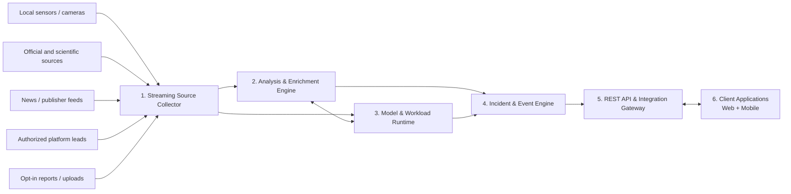
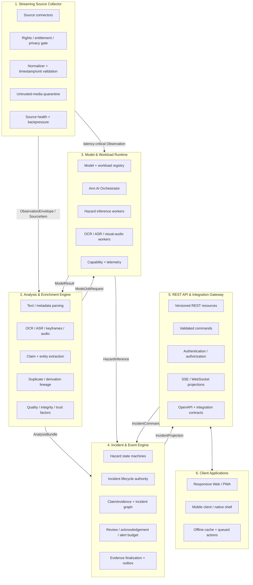
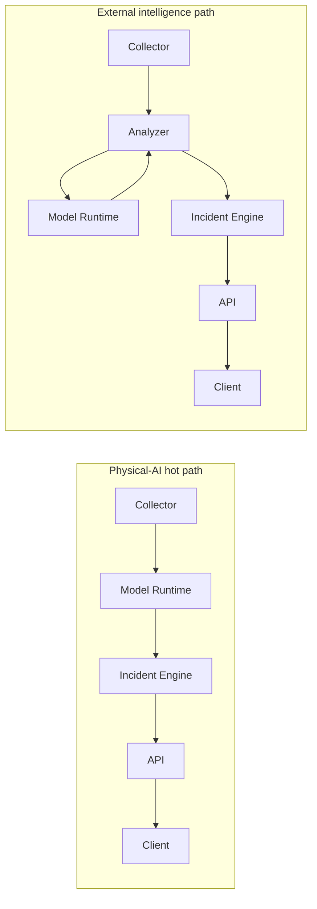
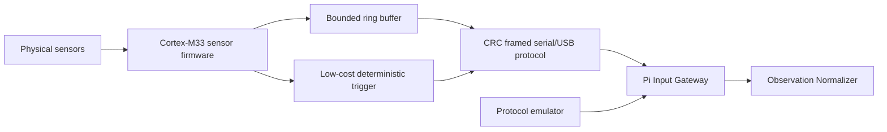
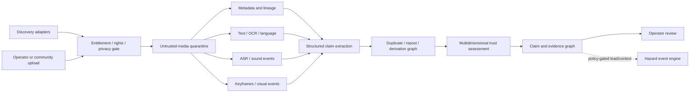
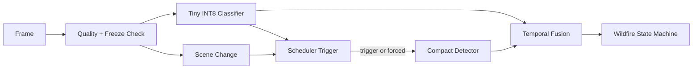
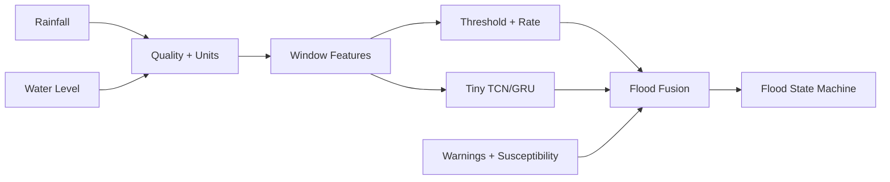
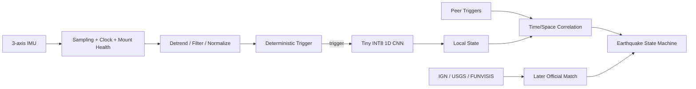
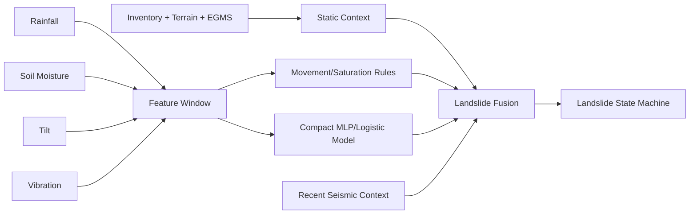

# Sentinel Edge — Full-Scope Technical Contract

**Document ID:** SE-FTC-022  
**Version:** 0.22.0  
**Date:** 2026-08-02  
**Status:** Active-current full-scope architecture, implementation, assurance and lifecycle contract with 193 binding ADRs and exact traceability for all 743 product requirements  
**System type:** Arm64 edge Physical AI and decision-support platform  
**Reference target:** Raspberry Pi 5 or compatible 64-bit Arm Linux node  
**Primary inference runtime:** Pinned ONNX Runtime CPU Execution Provider profile selected only after exact graph/device/build qualification  
**Real-time class:** Empirically bounded soft real-time research/field-lab product; not hard real-time or safety certified  
**Source and external-verification cut-off:** 2026-08-01; v0.22 is a contract-structure consolidation and does not claim a later external revalidation  
**Supersedes:** SE-TAS-021 / v0.21.0  
**Companion contract:** `Sentinel Edge — Full-Scope Product Contract v0.22.0`  
**Contract type:** Full architecture lifecycle covering system boundaries, ADRs, data/wire/API contracts, runtime behavior, security/privacy, operations, evidence, testing, migration and retirement

## 0. Version 0.22 full-scope technical-contract conversion

### 0.1 Conversion objective

Version 0.22 converts the cumulative technical specification into one **active-current full-scope technical contract**. It keeps all 193 ADRs and all detailed normative controls, but historical version sections are reclassified as active control annexes. Version tokens inside retained annex text are provenance labels only and do not make those controls optional or historical.

The conversion adds no new component, hazard, mandatory live source, cloud dependency, general LLM, accelerator, second node or H0 requirement.

### 0.2 Preserved architecture truth

The technical contract preserves:

- six and only six top-level components;
- Component 4 as sole incident-lifecycle and accepted-authority owner;
- component-scoped hazard extensibility;
- mandatory cross-component boundary envelopes;
- module-owned persistence with public ports rather than shared-table coupling;
- validated runtime/model/configuration profiles;
- criticality/deadline scheduling with seismic reservation and bounded degradation;
- exact release-candidate identity and evidence closure;
- typed digest/evidence bindings, source lifecycle, advisory/toolchain and platform runtime controls;
- 743 product-requirement traceability rows and 193 ADRs.

### 0.3 Active-current interpretation

The architecture body, ADRs, control annexes, consolidated traceability registry and generated machine-readable contracts are current. Earlier documents remain provenance only. Where retained prose names an earlier version, the technical rule remains active unless this v0.22 contract explicitly supersedes it.

### 0.4 No new external claims

Runtime, platform, source, standards and research statements retain the v0.21 cut-off of **1 August 2026**. A later external change is handled through the existing source, advisory, qualification and platform-envelope state machines rather than silently incorporated here.


## A. Architecture contract control and precedence

### A.1 Binding hierarchy

For one release candidate, technical truth is resolved in this order:

1. exact release-candidate manifest and generated active-contract/capability records;
2. product requirement registry and selected profile;
3. this technical contract and its 193 ADRs;
4. versioned schemas, policies, source/model/configuration manifests and command catalogues;
5. executable tests, target qualification, benchmark and recovery evidence;
6. external references and research context.

A generated artifact cannot broaden an ADR or product requirement. A prose statement cannot override a failing executable invariant. A mismatch creates `contract_mismatch` and blocks release admission for the affected capability.

### A.2 Architectural conformance

An implementation conforms only when:

- every deployable maps to one of the six components;
- every cross-component call/message uses an admitted port and envelope;
- Component 4 remains the sole incident mutation authority;
- every persisted object has one owner and declared migration/retention behavior;
- every model/runtime/configuration/source capability is manifest-approved;
- every requirement maps to architecture, tests, gates and evidence;
- all enabled profile-specific controls pass on the exact target envelope.

### A.3 Generated versus descriptive truth

Generated schemas, enums, transition maps, command catalogues, requirement registries and capability records are the executable projections of this contract. They must be regenerated deterministically and checked against the prose. Generation success alone is not qualification; generated outputs require tests and exact release-candidate binding.

## B. Full-scope architecture invariants

1. **One system of incident authority.** Component 4 owns accepted incident mutations and journal order.
2. **Explicit component boundaries.** Direct cross-module table access and hidden shared mutable state are forbidden.
3. **Offline-first core.** Remote sources enrich but do not become hidden prerequisites for local H0 detection.
4. **Bounded resources.** CPU, memory, I/O, thermal, power, queue, artifact and operator-attention budgets are explicit.
5. **Fail-visible degradation.** Missing freshness, coverage, time trust, storage or source capability weakens state; it never appears normal.
6. **Typed evidence.** Integrity, signer, digest profile, target binding, content state, rights and derivation are independently represented.
7. **Qualified execution only.** Models, graph/provider combinations, thresholds, geospatial operations and runtime profiles run only inside approved envelopes.
8. **No false exactly-once or hard-real-time claims.** Delivery and service guarantees are expressed with measured, testable semantics.
9. **Human-governed uncertainty.** Review, correction and restricted evidence are first-class technical states.
10. **Lifecycle closure.** Update, migration, rollback, disposition, suspension and retirement are designed before a capability is field-admitted.

## C. Deployment and execution profiles

| Profile/mode | Architecture constraints |
|---|---|
| `judge` | Frozen candidate, deterministic fixtures, no-network-capable, read-only proof route, no developer endpoints |
| `benchmark` | Frozen opportunity/arrival manifests, host/platform qualification, protected analysis/claim set, no mutable external context |
| `field_lab` | Commissioned devices, field-network profile, secure update/recovery, source entitlement, retention and operator governance |
| `development` | Explicitly non-release; debug privileges and mutable inputs isolated from release evidence |
| `recovery` | Reconciliation, watermark/epoch checks, idempotent replay and safe degraded service before fresh escalation |

The same codebase may support several modes, but configuration, credentials, network policy, source set, debug surface and claim authority are mode-bound.

## 1. Purpose

This document specifies the architecture, contracts, algorithms, runtime behavior, data lifecycle, security controls, testing strategy and benchmark methodology for Sentinel Edge.

The implementation must demonstrate that:

1. Multiple heterogeneous hazard workloads can run on one constrained Arm edge node.
2. Critical jobs can retain bounded service under simultaneous load.
3. Model/runtime optimization can be measured separately from adaptive orchestration.
4. Efficiency gains do not hide unacceptable quality regressions.
5. Local monitoring remains inspectable during network, sensor, storage, thermal and process failures.
6. New hazards can use stable component-scoped extension contracts without duplicating the platform.

---

## 2. Architecture thesis

### 2.1 Problem

A naive multi-hazard deployment launches several independent applications at fixed cadences. They compete for:

- CPU cores and vector units.
- Cache and memory bandwidth.
- RAM.
- Camera and sensor IO.
- Storage and encoding.
- Network bandwidth.
- Energy and thermal headroom.

Operating-system scheduling alone does not know that a seismic trigger has a tighter latency requirement than a flood forecast refresh or a map redraw.

### 2.2 Solution

Sentinel Edge introduces an **Arm AI Orchestrator** that schedules prevalidated jobs according to:

- Hazard criticality.
- Absolute deadline.
- Minimum cadence and maximum deferral.
- Fresh local evidence.
- Fresh official/context sources.
- Estimated execution and memory cost.
- Device temperature and throttling state.
- Queue pressure.
- Sensor/model health.
- Active incident state.

### 2.3 Benchmark variants

#### B0 — Naive fixed-rate reference system

- FP32 is used for every learned workload that has a learned profile.
- Deterministic threshold, quality, evidence and state logic is identical to B1/O1.
- Fixed cadence and fixed heavy-model invocation policy.
- No adaptive activation.
- No shared priority beyond OS defaults.
- Same normalized observation stream, opportunity manifest, evidence and UI instrumentation as B1/O1.

#### B1 — Optimized models, fixed-rate system

- INT8 or best validated model profiles.
- Graph, thread and preprocessing optimizations.
- Same cadences as B0.
- No adaptive orchestrator.

This isolates model/runtime optimization.

#### O1 — Optimized models plus orchestrator

- Same optimized model profiles as B1.
- Criticality/deadline scheduling.
- Risk-adaptive cadence.
- Wildfire cascade and forced scans.
- Seismic reserved path.
- Thermal and overload policies.
- Background suppression.

This isolates orchestration gains.

```text
B0 → B1 = model/runtime/preprocessing benefit
B1 → O1 = scheduling/adaptive-cadence benefit
B0 → O1 = total platform benefit
```

---

## 3. Design principles

1. Hazard semantics remain separate.
2. Local inference continues offline.
3. Critical tasks receive bounded resource reservations.
4. Every adaptive decision is explainable and logged.
5. Every external source has authority, time, role, mode and license metadata.
6. Missing or stale input never silently becomes normal.
7. Only prevalidated model profiles run.
8. Quality and efficiency are reported together.
9. The scheduler fails visibly and has a conservative fallback.
10. Fixture mode exercises the real processing path.
11. No LLM is required for critical detection or state transitions.
12. Official messages are preserved rather than creatively rewritten.
13. The system is soft real-time and not safety certified.
14. Evidence is tamper-evident, not forensic-grade.
15. The full pipeline—not only inference—is optimized.
16. Service guarantees are empirical and profile-specific; no average latency is called service-time budget.
17. Model latency and event-detection latency are reported separately.
18. Monitoring coverage is separate from hazard state.
19. A running native inference kernel is not assumed to be application-preemptible.
20. Optional hardware must have a deterministic emulator path.
21. Every release is traceable through cryptographic digests; release-grade artifacts additionally carry signatures and the declared signer/transparency policy.
22. New live sources are optional until their interface, license, freshness and failure behavior pass a source-policy gate.
23. Internal delivery semantics are explicit; effectively-once side effects require durable idempotency, not wishful exactly-once messaging.
24. CRC protects against corruption, not sender impersonation.
25. Judge and benchmark artifacts are immutable during a run.
26. Schema evolution, migration and supported-old-artifact behavior are release contracts.
27. Storage write endurance and checkpoint latency are resource budgets.
28. A source endpoint requires authorization/entitlement as well as technical reachability.
29. Accessibility and deployment governance are verified product properties, not documentation footnotes.
30. The product has exactly six top-level components; sub-processes and shared services must map to one of them without creating hidden architectural authorities.
31. Only the Incident & Event Engine may mutate incident lifecycle state, and only the REST API may serve supported client commands.
32. Source reputation, media integrity, machine-extraction confidence and event confidence are different data.
33. External reports produce claims/evidence, not direct verified hazard state.
34. A URL, embed or public post is not automatically a lawful retained media asset.
35. Reposts and derivative reports share an evidence family until independence is demonstrated.
36. Untrusted media parsing and inference are lower-tier, sandboxed and resource-bounded.
37. No face recognition, speaker identification or person re-identification is part of the system.

---

## 4. Architectural decisions

### 4.0 Complete active ADR index

All 193 ADRs are binding. ADR-001 through ADR-106 are defined in this section; ADR-107 through ADR-193 are defined in the active control annexes identified below.

| ADR | Decision | Binding location |
|---|---|---|
| ADR-001 | Four functional hazard adapters | Section 4 |
| ADR-002 | Physical AI track | Section 4 |
| ADR-003 | Raspberry Pi 5 reference target | Section 4 |
| ADR-004 | ONNX Runtime CPU EP as common inference layer | Section 4 |
| ADR-005 | Verify, do not assume, Arm kernel paths | Section 4 |
| ADR-006 | Static INT8 with per-hazard release gates | Section 4 |
| ADR-007 | Hybrid criticality plus EDF | Section 4 |
| ADR-008 | Reserved earthquake path | Section 4 |
| ADR-009 | Static fallback schedule | Section 4 |
| ADR-010 | Module-owned SQLite WAL stores plus atomic files | Section 4 |
| ADR-011 | Optional Zenoh for peers | Section 4 |
| ADR-012 | No combined hazard probability | Section 4 |
| ADR-013 | Test-only CAP output | Section 4 |
| ADR-014 | Satellite and regional products are asynchronous context | Section 4 |
| ADR-015 | Native benchmark | Section 4 |
| ADR-016 | Python control plane, isolated native workers | Section 4 |
| ADR-017 | Empirical service budgets, not claimed WCET | Section 4 |
| ADR-018 | Admission and isolation instead of hard-preemption claims | Section 4 |
| ADR-019 | Optional Cortex-M33 sensor plane | Section 4 |
| ADR-020 | Two hero hazards and two bounded functional hazards | Section 4 |
| ADR-021 | Runtime/provider bake-off | Section 4 |
| ADR-022 | Observation interoperability maps to OGC SensorThings | Section 4 |
| ADR-023 | Signed reproducibility and supply-chain manifests | Section 4 |
| ADR-024 | Judge-first release architecture | Section 4 |
| ADR-025 | Deterministic Scenario Engine is normative | Section 4 |
| ADR-026 | Release modes have separate configuration envelopes | Section 4 |
| ADR-027 | Machine-readable Claim Registry | Section 4 |
| ADR-028 | Configuration activation is transactional | Section 4 |
| ADR-029 | Restart reconciliation before new escalation | Section 4 |
| ADR-030 | Event-time watermarks and bounded lateness | Section 4 |
| ADR-031 | Operator attention is a constrained resource | Section 4 |
| ADR-032 | After-Event Review export | Section 4 |
| ADR-033 | ArmNN excluded; KleidiAI proof is build-specific | Section 4 |
| ADR-034 | Live-source minimum is zero | Section 4 |
| ADR-035 | Benchmark opportunity accounting | Section 4 |
| ADR-036 | Interference-aware admission | Section 4 |
| ADR-037 | Determinism classes | Section 4 |
| ADR-038 | Artifact trust levels | Section 4 |
| ADR-039 | Read-only model trust boundary | Section 4 |
| ADR-040 | Power quality is a health dimension | Section 4 |
| ADR-041 | Coverage-gated negative evidence and resolution | Section 4 |
| ADR-042 | Immutable derived exports | Section 4 |
| ADR-043 | Runtime release qualification is version-specific | Section 4 |
| ADR-044 | Transactional outbox and idempotent effects | Section 4 |
| ADR-045 | Authenticated node and peer identity | Section 4 |
| ADR-046 | CRC and sensor-plane authentication are separate layers | Section 4 |
| ADR-047 | TUF-inspired signed offline updates | Section 4 |
| ADR-048 | Versioned schema compatibility envelope | Section 4 |
| ADR-049 | Storage durability classes and write budget | Section 4 |
| ADR-050 | Benchmark host/noise qualification | Section 4 |
| ADR-051 | Source entitlement is part of SourcePolicy | Section 4 |
| ADR-052 | Commissioning and site acceptance | Section 4 |
| ADR-053 | Accessibility and deployment-governance gate | Section 4 |
| ADR-054 | Raspberry Pi 5 QPU runtime remains roadmap-only | Section 4 |
| ADR-055 | Conformance profiles and no-paper-compliance rule | Section 4 |
| ADR-056 | Stable runtime freeze authority | Section 4 |
| ADR-057 | Lightweight assurance case and hazard log | Section 4 |
| ADR-058 | OOD and adversarial evidence can only weaken confidence | Section 4 |
| ADR-059 | Explicit startup/readiness barrier | Section 4 |
| ADR-060 | MLCommons-inspired, non-MLPerf benchmark wording | Section 4 |
| ADR-061 | WIS2, CEMS Rapid Mapping and GWIS are context adapters | Section 4 |
| ADR-062 | Local administrator bootstrap is physical and unique | Section 4 |
| ADR-063 | Resource envelope is a release artifact | Section 4 |
| ADR-064 | Final ONNX Runtime 1.28.0 qualification | Section 4 |
| ADR-065 | Twelve submission gate packs and automatic cutline | Section 4 |
| ADR-066 | Normal Linux scheduling is the release baseline | Section 4 |
| ADR-067 | Capture/sample age is distinct from ingest age | Section 4 |
| ADR-068 | Quantized models require post-quantization event calibration | Section 4 |
| ADR-069 | Parser budgets and hostile-container handling | Section 4 |
| ADR-070 | Swap, page faults and memory PSI are service inputs | Section 4 |
| ADR-071 | Paired statistical benchmark contract | Section 4 |
| ADR-072 | Privacy transformation before ordinary persistence | Section 4 |
| ADR-073 | UGLC and Tenerife datasets are offline-only | Section 4 |
| ADR-074 | External intelligence produces claims, not hazard truth | Section 4 |
| ADR-075 | Multimodal analysis is bounded and coverage-aware | Section 4 |
| ADR-076 | Multidimensional trust, no opaque truth score | Section 4 |
| ADR-077 | Evidence-family and derivation graph | Section 4 |
| ADR-078 | Platform-native acquisition and rights gate | Section 4 |
| ADR-079 | YouTube and TikTok URLs are leads by default | Section 4 |
| ADR-080 | WhatsApp is opt-in inbound reporting | Section 4 |
| ADR-081 | Privacy redaction without biometric identity | Section 4 |
| ADR-082 | External media workers cannot endanger Tier A | Section 4 |
| ADR-083 | Exactly six top-level components | Section 4 |
| ADR-084 | Single incident-state authority | Section 4 |
| ADR-085 | Separate analyzer from model runtime | Section 4 |
| ADR-086 | REST-first client and integration boundary | Section 4 |
| ADR-087 | One semantic client component, two delivery surfaces | Section 4 |
| ADR-088 | Dual processing lanes | Section 4 |
| ADR-089 | Six independently testable modules, compact-first deployment | Section 4 |
| ADR-090 | Module-owned persistence and namespace isolation | Section 4 |
| ADR-091 | Cross-platform Python development command surface | Section 4 |
| ADR-092 | Executable architecture policy plus mutation proof | Section 4 |
| ADR-093 | Typed plugin capability model | Section 4 |
| ADR-094 | Public errors are structurally privacy-safe | Section 4 |
| ADR-095 | Semantic compatibility and cross-language contract proof | Section 4 |
| ADR-096 | Common module lifecycle with virtual time and fake ports | Section 4 |
| ADR-097 | Bitemporal incident and evidence history | Section 4 |
| ADR-098 | Version-transition-aware external sources | Section 4 |
| ADR-099 | Standards have “reference” and “qualified implementation” versions | Section 4 |
| ADR-100 | Supply-chain attestations require verifier policy | Section 4 |
| ADR-101 | Product-security readiness without conformity claims | Section 4 |
| ADR-102 | AI transparency labelling is explicit | Section 4 |
| ADR-103 | WIS2 becomes an H1 discovery/context adapter | Section 4 |
| ADR-104 | OpenHydroNet remains an offline flood research asset | Section 4 |
| ADR-105 | ORFEUS/EIDA is the preferred European waveform research source | Section 4 |
| ADR-106 | Dataset article licence and data licence are separate | Section 4 |
| ADR-107 | Durable cross-module state-changing delivery | Section 45 |
| ADR-108 | Sole incident authority is also an explicit availability boundary | Section 45 |
| ADR-109 | Opaque artifact references over immutable content storage | Section 45 |
| ADR-110 | Safe Reference Resolver for user-supplied URLs | Section 45 |
| ADR-111 | Clock epochs and discontinuity handling | Section 45 |
| ADR-112 | Completeness is independent of HTTP/API success | Section 45 |
| ADR-113 | Backfill/catch-up is never promoted to live freshness | Section 45 |
| ADR-114 | Source algorithm/input lineage fingerprint | Section 45 |
| ADR-115 | Released wire payloads are schema-bounded | Section 45 |
| ADR-116 | CloudEvents-compatible boundary envelope and qualified AsyncAPI | Section 45 |
| ADR-117 | Offline commands have expiry, base version and reconnect authorization | Section 45 |
| ADR-118 | Calibration and model compatibility follow physical changes | Section 45 |
| ADR-119 | Cross-store backup/restore is convergence-based | Section 45 |
| ADR-120 | Explicit operational capability matrix | Section 45 |
| ADR-121 | Telemetry contract, privacy and cardinality budget | Section 45 |
| ADR-122 | Corrective-action lifecycle closes the After-Event Review loop | Section 45 |
| ADR-123 | Time-varying location evidence for mobile users/reporters | Section 45 |
| ADR-124 | AI-origin metadata and Article 50 readiness | Section 45 |
| ADR-125 | Field-lab network modes are explicit security profiles | Section 45 |
| ADR-126 | Hazard extensibility is component-scoped | Section 46 |
| ADR-127 | Artifact naming, authorization and lifetime are separate | Section 46 |
| ADR-128 | Durable delivery has per-aggregate causal semantics | Section 46 |
| ADR-129 | Principal provenance is typed | Section 46 |
| ADR-130 | Backup/restore preserves privacy and deletion semantics | Section 46 |
| ADR-131 | Reverse-proxy and browser trust boundary | Section 46 |
| ADR-132 | Model tensor and allocation envelope | Section 46 |
| ADR-133 | Source health includes provider advisory and processing class | Section 46 |
| ADR-134 | FIRMS processing lineage and availability are first-class | Section 46 |
| ADR-135 | EGMS machine-to-machine historical deformation profile | Section 46 |
| ADR-136 | Exposure/impact context is separate from hazard verification | Section 46 |
| ADR-137 | Post-fire cascade context requires overlap and decay | Section 46 |
| ADR-138 | Physical energy evidence has a coverage contract | Section 46 |
| ADR-139 | API-description external references are pinned inputs | Section 46 |
| ADR-140 | Signed audit-head checkpoints | Section 46 |
| ADR-141 | Source connectors declare pull/push acquisition semantics | Section 46 |
| ADR-142 | Arm computer-vision preprocessing is an explicit benchmark axis | Section 46 |
| ADR-143 | Live projections are resumable but never authoritative transport state | Section 46 |
| ADR-144 | Developer/CI commands come from one catalog | Section 46 |
| ADR-145 | Time-validity classes prevent wall-clock security and retention bugs | Section 47 |
| ADR-146 | Public command intent and trusted principal context are different contracts | Section 47 |
| ADR-147 | Webhook ingress requires authenticity, anti-replay and durable acceptance | Section 47 |
| ADR-148 | Client offline cache is privacy- and authority-bounded | Section 47 |
| ADR-149 | Restricted local evidence has an explicit at-rest threat profile | Section 47 |
| ADR-150 | Signed audit-head checkpoints have key continuity and revocation semantics | Section 47 |
| ADR-151 | in-toto v1.2 is an optional interoperable evidence envelope | Section 47 |
| ADR-152 | Geospatial data has canonical CRS, axis and metric semantics | Section 47 |
| ADR-153 | Source catalogue metadata and scientific product semantics remain separate assertions | Section 47 |
| ADR-154 | Observations use typed measurement records, not parallel value/unit maps | Section 48 |
| ADR-155 | A model profile approves complete graph/runtime capability | Section 48 |
| ADR-156 | Direct uploads are authenticated intents streamed into Component-1 quarantine | Section 48 |
| ADR-157 | Authorization decisions carry lifetime and execution semantics | Section 48 |
| ADR-158 | Idempotency namespaces and opaque-token entropy are explicit | Section 48 |
| ADR-159 | Audit verification distinguishes retirement from compromise | Section 48 |
| ADR-160 | Geospatial transforms are environment-pinned and vertical-reference aware | Section 48 |
| ADR-161 | Live projection cursors are epoch- and scope-bound | Section 48 |
| ADR-162 | Exact requirement traceability is generated and release-blocking | Section 48 |
| ADR-163 | Arazzo 1.1 is optional workflow proof, not a second API authority | Section 48 |
| ADR-164 | Durable mutation receipts and projection consistency | Section 49 |
| ADR-165 | Derivation-closed data disposition | Section 49 |
| ADR-166 | Versioned secret and credential lifecycle | Section 49 |
| ADR-167 | Confidential backups and authorized restore | Section 49 |
| ADR-168 | Poison-message quarantine and safe redrive | Section 49 |
| ADR-169 | Scheduled-arrival, queue-inclusive benchmark contract | Section 49 |
| ADR-170 | Correction/retraction reevaluation workflow | Section 49 |
| ADR-171 | Executable applicability domain and bias gates | Section 49 |
| ADR-172 | Loaded geospatial environment and research-source disposition | Section 49 |
| ADR-173 | Physical signal-chain compatibility is part of model identity | Section 50 |
| ADR-174 | Headline benchmarks use a frozen analysis plan and protected claim set | Section 50 |
| ADR-175 | Data disposition closes over learned influence without false unlearning claims | Section 50 |
| ADR-176 | Runtime known issues and graph-pattern quarantine are release inputs | Section 50 |
| ADR-177 | Geospatial qualification is operation-specific and fail-closed | Section 50 |
| ADR-178 | Executable release-minimum and H0 scope budget | Section 50 |
| ADR-179 | One verified boundary envelope carries every cross-component payload | Section 51 |
| ADR-180 | I/O pressure and persistence tails are service inputs | Section 51 |
| ADR-181 | Application artifact trust and host/boot trust are separate claims | Section 51 |
| ADR-182 | UTC trust includes source authenticity and permitted use | Section 51 |
| ADR-183 | Provenance, reproducibility, hermeticity and VEX are different evidence | Section 51 |
| ADR-184 | Drift surveillance manages profile validity and can only weaken trust | Section 51 |
| ADR-185 | New flood-depth and wildfire-deployment evidence remains non-authoritative context | Section 51 |
| ADR-186 | One release-candidate identity closes all evidence | Section 52 |
| ADR-187 | Qualification truth is generated, typed and time-bounded | Section 52 |
| ADR-188 | Component 4 owns one accepted-authority journal | Section 52 |
| ADR-189 | Digest profiles and typed target bindings make evidence interpretable | Section 52 |
| ADR-190 | Artifact budgets and export closure are cumulative | Section 52 |
| ADR-191 | Source capability is a lifecycle and multi-part reads are generation-safe | Section 52 |
| ADR-192 | Advisory intake is multi-source and includes the build toolchain | Section 52 |
| ADR-193 | Platform qualification uses a runtime compatibility envelope | Section 52 |


### ADR-001 — Four functional hazard adapters

**Decision:** Implement wildfire, flood, earthquake and landslide adapters.  
**Reason:** The shared workload-orchestration problem is the project’s differentiator.  
**Consequence:** Every adapter needs a complete input-to-event path and its own metrics.

### ADR-002 — Physical AI track

**Decision:** Submit in Physical AI.  
**Reason:** The platform consumes camera, IMU and environmental signals and makes local anomaly/escalation decisions.  
**Reference:** [Track details](https://arm-ai-optimization-challenge.devpost.com/details/trackdetails)

### ADR-003 — Raspberry Pi 5 reference target

**Decision:** Use Raspberry Pi 5 with active cooling.  
**Reason:** Accessible Arm Cortex-A76 system with camera and sensor support.  
**Consequence:** Optimize for Armv8-A/NEON and measured kernels. Do not claim SME2 support on this processor.

### ADR-004 — ONNX Runtime CPU EP as common inference layer

**Decision:** Export core models to ONNX and execute through ONNX Runtime CPU EP.  
**Reason:** One runtime simplifies model lifecycle, quantization, profiling and deployment.  
**Consequence:** XNNPACK, LiteRT or ExecuTorch may be optional experiments, not critical dependencies.

### ADR-005 — Verify, do not assume, Arm kernel paths

**Decision:** Log the tested runtime build, providers and observed execution.  
**Reason:** A generic statement that a framework “uses KleidiAI” is insufficient proof for one binary/device combination.  
**Consequence:** The submission claims only optimizations verified in the release environment.

### ADR-006 — Static INT8 with per-hazard release gates

**Decision:** Quantize eligible models independently with representative calibration data.  
**Reason:** INT8 may improve storage and memory traffic but can harm rare-event recall or even runtime.  
**Consequence:** Release only quality-validated profiles.

### ADR-007 — Hybrid criticality plus EDF

**Decision:** Use fixed criticality tiers and earliest-deadline-first within a tier.  
**Reason:** Pure priority can starve periodic jobs; pure EDF can let low-criticality work interfere with seismic processing.  
**Consequence:** Each workload declares deadline, empirical service budget, minimum cadence and maximum deferral.

### ADR-008 — Reserved earthquake path

**Decision:** Reserve bounded capacity for IMU preprocessing, deterministic trigger and seismic inference.  
**Reason:** This is the tightest-latency workload.  
**Consequence:** Lower-tier jobs may be withheld from admission, deferred or cooperatively cancelled at declared boundaries.

### ADR-009 — Static fallback schedule

**Decision:** If orchestration fails, use a conservative fixed schedule.  
**Reason:** The scheduler is a shared single point of failure.  
**Consequence:** A watchdog activates fallback and exposes `DEGRADED_ORCHESTRATOR`.

### ADR-010 — Module-owned SQLite WAL stores plus atomic files

**Decision:** Use SQLite WAL for each backend module's owned metadata store and atomic/content-addressed files for owned evidence/artifacts.  
**Reason:** Offline, inspectable and sufficient for one node without turning one shared database into a hidden integration API.  
**Consequence:** No cloud database is required; cross-module state access uses public ports/contracts rather than direct tables.

### ADR-011 — Optional Zenoh for peers

**Decision:** Simulate peers in the default demo; use Zenoh for an optional real multi-node experiment.  
**Reason:** A second device cannot be a judge requirement, and Arm publishes a current Pi/Zenoh path.  
**Reference:** [Arm Zenoh learning path](https://learn.arm.com/learning-paths/cross-platform/zenoh-multinode-ros2/)

### ADR-012 — No combined hazard probability

**Decision:** Use hazard-specific states and uncertainty.  
**Reason:** Different data and correlated sources make a universal percentage scientifically misleading.  
**Consequence:** Cross-hazard relationships live in an incident graph.

### ADR-013 — Test-only CAP output

**Decision:** Consume official warnings and produce only CAP `Test` drafts.  
**Reason:** Operational dissemination requires authority.  
**Consequence:** No MeteoAlarm Hub or ES-Alert transmission.

### ADR-014 — Satellite and regional products are asynchronous context

**Decision:** Treat satellite and long-latency products as susceptibility, context or later corroboration.  
**Reason:** They cannot replace local seconds-to-minutes monitoring.  
**Consequence:** Every adapter exposes timeliness and resolution.

### ADR-015 — Native benchmark

**Decision:** Benchmark native Arm64 deployment.  
**Reason:** Container and host differences can obscure results.  
**Consequence:** Containers may be offered for convenience but comparisons use one deployment mode.

### ADR-016 — Python control plane, isolated native workers

**Decision:** Use Python for rapid orchestration and isolated worker processes for inference and encoding.  
**Reason:** Reduces GIL contention and crash propagation while remaining solo-developer friendly.  
**Consequence:** IPC and queues are bounded and observable.

---

### ADR-017 — Empirical service budgets, not claimed WCET

**Decision:** Replace nominal WCET-style estimates with profile-specific service-time budgets measured at p99/p99.9 plus margin.  
**Reason:** Python, Linux and general-purpose inference runtimes do not provide a formally proven worst-case bound.  
**Consequence:** Budgets are invalidated when hardware, cooling, runtime, model, input shape, thread policy or process placement changes.

### ADR-018 — Admission and isolation instead of hard-preemption claims

**Decision:** Use worker isolation, global thread budgets, CPU affinity/cgroups, nonpreemptible admission gates and cooperative cancellation contracts.  
**Reason:** An application cannot safely interrupt most native inference kernels mid-call.  
**Consequence:** Tier A work is protected by not starting risky lower-tier work, not by promising arbitrary kernel interruption.

### ADR-019 — Optional Cortex-M33 sensor plane

**Decision:** Support a Raspberry Pi Pico 2/RP2350 or compatible Cortex-M33 sensor hub for deterministic sampling and low-cost triggering.  
**Reason:** Separating acquisition from Linux improves timing regularity and gives the Physical AI architecture a defensible sensor boundary.  
**Consequence:** The protocol, firmware and clock relationship become versioned release artifacts; the emulator remains mandatory.

### ADR-020 — Two hero hazards and two bounded functional hazards

**Decision:** Deeply optimize wildfire and earthquake while keeping flood and landslide complete, transparent and compact.  
**Reason:** Four equally deep ML programmes are not credible for one developer before the submission deadline.  
**Consequence:** Shared-platform acceptance remains strict, while learned-model sophistication differs by adapter.

### ADR-021 — Runtime/provider bake-off

**Decision:** Benchmark the released ONNX Runtime CPU EP first, then a reproducible CPU EP/MLAS build with KleidiAI enabled, XNNPACK for compatible floating-point graphs, and only a time-boxed ACL diagnostic. ArmNN is excluded.  
**Reason:** ONNX Runtime 1.25 removed ArmNN, while CPU EP, KleidiAI, XNNPACK and ACL behavior remains graph-, build- and instruction-specific.  
**Consequence:** The release records the ORT tag/commit, compiler, build flags, CPU feature record, providers, per-node assignment/fallback, thread policy and measured result. Raspberry Pi 5 receives no SVE, SME or SME2 claim.

### ADR-022 — Observation interoperability maps to OGC SensorThings

**Decision:** Keep a compact internal schema while providing a documented mapping to SensorThings concepts and GeoJSON/STAC/CAP where appropriate.  
**Reason:** Multi-vendor sensor deployments require stable semantics beyond project-specific JSON.  
**Consequence:** The MVP need not implement a complete SensorThings server, but export/import mapping and conformance fixtures are tested.

### ADR-023 — Signed reproducibility and supply-chain manifests

**Decision:** Generate release, model, configuration, fixture, benchmark and SBOM manifests, hash all artifacts, and sign release-grade manifests under a declared verification policy before startup/benchmark replay.  
**Reason:** Optimization and safety claims are meaningless without exact artifact identity.  
**Consequence:** Dirty/unverified runs are rejected or explicitly labelled.

### ADR-024 — Judge-first release architecture

**Decision:** Ship deterministic replay, precomputed signed results and a read-only Judge Proof route.  
**Reason:** Judges may evaluate only submission materials and may not install hardware.  
**Consequence:** Repository/video evidence is treated as a production deliverable, not a documentation afterthought.


### ADR-025 — Deterministic Scenario Engine is normative

**Decision:** All four adapters, scheduler decisions, failures and recovery paths are driven by a versioned scenario engine in fixture and benchmark modes.  
**Reason:** A collection of ad hoc scripts cannot prove simultaneous-event behavior or reproduce scheduling decisions.  
**Consequence:** Scenario manifests define event-time input, release order, clock behavior, source availability, injected faults and expected invariants. Live adapters translate into the same observation contract.

### ADR-026 — Release modes have separate configuration envelopes

**Decision:** Define `judge`, `benchmark`, `field_lab` and `development` modes with schema-validated immutable startup manifests.  
**Reason:** Debug endpoints, random live context or permissive fallbacks can silently invalidate evidence and benchmarks.  
**Consequence:** Benchmark and Judge Proof modes reject dirty repositories, unverified artifacts, unknown profiles, mutable source schedules and developer-only features.

### ADR-027 — Machine-readable Claim Registry

**Decision:** Every headline statement resolves to a `ClaimRecord` classified as `measured`, `replayed`, `simulated`, `target` or `research`.  
**Reason:** Product prose, charts and videos otherwise drift away from raw evidence.  
**Consequence:** The UI and generated submission tables are built from the registry; a missing artifact blocks a measured claim.

### ADR-028 — Configuration activation is transactional

**Decision:** Configuration changes use validate → stage → self-test → activate → monitor → rollback.  
**Reason:** A valid YAML file may still select an unavailable model, unsafe threshold or unmeasured runtime profile.  
**Consequence:** The last-known-good bundle remains available and the system records the actor, diff, hashes and activation result.

### ADR-029 — Restart reconciliation before new escalation

**Decision:** On process or node restart, Sentinel reconciles queues, event state, manifests, clock quality and incomplete evidence before accepting fresh escalation.  
**Reason:** Replaying buffered input or recovering half-written state can create duplicate or temporally impossible events.  
**Consequence:** Recovery has an explicit state machine and watermark; replayed data is visible and cannot masquerade as live input.

### ADR-030 — Event-time watermarks and bounded lateness

**Decision:** Stream processing uses per-source event-time watermarks, sequence gaps and an adapter-specific lateness policy.  
**Reason:** Ingest order is not event order during buffering, reconnects or source delays.  
**Consequence:** Late records may enrich evidence but cannot retroactively create a fresh notification outside the configured correction window.

### ADR-031 — Operator attention is a constrained resource

**Decision:** Introduce an alert budget, incident-level deduplication and a review queue with expiry and escalation rules.  
**Reason:** A technically accurate detector can still fail operationally through alert fatigue.  
**Consequence:** Notifications are measured per incident; suppression never suppresses evidence capture or hides higher-severity/new-modality evidence.

### ADR-032 — After-Event Review export

**Decision:** Every completed scenario or real incident can generate a structured After-Event Review package.  
**Reason:** July 2026 UN guidance treats systematic post-event learning as part of effective early-warning operations.  
**Consequence:** The package reconstructs observation, processing, decision, operator and external-corroboration timelines and identifies coverage gaps, delays, false alarms and unresolved actions.

### ADR-033 — ArmNN excluded; KleidiAI proof is build-specific

**Decision:** Do not use the removed ArmNN EP. The primary experiments are the released CPU EP/MLAS build and a reproducible custom CPU EP build with KleidiAI enabled; XNNPACK is used only for compatible floating-point graphs and ACL is a time-boxed diagnostic.  
**Reason:** ONNX Runtime 1.25 removed ArmNN and current KleidiAI integration is build- and instruction-path dependent.  
**Consequence:** The release records the exact ORT tag/commit, compiler, build flags, CPU features, kernel-disable controls, provider assignments and measured effect. No integration is claimed from a package name alone.

### ADR-034 — Live-source minimum is zero

**Decision:** No remote source is required for local detection, fixture acceptance, Judge Proof or benchmark validity.  
**Reason:** Tokens, terms, maintenance windows and schema changes are outside submission control.  
**Consequence:** Preferred live integrations are limited to MeteoAlarm and one authoritative seismic catalogue after the core passes. Other adapters remain fixture-backed or optional.

### ADR-035 — Benchmark opportunity accounting

**Decision:** Every adaptive workload receives a signed observation-opportunity manifest and a counterfactual audit over valid skipped opportunities.  
**Reason:** Lower compute can be manufactured by not looking at difficult inputs.  
**Consequence:** Online O1 quality, skipped-opportunity counts and offline shadow/oracle results are reported separately; shadow evaluation is never presented as live detection.

### ADR-036 — Interference-aware admission

**Decision:** Admission uses measured solo and co-run interference profiles, not only per-job latency budgets.  
**Reason:** Cache, memory bandwidth, kernel threads and thermal coupling can make two individually safe jobs unsafe together.  
**Consequence:** Unknown heavy-workload pairs use a conservative inflation factor or are not co-admitted in Tier A protection windows.

### ADR-037 — Determinism classes

**Decision:** Reproducibility claims use `byte_exact`, `numeric_tolerance` or `semantic` determinism.  
**Reason:** Multithreaded floating-point kernels may not produce byte-identical tensors even when the product decision is stable.  
**Consequence:** Scenario verification declares comparison tolerances and threshold-separation rules rather than pretending every inference byte is identical.

### ADR-038 — Artifact trust levels

**Decision:** Separate cryptographic hash, signature, signer identity and transparency/timestamp evidence.  
**Reason:** A digest detects change but does not authenticate who produced the artifact.  
**Consequence:** Public release artifacts use a verifiable signature bundle where practical; offline field bundles pin a public key. Hash-only artifacts are labelled `integrity_only`.

### ADR-039 — Read-only model trust boundary

**Decision:** Release modes load only manifest-approved models from a read-only local directory.  
**Reason:** Model parsing, external-data resolution and graph optimization process complex attacker-controlled structures.  
**Consequence:** No arbitrary model upload, model URL, remote external-data reference or runtime conversion is exposed through the API.

### ADR-040 — Power quality is a health dimension

**Decision:** Track Raspberry Pi under-voltage, frequency-cap and throttling flags separately from temperature.  
**Reason:** A cool node with a weak power supply can still miss deadlines and invalidate energy/performance results.  
**Consequence:** Current or historical under-voltage is recorded; current under-voltage/frequency capping invalidates a benchmark and creates `DEGRADED_POWER`.

### ADR-041 — Coverage-gated negative evidence and resolution

**Decision:** Negative observations can lower confidence or resolve an event only when required monitoring coverage is sufficient for that conclusion.  
**Reason:** Silence from a frozen, disconnected or stale sensor is not evidence of safety.  
**Consequence:** Automatic resolution is blocked under blind coverage; operator resolution requires an explicit coverage-aware reason.

### ADR-042 — Immutable derived exports

**Decision:** Redaction, coordinate coarsening, clipping and transcoding create a new derived evidence bundle with a parent hash and transformation manifest.  
**Reason:** Editing the canonical evidence bundle destroys auditability.  
**Consequence:** Original evidence is immutable; public/judge exports can be reproduced and verified independently.

### ADR-043 — Runtime release qualification is version-specific

**Decision:** Prefer ONNX Runtime 1.28.0 as stable P0 after complete exact-artifact Arm64 qualification. Keep 1.27.1 as a signed rollback/comparator.  
**Reason:** The official GitHub release page now marks 1.28.0 as `Latest` and documents substantial security/input-validation hardening. Version 1.27.1 documents the KleidiAI `igemm` regression fix and remains a valuable comparator.  
**Consequence:** Exact model/runtime combinations are benchmarked and signed. An RC cannot become the submission baseline after freeze; every future runtime upgrade requires security review, known-answer tests and renewed service/interference budgets.

### ADR-044 — Transactional outbox and idempotent effects

**Decision:** Persist notification, export and other side-effect intents in the same database transaction as the event/review change; dispatch them at least once with stable idempotency keys.  
**Reason:** A crash between commit and send otherwise loses or duplicates an operator-visible effect.  
**Consequence:** Consumers and local dispatchers must record idempotency receipts, retry bounds and dead-letter state. The architecture claims effectively-once effects, not globally exactly-once processing.

### ADR-045 — Authenticated node and peer identity

**Decision:** Remote peers use per-device cryptographic identity, authenticated channels/messages, anti-replay state, enrollment and revocation.  
**Reason:** Source IDs, IP allowlists and CRC do not authenticate a sender.  
**Consequence:** An unknown/revoked/unauthenticated peer cannot contribute to `MULTI_NODE_TRIGGER` or trusted corroboration. Historical evidence retains the identity state at observation time.

### ADR-046 — CRC and sensor-plane authentication are separate layers

**Decision:** Keep CRC for frame-corruption detection and optionally add a frame MAC/secure channel for the Cortex-M33 sensor plane.  
**Reason:** CRC is valuable for serial reliability but provides no adversarial authenticity.  
**Consequence:** A CRC-only directly attached sensor is labelled `transport_untrusted`; it may support local research observation but cannot strengthen remote/multi-node trust claims.

### ADR-047 — TUF-inspired signed offline updates

**Decision:** Judge/benchmark modes are immutable. Field-lab update bundles carry signed root/target/version/expiry/compatibility metadata, are staged offline and activate only after power/storage/self-test gates.  
**Reason:** A valid file hash/signature alone does not prevent stale, rollback, freeze or wrong-target updates.  
**Consequence:** The submission may ship a verifier and manual activation workflow; automatic OTA retrieval is post-submission. Last-known-good rollback remains mandatory.

### ADR-048 — Versioned schema compatibility envelope

**Decision:** Every persisted/IPC/API artifact declares a schema version; the release supports a declared current/N-1 envelope and process contract handshake.  
**Reason:** Partial worker upgrades or new unknown fields can silently change units, missingness and state semantics.  
**Consequence:** Incompatible workers do not start; migrations rehearse on a copy; original source payloads are retained for reinterpretation.

### ADR-049 — Storage durability classes and write budget

**Decision:** Separate `critical_truth`, `evidence_index`, `telemetry` and `cache` durability classes and enforce write-rate/checkpoint budgets.  
**Reason:** Per-sample durable writes create SD wear, IO jitter and unpredictable WAL checkpoints.  
**Consequence:** Critical transitions/reviews/outbox use the strongest demonstrated durability; telemetry is batched and may lose a declared tail after power loss.

### ADR-050 — Benchmark host/noise qualification

**Decision:** A measured run requires a signed host snapshot and pre-run idle/noise qualification, including lower-layer egress denial.  
**Reason:** Governor, IRQ, cache, provider-thread and background-service differences can dominate Pi tail latency.  
**Consequence:** Out-of-envelope runs are invalid or separately labelled; application flags alone are insufficient to prove no network use.

### ADR-051 — Source entitlement is part of SourcePolicy

**Decision:** Add access class, entitlement owner/status and permitted-use fields to each source.  
**Reason:** A reachable endpoint may be member-only or restricted for redistribution. MeteoAlarm currently documents EDR/MQTT for members/re-distributors while public MeteoGate is pending.  
**Consequence:** Atom/fixtures are the default weather-warning path; EDR/MQTT cannot run without an active entitlement record.

### ADR-052 — Commissioning and site acceptance

**Decision:** Site-specific verified behavior requires a versioned commissioning record for identity, orientation, datum, baseline noise, camera sector and privacy mask.  
**Reason:** Correct code cannot compensate for an uncommissioned gauge datum, loose IMU or wrong tilt zero.  
**Consequence:** Missing/expired commissioning forces degraded/review-only behavior for affected claims.

### ADR-053 — Accessibility and deployment-governance gate

**Decision:** Target WCAG 2.2 AA behavior for core UI and require an intended-purpose/regulatory-readiness card before operational deployment.  
**Reason:** Keyboard-only testing is insufficient, and a research prototype must not imply AI Act, CRA, GDPR or warning-authority compliance.  
**Consequence:** Reduced-motion/text equivalents are tested; optional generated prose stays outside critical paths; conformity classification remains deployer-specific.

### ADR-054 — Raspberry Pi 5 QPU runtime remains roadmap-only

**Decision:** Do not add experimental VideoCore VII QPU inference to the hackathon release matrix.  
**Reason:** The 2026 research stack is preliminary, adds custom-kernel maintenance and would obscure the required Arm CPU optimization story.  
**Consequence:** It may be evaluated after submission as an explicitly separate research track.

### ADR-055 — Conformance profiles and no-paper-compliance rule

**Decision:** Assign every normative requirement to `H0`, `H1`, `F1` or `R`, and persist implementation status plus evidence references.  
**Reason:** A solo hackathon cannot credibly implement every field-lifecycle control in the architecture.  
**Consequence:** The twelve `G0` gate packs block submission. Detailed `H0` rows contribute to their mapped gate, while Judge Proof visibly distinguishes demonstrated, specified and deferred controls.

### ADR-056 — Stable runtime freeze authority

**Decision:** Use the official ONNX Runtime GitHub release state as authority; qualify 1.28.0 as P0 and retain 1.27.1 as rollback/comparator.  
**Reason:** Package indexes and generated metadata can appear before final project validation.  
**Consequence:** Runtime promotion requires stable status, Arm64 artifact/build provenance, exact-graph qualification and completion before the freeze date.

### ADR-057 — Lightweight assurance case and hazard log

**Decision:** Link claims to hazards, controls, tests, evidence and residual limitations.  
**Reason:** Safety wording and architecture diagrams are not evidence that failure modes are controlled.  
**Consequence:** An unsupported safety or optimization claim cannot be generated into Judge Proof.

### ADR-058 — OOD and adversarial evidence can only weaken confidence

**Decision:** Quality/OOD/adversarial indicators may reject input, degrade coverage or require review; they cannot add confirmation strength.  
**Reason:** Unknown or manipulated data must not become positive evidence.  
**Consequence:** State machines and fusion contracts enforce monotonic trust reduction for suspect inputs.

### ADR-059 — Explicit startup/readiness barrier

**Decision:** Boot and recovery pass artifact, schema, storage, clock, worker and minimum-coverage gates before normal operation.  
**Reason:** A restarted node can otherwise emit false normality or replay stale samples.  
**Consequence:** `BOOTING`, `RECOVERING`, `SAFE_DEGRADED` and `READY` are observable states; only `READY` permits fresh escalation.

### ADR-060 — MLCommons-inspired, non-MLPerf benchmark wording

**Decision:** Adopt fixed-quality, same-workload and complete-system energy principles without calling Sentinel results MLPerf.  
**Reason:** MLPerf is a governed benchmark with specific models, datasets and rules.  
**Consequence:** Reports say “MLCommons-inspired methodology,” disclose deviations and use physical energy or an explicitly labelled proxy.

### ADR-061 — WIS2, CEMS Rapid Mapping and GWIS are context adapters

**Decision:** Add standards-based discovery and public activation/fire services only as T1–T3 asynchronous context.  
**Reason:** They improve provenance and post-event enrichment but cannot satisfy local latency or independence requirements.  
**Consequence:** Signed fixtures and correlation-group metadata remain mandatory; none is an `H0` dependency.

### ADR-062 — Local administrator bootstrap is physical and unique

**Decision:** First-run administration uses a local/physical ceremony and unique credentials; no default shared password exists.  
**Reason:** Localhost defaults do not protect a node after LAN exposure or image cloning.  
**Consequence:** Bootstrap/recovery is audited, rate-limited and unavailable in judge/benchmark mode.

### ADR-063 — Resource envelope is a release artifact

**Decision:** Publish a capability-specific CPU-thread, RSS, queue, storage-write and thermal envelope for `H0`.  
**Reason:** Independent component limits do not prove the whole node fits.  
**Consequence:** Startup and benchmark qualification reject configurations whose declared worst measured envelope exceeds reserves.

### ADR-064 — Final ONNX Runtime 1.28.0 qualification

**Decision:** Treat official v1.28.0 as the preferred stable P0, not as automatically accepted software. Qualify one exact Arm64 artifact and keep v1.27.1 as rollback/comparator.  
**Reason:** v1.28.0 became final on 25 July 2026 and includes broad loader, bounds, overflow and dependency hardening, but a new runtime can still regress one graph or package.  
**Consequence:** Runtime promotion runs approved-model known-answer tests, malformed/external-data corpus tests, event-level quality, provider assignment, warm/cold latency, RSS, co-run interference and rollback rehearsal.

### ADR-065 — Twelve submission gate packs and automatic cutline

**Decision:** Aggregate detailed conformance records into twelve `G0` gate packs and automatically defer optional features when a gate turns red.  
**Reason:** A flat list of more than one hundred hackathon-scope requirements is not an executable solo-developer plan.  
**Consequence:** `python scripts/dev.py gates` is the release status authority; a new source/model/provider cannot enter without a gate impact record and rerun list.

### ADR-066 — Normal Linux scheduling is the release baseline

**Decision:** Use `SCHED_OTHER` with measured affinity, cpuset, nice level and runtime thread budgets. Keep `SCHED_FIFO`/`SCHED_RR` outside the release dependency.  
**Reason:** Privileged real-time policies can starve the API, storage, kernel work or watchdog and create priority-inversion failures that a demo does not reveal.  
**Consequence:** Any real-time-policy experiment runs in an isolated service with bounded CPU/runtime, watchdog, no unbounded locks and a normal-scheduler control.

### ADR-067 — Capture/sample age is distinct from ingest age

**Decision:** Add capture/sample timestamp provenance, source FIFO delay, decode completion and frame/window age to observations and jobs.  
**Reason:** RTSP buffering, video decode and sensor FIFO replay can make an observation old while application ingest and inference appear fast.  
**Consequence:** Fresh-event gates use the best trustworthy capture/sample time and uncertainty; stale inputs can enrich evidence but cannot create a fresh alert.

### ADR-068 — Quantized models require post-quantization event calibration

**Decision:** Calibrate output scores, thresholds and ambiguity margins separately for each quantized artifact and evaluate full state-machine events.  
**Reason:** Numeric closeness or frame accuracy can hide shifted confidence, persistence and event transitions.  
**Consequence:** An INT8 profile is rejected when it violates event recall, false-alert, abstention or time-to-detection guardrails even if it is faster.

### ADR-069 — Parser budgets and hostile-container handling

**Decision:** Give image/video/XML/JSON/archive/model parsers explicit byte, nesting, dimensions, duration, expansion-ratio and wall-time budgets.  
**Reason:** Well-formed inputs can still exhaust CPU/RAM/disk; archives and XML add traversal, bomb and entity-expansion risks.  
**Consequence:** Parsing occurs before trusted state, archive extraction uses a new bounded directory with path validation, XML disables external entities/network, and timeout/failure creates source/input degradation rather than process-wide failure.

### ADR-070 — Swap, page faults and memory PSI are service inputs

**Decision:** Record swap/zram configuration, major page faults, memory PSI and page-cache condition; integrate pressure into admission and benchmark validity.  
**Reason:** Memory reclaim can dominate tail latency while RSS appears acceptable.  
**Consequence:** Uncontrolled swap activity invalidates headline latency; pressure sheds background work, pins protected buffers and may select smaller validated profiles.

### ADR-071 — Paired statistical benchmark contract

**Decision:** Run B0/B1/O1 in paired alternating blocks with fixed inputs, cooling/order controls and report intervals/effect sizes.  
**Reason:** A single percentage delta can be thermal drift or background noise.  
**Consequence:** The Claim Registry stores paired block IDs, invalid blocks, aggregation query, bootstrap/confidence interval and absolute baseline/optimized values.

### ADR-072 — Privacy transformation before ordinary persistence

**Decision:** Apply configured camera masks and coordinate minimization before writing normal evidence.  
**Reason:** A privacy mask only in the UI or public export still leaves unnecessary raw personal/location data on the device.  
**Consequence:** Optional original buffers are short-lived, encrypted or access-restricted where used, have a declared deletion deadline and are absent in judge mode by default.

### ADR-073 — UGLC and Tenerife datasets are offline-only

**Decision:** Add the Unified Global Landslide Catalogue and Tenerife multi-hazard dataset to offline evaluation/scenario tooling, not source adapters that affect current state.  
**Reason:** They improve global/historical coverage but contain heterogeneous provenance, reporting bias, uncertain timing and duplicate/cause ambiguity.  
**Consequence:** Derived fixtures retain record-level lineage and deduplication; catalogue absence is never a negative sensor observation.


### ADR-074 — External intelligence produces claims, not hazard truth

**Decision:** News, social posts, community submissions and multimedia analysis create `EvidenceClaim` objects and review leads. They do not directly write a verified hazard state.  
**Reason:** Publisher reputation, account verification or model confidence cannot establish that one incident claim is true.  
**Consequence:** Hazard state engines consume external claims only through explicit role/trust/corroboration policies; low-standing evidence may raise bounded sensing/review priority but cannot independently verify or resolve.

### ADR-075 — Multimodal analysis is bounded and coverage-aware

**Decision:** Images use bounded vision/OCR jobs; audio uses bounded ASR/sound-event windows; video is processed through metadata, shot/keyframe sampling, short clips and audio segments.  
**Reason:** Full-resolution continuous multimedia analysis is incompatible with the Pi resource envelope and can hide uninspected intervals.  
**Consequence:** Every result records analysed temporal/spatial coverage, skipped intervals, model/profile, abstention and resource cost. Heavy generic VLM processing is outside the critical path.

### ADR-076 — Multidimensional trust, no opaque truth score

**Decision:** Store source standing, identity assurance, directness, content lineage/integrity, freshness/geospatial fit, extraction confidence, independence and claim corroboration as separate assessments.  
**Reason:** A single score obscures why evidence is trusted and mixes unrelated uncertainties.  
**Consequence:** A summary band is optional, versioned and explainable; the UI and decision trace always expose the factors and unknowns.

### ADR-077 — Evidence-family and derivation graph

**Decision:** Resolve exact/near-duplicate media, reposts, screenshots, quotes, translations and summaries into a derivation graph and `evidence_family_id`.  
**Reason:** Ten reposts or ten news articles quoting one witness are not ten independent confirmations.  
**Consequence:** Corroboration counts independent families/sensors, retains contradictory branches and preserves likely-origin uncertainty.

### ADR-078 — Platform-native acquisition and rights gate

**Decision:** Every external item passes a documented acquisition, entitlement, licence/copyright, privacy and retention gate before bytes are fetched or persisted.  
**Reason:** Public discoverability does not grant arbitrary download, storage or machine-analysis rights.  
**Consequence:** The system distinguishes `reference_only`, `derived_only` and `retain_bytes`; unsupported scraping/downloading is not shipped.

### ADR-079 — YouTube and TikTok URLs are leads by default

**Decision:** Use supported metadata/search/embed interfaces and analyse media bytes only when supplied by the uploader/rights holder, covered by a valid licence/permission, or obtained through an approved platform research/export route.  
**Reason:** YouTube policies prohibit arbitrary audiovisual download/cache and scraping; TikTok Display/Research products have authorization, eligibility and latency boundaries.  
**Consequence:** A URL can create a referenced lead while the media-analysis capability remains `unavailable_due_to_rights` or `metadata_only`.

### ADR-080 — WhatsApp is opt-in inbound reporting

**Decision:** Integrate WhatsApp only through an enrolled Business Platform number, webhooks and the Media API for messages intentionally sent to that number.  
**Reason:** WhatsApp is private end-to-end messaging, not a public discovery feed.  
**Consequence:** Sender identity is minimized/pseudonymized, consent/notice and retention apply, and the architecture has no group/chat enumeration, historical scrape or encryption bypass.

### ADR-081 — Privacy redaction without biometric identity

**Decision:** Face/plate/person/speech detection may support redaction and segmentation, but face recognition, speaker identification, person re-identification and identity inference are disabled.  
**Reason:** Incident intelligence does not require biometric identification and the privacy/abuse risk is disproportionate.  
**Consequence:** Model manifests and API contracts reject biometric identity profiles; precise identity remains operator-supplied/official and role-controlled.

### ADR-082 — External media workers cannot endanger Tier A

**Decision:** Discovery, download, decode, OCR, ASR, visual analysis and embedding/perceptual matching run in lower-tier isolated workers with CPU/RSS/time/disk budgets.  
**Reason:** Malformed or simply large media can consume enough resources to break local sensing guarantees.  
**Consequence:** Pressure cancels or defers external analysis first; queue overload creates `DEGRADED_EXTERNAL_INTELLIGENCE`, never silent Tier A loss.


### ADR-083 — Exactly six top-level components

**Decision:** Define the normative architecture as six components: Streaming Source Collector, Analysis & Enrichment Engine, Model & Workload Runtime, Incident & Event Engine, REST API & Integration Gateway, and Client Applications (Web + Mobile).  
**Reason:** The previous architecture accurately described many services but did not provide a simple ownership model for implementation, deployment and judge communication.  
**Consequence:** Every process, package, schema and data write maps to one of the six components or an explicitly shared platform service.

### ADR-084 — Single incident-state authority

**Decision:** Only the Incident & Event Engine may create, update, merge, split, link, verify, resolve or reopen an incident.  
**Reason:** Allowing collectors, models, API handlers or clients to mutate incident truth creates inconsistent transitions, bypasses trust rules and weakens auditability.  
**Consequence:** All incident mutations use versioned commands and optimistic/idempotent processing; database permissions and tests enforce the boundary.

### ADR-085 — Separate analyzer from model runtime

**Decision:** The Analysis & Enrichment Engine owns interpretation pipelines and requests bounded execution from the Model & Workload Runtime.  
**Reason:** Parsing, OCR/ASR, claim extraction and lineage are workflows, whereas model execution needs a centralized trust, resource and version boundary.  
**Consequence:** No component loads a release model outside the runtime; analysis outputs remain explicit derived artifacts rather than hidden model side effects.

### ADR-086 — REST-first client and integration boundary

**Decision:** All supported web/mobile and third-party operations use a versioned REST API. Authenticated SSE/WebSocket may deliver projections and notifications but cannot become a parallel mutation API.  
**Reason:** A single resource/command contract simplifies authorization, offline synchronization, testing and future mobile delivery.  
**Consequence:** Clients never connect to SQLite, filesystem paths, internal queues or worker sockets.

### ADR-087 — One semantic client component, two delivery surfaces

**Decision:** Treat web/PWA and mobile as one major client component with shared domain types, design semantics and generated API bindings.  
**Reason:** Users must see the same incident state, confidence/trust dimensions, disclaimers and review effects on every surface.  
**Consequence:** Platform-specific UX is allowed, semantic divergence is not; contract fixtures run against both clients.

### ADR-088 — Dual processing lanes

**Decision:** Support a direct physical hot path and an enriched external-intelligence path.  
**Reason:** Camera/IMU hazard detection needs bounded latency, while news/social/media analysis is richer but deferrable and potentially hostile.  
**Consequence:** External-intelligence queues are lower tier and cannot consume the reserved capacity required by physical monitoring.

### ADR-089 — Six independently testable modules, compact-first deployment

**Decision:** Treat the six product components as six bounded modules. Components 1–5 are independently packageable backend modules; Component 6 is an independently buildable client workspace. The default Pi deployment may co-locate backend modules, but communication still crosses declared ports.

**Reason:** Independent packaging and black-box testing expose hidden coupling before later process separation and make the architecture provable in Iteration-02.

**Consequence:** No module may rely on another module's internal package, database schema, migration, artifact directory or secret. In-process adapters implement the same port contracts as service adapters.

### ADR-090 — Module-owned persistence and namespace isolation

**Decision:** Replace ambiguous shared-business-state wording with owned persistence. Each backend module owns its database or database namespace, migrations, durable inbox/outbox where needed, artifact namespace and secret references.

**Reason:** A single convenient SQLite store easily becomes an undocumented integration API and prevents independent recovery, migration and testing.

**Consequence:** Cross-module reads occur through public queries/events/projections. Cross-owned SQL, filesystem and secret-path access is a release-blocking architecture violation. A compact deployment may place files on one physical volume, but ownership remains logical and enforceable.

### ADR-091 — Cross-platform Python development command surface

**Decision:** The authoritative project command surface is `python scripts/dev.py <command>`.

**Reason:** One Python entry point is portable across supported developer environments, makes CI/local behavior converge, and avoids parallel command contracts.

**Consequence:** Supported subcommands are defined once in `architecture/command-catalog.yaml` and surfaced through `python scripts/dev.py`; Section 44.3 is the human-readable catalog view. Core quality lanes include setup/doctor, formatting/lint/type, governance/architecture/contracts, module/client/package tests, compatibility/generated checks, scenario/security/privacy/accessibility, benchmark/provenance/docs, the aggregate `test-all` lane and `gates`; release/judge helpers are catalogued by the same mechanism. Unknown/empty mandatory lanes fail.

### ADR-092 — Executable architecture policy plus mutation proof

**Decision:** Import rules, dependency rules, ownership namespaces, authority ownership and client capabilities are machine-readable policy inputs, not duplicated test constants.

**Reason:** Static architecture tests can produce false greens when their implementation silently diverges from the policy documents they appear to validate.

**Consequence:** CI mutates representative imports, package dependencies, database/artifact/secret paths, permissions, authorities and client capabilities and proves that every forbidden mutation fails with a stable reason code.

### ADR-093 — Typed plugin capability model

**Decision:** Plugin manifests choose from typed, module-owned capabilities. Unknown capability/mode names are rejected; permissions are not free-form authority strings.

**Reason:** Denying known spellings such as `incident_writer` is bypassable by a renamed mode.

**Consequence:** The SDK has no capability that allows a collector, analyzer, runtime or third-party plugin to mutate incident lifecycle state. Plugin dependency graphs are acyclic; activation is verify → compatibility → self-test → activate, with bounded degrade/quarantine/rollback.

### ADR-094 — Public errors are structurally privacy-safe

**Decision:** Separate `PublicProblem` from private diagnostic/exception records and serialize only an allowlist of public fields.

**Reason:** Keyword redaction cannot reliably detect API keys, authorization headers, DSNs, filesystem paths, personal content or novel secret formats.

**Consequence:** Client responses use RFC 9457-style fields, stable public error codes, correlation identifiers and safe parameter locations. Raw upstream bodies, exception text and secrets are never copied into public `detail`.

### ADR-095 — Semantic compatibility and cross-language contract proof

**Decision:** Current/N-1 compatibility checks operate on contract semantics and canonical fixtures, and generated Python/TypeScript artifacts are compiled and round-tripped.

**Reason:** File existence and schema-version marker tests do not catch type, requiredness, unit or meaning changes.

**Consequence:** Breaking mutations to identifiers, required fields, enums, numeric units, timestamp semantics, authority fields, idempotency and error shapes fail. Generated-code drift is release-blocking.

### ADR-096 — Common module lifecycle with virtual time and fake ports

**Decision:** Every backend module implements the same externally testable lifecycle: `validate_config`, `start`, `readiness`, `health`, `drain(deadline)`, `stop` and `diagnostic_snapshot`.

**Reason:** A lifecycle shell that manually toggles health does not prove dependency failure, timeout, recovery or drain behavior.

**Consequence:** Standalone component tests use fake ports and a virtual clock to cover malformed configuration, dependency timeout/outage, recovery, graceful drain deadline, crash/restart, empty-state startup and owned-state reconciliation.

### ADR-097 — Bitemporal incident and evidence history

**Decision:** Persist both event-time facts and system/knowledge-time revisions for material incident/evidence changes.

**Reason:** Official catalogues, provisional gauges, publisher articles and operator reviews can be corrected after Sentinel has already acted. Overwriting the row loses what the system knew when a decision was made.

**Consequence:** Corrections, supersessions, retractions and deletion requests create immutable revision/tombstone records. Current projections select the latest valid knowledge state, while audit/replay can reconstruct any prior decision context.

### ADR-098 — Version-transition-aware external sources

**Decision:** Every source policy identifies interface/product version, rollout state, terms/licence fingerprint and a compatibility fixture set.

**Reason:** A source can remain reachable while changing satellites, hydrological model versions, schemas or entitlement conditions.

**Consequence:** Major or behavior-changing transitions move the adapter to `review_required` until fixtures, mappings and trust/correlation assumptions are requalified. For example, CEMS GFM 4.1.1's Sentinel-1C/1D constellation transition is not silently treated as the same upstream observation process.

### ADR-099 — Standards have “reference” and “qualified implementation” versions

**Decision:** Record the latest published standard separately from the version actually supported by the selected toolchain.

**Reason:** Adopting a new specification number before validators/generators support it creates paper interoperability.

**Consequence:** v0.14 records OpenAPI 3.2.0 and AsyncAPI 3.1.0 as current references, but the release manifest records the qualified emitted version. Upgrade requires generator, validator, client and compatibility reruns.

### ADR-100 — Supply-chain attestations require verifier policy

**Decision:** Signatures, SBOMs and SLSA provenance are inputs to a policy decision, not automatic trust.

**Reason:** A correctly signed attestation can describe a compromised or insufficiently isolated builder, and an SBOM can be syntactically valid while omitting meaningful dependency relationships.

**Consequence:** Release verification checks signer, subject digest, source revision, builder identity, expected workflow, dependency/source graph completeness where available, trusted roots and policy version. Missing graph information becomes `unknown`, never “not affected.”

### ADR-101 — Product-security readiness without conformity claims

**Decision:** Add a vulnerability-intake/triage record, supported-version/support-period metadata and security-update decision log for field-lab/release artifacts.

**Reason:** European Commission CRA guidance published 27 July 2026 clarifies scope, substantial modification, support periods, reporting and risk-assessment expectations; reporting obligations begin 11 September 2026 for in-scope manufacturers.

**Consequence:** Sentinel documents readiness and responsibilities but does not label the research MVP CRA-compliant. Commercial/operational deployment requires a deployer/manufacturer-specific classification and reporting process.

### ADR-102 — AI transparency labelling is explicit

**Decision:** If Sentinel exposes AI-generated/altered content or an interactive generative assistant in future modes, generated material is visibly and machine-readably distinguished from source evidence and operator-authored text.

**Reason:** European Commission Article 50 transparency guidance was published 20 July 2026 and the relevant obligations begin applying 2 August 2026.

**Consequence:** Critical state, official wording and evidence never depend on an unlabeled generative output. Current deterministic/analytical model outputs retain model/provenance labels regardless of legal classification.

### ADR-103 — WIS2 becomes an H1 discovery/context adapter

**Decision:** Treat WMO WIS2 as a credible optional standards-based discovery route while keeping it outside H0 local detection.

**Reason:** WMO reported 116 operational WIS2 nodes across 92 Members as of 30 June 2026, materially strengthening the ecosystem relative to earlier pilot assumptions.

**Consequence:** WIS2 discovery preserves origin centre, topic/metadata ID, publication time, licence and downstream product policy. The Pi is not required to run a WIS2 node.

### ADR-104 — OpenHydroNet remains an offline flood research asset

**Decision:** Use Google's Apache-2.0 OpenHydroNet framework for offline benchmark replication, teacher/comparator experiments and local-basin fine-tuning studies, not as an edge hot-path dependency.

**Reason:** The June 2026 release provides reproducible architectures/training patterns close to Flood Hub, but its production assumptions and resource envelope differ from the Sentinel Pi node.

**Consequence:** Any derived compact model enters the normal data/model-card, leakage, site-calibration, quantization and Arm qualification pipeline and never inherits Google quality claims.

### ADR-105 — ORFEUS/EIDA is the preferred European waveform research source

**Decision:** Add ORFEUS/EIDA FDSN/EIDA services for open/FAIR station metadata, availability and waveform evaluation where the selected network's access terms permit.

**Reason:** Standardized waveform access improves European hard-negative, timing and sensor-domain evaluation beyond catalogue-only correlation.

**Consequence:** Waveforms are offline/H1 evaluation inputs unless a specific low-latency operational route is qualified. Network/node availability and restrictions are recorded per request; source failure never affects local seismic readiness.

### ADR-106 — Dataset article licence and data licence are separate

**Decision:** Every dataset card records the licence of the publication, the downloadable data and any code/weights separately.

**Reason:** “Open paper” does not imply redistributable data. UGLC is a concrete example: the ESSD article is CC BY 4.0 while the point/polygon dataset is distributed under CC BY-NC 4.0.

**Consequence:** Fixture generation, repository redistribution and commercial-use assumptions are evaluated against the actual asset licence, not the article page.

## 5. System context and six-component boundary



### 5.1 Inside the boundary

- Six major components and their versioned contracts.
- Local/remote input capture, normalization and quarantine.
- Deterministic and learned analysis.
- Arm workload scheduling and inference.
- Incident/event lifecycle, evidence and review.
- REST resources/commands and authenticated projections.
- Web/PWA and mobile client delivery.
- Shared persistence, security, provenance, health, configuration and benchmark services.

### 5.2 Outside the boundary

- Official warning authorization and emergency dispatch.
- Public cell broadcast.
- Platform-wide private-message or account surveillance.
- Rights-holder/platform bypass for hosted audiovisual media.
- Biometric identity recognition from incident media.
- Full physical simulation and production fleet/cloud control.
- Unlicensed third-party sensors or feeds.

### 5.3 Dependency rules

1. Component 1 may emit only normalized source/observation envelopes and source-health events.
2. Component 2 may request model jobs and emit analysis bundles; it cannot mutate incident state.
3. Component 3 may execute registered jobs and emit model results; it cannot mutate incident state.
4. Component 4 consumes analysis/model/source-health inputs and is the only incident-state writer.
5. Component 5 validates identity, authorization, concurrency and command schemas before forwarding mutations to Component 4.
6. Component 6 communicates only with Component 5 through published contracts.
7. Shared stores are not integration APIs. Direct cross-component table/file coupling is forbidden unless explicitly declared as immutable artifact access.

## 6. Six-component architecture



### 6.0.1 Component deployment mapping

| Major component | Primary packages/processes | Authoritative outputs |
|---|---|---|
| Streaming Source Collector | source adapters, sensor gateway, scenario source, normalizer, quarantine | `ObservationEnvelope`, `ExternalSourceItem`, `SourceHealthEvent` |
| Analysis & Enrichment Engine | parser/OCR/ASR/video sampler, metadata/claim/lineage/trust workflow | `AnalysisBundle`, derived artifacts, lineage edges |
| Model & Workload Runtime | orchestrator, model registry, inference workers, capability/telemetry | `ModelResult`, `HazardInference`, job metrics |
| Incident & Event Engine | state machines, incident/claim graph, evidence, review, outbox | incident transitions, evidence manifests, notification intents |
| REST API & Integration Gateway | FastAPI, authz, command/query handlers, SSE/WebSocket, OpenAPI | versioned resources, projections, accepted/rejected commands |
| Client Applications | web/PWA, mobile/native shell, shared domain/design packages | user interactions, local cache, idempotent queued commands |

### 6.0.2 Shared platform services

A common storage volume may host **module-owned** SQLite/WAL databases and immutable artifact namespaces; identity/secrets, audit/metrics/logs, release manifests, configuration, backup/restore and update verification also span the six components. These are shared infrastructure capabilities, not shared mutable business stores and not independent business authorities. Access is capability-scoped and ownership follows Section 6.0.3.

### 6.0.3 Data ownership and write authority

| Entity/store | Authoritative writer | Other access |
|---|---|---|
| Source cursor, raw-response metadata, normalized ingress ledger | Component 1 | read through contracts/diagnostics |
| Derived text/media features and analysis artifacts | Component 2 | immutable references to Components 4/5 |
| Model registry, job execution and performance telemetry | Component 3 | read-only diagnostics and provenance |
| Incidents, event transitions, claim/evidence graph, reviews, outbox | Component 4 only | Component 5 projections/commands; no direct writes |
| API sessions, rate limits and projection cursors | Component 5 | clients receive scoped tokens/cursors |
| Client cache and pending-command queue | Component 6 | server remains authoritative |
| Release/config/provenance records | shared service with controlled activation workflow | read-only during judge/benchmark runs |

### 6.0.4 Processing lanes



The hot path is admissible without Component 2 for already normalized physical observations. The external path is always lower priority, hostile-input isolated and deferrable.


### 6.1 Optional sensor-plane architecture



The sensor firmware performs no authoritative hazard classification. It provides sampling, timestamp/sequence capture, basic quality flags, optional deterministic trigger features and fault-contained buffering.


### 6.2 Multimodal incident-intelligence plane



The dotted path cannot bypass hazard-specific state rules. `TRUST` never emits a universal probability of truth. Platform content that cannot lawfully be acquired remains a metadata/reference node with no fabricated media analysis.

## 7. Process topology and IPC

### 7.1 Release topology mapped to six components

```text
sentinel-supervisor
├── component-1-streaming-collector
│   ├── sensor-and-fixture-gateway
│   ├── official-news-platform-connectors
│   ├── normalizer-and-source-health
│   └── untrusted-media-quarantine
├── component-2-analysis-enrichment
│   ├── text-metadata-claim-pipeline
│   ├── image-audio-video-analysis-workflow
│   └── duplicate-lineage-and-trust-workflow
├── component-3-model-workload-runtime
│   ├── orchestrator-and-workload-registry
│   ├── wildfire-inference-worker
│   ├── earthquake-inference-worker
│   ├── flood-landslide-timeseries-worker
│   └── bounded-multimodal-model-worker
├── component-4-incident-event-engine
│   ├── hazard-state-and-incident-authority
│   ├── claim-evidence-incident-graph
│   ├── evidence-finalizer
│   └── transactional-outbox-dispatcher
├── component-5-rest-integration-gateway
│   ├── api-auth-query-command-process
│   └── sse-websocket-projection-process
└── component-6-client-applications
    ├── responsive-web-pwa
    └── mobile-client-or-native-shell

optional-pico2-sensor-firmware / sensor-protocol-emulator
└── connects only to component-1-streaming-collector
```

Deployment may co-locate several components in one process for the hackathon, but package boundaries, schemas, write authority and tests remain unchanged. Process count is not component count.

### 7.2 Rationale

- Isolate native runtime failures.
- Reduce GIL interference.
- Enable CPU-affinity and priority experiments.
- Observe per-process CPU and memory.
- Restart one subsystem without stopping others.

### 7.3 IPC choices

- `multiprocessing.Queue` or Unix-domain sockets for control messages.
- Shared-memory ring buffer for frames if copying is material.
- Compact NumPy arrays for IMU/time-series windows.
- MessagePack or JSON for small metadata.
- Zenoh only for optional cross-node communication.

### 7.3.1 Sensor protocol

Required frame properties:

- Magic, protocol version, message type and bounded payload length.
- Node/source ID, boot ID, sequence and monotonic tick.
- Optional UTC estimate plus uncertainty and synchronization source.
- CRC over header and payload for accidental corruption detection.
- Optional authentication tag/key identifier or authenticated transport binding; CRC alone never establishes sender identity.
- Explicit replay/buffered flag.
- Capability and schema handshake.
- Maximum frame size and per-message sampling constraints.
- Duplicate detection by `(source_id, boot_id, sequence)` plus a persisted anti-replay window for authenticated sources.
- Backpressure command and bounded on-device buffering.
- Corrupt, oversized or unsupported frames are dropped and counted.

Transport candidates are USB CDC serial or UART. No unbounded dynamic allocation is used in the firmware receive hot path.

### 7.4 Queue policy

| Queue | Capacity | Policy |
|---|---:|---|
| Sensor-protocol frames | 256 records or bounded time window | Never silently drop; sequence gap and replay state required |
| Camera preview | 2 | Drop oldest |
| Wildfire inference | 2 | Keep newest; protect trigger frame |
| IMU windows | 4 | Preserve Tier A window; declare gap/overload and retain raw trigger region |
| Flood forecast | 1 | Replace pending with newest complete window |
| Landslide forecast | 1 | Replace pending with newest complete window |
| Evidence encoding | 4 | Preserve high-severity, defer compression |
| Source snapshots | 16 | Coalesce by source |
| External evidence discovery | 64 | Deduplicate URL/platform ID; expire low-priority leads |
| Untrusted media quarantine | 4 items / byte quota | Reject over budget; never block local input |
| Multimodal analysis | 2 | Priority by incident relevance; cancel/defer first under pressure |
| Claim/lineage updates | 64 | Idempotent by claim/evidence IDs; preserve contradictions |
| Database writes | Bounded | Serialize; reject noncritical telemetry first |

Every queue exposes depth, age, drops and high-water mark.

---

## 8. Hardware specification

### 8.1 Reference node

- Raspberry Pi 5, preferably 8 GB.
- Active Cooler or equivalent.
- Stable 27 W USB-C supply.
- 64 GB high-endurance microSD or SSD.
- USB or Pi camera.
- Ethernet or Wi-Fi.
- Optional RTC battery.
- Optional external USB-C power meter.

### 8.1.1 Optional sensor plane

- Raspberry Pi Pico 2 or compatible RP2350/Cortex-M33-class board.
- USB serial or UART link to the Pi.
- Independent watchdog and boot identifier.
- Firmware image, map file, compiler version and source commit stored in the release manifest.
- No requirement for the second RISC-V core option; the reference firmware targets Arm Cortex-M33 to keep the Arm story coherent.
- Sensor-plane power and latency are measured separately when hardware is present.

### 8.2 Sensor options

#### Wildfire

- Visible camera.
- Optional temperature, humidity or particulate sensor.
- Thermal camera is roadmap, not a requirement.

#### Flood

- Controlled-demo ultrasonic water-level sensor.
- Tipping-bucket rain gauge or simulated input.
- Pressure transducer is roadmap.

#### Earthquake

- Rigidly mounted I2C/SPI accelerometer.
- Android sensor bridge.
- Recorded waveform fixture.

#### Landslide

- Soil-moisture sensor.
- Tilt/inclinometer.
- Vibration/accelerometer.
- Rainfall input.

### 8.3 Sensor metadata

Every physical sensor profile records:

- Sensor model and serial/ID.
- Sampling rate.
- Units.
- Calibration date/method.
- Mounting and orientation.
- Datum/reference where relevant.
- Expected range and rate limits.
- Location and precision.
- Live/simulated mode.

### 8.4 Placement corrections

- Environmental sensors must be away from Pi heat.
- IMU must be rigidly mounted and its environment documented.
- Water-level sensor requires a reference datum.
- Tilt sensor requires a zero/orientation procedure.
- Soil sensor depth and soil type must be recorded.
- Camera pose and privacy mask must be configured.

---

## 9. Software stack

### 9.1 Runtime

- Raspberry Pi OS 64-bit or compatible Debian/Ubuntu Arm64.
- Python 3.12 release baseline; 3.13 compatibility may be exercised separately.
- Pinned ONNX Runtime Arm64 release or reproducible custom build; the chosen artifact and wheel/library hashes are release assets.
- OpenCV headless or GStreamer; optional exact-qualified OpenCV 4.13+ / KleidiCV 26.03 preprocessing experiment on AArch64, never an undeclared dependency.
- NumPy; SciPy only where justified.
- FastAPI and Uvicorn.
- Pydantic.
- SQLite for module-owned stores; each module owns its migrations and namespace.
- Pinned Node LTS and TypeScript toolchain for shared-domain, web/PWA and mobile client packages.
- `psutil`, Linux sysfs metrics and cgroups v2/cpuset controls where available.
- MQTT/WebSocket/serial libraries as needed.
- `lxml` or equivalent for CAP validation.
- FFmpeg/ffprobe in a restricted worker for bounded media inspection/transcoding.
- Optional compact OCR, local ASR and audio-event runtimes selected through the same model/profile gate.
- Perceptual hashing/fingerprinting for duplicate and repost-family analysis.
- `shapely`/`pyproj` for bounded geospatial operations.
- `pytest`, `ruff`, `mypy`.
- `uv` or equivalent lockfile tool.

### 9.2 Profiling and system tools

- Linux `perf`.
- `vcgencmd` for temperature/throttling on Pi.
- `taskset` and cgroups for controlled experiments.
- `ffmpeg` for clips.
- Arm Performix where supported, plus Linux `perf`; unsupported tooling is not a release dependency.
- Zenoh for optional peers.
- `systemd` watchdog, hardening and credentials.
- `chrony`/NTP/RTC health integration where available.
- CycloneDX or SPDX SBOM generation and release-manifest verification.

### 9.3 Version policy

No floating `latest` tags. Release artifacts include:

- Lockfile.
- OS/kernel.
- Runtime/provider list.
- OpenCV build info.
- Git commit.
- Model SHA-256.
- Configuration SHA-256.
- Fixture/data-manifest SHA-256.

---

## 10. Repository structure

The v0.22 normative repository is modular and independently testable:

```text
sentinel-edge/
├── LICENSE
├── NOTICE
├── README.md
├── CHANGELOG.md
├── HACKATHON_WORKLOG.md
├── SECURITY.md
├── CONTRIBUTING.md
├── pyproject.toml
├── uv.lock
├── package.json
├── package-lock.json
├── scripts/
│   └── dev.py
├── architecture/
│   ├── import-rules.toml
│   ├── owned-namespaces.yaml
│   ├── capabilities.yaml
│   ├── compatibility-policy.yaml
│   ├── command-catalog.yaml
│   ├── delivery-classes.yaml
│   ├── hazard-extension-ownership.yaml
│   ├── artifact-access-policy.yaml
│   ├── artifact-retention-policy.yaml
│   ├── source-connector-policy.yaml
│   ├── outbound-reference-policy.yaml
│   ├── source-completeness-policy.yaml
│   ├── source-quality-advisory-policy.yaml
│   ├── clock-discontinuity-policy.yaml
│   ├── trusted-proxy-policy.yaml
│   ├── live-projection-policy.yaml
│   ├── model-io-budget-policy.yaml
│   ├── preprocessing-backend-policy.yaml
│   ├── telemetry-profile.yaml
│   ├── backup-privacy-policy.yaml
│   ├── offline-command-policy.yaml
│   ├── causal-delivery-policy.yaml
│   ├── principal-policy.yaml
│   ├── impact-context-policy.yaml
│   ├── energy-evidence-policy.yaml
│   ├── api-reference-policy.yaml
│   ├── temporal-validity-policy.yaml
│   ├── webhook-verification-policy.yaml
│   ├── client-local-storage-policy.yaml
│   ├── at-rest-protection-policy.yaml
│   ├── signing-key-lifecycle-policy.yaml
│   ├── attestation-verification-policy.yaml
│   ├── geospatial-normalization-policy.yaml
│   ├── source-metadata-precedence-policy.yaml
│   ├── signal-chain-policy.yaml
│   ├── benchmark-analysis-plan.yaml
│   ├── runtime-known-issues.yaml
│   ├── training-influence-policy.yaml
│   ├── geospatial-operation-tests.yaml
│   ├── release-scope-budget.yaml
│   ├── boundary-envelope-policy.yaml
│   ├── io-pressure-policy.yaml
│   ├── host-trust-policy.yaml
│   ├── time-source-trust-policy.yaml
│   ├── build-reproducibility-policy.yaml
│   ├── drift-surveillance-policy.yaml
│   ├── release-candidate-policy.yaml
│   ├── capability-qualification-policy.yaml
│   ├── authority-journal-policy.yaml
│   ├── digest-profile-policy.yaml
│   ├── artifact-budget-export-policy.yaml
│   ├── source-capability-lifecycle-policy.yaml
│   ├── security-advisory-policy.yaml
│   └── platform-runtime-envelope-policy.yaml
├── packages/
│   ├── sentinel-contracts/
│   ├── sentinel-plugin-sdk/
│   └── sentinel-testkit/
├── modules/
│   ├── streaming-source-collector/
│   ├── analysis-enrichment-engine/
│   ├── model-workload-runtime/
│   ├── incident-event-engine/
│   └── rest-integration-gateway/
├── clients/
│   ├── shared-domain/
│   ├── web/
│   └── mobile/
├── schemas/
│   ├── release-candidate-manifest.schema.json
│   ├── capability-qualification-record.schema.json
│   ├── authority-journal-entry.schema.json
│   ├── digest-profile.schema.json
│   ├── evidence-target-binding.schema.json
│   ├── artifact-budget-profile.schema.json
│   ├── export-manifest.schema.json
│   ├── source-capability-record.schema.json
│   ├── source-generation-epoch.schema.json
│   ├── security-advisory-assessment.schema.json
│   └── platform-runtime-envelope.schema.json
├── contracts/
│   ├── current-contract-manifest.yaml
│   └── qualification-vocabulary.yaml
├── config/
├── models/
├── fixtures/
│   ├── release-candidate-mismatch/
│   ├── authority-journal/
│   ├── digest-profiles/
│   ├── artifact-export/
│   ├── source-generation/
│   ├── advisory-toolchain/
│   └── platform-runtime-drift/
├── training/
├── benchmarks/
├── provenance/
│   ├── release-candidate-manifest.json
│   ├── current-contract-manifest.json
│   ├── source-capability-observations.jsonl
│   ├── security-advisory-observations.jsonl
│   └── platform-runtime-observations.jsonl
├── docs/
├── tests/
│   ├── architecture/
│   ├── compatibility/
│   ├── consumer-provider/
│   ├── pairwise/
│   ├── vertical/
│   ├── whole-solution/
│   ├── security/
│   ├── privacy/
│   ├── accessibility/
│   └── hardware/
└── systemd/
```

The public development workflow is exposed through `python scripts/dev.py`; OS/service scripts are implementation details and are not a second developer command contract.

## 11. Core data contracts

### 11.1 Time, quality and observation

The released geospatial value types are defined here so observations, assessments, claims and source coverage do not depend on an undeclared placeholder type.

```python
@dataclass(frozen=True)
class GeoReferenceV2:
    normalized_geometry_ref: str
    normalized_crs: Literal["OGC:CRS84"]
    source_crs: str | None
    source_axis_order: str | None
    transform_pipeline_id: str | None
    horizontal_uncertainty_m: float | None
    source_resolution_text: str | None
    antimeridian_policy: str
    precision_policy_id: str

@dataclass(frozen=True)
class GeoAreaV2:
    normalized_geometry_ref: str
    normalized_crs: Literal["OGC:CRS84"]
    source_crs: str | None
    source_axis_order: str | None
    transform_pipeline_id: str | None
    horizontal_uncertainty_m: float | None
    source_resolution_text: str | None
    antimeridian_policy: str
    precision_policy_id: str
    geometry_kind: Literal["polygon", "multipolygon", "bbox", "circle_approximation"]

@dataclass(frozen=True)
class ClockQuality:
    utc_estimate: datetime | None
    uncertainty_ms: float | None
    synchronization_source: str
    last_sync_utc: datetime | None
    monotonic_stable: bool

@dataclass(frozen=True)
class DataQuality:
    status: Literal["valid", "suspect", "invalid", "missing", "replayed"]
    flags: tuple[str, ...]
    completeness: float | None
    calibration_profile_id: str | None

@dataclass(frozen=True)
class PhenomenonInterval:
    start_time_utc: datetime | None
    end_time_utc: datetime | None
    start_monotonic_ns: int | None
    end_monotonic_ns: int | None
    statistic: Literal[
        "instantaneous", "mean", "minimum", "maximum", "sum",
        "count", "rate", "change", "standard_deviation", "categorical"
    ]

@dataclass(frozen=True)
class MeasurementReference:
    axis: Literal["x", "y", "z", "roll", "pitch", "yaw", "scalar", "none"]
    axis_convention_id: str | None
    vertical_reference_id: str | None
    sensor_datum_id: str | None
    sign_convention_id: str | None

@dataclass(frozen=True)
class NumericMeasurement:
    measurement_id: str
    observed_property_id: str
    value: float | int
    unit_ucum: str
    phenomenon: PhenomenonInterval
    quality: DataQuality
    uncertainty_value: float | None
    uncertainty_unit_ucum: str | None
    reference: MeasurementReference

@dataclass(frozen=True)
class CategoricalMeasurement:
    measurement_id: str
    observed_property_id: str
    code: str
    phenomenon: PhenomenonInterval
    quality: DataQuality
    reference: MeasurementReference

@dataclass(frozen=True)
class MissingMeasurement:
    measurement_id: str
    observed_property_id: str
    expected_unit_ucum: str | None
    phenomenon: PhenomenonInterval
    quality: DataQuality
    reference: MeasurementReference

@dataclass(frozen=True)
class MeasurementArtifact:
    measurement_id: str
    observed_property_id: str
    artifact_ref: str
    media_or_array_type: str
    unit_ucum: str | None
    sample_count: int | None
    phenomenon: PhenomenonInterval
    quality: DataQuality
    reference: MeasurementReference

MeasurementValueV2 = (
    NumericMeasurement
    | CategoricalMeasurement
    | MissingMeasurement
    | MeasurementArtifact
)

@dataclass(frozen=True)
class ObservationV2:
    observation_id: str
    source_id: str
    boot_id: str
    modality: str
    event_time_utc: datetime | None
    ingest_time_utc: datetime
    source_monotonic_ticks: int | None
    host_monotonic_ns: int
    sequence: int
    measurements: tuple[MeasurementValueV2, ...]
    clock: ClockQuality
    location: GeoReferenceV2 | None
    privacy_class: Literal["public", "coarse", "restricted", "secret"]
    mode: Literal["live", "cached", "fixture", "simulated", "replayed"]
    schema_version: Literal["2.0"]
```

Rules:

- A required but unavailable channel is represented by `MissingMeasurement` with `quality.status="missing"`; it is never omitted or silently zero-filled.
- Event time, phenomenon interval, ingest time and host monotonic time have different meanings and are never collapsed.
- Host monotonic time drives local deadlines; UTC plus uncertainty drives external and peer correlation.
- `(source_id, boot_id, sequence)` detects duplicate and replayed records.
- Numeric values carry a property-compatible UCUM unit; source unit text and conversion provenance are retained separately.
- Accumulations, rates, means and changes carry their interval/statistic. Per-channel quality cannot be replaced by one observation-wide flag.
- Axis, sign/orientation and vertical/sensor datum references are mandatory when required by the observed-property registry.
- Invalid, missing or stale replayed measurements cannot create a fresh trigger.
- Privacy class controls API precision and export behavior.
- Source mode is visible through the entire pipeline.
- The former parallel `values`/`units` V1 shape is read-only and accepted only through an exact source-specific migration profile; generated/released clients use `ObservationV2`.

### 11.1.1 Released value and summary types

Released contracts use bounded discriminated unions. These names stand for JSON-Schema/OpenAPI/AsyncAPI definitions with explicit maximum lengths/counts; they are not aliases for arbitrary dictionaries.

```python
@dataclass(frozen=True)
class QuantityValue:
    value: float
    unit: str

@dataclass(frozen=True)
class CategoricalValue:
    code: str
    label: str | None

@dataclass(frozen=True)
class RegionValue:
    geometry_ref: str
    confidence: Literal["high", "medium", "low", "unknown"]

ClaimValue = str | int | float | bool | QuantityValue | CategoricalValue | RegionValue

ModelOutputPayload = (
    WildfireModelOutput
    | EarthquakeModelOutput
    | FloodModelOutput
    | LandslideModelOutput
    | OcrModelOutput
    | AsrModelOutput
    | VisualModelOutput
    | AudioEventModelOutput
)

SourcePayload = (
    OfficialWarningPayload
    | CatalogEventPayload
    | StationObservationPayload
    | ForecastContextPayload
    | GriddedContextPayload
    | ExternalEvidenceReferencePayload
    | FixtureSourcePayload
)

@dataclass(frozen=True)
class TrustDimensionSummary:
    source_standing: str
    identity_assurance: str
    directness: str
    integrity: str
    freshness: str
    geographic_fit: str
    temporal_fit: str
    extraction_confidence: str
    independence: str
    corroboration: str
    contradictions: int

@dataclass(frozen=True)
class EvidenceProjectionSummary:
    evidence_count: int
    independent_family_count: int
    latest_evidence_ref: str | None
    contradiction_count: int
    official_match_ref: str | None
    local_sensor_match_refs: tuple[str, ...]

@dataclass(frozen=True)
class ServiceObjectiveResult:
    objective_id: str
    status: Literal["pass", "fail", "not_applicable", "unknown"]
    observed_value: float | int | None
    unit: str | None
    limit_or_target: float | int | None
    evidence_ref: str

ServiceObjectiveResultSet = tuple[ServiceObjectiveResult, ...]
```

Rules:

- A union arm is selected by a required discriminator in the wire schema.
- Extension maps, when a standard genuinely requires them, have namespaced keys plus byte/count/value-type bounds.
- Tensor arrays, waveforms, frames, long transcripts and binary source payloads are artifact references, not inline union arms.
- Unknown union discriminators are rejected or quarantined according to the declared compatibility policy; they are never coerced into a generic object.

### 11.1.2 Common port, lifecycle and discovery helper types

Protocol snippets elsewhere in this document use the following bounded support types. They are part of `sentinel-contracts`/`sentinel-testkit` semantics rather than ad-hoc implementation dictionaries.

```python
@dataclass(frozen=True)
class ValidationResult:
    valid: bool
    reason_codes: tuple[str, ...]
    field_error_refs: tuple[str, ...]

@dataclass(frozen=True)
class ReadinessResult:
    state: Literal["ready", "degraded", "not_ready"]
    blocking_reason_codes: tuple[str, ...]
    dependency_state_refs: tuple[str, ...]

@dataclass(frozen=True)
class DrainResult:
    drained: bool
    unfinished_work_refs: tuple[str, ...]
    deadline_reached: bool

class SourceEmitter(Protocol):
    async def emit_observation(self, observation: ObservationV2) -> None: ...
    async def emit_source_envelope(self, envelope: "SourceEnvelope") -> None: ...

@dataclass(frozen=True)
class IncidentQuery:
    query_id: str
    incident_id: str | None
    hazard: str | None
    start_time_utc: datetime | None
    end_time_utc: datetime | None
    area: GeoAreaV2 | None
    keywords: tuple[str, ...]
    max_items: int

@dataclass(frozen=True)
class DiscoveryBatch:
    external_reference_refs: tuple[str, ...]
    next_cursor: str | None
    exhausted: bool
    completeness: Literal["complete", "partial", "unknown"]
    limitation_codes: tuple[str, ...]

@dataclass(frozen=True)
class ExternalReference:
    reference_id: str
    canonical_url: str | None
    platform_item_id: str | None
    source_policy_id: str
    submitted_by_principal_ref: str | None

@dataclass(frozen=True)
class AcquiredMedia:
    evidence_id: str
    artifact_ref: str
    media_type: str
    size_bytes: int
    rights_mode: Literal["retain_bytes", "derived_only"]
    privacy_class: Literal["public", "community_private", "restricted", "secret"]

@dataclass(frozen=True)
class NotPermitted:
    reason_code: str
    policy_id: str

@dataclass(frozen=True)
class ModuleConfig:
    module_id: str
    config_bundle_id: str
    config_hash: str
    mode: Literal["judge", "benchmark", "field_lab", "development"]

@dataclass(frozen=True)
class HealthResult:
    state: Literal["healthy", "degraded", "failed", "unknown"]
    reason_codes: tuple[str, ...]
    capability_state_refs: tuple[str, ...]

@dataclass(frozen=True)
class DiagnosticSnapshot:
    module_id: str
    captured_at_utc: datetime | None
    captured_monotonic_ns: int
    health: HealthResult
    metric_refs: tuple[str, ...]
    queue_or_dependency_refs: tuple[str, ...]
```

Rules:

- `max_items`, keyword counts/lengths, cursor length, error/ref counts and every string field are bounded by the corresponding JSON Schema; these snippets do not create unbounded wire values.
- `ExternalReference.canonical_url` is a reference for Component-1 resolution under the outbound-reference policy, never permission to fetch.
- `DiscoveryBatch.complete` is not inferred from transport success; federated/paged sources can be `partial` or `unknown`.
- `AcquiredMedia` exists only after entitlement, network-safety, parser-budget and privacy gates pass; `NotPermitted` is a normal explicit outcome.
- `DiagnosticSnapshot` contains references/aggregates only and obeys telemetry/public-diagnostic privacy rules.
- `RuntimeState` and `AdmissionDecision` in scheduler pseudocode are internal algorithm variables, not released wire contracts.

### 11.2 HazardInference

```python
@dataclass(frozen=True)
class HazardInference:
    hazard: str
    model_profile_id: str
    started_monotonic_ns: int
    completed_monotonic_ns: int
    outputs: ModelOutputPayload
    uncertainty: Literal["low", "medium", "high", "unknown"]
    quality_flags: list[str]
    reason_codes: list[str]
    input_ids: list[str]
```

### 11.3 HazardAssessment

```python
@dataclass(frozen=True)
class HazardAssessment:
    hazard: str
    state: str
    observed_at_utc: datetime | None
    area: GeoAreaV2 | None
    uncertainty: str
    reason_codes: list[str]
    evidence_ids: list[str]
    source_health: dict[str, str]
    recommended_operator_action: str
    official_status: str | None
```

### 11.4 ExecutionBudget and WorkloadSpec

```python
@dataclass(frozen=True)
class ExecutionBudget:
    profile_id: str
    p50_ms: float
    p95_ms: float
    p99_ms: float
    p999_ms: float | None
    margin_ms: float
    warm_state: Literal["warm", "cold", "either"]
    measured_on_capability_hash: str
    sample_count: int
    valid_until_change_set: tuple[str, ...]

@dataclass(frozen=True)
class WorkloadSpec:
    workload_id: str
    hazard: str
    criticality: int
    period_ms: int | None
    relative_deadline_ms: int
    max_deferral_ms: int
    service_budget: ExecutionBudget
    memory_reserve_bytes: int
    cancellation_contract: Literal[
        "not_cancellable", "between_batches", "between_frames", "fully_cooperative"
    ]
    cpu_placement: str
    queue_policy: str
    fallback_profile_id: str | None
    minimum_dwell_ms: int
```

`ExecutionBudget` is empirical. It is not a formal worst-case execution-time proof. Changing the model, runtime/provider, thread count, hardware, cooling, input shape, process placement or preprocessing invalidates the budget until remeasured.

### 11.5 Job

```python
@dataclass
class Job:
    job_id: str
    workload_id: str
    release_monotonic_ns: int
    absolute_deadline_ns: int
    priority_boost: int
    reason_codes: list[str]
    input_refs: list[str]
    profile_id: str
    cancellation_requested: bool
    state: Literal[
        "queued", "running", "completed", "cancelled", "deferred",
        "dropped", "failed", "deadline_missed"
    ]
```

### 11.6 ModelProfile and runtime capability

```python
@dataclass(frozen=True)
class RuntimeCapabilities:
    hardware_id: str
    cpu_model: str
    architecture: str
    available_providers: tuple[str, ...]
    runtime_version: str
    build_options: dict[str, str | bool | int]
    thread_policy: dict[str, int | str]
    cooling_profile: str
    capability_hash: str

@dataclass(frozen=True)
class ModelProfile:
    profile_id: str
    hazard: str
    model_sha256: str
    precision: str
    input_schema: str
    provider: str
    quality_gate: dict[str, float | str]
    execution_budget: ExecutionBudget
    peak_rss_bytes: int
    cold_load_ms: float
    release_status: Literal["candidate", "validated", "rejected", "retired"]
```

### 11.7 DecisionTrace

```python
@dataclass(frozen=True)
class DecisionTrace:
    decision_id: str
    decision_type: Literal["schedule", "state_transition", "source_gate", "review"]
    considered_inputs: list[str]
    candidate_actions: list[str]
    selected_action: str
    positive_reasons: list[str]
    blocking_reasons: list[str]
    expired_or_invalid_inputs: list[str]
    capability_hash: str
    config_hash: str
    measured_context: dict[str, float | int | str | bool | None]
```


---


### 11.8 ScenarioManifest

```python
@dataclass(frozen=True)
class ScenarioObservationRef:
    observation_artifact_ref: str
    stream_id: str
    order_index: int
    release_offset_ns: int

@dataclass(frozen=True)
class ScenarioSourceRef:
    source_snapshot_artifact_ref: str
    source_id: str
    order_index: int
    release_offset_ns: int

@dataclass(frozen=True)
class FaultInjection:
    fault_id: str
    target_id: str
    fault_type: str
    start_offset_ns: int
    duration_ns: int | None
    parameters_ref: str | None

@dataclass(frozen=True)
class ScenarioManifest:
    scenario_id: str
    scenario_version: str
    manifest_sha256: str
    seed: int
    start_event_time_utc: datetime
    time_scale: float
    observations: tuple[ScenarioObservationRef, ...]
    source_snapshots: tuple[ScenarioSourceRef, ...]
    fault_injections: tuple[FaultInjection, ...]
    expected_invariants: tuple[str, ...]
    expected_optional_outcomes: tuple[str, ...]
    allowed_nondeterminism: dict[str, float | int | str]
```

Rules:

- Identical manifests produce byte-identical normalized observations and job-release order; learned numeric outputs follow the declared `DeterminismProfile`, and state outcomes must be semantically stable outside the ambiguity margin.
- Wall-clock execution may differ, but deadline and latency measurements use recorded monotonic boundaries.
- A scenario cannot silently read live network data.
- Faults include sensor gaps, frame freeze, corrupt protocol frames, worker crash, disk pressure, clock uncertainty, source expiry and thermal-pressure simulation.
- Expected outcomes distinguish normative invariants from model-dependent tolerances.

### 11.9 ClaimRecord

```python
@dataclass(frozen=True)
class ClaimRecord:
    claim_id: str
    statement: str
    classification: Literal["measured", "replayed", "simulated", "target", "research"]
    scope: str
    metric_name: str | None
    value: float | int | str | None
    unit: str | None
    artifact_refs: tuple[str, ...]
    run_ids: tuple[str, ...]
    capability_hash: str | None
    limitations: tuple[str, ...]
    generated_at_utc: datetime
```

A `measured` claim requires raw samples, a valid run, exact capability/config/model/fixture hashes and a reproducible aggregation query. A `replayed` claim points to the original measured artifacts and never pretends that replay remeasured the device.

### 11.10 CoverageSnapshot

```python
@dataclass(frozen=True)
class CoverageSnapshot:
    hazard: str
    required_modalities: tuple[str, ...]
    healthy_modalities: tuple[str, ...]
    last_valid_event_time_utc: dict[str, datetime | None]
    sequence_gaps: dict[str, int]
    watermark_utc: dict[str, datetime | None]
    clock_uncertainty_ms: dict[str, float | None]
    available_profiles: tuple[str, ...]
    coverage_state: Literal["full", "partial", "blind", "unknown"]
    consequences: tuple[str, ...]
```

### 11.11 ConfigBundle and activation result

```python
@dataclass(frozen=True)
class ConfigBundle:
    bundle_id: str
    mode: Literal["judge", "benchmark", "field_lab", "development"]
    config_sha256: str
    model_manifest_sha256: str
    source_policy_sha256: str
    scenario_manifest_sha256: str | None
    capability_constraints: tuple[str, ...]
    signed_by: str | None

@dataclass(frozen=True)
class ConfigActivation:
    bundle_id: str
    staged_at_utc: datetime
    self_test_results: dict[str, bool]
    activated_at_utc: datetime | None
    rollback_bundle_id: str | None
    status: Literal["staged", "active", "rejected", "rolled_back"]
    reason_codes: tuple[str, ...]
```

### 11.12 AfterEventReview

```python
@dataclass(frozen=True)
class AfterEventReview:
    review_id: str
    incident_ids: tuple[str, ...]
    scenario_id: str | None
    observation_timeline_ref: str
    decision_timeline_ref: str
    operator_timeline_ref: str
    external_timeline_ref: str
    service_objective_results: ServiceObjectiveResultSet
    coverage_gaps: tuple[str, ...]
    false_positive_findings: tuple[str, ...]
    missed_or_late_findings: tuple[str, ...]
    corrective_actions: tuple[str, ...]
    artifact_manifest_sha256: str
```

### 11.13 DeterminismProfile

```python
@dataclass(frozen=True)
class DeterminismProfile:
    component_id: str
    determinism_class: Literal["byte_exact", "numeric_tolerance", "semantic"]
    absolute_tolerance: float | None
    relative_tolerance: float | None
    stable_fields: tuple[str, ...]
    threshold_margin: float | None
    permitted_variance_reason: tuple[str, ...]
```

Rules:

- Normalized fixture observations, scenario emissions, job-release order and reason codes are `byte_exact`.
- Learned outputs are normally `numeric_tolerance` and store per-output tolerances.
- State sequences are `semantic`; an output within the configured ambiguity margin must abstain rather than create nondeterministic opposite transitions.
- Provider, thread or compiler changes invalidate the profile.

### 11.14 InterferenceProfile

```python
@dataclass(frozen=True)
class InterferenceProfile:
    profile_id: str
    capability_hash: str
    workload_a: str
    workload_b: str
    placement: str
    thread_policy_hash: str
    samples: int
    a_p99_inflation: float
    b_p99_inflation: float
    memory_peak_bytes: int
    throttling_observed: bool
    status: Literal["validated", "suspect", "unknown", "rejected"]
```

The scheduler uses the maximum validated inflation relevant to the active co-run set. Unknown combinations involving Tier A or a noncancellable heavy job are serialized or assigned a conservative release-configured factor.

### 11.15 ObservationOpportunity and OpportunityAudit

```python
@dataclass(frozen=True)
class ObservationOpportunity:
    opportunity_id: str
    workload_id: str
    source_id: str
    event_time_utc: datetime | None
    eligible: bool
    eligibility_reasons: tuple[str, ...]
    online_action: Literal["processed", "skipped", "replaced", "invalid"]
    online_reason_codes: tuple[str, ...]
    protected_input_ref: str | None

@dataclass(frozen=True)
class OpportunityAudit:
    run_id: str
    workload_id: str
    eligible_count: int
    processed_count: int
    skipped_count: int
    online_event_metrics: dict[str, float | int | str]
    shadow_event_metrics: dict[str, float | int | str] | None
    shadow_profile_id: str | None
    classification: Literal["measured_online", "offline_counterfactual"]
```

A benchmark cannot claim a quality-preserving adaptive gain without accounting for every eligible opportunity. Offline processing of skipped inputs is a diagnostic counterfactual and is never merged with online latency or energy results.

### 11.16 ArtifactTrustRecord

```python
@dataclass(frozen=True)
class ArtifactTrustRecord:
    artifact_id: str
    sha256: str
    trust_level: Literal["integrity_only", "signed", "signed_transparency"]
    signature_format: str | None
    signer_identity: str | None
    certificate_or_key_ref: str | None
    transparency_log_ref: str | None
    verified_at_utc: datetime | None
    verification_policy_id: str
```

### 11.17 PowerQualitySnapshot

```python
@dataclass(frozen=True)
class PowerQualitySnapshot:
    captured_at_utc: datetime
    raw_throttled_bits: int | None
    under_voltage_now: bool
    frequency_capped_now: bool
    throttled_now: bool
    soft_temperature_limit_now: bool
    under_voltage_since_boot: bool
    throttled_since_boot: bool
    supply_profile_id: str
    benchmark_valid: bool
    reason_codes: tuple[str, ...]
```

### 11.18 DerivedEvidenceManifest

```python
@dataclass(frozen=True)
class DerivedEvidenceManifest:
    derived_bundle_id: str
    parent_manifest_sha256: str
    purpose: Literal["judge", "public", "operator", "research"]
    transformations: tuple[str, ...]
    removed_or_coarsened_fields: tuple[str, ...]
    output_manifest_sha256: str
    artifact_trust: ArtifactTrustRecord
```

### 11.19 MessageEnvelope, OutboxRecord and DeliveryReceipt

```python
@dataclass(frozen=True)
class MessageEnvelope:
    message_id: str
    schema_version: str
    producer_component: str
    producer_instance_id: str
    created_monotonic_ns: int
    created_at_utc: datetime | None
    causation_id: str | None
    correlation_id: str | None
    aggregate_key: str | None
    expected_aggregate_version: int | None
    producer_sequence: int | None
    delivery_semantics: Literal["at_least_once", "replace_latest", "best_effort"]
    idempotency_key: str | None
    payload_type: str
    payload_ref: str

@dataclass(frozen=True)
class OutboxRecord:
    outbox_id: str
    event_or_action_id: str
    effect_type: Literal["notification", "export", "webhook_disabled", "audit_projection"]
    destination_id: str
    idempotency_key: str
    payload_sha256: str
    created_at_utc: datetime
    not_before_utc: datetime | None
    expires_at_utc: datetime | None
    delivery_validity_ref: str | None
    state: Literal["pending", "dispatching", "delivered", "failed", "dead_letter", "expired"]
    attempt_count: int
    last_error_code: str | None

@dataclass(frozen=True)
class DeliveryReceipt:
    idempotency_key: str
    destination_id: str
    delivered_at_utc: datetime
    consumer_receipt: str | None
    payload_sha256: str
```

Rules:

- The event/review transaction and outbox insert commit atomically.
- Dispatcher retries are bounded and exponential; permanent failures dead-letter.
- A duplicate receipt with the same key/hash is success; same key/different hash is a security/integrity fault.
- Notification delivery never mutates the historical event decision.

`MessageEnvelope` is retained only for N-1 read/migration compatibility. All current producers write `BoundaryMessageEnvelopeV2` from Section 51.2; `SourceEnvelope` remains a nested domain payload.

### 11.20 DeviceIdentity and EnrollmentRecord

```python
@dataclass(frozen=True)
class DeviceIdentity:
    identity_id: str
    device_type: Literal["edge_node", "sensor_plane", "peer_node", "operator_client"]
    public_key_fingerprint: str | None
    authentication_method: Literal["mtls", "signed_message", "hmac", "local_physical", "none"]
    trust_state: Literal["trusted", "provisional", "transport_untrusted", "revoked", "expired"]
    enrolled_at_utc: datetime | None
    revoked_at_utc: datetime | None
    issuer_or_method: str
    key_version: int | None

@dataclass(frozen=True)
class EnrollmentRecord:
    enrollment_id: str
    identity_id: str
    actor_id: str
    method: str
    challenge_or_ceremony_ref: str
    approved_at_utc: datetime
    capability_hash: str | None
    status: Literal["active", "rotated", "revoked", "rejected"]
```

Remote correlation requires `trusted`. `local_physical` is a deployment assertion, not cryptographic proof, and is shown as such.

### 11.21 UpdateBundleMetadata

```python
@dataclass(frozen=True)
class UpdateBundleMetadata:
    bundle_id: str
    release_version: str
    target_capability_constraints: tuple[str, ...]
    minimum_current_version: str | None
    maximum_current_version: str | None
    metadata_version: int
    expires_at_utc: datetime
    target_artifacts: tuple[ArtifactTrustRecord, ...]
    root_policy_id: str
    rollback_counter: int
    schema_compatibility: tuple[str, ...]
    required_free_bytes: int
    required_power_state: str
    status: Literal["unverified", "verified", "staged", "active", "rejected", "rolled_back"]
```

Verification rejects an expired metadata set, lower trusted version/counter, wrong capability, insufficient storage/power, invalid signature policy or incompatible schema.

### 11.22 SchemaCompatibilityRecord

```python
@dataclass(frozen=True)
class SchemaCompatibilityRecord:
    contract_name: str
    current_version: str
    readable_versions: tuple[str, ...]
    writable_versions: tuple[str, ...]
    unknown_field_policy: Literal["preserve", "ignore", "reject"]
    migration_id: str | None
    original_payload_retained: bool
    compatibility_test_artifact: str
```

### 11.23 StorageHealthSnapshot and WriteBudget

```python
@dataclass(frozen=True)
class WriteBudget:
    profile_id: str
    target_medium: str
    max_bytes_per_day: int
    telemetry_flush_interval_s: float
    wal_checkpoint_policy: str
    wal_max_bytes: int
    reserve_free_bytes: int

@dataclass(frozen=True)
class StorageHealthSnapshot:
    captured_at_utc: datetime
    medium_type: str
    filesystem: str
    free_bytes: int
    wal_bytes: int
    bytes_written_since_boot: int | None
    last_checkpoint_ms: float | None
    integrity_check_status: str
    smart_or_health_summary: str | None
    last_verified_backup_utc: datetime | None
    state: Literal["healthy", "pressure", "read_only", "failing", "unknown"]
```

### 11.24 BenchmarkHostSnapshot

```python
@dataclass(frozen=True)
class BenchmarkHostSnapshot:
    captured_at_utc: datetime
    kernel: str
    cpu_governor: str
    cpu_frequency_khz: dict[str, int]
    cpuset_and_affinity: dict[str, str]
    irq_affinity_digest: str
    provider_thread_digest: str
    background_service_digest: str
    page_cache_condition: str
    network_namespace_id: str
    egress_denied: bool
    idle_cpu_percent: float
    idle_io_bytes_per_s: float
    load_average: tuple[float, float, float]
    noise_envelope_passed: bool
    host_snapshot_sha256: str
```

### 11.25 CommissioningRecord

```python
@dataclass(frozen=True)
class CommissioningRecord:
    commissioning_id: str
    node_id: str
    sensor_ids: tuple[str, ...]
    site_profile_id: str
    completed_at_utc: datetime
    actor_id: str
    orientation_and_mounting: dict[str, str]
    datum_and_units: dict[str, str]
    baseline_noise_refs: tuple[str, ...]
    camera_sector_and_privacy_ref: str | None
    self_test_artifacts: tuple[str, ...]
    config_hash: str
    status: Literal["valid", "expired", "failed", "superseded"]
```

### 11.26 Conformance and implementation status

```python
@dataclass(frozen=True)
class ConformanceRecord:
    requirement_id: str
    profile: Literal["H0", "H1", "F1", "R"]
    status: Literal["implemented", "demonstrated", "specified", "deferred", "failed"]
    owner: str
    artifact_refs: tuple[str, ...]
    test_refs: tuple[str, ...]
    deferral_reason: str | None
    verified_at_utc: datetime | None

@dataclass(frozen=True)
class ReleaseFreezeRecord:
    freeze_type: Literal["scope", "runtime", "model", "source", "benchmark"]
    frozen_at_utc: datetime
    artifact_or_candidate_ids: tuple[str, ...]
    exception_ids: tuple[str, ...]
    rerun_requirements: tuple[str, ...]
```

### 11.27 Assurance and hazard records

```python
@dataclass(frozen=True)
class HazardLogEntry:
    hazard_log_id: str
    system_hazard: str
    initiating_conditions: tuple[str, ...]
    affected_claims: tuple[str, ...]
    controls: tuple[str, ...]
    verification_refs: tuple[str, ...]
    residual_risk: str
    owner: str
    status: Literal["open", "controlled", "accepted_for_research", "closed"]

@dataclass(frozen=True)
class AssuranceCaseNode:
    node_id: str
    node_type: Literal["claim", "argument", "evidence", "assumption", "context", "rebuttal"]
    statement: str
    child_ids: tuple[str, ...]
    artifact_refs: tuple[str, ...]
```

### 11.28 OOD/adversarial and readiness records

```python
@dataclass(frozen=True)
class InputTrustAssessment:
    observation_id: str
    distribution_state: Literal["in_distribution", "shifted", "unknown", "adversarial_suspect"]
    quality_state: str
    attack_or_fault_hypotheses: tuple[str, ...]
    allowed_effect: Literal["accept", "abstain", "review", "degrade", "reject"]
    detector_version: str
    reason_codes: tuple[str, ...]

@dataclass(frozen=True)
class BootReadinessSnapshot:
    state: Literal["BOOTING", "RECOVERING", "SAFE_DEGRADED", "READY", "FAILED"]
    artifact_gate: bool
    schema_gate: bool
    storage_gate: bool
    clock_gate: bool
    worker_gate: bool
    minimum_coverage_gate: bool
    started_monotonic_ns: int
    ready_monotonic_ns: int | None
    blocking_reasons: tuple[str, ...]
```

### 11.29 Energy measurement record

```python
@dataclass(frozen=True)
class EnergyMeasurementRecord:
    run_id: str
    method: Literal["external_meter", "onboard_sensor", "proxy"]
    system_boundary: tuple[str, ...]
    sample_rate_hz: float | None
    calibration_ref: str | None
    idle_baseline_w: float | None
    energy_j: float | None
    proxy_name: str | None
    uncertainty_text: str
    quality_gate_passed: bool
```

A proxy record must leave `energy_j` empty. The report generator rejects “energy saving” language when the method is `proxy`.

### 11.30 CaptureTimingRecord

```python
@dataclass(frozen=True)
class CaptureTimingRecord:
    source_id: str
    timestamp_origin: Literal[
        "sensor_hardware", "v4l2_driver", "rtp_sender", "container_pts",
        "host_receive", "synthetic_fixture"
    ]
    capture_or_sample_monotonic_ns: int | None
    capture_or_sample_utc: datetime | None
    source_fifo_delay_ms: float | None
    host_receive_monotonic_ns: int
    decode_complete_monotonic_ns: int | None
    job_release_monotonic_ns: int | None
    age_at_release_ms: float | None
    timestamp_uncertainty_ms: float | None
    trusted_for_freshness: bool
```

When a trustworthy hardware/source timestamp is unavailable, the record uses host receive time and exposes the weaker freshness guarantee. Container PTS/DTS is not assumed to be wall-clock time.

### 11.31 QuantizationValidationRecord

```python
@dataclass(frozen=True)
class QuantizationValidationRecord:
    profile_id: str
    parent_fp_profile_id: str
    calibration_manifest_sha256: str
    calibration_method: str
    score_calibration_method: str
    threshold_config_sha256: str
    ambiguity_margin: float | None
    tensor_equivalence: dict[str, float]
    frame_or_window_metrics: dict[str, float]
    event_metrics: dict[str, float]
    subgroup_metrics: dict[str, dict[str, float]]
    release_decision: Literal["validated", "rejected", "shadow_only"]
```

### 11.32 ParserResourceBudget

```python
@dataclass(frozen=True)
class ParserResourceBudget:
    parser_id: str
    max_input_bytes: int
    max_output_or_expanded_bytes: int
    max_dimensions_or_records: tuple[int, ...] | None
    max_nesting_depth: int | None
    max_media_duration_s: float | None
    max_wall_time_ms: int
    external_entities_allowed: bool
    network_fetch_allowed: bool
    archive_symlinks_allowed: bool
```

### 11.33 MemoryPressureSnapshot

```python
@dataclass(frozen=True)
class MemoryPressureSnapshot:
    captured_monotonic_ns: int
    rss_by_process: dict[str, int]
    cgroup_memory_current: int | None
    cgroup_memory_high: int | None
    swap_total_bytes: int
    swap_used_bytes: int
    zram_used_bytes: int | None
    major_faults_delta: int
    psi_some_avg10: float | None
    psi_full_avg10: float | None
    oom_kill_count: int
    benchmark_valid: bool
    reason_codes: tuple[str, ...]
```

### 11.34 StatisticalComparisonRecord

```python
@dataclass(frozen=True)
class StatisticalComparisonRecord:
    comparison_id: str
    baseline_variant: str
    candidate_variant: str
    paired_block_ids: tuple[str, ...]
    metric: str
    baseline_absolute: float
    candidate_absolute: float
    delta_absolute: float
    delta_percent: float
    interval_method: str
    interval_low: float
    interval_high: float
    practical_effect_threshold: float | None
    invalid_block_ids: tuple[str, ...]
```

### 11.35 PrivacyTransformRecord

```python
@dataclass(frozen=True)
class PrivacyTransformRecord:
    input_artifact_sha256: str | None
    output_artifact_sha256: str
    mask_profile_id: str | None
    coordinate_precision_before: str | None
    coordinate_precision_after: str | None
    transformations: tuple[str, ...]
    original_retained_until_utc: datetime | None
    original_access_role: str | None
```

### 11.36 SubmissionGateRecord

```python
@dataclass(frozen=True)
class SubmissionGateRecord:
    gate_id: str
    status: Literal["pass", "pass_with_declared_limitation", "fail", "not_applicable"]
    requirement_ids: tuple[str, ...]
    test_refs: tuple[str, ...]
    artifact_refs: tuple[str, ...]
    limitation_text: str | None
    cut_feature_ids: tuple[str, ...]
    verified_at_utc: datetime | None
```


### 11.37 ExternalEvidenceEnvelope

```python
@dataclass(frozen=True)
class ExternalEvidenceEnvelope:
    evidence_id: str
    modality: Literal["text", "image", "audio", "video", "mixed", "reference"]
    source_id: str
    platform: str | None
    platform_item_id: str | None
    canonical_url: str | None
    acquisition_method: Literal[
        "official_api", "publisher_feed", "webhook_opt_in", "operator_upload",
        "rights_holder_upload", "approved_research", "embed_reference", "fixture"
    ]
    entitlement_record_id: str | None
    rights_mode: Literal["retain_bytes", "derived_only", "reference_only", "unknown"]
    privacy_class: Literal["public", "community_private", "restricted", "secret"]
    claimed_event_time_utc: datetime | None
    published_at_utc: datetime | None
    acquired_at_utc: datetime
    deletion_due_utc: datetime | None
    original_sha256: str | None
    evidence_family_id: str | None
    status: Literal["quarantined", "analysable", "metadata_only", "rejected", "deleted"]
    reason_codes: tuple[str, ...]
```

### 11.38 SourceStandingAssessment

```python
@dataclass(frozen=True)
class SourceStandingAssessment:
    source_id: str
    source_class: Literal[
        "local_sensor", "official", "scientific_operational", "professional_news",
        "identified_organization", "identified_eyewitness", "pseudonymous",
        "anonymous", "automated_derived", "unknown"
    ]
    identity_assurance: Literal["strong", "moderate", "weak", "none", "unknown"]
    identity_basis: tuple[str, ...]
    historical_reliability: Literal["strong", "mixed", "weak", "insufficient", "unknown"]
    historical_basis_ref: str | None
    authority_scope: str | None
    assessed_at_utc: datetime
    expires_at_utc: datetime | None
```

Historical standing is a prior only. It cannot be copied into a claim-confidence field.

### 11.39 MediaAnalysisRecord

```python
@dataclass(frozen=True)
class MediaAnalysisRecord:
    analysis_id: str
    evidence_id: str
    profile_ids: tuple[str, ...]
    analysed_intervals_ms: tuple[tuple[int, int], ...]
    skipped_intervals_ms: tuple[tuple[int, int], ...]
    analysed_frame_indices: tuple[int, ...]
    ocr_segments_ref: str | None
    asr_segments_ref: str | None
    sound_events_ref: str | None
    visual_observations_ref: str | None
    language_and_translation_ref: str | None
    media_quality_flags: tuple[str, ...]
    authenticity_indicators: tuple[str, ...]
    privacy_transform_ref: str | None
    resource_usage_ref: str
    status: Literal["completed", "partial", "abstained", "failed", "not_permitted"]
```

### 11.40 EvidenceClaim

```python
@dataclass(frozen=True)
class EvidenceClaim:
    claim_id: str
    evidence_id: str
    claim_type: str
    subject: str | None
    predicate: str
    object_or_value: ClaimValue
    asserted_event_time_utc: datetime | None
    asserted_location: GeoReferenceV2 | None
    derivation: Literal["source_explicit", "quoted", "ocr", "asr", "translation", "visual_inference", "audio_inference", "operator"]
    source_span_or_segment_ref: str
    extraction_confidence: Literal["high", "medium", "low", "unknown"]
    uncertainty_reasons: tuple[str, ...]
    schema_version: str
```

### 11.41 EvidenceTrustAssessment

```python
@dataclass(frozen=True)
class EvidenceTrustAssessment:
    assessment_id: str
    evidence_or_claim_id: str
    source_standing_ref: str
    directness: Literal["direct_sensor", "direct_capture", "eyewitness", "quoted", "derived", "unknown"]
    content_lineage: Literal["original", "exact_duplicate", "near_duplicate", "edited", "summary", "unknown"]
    integrity_state: Literal["supported", "suspect", "unknown", "not_assessed"]
    freshness_state: Literal["fresh", "aging", "stale", "unknown"]
    geographic_fit: Literal["strong", "partial", "weak", "contradictory", "unknown"]
    temporal_fit: Literal["strong", "partial", "weak", "contradictory", "unknown"]
    extraction_confidence: Literal["high", "medium", "low", "unknown"]
    independence_state: Literal["independent", "same_family", "possibly_related", "unknown"]
    corroboration_state: Literal["unsupported", "supported", "multiply_supported", "contradicted", "mixed", "unknown"]
    permitted_effect: Literal["display", "lead", "review_priority", "cadence_boost", "corroboration", "official_status"]
    summary_band: Literal["high", "medium", "low", "unknown"] | None
    summary_method_version: str | None
    reason_codes: tuple[str, ...]
```

The summary band is forbidden when critical dimensions are missing unless it is `unknown`.

### 11.42 EvidenceDerivationLink and CorroborationLink

```python
@dataclass(frozen=True)
class EvidenceDerivationLink:
    from_evidence_id: str
    to_evidence_id: str
    relation: Literal["exact_copy", "near_duplicate", "repost", "screenshot", "quote", "translation", "summary", "clip", "unknown"]
    confidence: Literal["high", "medium", "low", "unknown"]
    algorithm_or_operator_ref: str

@dataclass(frozen=True)
class CorroborationLink:
    from_claim_id: str
    to_claim_or_event_id: str
    relation: Literal["supports", "contradicts", "same_origin", "possibly_same_origin", "official_match", "local_sensor_match"]
    independence_units: float
    reason_codes: tuple[str, ...]
```

`independence_units` is zero for exact/same-origin duplicates and cannot be inferred from source count alone.

### 11.43 PlatformEntitlementRecord

```python
@dataclass(frozen=True)
class PlatformEntitlementRecord:
    entitlement_id: str
    platform: str
    capability: Literal["discover", "metadata", "embed", "download", "analyse", "retain", "redistribute"]
    basis: Literal["public_documented_api", "oauth_creator", "business_webhook", "approved_research", "licence", "rights_holder_permission", "fixture"]
    scope_text: str
    owner: str
    valid_from_utc: datetime
    expires_at_utc: datetime | None
    policy_fingerprint: str
    status: Literal["active", "expired", "revoked", "review_required"]
```


### 11.44 Six-component boundary contracts

```python
@dataclass(frozen=True)
class SourceEnvelope:
    envelope_id: str
    source_id: str
    source_class: str
    modality: str
    event_time_utc: datetime | None
    ingest_time_utc: datetime
    payload_ref: str
    content_sha256: str
    rights_policy_id: str
    identity_assurance: str
    mode: Literal["live", "cached", "fixture", "simulated", "replayed"]
    schema_version: str
    correlation_id: str

@dataclass(frozen=True)
class ModelJobRequest:
    request_id: str
    requester_component: Literal["collector", "analyzer"]
    workload_id: str
    model_profile_id: str
    input_refs: tuple[str, ...]
    priority_tier: str
    deadline_monotonic_ns: int | None
    correlation_id: str

@dataclass(frozen=True)
class ModelResult:
    request_id: str
    model_profile_id: str
    outputs: ModelOutputPayload
    uncertainty: str
    quality_flags: tuple[str, ...]
    started_monotonic_ns: int
    completed_monotonic_ns: int
    artifact_refs: tuple[str, ...]
    correlation_id: str

@dataclass(frozen=True)
class AnalysisBundle:
    analysis_id: str
    source_envelope_ids: tuple[str, ...]
    derived_artifact_refs: tuple[str, ...]
    structured_claim_ids: tuple[str, ...]
    lineage_edge_ids: tuple[str, ...]
    trust_factor_refs: tuple[str, ...]
    contradiction_refs: tuple[str, ...]
    model_result_refs: tuple[str, ...]
    limitations: tuple[str, ...]
    correlation_id: str

@dataclass(frozen=True)
class PrincipalRef:
    principal_kind: Literal["human", "service", "device", "system"]
    subject_id: str
    authentication_method: str
    role_or_scope_ids: tuple[str, ...]
    device_id: str | None
    session_id: str | None
    authenticated_at_utc: datetime | None
    authorization_policy_version: str

@dataclass(frozen=True)
class IncidentCommand:
    command_id: str
    command_type: Literal[
        "create_candidate", "apply_analysis", "apply_inference", "review",
        "link", "merge", "split", "resolve", "reopen", "snooze"
    ]
    target_incident_id: str | None
    expected_version: int | None
    idempotency_key: str
    principal: PrincipalRef
    input_refs: tuple[str, ...]
    correlation_id: str
    aggregate_key: str

@dataclass(frozen=True)
class IncidentProjection:
    incident_id: str
    version: int
    hazard: str
    state: str
    monitoring_coverage: str
    trust_dimensions: TrustDimensionSummary
    latest_transition_ref: str
    evidence_summary: EvidenceProjectionSummary
    updated_at_utc: datetime
    etag: str
```

Boundary rules:

- Every accepted cross-component payload is carried by the mandatory `BoundaryMessageEnvelopeV2` defined in Section 51.2; the payload dataclasses below are not standalone wire messages. The envelope supplies contract/schema version, producer identity, correlation/causation, delivery class and bounded hash/length-checked payload references.
- `SourceEnvelope` is a legacy domain-payload name, not a second transport envelope. If a payload repeats correlation, idempotency, aggregate/version, requester/producer or delivery metadata, it must match the outer envelope exactly or the message is rejected.
- Envelope `authorization_context_ref` is evidence of a policy evaluation only; Component 4/5 still validates the payload principal and current authorization state.
- Binary media is never placed directly in a queue/message; immutable object references and hashes are used.
- Component 4 processes `IncidentCommand` idempotently and checks `expected_version` where supplied.
- Component 5 exposes `IncidentProjection`; it never synthesizes a different state from raw tables.
- Client queued commands retain idempotency keys until an authoritative accepted/rejected response is received.

## 12. Hazard extension contracts

The active contract removes the monolithic `HazardAdapter` protocol. A single extension object may not own acquisition, model execution and incident mutation because those responsibilities belong to different product components.

### 12.1 HazardExtensionManifest

The extension facets use schema-bounded public-port helper types rather than free-form dictionaries. These types carry references/decisions, not cross-component repository objects.

```python
@dataclass(frozen=True)
class ObservationValidationResult:
    accepted_observation_ids: tuple[str, ...]
    rejected_observation_ids: tuple[str, ...]
    quality_flags: tuple[str, ...]
    reason_codes: tuple[str, ...]

@dataclass(frozen=True)
class FeatureArtifactRef:
    artifact_ref: str
    feature_schema_id: str
    input_observation_ids: tuple[str, ...]

@dataclass(frozen=True)
class AnalysisContext:
    config_hash: str
    now_monotonic_ns: int
    clock_quality_ref: str
    correlation_id: str

@dataclass(frozen=True)
class AnalysisBundleDraft:
    derived_artifact_refs: tuple[str, ...]
    structured_claim_refs: tuple[str, ...]
    lineage_edge_refs: tuple[str, ...]
    trust_factor_refs: tuple[str, ...]
    limitations: tuple[str, ...]

@dataclass(frozen=True)
class RuntimeContext:
    capability_hash: str
    config_hash: str
    now_monotonic_ns: int
    correlation_id: str

@dataclass(frozen=True)
class MetricDefinition:
    metric_id: str
    unit: str
    aggregation: str
    quality_guardrail_ref: str | None

@dataclass(frozen=True)
class HazardStateSnapshot:
    incident_id: str | None
    aggregate_version: int
    hazard: str
    state: str
    last_transition_ref: str | None

@dataclass(frozen=True)
class IncidentInputSet:
    analysis_refs: tuple[str, ...]
    inference_refs: tuple[str, ...]
    source_health_refs: tuple[str, ...]
    evidence_refs: tuple[str, ...]

@dataclass(frozen=True)
class IncidentContextSnapshot:
    config_hash: str
    cross_hazard_context_refs: tuple[str, ...]
    review_refs: tuple[str, ...]
    time_context_ref: str

@dataclass(frozen=True)
class TransitionProposal:
    proposed_state: str
    expected_aggregate_version: int
    reason_codes: tuple[str, ...]
    supporting_input_refs: tuple[str, ...]
    blocking_reason_codes: tuple[str, ...]
    no_op: bool

@dataclass(frozen=True)
class EvidenceFinalizationPlan:
    input_refs: tuple[str, ...]
    artifact_roles: tuple[str, ...]
    retention_policy_id: str
    privacy_transform_policy_id: str | None
    notification_class: str | None

@dataclass(frozen=True)
class HazardExtensionManifest:
    hazard: Literal["wildfire", "flood", "earthquake", "landslide"]
    extension_version: str
    collector_binding_id: str
    analyzer_binding_id: str | None
    runtime_binding_id: str
    incident_policy_id: str
    presentation_profile_id: str
    required_contract_versions: tuple[str, ...]
    compatible_component_versions: tuple[str, ...]
    benchmark_metric_profile_id: str
```

The manifest binds separately packaged, owner-scoped facets. A hazard extension is considered compatible only when every required facet passes its owning component's compatibility and conformance tests.

### 12.1.1 Component 1 — CollectorHazardBinding

```python
class CollectorHazardBinding(Protocol):
    hazard: str
    binding_version: str

    def required_modalities(self) -> tuple[str, ...]: ...

    def validate_observations(
        self,
        observations: tuple[ObservationV2, ...],
    ) -> ObservationValidationResult: ...

    def build_low_cost_features(
        self,
        observations: tuple[ObservationV2, ...],
    ) -> FeatureArtifactRef | None: ...
```

This facet performs normalization/quality work owned by Component 1. It does not load release inference models and has no incident-state port.

### 12.1.2 Component 2 — AnalyzerHazardBinding

```python
class AnalyzerHazardBinding(Protocol):
    hazard: str
    binding_version: str

    def enrich(
        self,
        source_refs: tuple[str, ...],
        context: AnalysisContext,
    ) -> AnalysisBundleDraft: ...
```

The analyzer may request bounded model jobs from Component 3 through `ModelJobRequest`. It does not execute release models directly and cannot commit incident truth.

### 12.1.3 Component 3 — RuntimeHazardBinding

```python
class RuntimeHazardBinding(Protocol):
    hazard: str
    binding_version: str

    def workload_specs(self) -> tuple[WorkloadSpec, ...]: ...

    def build_job_request(
        self,
        workload_id: str,
        input_refs: tuple[str, ...],
        context: RuntimeContext,
    ) -> ModelJobRequest: ...

    def metric_definitions(self) -> tuple[MetricDefinition, ...]: ...
```

The executable model/profile is registered and invoked only by Component 3. Runtime output is a typed `ModelResult`/`HazardInference`; the runtime facet cannot access Component-4 repositories or state-mutator ports.

### 12.1.4 Component 4 — IncidentHazardPolicy

```python
class IncidentHazardPolicy(Protocol):
    hazard: str
    policy_version: str

    def evaluate_transition(
        self,
        current: HazardStateSnapshot,
        inputs: IncidentInputSet,
        coverage: CoverageSnapshot,
        context: IncidentContextSnapshot,
    ) -> TransitionProposal: ...

    def build_evidence_plan(
        self,
        transition: TransitionProposal,
    ) -> EvidenceFinalizationPlan: ...
```

`TransitionProposal` is not a state write. Component 4 verifies the proposal against lifecycle invariants, current aggregate version, idempotency/causal preconditions and authority policy, then commits or rejects it in the Component-4 transaction.

### 12.1.5 Presentation profile

API/client hazard-specific labels, units, explanation templates and chart descriptors are generated from a schema-bounded presentation profile. It cannot define server authority or hidden transition logic.

### 12.1.6 Extension invariants

- Exactly one owning component namespace per facet; no cross-module imports to domain internals.
- Versioned schemas, units, missingness and calibration compatibility.
- No model execution outside Component 3 in release mode.
- No incident lifecycle mutation outside Component 4.
- No public/client-specific state machine fork.
- Deterministic state-transition tests live with the Component-4 policy; model quality tests live with the Component-3 profile.
- Benchmark metrics are declared once and referenced by B0/B1/O1 variants.
- Plugin capabilities cannot reconstruct the removed monolithic authority through a renamed free-form permission.


### 12.2 Scenario Engine contract

The Scenario Engine is a first-class producer of `ObservationV2`, `SourceSnapshot`, clock and fault events. It does not bypass adapters or insert final hazard states.

Required capabilities:

- Deterministic event-time scheduling from a signed manifest.
- Real-time, accelerated and step-through playback.
- Explicit time-scale and monotonic-clock mapping.
- Fault injection without editing fixture payloads.
- Optional model-output stubs only for UI contract tests; acceptance uses real adapter inference/rules.
- Expected invariant evaluation after every transition.
- Run transcript containing every emitted record and control action.
- One command to reset all scenario-owned state.

The simultaneous-event scenario must include:

1. Stable normal monitoring.
2. Heavy rain context and rising water.
3. Smoke trigger with a protected camera frame.
4. A seismic trigger while lower-tier work is queued.
5. A remote-source outage.
6. At least one sensor-quality fault.
7. Recovery and After-Event Review generation.

### 12.3 Release-mode matrix

| Capability | `judge` | `benchmark` | `field_lab` | `development` |
|---|---:|---:|---:|---:|
| Signed fixture/scenario required | Yes | Yes | No | No |
| Live remote sources | Off by default | Forbidden | Optional | Optional |
| Developer debug endpoints | No | No | No | Yes |
| Mutable thresholds at runtime | No | No | Staged activation only | Yes |
| Dirty repository allowed | Labelled only | No | Labelled | Yes |
| Unvalidated model profiles | No | No | Shadow only | Yes |
| Deterministic seed | Yes | Yes | Optional | Optional |
| Raw benchmark export | Reference only | Required | Optional | Optional |
| Claim Registry verification | Required | Required | Required for exports | Optional |
| Update activation | Forbidden | Forbidden | Staged/manual only | Allowed with verification bypass label |
| Remote peer trust | Signed fixture/simulated | Signed fixture/simulated | Authenticated/enrolled only | Provisional allowed and labelled |
| Live news/social/platform discovery | Off; fixture only | Forbidden | Entitled adapters only | Optional and labelled |
| External media upload/analysis | Curated signed fixture | Curated signed fixture only | Authenticated, rights-gated and budgeted | Developer path with prominent unsafe label |

### 12.4 Claim generation rule

Charts, README badges, the Judge Proof route and submission result tables are generated from `ClaimRecord` objects. Hand-entered performance numbers are forbidden in release mode. The generation command fails when:

- A measured run is invalid.
- Artifact hashes do not verify.
- The capability hash differs from the claim.
- Units or aggregation definitions are missing.
- A percentage delta lacks both absolute baseline and optimized values.
- Quality guardrails are absent.

### 12.5 Conformance ledger and release generation

The release generator joins requirements, ADRs, tests, claims and artifacts. It fails when:

- An `H0` requirement is not `demonstrated` or explicitly waived by a signed exception.
- A UI/README feature says complete while its record is `specified` or `deferred`.
- An artifact/test reference does not verify.
- A runtime/model/source changed after freeze without its declared reruns.
- A field-lab control is implied to be part of the hackathon evidence.

The ledger is rendered in Judge Proof and exported as JSON/Markdown. It is the source of truth for checklists and definition-of-done pages.

## 13. Arm AI Orchestrator

### 13.1 Scheduling policy

The orchestrator uses:

1. Criticality tier.
2. Earliest absolute deadline within the tier.
3. Bounded priority boost from local evidence or fresh context.
4. Aging to prevent starvation.
5. Admission control before noncancellable heavy work.
6. Thermal and memory gates.
7. Reserved Tier A capacity.

### 13.2 Initial workload registry

| Workload | Tier | Nominal release | Service objective from release point | Max deferral | Cancellation contract |
|---|---:|---:|---:|---:|---|
| Sensor/IMU ingest batch | A | 10–20 ms or protocol batch | 20 ms ingest-to-normalized target | 0 | `not_cancellable` |
| Seismic deterministic trigger | A | Every complete window/hop | 10 ms compute target after window release | 0 | `not_cancellable` |
| Seismic model | A | On trigger or validated continuous profile | 50 ms warm inference target; sample-to-decision reported separately | 0 | `between_batches` or `not_cancellable` |
| Sensor-fault alarm | B | Event-driven | 250 ms | 100 ms | `fully_cooperative` |
| Active wildfire Stage 2 | B | Trigger/forced scan | 1000 ms end-to-end target | 500 ms | `between_frames` |
| Wildfire Stage 1 | C | 0.5–4 Hz | 2 s | forced maximum interval | `between_frames` |
| Flood threshold/rate | C | 1–10 s | 2 s | 5 s | `fully_cooperative` |
| Landslide movement | C | 1–10 s | 2 s | 5 s | `fully_cooperative` |
| Conditional flood forecast | D | 1–5 min when profile enabled | 30 s | 2 min | `between_batches` |
| Conditional landslide susceptibility model | D | 1–15 min when profile enabled | 30 s | 5 min | `between_batches` |
| Source polling | D | Source-specific | TTL-based | bounded | `fully_cooperative` |
| External lead discovery | E | Source-specific | none; best effort | unlimited | `fully_cooperative` |
| OCR/ASR/keyframe analysis | E | Incident/review-driven | none; budgeted | unlimited | `between_frames` or `between_segments` |
| Duplicate/claim/trust update | D/E | On accepted item | 30 s review target | bounded | `fully_cooperative` |
| Evidence encoding | E | Event-driven | 60 s | 5 min | `between_frames` |
| Map/report/sync | E | Background | none | unlimited | `fully_cooperative` |

These are engineering targets measured from explicitly defined release points, not certified hard-real-time guarantees. A windowed seismic detector also reports the signal-acquisition/window delay that precedes the model release.

### 13.2.1 Dispatch and isolation semantics

- The orchestrator dispatches work; it does not assume arbitrary interruption of a native inference call.
- Tier A uses a dedicated worker and a declared CPU-affinity/cpuset profile where supported.
- All runtime thread pools share a global core/thread budget. A “dedicated core” is invalid if another provider silently spawns work there.
- Lower-tier noncancellable work is admitted only when measured slack covers its service budget, margin, Tier A reserve and cold-start risk.
- Cooperative jobs poll cancellation at declared points and record cancellation latency.
- Model residency uses minimum dwell times and hysteresis to avoid load/unload thrashing.
- Warm and cold service budgets are distinct.
- The fallback scheduler has no dynamic source-driven boosts and uses only profiles proven valid on the current capability hash.

### 13.2.2 OS scheduling policy

Release defaults:

- `SCHED_OTHER`; no root-only real-time policy is required.
- Explicit process affinity/cpuset only after provider worker threads are observed.
- Nice values may bias background work but are not a service guarantee.
- No unbounded priority inheritance assumptions across Python locks, SQLite, filesystem or native runtime calls.
- The hardware watchdog and supervisor remain schedulable under the worst admitted load.
- Scheduler policy, permissions, cgroup tree and effective affinities are part of the capability hash.

A `SCHED_FIFO`/`SCHED_RR` experiment must use a separate unit with CPU/runtime limits, a watchdog, bounded lock-free or audited-lock behavior and a normal-policy control. Its result is labelled experimental until the complete simultaneous scenario and recovery suite pass.

### 13.3 Invariants

1. Tier A is not blocked by Tier D/E admission.
2. Noncancellable heavy work starts only with sufficient slack.
3. Wildfire Stage 2 runs before the forced-scan deadline unless explicitly degraded.
4. Flood and landslide threshold checks remain within maximum deferral.
5. Every missed deadline creates a metric and audit record.
6. Repeated misses create `OVERLOADED`.
7. Context may increase cadence but cannot suppress minimum cadence.
8. Stale context produces no priority boost.
9. Thermal changes select only validated profiles/schedules.
10. Benchmark mode uses deterministic release times and fixtures.

### 13.4 Admission-control pseudocode

```python
def admit(job: Job, state: RuntimeState) -> AdmissionDecision:
    if state.system_mode in {"DEGRADED_MODEL", "SHUTTING_DOWN"}:
        return reject("SYSTEM_MODE")

    if job.criticality > TIER_B and state.tier_a_pending:
        return defer("RESERVED_CRITICAL_CAPACITY")

    budget_ns = state.service_time_budget_ns(job, warm_state=state.model_warm(job.profile_id))
    reserve_ns = state.tier_a_reserve_ns + state.dispatch_jitter_margin_ns
    predicted_finish = (
        state.monotonic_ns
        + state.running_noncancellable_remaining_ns
        + budget_ns
        + reserve_ns
    )

    if predicted_finish > job.absolute_deadline_ns:
        if job.has_fallback_profile:
            return use_fallback("DEADLINE_RISK")
        return defer_or_miss("INSUFFICIENT_SLACK")

    if not state.capability_matches(job.profile_id):
        return reject("UNMEASURED_CAPABILITY_PROFILE")

    if state.temperature_c >= state.thermal_hard_limit_c:
        if job.criticality <= TIER_B and job.has_fallback_profile:
            return use_fallback("THERMAL_PRESSURE")
        return defer("THERMAL_PRESSURE")

    required_memory = state.memory_reserve_bytes(job)
    if state.available_memory_bytes < required_memory + state.reserve_bytes:
        return defer_or_reject("MEMORY_PRESSURE")

    return accept()
```

Production implementation requires synchronization, cancellation, exception handling and tests.

### 13.4.1 Latency definitions

For every event-capable path:

```text
sensor event time
→ sample acquisition/window completion
→ job release
→ queue/admission delay
→ preprocessing
→ inference/rules
→ postprocessing/state transition
→ evidence/notification availability
```

Required metrics:

- `window_acquisition_ms`
- `release_to_start_ms`
- `compute_ms`
- `state_transition_ms`
- `sample_to_decision_ms`
- `decision_to_operator_visible_ms`

No headline latency may omit its start and end points.


### 13.4.2 Service-objective error budgets

Individual deadlines remain visible, but release health also uses rolling service-objective windows:

- Tier A: zero tolerated misses in the fixed benchmark scenario; any miss is headline-visible.
- Tier B/C: declared miss ratio and maximum consecutive misses.
- Forced wildfire scan: maximum age invariant.
- Flood/landslide deterministic checks: maximum deferral invariant.
- Operator visibility: bounded decision-to-visible target for review-level events.

The system does not average away bursts. Reports include longest queue delay, consecutive misses, time in overload and recovery time.

### 13.4.3 Online budget observation

Measured execution samples update diagnostics but do not silently rewrite the validated service budget during a run. When sustained prediction error exceeds the configured tolerance:

1. Mark the budget `suspect`.
2. Stop admitting lower-tier noncancellable work based on that budget.
3. Select a validated conservative profile or fallback schedule.
4. Require a new controlled benchmark before promoting a replacement budget.

This prevents an overloaded system from normalizing its own degradation.

### 13.4.4 Interference-aware admission

Before accepting a heavy or noncancellable job, the scheduler evaluates:

```text
solo service budget
× validated co-run inflation
+ queue/admission jitter margin
+ model cold/residency cost
+ Tier A reserve
```

Rules:

- The release contains a small pairwise co-run matrix for hero workloads, evidence encoding and the bounded adapters.
- Provider thread pools are inspected; CPU affinity is not considered valid when hidden worker threads escape the declared cpuset.
- Unknown interference with Tier A is serialized.
- An observed inflation above the validated range marks the pair `suspect`, blocks further risky admissions and triggers conservative fallback.
- Interference profiles are capability-, placement-, provider- and thread-policy-specific.

### 13.4.5 Adaptive opportunity accounting

The scheduler emits an `ObservationOpportunity` before deciding to process, skip or replace an eligible input. This prevents adaptive cadence from erasing the denominator of a quality claim.

Required reports:

- Eligible versus processed opportunities.
- Maximum and distribution of skipped-opportunity age.
- Online event recall/false-alert metrics using only actions actually performed in the run.
- Offline counterfactual analysis over retained skipped inputs, separately labelled.
- Protected-trigger-frame loss count, which must be zero in the acceptance scenario.

### 13.4.6 Observability perturbation budget

B0, B1 and O1 use the same instrumentation fields, sampling cadence and log policy. Telemetry overhead is measured in an ablation and must remain below the declared CPU, IO and latency perturbation budget. Debug tracing cannot be enabled for only one public variant.

### 13.4.7 Memory-pressure admission

Admission additionally checks:

- Current cgroup/process RSS and protected-buffer reserve.
- Recent major page faults and memory PSI.
- Swap/zram activity since the prior decision.
- Model cold-load and allocator high-water cost.
- Evidence encoder and database transient allocation.

Policy:

1. Stop maps, reports, sync and diagnostic tracing.
2. Delay compression and noncritical source parsing.
3. Keep the newest camera frame plus protected trigger evidence; discard stale preview frames.
4. Select a smaller validated profile only when event quality remains inside the guardrail.
5. Prevent new noncancellable heavy jobs when reclaim/swap exceeds the validated envelope.
6. Enter `OVERLOADED`/`DEGRADED_MODEL` rather than risking Tier A raw-window loss.

A benchmark block with major-fault or swap activity beyond the frozen envelope is invalid, not silently averaged.

### 13.5 Static fallback schedule

If orchestrator heartbeat fails:

- IMU ingest and deterministic trigger continue.
- Seismic model runs on trigger.
- Wildfire Stage 1 every 2 seconds.
- Wildfire Stage 2 every 30 seconds and on trigger.
- Flood and landslide threshold checks every 5 seconds.
- Flood forecast every 5 minutes only when a validated learned profile is enabled.
- Landslide susceptibility model every 10 minutes only when a validated learned profile is enabled.
- External polling pauses.
- UI shows `DEGRADED_ORCHESTRATOR`.

### 13.6 Thermal policy

After target measurement, configure:

- `thermal_soft`: reduce preview and background work.
- `thermal_high`: use lower-cost validated profiles and cadence.
- `thermal_hard`: preserve Tier A/B; defer D/E.
- Hysteresis prevents oscillation.
- Throttled benchmark runs are invalid or separately labelled.

### 13.6.1 Model residency and memory policy

- Classify profiles as `always_resident`, `warm_pool`, `lazy` or `forbidden_under_pressure`.
- Earthquake trigger/model and wildfire Stage 1 are candidate always-resident profiles after measurement.
- Load cost, initialization RSS and first-inference cost are measured separately.
- A profile switch has a minimum dwell time and memory-headroom gate.
- Repeated thermal/profile oscillation enters `THERMAL_PRESSURE` and pins the safest validated profile.
- Linux page cache and allocator high-water behavior are included in memory experiments.
- An out-of-memory kill invalidates the run and triggers conservative restart/fallback.

### 13.6.2 H0 node resource envelope

The frozen capability record includes:

- Total provider/native threads and verified affinity.
- Always-resident and peak concurrent model RSS.
- Shared-memory/ring-buffer maxima.
- Queue capacities and protected-input reserves.
- Database/WAL/evidence-encoder transient storage.
- Minimum free memory and storage reserve.
- Maximum sustained temperature/power-quality state accepted for measurement.

The envelope is measured under the simultaneous scenario and must fit with margin. Summing isolated component estimates is insufficient.

### 13.7 Scheduler observability

Measure:

- Decision duration.
- Queue operations.
- IPC overhead.
- Context-update cost.
- CPU and memory.
- Deadline jitter introduced by scheduling.
- service-time budget prediction error.

---

## 14. Wildfire adapter

### 14.1 Pipeline



### 14.2 Stage 0

- Capture/timestamp validation.
- Frozen-frame hash.
- Blur and brightness.
- Gross occlusion/black-frame test.
- Privacy mask.
- Scene-change score.
- Optional low-cost plume heuristic as auxiliary trigger only.

### 14.3 Stage 1

Candidate:

- MobileNetV3-Small or custom tiny CNN.
- Candidate input 160×160.
- Classes: `no_smoke`, `possible_smoke`, `uncertain`.
- FP32 baseline and static INT8 profile.
- Calibrated output.

### 14.4 Stage 2

Candidates are selected through a license and device Pareto gate:

- Compact SSDLite, YOLO-family or custom detector only when code, weights and export path are redistribution-compatible.
- Architecture name is not fixed before Raspberry Pi measurements.
- A detector with unclear pretrained-weight rights is rejected even if its code is permissive.
- The release profile is selected empirically from quality, end-to-end latency, RSS, cold start and model size.
- Classes: `smoke`, optional `flame`.
- FP32 and INT8 candidates.
- Fixed shape where possible.

### 14.4.1 Multi-stream and stale-frame controls

- Latest-frame queue per source; stale decoded frames are dropped before inference.
- Protected trigger-frame reference plus bounded pre/post ring buffer.
- Per-camera service fairness and forced-scan age.
- Optional temporal association/optical-flow cues are auxiliary evidence, not a requirement for verification.
- Camera reconnect creates a new boot/stream epoch so old frames cannot be treated as current.

### 14.4.2 Capture-time and stale-frame controls

For each frame, retain:

- Capture timestamp origin and uncertainty.
- RTP/container PTS/DTS where present, without treating them as UTC unless mapped.
- Host receive, decode-complete, scheduler-release and inference-start times.
- Frame age at Stage 1 and Stage 2.
- Stream epoch/reconnect ID.

A frame older than the configured freshness budget is dropped from fresh escalation or stored as replay/context. The latest-frame queue is insufficient by itself when the decoder is already behind; decoder backlog and source jitter are measured. Benchmark fixtures define deterministic capture timestamps independent of wall time.

### 14.5 Trigger routes

- Stage-1 threshold.
- Uncertainty band.
- Repeated weak signals.
- Scene change.
- Fresh elevated fire danger.
- Operator request.
- Maximum blind interval.

### 14.6 Temporal state

- `WATCH_SMOKE`: weak evidence in a bounded window.
- `SUSPECTED_SMOKE`: persistent Stage-2 evidence with acceptable quality.
- `REVIEW_REQUIRED`: uncertainty or conflicting evidence.
- `VERIFIED_VISIBLE_SMOKE`: human action.
- `CORROBORATED_EXTERNAL`: matching fresh external source.
- Longer negative hysteresis before resolution.

### 14.7 Hard negatives

- Cloud and low cloud.
- Fog.
- Dust.
- Steam.
- Chimney/industrial plume.
- Controlled burn.
- Sun glare and lens flare.
- Compression artifacts.
- Camera motion.
- Insects/web near lens.

### 14.8 Geospatial output

Store camera coordinates, azimuth and field of view. A detection maps only to a **camera sector/bearing interval** unless validated multi-camera geometry exists. Smoke position is not assumed to equal ignition origin.

---

## 15. Flood adapter

### 15.1 Pipeline



### 15.2 Input features

- Current water level.
- Level difference.
- Rate of rise.
- Rainfall intensity.
- Accumulated rainfall.
- Lagged level/rain windows.
- Optional upstream level.
- Optional soil moisture.
- Missingness mask.
- Station/catchment profile.

### 15.3 Model

Preferred MVP:

- Small Temporal Convolutional Network.
- GRU alternative if faster/better on target.
- Site-specific input schema.
- 15/30/60-minute horizons or one validated horizon.
- Quantile output or compact uncertainty category.
- FP32 and static INT8 profiles.

### 15.4 Deterministic fallback

Always active:

- Absolute level thresholds.
- Rate-of-rise thresholds.
- Sensor validity.
- Persistence.
- Local configuration.

A model output cannot suppress a deterministic threshold event.

### 15.5 Missing data

- Preserve explicit masks.
- Reject or degrade windows beyond a missingness limit.
- Do not forward-fill across long gaps.
- Distinguish zero rainfall from missing rainfall.
- Store imputation method when used.

### 15.6 Leakage controls

- Chronological train/validation/test split.
- Keep flood events intact.
- Fit scalers on training only.
- No future rainfall or revised values.
- Simulate realistic gaps.
- Select thresholds on validation only.

### 15.6.1 MVP site profile and uncertainty

The release demonstrates one declared station/catchment/site profile. A profile contains datum, thresholds, sensor mapping, feature windows, training period, missingness policy and calibration provenance.

Preferred uncertainty outputs, in order:

1. Quantile forecast with evaluated interval coverage.
2. Conformal interval/category calibrated only on leakage-safe validation data.
3. Discrete uncertainty category with explicit abstention.

A larger regional model may be used offline as a teacher or comparator, never as an undeclared universal edge model.

### 15.6.2 Sensor-physics quality gates

For a physical water-level demonstration, the profile records sensor technology and applies relevant checks such as temperature compensation, blind zone, multipath/foam/condensation flags, mounting geometry and datum. A rate-of-rise event is blocked when the quality gate identifies a range jump inconsistent with the sensor’s physical limits.

### 15.7 Limitations

- Catchment-specific dynamics.
- Changing rating curves.
- Reservoir/gate operations.
- Datum errors.
- Extreme events outside training.
- Provisional live readings.
- Gridded model products are not local gauge truth.

---

## 16. Earthquake adapter

### 16.1 Pipeline



### 16.1.1 Sensor-plane split

When the optional Cortex-M33 plane is used, it performs fixed-rate sampling, sequence/clock metadata, saturation checks, bounded raw buffering and the deterministic trigger. The Pi remains responsible for learned inference, state, correlation and evidence. The Pi-only emulator must produce byte-identical protocol fixtures for integration tests.

### 16.2 Sampling

Initial engineering profile:

- 50–100 Hz.
- Three axes.
- 2–4 second windows; this acquisition duration is included in sample-to-decision latency.
- 50% overlap candidate.
- Monotonic sample sequence.
- UTC clock health separately recorded.

### 16.3 Preprocessing

- Remove mean/gravity component according to mounting profile.
- Validated high-pass or band-pass filter.
- Normalize by sensor profile.
- Preserve raw waveform.
- Detect clipping/saturation.
- Detect gaps and jitter.
- Reject wrong sample rate.

### 16.4 Deterministic trigger

Candidate features:

- STA/LTA.
- Vector magnitude.
- Peak acceleration.
- Signal energy.
- Spectral band ratio.

The trigger itself must be evaluated for missed low-amplitude events.

### 16.5 Model

- Tiny 1D depthwise-separable CNN.
- Classes: `earthquake_like`, `nonseismic_motion`, `uncertain`.
- Static INT8 candidate.
- Separate sensor/mounting profile.
- No magnitude or epicentre output.

### 16.6 Multi-node correlation

Inputs:

- Node ID and location.
- Trigger UTC.
- Clock uncertainty.
- Local model score/category.
- Waveform summary.

Rules:

- Disable automatic multi-node confirmation when clock uncertainty exceeds threshold.
- Require distinct node IDs.
- Reject impossible timing relationships.
- Mark simulated peers.
- Preserve raw node decisions.
- Never label the result an official early warning.

### 16.7 Official event correlation

- USGS real-time GeoJSON for global events.
- IGN recent/catalog interfaces for Spain.
- FUNVISIS official links for Venezuela; optional parser only after stability review.
- Match by time, location and magnitude where available.
- Store publication delay and revisions.
- Label as post-event corroboration.

### 16.7.1 Training/evaluation sources

Candidate open research sources include:

- INSTANCE for event/station-aware waveform evaluation under its stated license.
- USGS TinyQuake code/data workflow for compact model reproduction.
- Raspberry Shake datasets for consumer/low-cost station domain analysis.
- Local negative recordings for footsteps, traffic, handling, construction and appliance vibration.

No public benchmark score is carried into the product as a device claim. Windows from one event/station/time neighbourhood stay in one split group.

### 16.8 Scientific limitations

- Consumer sensors have variable calibration/noise.
- Building motion can amplify or filter ground motion.
- The node measures local installation motion, not free-field station-equivalent acceleration.
- One node cannot produce reliable magnitude/location.
- Detection occurs after motion begins.

---

## 17. Landslide adapter

### 17.1 Pipeline



### 17.2 Features

- Rainfall accumulation: 1 h, 6 h, 24 h.
- Antecedent rainfall.
- Soil-moisture level and trend.
- Tilt level and delta.
- Vibration event count/energy.
- Sensor temperature/quality.
- Static slope class.
- Historical movement inventory.
- Recent seismic-context flag.
- Missingness mask.

### 17.3 Model

MVP options:

- Small MLP with static INT8.
- Logistic regression/native vectorized linear model.
- States focused on normal/elevated/movement anomaly.
- Site-specific calibration.
- Feature contribution display.

### 17.4 Context

- BD-MOVES inventory.
- EGMS historical deformation.
- Copernicus Soil Water Index.
- Terrain/slope.
- Drainage/flood context.

Context adjusts prior or cadence; it does not prove local movement.

### 17.5 Cross-hazard rules

- Heavy rain raises monitoring cadence for a bounded interval.
- Earthquake-like events raise movement-observation cadence.
- Recent verified wildfire creates post-fire slope/runoff context.
- No rule directly creates `VERIFIED_LOCAL_MOVEMENT`.

---

### 17.5.1 Sensor mounting and baseline integrity

Tilt and vibration evidence is valid only inside a commissioning epoch. A reboot, remount, loose enclosure, saturation, temperature excursion or baseline jump can end the epoch and force review/recalibration. Soil-moisture values retain sensor type, depth, soil profile and calibration caveat; a raw ADC value is never treated as transferable volumetric water content without calibration.

### 17.6 Regional source boundary

NASA LHASA/Global Landslide Catalog, EGMS, Soil Water Index and inventories may set context or evaluation strata. They cannot promote a local event to `VERIFIED_LOCAL_MOVEMENT`. Every contextual raster/query preserves product time, resolution, version and pixel/area relationship to the node.

## 18. Cross-hazard incident graph

### 18.1 Relation contract

```python
@dataclass(frozen=True)
class IncidentRelation:
    relation_id: str
    from_event_id: str
    to_event_id: str
    relation_type: str
    created_by: Literal["rule", "operator", "official_source"]
    evidence_ids: list[str]
    uncertainty: str
    created_at_utc: datetime
    active: bool
```

### 18.2 Correlation groups

To avoid double counting, sources declare an underlying-information group:

- `AEMET_WARNING`
- `METEOALARM_AEMET_DERIVED`
- `FIRMS_VIIRS`
- `EFFIS_FIRMS_DERIVED`
- `EFAS_MODEL`
- `GLOFAS_MODEL`
- `LOCAL_SENSOR`
- `OPERATOR`
- `OFFICIAL_EVENT_CATALOG`

Two feeds in the same group are not independent confirmation.

### 18.3 Versioned rules

```yaml
relations:
  - id: rain-flood-priority
    when:
      source_group: AEMET_WARNING
      severity_in: [orange, red]
      fresh: true
    action:
      boost_workload: flood-threshold
      duration_minutes: 120

  - id: rain-landslide-priority
    when:
      rainfall_6h_mm_gte: 40
      soil_moisture_quality: valid
    action:
      boost_workload: landslide-movement
      duration_minutes: 180

  - id: quake-landslide-observation
    when:
      earthquake_state_in: [MULTI_NODE_TRIGGER, OFFICIAL_EVENT_MATCH]
    action:
      boost_workload: landslide-movement
      duration_minutes: 60
      relation_type: POSSIBLE_TRIGGER
```

These values are demonstration configuration, not universal scientific thresholds.

---

## 19. Source-adapter architecture

### 19.1 Connector driver interface

A source is not assumed to be a polling HTTP endpoint. Each connector declares one acquisition mode and implements the lifecycle contract appropriate to that mode while emitting the same normalized `SourceEnvelope`/`ObservationV2` boundary types.

```python
SourceConnectorMode = Literal["poll", "subscribe", "webhook", "stream", "fixture"]

@dataclass(frozen=True)
class SourceConnectorDescriptor:
    source_id: str
    authority: str
    source_type: str
    mode: SourceConnectorMode
    source_policy_id: str
    webhook_verification_policy_id: str | None
    max_inflight: int
    heartbeat_or_poll_interval_s: float | None
    reconnect_policy_id: str | None
    cursor_semantics: Literal["none", "opaque_cursor", "sequence", "event_time_watermark"]

class SourceConnector(Protocol):
    descriptor: SourceConnectorDescriptor

    async def validate_config(self) -> ValidationResult:
        ...

    async def start(self, emit: SourceEmitter) -> None:
        ...

    async def readiness(self) -> ReadinessResult:
        ...

    async def drain(self, deadline_monotonic_ns: int) -> DrainResult:
        ...

    async def stop(self) -> None:
        ...
```

Mode rules:

- `poll`: bounded request/response with cursor/ETag/If-Modified-Since where supported, retry budget and circuit breaker.
- `subscribe`: broker/topic subscription with authenticated enrollment where required, bounded local inflight state, reconnect and duplicate/replay handling.
- `webhook`: provider-authenticated, replay-checked inbound callback through Component 5 only for transport termination; the descriptor names `webhook_verification_policy_id`, accepted raw payload is durably staged/handed to Component 1, and no incident semantics live in the API module.
- `stream`: local sensor/camera/serial/RTSP acquisition with sequence/capture-age/backpressure semantics.
- `fixture`: deterministic scenario emission with no network dependency.

No connector may simulate a push source by hiding an unbounded background listener inside a `fetch()` call. Connector health reports transport, cursor/sequence position, backlog age and provider advisory separately.

### 19.1.1 SourcePolicy

```python
@dataclass(frozen=True)
class SourcePolicy:
    source_id: str
    tier: Literal["T0", "T1", "T2", "T3", "T4"]
    source_class: str
    default_identity_assurance: str
    permitted_modalities: tuple[str, ...]
    authority: str
    role: str
    correlation_group: str
    may_change_cadence: bool
    may_corroborate: bool
    required_for_local_detection: bool
    geographic_resolution: str | None
    expected_latency: str | None
    redistribution_policy: str
    media_rights_default: Literal["retain_bytes", "derived_only", "reference_only", "unknown"]
    privacy_and_retention_policy_id: str
    license_url: str | None
    access_class: Literal["public", "account", "key", "member", "redistributor", "unknown"]
    entitlement_record_id: str | None
    entitlement_required: bool
    permitted_demo_mode: Literal["live", "fixture_only", "disabled"]
    failure_mode: Literal["ignore", "cache_until_ttl", "degrade_source", "disable_adapter"]
```

Tier meanings:

- T0 local sensor/camera.
- T1 official warning or authoritative catalogue.
- T2 operational scientific product.
- T3 research/historical/susceptibility source.
- T4 opportunistic, unstable or crowdsourced source.

Only a policy explicitly permits a source to change cadence or corroborate. No external source is required for the local critical loop.

The tier remains an operational source category, not a confidence score. Item-level trust uses `SourceStandingAssessment` and `EvidenceTrustAssessment`; professional media, verified accounts and official social posts are still assessed per claim and scope.

### 19.2 SourceSnapshot

```python
@dataclass(frozen=True)
class SourceSnapshot:
    snapshot_id: str
    source_id: str
    authority: str
    source_type: Literal[
        "official_warning", "official_catalog", "observation",
        "forecast", "susceptibility", "corroboration", "fixture"
    ]
    observed_at_utc: datetime | None
    published_at_utc: datetime | None
    fetched_at_utc: datetime
    expires_at_utc: datetime
    freshness_validity_ref: str
    mode: Literal["live", "cached", "fixture"]
    status: Literal["valid", "stale", "unavailable", "invalid"]
    transport_state: Literal["success", "partial", "failed", "not_attempted"]
    processing_class: str | None
    source_version_fingerprint_ref: str
    completeness_assessment_ref: str | None
    provider_advisory_ref: str | None
    geographic_coverage: GeoAreaV2 | None
    resolution_text: str | None
    payload: SourcePayload
    attribution: str
    license_url: str | None
    source_url_ref: str
    content_sha256: str
    correlation_group: str
    error_code: str | None
```

### 19.3 Manager controls

- Async timeout.
- Exponential backoff with jitter.
- Circuit breaker.
- ETag/Last-Modified where available.
- Per-source rate limiting.
- Schema validation.
- Unit normalization.
- Server-side secrets.
- Raw response cache.
- Fixture mode.
- Health metrics.
- No source blocks local inference.

---


### 19.4 ExternalEvidenceAdapter

```python
class ExternalEvidenceAdapter(Protocol):
    adapter_id: str
    platform: str

    async def discover(self, query: IncidentQuery, cursor: str | None) -> DiscoveryBatch:
        ...

    async def resolve_reference(self, reference: ExternalReference) -> ExternalEvidenceEnvelope:
        ...

    async def acquire_media(self, envelope: ExternalEvidenceEnvelope) -> AcquiredMedia | NotPermitted:
        ...
```

Required behavior:

- `discover` may return metadata/reference-only leads.
- `acquire_media` is called only when a current `PlatformEntitlementRecord` permits it.
- The adapter never silently substitutes a scraper for a failed official API.
- Revocation, deletion or changed platform policy removes future influence and triggers governed cleanup where required.
- Account verification badges and follower/view counts are metadata, never truth labels.

### 19.5 Trust and claim-fusion rules

1. Create a source-standing prior from identity/authority evidence.
2. Assess the individual item’s lineage, quality, freshness and time/location fit.
3. Extract claims with source-span/frame/audio-segment traceability.
4. Resolve exact/near duplicates and derivative relationships.
5. Evaluate independent support and contradictions per claim.
6. Apply a hazard-specific permitted-effect policy.
7. Recompute when a source corrects/deletes an item or new contradictory evidence arrives.

The engine does not multiply informal probabilities from uncalibrated components. A rule-based summary band is acceptable for display only when its mapping and missing-data behavior are explicit.

## 20. Source-specific implementation notes

### 20.1 MeteoAlarm

Preferred release path:

- Signed CAP/GeoJSON fixtures and Atom feeds.
- OGC API EDR/MQTT only when a valid MeteoAlarm member/re-distributor entitlement is recorded.
- Public MeteoGate only after its production availability, terms and schema are verified.
- CAP document links.

Avoid:

- Retired RSS assumptions.
- Authority-only Hub submission API.
- Unconstrained translation of official instructions.

Store CAP identifier, sender, sent/effective/onset/expires, status, message type, severity, urgency, certainty, polygon/geocodes and original language.

### 20.2 AEMET

- API key outside repository.
- Handle endpoint-specific two-step downloads if returned.
- Preserve issue/observation time.
- Explicit units and station metadata.
- Cache and rate-limit.
- IPIF integration only after confirming a documented machine interface.

### 20.3 SAIH and Júcar

- Per-basin adapter.
- Provisional-data flag.
- Preserve station datum.
- Keep level and discharge separate.
- Detect maintenance/stuck sensors.
- Do not make undocumented endpoints critical.
- Bundle original timestamped fixtures.

### 20.4 EFAS/GloFAS/EWDS

- Use official EWDS interfaces.
- Historical/reforecast data for training and evaluation.
- Record dataset version.
- Do not assume public real-time EFAS access.
- Process large GRIB/NetCDF offline.
- Edge receives clipped/precomputed features.

### 20.5 Copernicus Data Space

- Supported STAC endpoint: `https://stac.dataspace.copernicus.eu/v1/`.
- OData when appropriate.
- Do not use deprecated legacy OpenSearch/STAC routes.
- Bound area-of-interest and cache metadata.
- Satellite imagery remains outside the critical local loop.

### 20.6 IGN

- Use FDSN standards where appropriate.
- Use catalog/recent-event information for correlation.
- Respect automated-access limits.
- Preserve preliminary/review status and publication time.

### 20.7 USGS

- Real-time GeoJSON feeds for latest events.
- FDSN API for historical queries.
- ShakeMap/PAGER only post-event.
- Handle event revisions/supersession.

### 20.8 FUNVISIS

- No stable documented public API is assumed.
- Core Venezuela fixture/correlation may use USGS plus official FUNVISIS links.
- Any HTML parser is isolated, optional and monitored.
- Parser failure cannot affect local seismic inference.

### 20.9 FIRMS and EFFIS

- FIRMS key remains secret.
- Prefer the bounded Area/Data Availability interfaces for automation and consult the Missing Data/advisory state when evaluating completeness.
- Record sensor/product identity and processing class separately (`URT`/`RT`/`NRT` where exposed versus `SP` standard processing).
- RT/URT records that are replaced by NRT and NRT records later replaced by standard science-quality data create bitemporal/source-lineage revisions; they are not silently overwritten as though the original decision used the later product.
- For scientific/offline analysis prefer standard-processing data where available; NRT remains operational context with its own quality caveat.
- Query small bounding boxes.
- Store satellite/product/acquisition time.
- Use only for corroboration.
- Assign FIRMS-derived EFFIS data to the same correlation family.

### 20.10 EGMS, BD-MOVES and soil moisture

- EGMS current context profile records the 2020–2024 release and may use the EGMS Explorer machine-to-machine API for bounded H1/T3 acquisition.
- The 2019–2023 and 2020–2024 releases remain distinct source fingerprints; archived Baseline/2018–2022 data are not treated as current.
- Do not configure an EGMS WCS dependency until the announced service is actually available and qualified.
- Clip/preprocess static regional data offline.
- Store product version and resolution.
- EGMS is historical deformation context.
- Soil Water Index is regional moisture context.
- BD-MOVES is inventory/susceptibility context.

---

### 20.11 Open hydrology datasets

CAMELS-ES, BULL, Caravan/Caravan MultiMet, LamaH-CE and EStreams are offline training/evaluation sources. The data pipeline records version, license, catchment/station grouping, time split, quality flags and transformations. Large archives are never fetched by the edge hot path.

### 20.12 CEMS Global Flood Monitoring and EuroFlood

- Use bounded spatial/temporal queries or preprocessed fixtures.
- Preserve Sentinel-1 acquisition time, product-generation time, confidence/depth semantics and pixel resolution.
- Treat as T2 context/later corroboration, not local gauge truth.
- EuroFlood may support queryable benchmark curation; it is not a real-time dependency.

### 20.13 NASA GPM IMERG

- Store Early/Late/Final run type and product version.
- Preserve half-hour interval and retrieval/publication latency.
- Compare against local gauge quality where available.
- Use as T2 rainfall context and never silently replace a missing gauge with an exact local value.

### 20.14 NASA LHASA and Global Landslide Catalog

- LHASA is T2/T3 regional nowcast/susceptibility context depending on product mode.
- GLC is T3 historical event/evaluation data.
- Post-fire debris-flow basin information can create a bounded priority context relation only.

### 20.15 EMSC / SeismicPortal

- Use FDSN-compatible catalogue access where stable.
- Correlate/deduplicate with IGN and USGS by event solution, time and location.
- Preserve revision, agency and magnitude type.
- Optional streaming integration is isolated behind a circuit breaker.

### 20.16 GDACS and ECMWF Open Data

- GDACS is T1/T2 global event context depending on event/authority; it never replaces the jurisdictional official source.
- ECMWF IFS/AIFS open fields are T2 forecast context after offline clipping/preprocessing.
- Both use area bounds, TTL, caching, attribution and correlation groups.

### 20.17 OGC SensorThings mapping

Internal objects map as follows:

| Sentinel | SensorThings concept |
|---|---|
| Node/deployment | Thing/Location |
| Physical or virtual sensor | Sensor |
| Modality/variable | ObservedProperty |
| Source stream/profile | Datastream |
| Observation | Observation |
| Sampling geometry | FeatureOfInterest |

The MVP exports/imports a bounded profile and conformance fixtures; it does not require a full general-purpose SensorThings server.


### 20.18 EUMETSAT MTG FCI active-fire and Lightning Imager products

Candidate MTG products can improve asynchronous regional context:

- FCI Level-2 Active Fire Monitoring identifies potential active-fire pixels from geostationary imagery.
- Lightning Imager events/groups/flashes can provide storm and possible ignition context.

Controls:

- Treat both as T2 context, never proof of a local camera event.
- Preserve scan/product time, latency, quality, pixel footprint and processing level.
- Apply an access/licence/redistribution gate before implementation.
- Use bounded metadata or compact fixtures; no full-disk ingest on the Pi.
- Lightning does not establish ignition causation.

References:

- [EUMETSAT MTG FCI L2 FIR data guide](https://user.eumetsat.int/resources/user-guides/mtg-fci-l2-fir-data-guide)
- [EUMETSAT MTG Lightning Events product](https://data.eumetsat.int/product/EO:EUM:DAT:0690)

### 20.19 ECMWF IFS/AIFS Cycle 50r1 open data

ECMWF implemented IFS Cycle 50r1 and AIFS v2 on 12 May 2026. The free/open subset is CC BY 4.0, generally 0.25-degree GRIB2, and retained as a rolling set of recent forecast runs.

Use:

- Offline/cloud-side clipping of precipitation, wind, temperature and related context.
- Paired IFS/AIFS comparison for source robustness research.
- Fixture generation with exact cycle, run, step and parameter metadata.

Do not:

- Download global GRIB files in the critical edge loop.
- Treat 0.25-degree fields as local sensor truth.
- Assume product paths/parameters are stable across model-cycle upgrades.
- Make the rolling archive a reproducibility dependency.

The source adapter records model family, cycle, initialization, forecast step, ensemble/member/type, grid, parameter and retrieval source. The release uses cached clipped fixtures.

References:

- [ECMWF Open Data](https://www.ecmwf.int/en/forecasts/datasets/open-data)
- [IFS/AIFS model changes](https://www.ecmwf.int/en/forecasts/documentation-and-support/changes-ecmwf-model)
- [OpenIFS open-source announcement](https://www.ecmwf.int/en/about/media-centre/news/2026/openifs-open-source)

### 20.20 New research datasets are not automatically redistributable

The 2026 Sen2GF3Floods dataset/article demonstrates useful multi-source, pre/post-event flood annotation and active-learning methods. However, its GF-3 imagery is obtained through an application channel rather than being generally open-access. Sentinel Edge therefore treats it as a research lead subject to a data-rights gate, not as a bundled open fixture.

Reference: [Sen2GF3Floods](https://www.nature.com/articles/s41597-026-06929-6)

### 20.21 Google OpenHydroNet

Google open-sourced an Apache-2.0 hydrology framework used to reproduce architecture and training patterns similar to its operational Flood Hub models.

Use:

- Offline teacher/comparator for flood research.
- Reproducible held-out catchment and missing-forcing experiments.
- Inspiration for distillation into a small site-specific edge profile.

Do not:

- Run the full regional framework in the edge hot path.
- Present Flood Hub/Google results as Sentinel measurements.
- Assume the framework transfers to an uncalibrated local gauge without local evaluation.

References:

- [Google Research OpenHydroNet announcement](https://research.google/blog/the-next-chapter-in-flood-resilience-open-sourcing-googles-hydrology-framework/)
- [OpenHydroNet repository](https://github.com/google-research/flood-forecasting)

### 20.22 GWFP wildfire dataset research gate

The June 2026 GWFP paper describes geographically diverse wildfire image/video data including smoke, flame, fog/water-like conditions, NIR, embers and challenging negatives. The paper also states that dataset and code release follows acceptance.

Policy:

- Treat GWFP as a research lead until the actual assets, immutable version, licence, download route and redistribution rights are verified.
- Do not list the paper itself as proof that fixtures are legally redistributable.
- When available, use it for cross-dataset evaluation and hard-negative expansion, not as the sole calibration source.

Reference: [GWFP paper](https://arxiv.org/abs/2606.10174)

### 20.23 Copernicus DEM, SoilGrids and HydroSHEDS derivatives

These static products can improve terrain/catchment context without becoming event evidence:

- **Copernicus DEM GLO-30/GLO-90:** derive bounded slope, aspect and drainage context. It is a digital surface model, so buildings and vegetation may influence local gradients. Preserve edition, resolution and attribution.
- **SoilGrids:** 250 m soil-property predictions with uncertainty. Use downloaded/versioned raster subsets. As of 25 July 2026, ISRIC reports the SoilGrids REST API temporarily paused; it must not be a release dependency, and a grid prediction is not an on-site soil measurement.
- **HydroBASINS, HydroRIVERS and HydroLAKES:** derive catchment membership, river topology and lake/reservoir context. Verify each product licence and redistribution condition separately.

References:

- [Copernicus DEM](https://dataspace.copernicus.eu/explore-data/data-collections/copernicus-contributing-missions/collections-description/COP-DEM)
- [SoilGrids](https://www.isric.org/explore/soilgrids)
- [HydroBASINS](https://www.hydrosheds.org/products/hydrobasins)
- [HydroRIVERS](https://www.hydrosheds.org/products/hydrorivers)
- [HydroLAKES](https://www.hydrosheds.org/products/hydrolakes)

### 20.24 Source-policy revalidation

Every enabled remote source records `policy_reviewed_at`, `policy_review_due_at`, interface version, licence/terms fingerprint and fixture version. A changed schema, terms page, authentication method or redistribution condition moves the source to `review_required`; it cannot silently continue influencing cadence or corroboration.

### 20.25 CEMS GFM 4.1.1 / Sentinel-1D

- Record GFM version, contributing Sentinel mission, acquisition/processing/publication times, confidence layers and reference-water-mask identity.
- Use bounded STAC discovery and compact COG excerpts/fixtures.
- Treat any version transition as a source-policy and golden-fixture invalidation event.
- GFM remains T2 asynchronous context/later corroboration.

### 20.26 JRC Global Surface Water 1984–2024

- Use occurrence, seasonality, recurrence, transitions and maximum extent as T3 static/reference-water features.
- Preserve the Collection 1/Collection 2 transition and possible residual co-registration offset in the data card.
- WMS is display-only; numerical use requires the raster asset.
- Clip offline and never infer a current flood from the historical map.

### 20.27 ESA WorldCover

- Use WorldCover 2020/2021 10 m classes and input-quality layers for static camera-sector/site stratification.
- Preserve year/version, quality, class mapping and stated validation accuracy.
- Do not treat land cover as current fuel moisture, current occupancy or event truth.

### 20.28 Source entitlement gate

Before an adapter is enabled in `field_lab`, verify:

1. Access class and current entitlement.
2. Permitted automation, caching and redistribution.
3. Public-demo behavior and credential ownership.
4. Endpoint/version and schema fixture.
5. Revocation/expiry behavior and zero-live-source fallback.

A failed entitlement gate sets `review_required` and removes decision influence without disabling local monitoring.

### 20.29 Source implementation freeze

Before the benchmark freeze, source work is limited to:

| Priority | Source | Release role |
|---|---|---|
| P0 | Signed local fixtures | Required |
| P1 | MeteoAlarm Atom/signed fixture; EDR/MQTT only with entitlement | Preferred weather-warning proof |
| P1 | USGS or IGN fixture and optional live query | Preferred seismic-catalogue proof |
| P2 | AEMET fixture/live if credentials and terms are ready | Optional |
| P3 | All satellite, hydrology, landslide and global context sources | Fixture, documentation or post-submission work |

A P2/P3 source cannot consume time needed for the scenario engine, hero workloads, benchmark or Judge Proof package.

### 20.29.1 WMO WIS 2.0

- Use bounded discovery/metadata queries or signed fixtures, not a general WIS2 node in `H0`.
- Preserve origin centre, metadata/topic identifier, publication time, licence and retrieval route.
- Treat discovered products according to their own SourcePolicy and correlation group.
- Failure or unavailable connectivity never affects local readiness.

### 20.29.2 Copernicus EMS Rapid Mapping and GWIS

- CEMS Rapid Mapping public API supplies activation/product metadata and downloadable geospatial products for later evidence enrichment.
- GWIS supplies fire-danger, lightning, active-fire, burned-area and emissions layers/services.
- Both are asynchronous and must carry acquisition/product/publication times and resolution.
- FIRMS/EFFIS/GWIS products derived from common MODIS/VIIRS observations share a correlation group.
- They are fixture-backed `H1`/`F1` adapters, not local event triggers.

### 20.30 Unified Global Landslide Catalogue

UGLC is imported only by offline tooling. The importer preserves original source/citation, event date range, location precision, trigger/cause field, duplicate-resolution identifiers and licence. It supports grouped geographic/event splits and fixture discovery. It cannot emit a live `SourceSnapshot` with decision influence.

Reference: [UGLC](https://essd.copernicus.org/articles/18/4697/2026/)

### 20.31 Tenerife multi-hazard dataset

The Tenerife dataset is an offline scenario/incident-graph reference. Its importer keeps hazard-specific records, temporal precision, impact/source fields and historical-era metadata. It may produce synthetic scenario templates only after a human-authored transformation manifest; historical co-occurrence does not automatically create `POSSIBLE_TRIGGER` causality.

Reference: [Tenerife multi-hazard dataset](https://essd.copernicus.org/articles/18/2979/2026/)


### 20.32 Professional news and open-web publishers

Preferred acquisition order:

1. Publisher RSS/Atom.
2. Documented publisher or licensed news API.
3. Operator-submitted canonical URL with rights-compliant fetch/quotation.
4. Metadata-only reference when automated retrieval is not permitted.

Preserve publisher, author/byline, publication/update/correction time, canonical URL, quoted person/organization, quotation span and article version. A news article quoting an eyewitness belongs to the same evidence family as other articles reproducing that quote unless independent reporting is demonstrated.

### 20.33 YouTube

Supported release behavior:

- Use the YouTube Data API for permitted metadata/search and the official embedded player for operator review.
- Store the YouTube video/channel ID, title, description, publication time, channel attribution, duration, caption-availability metadata and canonical URL within policy limits.
- Do not scrape YouTube applications or ship a downloader for platform-hosted audiovisual content.
- Do not download, import, cache or store YouTube audiovisual content without the required YouTube approval/permission.
- The captions download API is not a general public-transcript endpoint; it requires authorization to edit the video.
- Full media analysis uses a separately supplied lawful copy from the uploader/rights holder, an applicable licence/permission or another approved route and records that route.
- YouTube data cannot be required for local detection or life-safety operation.

References:

- [YouTube Data API](https://developers.google.com/youtube/v3/getting-started)
- [YouTube developer policies](https://developers.google.com/youtube/terms/developer-policies)
- [YouTube captions API](https://developers.google.com/youtube/v3/docs/captions)

### 20.34 TikTok

Supported release behavior:

- Display API only after the creator authorizes the app; use it for creator profile/video metadata and embeds.
- Research Tools only for an eligible, approved, non-commercial/public-interest research project under the applicable terms.
- Record that Research API video discovery may lag: TikTok documents up to 48 hours for new videos and longer delays for some statistics.
- Do not treat Research Tools as a guaranteed incident-real-time feed.
- Analyse media bytes only through an authorized/exported/rights-holder-supplied copy or another approved route.
- Public views/likes/follower counts are reach signals, not evidence reliability.

References:

- [TikTok Display API](https://developers.tiktok.com/doc/display-api-overview)
- [TikTok Research Tools](https://developers.tiktok.com/products/research-api/)
- [TikTok Research API FAQ](https://developers.tiktok.com/doc/research-api-faq)

### 20.35 WhatsApp Business community reporting

- Register a dedicated WhatsApp Business Platform number and webhook.
- Process only inbound messages intentionally sent to that number.
- Use the message media ID and Media API to retrieve permitted image/audio/video/document assets for a bounded window.
- Show an intake/privacy notice and record its version where operationally feasible.
- Pseudonymize the sender into a local reporter ID; keep the phone number in a more restricted identity vault only when needed for reply, abuse control or legal obligation.
- Do not enumerate chats, groups, contacts or historical private messages.
- Do not describe WhatsApp as public-source intelligence.
- Rate-limit abuse, malware and flood submissions; allow blocking and deletion while preserving required audit metadata.

References:

- [WhatsApp Business Platform media](https://developers.facebook.com/documentation/business-messaging/whatsapp/business-phone-numbers/media)
- [WhatsApp Business Platform webhooks](https://developers.facebook.com/documentation/business-messaging/whatsapp/webhooks/overview)

### 20.36 Operator/community upload

The local upload endpoint is the most general lawful media-analysis path and therefore the highest parser/privacy risk. It requires authentication or a rate-limited reporting token, rights/consent declaration, file-size/duration/type limits, malware/media quarantine, pre-persistence privacy transforms and an abuse/deletion workflow. The UI warns that uploading media does not prove ownership or truth.


### 20.37 ORFEUS / EIDA

- Use FDSN Dataselect/Station/Availability and EIDA routing/catalogue services for European waveform/station evaluation.
- Resolve the appropriate data centre/network and preserve restrictions/attribution.
- Query availability before bulk waveform retrieval.
- Keep remote waveform retrieval outside Tier A and outside H0 readiness.
- Treat a node outage as source degradation only.

### 20.38 GloFAS v5 transition

- As of 31 July 2026, v5 remains described by CEMS as upcoming; v4.5 remains the operational profile.
- Detect and store the actual upstream version.
- Version changes invalidate fixtures/mappings and require source-policy review before decision influence.
- Never encode roadmap/pre-operational semantics as current live truth.

### 20.39 Landslide Reference Data v3

- DLR/GFZ/Leibniz Sentinel-1/Sentinel-2 landslide reference data v3 is offline research/evaluation only.
- Preserve event/region/modality/split provenance and data licence.
- Use for segmentation/classification robustness studies, not imminent-landslide state.


### 20.40 GHSL / WorldPop / OSM exposure-context implementation

- Keep these sources outside the incident-verification evidence count. Their only permitted runtime effects are descriptive projection fields and a bounded operator-review priority modifier.
- Prefer preclipped/versioned GHSL/WorldPop rasters for deterministic/offline operation; a live WorldPop API call is optional and never H0.
- Record data/product year, grid resolution, geometry intersection method, missing tiles and attribution/licence.
- OSM extracts retain ODbL attribution and an extraction timestamp; absence of a mapped building/facility is never evidence of absence.
- The calculation output is `ImpactContextSnapshot`; it is never injected into `HazardInference`, `EvidenceTrustAssessment` or a hazard confirmation score.

References:
- https://human-settlement.emergency.copernicus.eu/downloadWizard.php
- https://api.worldpop.org/v2/
- https://osmfoundation.org/wiki/Licence/Attribution_Guidelines

## 21. Event state engine

### 21.1 Transition record

```python
@dataclass(frozen=True)
class EventTransition:
    event_id: str
    hazard: str
    from_state: str
    to_state: str
    actor_type: Literal["adapter", "operator", "official_source", "system"]
    actor_id: str
    reason_codes: list[str]
    evidence_ids: list[str]
    monotonic_ns: int
    at_utc: datetime | None
    config_hash: str
```

### 21.1.1 State decision record

A transition transaction stores the `DecisionTrace`, input/source ages, health gates, model/rule versions and monitoring-coverage state. “No transition” decisions for review-level candidates may also be sampled to support false-negative and alert-fatigue analysis.

### 21.2 Rules

- Append-only transitions.
- Operator decisions may be superseded, not deleted.
- Official correlation does not overwrite local evidence.
- Invalid wall-clock time preserves monotonic sequence.
- State-machine version is stored.
- Revised official events update corroboration while retaining prior snapshots.
- External claims cannot directly write a verified hazard state; they pass a hazard-specific permitted-effect policy.
- Same-family reposts add no independent corroboration weight.
- Contradictory external claims remain active evidence branches and can lower confidence or require review.
- Source deletion/correction changes current trust while preserving the auditable prior snapshot and governed retention outcome.
- Resolved events retain full history.
- Deduplication is hazard-specific.
- Negative evidence can reduce confidence or auto-resolve only when the contributing modality has sufficient fresh coverage.
- Blind or partial coverage blocks automatic resolution unless the state machine has an explicitly validated alternate modality.
- Operator resolution under degraded coverage records the coverage gap and actor reason.

---


### 21.3 After-Event Review generation

The event engine can produce a structured review for a scenario, incident group or selected time range.

The review includes:

- Hazard and coverage chronology.
- First observation, job release, queue start, decision, operator visibility, acknowledgement and external-corroboration times.
- Source freshness and clock uncertainty.
- Expected versus actual scheduler behavior.
- False-positive, false-negative, late/missed and unavailable-evidence findings.
- Notification count and suppression decisions.
- Operator comments and unresolved actions.
- Corrective actions with owner/status placeholders.
- Links to exact evidence, benchmark samples, decision traces and configuration.

The generator is deterministic over a frozen evidence set and never uses an LLM to invent causes or corrective actions. Optional summarization may paraphrase only already-structured findings and is excluded from critical acceptance.

### 21.4 Transactional side-effect outbox

For a transition/review that requires an operator-visible effect:

1. Begin one critical database transaction.
2. Insert/update event truth and append the transition/review.
3. Insert the immutable outbox intent with a stable idempotency key and payload hash.
4. Commit.
5. A separate dispatcher sends at least once and records the receipt/attempt.

A crash before commit produces no transition/effect. A crash after commit produces a pending effect that is replayed. A crash after send but before receipt may resend, so the destination/dispatcher must deduplicate by idempotency key. A hash mismatch for a reused key is a critical integrity event.

## 22. Module-owned persistence schema

### 22.1 Physical layout and ownership

The compact deployment may use one filesystem/volume, but it does **not** use a shared cross-module business database.

Recommended owned stores:

| Store | Owner | Representative entities |
|---|---|---|
| `state/collector/collector.db` | Component 1 | source cursors, ingress ledger, source health, normalized-observation index |
| `state/analyzer/analyzer.db` | Component 2 | analysis runs, derived features, lineage index, extraction/trust-analysis metadata |
| `state/runtime/runtime.db` | Component 3 | model profiles, qualification records, jobs, job metrics, runtime/interference telemetry |
| `state/incidents/incidents.db` | Component 4 | incidents, transitions, claims/evidence graph, reviews, alert budget, outbox/receipts |
| `state/api/api.db` | Component 5 | sessions, rate-limit state, projection cursors, API audit context |
| client-local store | Component 6 | read cache, resume cursor, pending idempotent commands |

Release/configuration/provenance artifacts are content-addressed and activated through their owning governance workflow. They are read-only during judge/benchmark execution.

Rules:

- Each database has an owner-specific migration package.
- No module opens another module's database file, even read-only.
- No cross-module SQL join or foreign key exists.
- Read models/projections are rebuilt from published contracts/events.
- Backup/restore may coordinate files at the supervisor level but cannot bypass module recovery logic.
- Architecture tests scan code, manifests and configuration for cross-owned database/artifact/secret paths.

### 22.2 Incident-owned core truth

Only Component 4 owns lifecycle/event truth. Its store contains the durable form of:

- incidents and incident versions;
- event transitions and cross-hazard relations;
- evidence/claim graph links and trust snapshots used in decisions;
- human reviews, acknowledgements and correction/retraction records;
- decision traces and monitoring-coverage snapshots relevant to a transition;
- notification/export outbox records and delivery receipts;
- After-Event Review references.

High-rate raw sensor samples, model telemetry and analyzer working data remain in their owning modules and are referenced by immutable IDs/hashes.

### 22.3 Runtime-owned jobs

Component 3 owns job execution state including:

- `id`, workload/profile and criticality;
- release/deadline/start/completion monotonic times;
- service-budget/capability hash and warm/cold state;
- cancellation contract/request/completion;
- compute/RSS/thermal/memory-pressure metrics;
- deadline miss and invalid-run reason;
- correlation/causation references back to public contract messages.

Incident Engine may consume the published `HazardInference`/`ModelResult`; it never reads the runtime job table directly.

### 22.4 Database controls

Every owned SQLite store applies controls appropriate to its durability class:

- WAL mode and foreign keys where meaningful inside that module.
- Versioned migrations with current/N-1 fixtures and backup/restore rehearsal.
- Bounded transaction time and explicit busy-timeout behavior.
- Critical incident transitions/reviews/outbox use the strongest demonstrated durability profile.
- High-rate telemetry is batched; no per-sample durable write requirement is created accidentally.
- WAL size/checkpoint duration/high-water are observed.
- Disk-full/read-only failure enters the owning degraded mode without retry storms.
- Databases contain no application secrets.
- Migration and recovery are module-black-box tests.
- Original source bytes/fixtures required for reinterpretation are immutable artifacts, not mutable database blobs.

## 23. Evidence storage

### 23.1 Layout

```text
state/
├── collector/collector.db
├── analyzer/analyzer.db
├── runtime/runtime.db
├── incidents/incidents.db
└── api/api.db
artifacts/
├── collector/<opaque-artifact-id>/...
├── analyzer/<opaque-artifact-id>/...
├── runtime/<opaque-artifact-id>/...
└── incidents/YYYY/MM/DD/<hazard>/<incident-id>/
    ├── event.json
    ├── evidence-refs.json
    ├── external-evidence-refs.json
    ├── scheduler-ref.json
    ├── health-ref.json
    ├── audit-head.json
    └── manifest.sha256
cache/
├── collector/source-cache/
└── runtime/model-cache/
benchmark/
logs/
```

There is deliberately no `sentinel-edge.db`. Physical co-location on one volume does not change logical ownership. Event manifests reference immutable artifacts through `ArtifactRefV3`; they never embed another module's filesystem path.


### 23.2 Atomicity

1. Write a temporary file in the destination filesystem.
2. Flush and `fsync` the file where appropriate.
3. Atomic rename.
4. `fsync` the parent directory where supported.
5. Hash the finalized file and append it to the event manifest chain.
6. Commit the database reference transactionally.
7. Recover/quarantine incomplete files after restart.

### 23.2.1 Tamper-evident manifest chain

Each event manifest includes the prior manifest hash, ordered file entries, transition IDs and export time. This makes deletion/reordering detectable during verification. It is explicitly not forensic-grade trusted timestamping and does not prove that the original sensor was honest.

### 23.2.2 Canonical and derived bundles

- The canonical event bundle is immutable after finalization.
- Public, judge or research redaction creates a `DerivedEvidenceManifest` that references the canonical parent hash.
- Transformations such as coordinate rounding, privacy masking, clipping, waveform downsampling, image blur and transcoding are deterministic/versioned where practical.
- A derived bundle receives its own hash/signature and cannot replace the parent in the audit store.
- Role checks control who may request exact coordinates, raw media or restricted sensor metadata.

### 23.2.3 Optional C2PA media credentials

C2PA 2.4 content credentials may be attached to exported representative images or clips to bind provenance and declared transformations. This is optional and does not prove that the physical sensor scene was truthful; it only strengthens the chain from captured/exported bytes to the signed derivative.


### 23.2.4 Rights-aware external media persistence

- `retain_bytes`: original or a governed copy may be retained under the recorded permission/licence and deletion deadline.
- `derived_only`: discard original bytes after bounded analysis; retain permitted redacted keyframes, transcripts, hashes and structured claims.
- `reference_only`: retain platform/canonical reference, permitted metadata and analysis only if produced through an allowed in-platform/rights-holder route; otherwise no fabricated analysis exists.
- If rights are `unknown`, default to `reference_only` and do not acquire media bytes.
- Platform/source deletion or data-subject request starts the policy-specific deletion/restriction workflow; immutable audit records avoid retaining the prohibited content itself.
- Private WhatsApp/community media uses a shorter default retention than event sensor evidence unless an operator/legal basis explicitly extends it.


### 23.3 Default retention

- Continuous camera: ring buffer only.
- Event video: 7 days.
- Seismic event waveform: 30 days.
- Hydrology/slope event windows: 30 days.
- Metadata: 90 days.
- Benchmark artifacts: retained for submission.
- Training retention: explicit reviewed opt-in.
- External public reference metadata: policy-specific, normally 30 days unless linked to an active incident.
- Private opt-in community media: 72 hours by default, extendable only through documented review/legal basis.
- External original media under `derived_only`: deleted immediately after successful governed derivation.

### 23.4 Storage pressure

- Delete expired unverified media first.
- Preserve active review events.
- Stop noncritical logging/export.
- Enter `DEGRADED_STORAGE` below reserve.
- Never silently discard Tier A event waveform.
- Enforce the active write budget and expose projected bytes/day.
- A read-only/failing medium disables noncritical writes, dead-letters optional exports and preserves in-memory Tier A processing for the bounded safe window.

---

## 24. Local API

| Method | Endpoint | Purpose |
|---|---|---|
| GET | `/api/v1/health` | Liveness/readiness |
| GET | `/api/v1/status` | System and hazard states |
| GET | `/api/v1/coverage` | Monitoring coverage and blind spots |
| GET | `/api/v1/provenance` | Release/runtime/model/config manifest |
| GET | `/api/v1/workloads` | Scheduler registry |
| GET | `/api/v1/jobs` | Recent job decisions |
| GET | `/api/v1/events` | Event list |
| GET | `/api/v1/events/{id}` | Event detail |
| POST | `/api/v1/events/{id}/review` | Human review |
| GET | `/api/v1/events/{id}/evidence` | Evidence bundle |
| GET | `/api/v1/events/{id}/cap-test` | CAP Test draft |
| GET | `/api/v1/relations` | Incident graph |
| GET | `/api/v1/sources` | Source health |
| GET | `/api/v1/evidence/external` | External evidence and trust dimensions |
| GET | `/api/v1/evidence/external/{id}` | Media coverage, claims, lineage, rights and trust |
| POST | `/api/v1/evidence/external/upload` | Authenticated/limited rights-declared upload |
| POST | `/api/v1/evidence/external/{id}/review` | Confirm/reject/link/contradict/delete action |
| GET | `/api/v1/claims/{id}/corroboration` | Supporting, contradictory and same-family links |
| GET | `/api/v1/sensors` | Sensor health |
| POST | `/api/v1/demo/reset` | Reset deterministic scenario |
| POST | `/api/v1/benchmark/runs` | Start benchmark |
| GET | `/api/v1/benchmark/runs/{id}` | Benchmark result |
| GET | `/api/v1/benchmark/reference` | Signed replay/reference results |
| GET | `/api/v1/judge-proof` | Read-only evaluation package |
| GET | `/api/v1/claims` | Machine-readable Claim Registry |
| GET | `/api/v1/scenarios` | Available signed scenarios |
| POST | `/api/v1/scenarios/{id}/run` | Start/reset a permitted scenario |
| GET | `/api/v1/scenarios/runs/{id}` | Scenario transcript and invariant results |
| GET | `/api/v1/after-event-reviews` | List generated reviews |
| POST | `/api/v1/after-event-reviews` | Generate a review for a bounded incident/time range |
| GET | `/api/v1/config/active` | Active immutable bundle and last-known-good bundle |
| GET | `/api/v1/stream` | SSE/WebSocket updates |
| GET | `/api/v1/delivery` | Outbox, retries and dead-letter status |
| GET | `/api/v1/identity` | Node/peer/sensor trust and enrollment state |
| GET | `/api/v1/storage/health` | Write budget, WAL, media and backup state |
| GET | `/api/v1/compatibility` | Schema/API compatibility envelope |
| GET | `/api/v1/update/status` | Active/last-known-good/update verification state |
| POST | `/api/v1/update/stage` | Technician-only offline bundle staging in field_lab |
| POST | `/api/v1/commissioning` | Technician-only commissioning workflow |

### 24.1 API security

- Bind to localhost by default.
- Explicit opt-in for LAN.
- Authentication for write actions.
- CSRF protection.
- Request rate limits.
- Strict path handling.
- Input size/type limits.
- No arbitrary URL ingestion.
- No browser-visible secrets.

---

## 25. CAP Test draft

Requirements:

- CAP 1.2 schema-valid.
- `status=Test`.
- Test sender identifier, not an authority.
- Headline begins `TEST — UNVERIFIED`.
- Hazard-specific wording.
- Original official messages remain unchanged.
- Download only.
- No outbound authority integration.

Suggested categories:

- Wildfire: `Fire`.
- Flood: documented test mapping such as `Met` or `Safety`.
- Earthquake: `Geo`.
- Landslide: `Geo`.

This is not an official Spanish CAP profile.

---

## 26. ML and data lifecycle

### 26.1 Common workflow

1. Build licensed manifest.
2. Validate hashes and metadata.
3. Create leakage-resistant splits.
4. Train baseline.
5. Evaluate FP32.
6. Export ONNX.
7. Validate framework-versus-ONNX outputs.
8. Optimize graph.
9. Calibrate INT8 on separate representative data.
10. Evaluate INT8 on the same held-out test set.
11. Benchmark on Arm target.
12. Select Pareto-optimal profile.
13. Generate model/data card.
14. Hash/sign release manifest.

For multimodal profiles, the workflow additionally requires modality-specific calibration, abstention, condition/subgroup tests and source-span/frame/audio-segment traceability. OCR/ASR/translation profiles report language, accent/noise and segment-confidence behavior. Authenticity indicators report `unknown`/suspect evidence and never create a binary genuine/fake product claim.

### 26.1.1 Release gates

A profile is `validated` only when:

- Code, weights, training data and fixture rights are documented.
- Framework and exported outputs pass declared tolerances.
- Quality guardrails pass on held-out, event-grouped tests.
- Warm/cold latency, RSS and failure behavior are measured on the exact capability hash.
- Provider fallback is absent or explicitly accepted.
- Calibration, abstention and important subgroups are reported.
- The model card states whether results are site/camera/sensor specific.
- The signed manifest and SBOM include the artifact.

### 26.2 Model manifest

```json
{
  "profile_id": "earthquake-dscnn-int8-v1",
  "hazard": "earthquake",
  "task": "window_classification",
  "precision": "int8",
  "runtime": "onnxruntime-cpu",
  "input_schema": "imu-3axis-100hz-2s-v1",
  "sha256": "...",
  "size_bytes": null,
  "quality": {
    "event_recall": null,
    "false_triggers_per_hour": null
  },
  "performance": {
    "device": "raspberry-pi-5",
    "p95_ms": null,
    "peak_rss_bytes": null
  },
  "release_status": "candidate"
}
```

Nulls are populated only after measurement.

### 26.3 Split policies

#### Wildfire

- Group by incident, camera and location.
- Separate calibration set.
- Cross-dataset test.
- Hard-negative manifest.

#### Flood

- Chronological split.
- Keep extreme events intact.
- Station/catchment-aware.
- No revised/future data leakage.

#### Earthquake

- Event/station-aware split.
- Separate noise environments.
- Sensor/mounting holdout where possible.
- No overlapping windows from one event across splits.

#### Landslide

- Site/event-aware split.
- Separate rainfall episodes.
- Avoid random temporal leakage.
- Emphasize local calibration.

### 26.4 Drift

Monitor:

- Input distributions.
- Camera brightness/scene.
- Sensor zero/bias.
- Missingness.
- Prediction entropy.
- Operator false-positive labels.
- Calibration change.

No automatic online retraining. Drift produces a review recommendation and shadow evaluation.

---

## 27. ONNX export and quantization

### 27.1 Export checks

- Fixed shapes where practical.
- Supported operators.
- `onnx.checker`.
- Golden sample comparison.
- Shared preprocessing specification.
- Declared numeric tolerance.
- Arm64 execution test.
- No unexpected provider fallback.

### 27.1.1 Provider/build bake-off

As of 31 July 2026, the qualification order is:

1. **P0 — ONNX Runtime 1.28.0 CPU EP/MLAS:** preferred stable baseline pinned to exact tag/commit/artifact hash. It receives complete model equivalence, malformed-model, event-quality, warm/cold, RSS and service-budget tests.
2. **P1 — ONNX Runtime 1.27.1 CPU EP/MLAS:** signed rollback and KleidiAI-regression comparator; it can replace P0 only through an exception record and affected reruns.
3. **P2 — custom CPU EP/MLAS plus KleidiAI:** reproducible custom build from a pinned tag/commit, retained only when build logs, disable-control ablation and end-to-end measurements prove a benefit.
4. **P2 — XNNPACK EP:** only for compatible floating-point graphs with acceptable node coverage and no material fallback.
5. **P3 — ACL EP diagnostic:** strictly time-boxed and excluded when build/reproduction cost threatens core release gates.
6. **P4 — reduced/minimal ORT build:** packaging/startup/storage experiment after the execution path is frozen.

ArmNN is not a candidate because ONNX Runtime removed it in version 1.25.

Record:

- ORT version/tag/commit, compiler and complete build command.
- Artifact signature/hash and SBOM component identity.
- CPU feature inventory, Pi firmware/kernel and power/cooling profile.
- Available/selected providers and per-node assignment/fallback where observable.
- Whether KleidiAI was compiled in and whether its runtime disable control changes performance.
- Thread pools, affinity/cpuset and oversubscription checks.
- Warm/cold latency, RSS, binary size, model quality, startup time and co-run interference.
- Startup known-answer self-test and malformed-model rejection tests.
- Build duration and maintenance cost.

The release picks the safest Pareto-valid runtime for the exact hero models. “Latest,” “Arm64” or “KleidiAI enabled” is never treated as a performance result. Raspberry Pi 5 receives no SVE, SME or SME2 claim.

References:

- [ONNX Runtime 1.28.0 release](https://github.com/microsoft/onnxruntime/releases/tag/v1.28.0)
- [ONNX Runtime 1.27.1 rollback/comparator](https://github.com/microsoft/onnxruntime/releases/tag/v1.27.1)
- [ONNX Runtime releases](https://github.com/microsoft/onnxruntime/releases)
- [ONNX Runtime build configuration](https://onnxruntime.ai/docs/build/inferencing.html)
- [KleidiAI](https://github.com/ARM-software/kleidiai)

### 27.1.2 Model-loader security qualification

- Release and benchmark modes accept only model IDs present in the signed manifest.
- Models and external tensor data are stored beneath a read-only release root; path traversal and remote external data are rejected.
- The API exposes no arbitrary ONNX upload, URL fetch, conversion or optimizer endpoint.
- Model dimensions, opset, initializer sizes, external-data totals and runtime memory reservations are bounded before session creation.
- Model verification occurs before native runtime parsing where possible; malformed-model tests run in an isolated worker with resource limits.
- A runtime security upgrade invalidates previous service budgets until known-answer and performance tests pass.

### 27.2 Static quantization

- INT8 for eligible CNN/TCN/MLP models.
- Separate calibration data per hazard.
- QDQ representation where supported.
- Selective operator exclusion only when documented.
- Hardware result decides release.

### 27.3 Rare-event calibration risk

Faint smoke, low-amplitude seismic signals and extreme flood windows may be underrepresented in calibration data.

Corrections:

- Stratified calibration set.
- Include rare/difficult examples.
- Evaluate event-level metrics.
- Inspect per-channel/per-tensor options.
- Reject the profile if guardrails fail.

### 27.4 Runtime verification

At startup:

- List available providers.
- Create and warm sessions once.
- Log provider configuration.
- Run known input.
- Store runtime version.
- Verify output and latency sanity.
- Do not claim a specific Arm microkernel path without evidence from the tested build/profile.

---

### 27.8 Post-quantization calibration and event gate

Validation order:

1. Export and graph-check the FP profile.
2. Quantize with a frozen, representative calibration manifest that excludes test events.
3. Re-run tensor equivalence and operator/provider assignment.
4. Fit score calibration on validation data only.
5. Select thresholds, persistence and ambiguity margins on validation data only.
6. Evaluate untouched event/site/camera/sensor groups.
7. Run full state-machine replay, including hard negatives and skipped opportunities.
8. Compare event recall, false-alert rate, abstention, time-to-detection, RSS, latency and energy/proxy.

A quantized profile is rejected when the event guardrail fails, even if frame/window accuracy, model size or isolated latency improves. Thresholds are versioned with the model profile; copying FP thresholds into INT8 is prohibited unless validation proves equivalence.

## 28. Arm optimization plan

### 28.1 Model/runtime

- Static INT8.
- Fixed input shapes.
- ONNX graph optimization.
- Session reuse.
- Thread tuning.
- Preallocated buffers.
- Smaller input dimensions.
- Depthwise-separable architectures.
- ROI inference.
- Vectorized preprocessing.
- Optional runtime comparison.

### 28.2 Orchestration

- Adaptive cadence.
- Heavy-model wake/sleep.
- Criticality and deadlines.
- Admission control.
- Thermal policy.
- Background suppression.
- Coalesced source polling.
- Model-residency strategy.
- Bounded event encoding.

### 28.3 Pipeline

- Latest-frame queue.
- Low-latency decode settings.
- Shared-memory frames if justified.
- Isolated evidence encoder.
- Batched database writes.
- Avoid Python pixel loops.
- Reuse arrays.
- Reduce hot-path log volume.

### 28.4 Profiling

Measure:

- Full end-to-end time.
- CPU cycles/instructions/cache misses through `perf` where available.
- Function-level profiles.
- Memory behavior.
- Scheduler overhead.
- Preprocessing and postprocessing.

Arm case studies show preprocessing can dominate an AI pipeline, so inference-only optimization is insufficient.

References:

- [Arm Performix overview](https://developer.arm.com/community/arm-community-blogs/b/servers-and-cloud-computing-blog/posts/arm-performix-practical-performance-analysis-for-arm-based-servers)
- [KleidiCV 26.03 update](https://developer.arm.com/community/arm-community-blogs/b/ai-blog/posts/what-s-new-in-kleidicv-26-03-for-computer-vision-on-arm-cpus)
- [Arm Performix image pipeline case study](https://developer.arm.com/community/arm-community-blogs/b/servers-and-cloud-computing-blog/posts/40-faster-image-classification-on-aws-graviton-how-vociply-used-arm-perfomix-to-cut-costs-29)
- [KleidiAI](https://github.com/ARM-software/kleidiai)
- [ONNX Runtime quantization](https://onnxruntime.ai/docs/performance/model-optimizations/quantization.html)

---

## 29. Benchmark specification

### 29.1 Questions

- What does model optimization improve per hazard?
- What does orchestration improve beyond model optimization?
- Does Tier A meet latency targets under simultaneous load?
- Does adaptive scheduling reduce physically measured scenario energy and heavy-model duty cycle when meter coverage is valid?
- What quality regression occurs?
- Does thermal pressure change the result?
- What is scheduler overhead?
- Does the platform recover from an event storm?

### 29.1.1 Experimental hypotheses

- H1: B1 improves model/pipeline latency or memory over B0 without violating per-hazard quality guardrails.
- H2: O1 reduces heavy-work duty cycle and system resource use relative to B1 while preserving declared service objectives.
- H3: Tier A isolation/admission reduces seismic release-to-start tail latency under simultaneous load.
- H4: Optional sensor-plane acquisition reduces sample gaps/jitter under Pi stress without changing classification semantics.

A failed hypothesis is reported rather than optimized away.

### 29.2 Controlled conditions

Record:

- Hardware and RAM.
- Cooling and power supply.
- Storage.
- OS/kernel.
- CPU governor/frequency.
- Runtime/provider.
- Models and hashes.
- Configuration and hash.
- Scenario manifest hash.
- Ambient-temperature estimate.
- Start/end temperature.
- Throttling status.
- Background services.
- CPU governor/current per-core frequency.
- Process/cpuset and IRQ-affinity profiles.
- Provider thread locations/oversubscription check.
- Page-cache condition and reboot/block identifier.
- Network namespace/firewall egress-denial result.
- Pre-run idle/noise envelope.
- Warm-up and run order.
- External energy-meter clock alignment, sample count, coverage ratio, maximum sample gap and integration method when a joule claim is made.

### 29.3 Thermal/order control

```text
B0 → stabilize → B1 → stabilize → O1
O1 → stabilize → B1 → stabilize → B0
```

Repeat where practical.

### 29.4 Job metrics

- Release time.
- Start delay.
- Execution time.
- Completion time.
- Deadline and miss.
- Queue duration.
- Profile.
- Deferral reason.
- CPU time.
- Memory.
- Start/end temperature.

### 29.5 System metrics

- CPU p50/p95.
- Peak/steady RSS.
- Temperature and throttling.
- Energy.
- Disk/network IO.
- Scheduler overhead.
- Queue high-water marks.
- Process restarts.
- Overload duration.

### 29.6 Quality metrics

#### Wildfire

- Event recall/precision.
- False alerts per camera-hour.
- Detection delay.
- Condition breakdown.

#### Flood

- MAE/RMSE.
- Threshold-event precision/recall.
- Lead-time error.
- Interval coverage.

#### Earthquake

- Event recall.
- False triggers per hour.
- Trigger and inference latency.
- Noise-category results.
- Multi-node confirmation.

#### Landslide

- Movement-anomaly recall.
- False alerts per scenario.
- Lead time.
- Missing-channel behavior.

### 29.7 Energy measurement hierarchy

1. Logged inline USB-C power meter.
2. External smart plug with disclosed sampling.
3. Software estimate explicitly labelled proxy.
4. Duty cycle/CPU time without calling it energy.

### 29.8 Valid-run criteria

A run is invalid or separately labelled if:

- Input manifest differs.
- Model/config changes unintentionally.
- Throttling is hidden.
- Samples are silently dropped.
- Device thermal state is outside declared range.
- Background load differs materially.
- A process crashes or loses events.
- Clock changes alter scenario semantics.
- Host/noise qualification fails.
- Egress is possible or a live endpoint is contacted.
- CPU governor/frequency, cpuset/IRQ or provider-thread policy differs from the signed host snapshot.
- Storage checkpoint or background write load exceeds the declared envelope.

### 29.8.1 Statistical method

- Minimum repeated runs are defined before looking at results.
- Alternate/randomize B0/B1/O1 order within thermal blocks.
- Report p50/p95/p99 and sample counts; p99.9 only with sufficient observations.
- Use bootstrap confidence intervals for headline deltas where practical.
- Report absolute values and effect sizes, not percentages alone.
- Keep warm and cold runs separate.
- Preserve failed and invalid runs with reasons.
- Quality confidence intervals use event/station/camera groups rather than treating adjacent windows as independent.
- No multiple-comparison fishing: headline metrics are predeclared in the benchmark manifest.

### 29.8.2 Diagnostic ablations

B0/B1/O1 remain the public variants. Additional nonheadline ablations may isolate:

- Provider and thread configuration.
- Dedicated Tier A affinity/cpuset versus shared cores.
- Resident versus lazy model loading.
- Latest-frame queue versus deep camera queue.
- Pi-only versus optional Cortex-M33 sensor plane.
- Inline versus isolated evidence encoding.

### 29.8.3 Opportunity and counterfactual quality audit

For adaptive variants:

- The signed scenario defines all eligible camera frames/windows and sensor windows independent of scheduler decisions.
- Online quality metrics use only work actually performed during the timed run.
- Retained skipped opportunities may be processed after the run by the same frozen model to estimate counterfactual misses.
- Counterfactual processing is labelled `offline_counterfactual` and contributes no online latency, deadline or energy claim.
- Reports show eligible, processed, skipped, invalid and protected opportunities per workload.

### 29.8.4 Interference and instrumentation validity

- Measure each hero job alone and under declared co-runners.
- Report p99 inflation, memory peak, queue delay and power/thermal effects.
- Use the same telemetry/log configuration for B0/B1/O1.
- Run a diagnostic instrumentation-on/off ablation; publish the overhead and keep it within the declared perturbation budget.
- A run with current under-voltage, current frequency capping, hidden throttling or unexpected provider thread escape is invalid.

### 29.8.5 Artifact trust and benchmark attestation

A valid measured run resolves to:

- Raw samples and aggregation code.
- Scenario/opportunity manifest.
- Release, runtime, model, configuration and source-policy identities.
- Capability, cooling and power-quality snapshots.
- SBOM and build provenance.
- Artifact trust records for the run manifest and generated report.

Hash-only local development runs may be retained but cannot power a `signed` or `signed_transparency` headline claim.

### 29.8.6 Host isolation and noise qualification

Before every measured block:

1. Capture `BenchmarkHostSnapshot` and power/thermal state.
2. Enter the benchmark network namespace and verify denied egress with a canary request.
3. Confirm expected governor/frequency, cpusets, provider threads and background-service digest.
4. Measure a fixed idle interval for CPU, IO, scheduler latency and temperature drift.
5. Reject or label the block when the envelope fails.

The public report includes boot/block IDs and boot-to-boot variability. IRQ pinning, cache dropping and service disabling are used only with a matched control and documented side effects; they are not assumed beneficial.

### 29.8.7 Storage-write and outbox instrumentation

- B0/B1/O1 use identical outbox and storage instrumentation.
- Report bytes written, maximum WAL size, checkpoint count/duration and dead-letter/retry counts.
- The timed energy/resource window excludes post-run offline counterfactual inference but includes online evidence/outbox work required by the variant.
- A notification target may be a deterministic local sink so network variability does not contaminate scheduler measurements.

### 29.9 Report schema

```json
{
  "run_id": "bench-...",
  "variant": "O1",
  "valid": true,
  "hardware": {},
  "software": {},
  "manifest_sha256": "...",
  "config_sha256": "...",
  "system": {
    "cpu_p95": null,
    "peak_rss_bytes": null,
    "energy_wh": null,
    "max_temperature_c": null,
    "throttled": false,
    "scheduler_cpu_percent": null
  },
  "deadlines": {
    "tier_a_jobs": 0,
    "tier_a_misses": 0,
    "total_jobs": 0,
    "total_misses": 0
  },
  "hazards": {
    "wildfire": {},
    "flood": {},
    "earthquake": {},
    "landslide": {}
  }
}
```

---

### 29.14 MLCommons-inspired fairness and energy protocol

Sentinel is not an MLPerf submission. It borrows the following principles:

- Fixed per-workload quality targets and identical opportunity/input manifests.
- Complete-system scenario boundaries rather than isolated kernel power claims.
- Physical energy measurement with a calibrated external meter where available.
- Explicit proxy labels when only CPU time, utilization or duty cycle is available.
- Warm-up, run-order randomization/alternation, idle qualification and raw sample retention.

Required energy record fields include measurement point, sampling rate, calibration, idle baseline, scenario start/end, included components and uncertainty. An optimization fails the energy claim when the quality gate fails, even if it consumes less power.

### 29.18 Paired blocks and uncertainty

Headline comparisons use paired blocks:

- One host boot/noise qualification followed by an alternating or randomized B0/B1/O1 order.
- The same scenario/opportunity manifest and release instrumentation.
- Declared warm-up and cool-down conditions.
- At least the frozen minimum number of valid paired blocks; invalid blocks remain listed.
- Paired aggregation for latency, duty cycle, CPU/RSS, deadline behavior and physical energy/proxy.
- A confidence interval or paired bootstrap interval and a practical effect threshold.

The report does not claim an optimization when the interval includes a material regression or when the quality guardrail fails. Statistical significance is not a substitute for practical impact, and a large percentage on a tiny absolute baseline is shown with both absolute values.

### 29.19 Capture-age and memory validity

Each benchmark block reports:

- Capture/sample-to-ingest and ingest-to-release age distributions.
- Stale-frame/replayed-window counts.
- Major page faults, swap/zram deltas, memory PSI and OOM events.
- Decoder backlog and protected-trigger-frame loss.

A candidate that lowers compute by allowing older inputs is not a valid win. A block outside the frozen input-age or memory-pressure envelope is invalid or separately labelled.

## 30. Reliability and degraded modes

| Failure | Detection | Response |
|---|---|---|
| Scheduler crash | Heartbeat | Static fallback, restart, degraded state |
| Earthquake worker crash | Heartbeat | Deterministic trigger remains; model degraded |
| Camera disconnect | Capture timeout | Wildfire degraded; others continue |
| Frozen camera | Hash/timestamp | Maintenance alert |
| IMU gap | Sequence/timestamp | Invalid window and sensor degradation |
| Water sensor stuck | Stuck/rate tests | Flood degraded |
| Tilt drift/reset | Baseline/drift check | Recalibration required |
| Model load failure | Hash/session error | Fallback profile or degraded hazard |
| Source schema change | Validation | Source unavailable; local continues |
| Network outage | Connectivity | Local operation; TTL expiry |
| External-intelligence outage | Adapter, entitlement and connection health | Local sensing and official-source core continue; existing leads show stale/unavailable |
| Media-analysis overload | Queue, cgroup and PSI budgets | Cancel/defer external jobs, preserve references and enter `DEGRADED_EXTERNAL_INTELLIGENCE` |
| Platform entitlement revoked | Entitlement and policy review | Disable acquisition/retention capability and apply governed cleanup; no scraper fallback |
| Clock unsynchronized | NTP/RTC check | Disable auto peer confirmation |
| Disk low | Free-space monitor | Retention cleanup and storage degradation |
| SQLite corruption | Integrity check | Safe mode, backup/export diagnostic |
| Thermal pressure | Temperature/thermal-throttle state | Safe degradation order |
| Power-quality fault | Under-voltage/frequency-cap flags | `DEGRADED_POWER`, stop optional work, invalidate benchmark |
| Event storm | Queue/load | Admission control and overload state |
| Encoder blocked | Queue age | Defer compression; protect raw evidence |
| Power loss | Restart recovery | WAL and incomplete-file cleanup |
| External event revised | Source update | Supersede correlation, retain history |
| Peer duplicate | IDs | Deduplicate |
| Sensor-plane disconnect | Heartbeat/sequence | Degrade sensor, bounded replay, reject stale trigger |
| Sensor-frame corruption | CRC/schema/length | Drop/count/quarantine source |
| Model cold-start spike | Budget telemetry | Warm/pin or use validated fallback |
| Thread-affinity leakage | Runtime/process telemetry | Invalidate isolation experiment and retune |
| Manifest mismatch | Startup verification | Refuse benchmark/release mode |
| Invalid config | Schema/invariants | Reject; keep last known good |
| Dispatcher crash after event commit | Outbox heartbeat/pending age | Restart and replay idempotently |
| Duplicate delivery | Idempotency receipt | Treat same key/hash as already delivered |
| Peer credential revoked | Revocation check | Reject new trusted contribution; preserve history |
| Sensor CRC valid but MAC invalid | Authentication check | Drop/quarantine and mark transport attack |
| Stale/rollback update | Version/expiry/counter | Reject and audit; keep active release |
| Incompatible worker/schema | Startup handshake | Refuse partial start and use last compatible release |
| WAL/checkpoint growth | Storage metrics | Throttle telemetry, checkpoint safely or degrade storage |
| Media becomes read-only | Write failure/health | Preserve monitoring, stop noncritical effects and alert maintenance |
| Benchmark host noise | Pre-run qualification | Invalidate or separately label block |


### 30.0.1 Restart reconciliation state machine

```text
STARTING
→ VERIFYING_ARTIFACTS
→ RECOVERING_STORAGE
→ RECONCILING_EVENTS
→ ESTABLISHING_WATERMARKS
→ SELF_TESTING_WORKERS
→ READY or SAFE_DEGRADED
```

Rules:

- Incomplete temporary evidence is quarantined, never auto-finalized.
- Replayed sensor records remain `replayed` until the live watermark advances.
- A prior active event is reopened with a recovery transition, not duplicated.
- New notifications are withheld until source boot IDs, sequence positions and clock quality are known.
- If artifact/config verification fails, benchmark and Judge Proof measured modes remain unavailable.
- Recovery duration and discarded/quarantined items are reported.

### 30.0.2 Transactional configuration activation

A configuration bundle is activated only when schema validation, capability constraints, model hashes, source policies, known-answer inference and minimum storage/memory checks pass. The supervisor monitors a bounded canary window. A worker crash, model failure, queue explosion or new Tier A miss rolls back to the last-known-good bundle and records a `CONFIG_ROLLBACK` incident.

### 30.0.3 Restart-storm containment

- Each worker has an exponential restart backoff and rolling crash budget.
- Repeated crashes quarantine the worker/profile, preserve deterministic fallbacks and create one incident-level maintenance notification.
- A quarantined model is not reloaded until configuration changes, an operator action or a bounded cool-down with a successful known-answer test.
- Crash-loop state, last exception fingerprint and fallback coverage consequences are visible.

### 30.0.4 Hardware watchdog and power-quality recovery

- Process heartbeats and systemd service restart test software failure.
- `RuntimeWatchdogSec`/kernel watchdog, where supported, tests a deliberately wedged node path and records boot-to-recovery time.
- Watchdog tests are performed only in a controlled lab; they are not run during normal judging.
- Raspberry Pi `get_throttled` current/history flags are sampled before, during and after benchmarks.
- Current under-voltage or frequency capping creates `DEGRADED_POWER`; historical bits remain provenance even after recovery.
- A power-quality fault cannot be reclassified as thermal pressure or silently ignored.

### 30.0 Startup and recovery readiness

The supervisor uses this gate order:

1. Verify release/config/model/fixture manifests and trust policy.
2. Open database/evidence storage, run bounded integrity checks and quarantine incomplete artifacts.
3. Verify schema compatibility and worker contract handshakes.
4. Establish host monotonic clock, UTC quality and sensor boot/sequence epochs.
5. Start Tier A ingest/trigger path, then remaining workers.
6. Establish minimum monitoring coverage for each adapter.
7. Enter `READY`; until then expose `BOOTING`, `RECOVERING` or `SAFE_DEGRADED`.

Rules:

- Replayed/buffered data cannot generate a fresh notification during recovery.
- “No event” is unavailable until the required coverage gate passes.
- Boot-to-ready and each blocking gate are recorded.
- A failed noncritical source does not block local readiness; a failed required local sensor degrades only the affected hazard.

### 30.1 Watchdogs

Monitor:

- Process heartbeats.
- Queue age.
- Last valid sensor input.
- Last completed Tier A job.
- Last forced wildfire scan.
- Last flood threshold check.
- Last landslide movement check.
- Database write latency.
- Storage reserve.
- Temperature/throttling.
- Clock health.

### 30.2 Research-MVP recovery targets

- Worker restart within 5 seconds.
- UI remains available during one worker restart.
- WAL recovery after power-cycle test.
- No corrupted finalized evidence.
- Fallback activates within two heartbeat intervals.
- Recovered network source does not make expired data current.

---

## 31. Security threat model

### 31.1 Threats

- Public dashboard exposure.
- Stolen API keys.
- Malicious media or waveform.
- Malicious image/audio/video/container, decompression bomb or decoder exploit.
- Adversarial media intended to trigger false hazard observations.
- Metadata/EXIF injection, deceptive captions, malicious OCR/ASR text or prompt-like instructions.
- Doxxing, private-media disclosure, stalking or precise-location abuse.
- Sybil/repost campaigns that simulate independent corroboration.
- Platform token/webhook theft and forged community reports.
- Sensor spoofing.
- Model/config replacement.
- Path traversal.
- CSRF.
- Command injection.
- Dependency compromise.
- Denial of service.
- Evidence tampering.
- Precise-location leakage.
- Official-warning impersonation.
- Peer identity spoofing.
- Replay of previously valid peer/sensor messages.
- Shared/default credential compromise.
- Notification/export duplication or suppression across crashes.
- Signed-but-stale/rollback/freeze update.
- Partial schema/process upgrade.
- Signing-key leakage on a field/judge image.

### 31.2 Controls

- Localhost default.
- Explicit LAN configuration.
- Authentication and CSRF protection.
- Host allowlist; default-deny CORS; WebSocket Origin validation; secure SameSite cookies for browser sessions.
- `Forwarded`/`X-Forwarded-*` are ignored or stripped unless received from a configured trusted reverse proxy; client identity is never inferred from untrusted forwarded headers.
- CSP/frame-ancestors and MIME-sniffing protections for the local web client; HSTS only in a topology where HTTPS is guaranteed.
- Non-root service.
- Read-only model directory.
- Hashes/signed release artifacts.
- Strict schemas and size limits.
- No arbitrary shell construction.
- No arbitrary URL ingestion.
- Secret files with restrictive permissions.
- Redaction of keys/private coordinates.
- Per-device peer identity, authenticated channel/message, anti-replay and revocation; an allowlist alone is insufficient.
- Append-only audit log.
- Dependency locking/scanning.
- Privacy masks.
- CAP Test status.
- API rate limits.
- Systemd hardening.
- Quarantined external-media workers with seccomp/systemd/cgroup/file/network limits and no critical-state credentials.
- MIME/container/codec allowlists, decoder timeouts, dimension/duration/expansion limits and temporary-filesystem quotas.
- Webhook signature/token validation, idempotency and replay protection for platform submissions.
- No execution of OCR/ASR/caption text as commands, prompts or configuration; extracted text is untrusted data.
- Perceptual duplicate/Sybil lineage and independence controls.
- No face recognition, speaker identification, person re-identification or identity search endpoint.
- Role-based exact-location/private-sender/media access and distressing-content interstitials.
- Transactional outbox, stable idempotency keys and bounded dead-letter handling.
- TUF-inspired version/expiry/rollback metadata for offline updates.
- Verification-only public keys on deployed images; signing keys remain offline.
- Process schema handshake and migration backup/rehearsal.

### 31.2.1 Supply-chain and AI-specific controls

- CycloneDX/SPDX SBOM for Pi software and separate firmware dependency/build inventory.
- Pinned hashes and provenance for models, weights and downloadable fixtures.
- Secret, license and vulnerability scans in CI; severity policy documented.
- Cryptographic digests for all artifacts and verified signatures for release-grade manifests.
- Systemd credentials or restrictive files for API keys; never environment-dump secrets into diagnostics.
- Media dimensions, duration, codec and decompression limits.
- Fuzz tests for sensor frames, CAP/XML/GeoJSON and evidence import.
- Camera/sensor spoofing scenarios and impossible cross-sensor plausibility checks.
- Read-only model/config release directories; updates occur through staged verification and rollback.
- No self-updating model or automatic online learning.
- No update activation in judge/benchmark mode.
- CRC is documented as corruption detection only; sensor authentication is a separate control.

### 31.2.2 Authorization roles

Minimum roles:

- `operator`: review/acknowledge events and create derived operator exports.
- `technician`: stage configuration, calibrate sensors and run diagnostics.
- `auditor`: read canonical evidence, claims and manifests without changing event truth.
- `judge`: read-only access to the bounded Judge Proof package.

Actor identity, role and authentication method are stored on every write. Shared anonymous write access is forbidden.

### 31.2.3 Supply-chain assurance levels

- CycloneDX 1.7 is the preferred release BOM format because it can describe software, hardware, machine-learning and configuration components; SPDX remains an accepted companion.
- Build provenance targets SLSA 1.2 concepts and records source, builder, parameters, materials and output digests.
- Public release blobs may use Sigstore/cosign bundles; offline deployments pin a verification key/certificate policy.
- Signature verification policy is part of the release manifest. A valid digest without an accepted signer remains `integrity_only`.
- C2PA 2.4 is optional for media derivatives and does not replace the event manifest chain.

### 31.2.4 NIST-aligned adversarial ML abuse cases

The threat model classifies at least:

- **Evasion/physical manipulation:** smoke-like overlays, lens obstruction, glare, deliberate vibration and water-level spoofing.
- **Poisoning/supply chain:** modified training/calibration samples, weights, labels, preprocessors or model metadata.
- **Privacy extraction:** unnecessary retention or export of identifiable camera content and exact infrastructure locations.
- **Availability/resource attacks:** decompression bombs, oversized tensors, high-rate sensor floods, XML/GeoJSON complexity and repeated expensive uncertainty routes.
- **Source compromise:** syntactically valid but malicious/stale official-context payloads or DNS/TLS/credential misuse.

Controls are testable: immutable assets, strict parsers, quotas, provenance, OOD/quality gates, cross-sensor plausibility, abstention and coverage degradation. A suspect input cannot strengthen confirmation or resolve an event.

### 31.3 Systemd candidates

- `NoNewPrivileges=true`
- `PrivateTmp=true`
- `ProtectSystem=strict`
- `ProtectHome=true`
- Restricted `ReadWritePaths`
- Restricted address families
- Empty capability bounding set
- Memory/CPU limits only after benchmark validation

---

### 31.8 Parser and container attack controls

- Decode media in an isolated worker with input byte, dimensions, duration and wall-time caps.
- Reject image/video dimensions or frame counts outside the configured profile before large allocation where the library permits.
- Parse XML with DTD/external entities/network disabled and enforce depth/element/text limits.
- Parse JSON/MessagePack with byte, nesting and record-count limits.
- Extract archives into a new bounded directory; reject absolute paths, `..`, symlink/hardlink escape and expansion ratio/byte excess.
- Load ONNX only from the approved read-only manifest and disallow remote/external-data paths outside the model package.
- Validate model-manifest tensor dtypes, rank, fixed/bounded dynamic dimensions, maximum elements/bytes and output bounds before session creation; reject unbounded symbolic shapes in release mode.
- Treat parser timeout/crash as input/source degradation; quarantine repeated offenders and preserve a bounded hash/metadata sample rather than the entire malicious payload.

## 32. Privacy

- Process locally.
- No continuous video upload.
- Privacy masks.
- Short media retention.
- Blur/crop before optional export.
- No face recognition or person tracking.
- Protect exact node coordinates.
- Explicit sync opt-in.
- Delete/export controls.
- No automatic training reuse.
- Public fixtures contain no private data.
- Lawful camera placement remains deployer responsibility.

---

### 32.1 Geoprivacy precision tiers

- `public`: publishable as stored.
- `coarse`: rounded/area-level public display; exact value local only.
- `restricted`: authenticated operator access and controlled export.
- `secret`: not exposed through standard API/export.

Camera sectors, node coordinates and private infrastructure locations are transformed according to the event’s most restrictive contributing source.

### 32.2 Privacy-safe export pipeline

The export policy is deny-by-default for exact coordinates, raw camera media and restricted infrastructure metadata. Export steps are schema-driven, role-checked and reproducible. The system records which fields were removed, rounded, blurred, cropped, resampled or transcoded. A public derivative never mutates the canonical local evidence and never inherits a stronger claim than its parent.

### 32.3 Deployment-governance record

A field deployment records intended purpose, operator/authority, jurisdiction, camera lawful-basis/notice decision, retention, human-oversight role, prohibited uses and required legal/conformity review. The repository provides a checklist and evidence fields; it does not declare the deployment compliant or certified.

### 32.4 Accessibility contract

Core Mission Control and Judge Proof target WCAG 2.2 AA behavior:

- Semantic headings/landmarks and labelled controls.
- Visible focus, logical order and no keyboard traps.
- Contrast and status redundancy beyond color.
- 200% zoom/reflow and phone-width operation.
- Reduced-motion/pause controls for scheduling animation.
- Text/table equivalents for charts, timelines and graphs.
- Automated checks plus manual keyboard/screen-reader smoke evidence.

### 32.5 Pre-persistence minimization

The normal camera evidence path applies the configured privacy mask before still/clip encoding. Judge mode stores only the masked artifact. Field-lab mode may retain a short-lived original ring buffer only when enabled by site policy; it is role-restricted, excluded from ordinary exports and deleted on expiry.

Coordinates follow the same rule: the event engine stores only the precision required by the declared role unless a restricted canonical bundle is explicitly enabled. Every derived/public export records further coarsening without modifying the canonical masked evidence.


### 32.6 External-media privacy and dignity

- Detect faces/plates/persons only to redact, count or describe scene context; do not identify them.
- Detect speech only to transcribe/segment; do not identify or compare speakers.
- Treat handles, phone numbers, faces, voices, home addresses, precise locations and bystander activity as personal data where applicable.
- Public posting does not eliminate the need for lawful basis, purpose limitation, minimization, transparency, retention and data-subject handling.
- Private community reporters receive a pseudonymous reporter ID and a more restricted contact-identity mapping.
- Distressing, injured/deceased-person and minor-related media is blurred behind an operator warning and excluded from judge/public exports by default.
- No automated public naming, accusation, guilt attribution or identity inference is generated from incident media.

## 33. Observability

### 33.1 Structured logs

Fields:

- UTC and monotonic time.
- Component/process.
- Hazard.
- Workload/job.
- Event ID.
- Model profile.
- Config hash.
- Reason codes.
- Latency and queue age.
- Health state.
- Request ID.

Never log API keys, session tokens, raw frame bytes or private exact coordinates in public mode.

### 33.2 Metrics

Core:

- `sentinel_jobs_total`
- `sentinel_job_deadline_misses_total`
- `sentinel_job_queue_seconds`
- `sentinel_scheduler_decision_seconds`
- `sentinel_scheduler_cpu_percent`
- `sentinel_process_restarts_total`
- `sentinel_device_temperature_c`
- `sentinel_device_throttled`
- `sentinel_process_rss_bytes`
- `sentinel_disk_free_bytes`
- `sentinel_monitoring_coverage_ratio`
- `sentinel_clock_uncertainty_seconds`
- `sentinel_sample_to_decision_seconds`
- `sentinel_model_cold_load_seconds`
- `sentinel_cancellation_latency_seconds`
- `sentinel_manifest_verification_failures_total`
- `sentinel_scenario_invariant_failures_total`
- `sentinel_claim_verification_failures_total`
- `sentinel_config_rollbacks_total`
- `sentinel_event_time_lateness_seconds`
- `sentinel_review_queue_age_seconds`
- `sentinel_notifications_per_incident`
- `sentinel_after_event_review_generation_seconds`
- `sentinel_opportunities_total`
- `sentinel_opportunities_skipped_total`
- `sentinel_interference_inflation_ratio`
- `sentinel_observability_overhead_ratio`
- `sentinel_power_under_voltage`
- `sentinel_power_frequency_capped`
- `sentinel_worker_quarantined`
- `sentinel_artifact_signature_verification_failures_total`
- `sentinel_outbox_pending`
- `sentinel_outbox_oldest_seconds`
- `sentinel_delivery_retries_total`
- `sentinel_delivery_dead_letters_total`
- `sentinel_identity_auth_failures_total`
- `sentinel_identity_replay_rejections_total`
- `sentinel_identity_revoked_sources`
- `sentinel_storage_bytes_written_total`
- `sentinel_storage_wal_bytes`
- `sentinel_storage_checkpoint_seconds`
- `sentinel_backup_verification_failures_total`
- `sentinel_schema_compatibility_failures_total`
- `sentinel_benchmark_host_noise_pass`
- `external_evidence_items_total{platform,modality,status}`
- `external_evidence_queue_depth`
- `external_media_bytes_quarantined_total`
- `external_media_analysis_seconds{modality,profile,status}`
- `external_media_analysed_coverage_ratio`
- `evidence_claims_total{derivation,confidence}`
- `evidence_family_size`
- `evidence_independence_units`
- `evidence_contradictions_total`
- `trust_dimension_unknown_total{dimension}`
- `rights_mode_items_total{mode}`
- `privacy_deletion_overdue_total`
- `platform_entitlement_state{platform,capability}`

Hazard:

- `sentinel_wildfire_stage2_invocations_total`
- `sentinel_wildfire_forced_scan_age_seconds`
- `sentinel_flood_level_m`
- `sentinel_flood_rate_m_per_hour`
- `sentinel_earthquake_trigger_latency_seconds`
- `sentinel_imu_sample_gaps_total`
- `sentinel_landslide_tilt_delta_deg`
- `sentinel_source_age_seconds`
- `sentinel_events_total`

---

## 34. Testing strategy

### 34.1 Unit tests

- Conformance ledger status/evidence mismatch.
- Runtime/model/source post-freeze change without rerun list.
- Boot/readiness barrier and no-normal-before-coverage invariant.
- OOD/adversarial-suspect input cannot strengthen confidence.
- Proxy energy record cannot emit joule/energy-saving wording.
- Administrator bootstrap has no default/shared credential path.

- Schemas and units.
- Missingness.
- State transitions and hysteresis.
- Deduplication.
- Scheduler ordering.
- Admission control.
- Aging/starvation.
- Thermal policy.
- Fallback schedule.
- Source TTL.
- Correlation groups.
- Incident relations.
- Evidence hashes.
- CAP Test mapping.
- Retention.
- Path security.
- Scenario manifest determinism and invariant evaluation.
- Claim classification and artifact resolution.
- Configuration stage/activate/rollback.
- Event-time watermarks and bounded lateness.
- Alert budget and incident-level deduplication.
- After-Event Review timeline reconstruction.
- Determinism profiles and ambiguity-margin behavior.
- Artifact trust-level classification.
- Coverage-gated event resolution.
- Derived-evidence parent/transform manifests.
- Source-policy review expiry.
- Outbox/idempotency/dead-letter state machine.
- Device enrollment, anti-replay, rotation and revocation.
- Update version/expiry/rollback/target verification.
- Schema compatibility and unknown-field policy.
- Storage write-budget and checkpoint policy.
- Commissioning validity and expiry.
- Multimodal fixture preserves source span/frame/audio segment for every claim.
- Exact and near-duplicate reposts collapse into one evidence family.
- Contradictory claims remain visible and do not overwrite each other.
- Low-trust external-only evidence cannot enter verified/official/resolved state.
- `reference_only` media is never persisted as bytes.
- YouTube/TikTok metadata-only fixture cannot call a hidden downloader.
- WhatsApp webhook/media fixture accepts only the enrolled opt-in path and rejects replay/forgery.
- Face/speaker identification model/profile/API tests fail closed.

### 34.2 Scheduling tests

- Tier A dispatches before queued Tier D work and blocks unsafe new Tier D admissions.
- Noncancellable-job admission.
- Wildfire forced-scan invariant.
- Flood/landslide maximum deferral.
- Repeated smoke cannot starve flood.
- Event storm enters overload.
- Scheduler crash activates fallback.
- Thermal pressure uses declared order.
- Deadline misses are recorded.
- Benchmark replay is deterministic.
- Native noncancellable work is never assumed to stop mid-kernel.
- Dedicated Tier A affinity is not defeated by provider thread pools.
- Warm/cold service budgets invalidate on capability change.
- Model residency hysteresis prevents thrashing.
- Online observations cannot silently widen a validated service budget.
- A suspect budget activates conservative admission/fallback.
- Scenario replay produces identical release ordering and reason codes.
- Alert deduplication does not suppress higher-severity or new-modality evidence.
- Unknown Tier A co-run pairs are serialized.
- Interference inflation outside the validated range marks the profile suspect.
- Opportunity counts remain stable when O1 skips work.
- B0/B1/O1 instrumentation policy is identical.

### 34.3 Integration tests

- Camera to wildfire event.
- Rain/level to flood event.
- IMU to seismic event.
- Soil/tilt to landslide event.
- Cross-hazard relation.
- Official-source correlation.
- Network outage.
- Clock failure.
- Low storage.
- Worker crash/restart.
- Evidence export.
- Clean install.
- Restart reconciliation with active events and replayed buffers.
- Judge mode with network and credentials absent.
- Claim Registry generation from benchmark artifacts.
- After-Event Review export from the simultaneous-event scenario.
- Current under-voltage enters `DEGRADED_POWER` and invalidates a benchmark.
- Repeated model crash reaches quarantine without a restart storm.
- Redacted export verifies against the canonical parent.
- Arbitrary model upload/URL paths are unavailable in release mode.
- Crash after event/outbox commit and before dispatch yields one eventual idempotent effect.
- Duplicate outbox dispatch with the same key/hash is harmless; changed hash is rejected.
- Revoked/unknown peer cannot contribute to multi-node confirmation.
- CRC-valid but authentication-invalid sensor frame is rejected when authentication is enabled.
- Judge/benchmark update endpoints are absent and file identities remain immutable.
- N-1 artifact/database compatibility and interrupted migration restore pass.
- Backup/restore reproduces events, manifests and delivery state.
- Lower-layer benchmark egress denial and host-noise qualification pass.

### 34.4 Robustness tests

#### Wildfire

- Compression.
- Haze/fog.
- Brightness and blur.
- Cloud-like patches.
- Camera movement and obstruction.

#### Flood

- Missing samples.
- Spikes.
- Datum offset.
- Stuck sensor.
- Delayed rainfall.

#### Earthquake

- Footsteps.
- Traffic.
- Phone handling/drop.
- Construction vibration.
- Clipping.
- Sampling jitter.

#### Landslide

- Sensor drift.
- Rain gauge failure.
- Soil saturation plateau.
- Tilt reset.
- Missing channel.

#### System

- Simultaneous event.
- CPU/memory stress.
- Thermal pressure.
- API failures.
- Invalid source schema.
- Power interruption.
- Sensor-protocol corruption, duplicate, reboot and buffered replay.
- Clock uncertainty growth and resynchronization.
- Model cold start and memory pressure.
- Manifest/SBOM mismatch.
- Malformed or oversized media/XML/GeoJSON.
- Late and out-of-order observations around the event-time watermark.
- Restart during an active event and during evidence finalization.
- Configuration activation failure and automatic rollback.
- Claim artifact deletion or capability-hash mismatch.
- Notification storm and review-backlog growth.
- Crash at each transition/outbox/dispatch receipt boundary.
- Credential replay, key rotation/revocation and unknown peer.
- Expired/stale/wrong-target update bundles.
- WAL checkpoint contention, disk write amplification and read-only media.
- Mixed worker/schema versions and migration interruption.
- Benchmark noise from IRQ/background-service/provider-thread changes.
- Malformed image/audio/video corpus, codec/container fuzzing and decompression/resource bombs.
- Adversarial captions/OCR/ASR strings are stored as data and cannot alter prompts/configuration/state.
- Repost/Sybil campaign preserves one independence unit per origin family.
- Public/private media deletion, rights-mode and pre-persistence redaction tests.

### 34.4.1 Fuzz and property tests

- Sensor protocol parser never allocates beyond declared maximums.
- Observation unit conversion is round-trip stable within tolerance.
- Event time cannot move backwards within one boot without a clock-quality flag.
- State verification cannot be reached solely from T3/T4 context.
- Expired context cannot increase cadence or certainty.
- Correlated catalogue/feed variants contribute once.
- Evidence-manifest verification detects modification, deletion and reordering.
- Queue memory remains bounded under arbitrary fixture rate.
- Malformed ONNX/external-data paths cannot escape the model root or create unbounded allocation.
- Negative evidence cannot auto-resolve under blind required coverage.
- Hash-only artifacts cannot satisfy a signature-required policy.
- A reused idempotency key cannot reference a different payload hash.
- Authenticated replay-window state never moves backwards without a new enrolled key epoch.
- CRC-valid unauthenticated data cannot be promoted to authenticated trust.
- Update metadata version/rollback counter cannot decrease.
- Unknown critical schema fields fail closed while preservable extension fields round-trip.
- Telemetry load cannot exceed the configured write budget without visible degradation.

### 34.5 Golden tests

Fixed expected outputs for licensed fixtures:

- State sequence.
- Scheduler decisions.
- Incident relations.
- CAP Test draft.
- Evidence manifest.
- Benchmark schema.

Numeric tolerances are explicit.

---

### 34.15 Property, metamorphic and parser-budget tests

- Unit-conversion round trips preserve physical meaning.
- Reordering within allowed lateness produces the same semantic state.
- Adding stale context cannot strengthen an event.
- Removing monitoring coverage cannot auto-resolve an event.
- Quantization inside the ambiguity margin produces abstention, not opposite high-impact states.
- Camera frame age monotonically increases across buffering; reconnect creates a new epoch.
- Parser inputs at the budget boundary succeed or reject deterministically; one-byte-over, deep nesting, XXE, traversal and archive-bomb cases reject safely.
- Memory-pressure injection sheds lower tiers before protected Tier A buffers.

## 35. CI/CD and reproducibility

### 35.1 CI jobs

- Lint.
- Type check.
- Unit tests.
- Scheduling simulation.
- Fixture integration.
- ONNX validation.
- API schema.
- CAP schema.
- License scan.
- Secret scan.
- Documentation-link check.
- Release manifest.
- CycloneDX 1.7/SPDX SBOM generation and policy check.
- SLSA-style build provenance generation.
- Signature/transparency-bundle verification for release artifacts.
- Model-manifest trust-boundary tests.
- Source-policy review-expiry check.
- Sensor-firmware build and protocol conformance.
- Benchmark-reference signature/hash verification.
- Judge-guide command smoke test.
- Outbox crash-boundary/idempotency tests.
- Identity/enrollment/revocation conformance tests.
- Offline update metadata/rollback verification.
- N-1 schema/database migration compatibility tests.
- Storage write-budget/WAL/backup-restore tests.
- WCAG-oriented automated checks plus manual evidence checklist.

### 35.2 Optional Arm hardware CI

- Clean install.
- Model session smoke test.
- Small latency sanity test.
- Full benchmark on release/nightly only.

### 35.3 Commands

The release/CI workflow uses the authoritative command catalog in Section 44.3. There is no second alias surface. In particular, the aggregate test command is `python scripts/dev.py test-all`; `python scripts/dev.py test` is not a documented release command.

Common release-proof commands include:

```bash
python scripts/dev.py setup
python scripts/dev.py doctor
python scripts/dev.py verify
python scripts/dev.py demo
python scripts/dev.py scenario
python scripts/dev.py test-all
python scripts/dev.py gates
python scripts/dev.py benchmark-replay
python scripts/dev.py benchmark
python scripts/dev.py claims
python scripts/dev.py aer
python scripts/dev.py report
python scripts/dev.py package
python scripts/dev.py backup-verify
python scripts/dev.py compatibility
python scripts/dev.py update-verify
```

Fixture mode must require no API key, camera, account or second device.

---

## 36. Licensing and provenance

### 36.1 Repository

Apache-2.0 is recommended, subject to final review.

### 36.2 Inventory

Track separately:

- Python/JavaScript dependencies.
- Model implementation code.
- Pretrained weights.
- Training datasets.
- Fixture media and waveforms.
- Maps and tiles.
- Icons/fonts.
- External API terms.
- Research-derived thresholds.

### 36.3 Rules

- A permissive code license does not relicense weights or datasets.
- Nonredistributable assets use download scripts or hashes.
- Every fixture has provenance.
- OSM attribution is shown.
- Official data attribution is retained.
- Demo video uses no unlicensed music/media.
- Record platform capability/entitlement separately for discover, metadata, embed, acquire, analyse, retain and redistribute.
- Do not infer media-analysis rights from a public URL or API metadata response.
- Preserve publisher/platform attribution and correction/deletion state.
- Store user/rights-holder permission evidence without exposing personal secrets.

---

## 37. Bugs and performance traps

### 37.1 Shared platform

| Bug | Effect | Correction |
|---|---|---|
| Recreating model sessions | Severe latency/memory cost | Create, warm and reuse |
| Keeping all large models resident blindly | Memory pressure | Benchmark resident vs lazy profile |
| Each library uses all cores | Oversubscription | Global/per-session thread tuning |
| Python loops in signal/image hot path | Poor Arm utilization | NumPy/native vectorization |
| Unbounded IPC | Memory collapse | Bounded queues |
| Logging every sample | IO jitter | Aggregate/sample logs |
| UI owns monitoring loop | Closing browser stops node | Service-owned monitoring |
| Container B0 vs native O1 | Invalid comparison | Same deployment mode |
| Different preprocessing | Invalid quality/performance | Shared specification |
| Different fixture inputs | Invalid result | Manifest hash |

### 37.2 Scheduler

| Bug | Effect | Correction |
|---|---|---|
| Priority inversion | Seismic miss | Critical queues and admission |
| Starvation | Periodic hazards never run | Aging and max deferral |
| Service-time budget underestimated | Missed deadlines | Online measurement and margin |
| Thermal oscillation | Cadence thrash | Hysteresis |
| Risk boost never expires | Permanent high power | TTL and bounded duration |
| Scheduler crash | All jobs stop | Watchdog/fallback |
| Deadlines use UTC | Clock adjustment breaks jobs | Monotonic deadlines |
| Heavy noncancellable job starts without slack | Tier A delayed | Admission gate |

### 37.3 Wildfire

- RTSP buffering stale frames.
- INT8 loses faint smoke.
- Auto-exposure changes distribution.
- Lens insects/contamination.
- Adjacent-frame train/test leakage.
- Box treated as ignition point.
- FIRMS/EFFIS double count.

### 37.4 Flood

- Water-level datum mismatch.
- Discharge confused with level.
- Revised data leaks future corrections.
- Random time split.
- Forecast rainfall treated as observed.
- Reservoir operation omitted.
- Missing input imputed as normal.
- Basin endpoint changes.

### 37.5 Earthquake

- Wrong sample rate.
- Incorrect gravity removal.
- Building/phone motion treated as ground truth.
- Clock offset ignored.
- Overlapping windows leak one event across splits.
- Device drop classified as earthquake.
- Official event revisions ignored.
- Prediction wording.

### 37.6 Landslide

- Susceptibility treated as imminent.
- Coarse soil moisture mapped to exact site.
- Tilt reset treated as movement.
- Rain threshold copied across sites.
- EGMS treated as live.
- Earthquake correlation treated as causation.

---

### 37.7 New v0.5 traps

| Bug | Effect | Correction |
|---|---|---|
| Average latency called a bound | False guarantee | p99/p99.9 service budget with margin and profile invalidation |
| Native call labelled preempted | Misleading scheduler proof | Admission/isolation plus declared cancellation points |
| Seismic 2 s window omitted from latency | Artificially tiny result | Sample-to-decision decomposition |
| Cold model first event | Deadline tail spike | Warm/cold profiles and residency gate |
| Provider spawns unrestricted threads | Affinity reservation bypassed | Thread inspection, global budget and ablation |
| Model swap oscillation | Load latency and RSS churn | Dwell time and hysteresis |
| Replayed MCU buffer treated live | False trigger | Replay flag/event-time freshness gate |
| MCU/Pi boot IDs reused | Duplicate ambiguity | Random/persistent boot ID and sequence tuple |
| Sensor-frame length trusted | Crash/memory attack | Strict bounded parser and fuzzing |
| Context raster pixel treated as node | False spatial precision | Footprint/coverage geometry and resolution display |
| Multi-catalogue duplicate treated independent | Inflated corroboration | Event-solution deduplication/correlation family |
| Precomputed result detached from code | Judge proof untrustworthy | Signed manifest linking commit/config/data/runtime |
| SBOM excludes firmware/models | Incomplete supply-chain view | Separate software, firmware and model/data inventories |
| “Normal” card with dead sensor | False reassurance | Monitoring coverage panel |
| Adaptive cadence changes benchmark input | Invalid B1/O1 comparison | Deterministic release manifest and logged schedule policy |
| Evidence rename without directory fsync | Power-loss hole | File plus parent-directory durability sequence |


### 37.8 Version 0.6 release traps

| Bug | Effect | Correction |
|---|---|---|
| Flood still described as hero/deep | Scope and judging story conflict | One synchronized hero/bounded matrix |
| ArmNN left in runtime plan | Build dead end on current ORT | Explicit exclusion from ORT 1.25 onward |
| “KleidiAI enabled” inferred from Arm64 | Unsupported performance claim | Build flag, CPU feature, disable-control and measured ablation |
| Scenario script bypasses adapters | Fake integration proof | Scenario Engine emits normal contracts only |
| Live source leaks into benchmark | Nonreproducible decisions | Network forbidden and manifest-enforced |
| Replay called measurement | Misleading headline | Claim classification and original run linkage |
| Config parses but is unsafe | Runtime failure or invalid budget | Transactional self-test and rollback |
| Restart re-alerts buffered data | Duplicate/false incident | Watermark and recovery reconciliation |
| Late data changes current truth silently | Temporal inconsistency | Bounded correction window and audit transition |
| Notification dedupe hides new evidence | Missed escalation | Severity/modality-aware incident update rule |
| Operator attention unbounded | Alert fatigue | Alert budget and backlog metrics |
| AER generated from prose memory | Unverifiable lessons | Deterministic evidence-derived review |
| New dataset called open without rights check | Redistribution breach | Code/data/weights/fixture rights gates separately |
| Provider bake-off consumes sprint | Core proof unfinished | Fixed experiment time box and P0 fallback |
| Optional MCU becomes required | Judge/hardware fragility | Emulator normative, hardware stretch only |

### 37.9 Version 0.7 release traps

| Bug | Effect | Correction |
|---|---|---|
| B0 requires FP32 for a rule-only adapter | Undefined or fake baseline | FP32 applies only to learned workloads; rules remain identical |
| O1 saves compute by skipping hard positives | Artificial quality/energy win | Signed opportunity denominator and offline counterfactual audit |
| Solo p99 used for concurrent admission | Tier A tail failure | Measured co-run interference and conservative unknown-pair policy |
| “Deterministic” means byte-identical ML tensors | False reproducibility failure/claim | Determinism classes and numeric tolerances |
| SHA-256 called a signature | False authenticity claim | Separate integrity, signer and transparency levels |
| Latest ORT adopted without model qualification | Regression or new attack surface | Version-specific known-answer, security and service-budget gates |
| Runtime accepts arbitrary ONNX | Parser/resource attack | Read-only signed manifest and no upload/URL path |
| Temperature healthy but supply undervolts | Hidden latency/benchmark invalidity | `get_throttled` power flags and `DEGRADED_POWER` |
| Process watchdog treated as hardware watchdog | Node hang not recovered | Separate controlled hard-watchdog test |
| Crash loop restarts forever | CPU/storage storm and blind coverage | Restart budget, quarantine and fallback |
| No detections auto-resolve with dead sensor | False safety | Coverage-gated negative evidence |
| Redaction edits original evidence | Broken chain of custody | Immutable derivative with parent/transform manifest |
| Optional satellite/static source in Definition of Done | Scope contradiction | Signed local fixtures required; context sources conditional |
| Debug tracing differs by benchmark variant | Instrumentation bias | Same fixed telemetry policy plus overhead ablation |
| Soil/catchment raster treated as exact site truth | False spatial precision | Resolution, uncertainty and static-context role retained |

### 37.10 Version 0.8 release traps

| Bug | Effect | Correction |
|---|---|---|
| Event commits then notification process dies | Lost operator effect | Transactional outbox |
| Retry sends duplicate alert/export | Duplicate side effect | Stable idempotency key and receipt |
| Global exactly-once marketing claim | False distributed-systems guarantee | At-least-once plus effectively-once effects |
| CRC accepted as authentication | Spoofed sensor/peer | MAC/TLS identity and anti-replay |
| Peer allowlist without keys | IP/source-ID impersonation | Per-device enrollment and revocation |
| Signing key stored on node | Full update/release forgery after compromise | Verification-only deployment image |
| Signed old bundle accepted | Rollback/freeze vulnerability | Version, expiry and trusted counter/root |
| Update runs during benchmark | Artifact drift | Immutable benchmark/judge mode |
| Partial worker upgrade | Wrong schema/units/state | Startup contract handshake |
| Migration modifies only live DB | Irrecoverable failure | Verified backup/copy rehearsal |
| One SQL row per IMU sample | Flash wear and IO jitter | Ring/binary buffer and batch summary |
| Default WAL checkpoint stalls | Tail-latency spike/disk growth | Measured explicit checkpoint policy |
| Backup exists but restore untested | False resilience | Automated restore verification |
| App says offline but kernel can egress | Contaminated benchmark | Network namespace/firewall test |
| IRQ/governor/provider threads unrecorded | Nonreproducible p99 | Signed host snapshot/noise gate |
| MeteoAlarm EDR used anonymously | Terms/access failure | Entitlement gate and Atom/fixture default |
| Static surface-water/land-cover used as live truth | False flood/fire context | T3 role, year/resolution visible |
| Animated dashboard passes keyboard test only | Accessibility failure | WCAG 2.2 reduced-motion/text equivalents |
| Experimental QPU result replaces Arm CPU proof | Judging ambiguity/maintenance risk | Roadmap-only separate experiment |

### 37.11 Version 0.9 release traps

| Trap | Consequence | Required prevention |
|---|---|---|
| All MUSTs interpreted as hackathon gates | Schedule collapse and false completion claims | Conformance profile plus generated ledger |
| RC package treated as stable runtime | Unrepeatable release and stale budgets | Official release-state authority and freeze |
| Feature exists only in documentation | Judge sees architecture theatre | Evidence state and artifact/test references |
| `NORMAL` shown during startup | False reassurance | Readiness barrier and coverage gate |
| OOD score fused as positive evidence | Unknown input raises confidence | Monotonic trust reduction |
| CPU/duty cycle reported as joules | Invalid energy claim | External meter or proxy label |
| MLPerf name used for custom scenario | Benchmark overclaim | MLCommons-inspired wording only |
| Default administrator credential | Image-clone compromise | Physical unique bootstrap and audited recovery |
| Late runtime/source/model change | Invalid benchmark comparability | Freeze record and automatic rerun invalidation |
| CEMS/GWIS/WIS2 enters hot path | Network/product latency breaks local service | Context-only source policy and fixtures |

### 37.12 Version 0.10 release traps

| Trap | Consequence | Required prevention |
|---|---|---|
| 1.28.0 still described as RC | Stale architecture and missed security fixes | Official final release state plus exact-artifact qualification |
| Version string pinned but wheel/build hash is not | Different binaries under one claim | Artifact digest, build provenance and provider log |
| RTSP latest frame is already seconds old | Fast stale inference | Capture/decode/queue age and freshness gate |
| INT8 reuses FP threshold | Event recall or false alerts change | Post-quantization calibration and event replay |
| Video/XML/ZIP input is well-formed but huge | Resource exhaustion | Parser budget, isolation and safe extraction |
| RSS looks fine while swap thrashes | Tail-latency collapse | Major faults, swap/zram and PSI validity |
| Privacy mask is applied only at export | Raw private media persists | Pre-persistence mask and bounded original buffer |
| One B0 then one O1 run | Thermal/order bias | Paired alternating blocks and intervals |
| `SCHED_FIFO` boosts benchmark | Starvation and nonportable proof | Normal-policy baseline and isolated experiment |
| Historical catalogue absence used as negative | Label bias and false quality | Positive/context use only; provenance-aware splits |
| UGLC and NASA GLC counted independently | Duplicate evidence | Cross-catalogue lineage/deduplication |
| New stable runtime accepted without rollback | Last-minute regression blocks submission | Signed 1.27.1 rollback and activation exception |


### 37.13 Version 0.11 release traps

- Treating “verified account” as verified incident content.
- Letting ten reposts count as ten independent confirmations.
- Downloading YouTube/TikTok media through an undocumented tool after the official API returns only metadata.
- Assuming TikTok research data is real time.
- Treating WhatsApp as a public source rather than an opt-in private reporting channel.
- Persisting private sender phone numbers in ordinary event records.
- Running FFmpeg/OCR/ASR/VLM work in the same process/cgroup as Tier A sensing.
- Reporting a whole-video conclusion when only sparse keyframes were analysed.
- Confusing transcript confidence with the truth of the spoken claim.
- Using an authenticity/deepfake detector as a binary arbiter.
- Hiding missing trust dimensions behind a neutral composite score.
- Retaining platform media bytes despite `reference_only` or expired entitlement.
- Executing OCR/caption text as an LLM instruction or configuration value.
- Adding face recognition or speaker identification because a generic multimodal model supports it.


### 37.14 Version 0.13 release traps

| Trap | Consequence | Required prevention |
|---|---|---|
| Six components share internal repositories | Hidden monolith; independent tests lie | Public ports plus module-owned state and mutation checks |
| Policy file is not actually consumed | Architecture rule changes do nothing | Checker parses policy as source of truth |
| Unknown plugin mode accepted | Capability escalation | Typed allowlist; unknown capability is invalid |
| Public error contains exception text | Secret/private-data disclosure | Safe template-only PublicProblem |
| N-1 test checks only version string | Breaking consumer change passes | Semantic diff and hostile mutation matrix |
| Generated TS exists but does not compile | False cross-language contract proof | Pinned compiler and round-trip fixtures |
| Empty client tests pass | Shell counted as complete | Zero-test lane fails |
| Health manually toggled in tests | Recovery contract is unproven | Fake dependency ports and virtual time |
| Source product version changes silently | Stale mapping/correlation assumptions | Version-transition review and fixture invalidation |
| Retraction overwrites old evidence | Decision audit becomes impossible | Bitemporal revision/tombstone model |
| Signed provenance automatically trusted | Compromised builder can look legitimate | Builder/workflow/source verifier policy |
| SBOM has components but no edges | Reachability falsely inferred | Explicit graph-completeness state; unknown is not safe |

## 38. Experiment matrix

| ID | Experiment | Comparison | Guardrail |
|---|---|---|---|
| E0 | B0 naive system | Reference | Complete scenario |
| E1 | Wildfire Stage 1 INT8 | FP32 vs INT8 | Trigger recall |
| E2 | Wildfire Stage 2 INT8 | FP32 vs INT8 | Event recall |
| E3 | Conditional flood model INT8 | FP32 vs INT8 when a validated learned profile exists | Forecast quality; deterministic rules unchanged |
| E4 | Earthquake DS-CNN INT8 | FP32 vs INT8 | Recall/false trigger |
| E5 | Conditional landslide model INT8 | FP32 vs INT8 when a validated learned profile exists | Movement quality; deterministic rules unchanged |
| E6 | Thread tuning | Per model | No pipeline starvation |
| E7 | Vectorized preprocessing | Before/after | Equivalent outputs |
| E8 | B1 fixed optimized | B0 vs B1 | Same cadence |
| E9 | Wildfire cascade | B1 vs adaptive | Blind interval |
| E10 | Rain-adaptive cadence | B1 vs adaptive | Flood/landslide latency |
| E11 | Seismic reservation | Stress scenario | Tier A misses target zero |
| E12 | Thermal policy | Sustained run | Service/quality disclosed |
| E13 | Model residency | Lazy vs resident | No deadline regression |
| E14 | Encoder isolation | Inline vs worker | Evidence complete |
| E15 | O1 orchestration | B1 vs O1 | Hazard guardrails |
| E16 | Optional Zenoh peer | Simulated vs physical | Clock/delivery metrics |
| E17 | Provider bake-off | CPU EP/XNNPACK/ACL where supported | Same inputs and quality |
| E18 | Tier A core isolation | Shared vs affinity/cpuset | Provider threads verified |
| E19 | Sensor plane | Pi-only vs Cortex-M33 | Same observation semantics |
| E20 | Cold/warm residency | Lazy vs warm/pinned | Memory reserve and tail latency |
| E21 | Latest-frame buffering | Deep queue vs latest-frame | Frame age and recall |
| E22 | Manifest replay | Native run vs signed replay report | Hash and metric equivalence |
| E23 | KleidiAI build proof | Released CPU EP vs custom KleidiAI CPU EP | Same graph/threads/quality; build reproducible |
| E24 | Scenario determinism | Repeated signed replay | Same emissions, release order and state inputs |
| E25 | Restart reconciliation | Continuous vs injected restart | No duplicate fresh event or lost finalized evidence |
| E26 | Alert budget | Repeated weak/duplicate evidence | No hidden higher-severity/new-modality evidence |
| E27 | Config rollback | Valid bundle vs failing staged bundle | Last-known-good restored and audited |
| E28 | After-Event Review | Scenario transcript vs generated review | Timeline completeness and artifact links |
| E29 | Opportunity audit | B1 full cadence vs O1 processed/skipped opportunities | Online and counterfactual quality separated |
| E30 | Co-run interference | Solo vs declared workload pairs | Tier A service and inflation profile |
| E31 | ORT release qualification | 1.28.0 stable P0 vs 1.27.1 rollback/comparator | Security, malformed-model, quality, latency, RSS and full rerun provenance |
| E32 | Power-quality fault | Stable supply vs controlled undervoltage indication | Run invalidation and degraded state |
| E33 | Hardware watchdog | Process crash vs controlled node wedge | Correct recovery mechanism and boot-to-ready time |
| E34 | Artifact trust | Hash-only vs signed vs transparency bundle | Policy distinguishes integrity/authenticity |
| E35 | Derived export | Canonical vs redacted derivative | Parent/transform verification |
| E36 | Observability overhead | Fixed instrumentation on vs diagnostic minimum | Declared perturbation budget |
| E37 | Capture-age accounting | Host receive only vs full capture/decode age | No stale input can create fresh event |
| E38 | Post-quantization calibration | FP thresholds vs recalibrated INT8 | Event guardrails and abstention |
| E39 | Parser budgets | Valid boundary vs hostile oversized/container cases | Bounded reject, no process-wide failure |
| E40 | Memory pressure | Normal vs controlled reclaim/swap/PSI | Lower-tier shedding before Tier A loss |
| E41 | Paired statistics | Unpaired headline vs paired alternating blocks | Interval/effect-size stability |
| E42 | Scheduling policy | `SCHED_OTHER` baseline vs isolated optional RT policy | No watchdog/UI/storage starvation |
| E43 | Privacy persistence | Raw-then-mask vs pre-persistence mask | Stored evidence matches site policy |

---

### 38.1 Non-performance resilience experiments

| ID | Experiment | Success criterion |
|---|---|---|
| R1 | Crash at DB commit/outbox/dispatch/receipt boundaries | One event truth and one effective side effect |
| R2 | Peer replay/revocation/unknown identity | No trusted correlation; complete audit |
| R3 | Stale/rollback/wrong-target offline update | Rejected; active release unchanged |
| R4 | Current/N-1 schema and interrupted migration | Compatible read or precise rejection; verified restore |
| R5 | 24 h accelerated write/checkpoint workload | Write/WAL budget bounded; no Tier A service regression |
| R6 | Benchmark namespace/noise tamper | Block invalidated and reason retained |
| R7 | Reduced-motion/keyboard/chart-alternative audit | Core workflow remains complete |
| R8 | Conformance-status falsification | Specified/deferred feature cannot appear complete |
| R9 | Boot/recovery readiness | No normal/fresh alert before all mandatory gates pass |
| R10 | OOD/evasion/spoofing suite | Suspect input only rejects, abstains, reviews or degrades |
| R11 | Energy/proxy wording | Proxy cannot produce joule or energy-saving claim |
| R12 | Runtime freeze violation | Changed runtime invalidates service budgets and headline claims |
| R13 | Multimodal fixture: text/image/audio/video | Traceable claims and explicit analysis coverage |
| R14 | Repost/near-duplicate campaign | One evidence family; no false independence |
| R15 | External-only low-trust hazard claim | Lead/review only; no verified/resolved transition |
| R16 | WhatsApp opt-in webhook/media replay | Valid message once; replay/forgery rejected |
| R17 | Rights modes | Retain/derived/reference behavior exactly enforced |
| R18 | External-media pressure during Tier A trigger | External work sheds first; Tier A guardrail passes |

## 39. Devpost evidence package

1. Public repository and license.
2. Architecture diagrams.
3. Component-scoped hazard extension contracts.
4. Scheduler algorithm and invariants.
5. B0/B1/O1 definitions.
6. Raw benchmark JSON.
7. Human-readable benchmark report.
8. Per-hazard model/data cards.
9. Arm hardware proof.
10. Runtime/provider proof.
11. Profiling evidence.
12. Accuracy-efficiency trade-offs.
13. Simultaneous-event demo.
14. Offline demo.
15. Setup commands.
16. Significant-update changelog.
17. Safety and limitations.
18. Fixture manifest.
19. Reusable scripts.
20. Three-minute video.
21. `HACKATHON_WORKLOG.md` and significant-update evidence.
22. Judge guide and read-only Judge Proof route.
23. Signed release/model/config/fixture/benchmark manifests.
24. Software/firmware SBOM and third-party notices.
25. Precomputed reference results with raw artifacts.

---

## 40. Definition of done

### Platform

- [ ] Four adapters.
- [ ] Shared orchestrator.
- [ ] Static fallback.
- [ ] Incident graph.
- [ ] Evidence store.
- [ ] UI/API.
- [ ] Offline mode.
- [ ] Source Health.
- [ ] CAP Test draft.

### Scheduling

- [ ] Criticality/EDF logic.
- [ ] Tier A reservation.
- [ ] Forced scans.
- [ ] Max deferrals.
- [ ] Admission control.
- [ ] Thermal policy.
- [ ] Overload.
- [ ] Metrics.

### ML

- [ ] FP32 and candidate optimized profiles.
- [ ] Leakage-resistant splits.
- [ ] INT8 calibration.
- [ ] ONNX equivalence.
- [ ] Hard negatives.
- [ ] Uncertainty.
- [ ] Model/data cards.
- [ ] Post-quantization score calibration and event-level gate.
- [ ] Drift indicators.

### Data

- [ ] Signed multimodal fixture covers text, image, audio and video envelopes.
- [ ] Source standing, media integrity, extraction confidence and corroboration are separately visible.
- [ ] Evidence-family/repost lineage and contradictions pass.
- [ ] Platform entitlement and rights mode gates pass.
- [ ] WhatsApp is opt-in inbound only; YouTube/TikTok use supported metadata/embed/research or lawful supplied-media paths.
- [ ] No biometric identity profiles or endpoints exist.
- [ ] Signed MeteoAlarm fixture and optional live path.
- [ ] One flood-source legal fixture; live basin source optional.
- [ ] Signed IGN/USGS fixture and optional live path.
- [ ] FIRMS/EFFIS is fixture-backed/optional and is not a release gate.
- [ ] Landslide static/soil context is documented or fixture-backed when used; local rules do not depend on it.
- [ ] Any enabled Copernicus integration uses supported APIs; no Copernicus integration is required for acceptance.
- [ ] TTL and correlation groups.
- [ ] Attribution.

### Benchmark

- [ ] B0/B1/O1.
- [ ] Same manifest.
- [ ] Capture/decode age and stale-input accounting.
- [ ] Swap/zram/major-fault validity.
- [ ] Paired blocks with interval/effect size.
- [ ] Warm-up/repeats.
- [ ] p50/p95/p99 where relevant.
- [ ] Deadline metrics.
- [ ] CPU/RSS/temperature.
- [ ] Energy/proxy.
- [ ] Per-hazard quality.
- [ ] Scheduler overhead.
- [ ] Raw and Markdown reports.

### Safety, security and legal

- [ ] No official impersonation.
- [ ] No earthquake-prediction language.
- [ ] Localhost/authentication.
- [ ] Secrets protected.
- [ ] Retention/privacy, including pre-persistence masks.
- [ ] Parser/media/archive budgets and hostile-container tests.
- [ ] Artifact digests and signature policy are distinct and verified.
- [ ] Third-party notices.
- [ ] No unlicensed fixtures.

### Reproducibility

- [ ] Clean Arm64 install.
- [ ] Fixture mode.
- [ ] One-command demo.
- [ ] Demo reset.
- [ ] English documentation.
- [ ] Three-minute video.
- [ ] Public access through judging.

---

### Reproducibility and judging additions

- [ ] Signed Scenario Engine manifest and transcript pass determinism checks.
- [ ] Claim Registry generates every headline result from artifacts.
- [ ] Judge and benchmark modes reject live network input.
- [ ] Config activation/rollback and restart reconciliation are tested.
- [ ] After-Event Review export reconstructs the simultaneous scenario.
- [ ] Alert budget and review-backlog metrics are visible.
- [ ] ArmNN is absent; selected ORT/KleidiAI/provider build is exactly recorded.
- [ ] Hackathon work log maps significant on/after-2026-06-10 work to commits/releases; this date follows the official rules even though the current schedule page displays June 4, and the discrepancy is documented.
- [ ] Judge guide succeeds without sensors or API keys.
- [ ] Reference benchmark replay verifies hashes.
- [ ] Judge Proof route distinguishes measured/replayed/simulated/target/research values.
- [ ] SBOM includes Pi software and optional firmware.
- [ ] Runtime capability hash and provider evidence are stored.
- [ ] Sample-to-decision latency is reported for windowed workloads.
- [ ] Monitoring coverage is separate from hazard state.
- [ ] Optional sensor-plane emulator passes protocol conformance.
- [ ] Flood/landslide learned profiles are conditional; deterministic paths pass without them.
- [ ] Opportunity accounting and counterfactual audit prevent adaptive quality denominator loss.
- [ ] Co-run interference profiles protect Tier A admission.
- [ ] Determinism classes and tolerances are declared.
- [ ] ORT 1.28.0 exact-artifact qualification is complete, or a signed exception selects 1.27.1 rollback with affected claims rerun.
- [ ] Model loading is manifest-only and read-only.
- [ ] Power-quality flags are captured and benchmark invalidation is tested.
- [ ] Restart-storm quarantine and hardware watchdog paths are tested.
- [ ] Canonical and derived evidence bundles verify independently.
- [ ] Release artifacts distinguish hash-only integrity from signed authenticity.

### Version 0.8 readiness additions

- [ ] Transactional outbox/idempotent-effect crash proof.
- [ ] Authenticated remote peer identity, anti-replay and revocation proof.
- [ ] Judge/benchmark modes are immutable; any offline updater has stale/rollback/wrong-target rejection proof.
- [ ] Current/N-1 schema compatibility and interrupted-migration restore proof.
- [ ] Storage write/WAL/checkpoint and backup/restore proof.
- [ ] Host-noise, provider-thread and network-namespace benchmark qualification.
- [ ] WCAG 2.2-oriented accessibility evidence and a deployment-governance card.
- [ ] MeteoAlarm live EDR/MQTT remains disabled without an explicit entitlement record.

### Version 0.9 submission-integrity additions

- [ ] Every requirement has an `H0`/`H1`/`F1`/`R` profile and evidence state.
- [ ] All `H0` records are demonstrated or carry a visible signed exception.
- [ ] Specified/deferred controls are not shown as completed.
- [ ] ONNX Runtime 1.28.0 stable baseline is qualified; 1.27.1 remains a measured rollback/comparator.
- [ ] Runtime/model/source freeze records and rerun invalidation pass.
- [ ] Boot/recovery cannot show normal or emit a fresh alert before readiness.
- [ ] Assurance case links headline claims to hazards, controls, tests and residual limitations.
- [ ] OOD/adversarial-suspect input cannot strengthen confirmation.
- [ ] Energy claims use a physical meter or are explicitly labelled as proxy measurements.
- [ ] WIS2, CEMS Rapid Mapping and GWIS are context-only and fixture-backed.
- [ ] AI Act/CRA applicability dates are recorded without conformity claims.

## 41. Source register

### Hackathon and Arm

- [Arm challenge](https://arm-ai-optimization-challenge.devpost.com/)
- [Rules](https://arm-ai-optimization-challenge.devpost.com/rules)
- [Track details](https://arm-ai-optimization-challenge.devpost.com/details/trackdetails)
- [Challenge updates](https://arm-ai-optimization-challenge.devpost.com/updates)
- [Kleidi libraries](https://developer.arm.com/ai/kleidi-libraries)
- [KleidiAI](https://github.com/ARM-software/kleidiai)
- [Performix overview](https://developer.arm.com/community/arm-community-blogs/b/servers-and-cloud-computing-blog/posts/arm-performix-practical-performance-analysis-for-arm-based-servers)
- [Zenoh on Raspberry Pi](https://learn.arm.com/learning-paths/cross-platform/zenoh-multinode-ros2/)
- [ONNX Runtime](https://onnxruntime.ai/docs/)
- [ONNX Runtime quantization](https://onnxruntime.ai/docs/performance/model-optimizations/quantization.html)
- [XNNPACK EP](https://onnxruntime.ai/docs/execution-providers/Xnnpack-ExecutionProvider.html)
- [ONNX Runtime 1.27.1 release](https://github.com/microsoft/onnxruntime/releases/tag/v1.27.1)
- [ONNX Runtime 1.28.0 release](https://github.com/microsoft/onnxruntime/releases/tag/v1.28.0)
- [ONNX Runtime releases](https://github.com/microsoft/onnxruntime/releases)
- [ONNX Runtime KleidiAI build option](https://github.com/microsoft/onnxruntime/blob/main/cmake/CMakeLists.txt)
- [KleidiAI repository](https://github.com/ARM-software/kleidiai)

### Multi-hazard

- [WMO Information System](https://wmo.int/activities/wmo-information-system-wis)

- [UNDRR report](https://www.undrr.org/publication/documents-and-publications/leveraging-ai-enhance-multi-hazard-early-warning-systems)
- [ITU report](https://www.itu.int/en/ITU-D/Emergency-Telecommunications/Pages/Publications/ai-ew4all-report.aspx)
- [WMO monitoring/forecasting](https://wmo.int/resources/publication-series/global-status-of-multi-hazard-early-warning-systems/early-warnings-all-focus-hazard-monitoring-and-forecasting)
- [Multi-hazard risk](https://gc.copernicus.org/articles/9/185/2026/)
- [Impact-based early-warning practitioner guide](https://www.undrr.org/publication/documents-and-publications/knowing-what-weather-will-do-guide-practitioners-impact)

### Official/open data

- [AEMET](https://www.aemet.es/en/datos_abiertos)
- [MeteoAlarm](https://api.meteoalarm.org/)
- [MITECO SAIH](https://www.miteco.gob.es/es/agua/temas/evaluacion-de-los-recursos-hidricos/saih.html)
- [SAIH Júcar](https://saih.chj.es/mapa-aforos)
- [SNCZI](https://www.miteco.gob.es/es/agua/temas/gestion-de-los-riesgos-de-inundacion/snczi.html)
- [EFAS historical](https://ewds.climate.copernicus.eu/datasets/efas-historical?tab=overview)
- [GloFAS](https://global-flood.emergency.copernicus.eu/react/)
- [CDSE STAC](https://documentation.dataspace.copernicus.eu/APIs/STAC.html)
- [CDSE changes](https://documentation.dataspace.copernicus.eu/APIs/Others/UpcomingChanges.html)
- [EGMS](https://land.copernicus.eu/en/products/european-ground-motion-service)
- [EGMS 2020–2024 update / Explorer API](https://land.copernicus.eu/en/news/egms-annual-update-brings-new-data-improvements-to-egms-explorer)
- [Soil Water Index](https://land.copernicus.eu/en/products/soil-moisture/daily-soil-water-index-europe-1km-v2)
- [NASA FIRMS](https://firms.modaps.eosdis.nasa.gov/)
- [FIRMS Area API](https://firms.modaps.eosdis.nasa.gov/api/area/)
- [FIRMS Missing Data](https://firms.modaps.eosdis.nasa.gov/api/missing_data/)
- [EFFIS](https://effis.jrc.ec.europa.eu/about-effis/technical-background/active-fire-detection)
- [IGN](https://www.ign.es/web/sis-area-sismicidad)
- [IGN FDSN](https://www.fdsn.org/datacenters/detail/IGN/)
- [USGS FDSN](https://earthquake.usgs.gov/fdsnws/event/1/)
- [FUNVISIS](https://www.funvisis.gob.ve/)
- [IGME BD-MOVES](https://info.igme.es/catalogo/catalog.aspx?catalog=3&ctt=1&dlang=eng&lang=spa&llt=dropdown&master=infoigme&portal=1&resource=23&shcd=true&shdi=true&shgc=true&shke=true&shla=true&shli=true&shpd=true&shpu=true&shrd=true&shto=true&shuf=true)

### Additional v0.5 open data, standards and hardware

- [Copernicus EMS Rapid Mapping API](https://mapping.emergency.copernicus.eu/about/how-to-harvest-cems-mapping-data/emergency-response-data/)
- [Global Wildfire Information System](https://gwis.jrc.ec.europa.eu/)

- [OGC SensorThings API 1.1](https://www.ogc.org/standard/sensorthings/)
- [Raspberry Pi 5](https://www.raspberrypi.com/products/raspberry-pi-5/)
- [Raspberry Pi Pico 2 / RP2350](https://www.raspberrypi.com/products/raspberry-pi-pico-2/)
- [Raspberry Pi throttling diagnostics](https://www.raspberrypi.com/documentation/computers/os.html#get_throttled)
- [Raspberry Pi hardware watchdog](https://pip.raspberrypi.com/categories/685-whitepapers-app-notes/documents/RP-003610-WP/Using-the-hardware-watchdog-on-Raspberry-Pi.pdf)
- [OpenHydroNet](https://github.com/google-research/flood-forecasting)
- [GHSL](https://human-settlement.emergency.copernicus.eu/downloadWizard.php)
- [WorldPop API v2](https://api.worldpop.org/v2/)
- [Copernicus DEM](https://dataspace.copernicus.eu/explore-data/data-collections/copernicus-contributing-missions/collections-description/COP-DEM)
- [SoilGrids](https://www.isric.org/explore/soilgrids)
- [HydroBASINS](https://www.hydrosheds.org/products/hydrobasins)
- [HydroRIVERS](https://www.hydrosheds.org/products/hydrorivers)
- [HydroLAKES](https://www.hydrosheds.org/products/hydrolakes)
- [CycloneDX 1.7](https://cyclonedx.org/specification/overview/)
- [SLSA 1.2](https://slsa.dev/spec/v1.2/)
- [Sigstore cosign blob signing](https://docs.sigstore.dev/cosign/signing/signing_with_blobs/)
- [C2PA 2.4](https://spec.c2pa.org/specifications/specifications/2.4/index.html)
- [MLPerf Tiny v1.4](https://mlcommons.org/2026/07/mlperf-tiny-v1-4-results/)
- [Unified Global Landslide Catalogue](https://essd.copernicus.org/articles/18/4697/2026/)
- [Tenerife multi-hazard dataset](https://essd.copernicus.org/articles/18/2979/2026/)
- [CAMELS-ES](https://essd.copernicus.org/articles/16/5625/2024/)
- [BULL Spain basin dataset](https://essd.copernicus.org/articles/13/2571/2021/)
- [Caravan](https://www.nature.com/articles/s41597-023-01975-w)
- [LamaH-CE](https://essd.copernicus.org/articles/13/4529/2021/)
- [EStreams](https://essd.copernicus.org/articles/17/2947/2025/)
- [CEMS Global Flood Monitoring](https://global-flood.emergency.copernicus.eu/technical-information/glofas-gfm/)
- [EuroFlood](https://arxiv.org/abs/2607.21126)
- [NASA GPM IMERG](https://gpm.nasa.gov/data/imerg)
- [NASA LHASA](https://github.com/nasa/LHASA)
- [NASA Global Landslide Catalog](https://data.nasa.gov/dataset/global-landslide-catalog-export)
- [EMSC SeismicPortal](https://www.seismicportal.eu/)
- [GDACS API](https://www.gdacs.org/Knowledge/models_api.aspx)
- [ECMWF Open Data](https://www.ecmwf.int/en/forecasts/datasets/open-data)
- [ECMWF IFS/AIFS changes](https://www.ecmwf.int/en/forecasts/documentation-and-support/changes-ecmwf-model)
- [OpenIFS open-source announcement](https://www.ecmwf.int/en/about/media-centre/news/2026/openifs-open-source)
- [EUMETSAT MTG FCI active-fire guide](https://user.eumetsat.int/resources/user-guides/mtg-fci-l2-fir-data-guide)
- [EUMETSAT MTG Lightning Events](https://data.eumetsat.int/product/EO:EUM:DAT:0690)
- [INSTANCE seismic dataset](https://instance.ingv.it/)
- [USGS TinyQuake](https://github.com/usgs/tinyquake)

### Security, lifecycle, accessibility and governance

- [NIST AI 100-2e2025](https://csrc.nist.gov/pubs/ai/100/2/e2025/final)
- [EU AI Act applicability FAQ](https://digital-strategy.ec.europa.eu/en/faqs/navigating-ai-act)
- [Cyber Resilience Act](https://digital-strategy.ec.europa.eu/en/policies/cyber-resilience-act)
- [CRA reporting obligations](https://digital-strategy.ec.europa.eu/en/policies/cra-reporting)
- [MLPerf Tiny rules](https://github.com/mlcommons/tiny/blob/master/benchmark/MLPerfTiny_Rules.adoc)

- [The Update Framework overview](https://theupdateframework.io/docs/overview/)
- [TUF security model](https://theupdateframework.io/docs/security/)
- [ENISA Secure by Design and Default draft playbook](https://www.enisa.europa.eu/sites/default/files/2026-03/ENISA_Secure_By_Design_and_Default_Playbook_v0.4_draft_for_consultation.pdf)
- [WCAG 2.2](https://www.w3.org/TR/WCAG22/)
- [SQLite Write-Ahead Logging](https://sqlite.org/wal.html)
- [SQLite synchronous pragma](https://sqlite.org/pragma.html#pragma_synchronous)
- [EU AI Act policy/timeline](https://digital-strategy.ec.europa.eu/en/policies/european-approach-artificial-intelligence)
- [AI Act Article 50 transparency guidance](https://digital-strategy.ec.europa.eu/en/policies/guidelines-transparency-ai-generated-content)
- [EU Cyber Resilience Act](https://eur-lex.europa.eu/eli/reg/2024/2847/oj/eng)
- [EDPB video-device guidance](https://www.edpb.europa.eu/documents/guideline/guidelines-32019-on-processing-of-personal-data-through-video-devices_en)

### Current geospatial context additions

- [JRC Global Surface Water 1984–2024](https://global-surface-water.appspot.com/download)
- [ESA WorldCover](https://esa-worldcover.org/en/data-access)


### Multimodal platforms, media and privacy

- [YouTube Data API](https://developers.google.com/youtube/v3/getting-started)
- [YouTube API Services Developer Policies](https://developers.google.com/youtube/terms/developer-policies)
- [YouTube captions API](https://developers.google.com/youtube/v3/docs/captions)
- [TikTok Research Tools](https://developers.tiktok.com/products/research-api/)
- [TikTok Research API FAQ](https://developers.tiktok.com/doc/research-api-faq)
- [TikTok Display API](https://developers.tiktok.com/doc/display-api-overview)
- [WhatsApp Business Platform media](https://developers.facebook.com/documentation/business-messaging/whatsapp/business-phone-numbers/media)
- [WhatsApp Business Platform webhooks](https://developers.facebook.com/documentation/business-messaging/whatsapp/webhooks/overview)
- [European Commission — data protection explained](https://commission.europa.eu/law/law-topic/data-protection/data-protection-explained_en)
- [EDPB Guidelines 1/2024 on legitimate interests](https://www.edpb.europa.eu/public-consultations/guidelines-12024-on-processing-of-personal-data-based-on-article-61f-gdpr_en)


### Research

- [Experimental Raspberry Pi 5 QPU ML runtime](https://arxiv.org/abs/2606.09905)
- [Deterministic Edge-AI wildfire smoke detection](https://doi.org/10.5220/0014637900004084)
- [PyroNear](https://arxiv.org/abs/2402.05349)
- [Wildfire edge study](https://arxiv.org/abs/2501.08639)
- [Wildfire uncertainty](https://arxiv.org/abs/2605.15894)
- [WARP](https://arxiv.org/abs/2412.20006)
- [RiverMamba](https://arxiv.org/abs/2505.22535)
- [Flood river topology](https://www.nature.com/articles/s44304-025-00083-6)
- [TinyML earthquake detection](https://pubs.usgs.gov/publication/70263407)
- [2026 seismic TinyML](https://hal.science/hal-05566803)
- [Rainfall landslide EWS review](https://egusphere.copernicus.org/preprints/2026/egusphere-2026-2156/egusphere-2026-2156.pdf)
- [TinyML concept drift survey](https://arxiv.org/abs/2606.30843)
- [Sen2GF3Floods](https://www.nature.com/articles/s41597-026-06929-6)
- [Multi-resolution wildfire smoke detection](https://www.mdpi.com/2571-6255/9/2/92)
- [Multi-sensor real-time landslide detection](https://www.metrology-journal.org/articles/ijmqe/full_html/2026/01/ijmqe260032/ijmqe260032.html)
- [UNDRR After-Event Review guidance](https://www.undrr.org/publication/documents-and-publications/after-event-review-aer-methodological-guidance-conducting)
- [GWFP wildfire dataset paper](https://arxiv.org/abs/2606.10174)
- [Lightweight Raspberry Pi 5 P-wave CNN](https://www.nature.com/articles/s41598-026-42568-y)
- [OpenHydroNet announcement](https://research.google/blog/the-next-chapter-in-flood-resilience-open-sourcing-googles-hydrology-framework/)

---


### v0.16 source/security/proof additions

- [NASA Global Landslide Nowcast from LHASA L4 v2.0.0](https://data.nasa.gov/dataset/global-landslide-nowcast-from-lhasa-l4-1-day-1-km-x-1-km-version-2-0-0-global-landslide-no-0f8e8)
- [NASA IMERG and LHASA Global Landslide Exposure Maps 1.0](https://data.nasa.gov/dataset/imerg-and-lhasa-global-landslide-exposure-maps-1-0-d8b3c)
- [in-toto Attestation Framework v1.2](https://github.com/in-toto/attestation/blob/main/spec/README.md)
- [in-toto Attestation Framework v1.2.0 release](https://github.com/in-toto/attestation/releases/tag/v1.2.0)
- [GitHub webhook best practices](https://docs.github.com/en/webhooks/using-webhooks/best-practices-for-using-webhooks)
- [OWASP Cryptographic Storage Cheat Sheet](https://cheatsheetseries.owasp.org/cheatsheets/Cryptographic_Storage_Cheat_Sheet.html)
- [RFC 7946 GeoJSON](https://www.rfc-editor.org/rfc/rfc7946)

The NASA records are source-policy inputs, not automatic live connectors. Where catalogue fields conflict with the scientific product description, Sentinel preserves both assertions and applies the source-policy precedence/review rule defined in v0.16.

---

## 42. Six-component API and client contract

### 42.1 REST resource model

Minimum versioned resources:

- `GET /api/v1/incidents`
- `POST /api/v1/incidents/commands`
- `GET /api/v1/incidents/{incident_id}`
- `GET /api/v1/incidents/{incident_id}/timeline`
- `GET /api/v1/incidents/{incident_id}/evidence`
- `GET /api/v1/incidents/{incident_id}/claims`
- `GET /api/v1/sources` and `/sources/{source_id}/health`
- `GET /api/v1/jobs` and `/system/health`
- `GET /api/v1/models` and `/benchmarks`
- `POST /api/v1/reports` for governed direct submissions
- `POST /api/v1/reviews` as a convenience command wrapper using the same Incident Command path
- `GET /api/v1/stream/incidents` for authenticated SSE projection/resume; WebSocket may provide equivalent projections

### 42.2 Mutation semantics

- Mutation requests use `ClientIncidentCommandRequest`, which contains no trusted principal/role fields; Component 5 requires authentication, derives/stamps authorization context, requires `Idempotency-Key` and, for existing incidents, `If-Match`/expected version where conflict matters.
- `202 Accepted` means the command is durably accepted, not that the transition is complete.
- `200/201` may be used only when Component 4 completed synchronously and the returned projection is authoritative.
- `409 Conflict` returns the current version/projection and never silently overwrites another operator action.
- Every accepted/rejected mutation receives an audit/correlation identifier.

### 42.3 Projection and reconnect semantics

SSE/WebSocket messages carry incident ID, monotonically increasing incident version, projection type and resume cursor. A reconnecting client requests events after its cursor and falls back to REST snapshot reconciliation if history has expired. The client never infers missing transitions from sequence gaps.

### 42.4 Web and mobile contract parity

A shared contract suite verifies:

- State and reason-code labels.
- Trust/source/media/extraction/claim-confidence presentation.
- Role-based visibility and coordinate/media redaction.
- Review/acknowledgement/snooze/resolve command semantics.
- Offline/pending/conflict/error indicators.
- Research warning and official-source boundaries.

Platform-specific navigation and capture affordances may differ, but incident meaning may not.

## 43. Functional-to-technical traceability

The functional document is the source of product requirements; this document is the source of implementation and verification contracts. Every requirement carries a conformance profile and evidence state. Every `G0` gate must resolve to its mapped `H0` components, tests and evidence artifacts before the hackathon release; `H1` and `F1` requirements may remain explicitly specified or deferred, but cannot be represented as implemented without evidence.

| Functional family | Primary technical sections/components | Minimum verification artifact |
|---|---|---|
| FR-PLT | Sections 5–10, supervisor, release modes | Clean-install transcript and capability manifest |
| FR-CMP | Sections 5–7, 11.44, 21–24, 42 | Six-component boundary, single-writer, REST/client parity and end-to-end correlation tests |
| FR-IN / FR-SEN | Sections 7, 11, 30, gateway/normalizer | Protocol/observation conformance and gap/replay tests |
| FR-ORC | Section 13, orchestrator/workload registry | Scheduling simulation plus simultaneous-event job trace |
| FR-WF | Section 14, wildfire adapter | Golden fixtures, hard-negative report, clip/evidence bundle |
| FR-FL | Section 15, flood adapter | Site-profile fixture, threshold/rate and missingness tests |
| FR-EQ | Section 16, earthquake adapter | Waveform fixtures, latency decomposition and Tier A trace |
| FR-LS | Section 17, landslide adapter | Sensor-series fixtures, movement/susceptibility separation |
| FR-EVT | Sections 18, 21–23 | Append-only transitions, relation and manifest verification |
| FR-DAT | Sections 19–20 | Source-policy register, TTL/outage/schema fixtures |
| FR-MMI | Sections 6.2, 7, 11.37–11.43, 19.4–19.5, 20.32–20.36, 21–24, 31–36 | Multimodal fixture, claim/lineage/trust graph, platform entitlement, privacy and resource-isolation tests |
| FR-UX / FR-HUM | Sections 24, 31–33 | Keyboard/review flow, coverage and alert-budget transcript |
| FR-BEN | Sections 27–29 | Raw paired B0/B1/O1 runs and statistical report |
| FR-PRV / FR-CLM | Sections 11.9, 26, 29, 35–36 | Claim Registry, SBOM and signed release/benchmark manifests |
| FR-SCN | Sections 11.8, 12.2–12.4 | Signed scenario, emission transcript and invariant report |
| FR-CFG / FR-REC / FR-TIM | Sections 11.11, 21, 30 | Activation/rollback, restart and watermark tests |
| FR-ALT / FR-AER | Sections 21.3, 22, 33–34 | Notification/backlog metrics and deterministic AER export |
| FR-RUN / FR-TRU | Sections 9, 11.6, 11.13–11.18, 27–31 | Runtime/model trust record, provider assignment, signature policy and ablation |
| FR-INT | Sections 11, 17–20, 25 | SensorThings/GeoJSON/CAP/STAC conformance fixtures |
| FR-OPP / FR-DET / FR-INTF / FR-OBS | Sections 11.13–11.15, 12–13, 27–29 | Opportunity transcript, determinism profile, co-run matrix, observability ablation and counterfactual report |
| FR-CNF | Sections 12.3–12.5, 35, 43 | Machine-readable conformance ledger, freeze record and generated acceptance checklist |
| FR-ASR / FR-AML | Sections 11.27–11.28, 31, 34 | Assurance-case graph, hazard log, adversarial/OOD campaign and residual-risk report |
| FR-BOOT / FR-AUT / FR-ENG | Sections 11.28–11.29, 24, 27–31, 34 | Startup-readiness transcript, local-admin bootstrap test and energy-method record |
| FR-PWR / FR-WDG | Sections 8–9, 11.17, 29–30, 33–34 | Power-quality samples, invalidation and watchdog recovery transcript |
| FR-EXP | Sections 23, 31–32, 36 | Canonical/derived evidence manifests and role/redaction tests |
| FR-MSG | Sections 11.19, 21.4, 22, 30–35 | Outbox/receipt crash-boundary and idempotency artifacts |
| FR-ID | Sections 7, 11.20, 18–20, 31, 34 | Enrollment, authentication, replay and revocation transcripts |
| FR-UPD | Sections 11.21, 12.3, 30–31, 35 | Offline update verification, immutability and rollback transcript |
| FR-EVO | Sections 11.22, 22, 30, 34–35 | N-1 contract/migration/restore artifacts |
| FR-STO | Sections 11.23, 22–23, 29–30, 33–35 | Write/WAL/checkpoint/backup-restore report |
| FR-COM / FR-ACC / FR-GOV | Sections 11.25, 31–34 | Commissioning, accessibility and governance evidence |
| FR-HOST | Sections 11.24, 29, 33–35 | Signed host snapshot, noise and egress-isolation proof |

### 43.1 Release traceability gate

`python scripts/dev.py verify` fails release mode when:

- An `H0` functional `MUST` lacks a test ID.
- An `H0` test lacks a stored artifact or declared manual verification.
- An achieved claim lacks a valid `ClaimRecord`.
- A source/model/data/fixture licence is unresolved.
- The functional and technical version pair differs.
- Any requirement is marked complete while its evidence hash is missing, or an `H1`/`F1` deferral is hidden from Judge Proof.

## 44. Module boundaries, semantic compatibility, supply-chain and implementation-proof controls

This is an active-current normative annex. Earlier version labels retained inside identifiers or explanatory prose record origin only; all controls apply according to their declared profile and capability state.

### 44.1 Module boundary and deployment profiles

The top-level product components are also the top-level implementation modules:

| # | Product/module | Independently packageable | Owned durable state | May write incident lifecycle? |
|---|---|---:|---:|---:|
| 1 | Streaming Source Collector | Yes | collector cursor/ingress/source-health state | No |
| 2 | Analysis & Enrichment Engine | Yes | analysis/lineage/derived-artifact state | No |
| 3 | Model & Workload Runtime | Yes | model registry/qualification/job telemetry state | No |
| 4 | Incident & Event Engine | Yes | incidents/transitions/evidence graph/reviews/outbox | **Yes — sole authority** |
| 5 | REST API & Integration Gateway | Yes | sessions/rate limits/projection cursors/audit context | No |
| 6 | Client Applications | Yes, as client workspace | local cache/pending commands only | No |

Two deployment profiles are supported without changing domain contracts:

**Compact profile (default on Raspberry Pi 5):**
- A supervisor starts the five backend modules on one node.
- Public ports may be implemented in-process where profiling shows that serialization/process overhead is not useful.
- Even in-process adapters may depend only on public contract packages, never on another module's repositories or domain internals.
- Module state remains in owned paths such as `state/collector/`, `state/analyzer/`, `state/runtime/`, `state/incidents/` and `state/api/`.

**Service profile (field-lab/research):**
- Selected modules may run as isolated processes or nodes.
- UDS/HTTP/message adapters add authentication, bounds, retry/idempotency and compatibility handshakes.
- Authority and data-ownership rules are identical to the compact profile.
- Process distribution is an operational choice, not a seventh component.

The shared kernel is intentionally small: identifiers, immutable time/quality primitives, envelope metadata, safe public problem types, tracing context and generated DTOs. It contains no hazard state machine, trust fusion, scheduling, persistence policy or UI business logic.

### 44.2 Repository architecture

Section 10 is the **single canonical human-readable repository tree**. Machine-readable ownership and boundary policy remains authoritative where prose and generated views disagree.

This section adds only the module-dependency interpretation:

```text
packages/sentinel-contracts  ← bounded wire/domain DTOs and schemas
packages/sentinel-plugin-sdk ← typed extension capabilities
packages/sentinel-testkit    ← virtual time, fake ports and contract fixtures
modules/*                    ← five independently packageable backend modules
clients/*                    ← shared domain plus web/mobile surfaces
architecture/*               ← canonical policy inputs referenced by digest
```

Rules:

- No second full repository tree is maintained elsewhere in the document.
- `python scripts/dev.py docs` verifies that Section 10, the checked-in repository, `architecture/owned-namespaces.yaml`, the command catalog and generated documentation agree.
- A new policy/schema/test directory is added to Section 10 first; summaries link to it rather than copying a divergent tree.
- Historical changelog trees are descriptive snapshots and never active architecture authority.

### 44.3 Authoritative developer and CI command contract

All documented developer operations resolve through one cross-platform Python entry point.

```text
python scripts/dev.py setup
python scripts/dev.py doctor
python scripts/dev.py verify
python scripts/dev.py format
python scripts/dev.py lint
python scripts/dev.py type
python scripts/dev.py governance
python scripts/dev.py architecture
python scripts/dev.py contracts
python scripts/dev.py plugins
python scripts/dev.py testkit
python scripts/dev.py components
python scripts/dev.py clients
python scripts/dev.py packages
python scripts/dev.py compatibility
python scripts/dev.py generated
python scripts/dev.py scenario
python scripts/dev.py security
python scripts/dev.py privacy
python scripts/dev.py accessibility
python scripts/dev.py benchmark
python scripts/dev.py benchmark-replay
python scripts/dev.py provenance
python scripts/dev.py docs
python scripts/dev.py claims
python scripts/dev.py aer
python scripts/dev.py report
python scripts/dev.py package
python scripts/dev.py backup-verify
python scripts/dev.py update-verify
python scripts/dev.py demo
python scripts/dev.py test-all
python scripts/dev.py gates
```

`architecture/command-catalog.yaml` is the machine-readable source for command name, purpose, profile, dependencies, expected artifacts and whether zero tests/items is legal. README/judge/CI command tables are generated or checked against this catalog.

Rules:

1. The runner is an orchestrator, not a place to hide product logic.
2. Each lane emits machine-readable status, test count, duration and evidence paths.
3. An active mandatory lane with zero collected tests is a failure.
4. Unexpected skip, xfail, collection error or retry-masked flake is a failure for demonstrated acceptance.
5. Local clean-room and CI call the same commands.
6. Setup cannot depend on an undocumented repository-local package cache.
7. The final acceptance run is bound to an exact clean Git commit and content-addressed outputs.

### 44.4 Module lifecycle and dependency behavior

All backend modules expose:

```python
class ModuleRuntime(Protocol):
    def validate_config(self, config: ModuleConfig) -> ValidationResult: ...
    async def start(self) -> None: ...
    def readiness(self) -> ReadinessResult: ...
    def health(self) -> HealthResult: ...
    async def drain(self, deadline_monotonic_ns: int) -> DrainResult: ...
    async def stop(self) -> None: ...
    def diagnostic_snapshot(self) -> DiagnosticSnapshot: ...
```

Required lifecycle invariants:

- Validation performs no uncontrolled external I/O.
- `READY` means required dependencies, owned state and compatibility handshakes have passed.
- Dependency loss changes health/readiness through actual port behavior, not a manual test flag.
- A recovery event is idempotent and does not duplicate durable effects.
- Drain stops accepting new work at the declared boundary, waits only to the supplied monotonic deadline and returns unfinished work explicitly.
- Crash/restart reconciles the module-owned durable inbox/state before fresh effects are emitted.
- Standalone tests use module-specific fake ports plus `VirtualClock`; no internet, other business module or production secret is required.

### 44.5 Cross-module message and port envelope

Every asynchronous or transport-crossing operation carries at least:

```python
@dataclass(frozen=True)
class ContractEnvelope:
    message_id: str
    contract_name: str
    schema_version: str
    producer_module: str
    producer_instance: str
    correlation_id: str
    causation_id: str | None
    created_monotonic_ns: int
    created_at_utc: datetime | None
    deadline_monotonic_ns: int | None
    idempotency_key: str | None
    delivery_semantics: Literal["at_least_once", "replace_latest", "best_effort"]
    payload_ref: str
    payload_sha256: str
```

The envelope is not a generic “event bus truth” abstraction. Domain ownership remains with the producing module; consumers interpret only the published contract. Binary media uses opaque artifact references backed by integrity-checked immutable storage, never an unbounded message body.

### 44.6 Semantic compatibility contract

A compatibility gate compares the current contract against every supported predecessor in the declared envelope. At minimum it detects:

- removal of a required field;
- optional → required changes;
- incompatible scalar/object/array type changes;
- enum narrowing without an explicit version break;
- identifier or idempotency semantic changes;
- unit, coordinate, timestamp-origin or missingness semantic changes;
- incident authority or state-transition semantic changes;
- public error-code or status-code changes that break clients;
- incompatible pagination/cursor/resume semantics;
- binary-artifact reference changes;
- message delivery-semantics changes.

Generated Python and TypeScript bindings are compiled and exercised against the same canonical fixtures. A fixture serialized in one language must normalize to the same semantic object in the other. Unknown-field behavior is explicit (`preserve`, `ignore` or `reject`) per contract.

### 44.7 Plugin manifest and capability boundary

A release plugin manifest includes:

```python
@dataclass(frozen=True)
class PluginManifest:
    plugin_id: str
    version: str
    owner_module: str
    api_compatibility: str
    capabilities: tuple[str, ...]
    permissions: tuple[str, ...]
    resource_budget_ref: str
    dependency_plugin_ids: tuple[str, ...]
    contract_refs: tuple[str, ...]
    fixture_refs: tuple[str, ...]
    artifact_trust_ref: str
```

Capabilities are selected from `architecture/capabilities.yaml`. Unknown capabilities are rejected. Permissions are derived from the selected capability and narrowed further by the manifest; a plugin cannot expand them.

Required lifecycle:

```text
DISCOVERED
→ VERIFIED
→ COMPATIBLE
→ SELF_TESTED
→ ACTIVE
↘ QUARANTINED / DEGRADED
→ ROLLED_BACK or RETIRED
```

The conformance suite covers bad digest/signature, unsupported contract version, excessive resource request, illegal filesystem/network/secret/model permission, dependency cycle, failed self-test, crash loop and illegal lifecycle transition. No plugin capability grants direct Component-4 incident repository access.

### 44.8 Public API error and diagnostic separation

The external API uses an RFC 9457-compatible `application/problem+json` profile with a bounded schema:

```json
{
  "type": "urn:sentinel:error:conflict",
  "title": "Command conflict",
  "status": 409,
  "code": "INCIDENT_VERSION_CONFLICT",
  "detail": "The incident changed before this command was applied.",
  "instance": "/api/v1/incidents/INC-...",
  "correlation_id": "..."
}
```

`detail` is authored from safe templates or validated public fields. It never embeds:
- stack traces or exception messages;
- upstream response bodies;
- access tokens, cookies, API keys, DSNs or authorization headers;
- absolute local paths or secret names;
- raw private reporter text;
- unredacted SQL;
- arbitrary object `repr()`/`str()` output.

Private diagnostics reference the public correlation ID and remain in access-controlled logs/evidence with retention policy.

### 44.9 Bitemporal correction, retraction and deletion model

For material incident/evidence entities, Sentinel distinguishes:

1. **event time** — when the physical/source event allegedly happened;
2. **observed/published time** — when the source produced the record;
3. **ingest time** — when Sentinel received it;
4. **knowledge/system time** — when a version became part of Sentinel's current interpretation.

A revision record contains `valid_from_knowledge_time`, optional `supersedes_id`, `correction_reason`, actor/source and hashes. Retraction does not erase prior decision history. Privacy deletion may remove governed bytes while leaving a minimal non-personal tombstone/hash relationship when legally and ethically permissible.

This model is required for revised earthquake solutions, provisional hydrology corrections, publisher corrections, deleted/retracted reports, operator review reversals and source-policy revocation.

### 44.10 Source and research refresh — verified 31 July 2026

#### WIS2

WMO reported **116 operational WIS2 nodes across 92 Members as of 30 June 2026**, after operational rollout began in January 2025. WIS2 is therefore upgraded from “interesting ecosystem” to a credible `H1` discovery/context integration, still never an H0 dependency.

Reference: https://wmo.int/media/news/wis2-operational-newsletter-no3

#### CEMS Global Flood Monitoring 4.1.1

GFM 4.1.1 integrated Sentinel-1D on 11 June 2026. Sentinel-1A retired from operations on 29 June, after which GFM is driven by Sentinel-1C and Sentinel-1D. Source fingerprints and fixtures must record the constellation/product transition.

Reference: https://global-flood.emergency.copernicus.eu/react/news/246-gfm-version-411-welcomes-sentinel-1d

A scheduled GFM service outage from 31 July to 4 August 2026 also demonstrates why asynchronous context sources need circuit breakers, stale-state visibility and local independence.

Reference: https://global-flood.emergency.copernicus.eu/news/254-Temporary%20Service%20Interruption%20for%20the%20GFM%20%28Global%20Flood%20Monitoring%29%20Service/

#### GloFAS versioning

As of 31 July 2026, official CEMS pages still describe GloFAS v5 as an **upcoming** major release, while v4.5 is operational. Sentinel must not preconfigure v5 semantics as though deployment were complete. The adapter keeps product/version negotiation and a source-policy review at transition.

References:
- https://global-flood.emergency.copernicus.eu/react/news
- https://global-flood.emergency.copernicus.eu/react/news/245-upcoming-webinar-new-features-and-improvements-of-glofas-v5

#### OpenHydroNet

Google Research open-sourced its hydrology framework on 3 June 2026 under Apache-2.0. The repository identifies OpenHydroNet as an open-source replication of models used in Flood Hub and includes current and former forecast architectures plus Caravan-based tooling.

References:
- https://research.google/blog/the-next-chapter-in-flood-resilience-open-sourcing-googles-hydrology-framework/
- https://github.com/google-research/flood-forecasting

Sentinel use remains offline: benchmark methodology, transfer/fine-tuning experiments, teacher/comparator and candidate compact-model research. Any edge model is independently validated and never inherits Flood Hub performance claims.

#### ORFEUS/EIDA

ORFEUS EIDA exposes FDSN Dataselect/Station/Availability plus EIDA Routing/WFCatalog/PSD services across European data centres and promotes open/FAIR seismic access. Use it for waveform/station evaluation and domain-shift/hard-negative studies, with per-network access checks.

Reference: https://www.orfeus-eu.org/data/eida/webservices/

#### UGLC licensing correction

The 2026 UGLC paper is CC BY 4.0, while the downloadable point/polygon dataset is documented as **CC BY-NC 4.0**. Sentinel therefore marks UGLC as offline research/evaluation with an explicit non-commercial data-asset constraint; it is not automatically redistributable inside an Apache/MIT release bundle.

Reference: https://doi.org/10.5194/essd-18-4697-2026

#### Landslide Reference Data v3

The DLR/GFZ/Leibniz “Landslide Reference Data (Sentinel-1 & Sentinel-2)” dataset v3 (30 August 2025) is added as an offline `R` evaluation/segmentation reference. It does not enter current incident state.

Reference: https://doi.org/10.5281/zenodo.15284357

### 44.11 Standards reference matrix — verified 31 July 2026

| Area | Current reference | Sentinel policy |
|---|---|---|
| REST description | OpenAPI 3.2.0 (19 Sep 2025) | Reference target; emit the newest tool-qualified profile |
| Async/message API | AsyncAPI 3.1.0 (31 Jan 2026) | Use for message-driven contract documentation when tool-qualified |
| Sensor interoperability | OGC SensorThings Part 1 Sensing 1.1; Tasking 1.0 | Mapping profile, not mandatory full server |
| Environmental retrieval | OGC API EDR 1.1 | Preferred semantics where upstream supports it |
| Spatiotemporal assets | STAC Core 1.1.0; STAC API 1.0.0 | Use explicit collection/item/asset versions |
| Media provenance | C2PA 2.4 (Apr 2026) | Optional provenance signal/export; never proof of truth |
| SBOM/ML-BOM | CycloneDX 1.7 (21 Oct 2025) | Release inventory plus dependency/completeness checks |
| Supply-chain | SLSA 1.2 | Build/Source-track-inspired verified provenance; no unsupported level claim |
| CAP | CAP 1.2 | Consume official messages; Sentinel emits Test-only drafts |
| Accessibility | WCAG 2.2 | Target AA for core operator workflows |

References:
- https://spec.openapis.org/oas/v3.2.0.html
- https://www.asyncapi.com/docs/reference/specification/v3.1.0
- https://www.ogc.org/standards/sensorthings/
- https://www.ogc.org/standards/ogcapi-edr/
- https://stacspec.org/
- https://spec.c2pa.org/specifications/
- https://cyclonedx.org/specification/overview/
- https://slsa.dev/spec/v1.2/

### 44.12 Supply-chain verification hardening

CycloneDX 1.7 and SLSA 1.2 remain useful, but v0.13 adds two negative principles:

1. **A valid attestation does not make a compromised builder trustworthy.** The verifier checks expected builder/workflow/source controls and records the assurance actually obtained.
2. **A syntactically valid SBOM is not assumed complete.** Missing dependency edges, unresolved packages and unknown runtime-loaded components are explicitly `unknown`, not proof of non-reachability.

The May 2026 SLSA “Mini Shai-Hulud” case study is included as an architectural warning that legitimate signed provenance can coexist with a compromised build environment when isolation expectations are not met.

Reference: https://slsa.dev/blog/2026/05/mini-shai-hulud-what-slsa-can-and-cannot-do

### 44.13 EU governance refresh — verified 31 July 2026

- European Commission Article 50 transparency guidance was published 20 July 2026; the relevant transparency obligations begin applying **2 August 2026**.
- The Commission published practical Cyber Resilience Act guidance **27 July 2026**. CRA reporting obligations apply from **11 September 2026** and the main obligations from **11 December 2027**.

Architecture consequences:

- Keep machine-generated/altered content distinct from source and operator content.
- Retain model/profile/provenance for generated captions/translations/summaries.
- Maintain a vulnerability intake, triage and security-update decision record for any field/release distribution.
- Record supported versions and an intended support period where the project is distributed as a product.
- Keep release-signing and vulnerability-contact material separate from private signing keys.
- Do not assert AI Act, CRA, GDPR or other conformity from these architectural controls alone.

References:
- https://digital-strategy.ec.europa.eu/en/library/guidelines-transparency-obligations-providers-and-deployers-ai-systems
- https://digital-strategy.ec.europa.eu/en/news/commission-publishes-new-guidance-support-businesses-implementation-cyber-resilience-act
- https://digital-strategy.ec.europa.eu/en/policies/cyber-resilience-act

### 44.14 I00–I02 implementation-proof reconciliation

The architecture document describes the target/current specification, not the current repository evidence state. A module or requirement becomes `demonstrated` only when the exact candidate proves it.

Before Iteration-02 can be closed, the cumulative evidence must prove at least:

- clean, reproducible setup and lock verification;
- the Python development command surface as the only authoritative command contract;
- structurally safe public errors;
- typed plugin capabilities and malicious-manifest/cycle/lifecycle negatives;
- deterministic testkit seed/reset/transcript behavior;
- real current/N-1 semantic compatibility;
- generated Python/TypeScript compilation and cross-language round-trip;
- independently buildable shared-domain, web and mobile packages with non-zero tests;
- fake-port/virtual-clock module lifecycles;
- malformed-config, timeout, outage/recovery, drain, crash/restart and owned-state migration black-box cases;
- executable architecture policy with import/dependency/database/artifact/secret/authority/client mutation tests;
- content-addressed package/evidence outputs bound to an exact clean commit;
- one clean-room cumulative gate with no mandatory failures, zero-test lanes or hidden exclusions.

This reconciles architecture claims with implementation evidence and prevents a design-only feature from being shown as delivered.

## 45. Durable delivery, source completeness, time, recovery, telemetry and field-network controls

This is an active-current normative annex. Earlier version labels retained inside identifiers or explanatory prose record origin only; all controls apply according to their declared profile and capability state.

### 45.1 ADR-107 — Durable cross-module state-changing delivery

**Decision:** A cross-module message that can change durable business state or trigger an operator-visible effect uses an owned producer outbox and an owned consumer inbox/receipt. The transport is at least once.

**Reason:** With independently owned SQLite stores there is no valid atomic transaction spanning producer and consumer. A synchronous in-process function call can still be lost between independent commits or duplicated during restart.

**Consequence:**

- `critical_state` messages persist before dispatch and are acknowledged only after consumer durable acceptance.
- Consumers deduplicate by `(producer_component, message_id, idempotency_key)` and retain a bounded receipt/tombstone policy.
- Same key + same payload digest is a duplicate success; same key + different digest is an integrity/security fault.
- A consumer crash after applying an effect but before acknowledgement cannot create a second effect.
- Poison messages become quarantined/dead-lettered with public-safe reason codes; infinite retries are prohibited.
- Compact in-process adapters implement the same durability semantics for critical state. They may optimize serialization, not the failure model.
- `replayable_compute`, `replace_latest` and `telemetry` classes may use weaker delivery only when their regeneration/coalescing semantics are explicit.

Recommended delivery classes:

| Class | Examples | Required semantics |
|---|---|---|
| `critical_state` | incident command, review, evidence-finalization reference, config activation | durable producer outbox + consumer inbox, at least once, idempotent |
| `replayable_compute` | model job/result from immutable input | bounded retry or deterministic regeneration; result identity fixed |
| `replace_latest` | preview frame, non-authoritative context refresh | coalescing allowed; stale superseded message may be dropped |
| `telemetry` | metrics/debug sampling | best effort/batched; never incident truth |

### 45.2 ADR-108 — Sole incident authority is also an explicit availability boundary

**Decision:** Component 4 remains the only incident writer. Its unavailability is represented as a loss of decision authority, not worked around by another module.

**Reason:** A single-writer rule prevents split brain only if failure behavior is equally strict.

**Consequence:**

- Collector and Runtime may continue the safe physical acquisition/inference path within their own envelopes.
- Components 1–3 may spool bounded, immutable inputs/results intended for Component 4.
- Component 5 serves the last authoritative projection with `projection_stale=true`, incident-engine health and last committed version; it cannot synthesize transitions.
- New confirm/reject/resolve/merge/link commands are rejected or durably queued only when their command policy permits delayed execution.
- No component may emit “normal”, “resolved”, “verified” or any new lifecycle state on behalf of Component 4.
- Recovery verifies the incident store, establishes a new recovery epoch, drains inbox/outbox journals idempotently, advances projections and only then returns incident authority to `READY`.
- Spool capacity and oldest-age are health metrics. Exhaustion enters `OVERLOADED`/`SAFE_DEGRADED` rather than dropping critical truth silently.

### 45.3 ADR-109 — Opaque artifact references over immutable content storage

**Decision:** A cross-module artifact identifier is an opaque reference, not a filesystem path and not, by itself, an authorization capability. ADR-127 adds the v0.15 grant/lease model.

**Reason:** v0.13 correctly forbids cross-owned filesystem access but also uses immutable artifact references. Treating a predictable content-addressed URI as a bearer capability would conflate naming with authorization and can disclose whether two restricted artifacts are identical.

**Consequence:**

- Absolute/relative local paths are never wire fields.
- The stable wire reference uses a random opaque `artifact_id`, owner, media/schema metadata, byte length and privacy class.
- Readers use the owner's `ArtifactReadPort`; authorization is evaluated for principal/component, purpose and current policy.
- The owner verifies the stored digest and maximum expected length before/while streaming. A digest is disclosed only to roles/exports whose policy requires independent verification.
- Writes are create-once/finalize-once. Mutable aliases cannot be referenced across modules.
- Garbage collection is owner-driven and must respect durable cross-module leases/tombstones; another module never deletes the blob directly.

```python
@dataclass(frozen=True)
class ArtifactRefV3:
    artifact_id: str                 # random opaque identifier, not a path/hash
    owner_component: str
    byte_length: int
    media_type: str
    schema_id: str | None
    privacy_class: str
    created_at_utc: datetime
```


### 45.4 ADR-110 — Safe Reference Resolver for user-supplied URLs

**Decision:** Operator/community URLs are stored as leads first. Server-side retrieval is a Component-1 capability behind a `ReferenceResolverPort` and source-specific `ReferenceResolutionPolicy`.

**Reason:** A product that accepts a URL and then fetches it from an edge node creates SSRF, DNS-rebinding, local-service discovery, credential-forwarding and resource-exhaustion risks. A “public URL” is also not a rights grant.

**Consequence:**

1. Default is `reference_only`; no fetch occurs unless policy permits it.
2. Only explicitly supported schemes (`https`, and source-specific `http` where unavoidable) are parsed with one standards-compliant parser.
3. Userinfo, fragments used as fetch authority, non-approved ports and non-network schemes (`file`, `ftp`, `gopher`, `data`, `jar`, etc.) are rejected.
4. The resolver normalizes the host, resolves A/AAAA and rejects loopback, private, link-local, multicast, unspecified, documentation/test and other special-use destinations according to policy.
5. Allowlisted origins are preferred. For broad internet resolution, every resolved destination must be globally routable and egress is isolated from management/sensor/control networks.
6. Redirects are disabled by default. A source-specific exception revalidates every hop and has a small hop bound.
7. DNS-to-address binding is revalidated against rebinding; the actual connection target cannot silently differ from the validated address set.
8. No client Authorization/Cookie/Referer or internal credential is forwarded to an arbitrary origin.
9. TLS verification remains enabled; certificate failure is not bypassed.
10. Connect/read/total time, response bytes, decompressed bytes, MIME/codec, nesting and redirect count are bounded.
11. The response enters quarantine and is never echoed raw into a public error.
12. Fetch provenance records normalized URL, origin policy, resolved addresses, redirects, status, content type/hash and denial reason without exposing secrets.
13. Entitlement/copyright/privacy policy still decides whether acquired bytes can be analyzed or retained after network safety passes.

This preserves the earlier “no arbitrary URL ingestion” security intent while supporting safe URL references.

### 45.5 ADR-111 — Clock epochs and discontinuity handling

**Decision:** Local service deadlines use monotonic clocks; UTC is correlation metadata with explicit epochs and discontinuities.

**Reason:** NTP/RTC corrections can step wall time while `monotonic_ns` remains sound. Treating a corrected UTC clock as continuous can create impossible ordering, peer correlation or freshness.

**Consequence:**

- A material UTC forward/backward step, time-source replacement, boot/RTC discontinuity or uncertainty jump creates a `ClockDiscontinuityRecord` and increments `time_epoch_id`.
- Watermarks are monotonic within an epoch. A new epoch is reconciled rather than forcing an old watermark backward.
- Peer/official-source time correlation is suspended or widened when uncertainty exceeds hazard policy.
- Local deadlines, queue ages and benchmark stage durations never use wall time.
- Benchmark runs are invalid if the declared clock/time-source envelope changes during a measured block.
- Leap/slew handling is recorded by source rather than inferred from timestamps alone.

```python
@dataclass(frozen=True)
class ClockDiscontinuityRecord:
    discontinuity_id: str
    previous_epoch_id: str
    new_epoch_id: str
    detected_monotonic_ns: int
    old_utc_estimate: datetime | None
    new_utc_estimate: datetime | None
    delta_ms: float | None
    cause: str
    sync_source_before: str
    sync_source_after: str
    correlation_safe: bool
    reason_codes: tuple[str, ...]
```

### 45.6 ADR-112 — Completeness is independent of HTTP/API success

**Decision:** Federated, tiled, paginated and multi-node scientific sources produce a `SourceCompletenessAssessment`.

**Reason:** ORFEUS explicitly documents best-effort federated requests where a failed contributing EIDA node may be silently absent from an HTTP 200 response. Similar partial-success behavior is possible in any federated or paged service.

**Consequence:**

- `transport_status=success` does not imply `completeness=complete`.
- Adapters record requested spatial/temporal/member coverage, contributors expected/queried/responded, page/tile/cursor completeness and known omissions.
- When completeness cannot be established it is `unknown`, never `complete`.
- Partial context may enrich evidence if policy allows but cannot support a negative conclusion based on missing contributors.
- Release fixtures include a successful-but-partial response and a missing-page/node case.

```python
@dataclass(frozen=True)
class SourceCompletenessAssessment:
    source_id: str
    request_id: str
    state: Literal["complete", "partial", "unknown", "not_applicable"]
    requested_coverage_ref: str | None
    received_coverage_ref: str | None
    expected_contributors: tuple[str, ...]
    responding_contributors: tuple[str, ...]
    missing_contributors: tuple[str, ...]
    pagination_complete: bool | None
    reason_codes: tuple[str, ...]
```

### 45.7 ADR-113 — Backfill/catch-up is never promoted to live freshness

**Decision:** Source recovery has an explicit delivery mode.

**Reason:** Scheduled or unplanned outages may cause providers to prioritize backlog after recovery. Fetch time can then be much later than event/publication time.

**Consequence:**

- Remote records use `delivery_mode in {live, delayed, backfill, replay}`.
- Freshness is computed from trustworthy event/publication/product-generation time, not recovery fetch time.
- Backfill outside the adapter correction window may update history/evidence but cannot issue a fresh incident notification.
- Catch-up queues are lower priority than local Tier A/B work and have byte/item/rate budgets.
- If ordering cannot be recovered, the source exposes a gap and `completeness=partial|unknown`.
- Scenario coverage includes a provider outage followed by a burst of old items.

The 31 July–4 August 2026 scheduled CEMS GFM interruption is the v0.14 reference fixture shape; no live dependency is introduced.

### 45.8 ADR-114 — Source algorithm/input lineage fingerprint

**Decision:** Scientific source identity includes endpoint/schema, product algorithm, parent inputs, constellation/model cycle and transition phase.

**Reason:** A service may keep the same endpoint and product name while changing upstream measurements or algorithm inputs. NASA currently documents IMERG V07 Early/Late in a hybrid posture consuming GPROF V08 during the transition to IMERG V08; such records are not safely assumed homogeneous with earlier V07.

**Consequence:**

```python
@dataclass(frozen=True)
class SourceVersionFingerprint:
    source_id: str
    interface_version: str | None
    product_version: str | None
    algorithm_version: str | None
    parent_product_versions: tuple[str, ...]
    sensor_or_constellation_ids: tuple[str, ...]
    model_or_cycle_id: str | None
    transition_phase: str | None
    terms_fingerprint: str | None
    mapping_version: str
    fingerprint_sha256: str
```

- A behavior-changing fingerprint creates a source-policy requalification event.
- Calibration/trend comparisons may segment before/after transition.
- Fixtures bind the full fingerprint, not a URL alone.
- IMERG remains T2 rainfall context; hybrid V07 is explicitly marked and never treated as an on-site gauge.

### 45.9 ADR-115 — Released wire payloads are schema-bounded

**Decision:** Generic `Any`/unbounded dictionary types in conceptual Python snippets are documentation shorthand only.

**Reason:** Open-ended JSON defeats semantic compatibility, size/resource bounds, generated client type safety and public-error guarantees.

**Consequence:**

- Every released message/API property is represented by a JSON Schema/OpenAPI/AsyncAPI type or a bounded tagged union.
- Extension maps are separately named, byte/count bounded and namespaced.
- Unknown fields follow the declared current/N-1 policy.
- Large tensors, frames, waveforms, transcripts and media are artifact references rather than inline generic values.
- Generated Python/TypeScript round-trip fixtures exercise every union arm.
- Schema mutation tests cover requiredness, type, units, enum meaning, privacy class, authority and default behavior.

### 45.10 ADR-116 — CloudEvents-compatible boundary envelope and qualified AsyncAPI

**Decision:** Cross-module event envelopes map to CloudEvents 1.0.2 core attributes plus Sentinel extensions. AsyncAPI 3.1.0 is the current reference format, emitted only by a qualified toolchain.

**Reason:** This removes unnecessary bespoke envelope ambiguity while preserving transport independence.

Minimum mapping:

| Sentinel | CloudEvents |
|---|---|
| `message_id` | `id` |
| producer component URI | `source` |
| payload contract type | `type` |
| contract version | `dataschema` or version extension |
| occurrence/creation time where meaningful | `time` |
| entity/workload/incident | `subject` |
| payload | `data` / artifact reference |

Sentinel extensions retain `correlation_id`, `causation_id`, `idempotency_key`, delivery class, privacy class and producer instance. CloudEvents compatibility does not change Component 4 authority.

### 45.11 ADR-117 — Offline commands have expiry, base version and reconnect authorization

**Decision:** Client-side queued mutations are leases, not timeless instructions.

**Reason:** An operator can go offline while incident state, authorization, device trust or policy changes.

**Consequence:**

```python
@dataclass(frozen=True)
class OfflineCommandEnvelope:
    command_id: str
    command_type: str
    issued_at_utc: datetime
    expires_at_utc: datetime
    temporal_validity_ref: str
    base_incident_version: int | None
    principal_id: str
    device_id: str
    idempotency_key: str
    payload_ref: str
    requires_reconfirmation_after_expiry: bool
```

- Component 5 re-authenticates the principal/device and re-evaluates authorization on receipt.
- Optimistic concurrency is checked against current authoritative version.
- Expired high-impact commands are not applied silently; the UI requests reconfirmation against current state.
- Duplicate idempotency semantics remain stable across reconnect.
- Logout/revocation invalidates restricted queued actions and protected local cache according to policy.

### 45.12 ADR-118 — Calibration and model compatibility follow physical changes

**Decision:** Commissioning/calibration validity is bound to sensor identity, firmware/acquisition profile, mounting/orientation/datum/pose and preprocessing/model compatibility.

**Reason:** A calibration date alone does not protect against replacing or remounting the instrument that calibration described.

**Consequence:**

```python
@dataclass(frozen=True)
class CalibrationCompatibilityRecord:
    calibration_id: str
    sensor_identity_hash: str
    firmware_or_driver_hash: str | None
    mounting_pose_hash: str | None
    datum_or_reference_hash: str | None
    acquisition_profile_hash: str
    preprocessing_profile_hash: str
    compatible_model_profiles: tuple[str, ...]
    valid_from_utc: datetime
    invalidated_at_utc: datetime | None
    invalidation_reason: str | None
```

- A material physical/profile change invalidates dependent verified behavior until self-test/recommissioning.
- Historical evidence retains the calibration identity active when acquired.
- The UI distinguishes “sensor online” from “sensor commissioned for this claim.”

### 45.13 ADR-119 — Cross-store backup/restore is convergence-based

**Decision:** Sentinel does not claim a globally atomic snapshot across independent module stores. A `BackupSetManifest` records per-module checkpoints and a Component-4 authoritative watermark.

**Reason:** Pretending independent SQLite stores were captured in one atomic instant creates unreproducible restore assumptions.

**Consequence:**

- Each module creates a consistent owned checkpoint plus digest and schema version.
- The backup coordinator records boundary outbox/inbox watermarks and the authoritative incident journal position.
- Restore verifies each owned store, replays accepted boundary messages, rebuilds derived projections and checks invariant convergence.
- `READY` is blocked until incident version, projection version and required source/runtime reconciliation conditions pass.
- Backup tests include one message in-flight at the cut.

### 45.14 ADR-120 — Explicit operational capability matrix

**Decision:** Component health is translated into product capability, not only displayed as five backend process lights.

Reference behavior:

| Failure | Still allowed | Blocked/degraded |
|---|---|---|
| Collector plugin/source | unaffected sources and local paths | affected modality/source |
| Analyzer | physical hot path; existing evidence | new external enrichment/claims |
| Model Runtime | deterministic fallbacks where specified | learned/model-dependent decisions |
| Incident Engine | acquisition, bounded inference, spool | all new incident lifecycle truth |
| REST Gateway | sensing, inference, incident engine, evidence | supported client/integration access |
| Client | backend monitoring/evidence | local operator interaction |
| artifact substrate | operations not needing missing artifact | evidence/model operation requiring artifact |

`CapabilityStateSnapshot` records capability, dependency, consequence, since-time and recovery action. “System healthy” is never inferred from one process heartbeat.

### 45.15 ADR-121 — Telemetry contract, privacy and cardinality budget

**Decision:** Observability has a pinned semantic profile and a finite resource/privacy budget.

**Reason:** Telemetry can itself destabilize an edge node or leak private source URLs, reporter text or high-cardinality identifiers.

**Consequence:**

- Release manifest records OpenTelemetry SDK and semantic-convention versions.
- Current OpenTelemetry messaging semantic conventions are still marked development; Sentinel therefore pins an explicit emitted profile instead of silently following latest names.
- Metric label/attribute cardinality has per-instrument bounds.
- Raw URLs, message bodies, transcripts, tokens, private coordinates and arbitrary exception strings are forbidden telemetry attributes.
- High-cardinality IDs belong in sampled traces/log references rather than unbounded metric labels.
- Telemetry queues/storage are lower tier and shed before monitoring/evidence.
- An observability-overhead experiment remains part of H1 evidence.

### 45.16 ADR-122 — Corrective-action lifecycle closes the After-Event Review loop

**Decision:** An AER finding that requires change produces a structured action rather than free-text only.

```python
@dataclass(frozen=True)
class CorrectiveActionRecord:
    action_id: str
    review_id: str
    finding_ref: str
    owner: str
    priority: Literal["critical", "high", "medium", "low"]
    due_at_utc: datetime | None
    linked_requirement_ids: tuple[str, ...]
    linked_test_refs: tuple[str, ...]
    status: Literal["open", "planned", "implemented", "verified", "accepted_debt", "closed"]
    closure_evidence_refs: tuple[str, ...]
    residual_limitation: str | None
```

A closed action must have evidence or an explicit accepted-debt decision. The workflow is learning-oriented and non-punitive.

### 45.17 ADR-123 — Time-varying location evidence for mobile users/reporters

**Decision:** Person/device/report location is evidence with age, precision, derivation and consent; it is never assumed permanent.

**Reason:** Recent UNDRR/WMO/ITU/IFRC guidance emphasizes that robust warning systems must function despite mobility and uncertainty. Sentinel is not becoming a public warning system, but reporter/reviewer location semantics should not assume a fixed home/site.

**Consequence:**

- A location record states `observed_at`, geometry/precision, method (`sensor`, `user_selected`, `official`, `inferred`, `unknown`) and consent/privacy class.
- A stale saved profile address cannot be rendered as “current location.”
- Exact personal location is minimized before ordinary persistence and is never used as an authority signal by itself.
- Offline/local UI remains usable without continuous tracking.

### 45.18 ADR-124 — AI-origin metadata and Article 50 readiness

**Decision:** Every user-visible derived text/media item carries a content-origin class.

Suggested values:

`source_original`, `operator_authored`, `deterministic_transform`, `analytical_model_output`, `generative_model_output`, `unknown`.

**Reason:** EU Article 50 transparency obligations begin applying on 2 August 2026 for covered systems/content. The architectural need—to distinguish generated/altered material from original evidence—is useful regardless of final legal classification.

**Consequence:**

- Official/source original content is never overwritten by generated text.
- Translation, OCR and ASR remain derived artifacts with source-span/segment lineage.
- Any future generative summary is visually labelled and machine-readable in exports.
- Generated content never changes incident state without the same structured, non-generative decision path.
- Sentinel makes no blanket AI Act conformity claim; applicability remains deployment-specific.

### 45.19 ADR-125 — Field-lab network modes are explicit security profiles

**Decision:** Network exposure is configured by mode.

- `local_only`: loopback API; local browser/client.
- `trusted_lan`: authenticated API on configured interfaces; TLS or a documented trusted reverse-proxy termination; strict Origin/CSRF/session policy.
- `service`: authenticated service-to-service transport, preferably mTLS or equivalent workload identity.
- `judge/benchmark`: deterministic exposure profile; no uncontrolled egress.

No mode sends bearer credentials over unprotected non-loopback HTTP. Security headers and cookie attributes are tested per UI delivery mode.

### 45.20 Current source/research/standards refresh — verified 31 July 2026

#### NASA IMERG V08 transition

NASA's 28 April 2026 transition notice states that:

- IMERG V07 Final stops in September 2025 because parent CORRA/GPROF products are moving to V08.
- V08 Final is planned for summer 2026, subject to parent-product behavior.
- V07 Early/Late already operate in a **hybrid** mode using GPROF V08.
- NRT Early/Late are not expected to switch fully to V08 before fall 2026.

Sentinel consequence: IMERG source records require full lineage fingerprints and transition-phase flags. Historical trend/fixture validation must not assume all labels called “V07” are algorithm-input homogeneous.

Reference: https://gpm.nasa.gov/data/news/imerg-v08-transition-schedule

#### CEMS GFM current maintenance/backfill scenario

CEMS announced a scheduled GFM outage from **31 July 2026 12:00 CEST to 4 August 2026 09:00 CEST**, with archive/NRT access unavailable and backlog processing prioritized after recovery.

Sentinel consequence: use this as the canonical external-source outage/catch-up behavior shape. Local detection remains independent; recovered backlog retains original event/product times and cannot become fresh merely at refetch.

Reference: https://global-flood.emergency.copernicus.eu/news/254-Temporary%20Service%20Interruption%20for%20the%20GFM%20%28Global%20Flood%20Monitoring%29%20Service/

#### ORFEUS/EIDA partial federation semantics

ORFEUS documents that the EIDA Federator follows best effort and may return available contributions with HTTP 200 while a failed contributing node is omitted. Current node status is heterogeneous and individually monitored.

Sentinel consequence: every federated scientific adapter separates transport success from completeness and records missing contributors/coverage when known.

References:
- https://www.orfeus-eu.org/data/eida/nodes/FEDERATOR/
- https://www.orfeus-eu.org/data/eida/webservices/

#### WIS2

WMO reported 116 operational WIS2 nodes across 92 Members as of 30 June 2026. v0.14 retains WIS2 as H1 standards-based discovery/context and additionally requires source-origin/topic/metadata identity and downstream product lineage to survive any local normalization.

Reference: https://wmo.int/media/news/wis2-operational-newsletter-no3

#### CloudEvents, AsyncAPI and OpenTelemetry

- CloudEvents core latest released specification remains 1.0.2.
- AsyncAPI 3.1.0 was released 31 January 2026; official tooling support exists, but Sentinel still qualifies its selected generators/validators.
- OpenTelemetry semantic conventions are published as 1.43.0, while the messaging convention group remains marked development. Sentinel pins its emitted telemetry profile instead of adopting changing names automatically.

References:
- https://github.com/cloudevents/spec
- https://www.asyncapi.com/blog/release-notes-3.1.0
- https://opentelemetry.io/docs/specs/semconv/
- https://opentelemetry.io/docs/specs/semconv/messaging/

#### UNDRR mobile-population and AER guidance

July 2026 guidance emphasizes designing early-warning processes for changing location/uncertainty rather than a separate “mobile” system, and describes After-Event Review as a structured, learning-oriented, non-punitive feedback process.

Sentinel consequence: time-varying location evidence and managed corrective-action closure are added without claiming a full institutional warning role.

References:
- https://www.undrr.org/publication/documents-and-publications/early-warning-systems-mobile-populations-operational
- https://www.undrr.org/publication/documents-and-publications/after-event-review-aer-methodological-guidance-conducting

#### EU governance timing

- European Commission Article 50 transparency guidance was published 20 July 2026 and the relevant transparency obligations begin applying 2 August 2026.
- Commission CRA implementation guidance was published 27 July 2026; reporting obligations apply from 11 September 2026 and the main CRA obligations from 11 December 2027.

Sentinel consequence: content-origin labels, vulnerability-intake/support metadata and deployment-specific legal review remain architecture/readiness controls, not conformity claims.

References:
- https://digital-strategy.ec.europa.eu/en/library/guidelines-transparency-obligations-providers-and-deployers-ai-systems
- https://digital-strategy.ec.europa.eu/en/news/commission-publishes-new-guidance-support-businesses-implementation-cyber-resilience-act

### 45.21 Mandatory verification scenarios

The following tests are added to the architecture proof catalogue:

1. **Producer/consumer crash matrix:** crash before/after producer commit, send, consumer commit and acknowledgement; prove one effective critical-state mutation.
2. **Incident Engine outage:** keep physical acquisition alive, reject/safely queue commands, spool bounded results, recover and replay without duplicate transition.
3. **Artifact reference authorization/TOCTOU:** reject raw paths, wrong owner, unauthorized reference, integrity mismatch, changed blob and oversized content.
4. **SSRF matrix:** loopback/private/link-local/IPv6 special ranges, mixed/encoded hosts, alternate schemes, credentials in URL, DNS rebinding, redirect-to-private, oversized/decompression response and timeout.
5. **Clock discontinuity:** forward/back UTC step, source change and uncertainty jump; monotonic deadlines remain valid and remote correlation degrades.
6. **Federated partial success:** HTTP 200 with a missing node/page/tile yields `partial|unknown`, never `complete`.
7. **Backfill storm:** recovered old remote items do not create a fresh alert and cannot starve Tier A.
8. **Source-transition fixture:** IMERG hybrid-parent version change invalidates the old fingerprint qualification.
9. **Offline stale command:** expired resolve/merge/review is not silently executed after reconnect; current authorization/version is rechecked.
10. **Calibration invalidation:** sensor/pose/datum/profile replacement moves affected verified capability to degraded/recommission-required.
11. **Cross-store backup with in-flight message:** restore converges through inbox/outbox replay and projection rebuild.
12. **Telemetry privacy/cardinality:** generated high-cardinality/private inputs remain bounded and no raw protected data becomes an attribute.
13. **AER corrective action:** closure requires linked verification evidence or accepted-debt record.
14. **Network-mode security:** non-loopback mode rejects insecure bearer transport and validates Origin/CSRF/session settings.

### 45.22 Schema and policy contract additions

The machine-readable architecture folder gains or extends:

```text
architecture/
├── delivery-classes.yaml
├── artifact-access-policy.yaml
├── outbound-reference-policy.yaml
├── clock-discontinuity-policy.yaml
├── capability-matrix.yaml
├── source-completeness-policy.yaml
├── telemetry-profile.yaml
├── offline-command-policy.yaml
└── compatibility-policy.yaml

schemas/
├── artifact-ref-v2.schema.json
├── source-version-fingerprint.schema.json
├── source-completeness.schema.json
├── clock-discontinuity.schema.json
├── backup-set-manifest.schema.json
├── corrective-action.schema.json
└── content-origin.schema.json
```

These are policy inputs to tests; duplicated constants inside tests are not authoritative.

### 45.23 Release-impact rule

The changes above are mostly H1/F1 hardening. They become H0 only where they close an H0 contradiction or can invalidate an H0 safety/benchmark claim:

- raw cross-owned paths are prohibited at H0;
- incident authority may never fail open at H0;
- user-supplied URL handling must not expose an unsafe fetch primitive in any H0 build;
- capture/event freshness may never be reset by source backfill;
- a partial scientific response may never be represented as complete when that completeness would affect H0 reasoning;
- measured benchmark timing remains monotonic and is invalidated by material clock/power/host-envelope discontinuity;
- schema/type/authority mutations remain H0 compatibility failures.

Optional live source richness, field-lab TLS topology, complete AER-action program and mobile-population features remain cuttable when they endanger G0.

## 46. Artifact identity, causal delivery, principal provenance, exposure, energy and developer-contract controls

This is an active-current normative annex. Earlier version labels retained inside identifiers or explanatory prose record origin only; all controls apply according to their declared profile and capability state.

### 46.1 ADR-126 — Hazard extensibility is component-scoped

**Decision:** Replace the monolithic `HazardAdapter` with `HazardExtensionManifest` plus owner-scoped collector/analyzer/runtime/incident/presentation facets defined in Section 12.

**Reason:** A protocol that exposes both `infer()` and `update_state()` makes it possible to collapse Component-3 model authority and Component-4 lifecycle authority into one implementation despite the six-component architecture.

**Consequence:**

- architecture tests reject any release package that imports both runtime execution and incident repository/mutator capabilities;
- a hazard can be independently tested at each component boundary;
- Component 4 owns deterministic transition policy tests and never calls a hazard model directly;
- a model worker can crash/restart without gaining an incident write path;
- the generated conformance index resolves each hazard facet to a package, contract version, owner and tests.

### 46.2 ADR-127 — Artifact naming, authorization and lifetime are separate

**Decision:** Use `ArtifactRefV3` for stable naming, `ArtifactReadGrant` for optional short-lived delegated access and `ArtifactLease` for durable retention dependencies.

**Reason:** A predictable `sentinel-artifact://owner/sha256` is not an unforgeable capability, a raw digest can disclose restricted-content equality, and owner-only garbage collection can otherwise delete an artifact still referenced by another module.

```python
@dataclass(frozen=True)
class ArtifactReadGrant:
    grant_id: str
    artifact_id: str
    audience_component_or_principal: str
    purpose: str
    issued_at_utc: datetime
    expires_at_utc: datetime
    temporal_validity_ref: str
    max_reads: int | None
    policy_version: str

@dataclass(frozen=True)
class ArtifactLease:
    lease_id: str
    artifact_id: str
    consumer_component: str
    referencing_entity_id: str
    purpose: str
    created_at_utc: datetime
    retain_until_utc: datetime | None
    retention_validity_ref: str
    release_state: Literal["active", "released", "tombstoned"]
```

Rules:

- possession of `ArtifactRefV3` never bypasses authorization;
- restricted/private refs returned to clients do not expose a content digest unless the caller is authorized for verification metadata;
- grants are audience/purpose/expiry bound and are not persisted as long-lived client secrets;
- grant expiry is resolved through `TemporalValidity`; UTC fields remain audit/interchange metadata and cannot extend same-boot authority after a clock rollback/reboot;
- lease creation/release is idempotent and participates in reference-integrity tests;
- garbage collection requires zero active leases, retention expiry, no legal hold and no protected backup obligation;
- restore runs a reference-closure check: every live reference resolves to an artifact or an explicit governed tombstone.

### 46.3 ADR-128 — Durable delivery has per-aggregate causal semantics

**Decision:** At-least-once delivery is combined with explicit aggregate/version preconditions and per-incident serialization. No global message order is claimed.

```python
@dataclass(frozen=True)
class CausalDeliveryMetadata:
    aggregate_type: str
    aggregate_key: str
    producer_sequence: int | None
    causation_id: str | None
    correlation_id: str | None
    stale_policy: Literal["reject", "recompute", "reconfirm", "history_only"]

@dataclass(frozen=True)
class InboxReceipt:
    consumer_component: str
    message_id: str
    idempotency_key: str | None
    payload_sha256: str
    first_seen_at_utc: datetime
    committed_at_utc: datetime
    effect_entity_id: str | None
    outcome: Literal["applied", "duplicate", "conflict", "expired", "quarantined"]
```

- Component 4 serializes lifecycle mutations for one incident/aggregate.
- A human resolve/merge/review command that conflicts with the current version is rejected/reconfirmed; it is never automatically rebased into a materially different action.
- A deterministic machine-derived input may be recomputed only when its declared stale policy permits it.
- Inbox-receipt retention is at least the maximum supported replay/idempotency window plus backup/recovery margin.
- Same idempotency key with a different payload hash is a security/integrity fault.

### 46.4 ADR-129 — Principal provenance is typed

**Decision:** Supported mutations carry `PrincipalRef`; producer identity, authenticated principal and affected device are separate fields.

**Reason:** `actor_id: str` cannot distinguish an operator, API service, sensor device or automated policy and makes privilege/forensic review ambiguous.

**Consequence:**

- Component 5 binds authenticated human/device/session context to operator commands;
- Components 1–3 use service/system principals for machine inputs and cannot submit operator-only review actions;
- role/scope policy version is recorded at authorization time;
- public exports can pseudonymize the principal while canonical audit retains the governed identity reference.

### 46.5 ADR-130 — Backup/restore preserves privacy and deletion semantics

**Decision:** Backup is a governed copy of owned state, not an escape from privacy/retention policy.

**Consequence:**

- backup sets containing restricted/private artifacts are encrypted for removable/off-node storage with a declared recovery-recipient/key-management policy; the decryption private key is not stored inside the backup or ordinary node image;
- reusable API tokens, platform secrets and session cookies are excluded by default; restore rebinds current credentials;
- a monotonic privacy-deletion/key-revocation ledger is retained independently from any one historical backup generation, and each backup records the ledger generation/watermark it knew;
- where per-artifact encryption is used, governed deletion may revoke/delete the active unwrap mapping in addition to writing the tombstone so restoration of old ciphertext does not automatically restore access;
- restore imports a privacy ledger at least as new as the selected recovery policy floor before serving restricted artifacts; if that proof is unavailable, restored private artifacts remain quarantined and the node cannot become fully `READY` for private-evidence access;
- restore applies deletion/tombstone/key-revocation state before serving artifacts and cannot resurrect deleted governed media into ordinary access;
- each SQLite module checkpoint uses the SQLite online backup API/`VACUUM INTO` or an equivalently quiesced database+WAL snapshot; copying only the main `.db` file while WAL is active is forbidden;
- backup retention/expiry and legal hold are explicit;
- reference closure, schema compatibility, incident watermark and outbox/inbox convergence must all pass before `READY`.

### 46.6 ADR-131 — Reverse-proxy and browser trust boundary

**Decision:** Non-loopback service modes treat the reverse proxy and browser origin as explicit security boundaries.

**Consequence:**

- only configured proxy addresses may supply trusted `Forwarded`/`X-Forwarded-*` metadata; all other forwarded headers are stripped/ignored;
- allowed `Host` values are explicit;
- CORS is deny-by-default and narrowly scoped when enabled;
- state-changing browser requests use CSRF/session controls; WebSocket upgrades validate Origin and authorization;
- cookies use `Secure` when HTTPS, `HttpOnly` where applicable and intentional `SameSite` policy;
- CSP includes restrictive `frame-ancestors`; untrusted Markdown/HTML is sanitized before rendering;
- bearer-token service mode is forbidden over unencrypted non-loopback transport.

### 46.7 ADR-132 — Model tensor and allocation envelope

**Decision:** A release model is qualified not only by file hash and graph but by a bounded input/output allocation contract.

```python
@dataclass(frozen=True)
class TensorBound:
    name: str
    dtype: str
    rank: int
    min_shape: tuple[int, ...]
    max_shape: tuple[int, ...]
    max_elements: int
    max_bytes: int

@dataclass(frozen=True)
class ModelIoEnvelope:
    profile_id: str
    input_bounds: tuple[TensorBound, ...]
    output_bounds: tuple[TensorBound, ...]
    max_total_input_bytes: int
    max_total_output_bytes: int
    external_data_policy: Literal["none", "package_local_manifest_only"]
```

Malformed-model and shape-fuzz campaigns include oversized symbolic dimensions, integer-overflow candidates, sparse/sequence/map outputs where applicable and external-data path escapes. A graph that needs unbounded release dimensions is rejected or wrapped by a bounded preprocessor with a separate proof.

### 46.8 ADR-133 — Source health includes provider advisory and processing class

**Decision:** Source health is the tuple of transport state, completeness, freshness, provider advisory, processing class and version lineage rather than one green/red endpoint status.

**Reason:** A provider may be reachable while a satellite/instrument is unavailable, calibration is under review, one federation node is missing or an NRT product is expected to be replaced later.

**Consequence:** `SourceSnapshot` carries `processing_class`, `provider_advisory_ref`, `completeness_assessment_ref` and `source_version_fingerprint_ref`. A provider advisory can reduce/disable decision influence without pretending the network failed.

### 46.9 ADR-134 — FIRMS processing lineage and availability are first-class

**Decision:** FIRMS records distinguish sensor/product and operational processing lineage.

**Current implementation consequences:**

- Area API queries remain bounded by small AOI/day range and protected map key.
- Data Availability and Missing Data state are consulted/cached for completeness assessment when FIRMS is enabled.
- `VIIRS_SNPP`, `VIIRS_NOAA20`, `VIIRS_NOAA21`, MODIS and Landsat identities are never collapsed into one independent source family simply because the API returns one schema.
- RT/URT→NRT and NRT→standard-processing replacement is represented as revision/lineage, not a silent overwrite.
- Standard-processing data is preferred for offline scientific evaluation; NRT remains asynchronous incident context/corroboration.

References:
- https://firms.modaps.eosdis.nasa.gov/api/area/
- https://firms.modaps.eosdis.nasa.gov/api/missing_data/
- https://firms.modaps.eosdis.nasa.gov/content/active_fire/

### 46.10 ADR-135 — EGMS machine-to-machine historical deformation profile

**Decision:** Add the current EGMS Explorer API as an optional H1/T3 source route for historical ground-deformation context.

**Current implementation consequences:**

- fingerprint the 2020–2024 release separately from 2019–2023 and archived releases;
- record product class, acquisition/reference period, point/area relationship and quality metadata;
- use machine-to-machine download only for bounded prefetch/offline context, not local event latency;
- do not configure WCS as available merely because it was announced for a future release;
- no EGMS trend may independently create `MOVEMENT_ANOMALY` or `VERIFIED_LOCAL_MOVEMENT`.

Reference: https://land.copernicus.eu/en/news/egms-annual-update-brings-new-data-improvements-to-egms-explorer

### 46.11 ADR-136 — Exposure/impact context is separate from hazard verification

**Decision:** Add an optional `ImpactContextSnapshot` for operator prioritization and descriptive exposure only.

```python
@dataclass(frozen=True)
class ImpactContextSnapshot:
    context_id: str
    incident_or_area_ref: str
    population_estimate: float | None
    population_product_ref: str | None
    built_area_or_structure_estimate: float | int | None
    built_environment_product_ref: str | None
    critical_facility_refs: tuple[str, ...]
    data_years: tuple[int, ...]
    spatial_resolution_text: str
    completeness: Literal["complete", "partial", "unknown"]
    limitations: tuple[str, ...]
```

Rules:

- current candidate sources are preclipped GHSL, WorldPop and attributed OSM extracts; all are T3 context;
- estimates describe **potential exposure within a geometry**, not affected people, casualties, safe routes or vulnerability-adjusted risk;
- stale census/model year and grid resolution are always shown;
- exposure may affect review/notification priority only through a versioned bounded rule and never raises hazard verification confidence;
- no person-level movement tracking is derived from population rasters.

References:
- https://human-settlement.emergency.copernicus.eu/downloadWizard.php
- https://api.worldpop.org/v2/
- https://osmfoundation.org/wiki/Licence/Attribution_Guidelines

### 46.12 ADR-137 — Post-fire cascade context requires overlap and decay

**Decision:** A verified wildfire does not globally raise later flood/landslide risk. The relation requires spatial overlap with a configured basin/slope, time-bounded age/decay and the target hazard's own observations/context.

**Consequence:**

```python
@dataclass(frozen=True)
class PostFireContext:
    source_fire_incident_id: str
    burn_area_ref: str
    burn_severity_ref: str | None
    target_basin_or_slope_ref: str
    overlap_fraction: float
    fire_end_or_verification_utc: datetime
    valid_until_utc: datetime
    decay_profile_id: str
    permitted_effects: tuple[Literal["cadence_boost", "review_context"], ...]
```

Fire context alone cannot create flood/landslide evidence or an event transition.

### 46.13 ADR-138 — Physical energy evidence has a coverage contract

**Decision:** An external-meter result is valid only when meter samples can be aligned to the scenario window with sufficient coverage.

`EnergyMeasurementRecord` gains:

- meter timebase and host-monotonic synchronization method;
- first/last aligned sample;
- sample count and nominal/effective sample rate;
- coverage ratio and maximum dropout gap;
- integration method and idle-subtraction method;
- calibration/uncertainty reference.

The benchmark policy declares minimum coverage and maximum dropout. A run below either threshold may report the raw meter trace but cannot populate the headline `energy_j` claim.

### 46.14 ADR-139 — API-description external references are pinned inputs

**Decision:** OpenAPI/AsyncAPI descriptions used for code generation, validation and Judge Proof do not perform uncontrolled network dereferencing.

**Reason:** OpenAPI 3.2 explicitly warns that external references may be automatically dereferenced from untrusted domains and that reference cycles can exhaust resources.

**Consequence:**

- release/judge specs are bundled/self-contained where the toolchain permits;
- otherwise every external `$ref`/schema target is HTTPS, allowlisted, version-pinned and integrity-pinned into the release manifest;
- build/benchmark modes disable arbitrary resolver network access;
- reference cycles, maximum document depth/size and rendered Markdown/HTML sanitization are tested.

Reference: https://spec.openapis.org/oas/v3.2.0.html

### 46.15 ADR-140 — Signed audit-head checkpoints

**Decision:** Keep the local append/hash chain and periodically sign a compact audit-head checkpoint in release/field-lab modes where a signing workflow is available.

**Reason:** A local hash chain reveals internal mutation/reordering but a complete prefix/trailing replacement is easier to detect when a prior head has an independently verifiable signature/checkpoint.

**Consequence:**

- checkpoint contains log/manifest stream ID, sequence, head hash, previous checkpoint hash, release/config identity and signing-policy ID;
- signing can be offline/manual for the hackathon; no online transparency service is required;
- missing checkpoint support is labelled; Sentinel still does not claim forensic-grade trusted timestamping.

### 46.16 ADR-141 — Source connectors declare pull/push acquisition semantics

**Decision:** Replace the pull-only source adapter abstraction with a mode-declared connector lifecycle covering `poll`, `subscribe`, `webhook`, `stream` and `fixture`.

**Reason:** WIS2/MQTT subscriptions, WhatsApp/business webhooks, camera/RTSP and serial sensor streams do not have the same cursor, retry, acknowledgement or backpressure semantics as bounded HTTP polling. Hiding them behind `fetch(area, now)` creates thread/lifecycle leaks and makes outage/recovery tests non-portable.

**Consequence:**

- all connector modes emit the same normalized boundary contracts and source-health dimensions;
- each mode declares cursor/sequence, reconnect, heartbeat/poll cadence and maximum inflight state;
- webhook transport termination may occur at Component 5, but acquisition normalization/rights/source policy remains owned by Component 1;
- source-driver conformance tests use fake transports/virtual time and cover duplicate delivery, reconnect, cursor rollback, bounded drain and shutdown;
- fixture mode stays a first-class connector mode rather than a special path around Component 1.

### 46.17 ADR-142 — Arm computer-vision preprocessing is an explicit benchmark axis

**Decision:** Treat the OpenCV preprocessing backend as part of the release/benchmark identity and optionally qualify KleidiCV 26.03 through OpenCV 4.13+ or a reproducible direct integration for wildfire/video preprocessing.

**Reason:** Arm's May 2026 KleidiCV 26.03 update expands Neon image-processing and optical-flow coverage and OpenCV integration. This is directly relevant to the camera hot path, but published speedups were measured on different hardware and individual kernels; they are not Raspberry Pi 5 end-to-end results.

**Consequence:**

- every measured run records OpenCV version/build, KleidiCV version/build, whether the backend was enabled, selected backend/instruction path where observable, thread policy and operation set;
- if KleidiCV/preprocessing changes are part of B0→B1, B0 uses the explicitly disabled/control backend and B1 uses the qualified optimized backend while model inputs and numerical/semantic preprocessing quality remain within declared tolerance;
- if preprocessing is not the optimization under test, B0/B1/O1 use the same backend to avoid hidden attribution;
- Pi 5 may claim only measured Neon-path benefit; no SVE2/SME/SME2 claim is made for Cortex-A76;
- unsupported operations/fallback are profiled because partial backend coverage can move bottlenecks rather than improve the complete pipeline.

Reference: https://developer.arm.com/community/arm-community-blogs/b/ai-blog/posts/what-s-new-in-kleidicv-26-03-for-computer-vision-on-arm-cpus

### 46.18 ADR-143 — Live projections are resumable but never authoritative transport state

**Decision:** SSE/WebSocket delivery carries projection version plus a bounded stream cursor. REST/current Component-4 projection remains authoritative; stream continuity is never assumed after a disconnect or slow-consumer drop.

**Reason:** A client that misses one live update can otherwise display a plausible but stale incident state indefinitely. Offline/mobile reconnect and bounded edge memory require explicit gap detection rather than unbounded per-client queues.

**Consequence:**

- each live envelope contains `incident_id`, authoritative incident/projection `version`, stream `cursor`, event kind and correlation ID; no raw incident table data is streamed;
- server subscriber queues are bounded. A slow client is disconnected or receives `resync_required`; critical backend processing is never blocked by a client;
- reconnect presents the last cursor/version. If the retained stream window can satisfy it, updates resume; otherwise the client must fetch a fresh REST snapshot and restart from the returned cursor;
- duplicate stream envelopes are harmless because clients apply only monotonic projection versions for the same incident;
- a cursor is transport-local and must not be used as an incident version, idempotency key or audit authority;
- tests cover dropped frames, duplicate delivery, cursor expiry, server restart, client clock error and stream→snapshot recovery.

### 46.19 ADR-144 — Developer/CI commands come from one catalog

**Decision:** `python scripts/dev.py` remains the only documented developer/release entry point, and every supported subcommand is defined once in `architecture/command-catalog.yaml`.

**Reason:** v0.14/v0.15 inherited two command lists: one showed `test`, while the authoritative modular contract required `test-all` and omitted several judge/release helpers from the other list. Documentation drift in the command surface can make a clean checkout appear reproducible when CI/judge instructions actually execute different lanes.

**Consequence:**

- `test-all` is the single aggregate test lane; undocumented `test` aliases are forbidden from README/judge/release instructions;
- the catalog declares command profile, dependencies, output/evidence schema, timeout class and whether empty work is allowed;
- README, judge guide, CI workflow and generated command help are checked against the catalog;
- adding/renaming/removing a command is a compatibility/governance mutation with tests, not a prose-only edit.

### 46.20 Current Arm challenge proof emphasis

The official challenge schedule still closes submissions on **14 August 2026 at 16:00 PDT**. A July 2026 organizer update explicitly asks entrants to show the optimization change and measurable improvement on Arm.

Sentinel consequence:

- Judge Proof opens with one table: B0 absolute → B1 absolute → O1 absolute, paired interval, quality guardrail, capability hash and exact change responsible for the delta;
- screenshots/animations are secondary to raw measurement provenance;
- “runs on Raspberry Pi” is not treated as the optimization claim;
- developer-workflow improvements may be reported, but cannot replace model/runtime/orchestration measurements central to this project.

References:
- https://arm-ai-optimization-challenge.devpost.com/details/dates
- https://arm-ai-optimization-challenge.devpost.com/updates

### 46.21 Research consequences retained without scope expansion

Recent 2026 work supports several existing choices:

- A lightweight edge P-wave CNN reinforces the value of a compact classifier after a low-cost trigger, but Sentinel retains its local-shaking/post-onset wording and own validation.
- Recent edge wildfire studies reinforce lightweight vision and connectivity-independent execution, but no public benchmark score is copied into the release.
- A June 2026 IoT landslide deployment using rainfall, tilt/inclinometer, moisture and camera data reinforces multi-sensor/commissioning requirements rather than justifying a universal threshold.
- OpenHydroNet and July 2026 differentiable/hybrid flood research remain offline teacher/comparator work; deterministic local flood behavior remains complete without a learned forecast.
- Multimodal disaster-information research reinforces structured claim extraction and provenance, but large foundation/VLM systems remain outside the critical Pi path.

References:
- https://www.nature.com/articles/s41598-026-42568-y
- https://www.mdpi.com/1424-8220/26/10/3197
- https://www.mdpi.com/2076-3417/16/12/5738
- https://research.google/blog/the-next-chapter-in-flood-resilience-open-sourcing-googles-hydrology-framework/
- https://egusphere.copernicus.org/preprints/2026/egusphere-2026-3781/
- https://link.springer.com/article/10.1007/s11069-026-08191-w

### 46.22 Acceptance scenarios

Add the following to existing `contracts`, `architecture`, `security`, `components`, `scenario`, `benchmark` or `gates` lanes rather than creating new command surfaces:

1. **Facet-authority mutation:** inject `infer()` into an incident policy or incident write access into runtime facet; architecture gate must fail.
2. **Legacy shared DB mutation:** add `sentinel-edge.db` or cross-owned SQL path; namespace test must fail.
3. **Artifact reference guessing:** guessed/replayed opaque ID without authorization is denied; restricted digest is not exposed to an unauthorized client.
4. **Artifact lease race:** active incident/evidence reference prevents owner GC; release/tombstone permits deterministic cleanup.
5. **Out-of-order incident messages:** later aggregate version arrives first; stale human command conflicts and is not auto-rebased.
6. **Service-as-operator spoof:** analyzer/runtime service principal attempts `review`/`resolve`; authorization fails.
7. **Deletion-aware restore:** backup made before privacy deletion is restored after tombstone journal; deleted media remains inaccessible.
8. **Forwarded-header spoof:** direct client supplies `X-Forwarded-For/Proto/Host`; application ignores it outside trusted proxy path.
9. **WebSocket cross-origin attempt:** unapproved Origin cannot create authenticated live channel or command path.
10. **ONNX dynamic-shape bomb:** malicious symbolic/oversized input profile is rejected before large allocation/session execution.
11. **FIRMS provider advisory/missing date:** transport succeeds but advisory/completeness prevents a green source state.
12. **FIRMS NRT→standard revision:** later science-quality record revises history without changing what was known at original decision time.
13. **EGMS version split:** 2019–2023 and 2020–2024 records cannot silently merge as one homogeneous series.
14. **Exposure-context guard:** very high population estimate changes review priority at most; it cannot promote hazard verification state.
15. **Post-fire non-overlap:** recent fire outside configured basin/slope causes no flood/landslide cadence boost.
16. **Energy trace dropout:** insufficient meter coverage leaves headline `energy_j` unset/invalid.
17. **External `$ref` attack:** build-time API spec points to non-allowlisted URL/cyclic graph; generation fails deterministically without fetching it.
18. **Audit-prefix replacement:** checkpoint verification detects a substituted/truncated chain prefix.

### 46.23 Machine-readable policy and schema additions

```text
architecture/
├── command-catalog.yaml
├── hazard-extension-ownership.yaml
├── source-connector-policy.yaml
├── artifact-access-policy.yaml
├── artifact-retention-policy.yaml
├── causal-delivery-policy.yaml
├── principal-policy.yaml
├── backup-privacy-policy.yaml
├── trusted-proxy-policy.yaml
├── live-projection-policy.yaml
├── model-io-budget-policy.yaml
├── preprocessing-backend-policy.yaml
├── source-quality-advisory-policy.yaml
├── impact-context-policy.yaml
├── energy-evidence-policy.yaml
└── api-reference-policy.yaml

schemas/
├── source-connector-descriptor.schema.json
├── live-projection-envelope.schema.json
├── preprocessing-backend.schema.json
├── artifact-ref-v3.schema.json
├── artifact-read-grant.schema.json
├── artifact-lease.schema.json
├── principal-ref.schema.json
├── causal-delivery-metadata.schema.json
├── model-io-envelope.schema.json
├── impact-context.schema.json
├── post-fire-context.schema.json
├── energy-measurement-v2.schema.json
└── audit-head-checkpoint.schema.json
```

### 46.24 H0 traceability additions

| Functional requirement | Owning component(s) | Gate | Required proof |
|---|---|---|---|
| `FR-EXT-001`, `FR-EXT-002`, `FR-EXT-003`, `FR-EXT-004` | Components 1–4 | `G0-02`, `G0-09` | Architecture mutation tests plus four hazard facet manifests |
| `FR-CMD-001`, `FR-CMD-002` | Cross-cutting developer/CI surface | `G0-01`, `G0-12` | Command-catalog parity across CI/README/judge/help plus zero-work mutation test |
| `FR-ARL-001`, `FR-ARL-002` | Artifact owners + Components 4/5 | `G0-07`, `G0-09` | Guessed-reference denial, cross-owned-path mutation, authorized-read fixture |
| `FR-CAU-001`, `FR-CAU-002` | Component 4, Component 5 | `G0-10` | Out-of-order/concurrent incident-command scenario with deterministic version history |
| `FR-MIO-001`, `FR-MIO-002`, `FR-MIO-003` | Component 3 | `G0-09` | Model-I/O envelope validation, dynamic-shape/external-data attack corpus |
| `FR-CNX-001`, `FR-CNX-002` | Component 1 (Component 5 only where webhook transport terminates) | `G0-01`, `G0-02`, `G0-09` | Connector-mode registry, collector-boundary mutation tests, reconnect/duplicate fixture |
| `FR-ENE-001`, `FR-ENE-002` | Benchmark subsystem / Component 3 telemetry | `G0-08` | Meter-alignment/coverage fixture and reproducible integration artifact |
| `FR-LIV-001`, `FR-LIV-002` | Components 5/6 | `G0-07` | Dropped/expired live-stream cursor scenario followed by authoritative REST resync |
| `FR-CV-001` | Components 1/3 + benchmark subsystem | `G0-08` | OpenCV/KleidiCV/backend identity in each measured-run manifest; same-backend or declared B0→B1 ablation |

Existing `FR-CON-001`, `FR-CON-002`, `FR-CON-003`, `FR-CON-004`, `FR-CON-005`, `FR-ART-001`, `FR-ART-002`, `FR-ART-003`, `FR-DLV-001`, `FR-DLV-002`, `FR-DLV-003`, `FR-DLV-004`, `FR-DLV-005`, `FR-DLV-006`, `FR-TRU-001`, `FR-TRU-002`, `FR-TRU-003`, `FR-TRU-004`, `FR-HOST-001`, `FR-HOST-002`, `FR-HOST-003`, `FR-HOST-004`, `FR-HOST-005`, `FR-GAT-001`, `FR-GAT-002`, `FR-GAT-003` remain the supporting compatibility/security/reproducibility requirements. New H1/F1 rows are listed in the conformance ledger but do not silently become G0 blockers.

### 46.25 Convergence and reopening rule

v0.15's convergence rule correctly stopped stylistic/speculative churn. The later v0.16 adversarial pass re-opened the documents only after identifying material executable gaps in wall-clock expiry, public/internal principal provenance, webhook authentication, protected client caching, powered-off-media confidentiality, audit signing-key continuity, geospatial normalization and source-metadata disagreement. Those corrections are isolated in Section 47 and do not reopen the component/hazard scope.

## 47. Time-validity, trusted-principal, webhook, client-cache, restricted-evidence and geospatial controls

This is an active-current normative annex. Earlier version labels retained inside identifiers or explanatory prose record origin only; all controls apply according to their declared profile and capability state.

### 47.1 ADR-145 — Time-validity classes prevent wall-clock security and retention bugs

**Decision:** Every expiry/validity rule is assigned one of three classes: `monotonic_ephemeral`, `trusted_utc_persistent` or `retention_safety`. Local scheduling deadlines remain monotonic as before; v0.16 extends that discipline to security, freshness and lifecycle expiry.

**Reason:** v0.15 modelled UTC discontinuities correctly for scheduling/correlation, yet contracts such as `ArtifactReadGrant.expires_at_utc`, `OfflineCommandEnvelope.expires_at_utc`, source TTLs, outbox expiry and artifact retention could still be implemented as naive wall-clock comparisons. A forward time step could prematurely expire/delete data; a backward step could extend authority; reboot destroys the monotonic origin needed by a same-boot grant.

```python
TemporalValidityClass = Literal[
    "monotonic_ephemeral",
    "trusted_utc_persistent",
    "retention_safety",
]

@dataclass(frozen=True)
class TemporalValidity:
    validity_class: TemporalValidityClass
    issued_boot_id: str | None
    issued_monotonic_ns: int | None
    expires_monotonic_ns: int | None
    issued_at_utc: datetime | None
    expires_at_utc: datetime | None
    clock_epoch_id: str | None
    max_clock_uncertainty_ms: float | None
    policy_id: str
```

Rules:

- Same-boot read grants/session capabilities and retry timers use monotonic elapsed time; UTC is audit/display metadata.
- A `monotonic_ephemeral` grant is invalid after reboot unless explicitly reissued from authoritative state; a new boot must never reconstruct remaining authority from an old wall-clock expiry.
- Persistent offline-command/source-expiry semantics require UTC that satisfies the policy's synchronization/uncertainty threshold. When time is not trustworthy, high-impact commands require reconfirmation and remote context becomes stale/unknown rather than more authoritative.
- Destructive retention/GC uses `retention_safety`: a suspect forward UTC step cannot cause deletion. Policy may retain longer while time is uncertain; legal-hold/deletion-ledger rules still apply.
- A backward UTC step cannot extend a monotonic ephemeral grant or reset a source's already-observed age within a boot.
- Outbox `not_before`/expiry and user-visible timestamps retain UTC for interoperability, but local retry waiting uses monotonic timers and clock-discontinuity events are recorded.
- Tests step UTC both directions, change synchronization source/uncertainty, reboot and exercise grant, source, command, outbox and GC behavior.

### 47.2 ADR-146 — Public command intent and trusted principal context are different contracts

**Decision:** The public REST mutation DTO does not contain trusted actor, role or authorization fields. Component 5 derives `PrincipalRef` from authenticated transport/session/device context, evaluates authorization and emits a separate trusted internal command to Component 4.

**Reason:** The v0.15 internal `IncidentCommand` legitimately contains `PrincipalRef`, but reusing that shape at the public boundary could let a client attempt to self-assert `principal_kind=human`, roles/scopes or another subject. Even if a handler normally overwrites the values, the contract itself would be a confused-deputy hazard.

```python
@dataclass(frozen=True)
class ClientIncidentCommandRequest:
    command_type: str
    target_incident_id: str | None
    expected_version: int | None
    idempotency_key: str
    input_refs: tuple[str, ...]
    client_context_id: str | None

@dataclass(frozen=True)
class AuthorizedIncidentCommand:
    command_id: str
    command_type: str
    target_incident_id: str | None
    expected_version: int | None
    idempotency_key: str
    principal: PrincipalRef
    authorization_decision_id: str
    authorized_gateway_instance_id: str
    input_refs: tuple[str, ...]
    correlation_id: str
    aggregate_key: str
```

Rules:

- OpenAPI/generated clients expose `ClientIncidentCommandRequest`, never writable `PrincipalRef`/role/scope fields.
- Component 5 authenticates the request/device, derives principal context and binds the exact authorization-policy version/decision.
- Component 4 accepts a human-authority command only from an authenticated Component-5 producer and verifies the stamped provenance/schema; a direct analyzer/runtime/client attempt is rejected.
- Machine-derived commands use service/system principals whose subject is consistent with authenticated producer identity and typed capability policy.
- Public diagnostics may pseudonymize a principal, but canonical audit retains the governed identity reference.

### 47.3 ADR-147 — Webhook ingress requires authenticity, anti-replay and durable acceptance

**Decision:** `webhook` is a cryptographically verified connector mode. Transport termination may remain in Component 5, but a callback is untrusted until provider-specific authenticity and replay checks pass; heavy normalization/analysis remains Components 1/2.

**Reason:** v0.15 said webhook transport is “authenticated” but did not define the proof. HTTPS authenticates the server to the sender, and IP allowlists are brittle supplementary controls; neither proves that an inbound payload was generated by the intended provider. Retries/replays are normal webhook behavior and must survive restart.

```python
@dataclass(frozen=True)
class WebhookVerificationRecord:
    verification_id: str
    source_id: str
    provider_delivery_id: str | None
    provider_event_id: str | None
    signature_scheme: str
    key_id_or_generation: str | None
    signed_attempt_time_utc: datetime | None
    received_monotonic_ns: int
    received_at_utc: datetime | None
    raw_body_sha256: str
    authenticity: Literal["valid", "invalid", "missing", "not_supported"]
    replay_state: Literal["new", "legitimate_retry", "duplicate", "suspect", "unknown"]
    policy_version: str
```

Rules:

- Verify the exact raw bytes/headers required by the provider before JSON/form/XML middleware mutates the representation.
- Use the provider's documented HMAC/asymmetric signature, mTLS or equivalent; constant-time comparison is used for MAC values.
- Persist unique delivery/event identity for at least the provider retry/recovery window so duplicate processing remains idempotent across process restart.
- If the provider signs an attempt timestamp, enforce a bounded replay window only when clock quality is adequate; delivery identity remains required because clock checks alone are not idempotency.
- Secret/key rotation has an explicit generation and bounded dual-acceptance window.
- Size/rate/parser budgets apply before expensive work. Accepted callbacks are durably staged/quarantined before a fast acknowledgement where the provider contract requires it.
- Provider subscription-verification challenges and POST-event authenticity are separate protocols; passing one does not authenticate the other.
- IP allowlists can reduce noise but cannot substitute for cryptographic sender verification.

Representative references:
- https://docs.github.com/en/webhooks/using-webhooks/best-practices-for-using-webhooks
- https://whatsapp.github.io/WhatsApp-Nodejs-SDK/api-reference/webhooks/start/

### 47.4 ADR-148 — Client offline cache is privacy- and authority-bounded

**Decision:** Component 6 has an explicit local-storage policy. Browser/PWA persistent caching is default-deny for credentials and restricted/private evidence; native protected caching is a separately qualified capability.

**Reason:** v0.15 mentioned a “protected local cache” but did not define the protection. Service workers, Cache Storage, IndexedDB and `localStorage` can accidentally turn an otherwise authorization-controlled API into a long-lived local disclosure path; persistent bearer tokens also expand XSS/device-access impact.

Rules:

- Service-worker caching uses an explicit asset/resource allowlist. Auth endpoints, mutation responses and restricted/private evidence responses are not cached unless a named protected-native profile explicitly permits it.
- Reusable bearer/refresh tokens are not stored in `localStorage`/ordinary IndexedDB. Browser session mode prefers secure HttpOnly/SameSite cookie or another qualified mechanism whose threat model is documented; CSRF requirements remain enforced.
- API responses carrying restricted content use appropriate `Cache-Control`/privacy headers and are excluded from offline precache/runtime-cache rules.
- Pending offline commands store only minimum bounded action data, idempotency/base-version context and opaque references—never raw evidence bytes or reusable secrets.
- Logout, role/device revocation and privacy retention expiry invalidate queued authority and purge protected local material according to policy.
- If native mobile restricted caching is enabled, tokens/keys use OS-backed protected storage where available, the local DB/files are encrypted under the declared profile, OS/cloud backup inclusion is explicit, and TTL/purge is tested.
- Lock-screen notifications for restricted incidents default to generic text with no exact coordinates, reporter identity, transcript or media preview.
- Judge/H0 browser tests inspect Cache Storage/IndexedDB/localStorage after the core flow and fail on forbidden material.

Reference: https://cheatsheetseries.owasp.org/cheatsheets/HTML5_Security_Cheat_Sheet.html

### 47.5 ADR-149 — Restricted local evidence has an explicit at-rest threat profile

**Decision:** Add deployment-level `judge_public`, `trusted_lab` and `field_restricted` at-rest profiles. Pre-persistence minimization/redaction remains primary. A profile claiming powered-off-media confidentiality must qualify an encryption/key arrangement rather than relying on filesystem permissions or default SQLite behavior.

**Reason:** v0.15 encrypted exported restricted backups but did not state how private evidence remaining on a stolen SD/SSD is protected. The product explicitly supports opt-in private reports and restricted media, so physical-media loss is a meaningful field threat.

```python
@dataclass(frozen=True)
class AtRestProtectionProfile:
    profile_id: str
    threat_scope: tuple[str, ...]
    protected_privacy_classes: tuple[str, ...]
    storage_mechanism: Literal[
        "none_public_only", "full_disk", "artifact_aead", "full_disk_plus_artifact_aead"
    ]
    key_authority: str
    unattended_boot_assumption: str
    recovery_key_policy_id: str | None
    backup_binding_policy_id: str
    qualification_artifact_ref: str | None
```

Rules:

- `judge_public` contains only public/synthetic fixtures by default and has no hidden secret required for judging.
- `field_restricted` protects retained restricted/secret artifacts using a mature, qualified full-disk design and/or application-level authenticated encryption; algorithms/key sizes are delegated to a reviewed cryptographic profile rather than invented in business code.
- Encryption keys/recovery authority are logically separate from ordinary evidence/backup content. If unattended boot requires locally available key material, the reduced physical-theft protection is stated rather than hidden.
- Database fields containing private identifiers/tokens are minimized; application secrets still use the existing secrets mechanism and are not copied into evidence databases.
- Key rotation/deletion and restore interact with the v0.15 deletion/revocation ledger; cryptographic erase may be used only where the key-scope guarantees are actually demonstrated.
- Qualification includes copied-powered-off-media and recovery tests for the claimed field profile.

Reference: https://cheatsheetseries.owasp.org/cheatsheets/Cryptographic_Storage_Cheat_Sheet.html

### 47.6 ADR-150 — Signed audit-head checkpoints have key continuity and revocation semantics

**Decision:** Extend `AuditHeadCheckpoint` with signer generation and policy identity and add a `SigningKeyTransitionRecord`.

**Reason:** v0.15 added signed checkpoints but left rotation/revocation implicit. A long-lived node needs to know whether a new signer is an authorized rotation, a fork or an attacker, while preserving the ability to verify history under the policy that applied when a checkpoint was made.

```python
@dataclass(frozen=True)
class SigningKeyTransitionRecord:
    transition_id: str
    purpose: Literal["audit_checkpoint", "release", "update"]
    previous_key_fingerprint: str | None
    new_key_fingerprint: str
    previous_generation: int | None
    new_generation: int
    effective_after_sequence: int
    reason: Literal["scheduled_rotation", "compromise", "retirement", "recovery"]
    authorization_ref: str
    verification_policy_version: str
    recorded_at_utc: datetime
```

Rules:

- Each signed checkpoint records signer key fingerprint/generation and verification-policy version in addition to stream sequence/head/previous checkpoint/release/config identity.
- Planned rotation is linked and authorized under the declared root/recovery policy; a sudden unknown key creates a fork/verification failure.
- Revocation blocks future acceptance from the compromised/retired key. Historical verification reports the key/policy state applicable to that checkpoint and does not rewrite history merely because a key was later retired.
- Private signing keys remain absent from judge/public deployment images when offline signing is used.
- No key lifecycle rule creates a trusted timestamp or proves the underlying sensor observation was genuine.

### 47.7 ADR-151 — in-toto v1.2 is an optional interoperable evidence envelope

**Decision:** H1 release/gate evidence may be encoded with in-toto Attestation Framework v1.2 using Statement v1 and a qualified authenticated envelope (DSSE is the recommended format in the framework), while Sentinel's existing verification policy remains authoritative.

**Reason:** The v1.2.0 release on 18 March 2026 adds/updates vetted predicates including Simple Verification Result and SPDX 3 support. Sentinel already produces signed manifests, SBOMs, SLSA-oriented provenance and test/gate evidence; a standard attestation envelope reduces bespoke proof glue.

Rules:

- Subject(s) bind exact immutable artifact digest(s), not a branch/tag name alone.
- Prefer vetted predicates such as Test Result, Simple Verification Result, SLSA Provenance, CycloneDX/SPDX or Release where semantics match.
- A syntactically valid or correctly signed attestation is not automatically trusted. The verifier checks expected signer/builder, source revision, workflow identity, predicate type/schema, subject digest and Sentinel policy version.
- Custom predicates require a documented interoperability reason and schema/policy test.
- The feature is H1; Judge Proof remains readable/replayable without requiring external transparency/network services.

References:
- https://github.com/in-toto/attestation/blob/main/spec/README.md
- https://github.com/in-toto/attestation/releases/tag/v1.2.0

### 47.8 ADR-152 — Geospatial data has canonical CRS, axis and metric semantics

**Decision:** Preserve source CRS/axis order and transformation provenance; normalize API/GeoJSON exchange to RFC 7946 semantics; make metric/spatial-overlap calculations explicit and uncertainty-aware.

**Reason:** v0.15 used GeoJSON and spatial overlap rules but did not fully specify axis order, antimeridian handling or metric calculations. A silent latitude/longitude swap or degree-distance calculation can alter post-fire cadence, evidence correlation or exposure review priority.

`GeoReferenceV2` and `GeoAreaV2` are the released core types defined in Section 11.1.

Rules:

- RFC 7946 GeoJSON coordinate arrays are longitude, latitude (and optional altitude) in the defined WGS84/CRS84 semantics; a source that uses latitude/longitude or projected axes is transformed with recorded provenance.
- Latitude/longitude bounds, finite numbers, ring validity/orientation policy, geometry count/vertex budgets and self-intersection policy are deterministic.
- Antimeridian-crossing geometry is normalized/split or handled by a declared geodesic library policy; it is not converted into a world-spanning polygon accidentally.
- Distance/area/buffer thresholds use a geodesic method or a declared suitable projected CRS. Raw degree deltas are never treated as metres/kilometres.
- Precision/coarsening and source footprint/uncertainty propagate into overlap/correlation decisions; borderline overlaps can remain `unknown`/review rather than exact true/false.
- Spatial tests cover axis swap, invalid/out-of-range coordinates, antimeridian, polar edge, coarsening, projected↔geographic transform and missing CRS metadata.

Reference: https://www.rfc-editor.org/rfc/rfc7946

### 47.9 ADR-153 — Source catalogue metadata and scientific product semantics remain separate assertions

**Decision:** A source may carry multiple attributable metadata assertions (`catalog`, `product_documentation`, `payload`, `operator_mapping`). Material disagreement is preserved and can gate source influence.

**Reason:** Harvest/catalog fields often describe record maintenance or archive holdings rather than the scientific temporal coverage/resolution represented by a product. Collapsing them into one `temporal_coverage` field creates false freshness and interpretation.

```python
@dataclass(frozen=True)
class SourceMetadataAssertion:
    source_id: str
    field: str
    value_text: str
    assertion_origin: Literal["catalog", "product_documentation", "payload", "operator_mapping"]
    source_ref: str
    observed_at_utc: datetime

@dataclass(frozen=True)
class SourceMetadataConflict:
    source_id: str
    field: str
    assertion_refs: tuple[str, ...]
    consequence: Literal["informational", "review_required", "disable_influence"]
    resolution_policy_id: str
    resolved_assertion_ref: str | None
```

Rules:

- SourcePolicy declares precedence only per semantic field/source, never as a universal “catalog always wins” rule.
- Unresolved decision-relevant temporal, spatial, algorithm or licence conflict moves the affected capability to `review_required` or disables influence.
- The original conflicting values remain visible/auditable after a mapping decision.
- NASA LHASA Global Landslide Nowcast L4 v2.0.0 is admitted as offline/T3 evaluation from the current public record unless a separate live route is qualified; the record describes near-real-time scientific behavior with a minimum latency of about five hours but exposes an archived historical temporal range.
- NASA IMERG/LHASA Global Landslide Exposure Maps 1.0 are historical exposure rasters: the product description states 2001–2016 16-year averages at 30 arc-second resolution even though catalogue metadata carries later dates. They never become “current population affected,” casualty or local movement truth.

References:
- https://data.nasa.gov/dataset/global-landslide-nowcast-from-lhasa-l4-1-day-1-km-x-1-km-version-2-0-0-global-landslide-no-0f8e8
- https://data.nasa.gov/dataset/imerg-and-lhasa-global-landslide-exposure-maps-1-0-d8b3c

### 47.10 Contract/schema/policy additions

The machine-readable architecture gains or extends:

```text
architecture/
├── temporal-validity-policy.yaml
├── webhook-verification-policy.yaml
├── client-local-storage-policy.yaml
├── at-rest-protection-policy.yaml
├── signing-key-lifecycle-policy.yaml
├── attestation-verification-policy.yaml
├── geospatial-normalization-policy.yaml
└── source-metadata-precedence-policy.yaml

schemas/
├── temporal-validity.schema.json
├── scenario-observation-ref.schema.json
├── scenario-source-ref.schema.json
├── fault-injection.schema.json
├── hazard-facet-port-types.schema.json
├── client-incident-command-request.schema.json
├── authorized-incident-command.schema.json
├── webhook-verification-record.schema.json
├── at-rest-protection-profile.schema.json
├── signing-key-transition-record.schema.json
├── georeference-v2.schema.json
├── geoarea-v2.schema.json
├── source-metadata-assertion.schema.json
└── source-metadata-conflict.schema.json
```

These remain executable policy inputs; tests may not duplicate a looser hidden interpretation.

### 47.11 H0 traceability additions

| Functional requirement(s) | Owning component(s) | Gate | Required proof |
|---|---|---|---|
| `FR-AUP-001`, `FR-AUP-002`, `FR-AUP-003` | Components 5 and 4 | `G0-07`, `G0-09` | OpenAPI schema denies principal fields; forged-principal fixture; authenticated gateway→incident command proof |
| `FR-CLC-001` | Component 6 + Component 5 response policy | `G0-07`, `G0-09` | PWA storage/cache inspection after judge flow; forbidden credential/restricted-data mutation |
| `FR-LDE-004` | Judge fixture/evidence packaging + Components 1/4/6 | `G0-07`, `G0-11`, `G0-12` | Judge bundle contains only declared synthetic/public media and needs no hidden decryption authority |

The following v0.16 requirements remain H1/F1 unless explicitly activated: `FR-TVA-001`, `FR-TVA-002`, `FR-TVA-003`, `FR-TVA-004`, `FR-TVA-005`, `FR-WHK-001`, `FR-WHK-002`, `FR-WHK-003`, `FR-WHK-004`, `FR-WHK-005`, `FR-CLC-002`, `FR-CLC-003`, `FR-CLC-004`, `FR-CLC-005`, `FR-CLC-006`, `FR-LDE-001`, `FR-LDE-002`, `FR-LDE-003`, `FR-ACK-001`, `FR-ACK-002`, `FR-ACK-003`, `FR-ATT-001`, `FR-ATT-002`, `FR-ATT-003`, `FR-GEO-001`, `FR-GEO-002`, `FR-GEO-003`, `FR-GEO-004`, `FR-GEO-005`, `FR-SMD-001`, `FR-SMD-002`, `FR-SMD-003`. Their presence does not silently expand G0.

### 47.12 Mandatory verification scenarios

Add these to existing `security`, `privacy`, `contracts`, `components`, `scenario`, `compatibility`, `provenance` or `gates` lanes:

1. **Clock-step/boot expiry matrix:** forward/backward UTC step, uncertainty jump and reboot across artifact grant, source TTL, offline command, outbox and GC candidate.
2. **Principal self-assertion:** client submits actor/role/principal-shaped fields; public schema rejects them and Component 4 sees only gateway-derived authority.
3. **Trusted-producer mismatch:** forged service/system/human principal inconsistent with authenticated producer is denied.
4. **Webhook authenticity/replay:** missing/wrong signature, body mutation after signature, valid retry, duplicate ID, stale signed attempt and secret rotation.
5. **PWA cache/privacy:** inspect Service Worker Cache Storage, IndexedDB/localStorage and browser storage after restricted/auth flows; forbidden data absent.
6. **Protected native cache (when enabled):** device logout/revocation/TTL removes protected content and queued authority.
7. **At-rest copied-media test (field profile):** copied powered-off evidence medium cannot reveal classes claimed protected; recovery still works with authorized key path.
8. **Audit signer rotation:** verify old chain, transition, new head, old-key post-revocation rejection and fork detection.
9. **Attestation policy:** valid signature/wrong builder or wrong subject digest is rejected; qualified Test Result/SVR succeeds.
10. **Geospatial adversarial corpus:** axis swap, out-of-range values, invalid polygon, antimeridian, metric threshold, CRS transform and coarsening.
11. **Metadata conflict:** NASA-style catalog-vs-product temporal mismatch remains dual-sourced and gates affected interpretation.
12. **Traceability ID lint:** every traceability cell tokenizes to existing concrete `FR-*` identifiers; range/pseudo-ID syntax is rejected.

### 47.13 Current-version recheck

As of 31 July 2026, no core standard/runtime pin found in v0.15 requires replacement: ONNX Runtime 1.28.0 remains the preferred stable candidate after exact qualification; OpenAPI 3.2.0 is the latest published OAS; AsyncAPI 3.1.0 is current; CloudEvents core remains 1.0.2; OpenTelemetry semantic conventions are 1.43.0 with messaging conventions still Development; CycloneDX is 1.7; C2PA is 2.4; and SLSA 1.2 remains the current referenced provenance specification. v0.16 adds in-toto Attestation Framework 1.2 as an optional interoperability layer, not a replacement for those controls.

### 47.14 Final convergence rule

v0.16 is document-converged only when automated checks and a manual adversarial pass confirm:

- exactly six major product components and one Component-4 incident-state authority;
- public mutation DTOs cannot self-assert principal/role/authorization state;
- component/store/artifact/secret ownership has no hidden cross-owned path;
- timer validity has deterministic clock-step/reboot semantics and destructive expiry fails conservative;
- webhook/source ingress cannot become trusted through transport reachability alone;
- H0 browser/PWA storage contains no reusable credentials or restricted evidence by default;
- any claimed field restricted-data-at-rest protection has a tested key/threat profile;
- audit signer rotation/revocation is unambiguous;
- geospatial axes/CRS/metric calculations and uncertainty are explicit;
- source metadata conflicts stay attributable and cannot silently reset scientific semantics;
- every released wire type and traceability reference resolves to a real bounded schema/requirement;
- current-source claims retain version/date/role and never convert context into hazard truth;
- B0/B1/O1 attribution, quality guardrails and Arm capability identity remain unchanged by optional hardening.

If these checks pass, another document version requires a newly discovered material defect, source/standard change that alters behavior, or an explicit product-scope decision—not additional prose or speculative features.

## 48. Typed measurement, runtime capability, authenticated upload, authorization, identifier, audit and traceability controls

This is an active-current normative annex. Earlier version labels retained inside identifiers or explanatory prose record origin only; all controls apply according to their declared profile and capability state.

### 48.1 Audit findings and non-expansion rule

The v0.17 audit used four lenses:

1. **Representability:** can a released schema represent an invalid state without rejection?
2. **Authority lifetime:** can trusted identity/authorization become stale before an effect commits?
3. **Executable closure:** does the signed artifact inventory cover every library/provider/operator that can execute?
4. **Proof closure:** does every normative functional requirement resolve to exact technical ownership and evidence?

The audit found the defects corrected below. No new live source was admitted because none changed the local detection or benchmark thesis enough to justify extra release risk.

### 48.2 ADR-154 — Observations use typed measurement records, not parallel value/unit maps

**Decision:** `ObservationV2` supersedes v0.16’s parallel `values`/`units` observation wire shape. Section 11.1 now contains the authoritative current contract. Every measurement pairs its value with observed-property identity, unit, statistic/interval, per-value quality, axis/reference and uncertainty. High-rate arrays remain bounded artifact references.

**Reason:** Parallel `values` and `units` maps permit key mismatch and cannot safely distinguish rainfall rate from accumulation, stage height from depth, absolute level from datum-relative level, or one IMU/tilt axis convention from another. One observation-level quality value also hides a failed channel inside an otherwise valid record.

The authoritative released contract is `ObservationV2` in Section 11.1. It defines `PhenomenonInterval`, `MeasurementReference`, numeric/categorical/missing/artifact measurement variants and the bounded `MeasurementValueV2` union. The JSON Schema and generated Python/TypeScript forms are release artifacts; this ADR explains the migration and invariants rather than duplicating the type definition.

Normative rules:

- `observed_property_id` resolves to a versioned property registry containing definition, dimension, admissible units, range, statistic/interval rules and required datum/axis semantics.
- UCUM-compatible canonical unit strings are used on the wire. Source unit text and conversion formula/profile remain in provenance.
- A rainfall accumulation MUST carry the accumulation interval and `sum`; a rainfall intensity/rate MUST carry `rate` and the correct unit dimension.
- Water level/depth/elevation values MUST state whether they are sensor-relative, local-datum, chart-datum or vertical-CRS referenced. Values with incompatible or unknown references are not subtracted or fused.
- IMU/tilt/vibration values MUST bind axis, orientation/sign convention and commissioning/calibration identity.
- Duplicate `measurement_id` or duplicate property/axis records that violate the property cardinality policy are rejected.
- A V1 converter may exist only behind a source-specific mapping that proves exact key/unit/property correspondence; ambiguous legacy input is quarantined rather than guessed.
- The property registry, unit parser and conversion implementation are exact release artifacts and compatibility-tested across Python/TypeScript.

### 48.3 ADR-155 — A model profile approves complete graph/runtime capability

**Decision:** Model admission inventories and allowlists the complete executable surface: ONNX IR/opset imports, operator domains/names, functions/control flow, external-data files, custom-op libraries, Python-op capability, runtime extensions, plugin execution providers and expected node assignment/fallback.

**Reason:** A signed `.onnx` digest alone does not describe all code that can execute. ONNX Runtime supports custom native operators, Python operators and plugin providers; graph functions/control flow and malformed dimensions can also amplify CPU, memory or load-time work.

```python
@dataclass(frozen=True)
class OperatorUse:
    domain: str
    operator: str
    opset: int
    node_count: int

@dataclass(frozen=True)
class ModelGraphTrustProfile:
    profile_id: str
    model_sha256: str
    onnx_ir_version: int
    opset_imports: tuple[tuple[str, int], ...]
    operator_inventory: tuple[OperatorUse, ...]
    local_function_count: int
    control_flow_node_count: int
    graph_node_count: int
    initializer_bytes: int
    external_data_refs: tuple[str, ...]
    custom_op_library_refs: tuple[str, ...]
    python_ops_allowed: bool
    runtime_extension_refs: tuple[str, ...]
    plugin_execution_provider_refs: tuple[str, ...]
    expected_provider_assignment_sha256: str
    graph_budget_policy_id: str
    verification_policy_id: str
```

Release-mode rules:

- H0 profiles set `python_ops_allowed=False`, have no unapproved custom-op library, runtime-extension or plugin-provider reference, and use only allowlisted domains/operators/opsets.
- The graph checker resolves local functions and subgraphs recursively and enforces node, initializer, sparse/tensor, string, attribute, nesting, control-flow and shape-inference budgets before session creation.
- External data remains package-local, manifest-approved and containment-checked under ADR-132/ONNX external-data policy.
- Session creation and graph optimization run in a lower-privilege, CPU/RSS/time/file-descriptor bounded worker. Failure does not crash or exhaust the supervisor.
- The qualified run records actual per-node provider assignment and fallback. An unexpected provider, CPU fallback or provider factory invalidates the profile/run.
- Any custom operator/plugin provider is a separately signed native-code supply-chain artifact with ABI, symbol, compiler, hardening, sandbox and attack-corpus evidence. It cannot enter by model metadata alone.
- Model packages or experimental runtime formats are disabled in H0 unless the exact loader and contents are separately qualified.

### 48.4 ADR-156 — Direct uploads are authenticated intents streamed into Component-1 quarantine

**Decision:** Component 5 authenticates and authorizes upload intent, but Component 1 owns acquisition bytes, temporary storage, hashing, quarantine and the resulting source envelope. The API process does not parse media, hold an unbounded body or write directly into Component 2/3/4 namespaces.

```python
@dataclass(frozen=True)
class UploadGrant:
    upload_id: str
    principal_ref: str
    source_policy_id: str
    privacy_class: str
    allowed_media_types: tuple[str, ...]
    max_bytes: int
    max_duration_ms: int
    expires_monotonic_ns: int
    boot_id: str
    single_use_nonce_hash: str
    authorization_decision_id: str

@dataclass(frozen=True)
class UploadReceipt:
    upload_id: str
    artifact_ref: str | None
    bytes_received: int
    sha256: str | None
    detected_media_type: str | None
    status: Literal["accepted_quarantine", "rejected", "aborted", "expired"]
    reason_codes: tuple[str, ...]
```

Flow:

1. Client requests an upload session from Component 5 with declared purpose, modality, size and privacy class.
2. Component 5 applies identity, rate, quota, consent/notice and source-policy checks and issues a single-use, same-boot bounded `UploadGrant`.
3. Bytes stream through a declared ingest port to a Component-1-owned temporary quarantine namespace. Backpressure is applied; full-body buffering is forbidden.
4. Component 1 computes the digest while streaming, enforces byte/time quotas, performs minimal magic/container inspection under parser budgets and atomically promotes only a complete accepted object.
5. Original filename, extension, client MIME and metadata are untrusted labels; they never select a parser or filesystem path directly.
6. Abort, timeout, hash mismatch, quota failure or restart leaves no ordinary-persistence artifact; bounded orphan cleanup is tested.
7. Only a normalized `ExternalEvidenceEnvelope`/source item may proceed to Component 2. Upload success never creates or verifies an incident.

### 48.5 ADR-157 — Authorization decisions carry lifetime and execution semantics

**Decision:** An authorized internal command binds the exact public intent payload, authenticated principal/session/device state, policy version and an explicit execution-validity policy. High-impact commands delayed across queueing/restart are revalidated or require user reconfirmation before Component 4 commits.

```python
@dataclass(frozen=True)
class AuthorizationDecisionV2:
    decision_id: str
    principal_ref: str
    authentication_context_hash: str
    session_epoch: int
    device_trust_epoch: int
    authorization_policy_id: str
    authorization_policy_version: str
    resource_scope_hash: str
    command_payload_sha256: str
    decided_at_utc: datetime | None
    decided_monotonic_ns: int
    expires_monotonic_ns: int | None
    boot_id: str
    execution_policy: Literal["point_in_time", "revalidate_before_commit", "user_reconfirm"]

@dataclass(frozen=True)
class AuthorizedIncidentCommandV2:
    command_id: str
    aggregate_id: str
    expected_aggregate_version: int
    command_type: str
    command_payload_ref: str
    command_payload_sha256: str
    principal_ref: str
    authorization_decision_ref: str
    idempotency_scope_ref: str
    causation_id: str | None
    correlation_id: str | None
```

Rules:

- Component 4 verifies the decision signature/MAC or trusted local producer channel, payload hash, principal match, policy version and execution policy.
- `resolve`, `merge`, `split`, review/verification changes, restricted export, deletion/legal-hold changes and authority/security configuration use `revalidate_before_commit` or `user_reconfirm` when delayed beyond the policy window or recovered after restart.
- Revoked principal/device/session, reduced role/scope, changed tenancy/site scope or changed target state causes denial/reconfirmation; it does not silently inherit old authority.
- A low-impact point-in-time command is permitted only by an explicit command-class policy and a bounded same-boot lifetime.
- The incident history records both the original decision and any commit-time revalidation outcome.

### 48.6 ADR-158 — Idempotency namespaces and opaque-token entropy are explicit

**Decision:** Idempotency and authority-bearing opaque tokens use canonical scopes, payload digests, retention and cryptographic randomness. Correlation IDs, timestamps, database row IDs and content hashes are not authorization secrets.

```python
@dataclass(frozen=True)
class IdempotencyScopeV2:
    principal_or_device_scope_hash: str
    operation_id: str
    target_scope_hash: str
    client_key_hash: str
    canonical_payload_sha256: str
    first_seen_at_utc: datetime | None
    expires_at_utc: datetime | None
    retention_policy_id: str
```

Rules:

- The effective uniqueness key is at least `(principal/device scope, operation/route, target scope, client key)`; cross-principal or cross-operation reuse does not alias.
- Same scope/key plus same canonical payload returns the original result/receipt. Same scope/key plus a different payload is a deterministic conflict and security signal.
- Canonicalization version is recorded; semantically equivalent JSON cannot unpredictably produce a different digest after library upgrades.
- Secret-bearing grants, upload nonces, session/refresh tokens, password-reset/recovery material and unguessable artifact authorization handles use a CSPRNG with at least 128 bits of effective entropy and canonical base64url/hex encoding.
- Public identifiers may be sortable, but authority never follows from possession/predictability of an ID.
- Receipt retention is at least the maximum replay/retry window plus recovery margin and is bounded by a declared privacy/storage policy.

### 48.7 ADR-159 — Audit verification distinguishes retirement from compromise

**Decision:** Signing-key lifecycle records distinguish activation, planned rotation/retirement, revocation for policy reasons and suspected/confirmed compromise. Historical verification is not automatically preserved across an unknown compromise interval.

```python
@dataclass(frozen=True)
class SigningKeyLifecycleEvent:
    key_id: str
    generation: int
    event_type: Literal[
        "activate", "rotate", "retire", "revoke_policy", "suspect_compromise",
        "confirm_compromise", "recover"
    ]
    event_time_utc: datetime | None
    effective_sequence: int | None
    compromise_not_before_utc: datetime | None
    last_trusted_checkpoint_sequence: int | None
    reason_code: str
    signed_by_key_id: str | None

AuditVerificationStatus = Literal[
    "valid_active", "historically_valid_retired", "valid_before_compromise_floor",
    "indeterminate_compromise_window", "rejected_revoked_or_forged", "unverifiable"
]
```

Rules:

- Planned retirement does not invalidate checkpoints signed while the key was valid.
- When compromise might predate a checkpoint and no independent trusted timestamp/sequence anchor proves otherwise, the status is `indeterminate_compromise_window`, not “historically valid.”
- A recorded last trusted checkpoint/externally anchored digest may establish a lower bound; Sentinel does not invent one.
- New checkpoints under a compromised/revoked key are rejected. Recovery creates a new generation/root transition and preserves the incident record of uncertainty.
- UI/export language distinguishes local tamper evidence, signer authentication and trusted time; none proves the underlying physical event was true.

### 48.8 ADR-160 — Geospatial transforms are environment-pinned and vertical-reference aware

**Decision:** Spatial normalization/metric rules bind to an exact pyproj/PROJ environment, database/grid inventory and operation policy. Vertical coordinates/levels require an explicit vertical or sensor datum and uncertainty.

```python
@dataclass(frozen=True)
class GeoTransformEnvironment:
    environment_id: str
    pyproj_version: str
    proj_version: str
    proj_database_sha256: str
    grid_asset_refs: tuple[str, ...]
    network_enabled: bool
    allow_ballpark: bool
    only_best: bool
    operation_policy_id: str

@dataclass(frozen=True)
class VerticalReference:
    reference_id: str
    kind: Literal[
        "ellipsoidal_height", "orthometric_height", "chart_datum",
        "local_gauge_datum", "sensor_relative", "depth_below_surface", "unknown"
    ]
    crs_or_datum_name: str | None
    offset_to_declared_reference_m: float | None
    uncertainty_m: float | None
    commissioning_or_source_ref: str

@dataclass(frozen=True)
class GeoTransformRecord:
    source_crs: str
    target_crs: str
    operation_definition: str
    operation_accuracy_m: float | None
    area_of_use_text: str | None
    environment_id: str
    vertical_reference_in: str | None
    vertical_reference_out: str | None
    status: Literal["exact_policy_match", "unknown_missing_resource", "rejected"]
```

Rules:

- Judge/benchmark modes set transform-time network access off and use a manifest-pinned `proj.db` and grid set. No test/run silently downloads a grid.
- Decision-relevant transforms disallow ballpark operations and require the best qualified operation (`allow_ballpark=False`, `only_best=True` or equivalent) within the declared area of use/accuracy policy.
- A missing required grid, operation or datum produces `unknown_missing_resource`/review; it does not fall back silently.
- GeoJSON longitude/latitude order and antimeridian/geometry rules from ADR-152 remain unchanged.
- A third GeoJSON ordinate does not by itself identify a vertical datum. Water level, depth, DEM elevation and slope/height differences are combined only when references are compatible or an explicit qualified transformation exists.
- The exact operation definition, accuracy, source/target CRS, vertical references and environment ID are preserved in evidence/decision traces.

### 48.9 ADR-161 — Live projection cursors are epoch- and scope-bound

**Decision:** An SSE/WebSocket resume cursor is an opaque transport position bound to a stream epoch and the principal/filter/authorization scope that produced it. It is neither an incident version nor an authorization capability.

```python
@dataclass(frozen=True)
class ProjectionCursorV2:
    stream_epoch_id: str
    projection_sequence: int
    principal_scope_hash: str
    filter_scope_hash: str
    issued_at_utc: datetime | None
    expires_at_utc: datetime | None
    cursor_mac: str
```

Rules:

- Projection rebuild, restore, destructive reindex or incompatible projection migration creates a new `stream_epoch_id`.
- A cursor from another epoch, principal scope or filter scope returns an explicit resynchronization-required outcome; the client fetches the authoritative REST projection before showing continuity.
- Cursor verification happens after authentication/authorization; a valid cursor does not grant access.
- Per-client buffering and cursor lifetime remain bounded. Slow clients cannot hold old epochs/resources indefinitely.
- The MAC/signature prevents client mutation but does not turn the cursor into a historical proof artifact.

### 48.10 ADR-162 — Exact requirement traceability is generated and release-blocking

**Decision:** `contracts/requirement-registry.yaml` is the sole exact traceability source. Every functional requirement ID resolves to profile/priority, owning component/capability, technical section/ADR or contract, tests, gate contribution, evidence and implementation state. Human tables are generated views only.

```python
@dataclass(frozen=True)
class RequirementTraceRecord:
    requirement_id: str
    document_version: str
    priority: Literal["MUST", "SHOULD", "COULD"]
    profile: Literal["H0", "H1", "F1", "R"]
    owning_components: tuple[str, ...]
    technical_anchor_ids: tuple[str, ...]
    contract_or_policy_refs: tuple[str, ...]
    test_refs: tuple[str, ...]
    gate_ids: tuple[str, ...]
    evidence_refs: tuple[str, ...]
    conformance_state: Literal["implemented", "demonstrated", "specified", "deferred", "failed"]
    deferral_reason: str | None
```

Release checks fail on:

- a functional ID absent from the registry or a registry ID absent from the functional document;
- duplicate IDs, wildcard/range pseudo-identifiers or family-only placeholders used as exact evidence;
- a stale/nonexistent ADR/section/contract/test/gate/evidence reference;
- an `H0 MUST` with an empty owner, technical anchor, test, gate or evidence set;
- a `demonstrated`/`implemented` status without qualifying evidence;
- mismatched functional/technical document versions or digests.

The earlier manual gap was concentrated in these families; the exact registry MUST enumerate every individual ID, while this table is only a navigation supplement:

| Family | Primary technical anchor | Principal owner/proof lane |
|---|---|---|
| `ACT` | ADR-122 | Component 4 / AER state-machine tests |
| `AIT`, `ORG` | ADR-124 / ADR-102 | Components 2, 4, 5, 6 / origin and non-generative-authority tests |
| `API` | ADR-139 | Component 5 / schema-reference security |
| `AUD` | ADR-140, ADR-150, ADR-159 | Component 4/shared provenance / checkpoint verification |
| `BDR`, `BKP` | ADR-130, ADR-119 | module stores/shared backup / restore convergence and privacy |
| `BKF` | ADR-113 | Component 1 / backfill freshness and pressure |
| `CAL` | ADR-118 | Components 1 and 3 / commissioning/calibration compatibility |
| `CAP` | ADR-120 | all components / capability-failure matrix |
| `CLK` | ADR-111, ADR-145 | shared clock / step-epoch and timer tests |
| `EGM` | ADR-135 | Component 1/2 / historical-source role |
| `ERR` | ADR-094 | Component 5 / public-problem leak corpus |
| `FIR` | ADR-134 | Component 1 / processing lineage and completeness |
| `HIS` | ADR-097 | Component 4 / bitemporal revision/deletion tests |
| `IMP` | ADR-136 | Components 2 and 4 / exposure non-authority tests |
| `LIN`, `SV` | ADR-114, ADR-098 | Component 1 / source transition fingerprints |
| `LOC` | ADR-123 | Components 1, 2, 5, 6 / privacy/time-varying location |
| `MEM` | ADR-070 | Component 3/shared health / memory-pressure benchmark |
| `MOD` | ADR-089–ADR-096 | all modules / architecture mutation and black-box lifecycle |
| `NET`, `WEB` | ADR-125, ADR-131 | Component 5 / exposure-profile browser/proxy tests |
| `OFF` | ADR-117, ADR-157 | Components 5 and 4 / reconnect authorization |
| `OSS` | ADR-066 | Component 3 / scheduler-policy proof |
| `PFC` | ADR-137, ADR-160 | Components 2 and 4 / overlap/decay transform tests |
| `PLG` | ADR-093 | module SDK / capability and dependency mutation tests |
| `PRI` | ADR-072 | Components 1, 2, 4 / pre-persistence privacy tests |
| `PRN` | ADR-129, ADR-146, ADR-157 | Components 5 and 4 / principal-authority tests |
| `PRS` | ADR-069 | Components 1–3 / hostile parser/container corpus |
| `QUA` | ADR-068 | Component 3 / post-quantization event validation |
| `REF` | ADR-110 | Components 5 and 1 / SSRF and rights-gate tests |
| `RES` | ADR-041 | Component 4 / coverage-gated resolution |
| `SCP` | ADR-112 | Component 1 / partial-completeness tests |
| `SPM` | ADR-024/ADR-098 | Component 1 / source-policy expiry/change |
| `SQA` | ADR-133 | Component 1 / advisory-vs-transport health |
| `SRC` | ADR-073/ADR-106 | offline research tooling / provenance/licence checks |
| `STA` | ADR-071 | benchmark subsystem / paired statistical records |
| `SUP` | ADR-100, ADR-151 | release verifier / signer-builder-subject policy |
| `TEL` | ADR-121 | shared telemetry / privacy/cardinality/overhead tests |
| `TSP` | ADR-067 | Components 1 and 3 / capture-age decomposition |
| `VUL` | ADR-101 | field lifecycle / vulnerability/support records |

#### 48.10.1 Generated exact requirement traceability view

The following exact-ID view is generated conceptually from the normative registry described above and is included in this document to close the previous human-document coverage gap. The machine file remains authoritative and adds concrete test/evidence artifact paths and conformance state for the release candidate. “Gate contribution” means the gate whose proof pack consumes the requirement when its profile is activated; it does not promote an H1/F1/R item to H0.


### 48.11 ADR-163 — Arazzo 1.1 is optional workflow proof, not a second API authority

**Decision:** H1 may publish a pinned Arazzo 1.1 description for high-value multi-call workflows: upload→quarantine→analysis→review, optimistic incident command→projection update, and live-cursor failure→REST resynchronization.

**Reason:** OpenAPI describes operations but not all cross-operation dependencies and success/failure paths. Arazzo can make judge/consumer workflow proof machine-readable without creating another mutation protocol.

Rules:

- OpenAPI and executable consumer/provider tests remain authoritative; Arazzo is generated/validated against the same operation IDs and schemas.
- Source descriptions and referenced files are manifest-pinned and resolved offline under the API-reference allowlist/depth/size rules.
- Secrets, credentials, private fixture values and environment-specific absolute URLs are not embedded.
- A workflow must include failure/retry/idempotency/resync expectations where they affect product correctness.
- Tooling is qualified before release; an unsupported latest spec number is not paper compliance.

Reference: https://spec.openapis.org/arazzo/v1.1.0.html

### 48.12 Repository, policy and schema additions

```text
architecture/
├── observed-property-registry.yaml
├── measurement-semantics-policy.yaml
├── model-graph-trust-policy.yaml
├── direct-upload-policy.yaml
├── authorization-execution-policy.yaml
├── identifier-token-policy.yaml
├── audit-compromise-policy.yaml
├── geospatial-transform-environment.yaml
├── projection-cursor-policy.yaml
└── requirement-traceability-policy.yaml

contracts/
├── requirement-registry.yaml
└── workflows/
    └── sentinel-edge-arazzo-1.1.yaml          # optional H1

schemas/
├── observation-v2.schema.json
├── measurement-value-v2.schema.json
├── phenomenon-interval.schema.json
├── measurement-reference.schema.json
├── model-graph-trust-profile.schema.json
├── upload-grant.schema.json
├── upload-receipt.schema.json
├── authorization-decision-v2.schema.json
├── authorized-incident-command-v2.schema.json
├── idempotency-scope-v2.schema.json
├── signing-key-lifecycle-event.schema.json
├── geo-transform-environment.schema.json
├── vertical-reference.schema.json
├── geo-transform-record.schema.json
├── projection-cursor-v2.schema.json
└── requirement-trace-record.schema.json
```

The compatibility envelope declares `ObservationV2` current and V1 read-only only through explicit source-specific migration profiles. Newly generated clients use V2.

### 48.13 H0 cutline impact

Promoted to H0 because they close existing core-claim defects:

- typed measurement/property/unit/statistic/reference semantics for H0 local and fixture observations;
- complete release-model graph/operator/provider capability inventory, with custom/Python/plugin execution disabled unless separately qualified;
- authorization payload binding and commit-time revalidation/reconfirmation for delayed high-impact incident commands;
- scoped idempotency and cryptographically random authority-bearing tokens;
- offline/pinned geospatial transform behavior and explicit vertical reference for decision-relevant level/elevation comparisons;
- epoch/scope-bound live cursors with authoritative REST resynchronization;
- exact requirement-registry parity and nonempty H0 owner/test/gate/evidence links.

Direct private media upload, compromise-response signing operations, advanced projected/vertical transformations and Arazzo workflow publication remain H1/F1 unless activated. No new source or hazard becomes G0.

### 48.14 Mandatory verification scenarios

1. **Measurement mismatch:** missing/wrong unit, unknown property, rainfall rate labelled as accumulation, duplicate property-axis, mixed water datum and IMU axis-sign mismatch all fail or become explicit unknown/review.
2. **Legacy observation migration:** only a source-specific exact V1 mapping converts; ambiguous parallel maps are quarantined.
3. **Graph capability mutation:** inject a custom domain, PyOp, native custom-op library, plugin EP, unexpected fallback, deep subgraph/control flow and oversized initializer; H0 admission fails before normal session execution.
4. **Session-load containment:** malformed approved-looking model cannot exceed CPU/RSS/time/file/network budgets or crash the supervisor.
5. **Upload ingress:** oversized/slow/aborted/replayed/mis-typed upload produces no ordinary-persistence artifact and cannot bypass Component 1.
6. **Authorization TOCTOU:** revoke session/device/role or change policy/incident state after gateway acceptance; high-impact command is denied/reconfirmed before commit.
7. **Idempotency scope:** same key across principals/routes/targets does not alias; same scoped key/different payload is a conflict; duplicate same payload returns original result.
8. **Token predictability:** deterministic/time-based authority-token mutation fails entropy/policy tests; correlation/public IDs confer no access.
9. **Audit compromise:** planned retirement preserves old verification; compromise with unknown start marks affected checkpoints indeterminate; new compromised-key heads fail.
10. **Transform reproducibility:** remove a required grid/change `proj.db`/enable ballpark/swap vertical datum; decision-relevant result fails qualification rather than silently changing.
11. **Cursor restore/scope:** restore/rebuild changes epoch; old or other-scope cursor receives resync-required and current REST projection before UI continuity.
12. **Traceability closure:** delete one exact requirement record, create a stale ADR/test pointer, use a wildcard/range, or mark H0 demonstrated without evidence; `verify` and `gates` fail.
13. **Arazzo when enabled:** referenced operation/schema drift, uncontrolled external reference or missing retry/resync path fails the workflow lane.

### 48.15 Current research/source disposition

The 1 August 2026 search found additional edge-seismic, distributed-acoustic-sensing, flood-depth/news and wildfire research candidates. They do not enter the release source registry because at least one of distinct operational role, immutable asset version, redistribution rights, leakage-resistant evaluation, edge-resource fit or H0 value remains unproven. They may be logged in the research register with `candidate_only`; no documentation statement implies implementation or availability.

### 48.16 Convergence and stop condition

The paired documents are converged only when:

- every H0 observation uses V2 typed measurement semantics or an exact tested migration;
- every release model's graph/operator/domain/provider/custom-library capability is closed and reproducible;
- all direct upload bytes enter Component-1 quarantine under a bounded grant;
- delayed high-impact commands cannot commit under stale/revoked authority;
- idempotency scope and authority-token entropy are testable and collision-safe;
- audit verification distinguishes retirement from uncertain compromise;
- decision-relevant spatial transforms and vertical references reproduce from pinned artifacts without network fallback;
- projection cursors cannot cross restore epoch or authorization/filter scope;
- every exact functional requirement resolves through the generated traceability registry;
- no new source, model, provider or optional workflow weakens G0 or becomes a hidden network/account dependency;
- code-fence/schema/contract/ADR/requirement-ID and document-pair validation is green.

After those checks pass, further document iteration requires a newly discovered material defect, a behavior-changing external standard/runtime/source transition or an explicit product-scope decision. Stylistic expansion, duplicate controls and unqualified research links do not justify v0.18.

## 49. Mutation receipt, disposition, secret, backup, dead-letter, benchmark, correction and applicability controls

This is an active-current normative annex. Earlier version labels retained inside identifiers or explanatory prose record origin only; all controls apply according to their declared profile and capability state.

### 49.1 Architecture corrections

Version 0.18 adds nine cross-cutting controls:

1. **Mutation commitment and projection visibility are separate facts.** Component 4 returns a durable mutation receipt; Component 5 may expose a read-your-writes token but cannot report an asynchronously rebuilt projection as current before its watermark reaches the committed aggregate version.
2. **Disposition follows the derivation graph.** Erasure, restriction, consent withdrawal and correction cover originals, derived media/text/features, search/index/cache entries, exports, grants and restore paths.
3. **Secrets are versioned capabilities, not strings in configuration.** A secret reference identifies owner, purpose, generation and acceptable overlap without revealing bytes.
4. **Dead-letter redrive is a new delivery attempt.** A quarantined message is never replayed blindly; schema, identity, authorization, temporal validity, disposition and target version are checked again.
5. **Benchmark arrivals are scheduled independently of completions.** Queueing, drops, expiries and deadline misses remain in the denominator, preventing coordinated omission and completion-paced load.
6. **Source corrections and retractions trigger bounded reevaluation.** Historical knowledge is preserved while affected claims, incidents, projections, notifications and exports receive explicit supersession/limitation state.
7. **Applicability domain is executable metadata.** Geography, sensor/site class, environmental range, temporal coverage and reporting/selection bias constrain model or dataset promotion.
8. **Backup integrity is not backup confidentiality.** Encryption, key separation, restore authorization, secret rebinding and pre-exposure disposition replay are independently verified.
9. **Geospatial identity comes from the loaded process.** The runtime records the actual PROJ version, data directory, `proj.db`, grid inventory and known-answer transforms; package names or release pages are not treated as proof of the loaded transform environment.

### 49.2 ADR-164 — Durable mutation receipts and projection consistency

**Decision:** Component 4 persists one canonical command result and committed aggregate version. Component 5 returns a durable mutation receipt and, when requested, a bounded consistency token that Component 5 projections can satisfy or explicitly report as pending/resync-required.

**Reason:** HTTP success, incident-store commit, outbox publication, read-model application and client visibility can occur at different times. Treating them as one atomic observation produces false confirmation, offline-queue ambiguity and stale read-after-write behavior.

**Consequence:**

- `accepted` means syntactic/authentication admission only; it is not a lifecycle transition.
- `committed` means Component 4 durably recorded the command outcome and aggregate version.
- `projected` means the requested projection epoch/scope has applied at least that aggregate version.
- A duplicate idempotency key in the same canonical namespace returns the same receipt and payload digest.
- A bounded wait that cannot satisfy `min_aggregate_version` returns an explicit `projection_pending`, `projection_rebuilt` or `resync_required` result rather than an older projection presented as current.
- SSE/WebSocket updates carry aggregate version, stream epoch, causation/command identity and scope hash. A client rejects backward versions and resets across an epoch/scope boundary.
- Component 6 resolves queued actions from authoritative receipts plus projections, never from transport completion.

```python
@dataclass(frozen=True)
class ProjectionConsistencyToken:
    token_id: str
    incident_id: str
    minimum_aggregate_version: int
    projection_name: str
    stream_epoch: str
    authorization_scope_hash: str
    filter_scope_hash: str
    issued_at_utc: datetime | None
    expires_at_utc: datetime | None
    key_id: str
    token_digest: str

@dataclass(frozen=True)
class MutationReceiptV2:
    command_id: str
    idempotency_namespace: str
    idempotency_key: str
    payload_sha256: str
    target_incident_id: str | None
    command_status: Literal[
        "accepted", "validating", "committed", "projected",
        "rejected", "expired", "superseded"
    ]
    committed_aggregate_version: int | None
    result_code: str
    result_ref: str | None
    consistency_token: ProjectionConsistencyToken | None
    policy_version_at_commit: str | None
    committed_at_utc: datetime | None
    receipt_version: Literal["2.0"]
```

The receipt store is owned by Component 4 for command truth; Component 5 may cache a privacy-safe representation. Receipt lookup is authorized against the original canonical principal/route/target namespace and current disclosure policy.

### 49.3 ADR-165 — Derivation-closed data disposition

**Decision:** Treat erasure, restriction, consent withdrawal and correction as governed workflows over a persisted evidence/derivation/access graph, with immediate restriction followed by verifiable closure.

**Reason:** Deleting only an uploaded file leaves thumbnails, OCR/ASR text, embeddings, search entries, cache copies, derived exports, temporary leases and older backups capable of recreating the content.

**Consequence:**

- Component 4 owns the disposition case and immutable minimal tombstone; Components 1–6 own closure work in their namespaces.
- A restriction barrier is applied before asynchronous deletion begins.
- Every closure item reaches `completed`, `retained_by_exception`, `external_recipient_pending` or `failed`; unresolved items prevent a claim of complete disposition.
- Legal hold or other retention exception is explicit, scoped, reviewable and cannot be a hidden wildcard.
- Ordinary audit records retain identifiers, policy/result codes and hashes only; they do not retain recoverable personal/media content.
- A restore applies the current disposition journal and tombstones before restored data can be queried, analysed, projected or exported.
- A correction may preserve the original record for accountability while marking it superseded and preventing stale current projections.

```python
@dataclass(frozen=True)
class DataDispositionRequest:
    request_id: str
    disposition_type: Literal[
        "erase", "restrict", "consent_withdrawal", "correct", "release_restriction"
    ]
    subject_or_evidence_refs: tuple[str, ...]
    requested_by_principal_ref: str
    basis_code: str
    policy_id: str
    requested_at_utc: datetime
    due_at_utc: datetime | None
    immediate_restriction_required: bool
    exception_refs: tuple[str, ...]
    state: Literal[
        "received", "restricted", "discovering", "executing",
        "partially_complete", "complete", "rejected", "failed"
    ]

@dataclass(frozen=True)
class DispositionClosureItem:
    item_id: str
    request_id: str
    component_id: str
    namespace_id: str
    descendant_or_recipient_ref: str
    item_kind: Literal[
        "original", "derived_artifact", "feature", "index", "cache",
        "export", "grant", "lease", "backup_tombstone", "external_recipient"
    ]
    outcome: Literal[
        "completed", "retained_by_exception",
        "external_recipient_pending", "failed"
    ]
    exception_or_failure_code: str | None
    completed_at_utc: datetime | None
    evidence_ref: str

@dataclass(frozen=True)
class DispositionClosureReport:
    request_id: str
    closure_graph_digest: str
    item_refs: tuple[str, ...]
    unresolved_count: int
    retained_exception_count: int
    completion_claim: Literal["complete", "partial", "not_complete"]
    verified_at_utc: datetime | None
    verification_artifact_ref: str
```

Disposition workers use idempotent namespace-scoped keys. They never pass raw private content through the audit/event bus merely to prove deletion.

### 49.4 ADR-166 — Versioned secret and credential lifecycle

**Decision:** All credentials, signing keys, webhook secrets, API tokens, database encryption keys and device/shared keys are represented by versioned secret references and lifecycle records. Secret bytes are resolved only inside the authorized process boundary.

**Reason:** “Stored securely” does not define ownership, rotation, overlap, revocation, blast radius, dependency inventory or evidence that a cutover actually occurred.

**Consequence:**

- Configurations contain `secret_ref`, never the value.
- Each secret has one owner, purpose, consumer set, scope, creation/expiry policy and generation.
- Rotation uses `stage → dual-read/dual-verify when required → cutover → old-generation revoke → residual-use verification`.
- Signing/verification and encryption/decryption overlap windows are distinct from bearer-token overlap. Bearer tokens default to no dual-validity unless the upstream protocol requires it.
- Logs/diagnostics show only stable reference, version and status; they never expose raw bytes or reversible derivatives.
- Missing, expired or revoked secret generations produce a named degraded state; they do not silently fall back to a default credential.
- Secret rotation tests include in-flight webhook/message validation, old-generation rejection and crash/restart during cutover.

```python
@dataclass(frozen=True)
class SecretReferenceV2:
    secret_ref: str
    purpose: str
    owner_component: str
    generation: int
    provider_or_store: str
    scope_ids: tuple[str, ...]
    consumer_component_ids: tuple[str, ...]
    not_before_utc: datetime | None
    expires_at_utc: datetime | None
    status: Literal["staged", "active", "retiring", "revoked", "expired"]
    disclosure_class: Literal["metadata_only", "operator_restricted", "never_export"]

@dataclass(frozen=True)
class SecretRotationRecord:
    rotation_id: str
    secret_ref: str
    old_generation: int | None
    new_generation: int
    overlap_mode: Literal[
        "none", "verify_old_and_new", "decrypt_old_encrypt_new", "protocol_required"
    ]
    staged_at_utc: datetime
    cutover_at_utc: datetime | None
    old_revoked_at_utc: datetime | None
    residual_use_count: int
    verification_artifact_refs: tuple[str, ...]
    status: Literal["staged", "cutover", "verified", "rolled_back", "failed"]
```

This control complements signing-key lifecycle, device identity and webhook authentication; it does not replace their domain-specific policy.

### 49.5 ADR-167 — Confidential backups and authorized restore

**Decision:** Backups are encrypted under a backup-specific key hierarchy, carry a signed manifest, exclude or explicitly wrap runtime secrets, and require an authorized restore record before material is exposed to a running module.

**Reason:** A hashed plaintext archive can still disclose personal data, exact locations, credentials and evidence. Restoring an old image can also reintroduce revoked secrets, erased data or obsolete authorization state.

**Consequence:**

- Backup confidentiality, integrity, completeness and restorability are measured separately.
- Backup keys are separate from the backed-up data and from normal application credentials.
- The backup inventory declares included/excluded namespaces, privacy classes, secret treatment, disposition-journal watermark and schema versions.
- Restore is `verify → authorize → isolated unpack → schema/migration check → disposition replay → secret/device rebinding → known-answer validation → controlled activation`.
- A restored clone cannot inherit the original node identity or active bearer credentials by default.
- Judge/public packages contain no field backup key or restorable private backup.
- Restore evidence contains hashes, counts and reason codes, not sensitive content.

```python
@dataclass(frozen=True)
class BackupProtectionRecord:
    backup_id: str
    manifest_sha256: str
    encryption_scheme: str
    encryption_key_ref: str
    signing_trust_ref: str
    namespace_inventory_ref: str
    disposition_journal_watermark: str
    secret_treatment: Literal["excluded", "wrapped_separately", "references_only"]
    privacy_classes: tuple[str, ...]
    created_at_utc: datetime
    expires_or_review_at_utc: datetime | None

@dataclass(frozen=True)
class RestoreAuthorization:
    restore_id: str
    backup_id: str
    target_node_id: str
    authorized_by_principal_ref: str
    authorization_policy_version: str
    isolated_restore_location_ref: str
    disposition_replay_completed: bool
    secret_rebinding_completed: bool
    identity_rebinding_completed: bool
    verification_artifact_refs: tuple[str, ...]
    activated_at_utc: datetime | None
    status: Literal[
        "requested", "authorized", "verifying", "restricted",
        "validated", "activated", "rejected", "failed"
    ]
```

### 49.6 ADR-168 — Poison-message quarantine and safe redrive

**Decision:** A message that exhausts bounded delivery attempts moves to a quarantine record containing immutable original identity/digest, failure classification and safe diagnostics. Redrive creates a new attempt after fresh validation; it never mutates or blindly requeues the original.

**Reason:** A stale authorization, expired command, incompatible schema, deleted evidence reference or deterministic poison payload can become unsafe when replayed after policy/config/runtime changes.

**Consequence:**

- Terminal failure classes distinguish malformed, incompatible, unauthorized, expired, disposed-input, target-conflict, deterministic-processing and transient-infrastructure outcomes.
- Automatic redrive is prohibited for unauthorized, expired, disposed-input and deterministic poison cases unless an explicit new command/work item is created.
- Authorized manual/batch redrive records actor, reason, policy/config/schema versions and selected target.
- The redrive path repeats signature/identity, schema, size, authorization, temporal validity, disposition, target-version and idempotency checks.
- Same idempotency key/different payload remains an integrity fault.
- Quarantine content obeys retention and privacy policies; diagnostics are allowlisted.
- Redrive storms are bounded by rate/volume budgets and can never starve Tier A work.

```python
@dataclass(frozen=True)
class DeadLetterRecordV2:
    dead_letter_id: str
    original_message_id: str
    original_payload_sha256: str
    producer_component: str
    consumer_component: str
    failure_class: Literal[
        "malformed", "incompatible", "unauthorized", "expired",
        "disposed_input", "target_conflict", "deterministic_poison",
        "transient_exhausted", "unknown"
    ]
    safe_error_code: str
    first_failed_at_utc: datetime
    last_failed_at_utc: datetime
    attempt_count: int
    schema_version_at_failure: str
    policy_version_at_failure: str | None
    config_hash_at_failure: str
    content_retention_due_utc: datetime | None
    state: Literal["quarantined", "released", "superseded", "deleted"]

@dataclass(frozen=True)
class RedriveRecord:
    redrive_id: str
    dead_letter_id: str
    requested_by_principal_ref: str
    reason_code: str
    target_consumer: str
    revalidation_policy_version: str
    schema_version: str
    authorization_result_ref: str
    temporal_validity_result_ref: str
    disposition_result_ref: str
    target_version_result_ref: str
    new_message_id: str | None
    status: Literal["requested", "rejected", "dispatched", "completed", "failed"]
```

### 49.7 ADR-169 — Scheduled-arrival, queue-inclusive benchmark contract

**Decision:** Benchmark manifests define offered arrivals independently of worker completions. B0/B1/O1 consume the same signed arrival schedule, and latency is measured from scheduled/capture availability through terminal outcome, including queueing, admission delay, replacement, expiry, drop and deadline miss.

**Reason:** A completion-paced or open-loop implementation that records only finished work can hide overload, coordinated omission and scheduler-induced tail latency.

**Consequence:**

- The arrival generator uses scenario event time/monotonic offsets and cannot wait for the previous completion unless the workload is explicitly classified as closed-loop.
- Scheduled, released, admitted, started and terminal timestamps are distinct.
- Every offered opportunity has exactly one terminal outcome: completed, replaced, dropped, expired, failed or deadline missed.
- Queue-inclusive and service-only latency are both reported; headline responsiveness uses queue-inclusive latency.
- Throughput reports offered and completed rates, backlog at window end and completion after the measurement window separately.
- B0/B1/O1 use the same offered arrival IDs/order and quality opportunity manifest.
- Statistical comparison excludes an invalid block only under a predeclared rule; overload is a result, not an invalidation reason by itself.

```python
@dataclass(frozen=True)
class ArrivalScheduleManifest:
    schedule_id: str
    scenario_manifest_sha256: str
    schedule_sha256: str
    workload_id: str
    arrival_model: Literal[
        "fixture_timed", "periodic", "poisson", "trace_replay", "closed_loop_explicit"
    ]
    seed: int | None
    measurement_start_offset_ns: int
    measurement_end_offset_ns: int
    offered_opportunity_ids: tuple[str, ...]
    release_offsets_ns_ref: str
    terminal_outcome_required: bool

@dataclass(frozen=True)
class LatencySampleRecordV2:
    opportunity_id: str
    workload_id: str
    scheduled_release_monotonic_ns: int
    actual_release_monotonic_ns: int | None
    admitted_monotonic_ns: int | None
    started_monotonic_ns: int | None
    completed_monotonic_ns: int | None
    deadline_monotonic_ns: int
    terminal_outcome: Literal[
        "completed", "replaced", "dropped", "expired",
        "failed", "deadline_missed"
    ]
    queue_inclusive_latency_ms: float | None
    service_latency_ms: float | None
    lateness_ms: float | None
    reason_codes: tuple[str, ...]
```

The methodology is described as MLCommons-inspired where relevant, never MLPerf-compliant. The release records all deviations and uses Sentinel workloads/datasets/rules.

### 49.8 ADR-170 — Correction/retraction reevaluation workflow

**Decision:** A material source correction, retraction, supersession, identity downgrade, rights change or disposition event emits a bounded reevaluation request over an impact index. Component 4 records the new knowledge-time decision without rewriting the earlier decision context.

**Reason:** Bitemporal history alone preserves what changed but does not guarantee that active incidents, trust/corroboration links, notifications, exports or operator tasks are reconsidered.

**Consequence:**

- Component 1 preserves source correction/retraction lineage.
- Component 2 invalidates or supersedes affected derived claims/features and recomputes only bounded descendants.
- Component 4 determines whether an incident projection, verification/corroboration state, review task, notification correction or export limitation changes.
- Previously delivered notifications are never erased; a correction/supersession effect is issued where policy requires.
- Reevaluation cannot create a fresh hazard alert from stale evidence outside the normal temporal policy.
- A fan-out budget, priority and checkpoint make large corrections resumable and prevent Tier A starvation.
- Current projections expose pending reevaluation and do not hide a known material correction.

```python
@dataclass(frozen=True)
class ReevaluationRecord:
    reevaluation_id: str
    trigger_type: Literal[
        "source_correction", "source_retraction", "source_supersession",
        "identity_downgrade", "rights_change", "disposition", "model_withdrawal"
    ]
    trigger_ref: str
    impact_index_version: str
    affected_claim_refs: tuple[str, ...]
    affected_incident_refs: tuple[str, ...]
    affected_export_or_notification_refs: tuple[str, ...]
    knowledge_time_utc: datetime
    fanout_budget: int
    checkpoint_ref: str | None
    resulting_transition_refs: tuple[str, ...]
    unresolved_refs: tuple[str, ...]
    status: Literal[
        "queued", "running", "partially_complete",
        "complete", "failed", "cancelled"
    ]
```

### 49.9 ADR-171 — Executable applicability domain and bias gates

**Decision:** Every learned model, calibrated threshold profile and promoted research dataset has a machine-readable applicability-domain record covering geography/site/sensor class, temporal range, environmental range, label/provenance process, known missing regions/conditions, reporting/selection bias and allowed release role.

**Reason:** Aggregate benchmark quality does not establish validity on a different camera, soil, catchment, building vibration environment, language, disaster type or geography. News-derived datasets also encode reporting availability and editorial bias.

**Consequence:**

- Promotion fails when the intended release scope is outside the demonstrated domain unless the profile becomes `shadow_only`, `review_only` or `abstain_outside_domain`.
- Runtime evaluates available context against the domain and emits `inside`, `boundary`, `outside` or `unknown`.
- `outside`/`unknown` cannot strengthen confidence or verification; it forces abstention, deterministic fallback or review according to the manifest.
- Evaluation reports per-site/per-sensor/per-condition/per-language/geography coverage and unknown cells, not only a global metric.
- Spatial and event-family splits prevent near-duplicate/geographically adjacent leakage where required.
- Dataset cards separate open publication, downloadable data, upstream imagery/data and derived fixture licences.
- Historical/catalogue/news-derived absence is never treated as negative physical observation.

```python
@dataclass(frozen=True)
class ApplicabilityDomainRecord:
    applicability_id: str
    artifact_or_profile_id: str
    artifact_kind: Literal["model", "threshold_profile", "dataset", "fixture"]
    geography_scope_refs: tuple[str, ...]
    site_or_sensor_classes: tuple[str, ...]
    temporal_coverage_start_utc: datetime | None
    temporal_coverage_end_utc: datetime | None
    environmental_range_refs: tuple[str, ...]
    language_or_source_scope: tuple[str, ...]
    known_exclusions: tuple[str, ...]
    reporting_or_selection_biases: tuple[str, ...]
    leakage_controls: tuple[str, ...]
    evaluation_artifact_refs: tuple[str, ...]
    outside_domain_behavior: Literal[
        "abstain", "deterministic_fallback", "review_only", "shadow_only", "reject"
    ]
    release_role: Literal["hot_path", "context", "offline_evaluation", "research_only"]
```

### 49.10 ADR-172 — Loaded geospatial environment and research-source disposition

**Decision:** Preserve the v0.17 deterministic transform policy but record the actual loaded geospatial implementation/data identity from the running process. Newly identified 2026 disaster datasets remain offline evaluation/research inputs unless the existing source/model/data promotion gates pass.

**Reason:** Standalone PROJ and pyproj release lines evolve independently, packaging may bundle a different PROJ build/database, and downloadable grids can alter selected operations. New multimodal disaster datasets are valuable but do not automatically satisfy edge latency, local validity, upstream licence, split/leakage or reporting-bias requirements.

**Consequence:**

- Startup records `pyproj` version, loaded PROJ version, data directory, `proj.db` digest, available required-grid digests, network-enabled flag and known-answer transform outputs.
- Judge/benchmark transformation has network disabled and a read-only approved data directory.
- Required best operation/grid unavailable, ballpark-only result or vertical-reference ambiguity produces `unknown`/review rather than an approximate high-impact decision.
- A geospatial capability hash change invalidates spatial known-answer tests and affected benchmark/evidence claims.
- JRC Disaster Storylines/Knowledge Graph, ImpactMesh Fire/Flood, MONITRS, RSCC and the UN-SPIDER GeoAI Compendium are catalogued as research/evaluation candidates. Their records preserve event/source lineage, expert-review scope, modality coverage, upstream licences/terms, geography/time coverage and known reporting/selection bias.
- None becomes a live/H0 source or local hazard-truth input merely because it is open or recent.

```python
@dataclass(frozen=True)
class LoadedGeospatialEnvironment:
    environment_id: str
    pyproj_version: str
    loaded_proj_version: str
    proj_data_directory_digest: str
    proj_db_sha256: str
    required_grid_digests: tuple[str, ...]
    network_enabled: bool
    allow_ballpark: bool
    require_best_operation: bool
    known_answer_artifact_ref: str
    capability_hash: str
```

Current reference status checked on 1 August 2026:

- ONNX Runtime 1.28.0 remains the preferred candidate only after exact Arm64 graph/device qualification; 1.27.1 remains rollback/comparator.
- Arazzo 1.1.0 and OpenAPI 3.2.0 remain current reference specifications, while emitted/validated versions stay toolchain-qualified.
- Standalone PROJ 9.8.1 and pyproj 3.7.2 are current release lines, but the loaded versions/data are authoritative for Sentinel.
- NIST SP 800-63B-4 is the current authentication/lifecycle reference; Sentinel still applies a deployment-specific risk model and makes no certification claim.
- MLCommons load-generation principles inform scheduled-arrival accounting, without claiming MLPerf conformance.
- EU data-protection, AI-transparency and product-security material informs readiness controls only; deployment-specific legal classification remains outside this research document.

References:

- https://github.com/microsoft/onnxruntime/releases/tag/v1.28.0
- https://github.com/microsoft/onnxruntime/releases/tag/v1.27.1
- https://spec.openapis.org/arazzo/v1.1.0.html
- https://spec.openapis.org/oas/v3.2.0.html
- https://proj.org/
- https://pyproj4.github.io/pyproj/stable/
- https://pages.nist.gov/800-63-4/sp800-63b.html
- https://docs.mlcommons.org/inference/
- https://joint-research-centre.ec.europa.eu/jrc-news-and-updates/new-data-tools-strengthen-eu-disaster-preparedness-2026-07-23_en
- https://huggingface.co/datasets/ibm/ImpactMesh-Fire
- https://huggingface.co/datasets/ibm/ImpactMesh-Flood
- https://huggingface.co/datasets/ibm/MONITRS
- https://huggingface.co/datasets/ibm/RSCC
- https://www.un-spider.org/news-and-events/news/geoai-disaster-risk-management-compendium-2026

### 49.11 Policy, repository and ownership additions

The v0.18 repository adds:

```text
architecture/
├── projection-consistency-policy.yaml
├── data-disposition-policy.yaml
├── secret-lifecycle-policy.yaml
├── backup-protection-policy.yaml
├── dead-letter-redrive-policy.yaml
├── benchmark-arrival-policy.yaml
├── reevaluation-policy.yaml
└── applicability-domain-policy.yaml
schemas/
├── mutation-receipt-v2.schema.json
├── data-disposition.schema.json
├── secret-reference-v2.schema.json
├── backup-protection.schema.json
├── dead-letter-redrive.schema.json
├── benchmark-arrival.schema.json
├── reevaluation.schema.json
└── applicability-domain.schema.json
contracts/
├── command-projection-consistency.md
├── disposition-closure.md
├── secret-rotation.md
├── backup-restore.md
├── dead-letter-redrive.md
├── scheduled-arrival-benchmark.md
├── source-reevaluation.md
└── applicability-domain.md
tests/
├── consistency/
├── disposition/
├── secrets/
├── backup_restore/
├── dead_letter/
├── benchmark_arrivals/
├── reevaluation/
└── applicability/
```

Ownership rules:

| Capability | Authoritative owner | Required collaborating components |
|---|---|---|
| Command outcome and aggregate version | Component 4 | Component 5 projection/receipt API; Component 6 client reconciliation |
| Projection epoch/watermark/scope | Component 5 | Component 4 aggregate/outbox truth; Component 6 cursor/token validation |
| Data-disposition case/tombstone | Component 4 | Every component closes owned descendants/namespaces |
| Secret metadata/policy | Shared security service | Owning/consuming components resolve only authorized generations |
| Backup manifest/restore authorization | Shared storage/security service | Module owners validate namespace/schema/state |
| Dead-letter record | Consumer-owned delivery boundary | Security/authz/disposition/target owners revalidate redrive |
| Arrival schedule and benchmark truth | Benchmark service/Component 3 instrumentation | Scenario Engine and all measured workers |
| Reevaluation decision | Component 4 | Components 1–3 provide correction/lineage/model impact |
| Applicability-domain record | Model/data governance path | Component 3 enforces; Components 2/4 expose limitations |

No new top-level component or incident-state authority is created.

### 49.12 Required verification additions

The following test families are release contracts:

1. **Projection consistency:** crash after Component-4 commit but before projection application; duplicate command; projection rebuild; expired token; principal/filter scope mismatch; offline queued command reconciliation.
2. **Disposition closure:** original plus thumbnails/OCR/ASR/embedding/search/cache/export descendants; restriction-before-delete; legal-hold exception; failed external recipient; old-backup restore.
3. **Secret lifecycle:** staged generation, required overlap, no-overlap bearer token, crash during cutover, old-generation rejection, residual-use detection and log/diagnostic leak scan.
4. **Backup protection:** wrong/missing key, altered manifest, unauthorized restore, cloned node identity, obsolete secret, schema migration failure and disposition replay before access.
5. **Dead-letter redrive:** malformed/expired/unauthorized/disposed/stale-target payload, same-key/different-hash fault, schema upgrade and redrive rate exhaustion.
6. **Scheduled arrivals:** worker slower than arrival rate, queue saturation, replacement/drop/expiry accounting, end-window backlog, open-loop versus explicit closed-loop classification and identical B0/B1/O1 offered IDs.
7. **Reevaluation:** source correction, retraction, identity downgrade, rights withdrawal, model withdrawal and fan-out crash/restart; history remains reconstructable.
8. **Applicability domain:** out-of-geography/site/sensor/environment/language cases, unknown context, split leakage mutation and global-metric/pass despite critical subgroup failure.
9. **Loaded geospatial environment:** data-directory/grid mutation, network attempt, ballpark-only operation, missing vertical datum and known-answer transform mismatch.

### 49.13 Exact requirement traceability

Family summaries are non-authoritative. The exact additional functional requirements resolve as follows:


The complete release registry still contains every earlier requirement and these additions. Generated functional/technical document identities and registry digests must match.

### 49.14 Gate and cutline impact

- `FR-PCS-001`–`004`, `FR-ARR-001`–`007`, `FR-APP-001`, `FR-APP-003`, `FR-APP-005`–`006`, and `FR-GRP-008` are `H0` because stale command visibility, completion-paced benchmarking, unsupported model scope or inferred geospatial identity can invalidate the central release proof.
- Data disposition, secret rotation, encrypted restore, generalized redrive and full reevaluation remain `H1` hardening unless a selected H0 path depends on them.
- No new live feed, model family, runtime provider, mobile feature or hazard may displace a red `G0` gate.
- Research datasets remain offline/reference-only until rights, provenance, applicability, leakage, edge-resource and quality gates pass.
- A current-source fact changing after evidence freeze updates the source/research appendix and impact record; it does not silently mutate measured artifacts.

### 49.15 Stop condition

The final adversarial and structural pass found no remaining material defect that justified expanding the current release scope after:

- exact requirement-ID parity and ownership/traceability checks;
- duplicate ADR/requirement and stale-version-reference scans;
- Python-snippet parsing, fence balance and Markdown-table-shape checks;
- command/projection, disposition, secret, backup, redrive, benchmark-arrival, reevaluation, applicability and geospatial-runtime threat-model passes;
- current authoritative runtime/standards/challenge/source/research refresh; and
- preservation of the six-component, four-hazard, local-first and `G0` boundaries.

This is a documentation convergence statement, not a claim that implementation, certification or every future deployment risk is complete.

## 50. Physical signal-chain, benchmark-governance, learned-influence, runtime-issue, geospatial and scope-budget controls

This is an active-current normative annex. Earlier version labels retained inside identifiers or explanatory prose record origin only; all controls apply according to their declared profile and capability state.

### 50.1 Resolved predecessor inconsistencies

| Defect | v0.19 correction |
|---|---|
| Functional historical table used an outdated pair as though it were active | Historical wording now names only the version relevant to that historical correction; Section 25 points to the synchronized v0.19 pair |
| TAS 49.14 called `FR-APP-001`, `FR-APP-003`, `FR-APP-005`–`006` and `FR-GRP-008` H0 despite exact rows being H1/R | Exact registry profile is authoritative; profile disagreement across prose, tables, generated registry or paired documents is release-blocking |
| Model profile ignored acquisition-chain changes | Added `SignalChainProfile` and compatibility gate covering sensor/ADC, full scale, anti-aliasing, sample timing, resampling and instrument response |
| Open-loop arrivals did not prevent benchmark overfitting | Added a frozen analysis plan, separated development/calibration/claim sets, attempt ledger and confirmatory/exploratory labels |
| Data disposition stopped at ordinary derivatives | Added influence analysis for weights, calibrators, thresholds, aggregates and claims without falsely promising machine unlearning |
| Runtime qualification lacked a current graph-pattern advisory gate | Added a signed known-issue registry and exact graph/operator/attribute matching before profile activation |
| Geospatial environment identity could still select a degraded operation | Added operation-specific expected pipeline/grid/accuracy/area-of-use/non-identity checks and fail-closed vertical transforms |
| H0 gate packs did not constrain clause growth/critical path | Added a release-minimum manifest and scope budget; no new H0 clause enters after freeze without an explicit replacement, approved exception and rerun list |

### 50.2 ADR-173 — Physical signal-chain compatibility is part of model identity

**Decision:** A physical or replayed time-series model is valid only with a declared `SignalChainProfile`; the model profile binds to compatible acquisition profiles.

**Reason:** Two streams can share units and nominal sample rate while differing in ADC full scale, analog/digital anti-alias filters, sensor transfer function, sample-clock drift, clipping, FIFO delay or resampling method. Such differences can alter seismic, vibration, tilt and hydrology features enough to invalidate quality and timing claims.

```python
@dataclass(frozen=True)
class SignalChainProfile:
    profile_id: str
    source_or_fixture_id: str
    sensor_model: str
    sensor_firmware_or_driver_hash: str | None
    adc_or_capture_backend: str
    nominal_sample_rate_hz: float
    allowed_sample_rate_error_ppm: float
    full_scale_by_axis: dict[str, float]
    native_unit_by_axis: dict[str, str]
    analog_filter_ref: str | None
    digital_filter_ref: str | None
    anti_alias_cutoff_hz: float | None
    sensor_response_ref: str | None
    timestamp_origin: str
    fifo_or_buffer_policy_ref: str
    resampling_required: bool
    resampling_method_ref: str | None
    clipping_policy_ref: str
    profile_sha256: str

@dataclass(frozen=True)
class SignalChainValidationRecord:
    validation_id: str
    signal_chain_profile_id: str
    model_or_rule_profile_id: str
    measured_sample_rate_hz: float
    jitter_summary_ref: str
    clipping_or_saturation_count: int
    anti_alias_evidence_ref: str | None
    response_correction_evidence_ref: str | None
    resampling_test_ref: str | None
    compatibility: Literal["compatible", "degraded", "incompatible", "unknown"]
    permitted_effect: Literal["normal", "fallback", "review", "abstain", "block"]
    reason_codes: tuple[str, ...]
```

Consequences:

- Resampling is a named, versioned preprocessing operation; a library default is not a profile.
- A target rate above the input Nyquist limit does not recover lost information and cannot pass the anti-alias gate.
- Saturated/clipped windows may be retained as evidence but cannot strengthen a learned confirmation unless the released profile explicitly covers them.
- Sample-rate/driver/filter changes invalidate quantization calibration, event thresholds and service budgets when affected.
- Fixture generation records whether the waveform is native, decimated, interpolated or reconstructed.

### 50.3 ADR-174 — Headline benchmarks use a frozen analysis plan and protected claim set

**Decision:** Before a confirmatory B0/B1/O1 campaign, freeze the primary metrics, quality guardrails, statistical method, exclusions, offered-load schedule, variants and claim-set manifest.

**Reason:** Scheduled arrivals prevent coordinated omission but do not prevent tuning scheduler thresholds on the final scenario, repeatedly inspecting holdout outputs, discarding failed variants or selecting the most favorable metric after results are known.

```python
@dataclass(frozen=True)
class BenchmarkAnalysisPlan:
    plan_id: str
    frozen_at_utc: datetime
    development_manifest_ids: tuple[str, ...]
    calibration_manifest_ids: tuple[str, ...]
    claim_set_manifest_id: str
    primary_metric_ids: tuple[str, ...]
    quality_guardrail_ids: tuple[str, ...]
    secondary_metric_ids: tuple[str, ...]
    exclusion_rule_ids: tuple[str, ...]
    comparison_and_interval_method: str
    multiplicity_or_selection_policy: str
    allowed_variant_ids: tuple[str, ...]
    stop_rule: str
    plan_sha256: str
    artifact_trust_ref: str

@dataclass(frozen=True)
class BenchmarkVariantAttempt:
    attempt_id: str
    plan_id: str
    variant_id: str
    model_runtime_scheduler_hashes: tuple[str, ...]
    started_at_utc: datetime
    outcome: Literal["valid", "invalid", "failed", "aborted", "exploratory"]
    invalid_or_failure_reasons: tuple[str, ...]
    result_artifact_refs: tuple[str, ...]
    claim_eligible: bool

@dataclass(frozen=True)
class ClaimSetAccessRecord:
    access_id: str
    claim_set_manifest_id: str
    principal_ref: str
    purpose: Literal["confirmatory_run", "verification", "incident_response", "prohibited_tuning"]
    accessed_at_utc: datetime
    artifact_refs: tuple[str, ...]
```

Consequences:

- Development/tuning, calibration and claim sets are disjoint by the hazard-specific group/time/site rules.
- A model, threshold, scheduler, preprocessing or exclusion change after claim-set access creates a new plan/campaign; previous results remain historical and are not silently overwritten.
- Every attempted candidate and invalid block remains in the attempt ledger.
- Exploratory findings are allowed but are labelled and cannot become a confirmatory headline without a new protected claim set.
- The report generator emits absolute values, intervals, plan hash, access count and selection policy.

### 50.4 ADR-175 — Data disposition closes over learned influence without false unlearning claims

**Decision:** Link each released model, calibrator, threshold, data-derived aggregate and benchmark claim to the exact data manifests that influenced it. A withdrawal/restriction/correction creates an influence-impact decision.

**Reason:** Deleting source files and embeddings does not prove that information has been removed from learned weights, calibration parameters, aggregate statistics or published results. Conversely, not every lawful/ethical disposition request necessarily requires retraining. The system must make the decision and limitation explicit.

```python
@dataclass(frozen=True)
class TrainingInfluenceRecord:
    influence_id: str
    subject_artifact_id: str
    subject_type: Literal["model", "calibrator", "threshold", "aggregate", "benchmark_claim"]
    data_manifest_ids: tuple[str, ...]
    preprocessing_variant_ids: tuple[str, ...]
    split_manifest_ids: tuple[str, ...]
    contribution_scope: str
    reversibility: Literal["recomputable", "retrain_required", "not_demonstrably_reversible", "unknown"]
    provenance_sha256: str

@dataclass(frozen=True)
class WithdrawalImpactRecord:
    impact_id: str
    disposition_request_id: str
    affected_influence_ids: tuple[str, ...]
    decision: Literal[
        "no_material_influence", "restrict_use", "withdraw_release", "recompute",
        "recalibrate", "retrain", "supersede_claim", "legal_or_policy_review"
    ]
    decision_basis_refs: tuple[str, ...]
    interim_restrictions: tuple[str, ...]
    completion_artifact_refs: tuple[str, ...]
    residual_limitation: str | None
    status: Literal["pending", "restricted", "completed", "accepted_exception", "failed"]
```

Consequences:

- Sentinel never labels ordinary file deletion as “model unlearning.”
- Affected profiles can be blocked, restricted to research, superseded or retrained while unaffected local deterministic paths continue.
- Corrected labels/data can invalidate thresholds and headline metrics even when no personal-data request exists.
- Irreversible/non-content aggregate retention is explicit, policy-scoped and never used to reconstruct restricted content.
- Raw and harmonized/corrected dataset variants are distinct assets with distinct hashes and split manifests; they cannot be mixed silently.

### 50.5 ADR-176 — Runtime known issues and graph-pattern quarantine are release inputs

**Decision:** Maintain a signed registry of runtime/provider/compiler/architecture issues and match it against an exact model graph capability fingerprint before activation.

**Reason:** A runtime can be “latest,” signed and generally secure while one operator/attribute/subgraph combination crashes or silently changes output. Whole-model known-answer tests remain necessary but may miss an unexercised branch.

```python
@dataclass(frozen=True)
class GraphCapabilityFingerprint:
    model_profile_id: str
    graph_sha256: str
    opsets: tuple[str, ...]
    operator_attribute_fingerprints: tuple[str, ...]
    control_flow_and_subgraph_fingerprints: tuple[str, ...]
    external_initializer_refs: tuple[str, ...]
    dynamic_shape_classes: tuple[str, ...]
    custom_domain_ids: tuple[str, ...]

@dataclass(frozen=True)
class RuntimeKnownIssueRecord:
    issue_id: str
    upstream_ref: str
    status: Literal["open", "fixed_unqualified", "fixed_qualified", "not_applicable", "accepted_exception"]
    runtime_version_range: str
    provider_ids: tuple[str, ...]
    architecture_constraints: tuple[str, ...]
    operator_or_graph_predicates: tuple[str, ...]
    failure_mode: Literal["crash", "hang", "wrong_output", "resource_regression", "security", "unknown"]
    detection_test_refs: tuple[str, ...]
    mitigation: Literal["deny", "rewrite", "fallback", "upgrade", "downgrade", "bounded_exception"]
    reviewed_at_utc: datetime
    expires_or_recheck_at_utc: datetime
    record_sha256: str
```

Consequences:

- Model promotion performs static graph matching plus cold/session-initialization and branch/shape known-answer tests.
- An issue match defaults to denial/fallback. A bounded exception identifies exact model/runtime/device, evidence, owner and expiry.
- Upstream issue text is evidence of a possible scoped defect, not automatic proof of Sentinel impact.
- Current registry seed includes ONNX Runtime issues 31137 and 29849; Sentinel's released non-LLM graphs may be `not_applicable` only after fingerprint proof.
- The registry is refreshed at runtime/model freeze and whenever an upstream security/correctness advisory changes before evidence freeze.

### 50.6 ADR-177 — Geospatial qualification is operation-specific and fail-closed

**Decision:** In addition to loaded runtime/database/grid identity, qualification records the selected coordinate operation and verifies transform-class-specific known answers.

**Reason:** A library can load successfully while selecting an identity, ballpark or lower-accuracy operation because a grid is missing, an area/epoch is wrong or database contents changed. Vertical transformations are especially vulnerable to silent no-op behavior.

```python
@dataclass(frozen=True)
class GeospatialOperationQualification:
    qualification_id: str
    source_crs: str
    target_crs: str
    coordinate_epoch_or_time_ref: str | None
    area_of_use_ref: str
    expected_operation_id_or_pattern: str
    selected_operation_wkt_or_pipeline_sha256: str
    required_grid_digests: tuple[str, ...]
    reported_accuracy_m: float | None
    ballpark_allowed: bool
    identity_expected: bool
    known_answer_case_refs: tuple[str, ...]
    maximum_error_by_dimension: tuple[float, ...]
    status: Literal["qualified", "degraded", "blocked", "unknown"]
    reason_codes: tuple[str, ...]
```

Consequences:

- Required grids are pinned by digest and network grid download remains disabled in measured/judge modes.
- A non-identity test case that returns unchanged height/coordinates fails unless the selected operation explicitly and correctly predicts identity.
- Area-of-use, axis order, coordinate epoch and expected accuracy are checked before the result can influence incident correlation or benchmark truth.
- PROJ/EPSG database changes trigger the affected operation suite, not only a generic package smoke test.
- Evidence records the selected operation/pipeline and grid set used for each material normalized geometry or vertical datum conversion.

### 50.7 ADR-178 — Executable release-minimum and H0 scope budget

**Decision:** Generate one `ReleaseMinimumManifest` that maps every H0 clause to a `G0` pack, vertical slice, implementation owner, test/evidence bundle and critical-path status. After scope freeze, an H0 addition requires an explicit replacement/cut or approved exception.

**Reason:** Hundreds of detailed acceptance predicates can be correct yet still obscure whether one developer can finish the minimum release. A gate list without a machine-readable critical path permits “paper H0” and profile drift.

```python
@dataclass(frozen=True)
class ReleaseMinimumItem:
    requirement_id: str
    gate_ids: tuple[str, ...]
    slice_id: str
    owner: str
    implementation_ref: str
    test_refs: tuple[str, ...]
    evidence_bundle_refs: tuple[str, ...]
    critical_path: bool
    shared_proof_group_id: str | None
    status: Literal["not_started", "implemented", "demonstrated", "blocked", "deferred_by_exception"]

@dataclass(frozen=True)
class ReleaseScopeBudgetRecord:
    release_version: str
    frozen_at_utc: datetime
    h0_requirement_count: int
    h0_added_since_previous: tuple[str, ...]
    h0_removed_or_reprofiled: tuple[str, ...]
    optional_work_budget_ref: str
    critical_path_item_ids: tuple[str, ...]
    approved_exception_ids: tuple[str, ...]
    manifest_sha256: str
```

Consequences:

- The v0.19 declared registry snapshot is **641 total requirements: 240 H0, 366 H1, 28 F1 and 7 R**. Relative to v0.18 this is +38 total and +18 H0; the additions repair central-proof defects and the H0 set is frozen after this version.
- H0 clauses are acceptance predicates, not automatically separate feature work; shared tests/artifacts may satisfy several clauses only when the manifest explicitly proves each mapping.
- `verify` fails on profile disagreement between FPD, TAS, registry, prose cutline or generated acceptance output.
- `gates` reports the actual critical path and cuts optional work when a gate is red.
- No H0 growth is allowed after v0.19 scope freeze unless it fixes a central-proof defect and records the displaced/deferred optional work plus reruns.
- A clause marked H0 but lacking an implementation/test/evidence path is a release failure, not a documentation success.

### 50.8 Repository and policy additions

The normative repository adds:

```text
architecture/
├── signal-chain-policy.yaml
├── benchmark-analysis-plan.yaml
├── runtime-known-issues.yaml
├── training-influence-policy.yaml
├── geospatial-operation-tests.yaml
└── release-scope-budget.yaml
provenance/
├── benchmark-attempt-ledger.jsonl
├── claim-set-access-ledger.jsonl
└── research-asset-register.yaml
```

Ownership:

- Component 1 owns physical acquisition profile evidence and source/fixture timing facts.
- Component 2 owns preprocessing-variant and derived-feature lineage.
- Component 3 owns graph fingerprints, runtime issue matching, model/signal compatibility and model/data influence records.
- Component 4 owns incident/claim reevaluation consequences and blocks affected incident effects.
- Component 5 exposes safe status/projection views; it cannot override a blocked capability.
- Shared benchmark/provenance tooling owns the frozen plan, attempt/access ledgers and release-minimum manifest.

### 50.9 Current research and source disposition

| Asset/development | v0.19 role | Mandatory constraints |
|---|---|---|
| Sen12Landslides | `R` offline landslide detection/anomaly research | Raw and harmonized variants are distinct; preserve Sentinel/Copernicus upstream terms, event/site splits, correction lineage and no-current-truth role |
| RSDB Raspberry Shake/MEMS waveforms | `R` reference-only seismic research | No redistribution/model promotion until downloadable data licence is resolved; automated PhaseNet/SeisBench picks remain derived labels with uncertainty |
| GWIS Active Fires v2-3-1 | `H1` asynchronous wildfire context candidate | Normally six updates/day and about 2–3 h after MODIS/VIIRS acquisition; version/latency/coverage/filtering limits visible; cannot verify a local camera event alone |
| ONNX Runtime issue 31137 | Runtime known-issue registry input | Scope to exact Arm64/runtime/operator/subgraph/initializer/attribute predicate; deny only matches or failed exact tests |
| ONNX Runtime issue 29849 | Runtime known-issue registry input | Scope to affected `MatMulNBits accuracy_level=4` correctness pattern; no inference about unrelated Sentinel graphs |
| PROJ 9.8.1 database revert | Geospatial operation-test trigger | Re-run affected ETRS89 and database-sensitive operation cases |
| pyproj issue 1593 | Vertical known-answer trigger | Treat open report as scoped risk; block a required vertical operation if exact Sentinel test produces no-op/wrong result |

### 50.10 Functional requirement traceability additions


The complete release registry still contains every earlier requirement and these additions. Exact profile and priority values in the generated registry are authoritative; prose may summarize but may not reclassify.

### 50.11 Required verification additions

1. Change an IMU sample rate/filter/driver or inject aliasing/clipping and prove the model profile becomes degraded/incompatible before incident confirmation.
2. Run a native, decimated and interpolated version of one waveform and prove each carries a distinct preprocessing/signal-chain identity and expected outcome.
3. Freeze a benchmark plan, access the claim set, then change a scheduler threshold; prove the old campaign becomes ineligible for the changed candidate and all attempts remain visible.
4. Attempt to report the best of several variants without the frozen selection policy; prove Claim Registry generation fails.
5. Withdraw/correct a training item and prove models, calibrators, thresholds, metrics and claims receive explicit impact decisions without a false “unlearned” label.
6. Match a synthetic model fingerprint to a seeded runtime known issue and prove activation fails; prove a nonmatching graph remains unaffected.
7. Exercise a `MatMulNBits` subgraph/initializer reproducer in the qualification corpus without making it part of the released hazard model set.
8. Remove a required vertical grid or select a ballpark/identity operation and prove the geospatial capability blocks affected correlation/export.
9. Mutate one requirement profile in either document, cutline prose or generated registry and prove synchronized verification fails.
10. Add an H0 requirement after freeze without a scope exception/cut/rerun record and prove `gates` rejects it.

### 50.12 Gate and cutline impact

- New H0 clauses protect existing central proofs: `FR-SIG-001`–`003`, `FR-SIG-006`, `FR-BGV-001`–`004`, `FR-BGV-007`, `FR-RKI-001`–`004`, and `FR-RSB-001`–`005`.
- They do not authorize new model families or features; they qualify the existing physical paths, benchmark claims, runtime artifacts and release scope.
- Training-influence, detailed geospatial operation proof and sealed-claim-set enhancements remain H1 unless selected deployment data or a headline claim depends on them.
- Exact profile values are those in the requirement rows/registry. The erroneous v0.18 TAS 49.14 statement is superseded; `FR-APP-*` and `FR-GRP-008` retain their FPD-declared H1/R profiles.
- Sen12Landslides, RSDB and GWIS additions are research/context only and cannot displace a red gate.

### 50.13 Stop condition for v0.19

The final v0.19 pass stops after:

- exact priority/profile parity across FPD, TAS, generated registry and cutline summaries;
- duplicate/stale-version/section/requirement/ADR scans;
- Python-snippet parsing, Markdown fence/table integrity and exact requirement traceability;
- signal-chain, benchmark selection/leakage, learned-influence disposition, runtime issue matching, operation-specific geospatial and scope-budget threat-model passes;
- current official runtime/geospatial/research/source refresh; and
- preservation of the six-component, four-hazard, local-first, no-new-H0-feature and twelve-gate boundaries.

This is documentation convergence, not implementation completion, certification or proof that future upstream issues cannot appear.

## 51. Boundary envelope, I/O pressure, host trust, authenticated time, reproducible-build and drift controls

This is an active-current normative annex. Earlier version labels retained inside identifiers or explanatory prose record origin only; all controls apply according to their declared profile and capability state.

### 51.1 Corrected v0.19 inconsistencies and omissions

| Finding | v0.20 correction |
|---|---|
| Active repository prose still named v0.18 | Active repository descriptions now name v0.20; historical stop-condition/changelog text remains explicitly historical |
| Two active full repository trees had diverged | Section 10 is the only canonical human-readable tree; Section 44.2 now defines interpretation and generated-consistency checks without copying it |
| Minimum-victory text allowed a remote “live” input | The acceptance statement now requires the same locally captured physical camera/IMU path as FR-PLT-003 and G0-01 |
| Payload contracts and boundary metadata rule disagreed | Every cross-component payload is now carried by one mandatory, verified `BoundaryMessageEnvelopeV2`; payload DTOs are not standalone wire messages |
| I/O contention was not a scheduler/benchmark input | Added I/O PSI, writeback, `fsync`, WAL/checkpoint, encoder and maintenance-work pressure to admission, degradation and run validity |
| Application signatures implied more host trust than they provide | Added explicit host/boot trust profiles and a residual-risk boundary; optional secure boot is separate from H0 |
| Clock quality omitted authenticity | Added time-source trust, authenticated/unauthenticated use rules and optional RFC 8915 NTS qualification |
| Provenance was conflated with reproducibility | Added build reproducibility classes, hermeticity evidence, independent rebuild comparison and subject-bound VEX |
| Drift monitoring had no executable lifecycle | Added versioned baselines, confounder taxonomy, evidence thresholds, monotonic trust reduction and profile expiry/fallback |
| A current official flood-depth research asset was absent | Added the JRC 2015–2024 European flood-depth archive as offline research only |

### 51.2 ADR-179 — One verified boundary envelope carries every cross-component payload

**Decision:** All cross-component traffic, including compact in-process adapters, uses a single versioned envelope. Domain payload dataclasses remain bounded payload schemas and are never accepted as standalone wire messages.

**Reason:** The earlier boundary rule required schema version, producer identity and correlation metadata on every message, but `ModelJobRequest`, `ModelResult`, `AnalysisBundle` and several command/result payloads did not carry all fields. Copying transport/security metadata into every DTO would create inconsistent validation and make compact deployment weaker than separated-process deployment.

```python
@dataclass(frozen=True)
class BoundaryMessageEnvelopeV2:
    message_id: str
    contract_name: str
    contract_major: int
    contract_minor: int
    payload_type: str
    payload_schema_id: str
    producer_component_id: str
    producer_instance_id: str
    producer_identity_ref: str
    created_monotonic_ns: int
    created_at_utc: datetime | None
    clock_epoch_id: str | None
    correlation_id: str
    causation_id: str | None
    trace_context_ref: str | None
    delivery_class: Literal[
        "critical_state", "replayable_compute", "replace_latest", "telemetry"
    ]
    aggregate_key: str | None
    expected_aggregate_version: int | None
    producer_sequence: int | None
    idempotency_key: str | None
    payload_ref: str
    payload_media_type: str
    payload_length_bytes: int
    payload_sha256: str
    authorization_context_ref: str | None
    schema_version: Literal["2.0"]
```

Normative rules:

- The receiver verifies envelope bounds, producer identity, allowed producer/payload matrix, contract compatibility, payload length/hash/media type and delivery-class invariants before payload deserialization.
- When an N-1/domain payload repeats `correlation_id`, `idempotency_key`, aggregate/version, requester/producer or delivery metadata, the duplicated value must equal the envelope value; mismatch is rejected. The envelope is authoritative for transport semantics, while payload principal/review authority still requires normal domain authorization.
- `authorization_context_ref` identifies an already evaluated policy context; it cannot override `PrincipalRef`, create a role or convert observability metadata into authority.
- The historical `SourceEnvelope` name denotes a source-domain payload. On the wire it is nested inside `BoundaryMessageEnvelopeV2`; it is not an alternative transport envelope.
- `correlation_id`, `causation_id` and tracing metadata are untrusted observability context and never grant principal, incident, artifact or plugin authority.
- `critical_state` requires durable producer outbox/consumer inbox behavior and stable idempotency. `replace_latest` cannot carry commands, reviews, incident transitions or disposition actions.
- A payload major version or discriminator outside the declared compatibility envelope is rejected or quarantined; it is never coerced into a generic mapping.
- An in-process port serializes/canonicalizes and verifies the same envelope/payload fixtures as a Unix-socket or other service adapter. Deployment topology is not a security mode.
- Large binary/tensor/media content remains an authorized immutable artifact reference. The envelope does not become a general blob transport.
- The original `MessageEnvelope` contract remains readable only through the declared N-1 migration adapter and is not writable by v0.20 producers.

### 51.3 ADR-180 — I/O pressure and persistence tails are service inputs

**Decision:** Treat storage I/O contention, dirty-page writeback, synchronous durability, WAL checkpointing, evidence encoding and maintenance work as explicit resource dimensions for admission, degradation and benchmark validity.

**Reason:** A Raspberry Pi can have available CPU and RAM while all useful work stalls on SD/SSD I/O or forced writeback. Evidence clips, logs, telemetry, backup, garbage collection and SQLite checkpoints can coincide with a seismic trigger and create tail latency not explained by CPU or memory metrics. Linux PSI exposes I/O stalls and supports pressure-triggered load shedding.

```python
@dataclass(frozen=True)
class IOBudgetProfile:
    profile_id: str
    workload_id: str
    io_class: Literal[
        "critical_truth", "critical_evidence_metadata", "evidence_media",
        "telemetry", "cache", "maintenance"
    ]
    max_read_bytes_per_activation: int | None
    max_write_bytes_per_activation: int | None
    max_temporary_bytes: int | None
    fsync_required: bool
    durability_profile_id: str
    coalescing_or_batch_policy_id: str | None
    cancellation_contract: str
    measured_on_storage_profile_id: str

@dataclass(frozen=True)
class IOPressureSnapshot:
    captured_monotonic_ns: int
    storage_profile_id: str
    io_psi_some_avg10: float | None
    io_psi_full_avg10: float | None
    dirty_bytes: int | None
    writeback_bytes: int | None
    read_bytes_delta: int | None
    write_bytes_delta: int | None
    fsync_p95_ms: float | None
    fsync_p99_ms: float | None
    wal_checkpoint_p99_ms: float | None
    encoder_queue_age_ms: float | None
    maintenance_active_refs: tuple[str, ...]
    free_bytes: int
    critical_reserve_bytes: int
    state: Literal["healthy", "pressure", "severe", "read_only", "unknown"]
    benchmark_valid: bool
    reason_codes: tuple[str, ...]
```

Normative behavior:

1. Preserve acquisition/ring buffers, deterministic Tier-A triggering, incident truth, review/disposition and minimal evidence metadata.
2. Pause/defer map tiles, previews, optional transcoding, telemetry detail, research export, backup, compaction and garbage collection.
3. Reduce media bitrate/duration only through a declared evidence-degradation profile; do not rewrite already finalized evidence.
4. If rich evidence cannot be persisted, commit the incident transition with `evidence_unavailable_or_partial`, preserve protected in-memory references only within bounded policy and expose the loss.
5. Enter `DEGRADED_STORAGE`/`OVERLOADED` when critical append/fsync capacity or free-space reserve cannot be maintained.
6. A measured benchmark block is invalid or separately labelled when I/O pressure, checkpoint or writeback exceeds the frozen host envelope.
7. WAL checkpoints, backup and GC use a maintenance scheduler and do not begin in a protected Tier-A window unless data-loss/storage pressure forces the action; forced actions are traced.

Reference: https://docs.kernel.org/accounting/psi.html

### 51.4 ADR-181 — Application artifact trust and host/boot trust are separate claims

**Decision:** Publish a host trust profile independently from release/model/config signature verification. H0 may run on an explicitly unmeasured general-purpose host; field profiles may qualify a stricter signed-boot/read-only-root design.

**Reason:** A compromised kernel or privileged host can lie about hashes, process isolation, clocks and benchmark samples. Application signatures authenticate files to a verifier; they do not prove the verifier or boot chain is trustworthy. Raspberry Pi documents customer-key secure boot, but that is a deployment-specific signed image and key-lifecycle decision rather than a default Raspberry Pi OS property.

```python
@dataclass(frozen=True)
class HostTrustSnapshot:
    captured_at_utc: datetime | None
    hardware_model: str
    hardware_revision: str | None
    boot_trust_profile_id: str
    boot_trust_class: Literal[
        "unmeasured_general_purpose",
        "identified_image",
        "verified_boot_chain",
        "secure_boot_custom_image"
    ]
    secure_boot_enabled: bool | None
    secure_boot_key_fingerprint: str | None
    eeprom_or_bootloader_identity: str | None
    kernel_identity: str
    initramfs_identity: str | None
    root_image_or_fileset_identity: str | None
    firmware_identity_refs: tuple[str, ...]
    read_only_root_or_overlay: bool | None
    evidence_refs: tuple[str, ...]
    residual_limitations: tuple[str, ...]
```

Rules:

- Judge Proof and benchmark manifests state the host-trust class. `unmeasured_general_purpose` is honest and valid for the research H0; it cannot be marketed as secure/measured boot.
- Secure boot is optional H1/F1 work and never requires judges to program OTP, possess a private key or use a custom image.
- A field-restricted profile claiming boot-chain integrity must bind the exact Pi model/revision, EEPROM configuration, public-key fingerprint, signed boot image, rollback/recovery process and private-key custody.
- Boot signing, release signing, device identity and backup decryption are separate key purposes. One key compromise does not silently authorize the others.
- Application self-tests remain valuable under an unmeasured host, but the assurance case lists the privileged-host assumption.
- A secure boot result does not automatically prove runtime configuration, data integrity, confidentiality, physical tamper resistance or freshness; those retain separate controls.

Reference: https://www.raspberrypi.com/documentation/computers/raspberry-pi.html#secure-boot

### 51.5 ADR-182 — UTC trust includes source authenticity and permitted use

**Decision:** Extend clock quality with a source-trust record and a use matrix. Local scheduling stays monotonic. Connected field profiles may qualify RFC 8915 NTS; unauthenticated NTP never becomes high-assurance UTC merely because offset/dispersion appears small.

**Reason:** Source freshness, certificate/update expiry, webhook replay windows and peer correlation depend on UTC. An attacker or faulty network time source can produce plausible low-uncertainty timestamps. Offline operation also needs to distinguish RTC/manual/fixture time from authenticated network time.

```python
@dataclass(frozen=True)
class TimeSourceTrustRecord:
    record_id: str
    clock_epoch_id: str
    source_type: Literal[
        "monotonic", "rtc", "manual", "ntp", "nts", "gnss", "peer", "fixture"
    ]
    source_identity: str
    authentication_state: Literal[
        "not_applicable", "authenticated", "unauthenticated", "failed", "unknown"
    ]
    synchronization_state: Literal["locked", "tracking", "holdover", "unsynchronized"]
    offset_ms: float | None
    uncertainty_ms: float | None
    root_delay_ms: float | None
    root_dispersion_ms: float | None
    last_verified_utc: datetime | None
    continuity_since_monotonic_ns: int | None
    certificate_or_key_ref: str | None
    permitted_use_policy_id: str
    reason_codes: tuple[str, ...]
```

Rules:

- Deadlines, durations, retry waiting and service budgets use monotonic time.
- Unauthenticated NTP may improve display/correlation estimates only at the policy’s low-trust tier; it cannot by itself strengthen update/signature/certificate validity, high-impact offline commands or `MULTI_NODE_TRIGGER`.
- NTS requires a qualified client build, server policy, certificate trust and bootstrap behavior. Disabling certificate time checks is not a normal workaround.
- RTC/manual time supports offline continuity but preserves origin and uncertainty. It does not become authenticated by surviving reboot.
- Material source disagreement, authentication loss, forward/back step or uncertainty jump creates a new clock epoch and reevaluates affected remote/certificate/update/correlation decisions.
- Delay attacks cannot be eliminated by authentication alone; dispersion, path delay, multi-source comparison and policy limits remain visible.
- Benchmark fixture time is deterministic simulation metadata and is never represented as externally authenticated UTC.

Reference: https://datatracker.ietf.org/doc/html/rfc8915

### 51.6 ADR-183 — Provenance, reproducibility, hermeticity and VEX are different evidence

**Decision:** Classify release artifacts by reproducibility evidence, record build-environment and network closure, and bind provenance/SBOM/signature/runtime review/VEX to the same subject digest.

**Reason:** A signed SLSA provenance statement can faithfully say that a particular builder produced an artifact without proving another builder can reproduce it. Lockfiles do not prevent undeclared network inputs or timestamp/path nondeterminism. A VEX “not affected” statement is a time-bounded analysis, not a permanent override for an incomplete dependency graph.

```python
@dataclass(frozen=True)
class BuildReproducibilityRecord:
    record_id: str
    artifact_id: str
    subject_sha256: str
    classification: Literal[
        "reproducible_byte_exact", "normalized_equivalent", "provenance_only"
    ]
    source_revision: str
    build_definition_ref: str
    builder_identity_refs: tuple[str, ...]
    toolchain_and_image_refs: tuple[str, ...]
    resolved_dependency_manifest_ref: str
    environment_manifest_ref: str
    source_date_epoch: int | None
    network_mode: Literal["denied", "mirrored_only", "declared_fetches", "uncontrolled"]
    comparison_build_refs: tuple[str, ...]
    comparison_result_ref: str | None
    difference_report_ref: str | None
    verified_at_utc: datetime
    limitations: tuple[str, ...]

@dataclass(frozen=True)
class VexDecisionRecord:
    decision_id: str
    product_or_artifact_subject: str
    vulnerability_id: str
    status: Literal[
        "affected", "not_affected", "fixed", "under_investigation", "unknown"
    ]
    justification_code: str | None
    component_or_path_refs: tuple[str, ...]
    evidence_refs: tuple[str, ...]
    analysis_policy_id: str
    reviewer_identity: str
    decided_at_utc: datetime
    expires_or_review_at_utc: datetime
    supersedes_decision_id: str | None
```

Rules:

- “Reproducible” means declared primary outputs are bit-for-bit equal under the stated source/environment/instructions. Normalized equivalence is labelled separately and cannot normalize executable/model/config differences away.
- Build manifests record toolchain/container/image digests, lockfiles, resolved dependencies, environment variables affecting output, locale/timezone, build path policy and `SOURCE_DATE_EPOCH` handling.
- Release builds should deny network after dependencies are pinned/mirrored. Every unavoidable fetch becomes a resolved dependency and provenance input.
- At least two clean builds are compared for artifacts claimed byte-reproducible. Failed comparisons preserve a difference report and downgrade the claim.
- Provenance, SBOM, signature, known-issue review and VEX with different subject digests cannot be combined into one trusted release.
- VEX decisions require scoped evidence, reviewer, policy and expiry; missing dependency reachability remains `unknown`.
- Build credentials, signing private keys and tokens never enter output artifacts, caches, logs or public reproducibility bundles.

References:

- https://slsa.dev/spec/v1.2/build-provenance
- https://reproducible-builds.org/docs/definition/
- https://reproducible-builds.org/docs/source-date-epoch/
- https://cyclonedx.org/use-cases/vulnerability-exploitability/

### 51.7 ADR-184 — Drift surveillance manages profile validity and can only weaken trust

**Decision:** Make drift baselines, evidence thresholds, confounder taxonomy, review deadlines and permitted effects machine-readable. Drift surveillance never changes thresholds or trains a model online.

**Reason:** “Monitor input distribution and entropy” is not an operational contract. Brightness changes, sensor bias, a new source algorithm, missingness, seasonal prevalence and genuine concept drift have different remedies. Rare-event labels arrive late and operator actions are not automatically ground truth.

```python
@dataclass(frozen=True)
class DriftBaselineRecord:
    baseline_id: str
    hazard: str
    site_or_domain_id: str
    sensor_or_signal_chain_profile_ids: tuple[str, ...]
    model_or_rule_profile_id: str
    source_lineage_refs: tuple[str, ...]
    operating_modes: tuple[str, ...]
    seasonal_or_time_strata: tuple[str, ...]
    feature_and_output_summary_ref: str
    calibration_summary_ref: str | None
    minimum_effective_samples: int
    minimum_effective_duration_s: float
    valid_from_utc: datetime
    review_or_expiry_utc: datetime
    baseline_sha256: str

@dataclass(frozen=True)
class DriftAssessmentRecord:
    assessment_id: str
    baseline_id: str
    window_start_utc: datetime | None
    window_end_utc: datetime | None
    effective_samples: int
    effective_duration_s: float
    classification: Literal[
        "no_material_change", "data_quality_fault", "sensor_or_calibration_drift",
        "source_lineage_change", "prevalence_shift", "possible_concept_drift",
        "insufficient_evidence", "unknown"
    ]
    uncertainty_ref: str
    affected_metric_refs: tuple[str, ...]
    subgroup_refs: tuple[str, ...]
    permitted_effect: Literal[
        "preserve", "weaken", "shadow_only", "review_required", "expire", "block"
    ]
    fallback_profile_id: str | None
    owner: str
    review_due_utc: datetime | None
    reason_codes: tuple[str, ...]
```

Rules:

- Baselines bind site/domain, signal chain, model/rule profile, source lineage, mode and relevant season/time stratum.
- Quality faults and source-version transitions are diagnosed before claiming concept drift.
- Minimum effective sample/duration, uncertainty and persistence are required; one incident or outlier cannot retire a profile.
- Drift may preserve or reduce authority, send work to shadow/review, expire or block. It cannot strengthen a hazard event.
- No automatic online retraining, threshold movement or recalibration occurs. Operator labels enter curated offline governance only after adjudication/provenance checks.
- When labels become available, monitor event recall/false-alert/abstention/selective risk and critical subgroups, not only feature shift or entropy.
- A suspect profile has an owner, review deadline, interim permitted effect and fallback. “Under review” cannot indefinitely mean normal confirmation.
- Synthetic shift tests prove control behavior, not real-world drift-detection accuracy.

### 51.8 ADR-185 — New flood-depth and wildfire-deployment evidence remains non-authoritative context

**Decision:** Add the JRC `Satellite-derived flood depth maps for Europe` dataset as a separate offline research asset and retain 2026 wildfire-camera deployment reporting as product-context evidence only.

**Reason:** The JRC archive can support retrospective event stratification, depth-map error analysis and scenario design, but it is historical, GFM/Sentinel-1-derived and 20 m resolution. Deployment news can inform human-factor assumptions but is not a model-quality benchmark or source of hazard truth.

Consequences:

- The JRC card preserves 2015–2024 coverage, 20 m resolution, centimetre depth encoding, permanent/seasonal-water sentinel values, GFM/Sentinel-1 derivation, CC BY 4.0, publication date and known limitations.
- It cannot set a current local threshold, verify a live flood or serve as negative evidence where no archive map exists.
- Event/site/time grouping prevents leakage when used for offline evaluation.
- Current AI-camera deployment reporting supports the existing human-verification and operational-cost discussion only; no vendor/network detection-rate claim enters the Claim Registry without primary measured evidence.
- No new download enters judge/H0 artifacts after evidence freeze.

References:

- https://data.jrc.ec.europa.eu/dataset/0bc96690-b89c-4909-9166-c2c322a20130
- https://apnews.com/article/194656fe63ea89dbc4661eaf8b79f6bb

### 51.9 Repository, schema and policy additions

The v0.20 machine-readable architecture adds:

```text
architecture/
├── boundary-envelope-policy.yaml
├── io-pressure-policy.yaml
├── host-trust-policy.yaml
├── time-source-trust-policy.yaml
├── build-reproducibility-policy.yaml
└── drift-surveillance-policy.yaml

schemas/
├── boundary-message-envelope-v2.schema.json
├── io-budget-profile.schema.json
├── io-pressure-snapshot.schema.json
├── host-trust-snapshot.schema.json
├── time-source-trust-record.schema.json
├── build-reproducibility-record.schema.json
├── vex-decision-record.schema.json
├── drift-baseline-record.schema.json
└── drift-assessment-record.schema.json

fixtures/
├── boundary-envelope/
├── io-pressure/
├── boot-trust/
├── time-source-attacks/
├── reproducible-build/
└── drift/
```

These files are policy/test inputs, not optional documentation. The existing requirement registry, command catalog, delivery catalog, compatibility policy and release-minimum manifest reference them by digest.

### 51.10 Exact requirement traceability


The paired functional registry contains the same IDs, priorities and profiles. v0.20 adds **46 requirements: 43 H1, 2 F1 and 1 R**. The total becomes **687 requirements: 240 H0, 409 H1, 30 F1 and 8 R**. H0 does not grow.

### 51.11 Required verification additions

1. Compare the checked-in tree, canonical Section 10, ownership policy and generated documentation; fail on a missing, extra or differently owned path.
2. Verify that every minimum-victory, gate and acceptance view requires the same locally captured physical camera/IMU proof and rejects a remote-only substitute.
3. Send every payload type bare, with a wrong producer, changed hash/length, unknown major/discriminator and forged trace/authorization context; prove identical fail-closed behavior in compact and separated deployments.
4. Inject I/O PSI/writeback, slow `fsync`, WAL checkpoint, encoder backlog, backup/GC collision and disk-full conditions during a simultaneous seismic/smoke/rain scenario; reconcile shedding, evidence completeness and deadlines.
5. Modify boot/kernel/root identities and demonstrate the correct host-trust classification; prove H0 does not claim secure boot and a field secure-boot profile rejects an unsigned/wrong-key image.
6. Spoof/delay/rollback unauthenticated NTP, lose NTS authentication, reboot on RTC/manual time and create source disagreement; prove monotonic scheduling remains stable and security/correlation uses degrade safely.
7. Perform two clean builds with varied time, path, locale and filesystem order; prove byte-reproducible claims match, unexplained differences downgrade the claim and provenance/SBOM/VEX all bind the same digest.
8. Seed expired, mismatched-subject and evidence-free VEX records; prove they cannot suppress vulnerability triage.
9. Inject camera brightness/scene shift, sensor bias/noise, missingness, source-lineage change and prevalence shift; prove confounder classification, minimum-evidence rules, no online adaptation and explicit profile fallback.
10. Register the JRC flood-depth dataset with exact licence/coverage/encoding/lineage and prove it cannot influence fresh local incident state.

### 51.12 Gate and cutline impact

- **No H0 count growth.** The wire-envelope correction is enforced by existing H0 architecture/delivery/authority tests; the new rows provide H1 lifecycle and topology proof.
- I/O-pressure controls map mainly to `G0-03`, `G0-08` and `G0-10`; any selected H0 benchmark whose host envelope omits material I/O stalls is invalid under existing benchmark-fairness requirements.
- Host/boot, authenticated-time, reproducible-build/VEX and drift controls are H1/F1 hardening unless an H0 claim explicitly depends on the stronger profile.
- Secure boot, NTS, independent rebuild infrastructure and the JRC archive remain cuttable and cannot block the local no-network judge path.
- New policy/schema/test artifacts fit the existing release-scope exception process and displace no hero-hazard work.

### 51.13 Stop condition

The final pass verifies:

- exact 687-ID functional/technical parity and unchanged H0 count;
- no duplicate requirement or ADR identifiers;
- Python syntax, Markdown fence/table structure, active version labels, one canonical repository-tree authority and physical-proof wording parity;
- mandatory envelope closure for every cross-component payload;
- I/O pressure and persistence-tail fault behavior;
- honest host/boot and authenticated-time claim boundaries;
- build provenance/reproducibility/VEX subject closure;
- drift-baseline/profile-validity lifecycle; and
- constrained JRC flood-depth research disposition.

After those checks and the current authoritative source review, no remaining material documentation defect was found within the fixed six-component, four-hazard, local-first release scope. This is a documentation convergence statement, not implementation completion, certification or proof against future upstream/deployment changes.

## 52. Release identity, qualification truth, authority journal, evidence binding, artifact, source, advisory and platform controls

This is an active-current normative annex. Earlier version labels retained inside identifiers or explanatory prose record origin only; all controls apply according to their declared profile and capability state.

### 52.1 Residual architecture findings and closure

The architecture already enforced strong component authority, delivery, artifact, source, benchmark, host-time and supply-chain controls. The residual risk was composition: independently valid artifacts and facts could be assembled into a false release narrative. v0.21 therefore makes release identity, current qualification, accepted authority order, digest interpretation, export closure, source lifecycle, advisory intake and platform drift executable first-class records.

### 52.2 ADR-186 — One release-candidate identity closes all evidence

**Decision:** A `ReleaseCandidateManifest` is the sole admissible root for a demonstrated release. It closes over entrant-controlled artifacts and references immutable observations of mutable external state.

**Reason:** A repository commit, passing test report, benchmark, model manifest and demo video can each be individually valid while belonging to different builds, configurations or hosts. Cross-build assembly would overstate what one runnable release proves.

```python
@dataclass(frozen=True)
class ReleaseCandidateManifest:
    candidate_id: str
    created_at_utc: datetime
    repository_commit: str
    repository_tree_digest: str
    dirty_state: Literal["clean"]
    functional_document_digest_ref: str
    technical_document_digest_ref: str
    active_contract_manifest_ref: str
    requirement_registry_ref: str
    contract_schema_set_ref: str
    release_profile_ref: str
    model_manifest_set_ref: str
    configuration_manifest_set_ref: str
    fixture_manifest_set_ref: str
    sbom_manifest_ref: str
    build_reproducibility_record_ref: str
    platform_runtime_observation_ref: str
    host_qualification_ref: str
    test_execution_set_ref: str
    benchmark_result_set_ref: str
    claim_registry_ref: str
    judge_proof_ref: str
    submission_media_manifest_ref: str
    advisory_assessment_ref: str
    exception_ledger_ref: str | None
    supersedes_candidate_id: str | None
    manifest_digest_profile_id: str
    manifest_digest: str
    signing_policy_ref: str
    signature_bundle_ref: str
    transparency_or_timestamp_ref: str | None
```

**Consequences:**

- Every `measured`, `demonstrated` or `replayed` `ClaimRecord` references one candidate and only artifacts in its closure. The canonical unsigned manifest body is digested first; the external signature bundle authenticates that digest and avoids a circular self-reference.
- Entrant artifacts are content-addressed; mutable provider/source/platform observations carry observed/effective times and qualification decisions rather than pretending to be immutable code.
- Any behavior/evidence/security/schema/model/configuration/dependency change creates a new candidate and rerun set.
- Demo screenshots, reports and video frames are derived artifacts in the candidate, not manually assembled decoration.
- A clean-clone verifier independently checks closure, signatures, profiles and no-network Judge Proof.

### 52.3 ADR-187 — Qualification truth is generated, typed and time-bounded

**Decision:** All capabilities use one generated qualification state machine and one active-current-contract manifest.

```python
CapabilityQualificationState = Literal[
    "specified",
    "implemented",
    "tested",
    "target_qualified",
    "release_admitted",
    "field_qualified",
    "deferred",
    "failed",
]

@dataclass(frozen=True)
class CapabilityQualificationRecord:
    capability_id: str
    profile_id: str
    state: CapabilityQualificationState
    implementation_refs: tuple[str, ...]
    test_execution_refs: tuple[str, ...]
    target_or_source_observation_refs: tuple[str, ...]
    evidence_refs: tuple[str, ...]
    valid_from_utc: datetime | None
    valid_until_utc: datetime | None
    invalidation_predicates: tuple[str, ...]
    reason_code: str
    record_digest_profile_id: str
    record_digest: str
```

**Consequences:**

- A generated `current-contract-manifest.json` resolves active requirements, ADRs, schemas, vocabularies, source capabilities, release profile, qualifications, exceptions and deferrals.
- Documents may remain cumulative, but clients, Judge Proof and release tooling consume the generated current contract.
- Unknown enum values fail closed; UI labels cannot upgrade a state.
- Expired or invalidated source/model/calibration/platform evidence monotonically lowers the affected capability until requalification.
- Migration conflicts remain `reconstructed`/`incomplete`; exact historical evidence is never manufactured from current rows.

### 52.4 ADR-188 — Component 4 owns one accepted-authority journal

**Decision:** Every accepted Component-4 authority mutation receives a globally unique `(node_epoch_id, authority_sequence)` position and one typed subtype. This does **not** create a global order for observations or all cross-component messages.

```python
@dataclass(frozen=True)
class AuthorityJournalEntry:
    authority_epoch_ordinal: int
    node_epoch_id: str
    authority_sequence: int
    previous_entry_ref: str | None
    event_id: str
    event_kind: Literal[
        "incident_transition",
        "review_action",
        "disposition",
        "notification_intent",
        "corrective_action",
        "projection_checkpoint",
    ]
    aggregate_type: str
    aggregate_id: str
    aggregate_version: int
    actor_principal_ref: str | None
    command_receipt_ref: str | None
    causation_ref: str | None
    accepted_monotonic_ns: int
    accepted_at_utc: datetime | None
    clock_epoch_id: str | None
    subtype_ref: str
    subtype_digest_profile_id: str
    subtype_digest: str
```

**Consequences:**

- Per-incident optimistic versions remain the concurrency guard; the journal supplies one accepted order for AER, export, backup/restore and cross-hazard projections.
- Observation event time, ingestion order, producer sequences and accepted authority order remain separate dimensions.
- Derived views publish a highest contiguous journal watermark and cannot claim current state beyond it. Each authority epoch has a persistent monotonic ordinal and predecessor-terminal reference; a new process boot identifier alone cannot reset or ambiguously reorder accepted history.
- The database enforces exact supertype/subtype kind and digest binding; conformance queries detect gaps, duplicates, orphans and projection divergence.
- Restore may preserve exact positions or label reconstructed history; it never renumbers uncertain history as original truth.

### 52.5 ADR-189 — Digest profiles and typed target bindings make evidence interpretable

**Decision:** Evidence-relevant digests resolve through a `DigestProfile`, and registry items require an actual typed target or governed external binding.

```python
@dataclass(frozen=True)
class DigestProfile:
    digest_profile_id: str
    algorithm: Literal["sha256", "sha512", "hmac-sha256"]
    canonicalization_id: str
    purpose: str
    privacy_class: Literal["public_integrity", "internal_integrity", "pseudonymous_identity"]
    key_version_ref: str | None
    output_encoding: Literal["hex", "base64url"]
    profile_version: str

@dataclass(frozen=True)
class EvidenceTargetBinding:
    evidence_registry_id: str
    target_kind: str
    target_owner_component: str
    internal_target_ref: str | None
    external_source_record_ref: str | None
    artifact_ref: str | None
    expected_digest_profile_id: str
    expected_digest: str
    content_state: Literal[
        "available", "unavailable_at_capture", "later_redacted",
        "later_erased", "missing_external", "restored_verified"
    ]
    binding_digest_profile_id: str
    binding_digest: str
```

**Consequences:**

- Bare hashes are integrity hints only until their profile and target are resolved.
- Cross-system equality requires compatible profiles; profile mismatch is not silently treated as unequal.
- Low-entropy identifiers use purpose-separated HMAC profiles where public SHA-256 would expose dictionary/linkage risk.
- Redaction, erasure, loss, restoration and rebinding append state events; current state never erases historical meaning.
- Required evidence with `unbound_target`, unknown profile or unavailable content cannot satisfy a demonstrated claim.

### 52.6 ADR-190 — Artifact budgets and export closure are cumulative

**Decision:** Storage and export policy applies across artifacts, derivatives and complete bundles, not only individual files.

```python
@dataclass(frozen=True)
class ArtifactBudgetProfile:
    profile_id: str
    max_bytes_per_source: int
    max_objects_per_source: int
    max_bytes_per_incident: int
    max_objects_per_incident: int
    max_bytes_per_run: int
    max_objects_per_run: int
    max_bytes_per_candidate: int
    max_node_bytes: int
    critical_reserve_bytes: int
    eviction_order: tuple[str, ...]

@dataclass(frozen=True)
class ExportManifest:
    export_id: str
    candidate_id: str | None
    export_class: Literal["internal", "restricted", "judge", "public"]
    root_object_refs: tuple[str, ...]
    closed_artifact_refs: tuple[str, ...]
    transformation_refs: tuple[str, ...]
    evidence_binding_refs: tuple[str, ...]
    rights_decision_refs: tuple[str, ...]
    redaction_refs: tuple[str, ...]
    leakage_scan_ref: str
    excluded_items: tuple[str, ...]
    manifest_digest_profile_id: str
    manifest_digest: str
```

**Consequences:**

- Artifact classes are `public`, `internal`, `restricted` or `secret_prohibited`; secret-prohibited material is never finalized.
- Quotas cover object counts and bytes per source, incident, run, candidate and node; many small files cannot bypass limits.
- Critical incident/review/audit/candidate proof receives reserved space ahead of previews, caches, research and optional media.
- Screenshots, thumbnails, reports and video frames are derived artifacts with source lineage and inherited privacy/rights constraints.
- Public/Judge exports close over every member and scan restricted coordinates, reporter content, credentials, tokens, device IDs and non-redistributable bytes.
- Garbage collection respects leases, holds, candidate references, bindings and minimum proof.

### 52.7 ADR-191 — Source capability is a lifecycle and multi-part reads are generation-safe

**Decision:** A source is admitted through one versioned capability record; completeness-sensitive pages/tiles/chunks must belong to one verified generation.

```python
@dataclass(frozen=True)
class SourceCapabilityRecord:
    source_id: str
    capability_id: str
    maturity: Literal["ga", "preview", "experimental", "deprecated", "unknown"]
    canonical_url: str
    owner: str
    access_class: str
    account_plan_region_constraints: tuple[str, ...]
    entitlement_ref: str | None
    terms_revision: str | None
    licence_revision: str | None
    schema_contract_ref: str
    support_assumption: str
    reviewed_at_utc: datetime
    review_expires_at_utc: datetime
    readiness: Literal[
        "unreachable", "reachable_unauthorized", "authorized_unqualified",
        "qualified", "degraded", "revoked", "expired"
    ]
    allowed_roles: tuple[str, ...]
    fallback_mode: str
    record_digest_profile_id: str
    record_digest: str

@dataclass(frozen=True)
class SourceGenerationEpoch:
    source_id: str
    query_or_collection_digest: str
    authorization_context_digest: str | None
    provider_snapshot_token: str | None
    epoch_id: str
    part_refs: tuple[str, ...]
    started_at_utc: datetime
    completed_at_utc: datetime | None
    semantic_coverage: Literal["complete", "bounded", "partial", "unknown"]
```

**Consequences:**

- Reachability, authorization, rights, compatibility and product fitness are independent.
- Authenticated caches remain issuer/principal/entitlement/resource/scope/version bound unless an independence test proves broader reuse.
- Completeness-sensitive enumeration starts from the first part and rejects mixed generations unless a provider snapshot token guarantees consistency.
- Transport success, schema validity, semantic coverage and claim sufficiency use different fields/enums.
- Material terms/licence/schema/endpoint/owner/maturity changes expire readiness and invoke the declared local/fixture fallback.
- Canonical-link and current-terms checks join source lint and release verification.

### 52.8 ADR-192 — Advisory intake is multi-source and includes the build toolchain

**Decision:** Sentinel normalizes advisory observations from complementary sources, matches them to exact inventory/build predicates and controls runtime plus build/document-generation toolchains.

```python
@dataclass(frozen=True)
class SecurityAdvisoryAssessment:
    assessment_id: str
    candidate_id: str
    advisory_source_observation_refs: tuple[str, ...]
    canonical_advisory_id: str
    subject_component_refs: tuple[str, ...]
    match_predicate: str
    reachability: Literal["reachable", "not_reachable", "unknown"]
    exploitation: Literal["known_exploited", "exploit_public", "not_known", "unknown"]
    exposure: Literal["active", "build_only", "test_only", "not_present", "unknown"]
    decision: Literal["block", "mitigate", "vex_not_affected", "accept_expiring", "unknown"]
    evidence_refs: tuple[str, ...]
    approver_ref: str | None
    valid_until_utc: datetime | None
    invalidation_predicates: tuple[str, ...]
    assessment_digest_profile_id: str
    assessment_digest: str
```

**Consequences:**

- OSV, GitHub Advisory Database, CISA KEV, Debian/vendor trackers and maintainer notices remain source-labelled observations; no single feed is complete.
- Matching covers package/version/build/commit/platform/configuration/reachable-feature predicates.
- Known exploitation, reachability and exposure are separate from CVSS/severity.
- VEX references the exact advisory observation and subject, with evidence and expiry.
- Unknown/conflicting/backlog states remain visible.
- The July 2026 AsyncAPI incident is a release fixture. The following versions are denied: `@asyncapi/specs` `6.11.2-alpha.1` and `6.11.2`, `@asyncapi/generator` `3.3.1`, `@asyncapi/generator-components` `0.7.1`, and `@asyncapi/generator-helpers` `1.1.1`.
- Because the malicious code executed at import/install time and valid provenance could be produced from compromised source/workflow, an exposed environment requires credential/runner review and clean rebuild; reinstalling alone is not proof of non-exposure.
- A materially relevant new advisory reopens candidate qualification until triaged and rerun.

### 52.9 ADR-193 — Platform qualification uses a runtime compatibility envelope

**Decision:** Entrant artifacts may be frozen, but board/bootloader/firmware/kernel/OS/runtime facts are mutable observations governed by a compatibility envelope and canaries.

```python
@dataclass(frozen=True)
class PlatformRuntimeEnvelope:
    envelope_id: str
    target_profile_id: str
    board_model_predicate: str
    cpu_feature_predicate: str
    bootloader_or_eeprom_predicate: str
    firmware_predicate: str
    kernel_predicate: str
    os_image_predicate: str
    runtime_provider_predicate: str
    driver_library_predicates: tuple[str, ...]
    hardening_profile_ref: str
    secure_boot_profile_ref: str | None
    required_canary_refs: tuple[str, ...]
    benchmark_equivalence_policy_ref: str
    update_rollback_policy_ref: str | None
    valid_from_utc: datetime
    valid_until_utc: datetime | None
    envelope_digest_profile_id: str
    envelope_digest: str
```

**Consequences:**

- Startup and benchmark preflight capture exact observed platform facts and compare them with the envelope.
- Drift enters `pending_revalidation`/degraded; declared canaries must pass before qualification is restored.
- Performance/security/timing claims are invalidated or separately labelled when a relevant fact changes outside measured equivalence.
- Raspberry Pi secure boot remains a distinct optional custom-image profile; normal H0 does not inherit it.
- F1 update policy covers bootloader, OS, application and model/configuration rollback/recovery/anti-rollback without rewriting the historical observation active during an incident or benchmark.

### 52.10 Repository, contract and evidence additions

The canonical Section 10 tree adds these generated or policy-controlled artifacts without creating a second full tree:

```text
architecture/
├── release-candidate-policy.yaml
├── capability-qualification-policy.yaml
├── authority-journal-policy.yaml
├── digest-profile-policy.yaml
├── artifact-budget-export-policy.yaml
├── source-capability-lifecycle-policy.yaml
├── security-advisory-policy.yaml
└── platform-runtime-envelope-policy.yaml
contracts/
├── current-contract-manifest.yaml
└── qualification-vocabulary.yaml
schemas/
├── release-candidate-manifest.schema.json
├── capability-qualification-record.schema.json
├── authority-journal-entry.schema.json
├── digest-profile.schema.json
├── evidence-target-binding.schema.json
├── artifact-budget-profile.schema.json
├── export-manifest.schema.json
├── source-capability-record.schema.json
├── source-generation-epoch.schema.json
├── security-advisory-assessment.schema.json
└── platform-runtime-envelope.schema.json
provenance/
├── release-candidate-manifest.json
├── current-contract-manifest.json
├── source-capability-observations.jsonl
├── security-advisory-observations.jsonl
└── platform-runtime-observations.jsonl
fixtures/
├── release-candidate-mismatch/
├── authority-journal/
├── digest-profiles/
├── artifact-export/
├── source-generation/
├── advisory-toolchain/
└── platform-runtime-drift/
```

Section 10 is already updated with these paths and remains the only canonical human-readable repository tree. This section is a semantic inventory of the v0.21 additions, not a second independently maintained tree.

### 52.11 Verification-gate definitions

| Gate | Proof | Failure consequence |
|---|---|---|
| `V21-01` Candidate closure | All evidence/media belongs to one clean candidate | Claims remain foreign/unadmitted |
| `V21-02` Current contract | Generated active contract and qualification states match registries | Product state is ambiguous; release profile rejected |
| `V21-03` Authority journal | Unique contiguous supertype/subtype-bound Component-4 order | C4 readiness and derived projections blocked |
| `V21-04` Evidence identity | Compatible digest profiles and typed target bindings | Evidence remains incomplete/unverified |
| `V21-05` Artifact/export | Cumulative quotas, closure, rights and leakage scans pass | Export/publication blocked; critical reserve protected |
| `V21-06` Source lifecycle | Entitlement, current terms, generation and coverage states pass | Source degraded/disabled; local/fixture fallback |
| `V21-07` Advisory/toolchain | Exact inventory/advisory predicates, VEX and deny rules pass | Candidate reopened or blocked |
| `V21-08` Platform envelope | Observed platform matches envelope and canaries | Target qualification/benchmark claim invalidated |

### 52.12 Exact functional traceability additions


### 52.13 Required conformance, mutation and recovery coverage

The paired verifier and target/integration suites additionally prove:

1. foreign benchmark/test/media artifacts cannot satisfy a candidate;
2. a dirty or generated-file-mutated workspace cannot be admitted;
3. current-contract and qualification vocabularies compile identically across schemas, API, UI and documents;
4. a specified-only capability cannot be rendered as supported;
5. authority journal positions are unique, monotonic within epoch and exactly subtype-bound;
6. late observations and UTC steps do not reorder accepted authority mutations;
7. backup/restore and client resync preserve or honestly reconstruct journal watermarks;
8. incompatible digest profiles, missing targets and erased content remain distinct incomplete states;
9. low-entropy identifier fixtures do not use public unkeyed identity digests;
10. many-small-artifact attacks, quota races, lease/GC races and restricted export leakage fail safely;
11. authenticated cache scope, mixed-page generations, partial coverage and source terms/schema changes cannot inflate authority;
12. OSV/GitHub/KEV/vendor fixtures deduplicate without losing source disagreement or unknown state;
13. AsyncAPI affected-version lockfiles and simulated exposure trigger denial, credential/runner review and clean rebuild evidence;
14. a new relevant advisory reopens the candidate until exact triage and reruns pass;
15. bootloader/firmware/kernel/runtime drift invalidates qualification until platform canaries pass;
16. no v0.21 hardening control creates a second incident authority, mandatory live source or hidden H0 dependency.

### 52.14 H0 scope and implementation cutline

The synchronized requirement registry becomes **743 total: 240 H0, 463 H1, 32 F1 and 8 R**. v0.21 adds no H0 row. The implementation priority remains the existing G0/H0 release. These H1/F1 controls are promoted only when they protect a claim actually shown in the submitted release or when the corresponding optional capability is enabled.

Automatic cut order remains: new remote sources, rich media, research exports, field-update automation and cosmetic dashboards before any H0 test, candidate identity, exact claim evidence, clean Judge Proof or target benchmark integrity.

### 52.15 Research/source conclusion and stop condition

No new hazard source is admitted because the existing register already contains distinct local, official, contextual and offline-research roles. v0.21 instead adds open vulnerability/advisory sources because they close a demonstrable release-safety gap.

Stop specification iteration after two consecutive full passes over stable document, registry and external-source inputs produce no new unresolved P0/P1 issue; no duplicate/missing requirement or ADR; no active/historical contradiction; no broken critical canonical link; no unbound evidence target; no candidate cross-build contamination; no authority-journal inconsistency; no unsafe export; no mixed source generation; no materially relevant untriaged advisory; and no platform-envelope contradiction. Later ecosystem changes, implementation failures or new evidence reopen the process.

## 53. Consolidated full-scope requirement traceability registry

This registry contains one technical traceability row for every product requirement. The first 687 source rows use the six-column form; the final 56 v0.21 rows carry explicit contract/schema and test columns. v0.22 normalizes both forms without changing their source mappings.

| Requirement | Priority / profile | Owner | Architecture / ADRs | Contract / schema | Tests | Gate | Acceptance / evidence |
|---|---|---|---|---|---|---|---|
| FR-PLT-001 | MUST / `H0` | all components + deployment | Sections 8–10; ADR-003, ADR-004, ADR-015 | Declared by referenced architecture/policies | Mapped by gate and acceptance suites | G0-01 | Architecture and CPU visible in diagnostics |
| FR-PLT-002 | MUST / `H0` | all components + deployment | Sections 8–10; ADR-003, ADR-004, ADR-015 | Declared by referenced architecture/policies | Mapped by gate and acceptance suites | G0-01 | All four adapters complete a scenario |
| FR-PLT-003 | MUST / `H0` | all components + deployment | Sections 8–10; ADR-003, ADR-004, ADR-015 | Declared by referenced architecture/policies | Mapped by gate and acceptance suites | G0-01 | Demonstrated without code changes using a local physical camera/IMU path on target hardware or the deterministic simulated signal contract in the declared emulated Arm64 profile; a remote API alone does not satisfy this requirement |
| FR-PLT-004 | MUST / `H0` | all components + deployment | Sections 8–10; ADR-003, ADR-004, ADR-015 | Declared by referenced architecture/policies | Mapped by gate and acceptance suites | G0-01 | Inference, dashboard, review and evidence continue |
| FR-PLT-005 | MUST / `H0` | all components + deployment | Sections 8–10; ADR-003, ADR-004, ADR-015 | Declared by referenced architecture/policies | Mapped by gate and acceptance suites | G0-01 | License at repository root |
| FR-PLT-006 | MUST / `H0` | all components + deployment | Sections 8–10; ADR-003, ADR-004, ADR-015 | Declared by referenced architecture/policies | Mapped by gate and acceptance suites | G0-01 | Clean Arm install succeeds |
| FR-PLT-007 | MUST / `H0` | all components + deployment | Sections 8–10; ADR-003, ADR-004, ADR-015 | Declared by referenced architecture/policies | Mapped by gate and acceptance suites | G0-01 | Changelog and submission explain it |
| FR-PLT-008 | MUST / `H0` | all components + deployment | Sections 8–10; ADR-003, ADR-004, ADR-015 | Declared by referenced architecture/policies | Mapped by gate and acceptance suites | G0-01 | Badge on every source/input |
| FR-IN-001 | MUST / `H0` | C1 | Sections 11, 18 and 24; ADR-067, ADR-154 | Declared by referenced architecture/policies | Mapped by gate and acceptance suites | G0-02,G0-04,G0-05,G0-06 | Source is configurable |
| FR-IN-002 | MUST / `H0` | C1 | Sections 11, 18 and 24; ADR-067, ADR-154 | Declared by referenced architecture/policies | Mapped by gate and acceptance suites | G0-02,G0-04,G0-05,G0-06 | Timestamped 3-axis samples normalized |
| FR-IN-003 | MUST / `H0` | C1 | Sections 11, 18 and 24; ADR-067, ADR-154 | Declared by referenced architecture/policies | Mapped by gate and acceptance suites | G0-02,G0-04,G0-05,G0-06 | Units and timestamps validated |
| FR-IN-004 | MUST / `H0` | C1 | Sections 11, 18 and 24; ADR-067, ADR-154 | Declared by referenced architecture/policies | Mapped by gate and acceptance suites | G0-02,G0-04,G0-05,G0-06 | Missing optional channels explicit |
| FR-IN-005 | MUST / `H0` | C1 | Sections 11, 18 and 24; ADR-067, ADR-154 | Declared by referenced architecture/policies | Mapped by gate and acceptance suites | G0-02,G0-04,G0-05,G0-06 | Invalid records rejected or flagged |
| FR-IN-006 | MUST / `H0` | C1 | Sections 11, 18 and 24; ADR-067, ADR-154 | Declared by referenced architecture/policies | Mapped by gate and acceptance suites | G0-02,G0-04,G0-05,G0-06 | Adapter health changes visibly |
| FR-IN-007 | MUST / `H0` | C1 | Sections 11, 18 and 24; ADR-067, ADR-154 | Declared by referenced architecture/policies | Mapped by gate and acceptance suites | G0-02,G0-04,G0-05,G0-06 | No unitless hydrology values |
| FR-IN-008 | SHOULD / `H1` | C1 | Sections 11, 18 and 24; ADR-067, ADR-154 | Declared by referenced architecture/policies | Mapped by gate and acceptance suites | G0-02,G0-04,G0-05,G0-06 | Same normalized contract |
| FR-IN-009 | SHOULD / `H1` | C1 | Sections 11, 18 and 24; ADR-067, ADR-154 | Declared by referenced architecture/policies | Mapped by gate and acceptance suites | G0-02,G0-04,G0-05,G0-06 | Phone streams IMU locally |
| FR-IN-010 | MUST / `H0` | C1 | Sections 11, 18 and 24; ADR-067, ADR-154 | Declared by referenced architecture/policies | Mapped by gate and acceptance suites | G0-02,G0-04,G0-05,G0-06 | Overload cannot exhaust memory |
| FR-ORC-001 | MUST / `H0` | C3 | ADR-007–ADR-009, ADR-018, ADR-036, ADR-063 | Declared by referenced architecture/policies | Mapped by gate and acceptance suites | G0-03 | Registry is inspectable |
| FR-ORC-002 | MUST / `H0` | C3 | ADR-007–ADR-009, ADR-018, ADR-036, ADR-063 | Declared by referenced architecture/policies | Mapped by gate and acceptance suites | G0-03 | Stress test meets Tier A guardrail |
| FR-ORC-003 | MUST / `H0` | C3 | ADR-007–ADR-009, ADR-018, ADR-036, ADR-063 | Declared by referenced architecture/policies | Mapped by gate and acceptance suites | G0-03 | Forced Stage-2 deadline enforced |
| FR-ORC-004 | MUST / `H0` | C3 | ADR-007–ADR-009, ADR-018, ADR-036, ADR-063 | Declared by referenced architecture/policies | Mapped by gate and acceptance suites | G0-03 | Maximum deferral tested |
| FR-ORC-005 | MUST / `H0` | C3 | ADR-007–ADR-009, ADR-018, ADR-036, ADR-063 | Declared by referenced architecture/policies | Mapped by gate and acceptance suites | G0-03 | Logged reason codes |
| FR-ORC-006 | MUST / `H0` | C3 | ADR-007–ADR-009, ADR-018, ADR-036, ADR-063 | Declared by referenced architecture/policies | Mapped by gate and acceptance suites | G0-03 | Profile manifest checked |
| FR-ORC-007 | MUST / `H0` | C3 | ADR-007–ADR-009, ADR-018, ADR-036, ADR-063 | Declared by referenced architecture/policies | Mapped by gate and acceptance suites | G0-03 | Safe degradation order observed |
| FR-ORC-008 | MUST / `H0` | C3 | ADR-007–ADR-009, ADR-018, ADR-036, ADR-063 | Declared by referenced architecture/policies | Mapped by gate and acceptance suites | G0-03 | No silent deadline loss |
| FR-ORC-009 | MUST / `H0` | C3 | ADR-007–ADR-009, ADR-018, ADR-036, ADR-063 | Declared by referenced architecture/policies | Mapped by gate and acceptance suites | G0-03 | Scheduler UI is live |
| FR-ORC-010 | MUST / `H0` | C3 | ADR-007–ADR-009, ADR-018, ADR-036, ADR-063 | Declared by referenced architecture/policies | Mapped by gate and acceptance suites | G0-03 | Random/live context frozen |
| FR-WF-001 | MUST / `H0` | C1/C3/C4/C5/C6 | Sections 12 and 24; ADR-006, ADR-020 | Declared by referenced architecture/policies | Mapped by gate and acceptance suites | G0-04 | Blur, darkness, freeze and occlusion visible |
| FR-WF-002 | MUST / `H0` | C1/C3/C4/C5/C6 | Sections 12 and 24; ADR-006, ADR-020 | Declared by referenced architecture/policies | Mapped by gate and acceptance suites | G0-04 | Score, uncertainty and latency logged |
| FR-WF-003 | MUST / `H0` | C1/C3/C4/C5/C6 | Sections 12 and 24; ADR-006, ADR-020 | Declared by referenced architecture/policies | Mapped by gate and acceptance suites | G0-04 | Region and latency stored |
| FR-WF-004 | MUST / `H0` | C1/C3/C4/C5/C6 | Sections 12 and 24; ADR-006, ADR-020 | Declared by referenced architecture/policies | Mapped by gate and acceptance suites | G0-04 | One positive frame cannot verify smoke |
| FR-WF-005 | MUST / `H0` | C1/C3/C4/C5/C6 | Sections 12 and 24; ADR-006, ADR-020 | Declared by referenced architecture/policies | Mapped by gate and acceptance suites | G0-04 | Complete evidence bundle |
| FR-WF-006 | MUST / `H0` | C1/C3/C4/C5/C6 | Sections 12 and 24; ADR-006, ADR-020 | Declared by referenced architecture/policies | Mapped by gate and acceptance suites | G0-04 | Ambiguous cloud/dust/steam goes to review |
| FR-WF-007 | MUST / `H1` | C1/C3/C4/C5/C6 | Sections 12 and 24; ADR-006, ADR-020 | Declared by referenced architecture/policies | Mapped by gate and acceptance suites | G0-04 | Duplicate suppression works |
| FR-WF-008 | MUST / `H0` | C1/C3/C4/C5/C6 | Sections 12 and 24; ADR-006, ADR-020 | Declared by referenced architecture/policies | Mapped by gate and acceptance suites | G0-04 | Camera sector only |
| FR-WF-009 | SHOULD / `H1` | C1/C3/C4/C5/C6 | Sections 12 and 24; ADR-006, ADR-020 | Declared by referenced architecture/policies | Mapped by gate and acceptance suites | G0-04 | Freshness shown |
| FR-WF-010 | SHOULD / `H1` | C1/C3/C4/C5/C6 | Sections 12 and 24; ADR-006, ADR-020 | Declared by referenced architecture/policies | Mapped by gate and acceptance suites | G0-04 | Delay/resolution caveat shown |
| FR-FL-001 | MUST / `H0` | C1/C3/C4/C5/C6 | Sections 12 and 24; ADR-020, ADR-104 | Declared by referenced architecture/policies | Mapped by gate and acceptance suites | G0-06 | Correct unit/window |
| FR-FL-002 | MUST / `H0` | C1/C3/C4/C5/C6 | Sections 12 and 24; ADR-020, ADR-104 | Declared by referenced architecture/policies | Mapped by gate and acceptance suites | G0-06 | Source/version stored |
| FR-FL-003 | SHOULD / `H1` | C1/C3/C4/C5/C6 | Sections 12 and 24; ADR-020, ADR-104 | Declared by referenced architecture/policies | Mapped by gate and acceptance suites | G0-06 | Forecast, horizon and uncertainty generated; otherwise the deterministic path remains complete |
| FR-FL-004 | MUST / `H1` | C1/C3/C4/C5/C6 | Sections 12 and 24; ADR-020, ADR-104 | Declared by referenced architecture/policies | Mapped by gate and acceptance suites | G0-06 | No unqualified point forecast; marked not-applicable when no learned profile is released |
| FR-FL-005 | MUST / `H0` | C1/C3/C4/C5/C6 | Sections 12 and 24; ADR-020, ADR-104 | Declared by referenced architecture/policies | Mapped by gate and acceptance suites | G0-06 | Monitoring survives model failure |
| FR-FL-006 | MUST / `H0` | C1/C3/C4/C5/C6 | Sections 12 and 24; ADR-020, ADR-104 | Declared by referenced architecture/policies | Mapped by gate and acceptance suites | G0-06 | Missing not zero-filled |
| FR-FL-007 | MUST / `H0` | C1/C3/C4/C5/C6 | Sections 12 and 24; ADR-020, ADR-104 | Declared by referenced architecture/policies | Mapped by gate and acceptance suites | G0-06 | Distinct fields/states |
| FR-FL-008 | SHOULD / `H1` | C1/C3/C4/C5/C6 | Sections 12 and 24; ADR-020, ADR-104 | Declared by referenced architecture/policies | Mapped by gate and acceptance suites | G0-06 | Provisional status displayed |
| FR-FL-009 | SHOULD / `H1` | C1/C3/C4/C5/C6 | Sections 12 and 24; ADR-020, ADR-104 | Declared by referenced architecture/policies | Mapped by gate and acceptance suites | G0-06 | Original authority preserved |
| FR-FL-010 | COULD / `R` | C1/C3/C4/C5/C6 | Sections 12 and 24; ADR-020, ADR-104 | Declared by referenced architecture/policies | Mapped by gate and acceptance suites | G0-06 | Not critical path |
| FR-EQ-001 | MUST / `H0` | C1/C3/C4/C5/C6 | Sections 12 and 24; ADR-008, ADR-019 | Declared by referenced architecture/policies | Mapped by gate and acceptance suites | G0-05 | No silent gaps in fixture test |
| FR-EQ-002 | MUST / `H0` | C1/C3/C4/C5/C6 | Sections 12 and 24; ADR-008, ADR-019 | Declared by referenced architecture/policies | Mapped by gate and acceptance suites | G0-05 | Trigger latency measured |
| FR-EQ-003 | MUST / `H0` | C1/C3/C4/C5/C6 | Sections 12 and 24; ADR-008, ADR-019 | Declared by referenced architecture/policies | Mapped by gate and acceptance suites | G0-05 | Earthquake-like/nonseismic/uncertain |
| FR-EQ-004 | MUST / `H1` | C1/C3/C4/C5/C6 | Sections 12 and 24; ADR-008, ADR-019 | Declared by referenced architecture/policies | Mapped by gate and acceptance suites | G0-05 | Hard-negative report |
| FR-EQ-005 | MUST / `H0` | C1/C3/C4/C5/C6 | Sections 12 and 24; ADR-008, ADR-019 | Declared by referenced architecture/policies | Mapped by gate and acceptance suites | G0-05 | Pre/post-trigger window retained |
| FR-EQ-006 | MUST / `H1` | C1/C3/C4/C5/C6 | Sections 12 and 24; ADR-008, ADR-019 | Declared by referenced architecture/policies | Mapped by gate and acceptance suites | G0-05 | Clock offsets shown |
| FR-EQ-007 | MUST / `H1` | C1/C3/C4/C5/C6 | Sections 12 and 24; ADR-008, ADR-019 | Declared by referenced architecture/policies | Mapped by gate and acceptance suites | G0-05 | Labelled post-event corroboration |
| FR-EQ-008 | MUST / `H0` | C1/C3/C4/C5/C6 | Sections 12 and 24; ADR-008, ADR-019 | Declared by referenced architecture/policies | Mapped by gate and acceptance suites | G0-05 | Automated wording test passes |
| FR-EQ-009 | MUST / `H0` | C1/C3/C4/C5/C6 | Sections 12 and 24; ADR-008, ADR-019 | Declared by referenced architecture/policies | Mapped by gate and acceptance suites | G0-05 | Unsafe auto-confirmation blocked |
| FR-EQ-010 | SHOULD / `H1` | C1/C3/C4/C5/C6 | Sections 12 and 24; ADR-008, ADR-019 | Declared by referenced architecture/policies | Mapped by gate and acceptance suites | G0-05 | No undocumented API dependency |
| FR-LS-001 | MUST / `H0` | C1/C3/C4/C5/C6 | Sections 12 and 24; ADR-020, ADR-073 | Declared by referenced architecture/policies | Mapped by gate and acceptance suites | G0-06 | Configured 1 h/6 h/24 h values |
| FR-LS-002 | MUST / `H1` | C1/C3/C4/C5/C6 | Sections 12 and 24; ADR-020, ADR-073 | Declared by referenced architecture/policies | Mapped by gate and acceptance suites | G0-06 | Freshness/resolution shown |
| FR-LS-003 | MUST / `H0` | C1/C3/C4/C5/C6 | Sections 12 and 24; ADR-020, ADR-073 | Declared by referenced architecture/policies | Mapped by gate and acceptance suites | G0-06 | Local evidence stored |
| FR-LS-004 | SHOULD / `H1` | C1/C3/C4/C5/C6 | Sections 12 and 24; ADR-020, ADR-073 | Declared by referenced architecture/policies | Mapped by gate and acceptance suites | G0-06 | Uncertainty/features shown; deterministic movement rules remain the release path otherwise |
| FR-LS-005 | MUST / `H0` | C1/C3/C4/C5/C6 | Sections 12 and 24; ADR-020, ADR-073 | Declared by referenced architecture/policies | Mapped by gate and acceptance suites | G0-06 | Distinct state transitions |
| FR-LS-006 | MUST / `H0` | C1/C3/C4/C5/C6 | Sections 12 and 24; ADR-020, ADR-073 | Declared by referenced architecture/policies | Mapped by gate and acceptance suites | G0-06 | Bounded rule logged |
| FR-LS-007 | SHOULD / `H1` | C1/C3/C4/C5/C6 | Sections 12 and 24; ADR-020, ADR-073 | Declared by referenced architecture/policies | Mapped by gate and acceptance suites | G0-06 | Static provenance shown |
| FR-LS-008 | SHOULD / `H1` | C1/C3/C4/C5/C6 | Sections 12 and 24; ADR-020, ADR-073 | Declared by referenced architecture/policies | Mapped by gate and acceptance suites | G0-06 | Timeliness/resolution visible |
| FR-LS-009 | SHOULD / `H1` | C1/C3/C4/C5/C6 | Sections 12 and 24; ADR-020, ADR-073 | Declared by referenced architecture/policies | Mapped by gate and acceptance suites | G0-06 | Historical only |
| FR-LS-010 | MUST / `H0` | C1/C3/C4/C5/C6 | Sections 12 and 24; ADR-020, ADR-073 | Declared by referenced architecture/policies | Mapped by gate and acceptance suites | G0-06 | Content tests pass |
| FR-EVT-001 | MUST / `H0` | C4 | ADR-084, ADR-097 | Declared by referenced architecture/policies | Mapped by gate and acceptance suites | G0-07,G0-10 | No state collision |
| FR-EVT-002 | MUST / `H1` | C4 | ADR-084, ADR-097 | Declared by referenced architecture/policies | Mapped by gate and acceptance suites | G0-07,G0-10 | Event storm yields bounded notifications |
| FR-EVT-003 | MUST / `H0` | C4 | ADR-084, ADR-097 | Declared by referenced architecture/policies | Mapped by gate and acceptance suites | G0-07,G0-10 | Exact versions in bundle |
| FR-EVT-004 | MUST / `H0` | C4 | ADR-084, ADR-097 | Declared by referenced architecture/policies | Mapped by gate and acceptance suites | G0-07,G0-10 | Append-only audit |
| FR-EVT-005 | MUST / `H1` | C4 | ADR-084, ADR-097 | Declared by referenced architecture/policies | Mapped by gate and acceptance suites | G0-07,G0-10 | Events linked, not merged |
| FR-EVT-006 | MUST / `H1` | C4 | ADR-084, ADR-097 | Declared by referenced architecture/policies | Mapped by gate and acceptance suites | G0-07,G0-10 | Within privacy/retention limits |
| FR-EVT-007 | MUST / `H1` | C4 | ADR-084, ADR-097 | Declared by referenced architecture/policies | Mapped by gate and acceptance suites | G0-07,G0-10 | Manifest verifies |
| FR-EVT-008 | MUST / `H1` | C4 | ADR-084, ADR-097 | Declared by referenced architecture/policies | Mapped by gate and acceptance suites | G0-07,G0-10 | Low storage produces degradation |
| FR-EVT-009 | SHOULD / `H1` | C4 | ADR-084, ADR-097 | Declared by referenced architecture/policies | Mapped by gate and acceptance suites | G0-07,G0-10 | JSON plus media/data |
| FR-EVT-010 | SHOULD / `H1` | C4 | ADR-084, ADR-097 | Declared by referenced architecture/policies | Mapped by gate and acceptance suites | G0-07,G0-10 | Cannot auto-send |
| FR-DAT-001 | MUST / `H1` | C1/C4/C5/C6 | Section 20; ADR-034, ADR-051 | Declared by referenced architecture/policies | Mapped by gate and acceptance suites | G0-02,G0-07 | Snapshot schema complete |
| FR-DAT-002 | MUST / `H0` | C1/C4/C5/C6 | Section 20; ADR-034, ADR-051 | Declared by referenced architecture/policies | Mapped by gate and acceptance suites | G0-02,G0-07 | Stale source contributes zero to new escalation |
| FR-DAT-003 | MUST / `H1` | C1/C4/C5/C6 | Section 20; ADR-034, ADR-051 | Declared by referenced architecture/policies | Mapped by gate and acceptance suites | G0-02,G0-07 | No critical paraphrase |
| FR-DAT-004 | MUST / `H1` | C1/C4/C5/C6 | Section 20; ADR-034, ADR-051 | Declared by referenced architecture/policies | Mapped by gate and acceptance suites | G0-02,G0-07 | Outage test passes |
| FR-DAT-005 | MUST / `H1` | C1/C4/C5/C6 | Section 20; ADR-034, ADR-051 | Declared by referenced architecture/policies | Mapped by gate and acceptance suites | G0-02,G0-07 | Source Health complete |
| FR-DAT-006 | MUST / `H0` | C1/C4/C5/C6 | Section 20; ADR-034, ADR-051 | Declared by referenced architecture/policies | Mapped by gate and acceptance suites | G0-02,G0-07 | Judge demo has no network dependency |
| FR-DAT-007 | MUST / `H1` | C1/C4/C5/C6 | Section 20; ADR-034, ADR-051 | Declared by referenced architecture/policies | Mapped by gate and acceptance suites | G0-02,G0-07 | No deprecated endpoint |
| FR-DAT-008 | MUST / `H0` | C1/C4/C5/C6 | Section 20; ADR-034, ADR-051 | Declared by referenced architecture/policies | Mapped by gate and acceptance suites | G0-02,G0-07 | Source type visible |
| FR-DAT-009 | MUST / `H1` | C1/C4/C5/C6 | Section 20; ADR-034, ADR-051 | Declared by referenced architecture/policies | Mapped by gate and acceptance suites | G0-02,G0-07 | Core adapters use documented interfaces |
| FR-DAT-010 | SHOULD / `H1` | C1/C4/C5/C6 | Section 20; ADR-034, ADR-051 | Declared by referenced architecture/policies | Mapped by gate and acceptance suites | G0-02,G0-07 | Invalid payload rejected |
| FR-UX-001 | MUST / `H0` | C6/C5 | Sections 16 and 25; ADR-053, ADR-087 | Declared by referenced architecture/policies | Mapped by gate and acceptance suites | G0-07 | Desktop overview without scrolling |
| FR-UX-002 | MUST / `H0` | C6/C5 | Sections 16 and 25; ADR-053, ADR-087 | Declared by referenced architecture/policies | Mapped by gate and acceptance suites | G0-07 | Degradation not confused with normal |
| FR-UX-003 | MUST / `H0` | C6/C5 | Sections 16 and 25; ADR-053, ADR-087 | Declared by referenced architecture/policies | Mapped by gate and acceptance suites | G0-07 | Sleep/wake/admission/priority dispatch/cancellation visible |
| FR-UX-004 | MUST / `H0` | C6/C5 | Sections 16 and 25; ADR-053, ADR-087 | Declared by referenced architecture/policies | Mapped by gate and acceptance suites | G0-07 | Reasons and evidence listed |
| FR-UX-005 | MUST / `H0` | C6/C5 | Sections 16 and 25; ADR-053, ADR-087 | Declared by referenced architecture/policies | Mapped by gate and acceptance suites | G0-07 | Absent evidence visible |
| FR-UX-006 | MUST / `H1` | C6/C5 | Sections 16 and 25; ADR-053, ADR-087 | Declared by referenced architecture/policies | Mapped by gate and acceptance suites | G0-07 | Core review flow complete |
| FR-UX-007 | MUST / `H1` | C6/C5 | Sections 16 and 25; ADR-053, ADR-087 | Declared by referenced architecture/policies | Mapped by gate and acceptance suites | G0-07 | Text/icon/label present |
| FR-UX-008 | SHOULD / `H1` | C6/C5 | Sections 16 and 25; ADR-053, ADR-087 | Declared by referenced architecture/policies | Mapped by gate and acceptance suites | G0-07 | Core UI/templates translated |
| FR-UX-009 | SHOULD / `H1` | C6/C5 | Sections 16 and 25; ADR-053, ADR-087 | Declared by referenced architecture/policies | Mapped by gate and acceptance suites | G0-07 | Review usable at 360 px |
| FR-UX-010 | MUST / `H0` | C6/C5 | Sections 16 and 25; ADR-053, ADR-087 | Declared by referenced architecture/policies | Mapped by gate and acceptance suites | G0-07 | Included in exports |
| FR-BEN-001 | MUST / `H0` | benchmark subsystem + C3 | Sections 29 and 35; ADR-060, ADR-071 | Declared by referenced architecture/policies | Mapped by gate and acceptance suites | G0-08 | Same scenario and opportunity manifests; deterministic logic unchanged |
| FR-BEN-002 | MUST / `H0` | benchmark subsystem + C3 | Sections 29 and 35; ADR-060, ADR-071 | Declared by referenced architecture/policies | Mapped by gate and acceptance suites | G0-08 | Scheduler gain isolated |
| FR-BEN-003 | MUST / `H0` | benchmark subsystem + C3 | Sections 29 and 35; ADR-060, ADR-071 | Declared by referenced architecture/policies | Mapped by gate and acceptance suites | G0-08 | Same optimized profiles as B1 |
| FR-BEN-004 | MUST / `H0` | benchmark subsystem + C3 | Sections 29 and 35; ADR-060, ADR-071 | Declared by referenced architecture/policies | Mapped by gate and acceptance suites | G0-08 | Decode/preprocess/infer/postprocess/store separated |
| FR-BEN-005 | MUST / `H0` | benchmark subsystem + C3 | Sections 29 and 35; ADR-060, ADR-071 | Declared by referenced architecture/policies | Mapped by gate and acceptance suites | G0-08 | Per tier/workload report |
| FR-BEN-006 | MUST / `H0` | benchmark subsystem + C3 | Sections 29 and 35; ADR-060, ADR-071 | Declared by referenced architecture/policies | Mapped by gate and acceptance suites | G0-08 | Raw samples exported |
| FR-BEN-007 | MUST / `H0` | benchmark subsystem + C3 | Sections 29 and 35; ADR-060, ADR-071 | Declared by referenced architecture/policies | Mapped by gate and acceptance suites | G0-08 | No efficiency-only claim |
| FR-BEN-008 | SHOULD / `H0` | benchmark subsystem + C3 | Sections 29 and 35; ADR-060, ADR-071 | Declared by referenced architecture/policies | Mapped by gate and acceptance suites | G0-08 | Method/uncertainty disclosed |
| FR-BEN-009 | MUST / `H0` | benchmark subsystem + C3 | Sections 29 and 35; ADR-060, ADR-071 | Declared by referenced architecture/policies | Mapped by gate and acceptance suites | G0-08 | p50/p95 and invalid runs |
| FR-BEN-010 | MUST / `H0` | benchmark subsystem + C3 | Sections 29 and 35; ADR-060, ADR-071 | Declared by referenced architecture/policies | Mapped by gate and acceptance suites | G0-08 | No preclaimed values |
| FR-PRV-001 | MUST / `H1` | release/provenance tooling | ADR-023, ADR-027, ADR-038, ADR-100, ADR-151 | Declared by referenced architecture/policies | Mapped by gate and acceptance suites | G0-11,G0-12 | Every benchmark/evidence export resolves to exact artifacts |
| FR-PRV-002 | MUST / `H1` | release/provenance tooling | ADR-023, ADR-027, ADR-038, ADR-100, ADR-151 | Declared by referenced architecture/policies | Mapped by gate and acceptance suites | G0-11,G0-12 | Significant post-2026-06-10 work maps to commits/releases |
| FR-PRV-003 | MUST / `H1` | release/provenance tooling | ADR-023, ADR-027, ADR-038, ADR-100, ADR-151 | Declared by referenced architecture/policies | Mapped by gate and acceptance suites | G0-11,G0-12 | Release contains CycloneDX/SPDX or equivalent plus notices |
| FR-PRV-004 | MUST / `H1` | release/provenance tooling | ADR-023, ADR-027, ADR-038, ADR-100, ADR-151 | Declared by referenced architecture/policies | Mapped by gate and acceptance suites | G0-11,G0-12 | Verification detects modification and rejects an untrusted signer |
| FR-PRV-005 | MUST / `H1` | release/provenance tooling | ADR-023, ADR-027, ADR-038, ADR-100, ADR-151 | Declared by referenced architecture/policies | Mapped by gate and acceptance suites | G0-11,G0-12 | Judge can inspect headline results without hardware |
| FR-PRV-006 | MUST / `H1` | release/provenance tooling | ADR-023, ADR-027, ADR-038, ADR-100, ADR-151 | Declared by referenced architecture/policies | Mapped by gate and acceptance suites | G0-11,G0-12 | Automated report labels each value |
| FR-PRV-007 | MUST / `H1` | release/provenance tooling | ADR-023, ADR-027, ADR-038, ADR-100, ADR-151 | Declared by referenced architecture/policies | Mapped by gate and acceptance suites | G0-11,G0-12 | Excluded runs remain visible |
| FR-PRV-008 | SHOULD / `H1` | release/provenance tooling | ADR-023, ADR-027, ADR-038, ADR-100, ADR-151 | Declared by referenced architecture/policies | Mapped by gate and acceptance suites | G0-11,G0-12 | Cards resolve from profile and source IDs |
| FR-HUM-001 | MUST / `H1` | C4/C5/C6 | ADR-031 | Declared by referenced architecture/policies | Mapped by gate and acceptance suites | G0-07 | Timeline records actor and time |
| FR-HUM-002 | MUST / `H1` | C4/C5/C6 | ADR-031 | Declared by referenced architecture/policies | Mapped by gate and acceptance suites | G0-07 | One incident groups updates and shows count |
| FR-HUM-003 | MUST / `H1` | C4/C5/C6 | ADR-031 | Declared by referenced architecture/policies | Mapped by gate and acceptance suites | G0-07 | Decision trace includes positive and blocking reasons |
| FR-HUM-004 | MUST / `H1` | C4/C5/C6 | ADR-031 | Declared by referenced architecture/policies | Mapped by gate and acceptance suites | G0-07 | A normal card can still show blind/degraded inputs |
| FR-HUM-005 | MUST / `H1` | C4/C5/C6 | ADR-031 | Declared by referenced architecture/policies | Mapped by gate and acceptance suites | G0-07 | Monitoring continues while notifications are suppressed |
| FR-HUM-006 | MUST / `H1` | C4/C5/C6 | ADR-031 | Declared by referenced architecture/policies | Mapped by gate and acceptance suites | G0-07 | Explicit rule test passes |
| FR-HUM-007 | SHOULD / `H1` | C4/C5/C6 | ADR-031 | Declared by referenced architecture/policies | Mapped by gate and acceptance suites | G0-07 | Benchmark/demo report includes operator workflow metrics |
| FR-HUM-008 | SHOULD / `H1` | C4/C5/C6 | ADR-031 | Declared by referenced architecture/policies | Mapped by gate and acceptance suites | G0-07 | Works offline after initial local load |
| FR-SEN-001 | MUST / `H1` | C1/C3 | ADR-019, ADR-046, ADR-067 | Declared by referenced architecture/policies | Mapped by gate and acceptance suites | G0-05,G0-10 | Latency report decomposes all three |
| FR-SEN-002 | MUST / `H1` | C1/C3 | ADR-019, ADR-046, ADR-067 | Declared by referenced architecture/policies | Mapped by gate and acceptance suites | G0-05,G0-10 | Duplicate/gap tests pass |
| FR-SEN-003 | MUST / `H1` | C1/C3 | ADR-019, ADR-046, ADR-067 | Declared by referenced architecture/policies | Mapped by gate and acceptance suites | G0-05,G0-10 | Reconnect test cannot create a false live event |
| FR-SEN-004 | MUST / `H1` | C1/C3 | ADR-019, ADR-046, ADR-067 | Declared by referenced architecture/policies | Mapped by gate and acceptance suites | G0-05,G0-10 | Corrupt/oversized frames are rejected |
| FR-SEN-005 | SHOULD / `H1` | C1/C3 | ADR-019, ADR-046, ADR-067 | Declared by referenced architecture/policies | Mapped by gate and acceptance suites | G0-05,G0-10 | Same protocol works with hardware and emulator |
| FR-SEN-006 | SHOULD / `H1` | C1/C3 | ADR-019, ADR-046, ADR-067 | Declared by referenced architecture/policies | Mapped by gate and acceptance suites | G0-05,G0-10 | Measured trigger path survives Pi load stress |
| FR-SEN-007 | MUST / `H1` | C1/C3 | ADR-019, ADR-046, ADR-067 | Declared by referenced architecture/policies | Mapped by gate and acceptance suites | G0-05,G0-10 | Optional sensor plane is not a release dependency |
| FR-INT-001 | MUST / `H1` | contracts + C1/C5 | ADR-022, ADR-099 | Declared by referenced architecture/policies | Mapped by gate and acceptance suites | G0-09,G0-12 | All adapters pass contract tests |
| FR-INT-002 | SHOULD / `H1` | contracts + C1/C5 | ADR-022, ADR-099 | Declared by referenced architecture/policies | Mapped by gate and acceptance suites | G0-09,G0-12 | Export preserves Thing/Sensor/ObservedProperty/Datastream linkage |
| FR-INT-003 | MUST / `H1` | contracts + C1/C5 | ADR-022, ADR-099 | Declared by referenced architecture/policies | Mapped by gate and acceptance suites | G0-09,G0-12 | Schema and coordinate reference are explicit |
| FR-INT-004 | MUST / `H1` | contracts + C1/C5 | ADR-022, ADR-099 | Declared by referenced architecture/policies | Mapped by gate and acceptance suites | G0-09,G0-12 | Schema/status tests pass |
| FR-INT-005 | SHOULD / `H1` | contracts + C1/C5 | ADR-022, ADR-099 | Declared by referenced architecture/policies | Mapped by gate and acceptance suites | G0-09,G0-12 | Asset provenance and license remain attached |
| FR-SCN-001 | MUST / `H0` | scenario engine + all components | ADR-025 | Declared by referenced architecture/policies | Mapped by gate and acceptance suites | G0-02 | Manifest hash appears in transcript, evidence and report |
| FR-SCN-002 | MUST / `H0` | scenario engine + all components | ADR-025 | Declared by referenced architecture/policies | Mapped by gate and acceptance suites | G0-02 | No scenario-only shortcut to hazard state |
| FR-SCN-003 | MUST / `H1` | scenario engine + all components | ADR-025 | Declared by referenced architecture/policies | Mapped by gate and acceptance suites | G0-02 | Repeated run produces identical emissions and release order |
| FR-SCN-004 | MUST / `H1` | scenario engine + all components | ADR-025 | Declared by referenced architecture/policies | Mapped by gate and acceptance suites | G0-02 | Each fault produces expected health/recovery behavior |
| FR-SCN-005 | MUST / `H0` | scenario engine + all components | ADR-025 | Declared by referenced architecture/policies | Mapped by gate and acceptance suites | G0-02 | Network attempt fails and invalidates the run |
| FR-CLM-001 | MUST / `H0` | claim registry/release tooling | ADR-027 | Declared by referenced architecture/policies | Mapped by gate and acceptance suites | G0-08,G0-11 | Judge Proof displays the class |
| FR-CLM-002 | MUST / `H0` | claim registry/release tooling | ADR-027 | Declared by referenced architecture/policies | Mapped by gate and acceptance suites | G0-08,G0-11 | Verification command succeeds |
| FR-CLM-003 | MUST / `H0` | claim registry/release tooling | ADR-027 | Declared by referenced architecture/policies | Mapped by gate and acceptance suites | G0-08,G0-11 | Hand-entered performance value test fails |
| FR-CLM-004 | MUST / `H0` | claim registry/release tooling | ADR-027 | Declared by referenced architecture/policies | Mapped by gate and acceptance suites | G0-08,G0-11 | No percentage-only optimization claim |
| FR-CFG-001 | MUST / `H1` | shared configuration + all modules | ADR-028 | Declared by referenced architecture/policies | Mapped by gate and acceptance suites | G0-10 | Invalid bundle never becomes active |
| FR-CFG-002 | MUST / `H1` | shared configuration + all modules | ADR-028 | Declared by referenced architecture/policies | Mapped by gate and acceptance suites | G0-10 | Failure-in-canary test rolls back |
| FR-CFG-003 | MUST / `H1` | shared configuration + all modules | ADR-028 | Declared by referenced architecture/policies | Mapped by gate and acceptance suites | G0-10 | Audit entry is complete |
| FR-REC-001 | MUST / `H1` | supervisor + module owners | ADR-029, ADR-059, ADR-119 | Declared by referenced architecture/policies | Mapped by gate and acceptance suites | G0-10 | No duplicate event or orphan finalized file |
| FR-REC-002 | MUST / `H0` | supervisor + module owners | ADR-029, ADR-059, ADR-119 | Declared by referenced architecture/policies | Mapped by gate and acceptance suites | G0-10 | Buffered replay cannot notify as live |
| FR-REC-003 | MUST / `H1` | supervisor + module owners | ADR-029, ADR-059, ADR-119 | Declared by referenced architecture/policies | Mapped by gate and acceptance suites | G0-10 | No temporary file appears finalized |
| FR-TIM-001 | MUST / `H1` | C1/C4 | ADR-030, ADR-145 | Declared by referenced architecture/policies | Mapped by gate and acceptance suites | G0-02,G0-10 | Late record behavior is deterministic and audited |
| FR-TIM-002 | MUST / `H1` | C1/C4 | ADR-030, ADR-145 | Declared by referenced architecture/policies | Mapped by gate and acceptance suites | G0-02,G0-10 | Correction updates evidence/state history only |
| FR-ALT-001 | MUST / `H1` | C4/C5/C6 | ADR-031 | Declared by referenced architecture/policies | Mapped by gate and acceptance suites | G0-07 | Duplicate scenario has bounded notifications |
| FR-ALT-002 | MUST / `H1` | C4/C5/C6 | ADR-031 | Declared by referenced architecture/policies | Mapped by gate and acceptance suites | G0-07 | Escalation test updates the incident immediately |
| FR-ALT-003 | MUST / `H1` | C4/C5/C6 | ADR-031 | Declared by referenced architecture/policies | Mapped by gate and acceptance suites | G0-07 | Metrics and timeline are visible |
| FR-ALT-004 | MUST / `H1` | C4/C5/C6 | ADR-031 | Declared by referenced architecture/policies | Mapped by gate and acceptance suites | G0-07 | Snooze test retains all event updates |
| FR-AER-001 | MUST / `H1` | C4 | ADR-032, ADR-122 | Declared by referenced architecture/policies | Mapped by gate and acceptance suites | G0-10 | Timeline and metrics match the transcript |
| FR-AER-002 | MUST / `H1` | C4 | ADR-032, ADR-122 | Declared by referenced architecture/policies | Mapped by gate and acceptance suites | G0-10 | Required sections are present |
| FR-AER-003 | MUST / `H1` | C4 | ADR-032, ADR-122 | Declared by referenced architecture/policies | Mapped by gate and acceptance suites | G0-10 | Verification detects modification |
| FR-AER-004 | MUST / `H1` | C4 | ADR-032, ADR-122 | Declared by referenced architecture/policies | Mapped by gate and acceptance suites | G0-10 | Review is reproducible from structured records |
| FR-RUN-001 | MUST / `H0` | C3 + release verifier | ADR-021, ADR-033, ADR-043, ADR-056, ADR-064, ADR-155 | Declared by referenced architecture/policies | Mapped by gate and acceptance suites | G0-08,G0-09 | Build/config scan contains no ArmNN path |
| FR-RUN-002 | MUST / `H0` | C3 + release verifier | ADR-021, ADR-033, ADR-043, ADR-056, ADR-064, ADR-155 | Declared by referenced architecture/policies | Mapped by gate and acceptance suites | G0-08,G0-09 | Exact ORT artifact and hash recorded |
| FR-RUN-003 | SHOULD / `H1` | C3 + release verifier | ADR-021, ADR-033, ADR-043, ADR-056, ADR-064, ADR-155 | Declared by referenced architecture/policies | Mapped by gate and acceptance suites | G0-08,G0-09 | Build command/log and disable-control ablation retained |
| FR-RUN-004 | COULD / `R` | C3 + release verifier | ADR-021, ADR-033, ADR-043, ADR-056, ADR-064, ADR-155 | Declared by referenced architecture/policies | Mapped by gate and acceptance suites | G0-08,G0-09 | Provider fallback and quality are disclosed |
| FR-RUN-005 | COULD / `R` | C3 + release verifier | ADR-021, ADR-033, ADR-043, ADR-056, ADR-064, ADR-155 | Declared by referenced architecture/policies | Mapped by gate and acceptance suites | G0-08,G0-09 | It cannot delay core release gates |
| FR-RUN-006 | MUST / `H0` | C3 + release verifier | ADR-021, ADR-033, ADR-043, ADR-056, ADR-064, ADR-155 | Declared by referenced architecture/policies | Mapped by gate and acceptance suites | G0-08,G0-09 | Automated wording and capability checks pass |
| FR-OPP-001 | MUST / `H0` | C3 + benchmark | ADR-035 | Declared by referenced architecture/policies | Mapped by gate and acceptance suites | G0-08 | Processed, skipped, replaced and invalid counts reconcile to the signed manifest |
| FR-OPP-002 | MUST / `H0` | C3 + benchmark | ADR-035 | Declared by referenced architecture/policies | Mapped by gate and acceptance suites | G0-08 | No shadow result is merged into live quality/latency/energy |
| FR-OPP-003 | MUST / `H1` | C3 + benchmark | ADR-035 | Declared by referenced architecture/policies | Mapped by gate and acceptance suites | G0-08 | Clearly labelled diagnostic with frozen model/config |
| FR-DET-001 | MUST / `H1` | scenario/model verification | ADR-037 | Declared by referenced architecture/policies | Mapped by gate and acceptance suites | G0-02,G0-08 | Verification report states class and tolerance |
| FR-DET-002 | MUST / `H1` | scenario/model verification | ADR-037 | Declared by referenced architecture/policies | Mapped by gate and acceptance suites | G0-02,G0-08 | Repeated runs cannot flip high-impact states inside an undeclared margin |
| FR-INTF-001 | MUST / `H0` | C3 + benchmark | ADR-036 | Declared by referenced architecture/policies | Mapped by gate and acceptance suites | G0-03,G0-08 | Pairwise p99 inflation and memory impact stored |
| FR-INTF-002 | MUST / `H0` | C3 + benchmark | ADR-036 | Declared by referenced architecture/policies | Mapped by gate and acceptance suites | G0-03,G0-08 | Unsafe pair is serialized or fallback used |
| FR-OBS-001 | MUST / `H0` | shared telemetry + benchmark | ADR-121; Sections 29 and 32 | Declared by referenced architecture/policies | Mapped by gate and acceptance suites | G0-08 | Config hashes and telemetry policy match |
| FR-OBS-002 | SHOULD / `H1` | shared telemetry + benchmark | ADR-121; Sections 29 and 32 | Declared by referenced architecture/policies | Mapped by gate and acceptance suites | G0-08 | Diagnostic ablation reports CPU/IO/latency perturbation |
| FR-TRU-001 | MUST / `H1` | release verifier + C3/C4/C5 | ADR-038, ADR-039, ADR-100, ADR-151, ADR-155 | Declared by referenced architecture/policies | Mapped by gate and acceptance suites | G0-09,G0-11 | Judge Proof shows trust level and signer policy |
| FR-TRU-002 | MUST / `H0` | release verifier + C3/C4/C5 | ADR-038, ADR-039, ADR-100, ADR-151, ADR-155 | Declared by referenced architecture/policies | Mapped by gate and acceptance suites | G0-09,G0-11 | Arbitrary upload, URL and external path tests fail safely |
| FR-TRU-003 | MUST / `H0` | release verifier + C3/C4/C5 | ADR-038, ADR-039, ADR-100, ADR-151, ADR-155 | Declared by referenced architecture/policies | Mapped by gate and acceptance suites | G0-09,G0-11 | Mismatch blocks measured mode |
| FR-TRU-004 | SHOULD / `H1` | release verifier + C3/C4/C5 | ADR-038, ADR-039, ADR-100, ADR-151, ADR-155 | Declared by referenced architecture/policies | Mapped by gate and acceptance suites | G0-09,G0-11 | Offline verification command succeeds |
| FR-EXP-001 | MUST / `H1` | C4/C5 | ADR-042 | Declared by referenced architecture/policies | Mapped by gate and acceptance suites | G0-07,G0-11 | Redaction never changes canonical hashes |
| FR-EXP-002 | MUST / `H1` | C4/C5 | ADR-042 | Declared by referenced architecture/policies | Mapped by gate and acceptance suites | G0-07,G0-11 | Public/judge export verifies independently |
| FR-EXP-003 | MUST / `H1` | C4/C5 | ADR-042 | Declared by referenced architecture/policies | Mapped by gate and acceptance suites | G0-07,G0-11 | Unauthorized export test is denied/audited |
| FR-EXP-004 | COULD / `R` | C4/C5 | ADR-042 | Declared by referenced architecture/policies | Mapped by gate and acceptance suites | G0-07,G0-11 | Credential states transformations and does not imply sensor truth |
| FR-PWR-001 | MUST / `H0` | supervisor/C3/C6 | ADR-040 | Declared by referenced architecture/policies | Mapped by gate and acceptance suites | G0-08,G0-10 | Mission Control and raw benchmark samples expose current/history state |
| FR-PWR-002 | MUST / `H0` | supervisor/C3/C6 | ADR-040 | Declared by referenced architecture/policies | Mapped by gate and acceptance suites | G0-08,G0-10 | Invalid reason retained in Claim Registry |
| FR-PWR-003 | MUST / `H1` | supervisor/C3/C6 | ADR-040 | Declared by referenced architecture/policies | Mapped by gate and acceptance suites | G0-08,G0-10 | State clears only after recovery policy passes |
| FR-WDG-001 | MUST / `H1` | supervisor/module owners | ADR-009, ADR-120 | Declared by referenced architecture/policies | Mapped by gate and acceptance suites | G0-10 | Two separate controlled transcripts |
| FR-WDG-002 | MUST / `H1` | supervisor/module owners | ADR-009, ADR-120 | Declared by referenced architecture/policies | Mapped by gate and acceptance suites | G0-10 | Fallback remains active and one maintenance incident is created |
| FR-RES-001 | MUST / `H1` | C4 | ADR-041 | Declared by referenced architecture/policies | Mapped by gate and acceptance suites | G0-07 | Blind required sensor cannot resolve an event |
| FR-SPM-001 | MUST / `H1` | C1 + governance | ADR-051, ADR-098 | Declared by referenced architecture/policies | Mapped by gate and acceptance suites | G0-11 | Source card exposes review status |
| FR-SPM-002 | MUST / `H1` | C1 + governance | ADR-051, ADR-098 | Declared by referenced architecture/policies | Mapped by gate and acceptance suites | G0-11 | Source becomes `review_required` and local operation continues |
| FR-SPM-003 | MUST / `H1` | C1 + governance | ADR-051, ADR-098 | Declared by referenced architecture/policies | Mapped by gate and acceptance suites | G0-11 | Soil/terrain/catchment context is never displayed as exact local measurement |
| FR-MSG-001 | MUST / `H1` | C4 and effect consumers | ADR-044, ADR-107 | Declared by referenced architecture/policies | Mapped by gate and acceptance suites | G0-10 | Crash after commit and before dispatch produces one eventual effect, not zero or two |
| FR-MSG-002 | MUST / `H1` | C4 and effect consumers | ADR-044, ADR-107 | Declared by referenced architecture/policies | Mapped by gate and acceptance suites | G0-10 | Replayed dispatch is recognized by the consumer and audit trail |
| FR-MSG-003 | MUST / `H1` | C4 and effect consumers | ADR-044, ADR-107 | Declared by referenced architecture/policies | Mapped by gate and acceptance suites | G0-10 | Internal messages are documented as at-least-once, best-effort or replace-latest; no hidden exactly-once claim |
| FR-MSG-004 | MUST / `H1` | C4 and effect consumers | ADR-044, ADR-107 | Declared by referenced architecture/policies | Mapped by gate and acceptance suites | G0-10 | Pending, delivered, failed, expired and dead-letter states are inspectable |
| FR-MSG-005 | MUST / `H1` | C4 and effect consumers | ADR-044, ADR-107 | Declared by referenced architecture/policies | Mapped by gate and acceptance suites | G0-10 | A broken target cannot create an infinite CPU/disk/network loop |
| FR-MSG-006 | MUST / `H1` | C4 and effect consumers | ADR-044, ADR-107 | Declared by referenced architecture/policies | Mapped by gate and acceptance suites | G0-10 | Notification failure never rolls back a valid local event |
| FR-ID-001 | MUST / `H1` | C1/C5 + shared identity | ADR-045, ADR-046 | Declared by referenced architecture/policies | Mapped by gate and acceptance suites | G0-09,G0-10 | Identity, issuer/enrollment method and revocation state are visible |
| FR-ID-002 | MUST / `H1` | C1/C5 + shared identity | ADR-045, ADR-046 | Declared by referenced architecture/policies | Mapped by gate and acceptance suites | G0-09,G0-10 | Duplicate/replayed/unknown-peer tests are rejected and audited |
| FR-ID-003 | MUST / `H1` | C1/C5 + shared identity | ADR-045, ADR-046 | Declared by referenced architecture/policies | Mapped by gate and acceptance suites | G0-09,G0-10 | CRC-only transport is labelled unauthenticated; documentation never calls CRC a security signature |
| FR-ID-004 | MUST / `H1` | C1/C5 + shared identity | ADR-045, ADR-046 | Declared by referenced architecture/policies | Mapped by gate and acceptance suites | G0-09,G0-10 | Correlation test with spoofed node fails safely |
| FR-ID-005 | SHOULD / `H1` | C1/C5 + shared identity | ADR-045, ADR-046 | Declared by referenced architecture/policies | Mapped by gate and acceptance suites | G0-09,G0-10 | Hardware/emulator vectors pass; key absence creates `transport_untrusted` |
| FR-ID-006 | MUST / `H1` | C1/C5 + shared identity | ADR-045, ADR-046 | Declared by referenced architecture/policies | Mapped by gate and acceptance suites | G0-09,G0-10 | Revoked source cannot contribute new trusted evidence |
| FR-ID-007 | MUST / `H1` | C1/C5 + shared identity | ADR-045, ADR-046 | Declared by referenced architecture/policies | Mapped by gate and acceptance suites | G0-09,G0-10 | Release contains verification material only |
| FR-UPD-001 | MUST / `F1` | update verifier + deployment | ADR-047 | Declared by referenced architecture/policies | Mapped by gate and acceptance suites | G0-10 | Update/config mutation endpoints are unavailable and file identities remain fixed |
| FR-UPD-002 | SHOULD / `F1` | update verifier + deployment | ADR-047 | Declared by referenced architecture/policies | Mapped by gate and acceptance suites | G0-10 | Modified, expired, wrong-device and untrusted-signer bundles are rejected |
| FR-UPD-003 | SHOULD / `F1` | update verifier + deployment | ADR-047 | Declared by referenced architecture/policies | Mapped by gate and acceptance suites | G0-10 | Older-than-trusted versions and expired metadata fail closed |
| FR-UPD-004 | SHOULD / `F1` | update verifier + deployment | ADR-047 | Declared by referenced architecture/policies | Mapped by gate and acceptance suites | G0-10 | Unsafe precondition leaves the current release active |
| FR-UPD-005 | MUST / `F1` | update verifier + deployment | ADR-047 | Declared by referenced architecture/policies | Mapped by gate and acceptance suites | G0-10 | Failed canary restores the prior release without duplicating events |
| FR-UPD-006 | MUST / `F1` | update verifier + deployment | ADR-047 | Declared by referenced architecture/policies | Mapped by gate and acceptance suites | G0-10 | Lifecycle audit is complete even after failure |
| FR-UPD-007 | COULD / `R` | update verifier + deployment | ADR-047 | Declared by referenced architecture/policies | Mapped by gate and acceptance suites | G0-10 | Not a hackathon acceptance dependency |
| FR-EVO-001 | MUST / `F1` | contract/store owners | ADR-048, ADR-095 | Declared by referenced architecture/policies | Mapped by gate and acceptance suites | G0-10,G0-12 | Every persisted/exported object declares a schema version |
| FR-EVO-002 | MUST / `F1` | contract/store owners | ADR-048, ADR-095 | Declared by referenced architecture/policies | Mapped by gate and acceptance suites | G0-10,G0-12 | N-1 golden artifacts load or fail with a precise incompatibility reason |
| FR-EVO-003 | MUST / `F1` | contract/store owners | ADR-048, ADR-095 | Declared by referenced architecture/policies | Mapped by gate and acceptance suites | G0-10,G0-12 | Interrupted migration does not corrupt the active store |
| FR-EVO-004 | MUST / `F1` | contract/store owners | ADR-048, ADR-095 | Declared by referenced architecture/policies | Mapped by gate and acceptance suites | G0-10,G0-12 | Startup handshake blocks incompatible process versions |
| FR-EVO-005 | MUST / `F1` | contract/store owners | ADR-048, ADR-095 | Declared by referenced architecture/policies | Mapped by gate and acceptance suites | G0-10,G0-12 | Reprocessing can distinguish original bytes from normalized interpretation |
| FR-STO-001 | MUST / `H1` | module stores + supervisor | ADR-049 | Declared by referenced architecture/policies | Mapped by gate and acceptance suites | G0-10 | Sustained fixture run reports bytes/day, write amplification proxy and reserve |
| FR-STO-002 | MUST / `H1` | module stores + supervisor | ADR-049 | Declared by referenced architecture/policies | Mapped by gate and acceptance suites | G0-10 | High-rate IMU/camera run remains inside the write budget |
| FR-STO-003 | MUST / `H1` | module stores + supervisor | ADR-049 | Declared by referenced architecture/policies | Mapped by gate and acceptance suites | G0-10 | WAL growth is bounded and checkpoint stalls are measured |
| FR-STO-004 | MUST / `H1` | module stores + supervisor | ADR-049 | Declared by referenced architecture/policies | Mapped by gate and acceptance suites | G0-10 | Controlled power-loss test meets documented recovery semantics |
| FR-STO-005 | MUST / `H1` | module stores + supervisor | ADR-049 | Declared by referenced architecture/policies | Mapped by gate and acceptance suites | G0-10 | Restored copy passes schema, manifest and event-count checks |
| FR-STO-006 | SHOULD / `H1` | module stores + supervisor | ADR-049 | Declared by referenced architecture/policies | Mapped by gate and acceptance suites | G0-10 | SSD SMART/eMMC/SD capability limitations are visible |
| FR-STO-007 | MUST / `H1` | module stores + supervisor | ADR-049 | Declared by referenced architecture/policies | Mapped by gate and acceptance suites | G0-10 | Node enters `DEGRADED_STORAGE` without write storm |
| FR-COM-001 | SHOULD / `F1` | C1/C3 + deployment | ADR-052 | Declared by referenced architecture/policies | Mapped by gate and acceptance suites | G0-10 | Signed commissioning record links site, sensor and configuration |
| FR-COM-002 | MUST / `F1` | C1/C3 + deployment | ADR-052 | Declared by referenced architecture/policies | Mapped by gate and acceptance suites | G0-10 | Adapter remains in review/degraded mode |
| FR-ACC-001 | SHOULD / `H1` | C6 | ADR-053 | Declared by referenced architecture/policies | Mapped by gate and acceptance suites | G0-07 | Keyboard, focus, contrast, text alternative, zoom/reflow and reduced-motion checks pass |
| FR-ACC-002 | MUST / `H1` | C6 | ADR-053 | Declared by referenced architecture/policies | Mapped by gate and acceptance suites | G0-07 | Tabular/text equivalent and pause/reduced-motion behavior exist |
| FR-GOV-001 | MUST / `F1` | deployment governance + C5/C6 | ADR-053, ADR-101, ADR-102 | Declared by referenced architecture/policies | Mapped by gate and acceptance suites | G0-07,G0-11 | Release includes a governance/deployment-readiness card |
| FR-GOV-002 | MUST / `F1` | deployment governance + C5/C6 | ADR-053, ADR-101, ADR-102 | Declared by referenced architecture/policies | Mapped by gate and acceptance suites | G0-07,G0-11 | No research artifact is labelled AI Act/CRA/GDPR compliant by default |
| FR-GOV-003 | MUST / `F1` | deployment governance + C5/C6 | ADR-053, ADR-101, ADR-102 | Declared by referenced architecture/policies | Mapped by gate and acceptance suites | G0-07,G0-11 | State/official wording never depends on generated prose |
| FR-HOST-001 | MUST / `H0` | benchmark subsystem | ADR-050 | Declared by referenced architecture/policies | Mapped by gate and acceptance suites | G0-08 | Host snapshot hashes with every measured run |
| FR-HOST-002 | MUST / `H0` | benchmark subsystem | ADR-050 | Declared by referenced architecture/policies | Mapped by gate and acceptance suites | G0-08 | Network namespace/firewall test blocks egress even if a source adapter misbehaves |
| FR-HOST-003 | MUST / `H0` | benchmark subsystem | ADR-050 | Declared by referenced architecture/policies | Mapped by gate and acceptance suites | G0-08 | Out-of-envelope run is invalid or separately labelled |
| FR-HOST-004 | MUST / `H1` | benchmark subsystem | ADR-050 | Declared by referenced architecture/policies | Mapped by gate and acceptance suites | G0-08 | Headline report includes paired blocks and host-noise findings |
| FR-HOST-005 | SHOULD / `H1` | benchmark subsystem | ADR-050 | Declared by referenced architecture/policies | Mapped by gate and acceptance suites | G0-08 | Isolation profile and control ablation are retained |
| FR-CNF-001 | MUST / `H0` | conformance/gate tooling | ADR-055, ADR-065 | Declared by referenced architecture/policies | Mapped by gate and acceptance suites | G0-11,G0-12 | Every requirement has profile, evidence state, owner, artifact refs and deferral reason where applicable |
| FR-CNF-002 | MUST / `H0` | conformance/gate tooling | ADR-055, ADR-065 | Declared by referenced architecture/policies | Mapped by gate and acceptance suites | G0-11,G0-12 | Judge Proof and generated README badges fail on status/evidence mismatch |
| FR-CNF-003 | MUST / `H0` | conformance/gate tooling | ADR-055, ADR-065 | Declared by referenced architecture/policies | Mapped by gate and acceptance suites | G0-11,G0-12 | Post-freeze change requires recorded exception, impact analysis and rerun list |
| FR-CNF-004 | MUST / `H0` | conformance/gate tooling | ADR-055, ADR-065 | Declared by referenced architecture/policies | Mapped by gate and acceptance suites | G0-11,G0-12 | Hand-edited completion status is rejected |
| FR-CNF-005 | SHOULD / `H1` | conformance/gate tooling | ADR-055, ADR-065 | Declared by referenced architecture/policies | Mapped by gate and acceptance suites | G0-11,G0-12 | Each deferred control has rationale, dependency and safe limitation |
| FR-ASR-001 | MUST / `H1` | shared assurance + all components | ADR-057 | Declared by referenced architecture/policies | Mapped by gate and acceptance suites | G0-11 | Every safety/optimization claim links to tests and residual limitations |
| FR-ASR-002 | MUST / `H1` | shared assurance + all components | ADR-057 | Declared by referenced architecture/policies | Mapped by gate and acceptance suites | G0-11 | Unresolved assumptions and control owners are visible in Judge Proof |
| FR-AML-001 | MUST / `H1` | C1/C2/C3/C4 | ADR-058 | Declared by referenced architecture/policies | Mapped by gate and acceptance suites | G0-09 | Expected abstain/degrade/reject behavior is recorded per adapter |
| FR-AML-002 | MUST / `H1` | C1/C2/C3/C4 | ADR-058 | Declared by referenced architecture/policies | Mapped by gate and acceptance suites | G0-09 | OOD/quality flags cannot strengthen an event and can force review/degraded coverage |
| FR-AML-003 | MUST / `H1` | C1/C2/C3/C4 | ADR-058 | Declared by referenced architecture/policies | Mapped by gate and acceptance suites | G0-09 | Hash/license/split mismatch blocks model promotion |
| FR-AML-004 | SHOULD / `H1` | C1/C2/C3/C4 | ADR-058 | Declared by referenced architecture/policies | Mapped by gate and acceptance suites | G0-09 | Aggregate quality cannot hide a failed critical subgroup |
| FR-BOOT-001 | MUST / `H0` | supervisor + all backend modules | ADR-059 | Declared by referenced architecture/policies | Mapped by gate and acceptance suites | G0-10 | No fresh alert or `NORMAL` claim before artifacts, schemas, storage, clock and minimum coverage are checked |
| FR-BOOT-002 | MUST / `H1` | supervisor + all backend modules | ADR-059 | Declared by referenced architecture/policies | Mapped by gate and acceptance suites | G0-10 | Scenario and hardware transcripts show each readiness gate |
| FR-AUT-001 | MUST / `H1` | C5 + deployment | ADR-062 | Declared by referenced architecture/policies | Mapped by gate and acceptance suites | G0-09 | No default shared password; recovery is physical/local and audited |
| FR-AUT-002 | MUST / `H1` | C5 + deployment | ADR-062 | Declared by referenced architecture/policies | Mapped by gate and acceptance suites | G0-09 | Localhost-to-LAN transition requires explicit authentication revalidation |
| FR-ENG-001 | MUST / `H0` | benchmark subsystem | ADR-060, ADR-138 | Declared by referenced architecture/policies | Mapped by gate and acceptance suites | G0-08 | Method, sampling, idle subtraction and uncertainty are disclosed |
| FR-ENG-002 | MUST / `H0` | benchmark subsystem | ADR-060, ADR-138 | Declared by referenced architecture/policies | Mapped by gate and acceptance suites | G0-08 | A lower-quality result cannot be presented as an optimization win |
| FR-ENG-003 | SHOULD / `H1` | benchmark subsystem | ADR-060, ADR-138 | Declared by referenced architecture/policies | Mapped by gate and acceptance suites | G0-08 | Camera, storage, cooling and idle components are included when instrumentation permits |
| FR-GAT-001 | MUST / `H0` | gate tooling | ADR-065 | Declared by referenced architecture/policies | Mapped by gate and acceptance suites | G0-12 | `python scripts/dev.py gates` resolves each pack to requirements, tests and artifacts |
| FR-GAT-002 | MUST / `H0` | gate tooling | ADR-065 | Declared by referenced architecture/policies | Mapped by gate and acceptance suites | G0-12 | Any optional item blocking a red gate is deferred without further approval |
| FR-GAT-003 | MUST / `H0` | gate tooling | ADR-065 | Declared by referenced architecture/policies | Mapped by gate and acceptance suites | G0-12 | Post-freeze change invalidates affected runs and lists mandatory reruns |
| FR-TSP-001 | MUST / `H0` | C1/C3/C4 | ADR-067, ADR-154 | Declared by referenced architecture/policies | Mapped by gate and acceptance suites | G0-04,G0-05,G0-08 | Camera/IMU evidence exposes queue age and acquisition delay |
| FR-TSP-002 | MUST / `H1` | C1/C3/C4 | ADR-067, ADR-154 | Declared by referenced architecture/policies | Mapped by gate and acceptance suites | G0-04,G0-05,G0-08 | A fast inference on an old observation cannot create a fresh event |
| FR-QUA-001 | MUST / `H0` | C3 + hazard adapters | ADR-068 | Declared by referenced architecture/policies | Mapped by gate and acceptance suites | G0-04,G0-05,G0-08 | INT8 event-level quality and abstention pass the frozen guardrail |
| FR-MEM-001 | MUST / `H0` | C3 + supervisor | ADR-070 | Declared by referenced architecture/policies | Mapped by gate and acceptance suites | G0-08,G0-10 | Uncontrolled swapping invalidates latency and interference claims |
| FR-MEM-002 | MUST / `H1` | C3 + supervisor | ADR-070 | Declared by referenced architecture/policies | Mapped by gate and acceptance suites | G0-08,G0-10 | Optional work stops before hero buffers or Tier A service are lost |
| FR-PRS-001 | MUST / `H0` | C1/C2/C3 | ADR-069 | Declared by referenced architecture/policies | Mapped by gate and acceptance suites | G0-09 | Oversize, deep nesting, decompression bomb, path traversal and XXE tests fail safely |
| FR-PRI-001 | MUST / `H0` | C1/C2/C4/C5/C6 | ADR-072, ADR-148, ADR-149 | Declared by referenced architecture/policies | Mapped by gate and acceptance suites | G0-07,G0-09 | Stored judge/public evidence contains no unapproved raw privacy region or precision |
| FR-STA-001 | MUST / `H0` | benchmark subsystem | ADR-071 | Declared by referenced architecture/policies | Mapped by gate and acceptance suites | G0-08 | Headline delta includes absolute values, paired sample count and interval/effect size |
| FR-OSS-001 | MUST / `H0` | C3 + deployment | ADR-066 | Declared by referenced architecture/policies | Mapped by gate and acceptance suites | G0-03 | Scheduler policy is recorded; no hidden `SCHED_FIFO`/`SCHED_RR` dependency |
| FR-OSS-002 | SHOULD / `H1` | C3 + deployment | ADR-066 | Declared by referenced architecture/policies | Mapped by gate and acceptance suites | G0-03 | Separate watchdog-protected result cannot replace default proof without full reruns |
| FR-SRC-001 | MUST / `H1` | research/source governance | ADR-061, ADR-073, ADR-104–ADR-106, ADR-153 | Declared by referenced architecture/policies | Mapped by gate and acceptance suites | G0-11 | UGLC/Tenerife records are offline context/evaluation only and retain original provenance |
| FR-MMI-001 | MUST / `H1` | C1/C2/C3/C4/C5/C6 | ADR-074–ADR-082 | Declared by referenced architecture/policies | Mapped by gate and acceptance suites | G0-07,G0-09 | Fixture contract preserves modality, origin, timestamps, rights and hashes |
| FR-MMI-002 | MUST / `H1` | C1/C2/C3/C4/C5/C6 | ADR-074–ADR-082 | Declared by referenced architecture/policies | Mapped by gate and acceptance suites | G0-07,G0-09 | Unsupported scraping/downloading is blocked and recorded as `acquisition_not_permitted` |
| FR-MMI-003 | MUST / `H1` | C1/C2/C3/C4/C5/C6 | ADR-074–ADR-082 | Declared by referenced architecture/policies | Mapped by gate and acceptance suites | G0-07,G0-09 | Decoder/parser/resource-budget campaign cannot affect the critical local loop |
| FR-MMI-004 | MUST / `H1` | C1/C2/C3/C4/C5/C6 | ADR-074–ADR-082 | Declared by referenced architecture/policies | Mapped by gate and acceptance suites | G0-07,G0-09 | Outputs include regions/text, confidence, quality flags and abstention |
| FR-MMI-005 | SHOULD / `H1` | C1/C2/C3/C4/C5/C6 | ADR-074–ADR-082 | Declared by referenced architecture/policies | Mapped by gate and acceptance suites | G0-07,G0-09 | Transcript/language/sound tags carry segment timestamps and confidence |
| FR-MMI-006 | SHOULD / `H1` | C1/C2/C3/C4/C5/C6 | ADR-074–ADR-082 | Declared by referenced architecture/policies | Mapped by gate and acceptance suites | G0-07,G0-09 | Sampling policy, skipped intervals and temporal coverage are visible |
| FR-MMI-007 | MUST / `H1` | C1/C2/C3/C4/C5/C6 | ADR-074–ADR-082 | Declared by referenced architecture/policies | Mapped by gate and acceptance suites | G0-07,G0-09 | Subject, predicate, object/value, event time, location and uncertainty are explicit |
| FR-MMI-008 | MUST / `H0` | C1/C2/C3/C4/C5/C6 | ADR-074–ADR-082 | Declared by referenced architecture/policies | Mapped by gate and acceptance suites | G0-07,G0-09 | Judge fixture displays every dimension and unknown/missing values |
| FR-MMI-009 | MUST / `H0` | C1/C2/C3/C4/C5/C6 | ADR-074–ADR-082 | Declared by referenced architecture/policies | Mapped by gate and acceptance suites | G0-07,G0-09 | Any summary band links to factors, formula/version and unresolved contradictions |
| FR-MMI-010 | MUST / `H1` | C1/C2/C3/C4/C5/C6 | ADR-074–ADR-082 | Declared by referenced architecture/policies | Mapped by gate and acceptance suites | G0-07,G0-09 | Ten reposts of one item count as one evidence family unless independence is proven |
| FR-MMI-011 | MUST / `H1` | C1/C2/C3/C4/C5/C6 | ADR-074–ADR-082 | Declared by referenced architecture/policies | Mapped by gate and acceptance suites | G0-07,G0-09 | Incident view shows support, contradiction and unresolved branches |
| FR-MMI-012 | MUST / `H0` | C1/C2/C3/C4/C5/C6 | ADR-074–ADR-082 | Declared by referenced architecture/policies | Mapped by gate and acceptance suites | G0-07,G0-09 | Anonymous/social fixture can create a lead/review only |
| FR-MMI-013 | MUST / `H1` | C1/C2/C3/C4/C5/C6 | ADR-074–ADR-082 | Declared by referenced architecture/policies | Mapped by gate and acceptance suites | G0-07,G0-09 | No detector alone labels media genuine or fake; uncertainty remains visible |
| FR-MMI-014 | MUST / `H1` | C1/C2/C3/C4/C5/C6 | ADR-074–ADR-082 | Declared by referenced architecture/policies | Mapped by gate and acceptance suites | G0-07,G0-09 | Faces/plates/exact coordinates/private sender identity follow configured pre-persistence transforms |
| FR-MMI-015 | MUST / `H1` | C1/C2/C3/C4/C5/C6 | ADR-074–ADR-082 | Declared by referenced architecture/policies | Mapped by gate and acceptance suites | G0-07,G0-09 | Face recognition, speaker identification and person re-identification tests are absent/blocked |
| FR-MMI-016 | MUST / `H1` | C1/C2/C3/C4/C5/C6 | ADR-074–ADR-082 | Declared by referenced architecture/policies | Mapped by gate and acceptance suites | G0-07,G0-09 | `retain_bytes`, `derived_only`, `reference_only` and deletion deadline are enforced |
| FR-MMI-017 | SHOULD / `H1` | C1/C2/C3/C4/C5/C6 | ADR-074–ADR-082 | Declared by referenced architecture/policies | Mapped by gate and acceptance suites | G0-07,G0-09 | Article, author/publisher, quoted source, update/correction and canonical URL are preserved |
| FR-MMI-018 | SHOULD / `H1` | C1/C2/C3/C4/C5/C6 | ADR-074–ADR-082 | Declared by referenced architecture/policies | Mapped by gate and acceptance suites | G0-07,G0-09 | Arbitrary audiovisual download/cache is unavailable; lawful supplied media uses a separate upload path |
| FR-MMI-019 | SHOULD / `H1` | C1/C2/C3/C4/C5/C6 | ADR-074–ADR-082 | Declared by referenced architecture/policies | Mapped by gate and acceptance suites | G0-07,G0-09 | Eligibility, API lag and media-byte availability are shown; no real-time assumption |
| FR-MMI-020 | SHOULD / `H1` | C1/C2/C3/C4/C5/C6 | ADR-074–ADR-082 | Declared by referenced architecture/policies | Mapped by gate and acceptance suites | G0-07,G0-09 | Webhook/media flow processes only messages intentionally sent to the enrolled number |
| FR-MMI-021 | MUST / `H1` | C1/C2/C3/C4/C5/C6 | ADR-074–ADR-082 | Declared by referenced architecture/policies | Mapped by gate and acceptance suites | G0-07,G0-09 | Original text/audio and language remain available; translated confidence and model version are shown |
| FR-MMI-022 | MUST / `H1` | C1/C2/C3/C4/C5/C6 | ADR-074–ADR-082 | Declared by referenced architecture/policies | Mapped by gate and acceptance suites | G0-07,G0-09 | Claimed, metadata-derived, visually inferred and operator-confirmed time/location are distinct |
| FR-MMI-023 | SHOULD / `H1` | C1/C2/C3/C4/C5/C6 | ADR-074–ADR-082 | Declared by referenced architecture/policies | Mapped by gate and acceptance suites | G0-07,G0-09 | Reason, duration and affected workload are logged; minimum local cadence cannot be suppressed |
| FR-MMI-024 | MUST / `H1` | C1/C2/C3/C4/C5/C6 | ADR-074–ADR-082 | Declared by referenced architecture/policies | Mapped by gate and acceptance suites | G0-07,G0-09 | Derived claims and retained bytes are traceable to the governed source item |
| FR-MMI-025 | MUST / `H0` | C1/C2/C3/C4/C5/C6 | ADR-074–ADR-082 | Declared by referenced architecture/policies | Mapped by gate and acceptance suites | G0-07,G0-09 | Signed multimodal fixtures exercise the same contracts with no account or internet |
| FR-CMP-001 | MUST / `H0` | all six components | ADR-083–ADR-088 | Declared by referenced architecture/policies | Mapped by gate and acceptance suites | G0-01,G0-07,G0-09 | Architecture, repository map, runtime diagnostics and Judge Proof use the same six names and boundaries |
| FR-CMP-002 | MUST / `H0` | all six components | ADR-083–ADR-088 | Declared by referenced architecture/policies | Mapped by gate and acceptance suites | G0-01,G0-07,G0-09 | Every live/fixture input enters through a versioned collector contract; no analyzer/client owns a hidden connector |
| FR-CMP-003 | MUST / `H0` | all six components | ADR-083–ADR-088 | Declared by referenced architecture/policies | Mapped by gate and acceptance suites | G0-01,G0-07,G0-09 | Collector output contains source/provenance/quality data but no incident transition |
| FR-CMP-004 | MUST / `H0` | all six components | ADR-083–ADR-088 | Declared by referenced architecture/policies | Mapped by gate and acceptance suites | G0-01,G0-07,G0-09 | Analyzer fixture emits inspectable text/media/claim features without setting incident truth |
| FR-CMP-005 | MUST / `H0` | all six components | ADR-083–ADR-088 | Declared by referenced architecture/policies | Mapped by gate and acceptance suites | G0-01,G0-07,G0-09 | Model invocation outside the runtime fails tests or is explicitly non-release tooling |
| FR-CMP-006 | MUST / `H0` | all six components | ADR-083–ADR-088 | Declared by referenced architecture/policies | Mapped by gate and acceptance suites | G0-01,G0-07,G0-09 | Direct API, collector, analyzer, model-worker and client writes to incident state are denied |
| FR-CMP-007 | MUST / `H0` | all six components | ADR-083–ADR-088 | Declared by referenced architecture/policies | Mapped by gate and acceptance suites | G0-01,G0-07,G0-09 | Scenario proves create, update, corroborate, contradiction, merge/link and resolve/reopen behavior |
| FR-CMP-008 | MUST / `H0` | all six components | ADR-083–ADR-088 | Declared by referenced architecture/policies | Mapped by gate and acceptance suites | G0-01,G0-07,G0-09 | OpenAPI contract and integration tests cover read and write workflows |
| FR-CMP-009 | MUST / `H0` | all six components | ADR-083–ADR-088 | Declared by referenced architecture/policies | Mapped by gate and acceptance suites | G0-01,G0-07,G0-09 | Static scan and runtime policy show no database/file-store credentials or direct access |
| FR-CMP-010 | MUST / `H0` | all six components | ADR-083–ADR-088 | Declared by referenced architecture/policies | Mapped by gate and acceptance suites | G0-01,G0-07,G0-09 | Hazard states, trust dimensions, permissions, safety wording and command behavior are contract-tested across both surfaces |
| FR-CMP-011 | MUST / `H1` | all six components | ADR-083–ADR-088 | Declared by referenced architecture/policies | Mapped by gate and acceptance suites | G0-01,G0-07,G0-09 | Reconnect/resume test recovers missed updates without inventing state or bypassing authorization |
| FR-CMP-012 | MUST / `H1` | all six components | ADR-083–ADR-088 | Declared by referenced architecture/policies | Mapped by gate and acceptance suites | G0-01,G0-07,G0-09 | Duplicate/replayed action produces one effect and unresolved conflicts remain visible |
| FR-CMP-013 | MUST / `H0` | all six components | ADR-083–ADR-088 | Declared by referenced architecture/policies | Mapped by gate and acceptance suites | G0-01,G0-07,G0-09 | External-media backlog cannot violate Tier A/B service objectives |
| FR-CMP-014 | MUST / `H0` | all six components | ADR-083–ADR-088 | Declared by referenced architecture/policies | Mapped by gate and acceptance suites | G0-01,G0-07,G0-09 | Data-ownership matrix identifies the only writer for every critical entity |
| FR-CMP-015 | MUST / `H0` | all six components | ADR-083–ADR-088 | Declared by referenced architecture/policies | Mapped by gate and acceptance suites | G0-01,G0-07,G0-09 | One trace/correlation ID reconstructs an accepted scenario from ingestion to client projection |
| FR-MOD-001 | MUST / `H0` | all modules + architecture tooling | ADR-089–ADR-096 | Declared by referenced architecture/policies | Mapped by gate and acceptance suites | G0-01,G0-09,G0-10 | Architecture diagnostics, package layout and policy files identify the same six components |
| FR-MOD-002 | MUST / `H0` | all modules + architecture tooling | ADR-089–ADR-096 | Declared by referenced architecture/policies | Mapped by gate and acceptance suites | G0-01,G0-09,G0-10 | Each backend package starts with fake ports from an empty working directory |
| FR-MOD-003 | MUST / `H0` | all modules + architecture tooling | ADR-089–ADR-096 | Declared by referenced architecture/policies | Mapped by gate and acceptance suites | G0-01,G0-09,G0-10 | Cross-owned and undeclared path mutations fail the architecture gate |
| FR-MOD-004 | MUST / `H0` | all modules + architecture tooling | ADR-089–ADR-096 | Declared by referenced architecture/policies | Mapped by gate and acceptance suites | G0-01,G0-09,G0-10 | Python/package dependency mutation tests reject cross-module internals |
| FR-MOD-005 | MUST / `H0` | all modules + architecture tooling | ADR-089–ADR-096 | Declared by referenced architecture/policies | Mapped by gate and acceptance suites | G0-01,G0-09,G0-10 | TS/package mutations for DB/filesystem/backend imports fail |
| FR-MOD-006 | MUST / `H0` | all modules + architecture tooling | ADR-089–ADR-096 | Declared by referenced architecture/policies | Mapped by gate and acceptance suites | G0-01,G0-09,G0-10 | Editing policy changes controlled test behavior; duplicated hard-coded policy is rejected |
| FR-MOD-007 | MUST / `H0` | all modules + architecture tooling | ADR-089–ADR-096 | Declared by referenced architecture/policies | Mapped by gate and acceptance suites | G0-01,G0-09,G0-10 | `validate_config`, start, readiness/health, drain deadline, stop and diagnostics pass per module |
| FR-MOD-008 | MUST / `H0` | all modules + architecture tooling | ADR-089–ADR-096 | Declared by referenced architecture/policies | Mapped by gate and acceptance suites | G0-01,G0-09,G0-10 | Timeout, outage, recovery and drain behavior is deterministic without external I/O |
| FR-MOD-009 | MUST / `H0` | all modules + architecture tooling | ADR-089–ADR-096 | Declared by referenced architecture/policies | Mapped by gate and acceptance suites | G0-01,G0-09,G0-10 | No duplicate effect or fresh-from-replay event after restart |
| FR-MOD-010 | MUST / `H0` | all modules + architecture tooling | ADR-089–ADR-096 | Declared by referenced architecture/policies | Mapped by gate and acceptance suites | G0-01,G0-09,G0-10 | Clean setup and cumulative gates use only documented `python scripts/dev.py ...` commands |
| FR-CON-001 | MUST / `H0` | contracts package + C5/C6 | ADR-095 | Declared by referenced architecture/policies | Mapped by gate and acceptance suites | G0-09,G0-12 | Requiredness/type/unit/identity/meaning breaking mutations fail |
| FR-CON-002 | MUST / `H0` | contracts package + C5/C6 | ADR-095 | Declared by referenced architecture/policies | Mapped by gate and acceptance suites | G0-09,G0-12 | Generated artifacts compile under pinned toolchains |
| FR-CON-003 | MUST / `H0` | contracts package + C5/C6 | ADR-095 | Declared by referenced architecture/policies | Mapped by gate and acceptance suites | G0-09,G0-12 | Normalized semantics match for representative valid/invalid fixtures |
| FR-CON-004 | MUST / `H0` | contracts package + C5/C6 | ADR-095 | Declared by referenced architecture/policies | Mapped by gate and acceptance suites | G0-09,G0-12 | Controlled zero-test proof exits non-zero |
| FR-CON-005 | MUST / `H0` | contracts package + C5/C6 | ADR-095 | Declared by referenced architecture/policies | Mapped by gate and acceptance suites | G0-09,G0-12 | Aggregate gate reports and fails each prohibited condition |
| FR-PLG-001 | MUST / `H0` | plugin SDK + module owners | ADR-093 | Declared by referenced architecture/policies | Mapped by gate and acceptance suites | G0-09 | Unknown/free-form authority modes are rejected |
| FR-PLG-002 | MUST / `H0` | plugin SDK + module owners | ADR-093 | Declared by referenced architecture/policies | Mapped by gate and acceptance suites | G0-09 | Malicious renamed capability/mode cannot obtain incident write access |
| FR-PLG-003 | MUST / `H0` | plugin SDK + module owners | ADR-093 | Declared by referenced architecture/policies | Mapped by gate and acceptance suites | G0-09 | Property/state-machine and malicious-manifest matrix is green |
| FR-ERR-001 | MUST / `H0` | C5 | ADR-094 | Declared by referenced architecture/policies | Mapped by gate and acceptance suites | G0-07,G0-09 | Public error corpus leaks no secrets, raw upstream bodies, absolute paths or stack text |
| FR-ERR-002 | MUST / `H0` | C5 | ADR-094 | Declared by referenced architecture/policies | Mapped by gate and acceptance suites | G0-07,G0-09 | Client tests assert safe code/status/correlation semantics rather than exception strings |
| FR-HIS-001 | MUST / `H1` | C4 + artifact owners | ADR-097 | Declared by referenced architecture/policies | Mapped by gate and acceptance suites | G0-07,G0-10 | Replay can reconstruct what Sentinel knew when each decision was made |
| FR-HIS-002 | MUST / `H1` | C4 + artifact owners | ADR-097 | Declared by referenced architecture/policies | Mapped by gate and acceptance suites | G0-07,G0-10 | Revised catalogue/report fixture preserves old and new versions plus reason |
| FR-HIS-003 | MUST / `H1` | C4 + artifact owners | ADR-097 | Declared by referenced architecture/policies | Mapped by gate and acceptance suites | G0-07,G0-10 | Deleted private media cannot be served, while audit linkage remains where lawful |
| FR-SV-001 | MUST / `H1` | C1 + research governance | ADR-098, ADR-103–ADR-106 | Declared by referenced architecture/policies | Mapped by gate and acceptance suites | G0-11 | Behavior-changing source version moves to `review_required` |
| FR-SV-002 | MUST / `H1` | C1 + research governance | ADR-098, ADR-103–ADR-106 | Declared by referenced architecture/policies | Mapped by gate and acceptance suites | G0-11 | GFM constellation/product-change fixture invalidates old source qualification |
| FR-SV-003 | SHOULD / `H1` | C1 + research governance | ADR-098, ADR-103–ADR-106 | Declared by referenced architecture/policies | Mapped by gate and acceptance suites | G0-11 | WIS2 item keeps origin centre/topic/metadata ID/licence and never becomes an H0 dependency |
| FR-SV-004 | SHOULD / `H1` | C1 + research governance | ADR-098, ADR-103–ADR-106 | Declared by referenced architecture/policies | Mapped by gate and acceptance suites | G0-11 | Per-network rights/availability are recorded; no local trigger dependency |
| FR-SV-005 | SHOULD / `R` | C1 + research governance | ADR-098, ADR-103–ADR-106 | Declared by referenced architecture/policies | Mapped by gate and acceptance suites | G0-11 | Derived candidate model passes Sentinel's independent model/data/Arm qualification |
| FR-SV-006 | MUST / `H1` | C1 + research governance | ADR-098, ADR-103–ADR-106 | Declared by referenced architecture/policies | Mapped by gate and acceptance suites | G0-11 | UGLC and every new dataset card records the actual downloadable-asset licence |
| FR-SUP-001 | MUST / `H1` | release verifier | ADR-023, ADR-038, ADR-047, ADR-100, ADR-151 | Declared by referenced architecture/policies | Mapped by gate and acceptance suites | G0-11 | A valid signature from an unexpected builder/workflow is rejected or labelled untrusted |
| FR-SUP-002 | MUST / `H1` | release verifier | ADR-023, ADR-038, ADR-047, ADR-100, ADR-151 | Declared by referenced architecture/policies | Mapped by gate and acceptance suites | G0-11 | Missing edges cannot prove a vulnerable component unreachable |
| FR-SUP-003 | MUST / `H1` | release verifier | ADR-023, ADR-038, ADR-047, ADR-100, ADR-151 | Declared by referenced architecture/policies | Mapped by gate and acceptance suites | G0-11 | Components/services/licenses/hashes and known relationships are present |
| FR-SUP-004 | SHOULD / `H1` | release verifier | ADR-023, ADR-038, ADR-047, ADR-100, ADR-151 | Declared by referenced architecture/policies | Mapped by gate and acceptance suites | G0-11 | Release states the achieved evidence without claiming an unsupported level |
| FR-VUL-001 | MUST / `F1` | security governance | ADR-101 | Declared by referenced architecture/policies | Mapped by gate and acceptance suites | G0-11 | SECURITY documentation and release record identify contact, supported versions and disposition |
| FR-VUL-002 | MUST / `F1` | security governance | ADR-101 | Declared by referenced architecture/policies | Mapped by gate and acceptance suites | G0-11 | Release metadata exposes supported dates/versions without implying CRA conformity |
| FR-AIT-001 | MUST / `H1` | C2/C4/C5/C6 | ADR-102, ADR-124 | Declared by referenced architecture/policies | Mapped by gate and acceptance suites | G0-07,G0-11 | Generated captions/translations/summaries are labelled and carry model/provenance |
| FR-AIT-002 | MUST / `H0` | C2/C4/C5/C6 | ADR-102, ADR-124 | Declared by referenced architecture/policies | Mapped by gate and acceptance suites | G0-07,G0-11 | Generated prose cannot alter official messages or incident state |
| FR-DLV-001 | MUST / `H0` | producer/consumer modules | ADR-107, ADR-128 | Declared by referenced architecture/policies | Mapped by gate and acceptance suites | G0-10 | Fault scenario shows no collector/analyzer/runtime/API transition while Component 4 is down |
| FR-DLV-002 | MUST / `H1` | producer/consumer modules | ADR-107, ADR-128 | Declared by referenced architecture/policies | Mapped by gate and acceptance suites | G0-10 | Crash matrix proves eventual one-effective mutation under duplicate delivery |
| FR-DLV-003 | MUST / `H1` | producer/consumer modules | ADR-107, ADR-128 | Declared by referenced architecture/policies | Mapped by gate and acceptance suites | G0-10 | Contract catalog states durability/coalescing/retry behavior for every active message |
| FR-DLV-004 | MUST / `H0` | producer/consumer modules | ADR-107, ADR-128 | Declared by referenced architecture/policies | Mapped by gate and acceptance suites | G0-10 | API/client show stale authoritative projection and engine-unavailable state rather than invented freshness |
| FR-DLV-005 | MUST / `H1` | producer/consumer modules | ADR-107, ADR-128 | Declared by referenced architecture/policies | Mapped by gate and acceptance suites | G0-10 | Exhaustion creates visible safe degradation and no silent critical drop |
| FR-DLV-006 | MUST / `H1` | producer/consumer modules | ADR-107, ADR-128 | Declared by referenced architecture/policies | Mapped by gate and acceptance suites | G0-10 | Restart scenario produces no duplicate incident transition/notification |
| FR-ART-001 | MUST / `H0` | artifact owners + C4/C5 | ADR-109, ADR-127 | Declared by referenced architecture/policies | Mapped by gate and acceptance suites | G0-07,G0-09 | Wire/client contracts contain no absolute/cross-owned path and guessed IDs do not bypass access checks |
| FR-ART-002 | MUST / `H1` | artifact owners + C4/C5 | ADR-109, ADR-127 | Declared by referenced architecture/policies | Mapped by gate and acceptance suites | G0-07,G0-09 | Wrong-owner/integrity/oversize/unauthorized fixtures are denied and audited |
| FR-ART-003 | MUST / `H1` | artifact owners + C4/C5 | ADR-109, ADR-127 | Declared by referenced architecture/policies | Mapped by gate and acceptance suites | G0-07,G0-09 | TOCTOU/change-after-reference test fails safely |
| FR-REF-001 | MUST / `H0` | C5→C1 | ADR-110 | Declared by referenced architecture/policies | Mapped by gate and acceptance suites | G0-09 | Generic URL submission never causes an uncontrolled fetch |
| FR-REF-002 | MUST / `H0` | C5→C1 | ADR-110 | Declared by referenced architecture/policies | Mapped by gate and acceptance suites | G0-09 | Loopback/private/link-local/special-IP, alternate-scheme, DNS-rebind and redirect-to-private tests fail |
| FR-REF-003 | MUST / `H1` | C5→C1 | ADR-110 | Declared by referenced architecture/policies | Mapped by gate and acceptance suites | G0-09 | Resource/redirect fuzz campaign remains inside budget |
| FR-REF-004 | MUST / `H1` | C5→C1 | ADR-110 | Declared by referenced architecture/policies | Mapped by gate and acceptance suites | G0-09 | Capture test observes no Authorization/Cookie/private header leakage |
| FR-REF-005 | MUST / `H1` | C5→C1 | ADR-110 | Declared by referenced architecture/policies | Mapped by gate and acceptance suites | G0-09 | Network-safe but unlicensed media remains `reference_only`/`derived_only` according to entitlement |
| FR-CLK-001 | MUST / `H0` | shared clock + C1/C4 | ADR-111, ADR-145 | Declared by referenced architecture/policies | Mapped by gate and acceptance suites | G0-02,G0-10 | UTC step test does not change local deadline ordering |
| FR-CLK-002 | MUST / `H1` | shared clock + C1/C4 | ADR-111, ADR-145 | Declared by referenced architecture/policies | Mapped by gate and acceptance suites | G0-02,G0-10 | Forward/backward step is recorded and remote correlation is degraded until safe |
| FR-SCP-001 | MUST / `H1` | C1 | ADR-112 | Declared by referenced architecture/policies | Mapped by gate and acceptance suites | G0-11 | HTTP 200 partial federated fixture is `partial`/`unknown`, not `complete` |
| FR-SCP-002 | MUST / `H1` | C1 | ADR-112 | Declared by referenced architecture/policies | Mapped by gate and acceptance suites | G0-11 | Missing contributor/page is visible in evidence/source health |
| FR-BKF-001 | MUST / `H0` | C1/C3/C4 | ADR-113 | Declared by referenced architecture/policies | Mapped by gate and acceptance suites | G0-02,G0-10 | Recovered old record cannot become a fresh alert because fetch time is new |
| FR-BKF-002 | MUST / `H1` | C1/C3/C4 | ADR-113 | Declared by referenced architecture/policies | Mapped by gate and acceptance suites | G0-02,G0-10 | Catch-up burst does not violate Tier A service guardrail |
| FR-BKF-003 | MUST / `H1` | C1/C3/C4 | ADR-113 | Declared by referenced architecture/policies | Mapped by gate and acceptance suites | G0-02,G0-10 | Out-of-window item updates history/evidence only and creates no retroactive fresh notification |
| FR-LIN-001 | MUST / `H1` | C1/C2 | ADR-098, ADR-114 | Declared by referenced architecture/policies | Mapped by gate and acceptance suites | G0-11 | Source snapshot resolves to a stable lineage fingerprint |
| FR-LIN-002 | MUST / `H1` | C1/C2 | ADR-098, ADR-114 | Declared by referenced architecture/policies | Mapped by gate and acceptance suites | G0-11 | Mutated parent-product/constellation fingerprint removes decision influence |
| FR-LIN-003 | MUST / `H1` | C1/C2 | ADR-098, ADR-114 | Declared by referenced architecture/policies | Mapped by gate and acceptance suites | G0-11 | Fixture records V07 algorithm plus V08 parent-product transition rather than plain “V07” |
| FR-LIN-004 | MUST / `H1` | C1/C2 | ADR-098, ADR-114 | Declared by referenced architecture/policies | Mapped by gate and acceptance suites | G0-11 | Report prevents silent before/after aggregation |
| FR-LIN-005 | SHOULD / `H1` | C1/C2 | ADR-098, ADR-114 | Declared by referenced architecture/policies | Mapped by gate and acceptance suites | G0-11 | WIS2 fixture can trace normalized context to originating metadata |
| FR-OFF-001 | MUST / `H1` | C6/C5/C4 | ADR-117, ADR-157 | Declared by referenced architecture/policies | Mapped by gate and acceptance suites | G0-07,G0-10 | Offline command schema and fixtures contain every field |
| FR-OFF-002 | MUST / `H1` | C6/C5/C4 | ADR-117, ADR-157 | Declared by referenced architecture/policies | Mapped by gate and acceptance suites | G0-07,G0-10 | Revoked/role-changed principal command is denied |
| FR-OFF-003 | MUST / `H1` | C6/C5/C4 | ADR-117, ADR-157 | Declared by referenced architecture/policies | Mapped by gate and acceptance suites | G0-07,G0-10 | Stale resolve/merge/review cannot silently apply |
| FR-CAL-001 | MUST / `F1` | C1/C3 | ADR-118 | Declared by referenced architecture/policies | Mapped by gate and acceptance suites | G0-10 | Replacement/remount/profile-change fixture invalidates dependent verified capability |
| FR-CAL-002 | MUST / `F1` | C1/C3 | ADR-118 | Declared by referenced architecture/policies | Mapped by gate and acceptance suites | G0-10 | Old event remains interpretable after recommissioning |
| FR-BKP-001 | MUST / `H1` | shared backup + all backend modules | ADR-119 | Declared by referenced architecture/policies | Mapped by gate and acceptance suites | G0-10 | Manifest never claims an unsupported global atomic snapshot |
| FR-BKP-002 | MUST / `H1` | shared backup + all backend modules | ADR-119 | Declared by referenced architecture/policies | Mapped by gate and acceptance suites | G0-10 | In-flight-message backup/restore converges to the expected incident/projection state |
| FR-CAP-001 | MUST / `H0` | all components + C6 | ADR-120 | Declared by referenced architecture/policies | Mapped by gate and acceptance suites | G0-07,G0-10 | Analyzer, Runtime, Incident Engine, API and artifact-store fault fixtures show distinct consequences |
| FR-CAP-002 | MUST / `H0` | all components + C6 | ADR-120 | Declared by referenced architecture/policies | Mapped by gate and acceptance suites | G0-07,G0-10 | Mission Control shows hazard coverage and decision/API/evidence capability separately |
| FR-TEL-001 | MUST / `H1` | shared observability | ADR-121 | Declared by referenced architecture/policies | Mapped by gate and acceptance suites | G0-08,G0-10 | Telemetry schema cannot drift when dependencies update |
| FR-TEL-002 | MUST / `H1` | shared observability | ADR-121 | Declared by referenced architecture/policies | Mapped by gate and acceptance suites | G0-08,G0-10 | Stress/privacy tests stay inside cardinality/memory budget and leak corpus is clean |
| FR-ACT-001 | MUST / `H1` | C4 | ADR-122 | Declared by referenced architecture/policies | Mapped by gate and acceptance suites | G0-10 | Generated AER action can progress open→verified/accepted-debt→closed with audit |
| FR-ACT-002 | MUST / `H1` | C4 | ADR-122 | Declared by referenced architecture/policies | Mapped by gate and acceptance suites | G0-10 | State-machine/property test rejects unsupported closure |
| FR-LOC-001 | SHOULD / `H1` | C1/C2/C5/C6 | ADR-123 | Declared by referenced architecture/policies | Mapped by gate and acceptance suites | G0-07 | UI never labels stale saved location as current |
| FR-LOC-002 | MUST / `H1` | C1/C2/C5/C6 | ADR-123 | Declared by referenced architecture/policies | Mapped by gate and acceptance suites | G0-07 | Trust test shows location presence does not confer source verification |
| FR-ORG-001 | MUST / `H1` | C2/C4/C5/C6 | ADR-102, ADR-124 | Declared by referenced architecture/policies | Mapped by gate and acceptance suites | G0-07,G0-11 | UI/export fixtures preserve origin and lineage |
| FR-ORG-002 | MUST / `H0` | C2/C4/C5/C6 | ADR-102, ADR-124 | Declared by referenced architecture/policies | Mapped by gate and acceptance suites | G0-07,G0-11 | Generated-content mutation cannot alter official source text or state |
| FR-NET-001 | MUST / `H1` | C5 + deployment | ADR-125, ADR-131 | Declared by referenced architecture/policies | Mapped by gate and acceptance suites | G0-09 | Config schema and integration tests prove bind/auth/egress policy |
| FR-NET-002 | MUST / `H1` | C5 + deployment | ADR-125, ADR-131 | Declared by referenced architecture/policies | Mapped by gate and acceptance suites | G0-09 | Insecure non-loopback bearer transport is rejected; Origin/CSRF/session controls pass |
| FR-EXT-001 | MUST / `H0` | C1–C4 extension facets | ADR-126 | Declared by referenced architecture/policies | Mapped by gate and acceptance suites | G0-02,G0-09 | Architecture test proves no release object/package combines model execution with incident-state mutation |
| FR-EXT-002 | MUST / `H0` | C1–C4 extension facets | ADR-126 | Declared by referenced architecture/policies | Mapped by gate and acceptance suites | G0-02,G0-09 | Direct model invocation from collector/analyzer/incident/API/client release packages fails architecture policy |
| FR-EXT-003 | MUST / `H0` | C1–C4 extension facets | ADR-126 | Declared by referenced architecture/policies | Mapped by gate and acceptance suites | G0-02,G0-09 | Runtime/analyzer facet has no incident mutator/repository capability |
| FR-EXT-004 | MUST / `H0` | C1–C4 extension facets | ADR-126 | Declared by referenced architecture/policies | Mapped by gate and acceptance suites | G0-02,G0-09 | Four hazard manifests resolve owner, versions, schemas and tests |
| FR-EXT-005 | MUST / `H1` | C1–C4 extension facets | ADR-126 | Declared by referenced architecture/policies | Mapped by gate and acceptance suites | G0-02,G0-09 | Client/API label/profile mutation cannot alter server state-machine behavior |
| FR-CMD-001 | MUST / `H0` | developer/CI tooling | ADR-091, ADR-144 | Declared by referenced architecture/policies | Mapped by gate and acceptance suites | G0-01,G0-12 | README/judge/CI/help command sets match the machine-readable catalog; aggregate testing is `test-all` |
| FR-CMD-002 | MUST / `H0` | developer/CI tooling | ADR-091, ADR-144 | Declared by referenced architecture/policies | Mapped by gate and acceptance suites | G0-01,G0-12 | Command-catalog mutation/zero-work tests fail with stable reason code |
| FR-ARL-001 | MUST / `H0` | artifact owners + C4/C5 | ADR-127 | Declared by referenced architecture/policies | Mapped by gate and acceptance suites | G0-07,G0-09 | Guessed/replayed reference without authorization cannot read content |
| FR-ARL-002 | MUST / `H0` | artifact owners + C4/C5 | ADR-127 | Declared by referenced architecture/policies | Mapped by gate and acceptance suites | G0-07,G0-09 | Contract/API mutation containing raw path fails |
| FR-ARL-003 | MUST / `H1` | artifact owners + C4/C5 | ADR-127 | Declared by referenced architecture/policies | Mapped by gate and acceptance suites | G0-07,G0-09 | Restricted evidence response omits protected digest while authorized verification export can include it |
| FR-ARL-004 | MUST / `H1` | artifact owners + C4/C5 | ADR-127 | Declared by referenced architecture/policies | Mapped by gate and acceptance suites | G0-07,G0-09 | GC cannot delete an artifact referenced by active incident/evidence state |
| FR-ARL-005 | MUST / `H1` | artifact owners + C4/C5 | ADR-127 | Declared by referenced architecture/policies | Mapped by gate and acceptance suites | G0-07,G0-09 | Every live reference resolves or has an explicit governed tombstone before `READY` |
| FR-CAU-001 | MUST / `H0` | C4/C5 | ADR-128 | Declared by referenced architecture/policies | Mapped by gate and acceptance suites | G0-10 | Out-of-order fixture produces deterministic per-incident version/conflict behavior |
| FR-CAU-002 | MUST / `H0` | C4/C5 | ADR-128 | Declared by referenced architecture/policies | Mapped by gate and acceptance suites | G0-10 | Concurrent create/update/review scenario yields one valid ordered history |
| FR-CAU-003 | MUST / `H1` | C4/C5 | ADR-128 | Declared by referenced architecture/policies | Mapped by gate and acceptance suites | G0-10 | Stale resolve/merge/review returns conflict/reconfirmation path |
| FR-CAU-004 | MUST / `H1` | C4/C5 | ADR-128 | Declared by referenced architecture/policies | Mapped by gate and acceptance suites | G0-10 | Duplicate after backup/restart remains effectively-once |
| FR-PRN-001 | MUST / `H1` | C5/C4 + shared identity | ADR-129, ADR-146, ADR-157 | Declared by referenced architecture/policies | Mapped by gate and acceptance suites | G0-07,G0-09 | Audit/decision trace shows principal kind, subject, auth method and policy version |
| FR-PRN-002 | MUST / `H1` | C5/C4 + shared identity | ADR-129, ADR-146, ADR-157 | Declared by referenced architecture/policies | Mapped by gate and acceptance suites | G0-07,G0-09 | Analyzer/runtime attempt to resolve/review is denied and audited |
| FR-BDR-001 | MUST / `H1` | shared backup + module owners | ADR-130, ADR-149 | Declared by referenced architecture/policies | Mapped by gate and acceptance suites | G0-10,G0-11 | Unencrypted restricted backup is rejected by policy |
| FR-BDR-002 | MUST / `H1` | shared backup + module owners | ADR-130, ADR-149 | Declared by referenced architecture/policies | Mapped by gate and acceptance suites | G0-10,G0-11 | Restore requires current secret rebinding rather than reviving stale credentials |
| FR-BDR-003 | MUST / `H1` | shared backup + module owners | ADR-130, ADR-149 | Declared by referenced architecture/policies | Mapped by gate and acceptance suites | G0-10,G0-11 | Restore of a pre-deletion backup does not make subsequently deleted media accessible |
| FR-BDR-004 | MUST / `H1` | shared backup + module owners | ADR-130, ADR-149 | Declared by referenced architecture/policies | Mapped by gate and acceptance suites | G0-10,G0-11 | Expired backup is removable unless a declared hold applies |
| FR-BDR-005 | MUST / `H1` | shared backup + module owners | ADR-130, ADR-149 | Declared by referenced architecture/policies | Mapped by gate and acceptance suites | G0-10,G0-11 | Copied backup plus copied node image is insufficient to decrypt restricted off-node evidence without the designated recovery key/principal |
| FR-BDR-006 | MUST / `H1` | shared backup + module owners | ADR-130, ADR-149 | Declared by referenced architecture/policies | Mapped by gate and acceptance suites | G0-10,G0-11 | Restore from a pre-deletion generation leaves governed private bytes quarantined/unreadable until current deletion state is applied |
| FR-BDR-007 | MUST / `H1` | shared backup + module owners | ADR-130, ADR-149 | Declared by referenced architecture/policies | Mapped by gate and acceptance suites | G0-10,G0-11 | Backup test proves that copying only the main database file under active WAL is rejected and restored module integrity passes |
| FR-WEB-001 | MUST / `H1` | C5 | ADR-131 | Declared by referenced architecture/policies | Mapped by gate and acceptance suites | G0-09 | Direct spoofed `Forwarded`/`X-Forwarded-*` does not change client/security context |
| FR-WEB-002 | MUST / `H1` | C5 | ADR-131 | Declared by referenced architecture/policies | Mapped by gate and acceptance suites | G0-09 | Host/CORS negative tests fail closed |
| FR-WEB-003 | MUST / `H1` | C5 | ADR-131 | Declared by referenced architecture/policies | Mapped by gate and acceptance suites | G0-09 | Cross-origin unauthorized upgrade is rejected |
| FR-WEB-004 | MUST / `H1` | C5 | ADR-131 | Declared by referenced architecture/policies | Mapped by gate and acceptance suites | G0-09 | Browser security integration suite passes trusted-LAN profile |
| FR-WEB-005 | MUST / `H1` | C5 | ADR-131 | Declared by referenced architecture/policies | Mapped by gate and acceptance suites | G0-09 | Insecure bind/config activation is rejected |
| FR-LIV-001 | MUST / `H0` | C5/C6 | ADR-143, ADR-161 | Declared by referenced architecture/policies | Mapped by gate and acceptance suites | G0-07,G0-10 | Client can reject duplicate/older projection updates deterministically |
| FR-LIV-002 | MUST / `H0` | C5/C6 | ADR-143, ADR-161 | Declared by referenced architecture/policies | Mapped by gate and acceptance suites | G0-07,G0-10 | Reconnect after dropped/expired cursor fetches current projection before showing continuity |
| FR-LIV-003 | MUST / `H1` | C5/C6 | ADR-143, ADR-161 | Declared by referenced architecture/policies | Mapped by gate and acceptance suites | G0-07,G0-10 | Slow client is disconnected/resync-required without blocking incident processing |
| FR-LIV-004 | MUST / `H1` | C5/C6 | ADR-143, ADR-161 | Declared by referenced architecture/policies | Mapped by gate and acceptance suites | G0-07,G0-10 | Contract mutation conflating cursor and version fails compatibility tests |
| FR-MIO-001 | MUST / `H0` | C3 | ADR-132, ADR-155 | Declared by referenced architecture/policies | Mapped by gate and acceptance suites | G0-09 | Model manifest validation resolves a finite allocation bound |
| FR-MIO-002 | MUST / `H0` | C3 | ADR-132, ADR-155 | Declared by referenced architecture/policies | Mapped by gate and acceptance suites | G0-09 | Malicious dynamic-shape fixture is rejected before large allocation |
| FR-MIO-003 | MUST / `H0` | C3 | ADR-132, ADR-155 | Declared by referenced architecture/policies | Mapped by gate and acceptance suites | G0-09 | Path/network escape corpus fails safely |
| FR-MIO-004 | MUST / `H1` | C3 | ADR-132, ADR-155 | Declared by referenced architecture/policies | Mapped by gate and acceptance suites | G0-09 | No process-wide OOM or unbounded allocation in attack corpus |
| FR-CNX-001 | MUST / `H0` | C1; C5 transport termination where declared | ADR-141, ADR-147 | Declared by referenced architecture/policies | Mapped by gate and acceptance suites | G0-01,G0-02,G0-09 | Connector registry has one explicit mode and bounded lifecycle policy per enabled source |
| FR-CNX-002 | MUST / `H0` | C1; C5 transport termination where declared | ADR-141, ADR-147 | Declared by referenced architecture/policies | Mapped by gate and acceptance suites | G0-01,G0-02,G0-09 | MQTT/webhook/stream fixture cannot bypass collector contracts or write incident state |
| FR-CNX-003 | MUST / `H1` | C1; C5 transport termination where declared | ADR-141, ADR-147 | Declared by referenced architecture/policies | Mapped by gate and acceptance suites | G0-01,G0-02,G0-09 | Disconnect/reconnect test shows bounded backlog and deterministic duplicate/gap handling |
| FR-CNX-004 | MUST / `H1` | C1; C5 transport termination where declared | ADR-141, ADR-147 | Declared by referenced architecture/policies | Mapped by gate and acceptance suites | G0-01,G0-02,G0-09 | Shutdown test leaves no hidden listener/thread/task receiving after module stop |
| FR-SQA-001 | MUST / `H1` | C1 | ADR-133 | Declared by referenced architecture/policies | Mapped by gate and acceptance suites | G0-11 | Reachable-but-degraded provider fixture is not shown as fully healthy |
| FR-SQA-002 | MUST / `H1` | C1 | ADR-133 | Declared by referenced architecture/policies | Mapped by gate and acceptance suites | G0-11 | Operational/NRT and later standard-science record remain distinguishable in bitemporal history |
| FR-FIR-001 | SHOULD / `H1` | C1/C2 | ADR-134 | Declared by referenced architecture/policies | Mapped by gate and acceptance suites | G0-11 | FIRMS fixture resolves processing lineage and correlation family |
| FR-FIR-002 | SHOULD / `H1` | C1/C2 | ADR-134 | Declared by referenced architecture/policies | Mapped by gate and acceptance suites | G0-11 | Missing-date fixture reduces source completeness without fabricating a negative fire observation |
| FR-EGM-001 | SHOULD / `H1` | C1/C2 | ADR-135 | Declared by referenced architecture/policies | Mapped by gate and acceptance suites | G0-11 | API/fixture preserves release period/product metadata and remains T3 |
| FR-EGM-002 | MUST / `H1` | C1/C2 | ADR-135 | Declared by referenced architecture/policies | Mapped by gate and acceptance suites | G0-11 | No WCS dependency or movement transition without qualified local evidence |
| FR-IMP-001 | SHOULD / `H1` | C2/C4/C5/C6 | ADR-136 | Declared by referenced architecture/policies | Mapped by gate and acceptance suites | G0-07 | Incident can show data year, resolution, coverage and source attribution |
| FR-IMP-002 | MUST / `H1` | C2/C4/C5/C6 | ADR-136 | Declared by referenced architecture/policies | Mapped by gate and acceptance suites | G0-07 | High-exposure fixture cannot promote incident verification state |
| FR-IMP-003 | MUST / `H1` | C2/C4/C5/C6 | ADR-136 | Declared by referenced architecture/policies | Mapped by gate and acceptance suites | G0-07 | Automated wording test rejects “people affected/killed” inference from static grids |
| FR-IMP-004 | MUST / `H1` | C2/C4/C5/C6 | ADR-136 | Declared by referenced architecture/policies | Mapped by gate and acceptance suites | G0-07 | No identity/device linkage is produced from raster context |
| FR-IMP-005 | SHOULD / `H1` | C2/C4/C5/C6 | ADR-136 | Declared by referenced architecture/policies | Mapped by gate and acceptance suites | G0-07 | Priority reason/duration is visible and does not suppress minimum monitoring cadence |
| FR-CV-001 | MUST / `H0` | C1/C3 + benchmark | ADR-142 | Declared by referenced architecture/policies | Mapped by gate and acceptance suites | G0-08 | Run manifest identifies OpenCV/KleidiCV enablement, version/build, thread policy and relevant operation set |
| FR-CV-002 | SHOULD / `H1` | C1/C3 + benchmark | ADR-142 | Declared by referenced architecture/policies | Mapped by gate and acceptance suites | G0-08 | Pi 5 paired ablation reports complete-pipeline effect and fallback coverage; no external benchmark value is inherited |
| FR-PFC-001 | MUST / `H1` | C2/C4 | ADR-137, ADR-160 | Declared by referenced architecture/policies | Mapped by gate and acceptance suites | G0-06 | Non-overlapping/expired fire produces no cadence boost |
| FR-PFC-002 | MUST / `H1` | C2/C4 | ADR-137, ADR-160 | Declared by referenced architecture/policies | Mapped by gate and acceptance suites | G0-06 | Fire alone cannot create flood/landslide event evidence or state transition |
| FR-ENE-001 | MUST / `H0` | benchmark subsystem | ADR-138 | Declared by referenced architecture/policies | Mapped by gate and acceptance suites | G0-08 | Dropout/coverage threshold failure leaves headline `energy_j` invalid/unset |
| FR-ENE-002 | MUST / `H0` | benchmark subsystem | ADR-138 | Declared by referenced architecture/policies | Mapped by gate and acceptance suites | G0-08 | Raw trace and calculation reproduce the reported scenario energy |
| FR-API-001 | MUST / `H1` | C5 | ADR-139 | Declared by referenced architecture/policies | Mapped by gate and acceptance suites | G0-09 | Non-allowlisted `$ref` fails deterministic generation without fetch |
| FR-API-002 | MUST / `H1` | C5 | ADR-139 | Declared by referenced architecture/policies | Mapped by gate and acceptance suites | G0-09 | Cyclic/oversized/untrusted-Markdown corpus fails safely |
| FR-AUD-001 | SHOULD / `H1` | C4 + shared provenance | ADR-140, ADR-150, ADR-159 | Declared by referenced architecture/policies | Mapped by gate and acceptance suites | G0-11 | Prefix substitution/truncation is detected by checkpoint verification |
| FR-AUD-002 | MUST / `H1` | C4 + shared provenance | ADR-140, ADR-150, ADR-159 | Declared by referenced architecture/policies | Mapped by gate and acceptance suites | G0-11 | UI/docs never describe local hash/checkpoint evidence as proof the original sensor/event was truthful |
| FR-TVA-001 | MUST / `H1` | shared clock + owners | ADR-145 | Declared by referenced architecture/policies | Mapped by gate and acceptance suites | G0-09,G0-10 | Machine-readable timer policy covers artifact grants, source TTL, offline commands, sessions where used, outbox expiry and artifact retention |
| FR-TVA-002 | MUST / `H1` | shared clock + owners | ADR-145 | Declared by referenced architecture/policies | Mapped by gate and acceptance suites | G0-09,G0-10 | Backward/forward UTC step cannot extend or prematurely expire an active same-boot grant |
| FR-TVA-003 | MUST / `H1` | shared clock + owners | ADR-145 | Declared by referenced architecture/policies | Mapped by gate and acceptance suites | G0-09,G0-10 | Degraded/uncertain clock turns stale resolve/merge/review into reconfirmation rather than silent execution |
| FR-TVA-004 | MUST / `H1` | shared clock + owners | ADR-145 | Declared by referenced architecture/policies | Mapped by gate and acceptance suites | G0-09,G0-10 | Forward-step fixture leaves protected artifact retained until trusted-time/minimum-age policy passes |
| FR-TVA-005 | MUST / `H1` | shared clock + owners | ADR-145 | Declared by referenced architecture/policies | Mapped by gate and acceptance suites | G0-09,G0-10 | Remote context cannot remain influential merely because the clock is ambiguous |
| FR-AUP-001 | MUST / `H0` | C5→C4 | ADR-146, ADR-157 | Declared by referenced architecture/policies | Mapped by gate and acceptance suites | G0-07,G0-09 | OpenAPI client command request has no writable actor/role/principal field |
| FR-AUP-002 | MUST / `H0` | C5→C4 | ADR-146, ADR-157 | Declared by referenced architecture/policies | Mapped by gate and acceptance suites | G0-07,G0-09 | Forged client actor/role fields are rejected/ignored and canonical command shows gateway-derived principal |
| FR-AUP-003 | MUST / `H0` | C5→C4 | ADR-146, ADR-157 | Declared by referenced architecture/policies | Mapped by gate and acceptance suites | G0-07,G0-09 | Component 4 rejects a human review/resolve command not emitted by an authenticated authorized gateway path |
| FR-AUP-004 | MUST / `H1` | C5→C4 | ADR-146, ADR-157 | Declared by referenced architecture/policies | Mapped by gate and acceptance suites | G0-07,G0-09 | Service principal subject mismatch with the sending component is denied and audited |
| FR-WHK-001 | MUST / `H1` | C5 transport + C1 | ADR-147 | Declared by referenced architecture/policies | Mapped by gate and acceptance suites | G0-09 | Invalid/missing signature or mTLS identity is rejected before semantic processing |
| FR-WHK-002 | MUST / `H1` | C5 transport + C1 | ADR-147 | Declared by referenced architecture/policies | Mapped by gate and acceptance suites | G0-09 | Original plus retry/replay fixture produces one accepted source item/effect |
| FR-WHK-003 | MUST / `H1` | C5 transport + C1 | ADR-147 | Declared by referenced architecture/policies | Mapped by gate and acceptance suites | G0-09 | Oversized/slow/invalid delivery cannot occupy the API/collector indefinitely; accepted delivery is durably staged before heavy work |
| FR-WHK-004 | MUST / `H1` | C5 transport + C1 | ADR-147 | Declared by referenced architecture/policies | Mapped by gate and acceptance suites | G0-09 | Old key becomes invalid after declared overlap and rotation is auditable |
| FR-WHK-005 | MUST / `H1` | C5 transport + C1 | ADR-147 | Declared by referenced architecture/policies | Mapped by gate and acceptance suites | G0-09 | Spoofed request from an allowed network without valid cryptographic proof is denied |
| FR-CLC-001 | MUST / `H0` | C6/C5 | ADR-148 | Declared by referenced architecture/policies | Mapped by gate and acceptance suites | G0-07,G0-09 | Browser cache inspection finds no bearer/refresh credential or restricted evidence after core H0 flow |
| FR-CLC-002 | MUST / `H1` | C6/C5 | ADR-148 | Declared by referenced architecture/policies | Mapped by gate and acceptance suites | G0-07,G0-09 | XSS/local-storage test cannot recover a long-lived credential from `localStorage`/IndexedDB/application cache |
| FR-CLC-003 | MUST / `H1` | C6/C5 | ADR-148 | Declared by referenced architecture/policies | Mapped by gate and acceptance suites | G0-07,G0-09 | Unqualified browser/PWA route receives no persistent restricted-media cache capability |
| FR-CLC-004 | MUST / `H1` | C6/C5 | ADR-148 | Declared by referenced architecture/policies | Mapped by gate and acceptance suites | G0-07,G0-09 | Pending-command store contains only bounded command data/references and expires/purges by policy |
| FR-CLC-005 | MUST / `H1` | C6/C5 | ADR-148 | Declared by referenced architecture/policies | Mapped by gate and acceptance suites | G0-07,G0-09 | Revocation fixture makes previously cached protected content unavailable |
| FR-CLC-006 | SHOULD / `H1` | C6/C5 | ADR-148 | Declared by referenced architecture/policies | Mapped by gate and acceptance suites | G0-07,G0-09 | Restricted incident notification reveals no exact location, private sender or media text while device is locked |
| FR-LDE-001 | MUST / `F1` | artifact owners + deployment | ADR-149 | Declared by referenced architecture/policies | Mapped by gate and acceptance suites | G0-07,G0-11,G0-12 | Deployment record states whether copied powered-off media is in scope and identifies key/recovery assumptions |
| FR-LDE-002 | MUST / `F1` | artifact owners + deployment | ADR-149 | Declared by referenced architecture/policies | Mapped by gate and acceptance suites | G0-07,G0-11,G0-12 | Copied removable-media test cannot recover protected bytes under the claimed field profile without the designated key authority |
| FR-LDE-003 | MUST / `F1` | artifact owners + deployment | ADR-149 | Declared by referenced architecture/policies | Mapped by gate and acceptance suites | G0-07,G0-11,G0-12 | Copying the evidence volume alone is insufficient under the claimed profile |
| FR-LDE-004 | MUST / `H0` | artifact owners + deployment | ADR-149 | Declared by referenced architecture/policies | Mapped by gate and acceptance suites | G0-07,G0-11,G0-12 | Bundled judge fixtures are synthetic/public and need no hidden decryption secret |
| FR-ACK-001 | MUST / `H1` | C4 + shared provenance | ADR-150, ADR-159 | Declared by referenced architecture/policies | Mapped by gate and acceptance suites | G0-11 | Verification output resolves every checkpoint to an accepted key generation/policy |
| FR-ACK-002 | MUST / `H1` | C4 + shared provenance | ADR-150, ADR-159 | Declared by referenced architecture/policies | Mapped by gate and acceptance suites | G0-11 | Rotation fixture verifies old history and accepts only the new key for subsequent checkpoints |
| FR-ACK-003 | MUST / `H1` | C4 + shared provenance | ADR-150, ADR-159 | Declared by referenced architecture/policies | Mapped by gate and acceptance suites | G0-11 | A later revocation does not rewrite whether an old checkpoint was valid under the recorded historical policy, while revoked key cannot sign new accepted heads |
| FR-ATT-001 | SHOULD / `H1` | release verifier | ADR-151 | Declared by referenced architecture/policies | Mapped by gate and acceptance suites | G0-11 | Generated attestation binds exact subject digest and validates with pinned schema/tooling |
| FR-ATT-002 | SHOULD / `H1` | release verifier | ADR-151 | Declared by referenced architecture/policies | Mapped by gate and acceptance suites | G0-11 | No custom predicate duplicates an existing qualified predicate without documented reason |
| FR-ATT-003 | MUST / `H1` | release verifier | ADR-151 | Declared by referenced architecture/policies | Mapped by gate and acceptance suites | G0-11 | Correctly signed attestation from wrong builder/signer/policy is rejected |
| FR-GEO-001 | MUST / `H1` | C1/C2/C4/C5/C6 | ADR-152, ADR-160 | Declared by referenced architecture/policies | Mapped by gate and acceptance suites | G0-02,G0-06,G0-07 | Fixture can reconstruct original coordinates and transform pipeline |
| FR-GEO-002 | MUST / `H1` | C1/C2/C4/C5/C6 | ADR-152, ADR-160 | Declared by referenced architecture/policies | Mapped by gate and acceptance suites | G0-02,G0-06,G0-07 | Lat/lon swap fixture is rejected or explicitly corrected with provenance |
| FR-GEO-003 | MUST / `H1` | C1/C2/C4/C5/C6 | ADR-152, ADR-160 | Declared by referenced architecture/policies | Mapped by gate and acceptance suites | G0-02,G0-06,G0-07 | Invalid polygon, dateline crossing and oversized geometry fixtures have deterministic outcomes |
| FR-GEO-004 | MUST / `H1` | C1/C2/C4/C5/C6 | ADR-152, ADR-160 | Declared by referenced architecture/policies | Mapped by gate and acceptance suites | G0-02,G0-06,G0-07 | Spatial rule tests cannot compute metres/kilometres directly from raw degree deltas |
| FR-GEO-005 | MUST / `H1` | C1/C2/C4/C5/C6 | ADR-152, ADR-160 | Declared by referenced architecture/policies | Mapped by gate and acceptance suites | G0-02,G0-06,G0-07 | Borderline post-fire/exposure overlap remains uncertain/reviewed rather than falsely exact |
| FR-SMD-001 | MUST / `H1` | C1/C2 | ADR-153 | Declared by referenced architecture/policies | Mapped by gate and acceptance suites | G0-11 | Source detail shows conflict origin/value rather than silently overwriting one field |
| FR-SMD-002 | MUST / `H1` | C1/C2 | ADR-153 | Declared by referenced architecture/policies | Mapped by gate and acceptance suites | G0-11 | Conflicting temporal/resolution fixture cannot affect incident reasoning as if resolved |
| FR-SMD-003 | SHOULD / `H1` | C1/C2 | ADR-153 | Declared by referenced architecture/policies | Mapped by gate and acceptance suites | G0-11 | Dataset cards show role, latency/coverage description, archive/catalog mismatch where present and no local-truth authority |
| FR-MSR-001 | MUST / `H0` | C1 + contracts; consumers C2/C3/C4 | ADR-154 | Declared by referenced architecture/policies | Mapped by gate and acceptance suites | G0-02,G0-04,G0-05,G0-06,G0-09 | Key/unit mismatch and unknown property/unit fixtures are rejected before hazard logic |
| FR-MSR-002 | MUST / `H0` | C1 + contracts; consumers C2/C3/C4 | ADR-154 | Declared by referenced architecture/policies | Mapped by gate and acceptance suites | G0-02,G0-04,G0-05,G0-06,G0-09 | One failed IMU/environment channel cannot hide inside a globally valid observation |
| FR-MSR-003 | MUST / `H0` | C1 + contracts; consumers C2/C3/C4 | ADR-154 | Declared by referenced architecture/policies | Mapped by gate and acceptance suites | G0-02,G0-04,G0-05,G0-06,G0-09 | Rainfall accumulation/rate and rolling-window fixtures remain semantically distinct |
| FR-MSR-004 | MUST / `H0` | C1 + contracts; consumers C2/C3/C4 | ADR-154 | Declared by referenced architecture/policies | Mapped by gate and acceptance suites | G0-02,G0-04,G0-05,G0-06,G0-09 | IMU/tilt/water-level/elevation values cannot be fused under incompatible references |
| FR-MSR-005 | MUST / `H0` | C1 + contracts; consumers C2/C3/C4 | ADR-154 | Declared by referenced architecture/policies | Mapped by gate and acceptance suites | G0-02,G0-04,G0-05,G0-06,G0-09 | Invalid duplicate/property/unit/datum combinations fail deterministically |
| FR-MSR-006 | MUST / `H1` | C1 + contracts; consumers C2/C3/C4 | ADR-154 | Declared by referenced architecture/policies | Mapped by gate and acceptance suites | G0-02,G0-04,G0-05,G0-06,G0-09 | Ambiguous V1 input is quarantined; generated clients emit V2 only |
| FR-MGT-001 | MUST / `H0` | C3 + release verifier | ADR-155 | Declared by referenced architecture/policies | Mapped by gate and acceptance suites | G0-08,G0-09 | Model card and verifier reproduce the complete inventory |
| FR-MGT-002 | MUST / `H0` | C3 + release verifier | ADR-155 | Declared by referenced architecture/policies | Mapped by gate and acceptance suites | G0-08,G0-09 | Capability-injection fixtures fail admission before ordinary inference |
| FR-MGT-003 | MUST / `H0` | C3 + release verifier | ADR-155 | Declared by referenced architecture/policies | Mapped by gate and acceptance suites | G0-08,G0-09 | Hostile graph corpus stays inside load-time CPU/RSS/time limits |
| FR-MGT-004 | MUST / `H0` | C3 + release verifier | ADR-155 | Declared by referenced architecture/policies | Mapped by gate and acceptance suites | G0-08,G0-09 | Unexpected CPU/provider fallback invalidates the profile/run |
| FR-MGT-005 | MUST / `H0` | C3 + release verifier | ADR-155 | Declared by referenced architecture/policies | Mapped by gate and acceptance suites | G0-08,G0-09 | Malformed model cannot crash or exhaust the supervisor/Tier A path |
| FR-MGT-006 | MUST / `H1` | C3 + release verifier | ADR-155 | Declared by referenced architecture/policies | Mapped by gate and acceptance suites | G0-08,G0-09 | ABI/compiler/hardening/sandbox/attack evidence is required before activation |
| FR-UPL-001 | MUST / `H1` | C5→C1 | ADR-156 | Declared by referenced architecture/policies | Mapped by gate and acceptance suites | G0-07,G0-09 | Unauthorized/over-quota intent receives no upload grant |
| FR-UPL-002 | MUST / `H1` | C5→C1 | ADR-156 | Declared by referenced architecture/policies | Mapped by gate and acceptance suites | G0-07,G0-09 | API process neither buffers the full body nor writes analyzer/runtime/incident storage |
| FR-UPL-003 | MUST / `H1` | C5→C1 | ADR-156 | Declared by referenced architecture/policies | Mapped by gate and acceptance suites | G0-07,G0-09 | Replay, other-principal and post-reboot use is denied |
| FR-UPL-004 | MUST / `H1` | C5→C1 | ADR-156 | Declared by referenced architecture/policies | Mapped by gate and acceptance suites | G0-07,G0-09 | Oversize/slow/quota fixtures terminate within policy and leave no promoted artifact |
| FR-UPL-005 | MUST / `H1` | C5→C1 | ADR-156 | Declared by referenced architecture/policies | Mapped by gate and acceptance suites | G0-07,G0-09 | Parser/path selection uses bounded detection/policy rather than client labels |
| FR-UPL-006 | MUST / `H1` | C5→C1 | ADR-156 | Declared by referenced architecture/policies | Mapped by gate and acceptance suites | G0-07,G0-09 | Orphan-cleanup test exposes no ordinary-persistence evidence |
| FR-UPL-007 | MUST / `H1` | C5→C1 | ADR-156 | Declared by referenced architecture/policies | Mapped by gate and acceptance suites | G0-07,G0-09 | Successful upload alone cannot create, verify or resolve an incident |
| FR-AZF-001 | MUST / `H0` | C5→C4 | ADR-157 | Declared by referenced architecture/policies | Mapped by gate and acceptance suites | G0-07,G0-09,G0-10 | Payload/policy/principal substitution fixture is denied by Component 4 |
| FR-AZF-002 | MUST / `H0` | C5→C4 | ADR-157 | Declared by referenced architecture/policies | Mapped by gate and acceptance suites | G0-07,G0-09,G0-10 | Command catalog has no unclassified mutating action |
| FR-AZF-003 | MUST / `H0` | C5→C4 | ADR-157 | Declared by referenced architecture/policies | Mapped by gate and acceptance suites | G0-07,G0-09,G0-10 | Revoked/role-changed/session-expired resolve/merge/review/export/delete cannot silently apply |
| FR-AZF-004 | MUST / `H1` | C5→C4 | ADR-157 | Declared by referenced architecture/policies | Mapped by gate and acceptance suites | G0-07,G0-09,G0-10 | Queue-delay test cannot extend authority beyond the class policy |
| FR-AZF-005 | MUST / `H1` | C5→C4 | ADR-157 | Declared by referenced architecture/policies | Mapped by gate and acceptance suites | G0-07,G0-09,G0-10 | Operator can see why a formerly accepted action was later denied/reconfirmed |
| FR-IDM-001 | MUST / `H0` | C5/C4 + effect consumers | ADR-158 | Declared by referenced architecture/policies | Mapped by gate and acceptance suites | G0-07,G0-09,G0-10 | Same client key across another principal/route/target cannot alias an effect |
| FR-IDM-002 | MUST / `H0` | C5/C4 + effect consumers | ADR-158 | Declared by referenced architecture/policies | Mapped by gate and acceptance suites | G0-07,G0-09,G0-10 | Duplicate/conflict matrix is deterministic across restart |
| FR-IDM-003 | MUST / `H0` | C5/C4 + effect consumers | ADR-158 | Declared by referenced architecture/policies | Mapped by gate and acceptance suites | G0-07,G0-09,G0-10 | Predictable/time-derived-token mutation test fails |
| FR-IDM-004 | MUST / `H1` | C5/C4 + effect consumers | ADR-158 | Declared by referenced architecture/policies | Mapped by gate and acceptance suites | G0-07,G0-09,G0-10 | Library/serialization upgrade does not silently change duplicate semantics |
| FR-IDM-005 | MUST / `H1` | C5/C4 + effect consumers | ADR-158 | Declared by referenced architecture/policies | Mapped by gate and acceptance suites | G0-07,G0-09,G0-10 | Possession/guessing of those IDs grants no read/write capability |
| FR-IDM-006 | MUST / `H1` | C5/C4 + effect consumers | ADR-158 | Declared by referenced architecture/policies | Mapped by gate and acceptance suites | G0-07,G0-09,G0-10 | Delayed retry is handled once without unbounded receipt growth |
| FR-AKC-001 | MUST / `H1` | C4 + shared provenance | ADR-159 | Declared by referenced architecture/policies | Mapped by gate and acceptance suites | G0-11 | Verification output and lifecycle records use different reason/status values |
| FR-AKC-002 | MUST / `H1` | C4 + shared provenance | ADR-159 | Declared by referenced architecture/policies | Mapped by gate and acceptance suites | G0-11 | Recovery report identifies the bounded or unknown affected interval |
| FR-AKC-003 | MUST / `H1` | C4 + shared provenance | ADR-159 | Declared by referenced architecture/policies | Mapped by gate and acceptance suites | G0-11 | Unknown compromise-time fixture produces `indeterminate` status |
| FR-AKC-004 | MUST / `H1` | C4 + shared provenance | ADR-159 | Declared by referenced architecture/policies | Mapped by gate and acceptance suites | G0-11 | UI/export wording tests remain within tamper-evidence/authentication scope |
| FR-AKC-005 | MUST / `H1` | C4 + shared provenance | ADR-159 | Declared by referenced architecture/policies | Mapped by gate and acceptance suites | G0-11 | Compromise/recovery scenario preserves uncertainty and future validity |
| FR-GRP-001 | MUST / `H1` | C1/C2/C4 | ADR-160 | Declared by referenced architecture/policies | Mapped by gate and acceptance suites | G0-02,G0-06,G0-08 | Evidence/run resolves to exact transform environment digest |
| FR-GRP-002 | MUST / `H0` | C1/C2/C4 | ADR-160 | Declared by referenced architecture/policies | Mapped by gate and acceptance suites | G0-02,G0-06,G0-08 | Missing-grid fixture cannot download or alter a run |
| FR-GRP-003 | MUST / `H1` | C1/C2/C4 | ADR-160 | Declared by referenced architecture/policies | Mapped by gate and acceptance suites | G0-02,G0-06,G0-08 | Ballpark/missing-best-operation fixture becomes unknown/review |
| FR-GRP-004 | MUST / `H1` | C1/C2/C4 | ADR-160 | Declared by referenced architecture/policies | Mapped by gate and acceptance suites | G0-02,G0-06,G0-08 | Spatial decision trace explains which operation was used and its limits |
| FR-GRP-005 | MUST / `H0` | C1/C2/C4 | ADR-160 | Declared by referenced architecture/policies | Mapped by gate and acceptance suites | G0-02,G0-06,G0-08 | Mixed-datum fixture cannot create a threshold/cascade decision |
| FR-GRP-006 | MUST / `H1` | C1/C2/C4 | ADR-160 | Declared by referenced architecture/policies | Mapped by gate and acceptance suites | G0-02,G0-06,G0-08 | No silent approximate transform changes an incident/cadence result |
| FR-GRP-007 | MUST / `H1` | C1/C2/C4 | ADR-160 | Declared by referenced architecture/policies | Mapped by gate and acceptance suites | G0-02,G0-06,G0-08 | Borderline result remains uncertain rather than falsely exact |
| FR-CUR-001 | MUST / `H0` | C5/C6 | ADR-161 | Declared by referenced architecture/policies | Mapped by gate and acceptance suites | G0-07,G0-10 | Other-epoch/principal/filter cursor is rejected as resync-required |
| FR-CUR-002 | MUST / `H0` | C5/C6 | ADR-161 | Declared by referenced architecture/policies | Mapped by gate and acceptance suites | G0-07,G0-10 | Valid cursor without current authorization grants nothing |
| FR-CUR-003 | MUST / `H0` | C5/C6 | ADR-161 | Declared by referenced architecture/policies | Mapped by gate and acceptance suites | G0-07,G0-10 | Pre-restore cursor cannot be interpreted as continuous after recovery |
| FR-CUR-004 | MUST / `H1` | C5/C6 | ADR-161 | Declared by referenced architecture/policies | Mapped by gate and acceptance suites | G0-07,G0-10 | Slow/offline client cannot retain unbounded stream resources |
| FR-CUR-005 | MUST / `H0` | C5/C6 | ADR-161 | Declared by referenced architecture/policies | Mapped by gate and acceptance suites | G0-07,G0-10 | Client recovery test shows explicit resync state and correct version |
| FR-CUR-006 | MUST / `H1` | C5/C6 | ADR-161 | Declared by referenced architecture/policies | Mapped by gate and acceptance suites | G0-07,G0-10 | Cursor exposes no private incident/filter/principal details in plaintext |
| FR-TRC-001 | MUST / `H0` | contract/conformance tooling | ADR-162 | Declared by referenced architecture/policies | Mapped by gate and acceptance suites | G0-11,G0-12 | Functional↔registry set equality passes |
| FR-TRC-002 | MUST / `H0` | contract/conformance tooling | ADR-162 | Declared by referenced architecture/policies | Mapped by gate and acceptance suites | G0-11,G0-12 | Traceability lint fails controlled pseudo-ID mutations |
| FR-TRC-003 | MUST / `H0` | contract/conformance tooling | ADR-162 | Declared by referenced architecture/policies | Mapped by gate and acceptance suites | G0-11,G0-12 | Stale/missing reference mutation fails `verify`/`gates` |
| FR-TRC-004 | MUST / `H0` | contract/conformance tooling | ADR-162 | Declared by referenced architecture/policies | Mapped by gate and acceptance suites | G0-11,G0-12 | Deleting any mandatory link turns the relevant gate red |
| FR-TRC-005 | MUST / `H0` | contract/conformance tooling | ADR-162 | Declared by referenced architecture/policies | Mapped by gate and acceptance suites | G0-11,G0-12 | Mixed-version or digest-mismatched document pair is rejected |
| FR-TRC-006 | MUST / `H1` | contract/conformance tooling | ADR-162 | Declared by referenced architecture/policies | Mapped by gate and acceptance suites | G0-11,G0-12 | Manual table drift cannot become release evidence |
| FR-AWF-001 | SHOULD / `H1` | C5 + contract tooling | ADR-163 | Declared by referenced architecture/policies | Mapped by gate and acceptance suites | G0-07,G0-12 | Upload-review and cursor-resync workflow files validate against qualified tooling |
| FR-AWF-002 | MUST / `H1` | C5 + contract tooling | ADR-163 | Declared by referenced architecture/policies | Mapped by gate and acceptance suites | G0-07,G0-12 | Uncontrolled external reference or operation drift fails the workflow lane |
| FR-AWF-003 | SHOULD / `H1` | C5 + contract tooling | ADR-163 | Declared by referenced architecture/policies | Mapped by gate and acceptance suites | G0-07,G0-12 | Workflow tests cover both success and correctness-relevant failure paths |
| FR-PCS-001 | MUST / `H0` | C4/C5 | ADR-164; Section 49.2 | Declared by referenced architecture/policies | Mapped by gate and acceptance suites | G0-07,G0-10 | Accepted command response resolves after restart to the same command/result/version and never implies projection visibility that has not occurred |
| FR-PCS-002 | MUST / `H0` | C4/C5/C6 | ADR-164; MutationReceiptV2 | Declared by referenced architecture/policies | Mapped by gate and acceptance suites | G0-07 | Client can distinguish accepted, validating, committed, projected, rejected, expired and superseded without guessing from HTTP success |
| FR-PCS-003 | MUST / `H0` | C4/C5 | ADR-164; ProjectionConsistencyToken | Declared by referenced architecture/policies | Mapped by gate and acceptance suites | G0-07,G0-10 | A read with `min_aggregate_version` either returns that version/newer or an explicit pending/resync outcome within the bounded wait |
| FR-PCS-004 | MUST / `H0` | C4/C5/C6 | ADR-164; ADR-161 | Declared by referenced architecture/policies | Mapped by gate and acceptance suites | G0-07 | Per-aggregate projection versions never move backward and the client can correlate an update to its accepted command |
| FR-PCS-005 | MUST / `H1` | C4/C5 | ADR-164; projection health contract | Declared by referenced architecture/policies | Mapped by gate and acceptance suites | G0-10 | Projection outage/rebuild is visible and cannot be presented as current incident truth |
| FR-PCS-006 | MUST / `H1` | C5/C6 | ADR-164; offline client contract | Declared by referenced architecture/policies | Mapped by gate and acceptance suites | G0-07 | Reconnect never marks a local queued action complete solely because it was transmitted |
| FR-DSR-001 | MUST / `H1` | C1/C2/C4/shared privacy | ADR-165; DataDispositionRequest | Declared by referenced architecture/policies | Mapped by gate and acceptance suites | G0-07,G0-11 | Every request has scope, subject/basis, actor, reason, legal-hold/exception state, deadline and terminal outcome |
| FR-DSR-002 | MUST / `H1` | C1/C2/C4/C5 | ADR-165; DispositionRestriction | Declared by referenced architecture/policies | Mapped by gate and acceptance suites | G0-07 | Restricted content cannot be analysed, exported or newly displayed while closure is pending |
| FR-DSR-003 | MUST / `H1` | C1/C2/C4/C5/C6 | ADR-165; derivation graph | Declared by referenced architecture/policies | Mapped by gate and acceptance suites | G0-07,G0-11 | Lineage-closure test leaves no ordinary-access descendant or stale index result outside an explicit retained exception |
| FR-DSR-004 | MUST / `H1` | C4/shared audit | ADR-165; DispositionTombstone | Declared by referenced architecture/policies | Mapped by gate and acceptance suites | G0-11 | Audit can prove the action occurred without retaining recoverable media, transcript, exact location or secret content |
| FR-DSR-005 | MUST / `H1` | shared privacy/governance | ADR-165; retention exception policy | Declared by referenced architecture/policies | Mapped by gate and acceptance suites | G0-11 | A hidden or wildcard exception cannot silently defeat an otherwise valid disposition request |
| FR-DSR-006 | MUST / `H1` | shared backup + C1–C5 | ADR-165; ADR-130; ADR-171 | Declared by referenced architecture/policies | Mapped by gate and acceptance suites | G0-10,G0-11 | Restoring a backup created before erasure does not resurrect ordinary access or downstream processing |
| FR-DSR-007 | MUST / `H1` | shared privacy/governance | ADR-165; DispositionClosureReport | Declared by referenced architecture/policies | Mapped by gate and acceptance suites | G0-11 | Disposition report distinguishes completed, retained-by-exception, external-recipient-pending and failed closure items |
| FR-DSR-008 | MUST / `H1` | C1/C2/C4/C5 | ADR-165; consent-basis policy | Declared by referenced architecture/policies | Mapped by gate and acceptance suites | G0-07,G0-11 | Consent-withdrawal fixture blocks new analysis/contact and records any independently justified retained processing without asserting legal compliance |
| FR-SLC-001 | MUST / `H1` | shared identity/secrets | ADR-166; SecretReferenceV2 | Declared by referenced architecture/policies | Mapped by gate and acceptance suites | G0-09,G0-11 | Repository, config bundle, IPC and diagnostic scans contain references only; the owning runtime resolves bytes |
| FR-SLC-002 | MUST / `H1` | shared identity/secrets | ADR-166; ConfigBundle | Declared by referenced architecture/policies | Mapped by gate and acceptance suites | G0-11 | Two deployments can prove which credential generation/policy was active without disclosing the credential |
| FR-SLC-003 | MUST / `H1` | shared identity/secrets + owners | ADR-166; SecretRotationRecord | Declared by referenced architecture/policies | Mapped by gate and acceptance suites | G0-09,G0-10 | Old generation is rejected after cutoff, new generation is observed active, and an unbounded dual-key window fails verification |
| FR-SLC-004 | MUST / `H1` | all components | ADR-166; telemetry/error policies | Declared by referenced architecture/policies | Mapped by gate and acceptance suites | G0-09,G0-11 | Canary-secret corpus and artifact scan find no recoverable secret outside the designated secret store |
| FR-SLC-005 | MUST / `H1` | shared identity/secrets | ADR-166; capability policy | Declared by referenced architecture/policies | Mapped by gate and acceptance suites | G0-09 | A module cannot read another module's connector/signing/encryption secret and stale in-memory handles are invalidated on rotation |
| FR-SLC-006 | MUST / `H1` | all components | ADR-166; capability matrix | Declared by referenced architecture/policies | Mapped by gate and acceptance suites | G0-10 | Remote-source/webhook/export failure does not disable local physical monitoring and is visible with a reason code |
| FR-SLC-007 | MUST / `H0` | release tooling/shared secrets | ADR-166; judge manifest | Declared by referenced architecture/policies | Mapped by gate and acceptance suites | G0-01,G0-09,G0-11 | Offline image scan and no-network run require verification material only |
| FR-BPR-001 | MUST / `F1` | shared backup/security | ADR-171; BackupProtectionRecord | Declared by referenced architecture/policies | Mapped by gate and acceptance suites | G0-10,G0-11 | Copied backup media does not reveal protected content under the declared threat profile |
| FR-BPR-002 | MUST / `F1` | shared backup | ADR-171; BackupSetManifestV2 | Declared by referenced architecture/policies | Mapped by gate and acceptance suites | G0-10,G0-11 | Restore verifier detects missing privacy/deletion/convergence metadata before data is served |
| FR-BPR-003 | MUST / `F1` | shared backup/identity | ADR-171; RestoreAuthorization | Declared by referenced architecture/policies | Mapped by gate and acceptance suites | G0-10 | Remote or wrong-target restore attempt is rejected and audited |
| FR-BPR-004 | MUST / `F1` | shared backup + all modules | ADR-171; boot barrier | Declared by referenced architecture/policies | Mapped by gate and acceptance suites | G0-10 | Dry-run/failed restore cannot replace active stores or expose stale evidence |
| FR-BPR-005 | MUST / `F1` | shared backup/identity | ADR-166; ADR-171 | Declared by referenced architecture/policies | Mapped by gate and acceptance suites | G0-09,G0-10 | Restored node cannot authenticate as the old deployment until approved credential recovery completes |
| FR-BPR-006 | MUST / `H1` | release tooling/shared backup | ADR-171; judge fixtures | Declared by referenced architecture/policies | Mapped by gate and acceptance suites | G0-01,G0-12 | Judge restore scenario runs offline from public verification material and synthetic content |
| FR-DLR-001 | MUST / `H1` | module inbox/outbox owners | ADR-167; DeadLetterRecordV2 | Declared by referenced architecture/policies | Mapped by gate and acceptance suites | G0-10 | Operator can inspect exactly what failed without mutating the original message |
| FR-DLR-002 | MUST / `H1` | all backend modules | ADR-167; retry policy | Declared by referenced architecture/policies | Mapped by gate and acceptance suites | G0-03,G0-10 | One malformed message or broken target cannot block unrelated Tier A/event work or create an infinite retry loop |
| FR-DLR-003 | MUST / `H1` | module inbox/outbox owners | ADR-167; RedriveRecord | Declared by referenced architecture/policies | Mapped by gate and acceptance suites | G0-10 | Redrive cannot create a second logical effect when the first effect actually committed |
| FR-DLR-004 | MUST / `H1` | C1/C4/C5/shared policy | ADR-167; ADR-157 | Declared by referenced architecture/policies | Mapped by gate and acceptance suites | G0-09,G0-10 | Stale/revoked/now-invalid command or media item remains denied/quarantined after operator redrive |
| FR-DLR-005 | MUST / `H1` | C4/C5 | ADR-167; authorization catalog | Declared by referenced architecture/policies | Mapped by gate and acceptance suites | G0-07,G0-09 | Service principal or low-privilege user cannot replay resolve/merge/export/delete effects |
| FR-DLR-006 | MUST / `H1` | all backend modules/shared storage | ADR-167; storage/privacy policy | Declared by referenced architecture/policies | Mapped by gate and acceptance suites | G0-10,G0-11 | Dead-letter growth is bounded and restricted content is not retained indefinitely as diagnostics |
| FR-ARR-001 | MUST / `H0` | benchmark subsystem/C1/C3 | ADR-168; ArrivalScheduleManifest | Declared by referenced architecture/policies | Mapped by gate and acceptance suites | G0-08 | System slowdown does not thin or postpone the offered workload; every scheduled opportunity remains accounted for |
| FR-ARR-002 | MUST / `H0` | benchmark subsystem | ADR-168; paired benchmark manifest | Declared by referenced architecture/policies | Mapped by gate and acceptance suites | G0-08 | Variant comparison cannot gain latency/energy by receiving a different or completion-paced workload |
| FR-ARR-003 | MUST / `H0` | benchmark subsystem/C1/C3 | ADR-168; LatencySampleRecordV2 | Declared by referenced architecture/policies | Mapped by gate and acceptance suites | G0-08 | Queueing, dispatch, service and end-to-end latency can be reconstructed from raw records |
| FR-ARR-004 | MUST / `H0` | benchmark subsystem | ADR-168; opportunity audit | Declared by referenced architecture/policies | Mapped by gate and acceptance suites | G0-08 | Overloaded work cannot disappear from latency distributions or headline claims |
| FR-ARR-005 | MUST / `H0` | benchmark subsystem | ADR-168; benchmark schema | Declared by referenced architecture/policies | Mapped by gate and acceptance suites | G0-08,G0-11 | Extreme delays are not clipped into a false-green percentile and the report can be independently recomputed |
| FR-ARR-006 | MUST / `H1` | benchmark subsystem | ADR-168; host/noise qualification | Declared by referenced architecture/policies | Mapped by gate and acceptance suites | G0-08 | Arrival jitter/overhead beyond the qualified envelope invalidates or labels the block |
| FR-ARR-007 | MUST / `H0` | benchmark subsystem | ADR-168; Claim Registry | Declared by referenced architecture/policies | Mapped by gate and acceptance suites | G0-08 | Report states offered rate, scheduled/completed rate, miss policy and primary tail metric before results are generated |
| FR-REV-001 | MUST / `H1` | C1/C2/C4 | ADR-169; ReevaluationRecord | Declared by referenced architecture/policies | Mapped by gate and acceptance suites | G0-07,G0-10 | Material source revision produces a traceable reevaluation or an explicit no-impact decision |
| FR-REV-002 | MUST / `H1` | C4/shared provenance | ADR-169; bitemporal history | Declared by referenced architecture/policies | Mapped by gate and acceptance suites | G0-11 | Audit can show what Sentinel knew then and what it concludes now without rewriting either context |
| FR-REV-003 | MUST / `H1` | C4 | ADR-169; bounded-lateness policy | Declared by referenced architecture/policies | Mapped by gate and acceptance suites | G0-07,G0-10 | Reevaluation may amend/supersede history but cannot emit a false current-onset alert |
| FR-REV-004 | MUST / `H1` | C4/C5/C6 | ADR-169; alert budget | Declared by referenced architecture/policies | Mapped by gate and acceptance suites | G0-07 | Correction storm yields bounded updates while state/severity/official-status reversals remain visible |
| FR-REV-005 | MUST / `H1` | C2/C4/C5 | ADR-169; revision graph | Declared by referenced architecture/policies | Mapped by gate and acceptance suites | G0-07,G0-11 | Current view stops relying on retracted support while prior decision trace remains reconstructable |
| FR-REV-006 | MUST / `H1` | C2/C3/C4 | ADR-169; scheduler/capability matrix | Declared by referenced architecture/policies | Mapped by gate and acceptance suites | G0-03,G0-10 | Large catalog correction cannot starve Tier A work or silently leave current projections unreviewed |
| FR-APP-001 | MUST / `H1` | model/data governance | ADR-170; ApplicabilityDomainRecord | Declared by referenced architecture/policies | Mapped by gate and acceptance suites | G0-09,G0-11 | Model/data card makes supported and unsupported domains machine-readable |
| FR-APP-002 | MUST / `H1` | C2/C3/C4 | ADR-170; OOD policy | Declared by referenced architecture/policies | Mapped by gate and acceptance suites | G0-07,G0-09 | Out-of-domain fixture cannot strengthen verification or generate a stronger learned claim |
| FR-APP-003 | MUST / `H1` | model/data governance + benchmark | ADR-170; subgroup metrics | Declared by referenced architecture/policies | Mapped by gate and acceptance suites | G0-08,G0-11 | Aggregate metric cannot hide a failed critical subgroup used by the release claim |
| FR-APP-004 | MUST / `H1` | C1/C2/model-data governance | ADR-170; dataset cards | Declared by referenced architecture/policies | Mapped by gate and acceptance suites | G0-07,G0-11 | Absence from a news/catalog dataset is never treated as negative physical evidence |
| FR-APP-005 | MUST / `H1` | model/data governance | ADR-170; promotion gate | Declared by referenced architecture/policies | Mapped by gate and acceptance suites | G0-09,G0-11 | Research or source-card wording cannot inherit publisher benchmark claims onto the Pi/site |
| FR-APP-006 | MUST / `R` | offline research tooling | ADR-170; ADR-172 | Declared by referenced architecture/policies | Mapped by gate and acceptance suites | G0-11 | No current incident state or H0 quality claim depends on these assets |
| FR-APP-007 | MUST / `H1` | model/data/source governance | ADR-106; ADR-170 | Declared by referenced architecture/policies | Mapped by gate and acceptance suites | G0-11 | Open paper or dataset-card label cannot silently authorize fixture redistribution or model deployment |
| FR-GRP-008 | MUST / `H1` | shared geospatial service | ADR-172; ADR-160 | Declared by referenced architecture/policies | Mapped by gate and acceptance suites | G0-08,G0-11 | Runtime introspection and known-answer transform prove the exact loaded environment; package-name-only evidence fails |
| FR-SIG-001 | MUST / `H0` | C1/C3 | ADR-173; SignalChainProfile | Declared by referenced architecture/policies | Mapped by gate and acceptance suites | G0-01,G0-05,G0-09 | Hero physical/model paths resolve to an exact signal-chain profile |
| FR-SIG-002 | MUST / `H0` | C1/C2/C3 | ADR-173; anti-alias/resampling vectors | Declared by referenced architecture/policies | Mapped by gate and acceptance suites | G0-04,G0-05,G0-09 | Invalid Nyquist/filter/resampling configuration is blocked or degraded |
| FR-SIG-003 | MUST / `H0` | C1/C3 | ADR-173; clipping/full-scale tests | Declared by referenced architecture/policies | Mapped by gate and acceptance suites | G0-04,G0-05 | Saturated/out-of-range input cannot silently strengthen a learned event |
| FR-SIG-004 | MUST / `H1` | C1 | ADR-173; timing/jitter telemetry | Declared by referenced architecture/policies | Mapped by gate and acceptance suites | G0-05,G0-10 | Rate drift/jitter/FIFO delay is measured and bounded or degrades coverage |
| FR-SIG-005 | MUST / `H1` | C1/C3 | ADR-173; calibration compatibility | Declared by referenced architecture/policies | Mapped by gate and acceptance suites | G0-05,G0-11 | Sensor response/mounting/driver change invalidates affected profile |
| FR-SIG-006 | MUST / `H0` | C3/C4 | ADR-173; capability matrix | Declared by referenced architecture/policies | Mapped by gate and acceptance suites | G0-04,G0-05,G0-10 | Incompatible chain produces fallback/review/abstain/block, never normal learned confirmation |
| FR-SIG-007 | SHOULD / `H1` | testkit/C1/C3 | ADR-173; conformance corpus | Declared by referenced architecture/policies | Mapped by gate and acceptance suites | G0-09 | Native/decimated/interpolated/clipped fixtures have deterministic outcomes |
| FR-BGV-001 | MUST / `H0` | benchmark/provenance | ADR-174; BenchmarkAnalysisPlan | Declared by referenced architecture/policies | Mapped by gate and acceptance suites | G0-08,G0-11 | Plan hash predates confirmatory claim-set execution |
| FR-BGV-002 | MUST / `H0` | model/data governance | ADR-174; split manifests | Declared by referenced architecture/policies | Mapped by gate and acceptance suites | G0-08,G0-11 | Development/calibration/claim sets are group/time/site leakage-safe |
| FR-BGV-003 | MUST / `H0` | benchmark/provenance | ADR-174; ClaimSetAccessRecord | Declared by referenced architecture/policies | Mapped by gate and acceptance suites | G0-08 | Post-access tuning creates a new campaign and cannot overwrite the old claim |
| FR-BGV-004 | MUST / `H0` | benchmark/provenance | ADR-174; attempt ledger | Declared by referenced architecture/policies | Mapped by gate and acceptance suites | G0-08,G0-11 | Failed/invalid/aborted variants remain visible and selection is reproducible |
| FR-BGV-005 | MUST / `H1` | benchmark/provenance | ADR-174; statistical plan | Declared by referenced architecture/policies | Mapped by gate and acceptance suites | G0-08 | Primary/secondary metrics, exclusions and multiplicity/selection policy are predeclared |
| FR-BGV-006 | SHOULD / `H1` | benchmark/provenance | ADR-174; sealed claim set | Declared by referenced architecture/policies | Mapped by gate and acceptance suites | G0-08 | Claim-set access is minimized and auditable where practical |
| FR-BGV-007 | MUST / `H0` | Claim Registry/report generator | ADR-174 | Declared by referenced architecture/policies | Mapped by gate and acceptance suites | G0-08,G0-12 | Confirmatory and exploratory results cannot be conflated |
| FR-BGV-008 | MUST / `H1` | benchmark/provenance | ADR-174; independent aggregation query | Declared by referenced architecture/policies | Mapped by gate and acceptance suites | G0-08,G0-12 | Third party can reproduce claim eligibility from immutable ledgers |
| FR-TDI-001 | MUST / `H1` | model/data governance | ADR-175; TrainingInfluenceRecord | Declared by referenced architecture/policies | Mapped by gate and acceptance suites | G0-09,G0-11 | Released model/calibrator/threshold/claim resolves to influencing manifests |
| FR-TDI-002 | MUST / `H1` | governance/C2/C3/C4 | ADR-175; WithdrawalImpactRecord | Declared by referenced architecture/policies | Mapped by gate and acceptance suites | G0-07,G0-09,G0-11 | Withdrawal/correction produces explicit affected-artifact decisions and interim restrictions |
| FR-TDI-003 | MUST / `H1` | governance/client wording | ADR-175 | Declared by referenced architecture/policies | Mapped by gate and acceptance suites | G0-07,G0-11 | Product never claims unlearning from file deletion alone |
| FR-TDI-004 | MUST / `H1` | C3/release tooling | ADR-175; profile status | Declared by referenced architecture/policies | Mapped by gate and acceptance suites | G0-09,G0-11 | Affected profile can be restricted/withdrawn/recomputed/retrained without hiding status |
| FR-TDI-005 | MUST / `H1` | benchmark/Claim Registry | ADR-175; reevaluation | Declared by referenced architecture/policies | Mapped by gate and acceptance suites | G0-08,G0-11 | Corrected/withdrawn data supersedes affected metrics/claims with history preserved |
| FR-TDI-006 | MUST / `H1` | data governance | ADR-175; preprocessing variant manifest | Declared by referenced architecture/policies | Mapped by gate and acceptance suites | G0-11 | Raw/harmonized/corrected variants cannot share identity or silently cross splits |
| FR-RKI-001 | MUST / `H0` | runtime/release tooling | ADR-176; RuntimeKnownIssueRecord | Declared by referenced architecture/policies | Mapped by gate and acceptance suites | G0-09,G0-11 | Exact runtime/provider/arch/graph issue registry is signed and current at freeze |
| FR-RKI-002 | MUST / `H0` | C3 | ADR-176; GraphCapabilityFingerprint | Declared by referenced architecture/policies | Mapped by gate and acceptance suites | G0-09 | Every released model is statically matched against issue predicates |
| FR-RKI-003 | MUST / `H0` | C3/config activation | ADR-176 | Declared by referenced architecture/policies | Mapped by gate and acceptance suites | G0-09,G0-10 | Match defaults to deny/rewrite/fallback/upgrade/downgrade, not silent activation |
| FR-RKI-004 | MUST / `H0` | C3/testkit | ADR-176; cold/branch/shape tests | Declared by referenced architecture/policies | Mapped by gate and acceptance suites | G0-09 | Session-init and output known-answer corpus covers applicable patterns |
| FR-RKI-005 | MUST / `H1` | release/security governance | ADR-176 | Declared by referenced architecture/policies | Mapped by gate and acceptance suites | G0-09,G0-11 | Review timestamp, source status and next recheck are visible |
| FR-RKI-006 | MUST / `H1` | release governance | ADR-176; exception record | Declared by referenced architecture/policies | Mapped by gate and acceptance suites | G0-09,G0-11 | Exception is exact, evidence-backed, owned, time-bounded and rollback-ready |
| FR-GRP-009 | MUST / `H1` | geospatial service | ADR-177 | Declared by referenced architecture/policies | Mapped by gate and acceptance suites | G0-07,G0-11 | Material CRS pairs declare expected operation/area/epoch/accuracy |
| FR-GRP-010 | MUST / `H1` | geospatial service | ADR-177; grid/pipeline digest | Declared by referenced architecture/policies | Mapped by gate and acceptance suites | G0-07,G0-11 | Missing grid or unexpected ballpark/identity operation blocks affected use |
| FR-GRP-011 | MUST / `H1` | geospatial service | ADR-177; known-answer suite | Declared by referenced architecture/policies | Mapped by gate and acceptance suites | G0-07,G0-11 | Horizontal/vertical/epoch/antimeridian cases stay within dimension-specific tolerances |
| FR-GRP-012 | MUST / `H1` | C2/C4/provenance | ADR-177 | Declared by referenced architecture/policies | Mapped by gate and acceptance suites | G0-07,G0-11 | Evidence records selected operation and required grid identity |
| FR-GRP-013 | MUST / `H1` | release tooling | ADR-177; impact matrix | Declared by referenced architecture/policies | Mapped by gate and acceptance suites | G0-11 | PROJ/EPSG/grid change reruns only all affected operation classes, with no silent carry-forward |
| FR-RSB-001 | MUST / `H0` | release governance | ADR-178; ReleaseMinimumManifest | Declared by referenced architecture/policies | Mapped by gate and acceptance suites | all G0 | Every H0 clause maps to gate/slice/owner/implementation/test/evidence |
| FR-RSB-002 | MUST / `H0` | release governance | ADR-178; scope budget | Declared by referenced architecture/policies | Mapped by gate and acceptance suites | all G0 | New H0 after freeze requires approved exception, displaced/cut work and rerun list |
| FR-RSB-003 | MUST / `H0` | verifier | ADR-178 | Declared by referenced architecture/policies | Mapped by gate and acceptance suites | G0-11,G0-12 | FPD/TAS/registry/prose profile mismatch fails release |
| FR-RSB-004 | MUST / `H0` | gate tooling | ADR-178 | Declared by referenced architecture/policies | Mapped by gate and acceptance suites | all G0 | Critical-path status and red-gate automatic cut are generated, not hand edited |
| FR-RSB-005 | MUST / `H0` | conformance ledger | ADR-178 | Declared by referenced architecture/policies | Mapped by gate and acceptance suites | G0-11,G0-12 | Shared proof may satisfy several clauses only through explicit per-clause evidence links |
| FR-RSB-006 | SHOULD / `H1` | project governance | ADR-178 | Declared by referenced architecture/policies | Mapped by gate and acceptance suites | G0-12 | Scope report shows H0 count/delta, critical path, exceptions and optional-work budget |
| FR-WIR-001 | MUST / `H1` | all backend components | ADR-179; BoundaryMessageEnvelopeV2 | Declared by referenced architecture/policies | Mapped by gate and acceptance suites | G0-02,G0-09,G0-10 | In-process and service adapters reject a bare payload with the same stable reason code |
| FR-WIR-002 | MUST / `H1` | receiving components/testkit | ADR-179; envelope verifier | Declared by referenced architecture/policies | Mapped by gate and acceptance suites | G0-09,G0-10 | Wrong type/version/length/hash fixture is quarantined before domain handling |
| FR-WIR-003 | MUST / `H1` | shared transport + C4/C5 | ADR-179; producer matrix | Declared by referenced architecture/policies | Mapped by gate and acceptance suites | G0-07,G0-09 | Collector/analyzer/runtime/client spoofing another producer or authority is rejected |
| FR-WIR-004 | MUST / `H1` | all backend components | ADR-179; delivery catalog | Declared by referenced architecture/policies | Mapped by gate and acceptance suites | G0-02,G0-10 | Critical-state, replace-latest and telemetry messages cannot silently exchange semantics |
| FR-WIR-005 | MUST / `H1` | supervisor/testkit | ADR-179; adapter conformance | Declared by referenced architecture/policies | Mapped by gate and acceptance suites | G0-01,G0-09 | Switching deployment topology does not bypass schema, authority or integrity checks |
| FR-WIR-006 | MUST / `H1` | contracts/receivers | ADR-179; compatibility policy | Declared by referenced architecture/policies | Mapped by gate and acceptance suites | G0-09,G0-10 | Unknown major/discriminator never coerces into a generic object or current command |
| FR-WIR-007 | MUST / `H1` | all backend components | ADR-179; authority tests | Declared by referenced architecture/policies | Mapped by gate and acceptance suites | G0-07,G0-09 | Forged trace/correlation identifiers cannot grant principal, artifact or incident authority |
| FR-IOP-001 | MUST / `H1` | supervisor/shared telemetry | ADR-180; IOPressureSnapshot | Declared by referenced architecture/policies | Mapped by gate and acceptance suites | G0-08,G0-10 | Diagnostic snapshot distinguishes I/O stalls from CPU/memory pressure and records unavailable metrics explicitly |
| FR-IOP-002 | MUST / `H1` | C2/C3/C4 | ADR-180; IOBudgetProfile | Declared by referenced architecture/policies | Mapped by gate and acceptance suites | G0-03,G0-10 | Workload registry exposes bounded I/O class and criticality rather than an unbounded write side effect |
| FR-IOP-003 | MUST / `H1` | orchestrator/supervisor | ADR-180; degradation order | Declared by referenced architecture/policies | Mapped by gate and acceptance suites | G0-03,G0-10 | Injected I/O pressure preserves Tier-A ingest and incident transition or enters explicit degraded state |
| FR-IOP-004 | MUST / `H1` | storage owners | ADR-180; critical reserve | Declared by referenced architecture/policies | Mapped by gate and acceptance suites | G0-07,G0-10 | Low-space/writeback fixture cannot consume the critical reserve with optional media |
| FR-IOP-005 | MUST / `H1` | benchmark subsystem | ADR-180; host snapshot extension | Declared by referenced architecture/policies | Mapped by gate and acceptance suites | G0-08 | Out-of-envelope I/O stall invalidates or separately labels headline latency/energy blocks |
| FR-IOP-006 | MUST / `H1` | storage owners/supervisor | ADR-180; maintenance scheduler | Declared by referenced architecture/policies | Mapped by gate and acceptance suites | G0-03,G0-10 | Checkpoint/GC collision scenario records forced action and service consequence |
| FR-IOP-007 | MUST / `H1` | C1/C4 | ADR-180; degraded evidence path | Declared by referenced architecture/policies | Mapped by gate and acceptance suites | G0-07,G0-10 | Persistence failure produces evidence-unavailable/degraded state and never silently drops the transition or fabricates a complete bundle |
| FR-IOP-008 | MUST / `H1` | scenario/testkit | ADR-180; fault campaign | Declared by referenced architecture/policies | Mapped by gate and acceptance suites | G0-02,G0-03,G0-10 | Transcript reconciles queue age, pressure, shedding, missed evidence and deadline outcomes |
| FR-HBT-001 | MUST / `H1` | supervisor/release verifier | ADR-181; HostTrustSnapshot | Declared by referenced architecture/policies | Mapped by gate and acceptance suites | G0-01,G0-09,G0-11 | Judge/benchmark diagnostics state whether bootloader, kernel/initramfs and root filesystem are unmeasured, verified or secure-boot constrained |
| FR-HBT-002 | MUST / `H1` | security/provenance | ADR-181; claim policy | Declared by referenced architecture/policies | Mapped by gate and acceptance suites | G0-09,G0-11 | Threat model and Judge Proof show the residual host-trust limitation |
| FR-HBT-003 | SHOULD / `H1` | supervisor/provenance | ADR-181; boot identity inventory | Declared by referenced architecture/policies | Mapped by gate and acceptance suites | G0-01,G0-11 | Host snapshot resolves measured artifacts or explicitly records unavailable evidence |
| FR-HBT-004 | MUST / `F1` | field deployment/release | ADR-181; secure-boot profile | Declared by referenced architecture/policies | Mapped by gate and acceptance suites | G0-09,G0-10 | Unsigned/wrong-key/rollback boot fixture fails and recovery does not expose the signing private key |
| FR-HBT-005 | MUST / `F1` | field governance | ADR-181; at-rest/boot linkage | Declared by referenced architecture/policies | Mapped by gate and acceptance suites | G0-09,G0-11 | Deployment-readiness card cannot label unverified-host storage as end-to-end protected |
| FR-HBT-006 | MUST / `H1` | security/release | ADR-181; key separation | Declared by referenced architecture/policies | Mapped by gate and acceptance suites | G0-09,G0-11 | Key inventory and compromise scenario show no implicit key reuse |
| FR-HBT-007 | MUST / `H1` | release governance | ADR-181; scope policy | Declared by referenced architecture/policies | Mapped by gate and acceptance suites | G0-01,G0-12 | H0 remains reproducible without OTP/key programming and capability text labels secure boot optional |
| FR-CTS-001 | MUST / `H1` | supervisor/C1 | ADR-182; TimeSourceTrustRecord | Declared by referenced architecture/policies | Mapped by gate and acceptance suites | G0-05,G0-10 | Time diagnostics expose trust factors rather than one synchronized boolean |
| FR-CTS-002 | MUST / `H1` | security/C1/C4 | ADR-182; time-use matrix | Declared by referenced architecture/policies | Mapped by gate and acceptance suites | G0-05,G0-09,G0-10 | Spoofed NTP fixture can at most provide tentative display time and triggers degraded security/correlation decisions |
| FR-CTS-003 | SHOULD / `H1` | field time service | ADR-182; NTS profile | Declared by referenced architecture/policies | Mapped by gate and acceptance suites | G0-09,G0-10 | NTS authentication state and failure behavior are visible; fallback is explicit and cannot silently preserve trusted status |
| FR-CTS-004 | MUST / `H1` | supervisor/testkit | ADR-182; time modes | Declared by referenced architecture/policies | Mapped by gate and acceptance suites | G0-02,G0-10 | Reboot/offline tests preserve origin and do not convert RTC/manual time into authenticated network time |
| FR-CTS-005 | MUST / `H1` | supervisor/C4 | ADR-182; disagreement policy | Declared by referenced architecture/policies | Mapped by gate and acceptance suites | G0-05,G0-10 | Source disagreement cannot be averaged into a falsely precise UTC |
| FR-CTS-006 | MUST / `H1` | orchestrator/benchmark | ADR-182; monotonic invariant | Declared by referenced architecture/policies | Mapped by gate and acceptance suites | G0-03,G0-08 | NTS/NTP loss, reboot and UTC steps do not reorder scheduler deadlines |
| FR-CTS-007 | MUST / `H1` | security/testkit | ADR-182; time attack corpus | Declared by referenced architecture/policies | Mapped by gate and acceptance suites | G0-09,G0-10 | Each time-dependent capability has a deterministic safe outcome and reason code |
| FR-RPB-001 | MUST / `H1` | release/provenance | ADR-183; BuildReproducibilityRecord | Declared by referenced architecture/policies | Mapped by gate and acceptance suites | G0-01,G0-11 | Release never uses “reproducible build” without the declared comparison evidence |
| FR-RPB-002 | MUST / `H1` | build/release | ADR-183; build manifest | Declared by referenced architecture/policies | Mapped by gate and acceptance suites | G0-01,G0-11 | A clean rebuild has all declared inputs and no floating tool/dependency reference |
| FR-RPB-003 | SHOULD / `H1` | build/release | ADR-183; hermeticity check | Declared by referenced architecture/policies | Mapped by gate and acceptance suites | G0-01,G0-09 | Egress denial or dependency capture proves no hidden fetch influenced the output |
| FR-RPB-004 | SHOULD / `H1` | release/provenance | ADR-183; rebuild comparison | Declared by referenced architecture/policies | Mapped by gate and acceptance suites | G0-01,G0-11 | Declared byte-exact outputs have identical digests or the claim is downgraded with a difference report |
| FR-RPB-005 | MUST / `H1` | release/provenance | ADR-183; difference report | Declared by referenced architecture/policies | Mapped by gate and acceptance suites | G0-09,G0-11 | Normalization never hides a difference in executable/model/config content |
| FR-RPB-006 | MUST / `H1` | release verifier | ADR-183; subject closure | Declared by referenced architecture/policies | Mapped by gate and acceptance suites | G0-09,G0-11 | Mismatched subject or superseded VEX cannot satisfy release verification |
| FR-RPB-007 | MUST / `H1` | security/product lifecycle | ADR-183; VexDecisionRecord | Declared by referenced architecture/policies | Mapped by gate and acceptance suites | G0-09,G0-11 | Unknown dependency reachability remains unknown and expired/unsupported VEX cannot suppress triage |
| FR-RPB-008 | MUST / `H1` | build/security | ADR-183; secret hygiene | Declared by referenced architecture/policies | Mapped by gate and acceptance suites | G0-09,G0-11 | Secret-seeding scan and rebuild fixtures contain verification material only |
| FR-DRF-001 | MUST / `H1` | model/data governance | ADR-184; DriftBaselineRecord | Declared by referenced architecture/policies | Mapped by gate and acceptance suites | G0-09,G0-11 | Drift result resolves to a compatible baseline rather than a global training distribution |
| FR-DRF-002 | MUST / `H1` | C1/C3/model governance | ADR-184; drift taxonomy | Declared by referenced architecture/policies | Mapped by gate and acceptance suites | G0-07,G0-09 | One confounder cannot be reported as another without evidence |
| FR-DRF-003 | MUST / `H1` | model governance | ADR-184; evidence threshold | Declared by referenced architecture/policies | Mapped by gate and acceptance suites | G0-09 | One outlier or short incident cannot retire a profile |
| FR-DRF-004 | MUST / `H1` | C3/C4 | ADR-184; monotonic trust rule | Declared by referenced architecture/policies | Mapped by gate and acceptance suites | G0-07,G0-09 | Injected drift cannot strengthen incident confidence |
| FR-DRF-005 | MUST / `H1` | model/data governance | ADR-184; adaptation policy | Declared by referenced architecture/policies | Mapped by gate and acceptance suites | G0-09,G0-11 | Operator feedback enters a curated offline review set with provenance |
| FR-DRF-006 | MUST / `H1` | model/benchmark governance | ADR-184; calibration surveillance | Declared by referenced architecture/policies | Mapped by gate and acceptance suites | G0-08,G0-09 | Aggregate entropy/input shift cannot hide failed abstention, recall or false-alert behavior |
| FR-DRF-007 | MUST / `H1` | model registry | ADR-184; validity lifecycle | Declared by referenced architecture/policies | Mapped by gate and acceptance suites | G0-09,G0-10 | A stale drift finding cannot remain indefinitely “under review” while normal confirmation continues |
| FR-DRF-008 | MUST / `H1` | scenario/model testkit | ADR-184; drift corpus | Declared by referenced architecture/policies | Mapped by gate and acceptance suites | G0-02,G0-09 | Drift campaign yields deterministic classification, limitation and safe action |
| FR-SRC-002 | SHOULD / `R` | offline research tooling | ADR-185; dataset card | Declared by referenced architecture/policies | Mapped by gate and acceptance suites | G0-11 | Card preserves 2015–2024 coverage, 20 m resolution, GFM/Sentinel-1 derivation, centimetre encoding/permanent-water sentinel values, CC BY 4.0 and no-current-local-truth role |
| FR-RCI-001 | `MUST` / `H1` | C3/shared release | ADR-186 | release-candidate-policy.yaml; release-candidate-manifest.schema.json | tests/release_candidate/** | V21-01 | candidate closure report |
| FR-RCI-002 | `MUST` / `H1` | Shared release/C5 | ADR-186 | release-candidate-policy.yaml; release-candidate-manifest.schema.json | tests/release_candidate/** | V21-01 | candidate closure report |
| FR-RCI-003 | `MUST` / `H1` | Shared release | ADR-186 | release-candidate-policy.yaml; release-candidate-manifest.schema.json | tests/release_candidate/** | V21-01 | candidate closure report |
| FR-RCI-004 | `MUST` / `H1` | Shared release | ADR-186 | release-candidate-policy.yaml; release-candidate-manifest.schema.json | tests/release_candidate/** | V21-01 | candidate closure report |
| FR-RCI-005 | `MUST` / `H1` | Shared release/C1/C3 | ADR-186 | release-candidate-policy.yaml; release-candidate-manifest.schema.json | tests/release_candidate/** | V21-01 | candidate closure report |
| FR-RCI-006 | `MUST` / `H1` | C5/C6/shared release | ADR-186 | release-candidate-policy.yaml; release-candidate-manifest.schema.json | tests/release_candidate/** | V21-01 | candidate closure report |
| FR-RCI-007 | `MUST` / `H1` | Shared release | ADR-186 | release-candidate-policy.yaml; release-candidate-manifest.schema.json | tests/release_candidate/** | V21-01 | candidate closure report |
| FR-RCI-008 | `MUST` / `H1` | Shared release | ADR-186 | release-candidate-policy.yaml; release-candidate-manifest.schema.json | tests/release_candidate/** | V21-01 | candidate closure report |
| FR-CQL-001 | `MUST` / `H1` | All components/shared contracts | ADR-187 | capability-qualification-policy.yaml; current-contract-manifest.yaml | tests/conformance/current_contract/** | V21-02 | active-contract/qualification report |
| FR-CQL-002 | `MUST` / `H1` | C5/C6/shared release | ADR-187 | capability-qualification-policy.yaml; current-contract-manifest.yaml | tests/conformance/current_contract/** | V21-02 | active-contract/qualification report |
| FR-CQL-003 | `MUST` / `H1` | All components | ADR-187 | capability-qualification-policy.yaml; current-contract-manifest.yaml | tests/conformance/current_contract/** | V21-02 | active-contract/qualification report |
| FR-CQL-004 | `MUST` / `H1` | Shared contracts/docs | ADR-187 | capability-qualification-policy.yaml; current-contract-manifest.yaml | tests/conformance/current_contract/** | V21-02 | active-contract/qualification report |
| FR-CQL-005 | `MUST` / `H1` | Shared release | ADR-187 | capability-qualification-policy.yaml; current-contract-manifest.yaml | tests/conformance/current_contract/** | V21-02 | active-contract/qualification report |
| FR-CQL-006 | `MUST` / `H1` | C1/C3/C4/shared release | ADR-187 | capability-qualification-policy.yaml; current-contract-manifest.yaml | tests/conformance/current_contract/** | V21-02 | active-contract/qualification report |
| FR-CQL-007 | `MUST` / `H1` | All state owners | ADR-187 | capability-qualification-policy.yaml; current-contract-manifest.yaml | tests/conformance/current_contract/** | V21-02 | active-contract/qualification report |
| FR-AJL-001 | `MUST` / `H1` | C4 | ADR-188 | authority-journal-policy.yaml; authority-journal-entry.schema.json | tests/component4/authority_journal/** | V21-03 | journal conformance/watermark report |
| FR-AJL-002 | `MUST` / `H1` | C4 | ADR-188 | authority-journal-policy.yaml; authority-journal-entry.schema.json | tests/component4/authority_journal/** | V21-03 | journal conformance/watermark report |
| FR-AJL-003 | `MUST` / `H1` | C4 | ADR-188 | authority-journal-policy.yaml; authority-journal-entry.schema.json | tests/component4/authority_journal/** | V21-03 | journal conformance/watermark report |
| FR-AJL-004 | `MUST` / `H1` | C4/shared clock | ADR-188 | authority-journal-policy.yaml; authority-journal-entry.schema.json | tests/component4/authority_journal/** | V21-03 | journal conformance/watermark report |
| FR-AJL-005 | `MUST` / `H1` | C4/C5/shared backup | ADR-188 | authority-journal-policy.yaml; authority-journal-entry.schema.json | tests/component4/authority_journal/** | V21-03 | journal conformance/watermark report |
| FR-AJL-006 | `MUST` / `H1` | C4 | ADR-188 | authority-journal-policy.yaml; authority-journal-entry.schema.json | tests/component4/authority_journal/** | V21-03 | journal conformance/watermark report |
| FR-AJL-007 | `MUST` / `H1` | C4/shared backup | ADR-188 | authority-journal-policy.yaml; authority-journal-entry.schema.json | tests/component4/authority_journal/** | V21-03 | journal conformance/watermark report |
| FR-DGP-001 | `MUST` / `H1` | Shared provenance | ADR-189 | digest-profile-policy.yaml; digest-profile/evidence-target schemas | tests/provenance/digest_binding/** | V21-04 | profile/binding conformance report |
| FR-DGP-002 | `MUST` / `H1` | Shared provenance | ADR-189 | digest-profile-policy.yaml; digest-profile/evidence-target schemas | tests/provenance/digest_binding/** | V21-04 | profile/binding conformance report |
| FR-DGP-003 | `MUST` / `H1` | All components/shared privacy | ADR-189 | digest-profile-policy.yaml; digest-profile/evidence-target schemas | tests/provenance/digest_binding/** | V21-04 | profile/binding conformance report |
| FR-DGP-004 | `MUST` / `H1` | All state/artifact owners | ADR-189 | digest-profile-policy.yaml; digest-profile/evidence-target schemas | tests/provenance/digest_binding/** | V21-04 | profile/binding conformance report |
| FR-DGP-005 | `MUST` / `H1` | C4/C5/C6 | ADR-189 | digest-profile-policy.yaml; digest-profile/evidence-target schemas | tests/provenance/digest_binding/** | V21-04 | profile/binding conformance report |
| FR-DGP-006 | `MUST` / `H1` | Artifact owners/C4 | ADR-189 | digest-profile-policy.yaml; digest-profile/evidence-target schemas | tests/provenance/digest_binding/** | V21-04 | profile/binding conformance report |
| FR-DGP-007 | `MUST` / `H1` | Shared migration | ADR-189 | digest-profile-policy.yaml; digest-profile/evidence-target schemas | tests/provenance/digest_binding/** | V21-04 | profile/binding conformance report |
| FR-ABX-001 | `MUST` / `H1` | All artifact owners | ADR-190 | artifact-budget-export-policy.yaml; export-manifest.schema.json | tests/artifacts/export_budget/** | V21-05 | quota/export/leakage report |
| FR-ABX-002 | `MUST` / `H1` | All components/shared storage | ADR-190 | artifact-budget-export-policy.yaml; export-manifest.schema.json | tests/artifacts/export_budget/** | V21-05 | quota/export/leakage report |
| FR-ABX-003 | `MUST` / `H1` | C4/shared storage | ADR-190 | artifact-budget-export-policy.yaml; export-manifest.schema.json | tests/artifacts/export_budget/** | V21-05 | quota/export/leakage report |
| FR-ABX-004 | `MUST` / `H1` | C5/shared export | ADR-190 | artifact-budget-export-policy.yaml; export-manifest.schema.json | tests/artifacts/export_budget/** | V21-05 | quota/export/leakage report |
| FR-ABX-005 | `MUST` / `H1` | C5/C6/shared privacy | ADR-190 | artifact-budget-export-policy.yaml; export-manifest.schema.json | tests/artifacts/export_budget/** | V21-05 | quota/export/leakage report |
| FR-ABX-006 | `MUST` / `H1` | C5/C6/shared release | ADR-190 | artifact-budget-export-policy.yaml; export-manifest.schema.json | tests/artifacts/export_budget/** | V21-05 | quota/export/leakage report |
| FR-ABX-007 | `MUST` / `H1` | Shared storage | ADR-190 | artifact-budget-export-policy.yaml; export-manifest.schema.json | tests/artifacts/export_budget/** | V21-05 | quota/export/leakage report |
| FR-SRL-001 | `MUST` / `H1` | C1/shared source registry | ADR-191 | source-capability-lifecycle-policy.yaml; source-generation schema | tests/sources/lifecycle_generation/** | V21-06 | source readiness/generation report |
| FR-SRL-002 | `MUST` / `H1` | C1/C2 | ADR-191 | source-capability-lifecycle-policy.yaml; source-generation schema | tests/sources/lifecycle_generation/** | V21-06 | source readiness/generation report |
| FR-SRL-003 | `MUST` / `H1` | Shared docs/source registry | ADR-191 | source-capability-lifecycle-policy.yaml; source-generation schema | tests/sources/lifecycle_generation/** | V21-06 | source readiness/generation report |
| FR-SRL-004 | `MUST` / `H1` | C1/C2/shared cache | ADR-191 | source-capability-lifecycle-policy.yaml; source-generation schema | tests/sources/lifecycle_generation/** | V21-06 | source readiness/generation report |
| FR-SRL-005 | `MUST` / `H1` | C1/C2 | ADR-191 | source-capability-lifecycle-policy.yaml; source-generation schema | tests/sources/lifecycle_generation/** | V21-06 | source readiness/generation report |
| FR-SRL-006 | `MUST` / `H1` | C1/C2/C4 | ADR-191 | source-capability-lifecycle-policy.yaml; source-generation schema | tests/sources/lifecycle_generation/** | V21-06 | source readiness/generation report |
| FR-SRL-007 | `MUST` / `H1` | C1/C2/C4 | ADR-191 | source-capability-lifecycle-policy.yaml; source-generation schema | tests/sources/lifecycle_generation/** | V21-06 | source readiness/generation report |
| FR-SAI-001 | `MUST` / `H1` | Shared security/release | ADR-192 | security-advisory-policy.yaml; security-advisory-assessment.schema.json | tests/security/advisory_toolchain/** | V21-07 | advisory/VEX/toolchain report |
| FR-SAI-002 | `MUST` / `H1` | Shared security/C3 | ADR-192 | security-advisory-policy.yaml; security-advisory-assessment.schema.json | tests/security/advisory_toolchain/** | V21-07 | advisory/VEX/toolchain report |
| FR-SAI-003 | `MUST` / `H1` | Shared security | ADR-192 | security-advisory-policy.yaml; security-advisory-assessment.schema.json | tests/security/advisory_toolchain/** | V21-07 | advisory/VEX/toolchain report |
| FR-SAI-004 | `MUST` / `H1` | Shared security/release | ADR-192 | security-advisory-policy.yaml; security-advisory-assessment.schema.json | tests/security/advisory_toolchain/** | V21-07 | advisory/VEX/toolchain report |
| FR-SAI-005 | `MUST` / `H1` | Shared security | ADR-192 | security-advisory-policy.yaml; security-advisory-assessment.schema.json | tests/security/advisory_toolchain/** | V21-07 | advisory/VEX/toolchain report |
| FR-SAI-006 | `MUST` / `H1` | Shared build/release | ADR-192 | security-advisory-policy.yaml; security-advisory-assessment.schema.json | tests/security/advisory_toolchain/** | V21-07 | advisory/VEX/toolchain report |
| FR-SAI-007 | `MUST` / `H1` | Shared build/release | ADR-192 | security-advisory-policy.yaml; security-advisory-assessment.schema.json | tests/security/advisory_toolchain/** | V21-07 | advisory/VEX/toolchain report |
| FR-SAI-008 | `MUST` / `H1` | Shared security/release | ADR-192 | security-advisory-policy.yaml; security-advisory-assessment.schema.json | tests/security/advisory_toolchain/** | V21-07 | advisory/VEX/toolchain report |
| FR-PRE-001 | `MUST` / `H1` | Shared platform/C3 | ADR-193 | platform-runtime-envelope-policy.yaml; platform-runtime-envelope.schema.json | tests/platform/runtime_envelope/** | V21-08 | platform observation/canary report |
| FR-PRE-002 | `MUST` / `H1` | Shared platform | ADR-193 | platform-runtime-envelope-policy.yaml; platform-runtime-envelope.schema.json | tests/platform/runtime_envelope/** | V21-08 | platform observation/canary report |
| FR-PRE-003 | `MUST` / `H1` | Shared benchmark/security | ADR-193 | platform-runtime-envelope-policy.yaml; platform-runtime-envelope.schema.json | tests/platform/runtime_envelope/** | V21-08 | platform observation/canary report |
| FR-PRE-004 | `MUST` / `F1` | Shared field operations | ADR-193 | platform-runtime-envelope-policy.yaml; platform-runtime-envelope.schema.json | tests/platform/runtime_envelope/** | V21-08 | platform observation/canary report |
| FR-PRE-005 | `MUST` / `F1` | Shared field operations/provenance | ADR-193 | platform-runtime-envelope-policy.yaml; platform-runtime-envelope.schema.json | tests/platform/runtime_envelope/** | V21-08 | platform observation/canary report |


## 54. Change, migration, deprecation and decommissioning architecture

### 54.1 Architecture change control

Every behavior-affecting change identifies affected requirements, ADRs, schemas, persisted state, source/model/runtime envelopes, tests, gates, claims and rollback. An ADR may be superseded only by a new ADR that names the old decision and provides migration and evidence impact.

### 54.2 Schema and wire evolution

- Current producers write the current schema and boundary envelope.
- N-1 read/migration support exists only where explicitly declared.
- Unknown fields are handled according to each schema’s compatibility policy, not universally ignored.
- Authority, identity, time, rights, digest and security fields fail closed when missing or incompatible.
- A migration never fabricates an earlier value, event order, consent, entitlement, signature or provider result.

### 54.3 Persisted-state migration

Migrations use expand → backfill → validate → activate → contract where feasible. They include content-addressed backup/restore evidence, count and invariant checks, bitemporal preservation, tombstone/disposition replay, interrupted-migration recovery and versioned operator receipts.

### 54.4 Model, source and platform migration

A model/runtime/source/platform change is not merely a package upgrade. It creates a new capability observation and may invalidate calibration, latency, quality, geospatial, security, benchmark or field qualification. The previous profile remains rollback-only when still safe; otherwise it is revoked.

### 54.5 Deprecation and suspension

Deprecated APIs, schemas, commands, models, sources and plugins carry first-warning, replacement, last-supported version and removal evidence. A security, rights, authority or safety failure can suspend a capability immediately without waiting for the normal deprecation period.

### 54.6 Decommissioning

Node or product decommissioning stops acquisition and effects, drains/cancels queues, exports only authorized evidence, preserves required audit metadata, applies disposition to primary and backup data, revokes device/source/update/signing credentials, removes network exposure and records wipe/reuse verification.

## 55. Technical contract closure

The technical contract is closed for a release candidate only when:

1. all 193 ADRs are present and no active ADR contradiction remains;
2. all 743 requirements appear once in the product registry and once in technical traceability;
3. all selected-profile mandatory mappings resolve to code/contracts/tests/gates/evidence;
4. all schemas, transition maps, command catalogues and generated enums match the contract;
5. the exact candidate passes target, recovery, security, privacy, source and benchmark qualification required by its profile;
6. no historical document is needed to interpret active behavior;
7. no unresolved P0/P1 issue, materially relevant advisory, source/platform drift or evidence-binding error remains.

Two stable passes establish specification convergence only. Implementation defects and ecosystem changes can reopen the contract.

## 56. Changelog

### 0.22.0 — 2026-08-02

- Converted the cumulative technical specification into one active-current full-scope technical contract.
- Preserved all 193 ADRs and reclassified prior version sections as active normative control annexes.
- Added architecture precedence, generated-versus-descriptive truth and full-scope conformance invariants.
- Added one complete ADR index and one normalized traceability registry for all 743 product requirements.
- Added explicit architecture change, schema/wire migration, persisted-state migration, model/source/platform migration, deprecation, suspension and decommissioning contracts.
- Removed the cumulative historical changelog from the active technical body; v0.21 remains the detailed provenance record.
- Preserved the six-component authority model, four hazards, B0/B1/O1 benchmark contract and unchanged H0 cutline.

### 0.21.0 — 2026-08-01

Established release-candidate identity, generated qualification truth, accepted-authority journal, digest/typed evidence binding, cumulative artifact/export budgets, source lifecycle, advisory/toolchain intake and platform runtime envelopes. Full historical detail remains in the superseded v0.21 technical specification.
